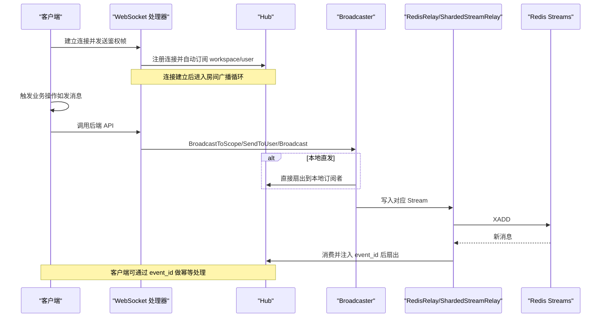
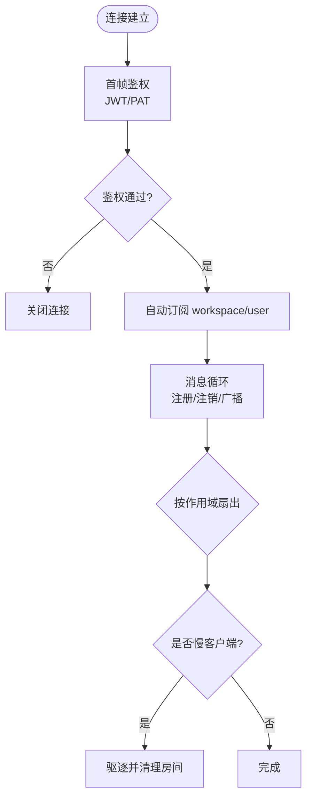
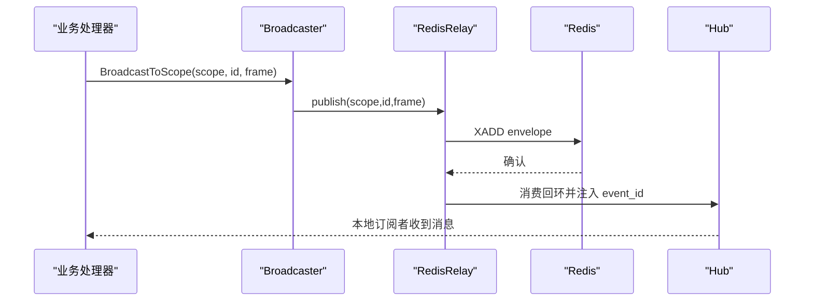
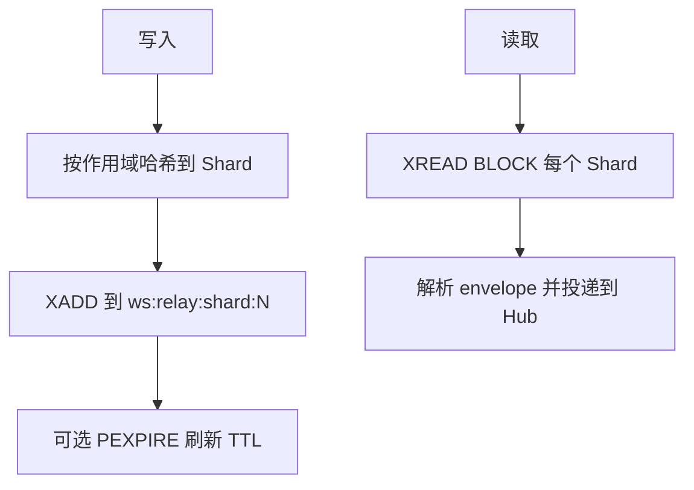
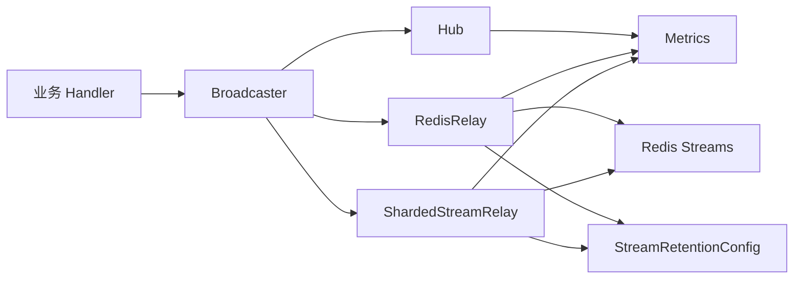

# 实时通信

<cite>
**本文引用的文件**
- [hub.go](file://server/internal/realtime/hub.go)
- [broadcaster.go](file://server/internal/realtime/broadcaster.go)
- [redis_relay.go](file://server/internal/realtime/redis_relay.go)
- [sharded_stream_relay.go](file://server/internal/realtime/sharded_stream_relay.go)
- [stream_retention.go](file://server/internal/realtime/stream_retention.go)
- [metrics.go](file://server/internal/realtime/metrics.go)
- [chat.go](file://server/internal/handler/chat.go)
- [comment.go](file://server/internal/handler/comment.go)
- [notification_preference.go](file://server/internal/handler/notification_preference.go)
</cite>

## 目录
1. [简介](#简介)
2. [项目结构](#项目结构)
3. [核心组件](#核心组件)
4. [架构总览](#架构总览)
5. [详细组件分析](#详细组件分析)
6. [依赖关系分析](#依赖关系分析)
7. [性能与扩展性](#性能与扩展性)
8. [故障排查指南](#故障排查指南)
9. [结论](#结论)
10. [附录：开发指南与调试方法](#附录开发指南与调试方法)

## 简介
本技术文档面向基于 WebSocket 的实时通信系统，覆盖连接管理、消息协议、事件分发机制，以及 Redis Stream 在跨节点广播中的作用。文档还解释聊天、评论、通知等实时功能的实现原理，客户端重连、心跳检测与错误恢复策略，并给出消息序列化、广播策略与性能优化建议，最后提供开发与调试指南。

## 项目结构
实时子系统位于 server/internal/realtime，围绕 Hub（进程内房间广播）、Broadcaster 抽象、RedisRelay（按作用域流）与 ShardedStreamRelay（固定分片流）构建。handler 层将业务事件通过 Broadcaster 投递到相应 scope，再由 Hub 或 Redis 路由到订阅者。

```mermaid
graph TB
subgraph "服务进程"
H["Hub<br/>进程内房间广播"]
B["Broadcaster 抽象"]
R["RedisRelay<br/>按作用域流"]
S["ShardedStreamRelay<br/>固定分片流"]
end
subgraph "外部存储"
RS["Redis Streams"]
end
subgraph "客户端"
C1["浏览器/桌面/移动端"]
end
C1 < --> |"WebSocket"| H
B --> H
B --> R
B --> S
R --> RS
S --> RS
RS --> |XREAD/XREADGROUP| R
RS --> |XREAD| S
```

图表来源
- [hub.go:276-345](file://server/internal/realtime/hub.go#L276-L345)
- [broadcaster.go:32-58](file://server/internal/realtime/broadcaster.go#L32-L58)
- [redis_relay.go:131-155](file://server/internal/realtime/redis_relay.go#L131-L155)
- [sharded_stream_relay.go:152-174](file://server/internal/realtime/sharded_stream_relay.go#L152-L174)

章节来源
- [hub.go:276-345](file://server/internal/realtime/hub.go#L276-L345)
- [broadcaster.go:32-58](file://server/internal/realtime/broadcaster.go#L32-L58)

## 核心组件
- Hub：维护按作用域划分的“房间”，负责本地 WebSocket 连接的注册、订阅、退订与扇出；对慢客户端进行驱逐以保护整体吞吐。
- Broadcaster：统一的事件发布接口，屏蔽底层是本地 Hub 还是 Redis 中继的实现差异。
- RedisRelay：为每个作用域创建独立 Redis Stream，按订阅生命周期启动/停止消费者，支持双写去重与特殊作用域（daemon_runtime、wecom_outbound）。
- ShardedStreamRelay：将所有事件写入固定数量的共享 Stream，按 shard 阻塞读取，降低阻塞连接数，适合高并发场景。
- StreamRetentionConfig：统一的流保留策略（长度上限、TTL、修剪窗口、维护周期），保障内存可控与可回放窗口。
- Metrics：进程内指标采集，涵盖连接、消息、订阅、Redis 状态与流观测。

章节来源
- [hub.go:221-243](file://server/internal/realtime/hub.go#L221-L243)
- [broadcaster.go:32-58](file://server/internal/realtime/broadcaster.go#L32-L58)
- [redis_relay.go:131-155](file://server/internal/realtime/redis_relay.go#L131-L155)
- [sharded_stream_relay.go:152-174](file://server/internal/realtime/sharded_stream_relay.go#L152-L174)
- [stream_retention.go:21-44](file://server/internal/realtime/stream_retention.go#L21-L44)
- [metrics.go:9-71](file://server/internal/realtime/metrics.go#L9-L71)

## 架构总览
系统采用“进程内快速路径 + 跨节点持久化”的双写模式：本地 Hub 立即推送给同进程订阅者，同时经 Redis Stream 持久化并由其他节点消费，保证水平扩展与高可用。



图表来源
- [hub.go:773-800](file://server/internal/realtime/hub.go#L773-L800)
- [redis_relay.go:270-326](file://server/internal/realtime/redis_relay.go#L270-L326)
- [sharded_stream_relay.go:250-299](file://server/internal/realtime/sharded_stream_relay.go#L250-L299)
- [broadcaster.go:32-58](file://server/internal/realtime/broadcaster.go#L32-L58)

## 详细组件分析

### Hub：连接管理与房间广播
- 连接生命周期：注册时自动订阅 workspace 与 user 作用域；断开时清理房间并触发 onLastSubscriber 回调，便于按需启停 Redis 消费者。
- 扇出策略：按作用域广播，慢客户端会被驱逐，避免拖垮整体吞吐；全局广播用于 daemon 事件。
- 鉴权与来源校验：首帧鉴权（JWT/PAT），Origin 白名单与可信代理头校验，防止 CSRF 与伪造。
- 去重：markSeen 记录最近已见 event_id，配合双写避免重复投递。



图表来源
- [hub.go:720-753](file://server/internal/realtime/hub.go#L720-L753)
- [hub.go:320-345](file://server/internal/realtime/hub.go#L320-L345)
- [hub.go:489-527](file://server/internal/realtime/hub.go#L489-L527)
- [hub.go:616-662](file://server/internal/realtime/hub.go#L616-L662)

章节来源
- [hub.go:221-243](file://server/internal/realtime/hub.go#L221-L243)
- [hub.go:320-345](file://server/internal/realtime/hub.go#L320-L345)
- [hub.go:489-527](file://server/internal/realtime/hub.go#L489-L527)
- [hub.go:616-662](file://server/internal/realtime/hub.go#L616-L662)
- [hub.go:720-753](file://server/internal/realtime/hub.go#L720-L753)

### Broadcaster：统一发布接口
- 暴露 BroadcastToScope、BroadcastToWorkspace、SendToUser、Broadcast 等方法，屏蔽底层实现。
- 定义特殊作用域常量（workspace、user、task、chat、daemon_runtime、wecom_outbound），确保类型安全的路由。

章节来源
- [broadcaster.go:3-30](file://server/internal/realtime/broadcaster.go#L3-L30)
- [broadcaster.go:32-58](file://server/internal/realtime/broadcaster.go#L32-L58)

### RedisRelay：按作用域的 Redis Stream 中继
- 写入：将消息封装为 envelope 并 XADD 到 ws:scope:{type}:{id}:stream，附带 event_id、actor_id、created_at 等元数据。
- 消费：为每个有本地订阅的作用域启动一个 XREADGROUP 消费者，按生命周期启停；支持 NOGROUP 自愈。
- 特殊作用域：daemon_runtime 与 wecom_outbound 通过 Deliverer 接口定向投递。
- 双写去重：DualWriteBroadcaster 先本地扇出再写 Redis，并通过注入 event_id 让 Hub 端去重。



图表来源
- [redis_relay.go:270-326](file://server/internal/realtime/redis_relay.go#L270-L326)
- [redis_relay.go:367-451](file://server/internal/realtime/redis_relay.go#L367-L451)
- [redis_relay.go:646-704](file://server/internal/realtime/redis_relay.go#L646-L704)

章节来源
- [redis_relay.go:17-47](file://server/internal/realtime/redis_relay.go#L17-L47)
- [redis_relay.go:131-155](file://server/internal/realtime/redis_relay.go#L131-L155)
- [redis_relay.go:270-326](file://server/internal/realtime/redis_relay.go#L270-L326)
- [redis_relay.go:367-451](file://server/internal/realtime/redis_relay.go#L367-L451)
- [redis_relay.go:646-704](file://server/internal/realtime/redis_relay.go#L646-L704)

### ShardedStreamRelay：固定分片流中继
- 写入：按 (scopeType, scopeID) 哈希到固定数量 Shard 的单一 Stream，减少阻塞连接数。
- 消费：每 Pod 每个 Shard 一个 XREAD BLOCK 循环，启动时从“回放窗口”开始，避免丢失重启期间的消息。
- 保留：统一使用 StreamRetentionConfig 控制 MAXLEN、TTL、修剪窗口与维护周期。



图表来源
- [sharded_stream_relay.go:250-299](file://server/internal/realtime/sharded_stream_relay.go#L250-L299)
- [sharded_stream_relay.go:317-337](file://server/internal/realtime/sharded_stream_relay.go#L317-L337)
- [sharded_stream_relay.go:444-479](file://server/internal/realtime/sharded_stream_relay.go#L444-L479)

章节来源
- [sharded_stream_relay.go:17-49](file://server/internal/realtime/sharded_stream_relay.go#L17-L49)
- [sharded_stream_relay.go:152-174](file://server/internal/realtime/sharded_stream_relay.go#L152-L174)
- [sharded_stream_relay.go:250-299](file://server/internal/realtime/sharded_stream_relay.go#L250-L299)
- [sharded_stream_relay.go:317-337](file://server/internal/realtime/sharded_stream_relay.go#L317-L337)
- [sharded_stream_relay.go:444-479](file://server/internal/realtime/sharded_stream_relay.go#L444-L479)

### 流保留与 TTL 管理
- 统一配置：StreamMaxLen、TrimHorizon、StreamTTL、TTLRefreshInterval、MaintenanceInterval。
- TTL 刷新：仅在必要时刷新活跃流的 TTL，空闲流允许过期；维护任务修复缺失 TTL 并修剪历史。
- 兼容与回滚：TTL 默认关闭，逐步灰度开启；旧副本不会误删活跃流。

章节来源
- [stream_retention.go:21-44](file://server/internal/realtime/stream_retention.go#L21-L44)
- [stream_retention.go:66-152](file://server/internal/realtime/stream_retention.go#L66-L152)
- [stream_retention.go:188-201](file://server/internal/realtime/stream_retention.go#L188-L201)

### 指标与可观测性
- 连接与消息：连接数、发送数、丢弃数、入站超限计数。
- 订阅与房间：按作用域的订阅/退订计数与活跃房间数。
- Redis 中继：XADD/XREAD/Ack 计数、延迟、错误、流长度与内存、无 TTL 流数量。
- 快照：提供 JSON 友好的指标快照，便于监控集成。

章节来源
- [metrics.go:9-71](file://server/internal/realtime/metrics.go#L9-L71)
- [metrics.go:197-239](file://server/internal/realtime/metrics.go#L197-L239)

## 依赖关系分析
- Hub 依赖 ScopeAuthorizer、MembershipChecker、PATResolver 进行权限与身份校验。
- Broadcaster 被业务 handler 依赖，屏蔽具体实现。
- RedisRelay/ShardedStreamRelay 依赖 Redis 客户端，分别实现不同广播拓扑。
- stream_retention 被两种中继复用，保证一致的行为。
- metrics 被各组件更新，供上层监控。



图表来源
- [broadcaster.go:32-58](file://server/internal/realtime/broadcaster.go#L32-L58)
- [redis_relay.go:131-155](file://server/internal/realtime/redis_relay.go#L131-L155)
- [sharded_stream_relay.go:152-174](file://server/internal/realtime/sharded_stream_relay.go#L152-L174)
- [stream_retention.go:21-44](file://server/internal/realtime/stream_retention.go#L21-L44)
- [metrics.go:9-71](file://server/internal/realtime/metrics.go#L9-L71)

章节来源
- [broadcaster.go:32-58](file://server/internal/realtime/broadcaster.go#L32-L58)
- [redis_relay.go:131-155](file://server/internal/realtime/redis_relay.go#L131-L155)
- [sharded_stream_relay.go:152-174](file://server/internal/realtime/sharded_stream_relay.go#L152-L174)
- [stream_retention.go:21-44](file://server/internal/realtime/stream_retention.go#L21-L44)
- [metrics.go:9-71](file://server/internal/realtime/metrics.go#L9-L71)

## 性能与扩展性
- 水平扩展：通过 Redis Stream 解耦生产者与消费者，多实例并行消费；ShardedStreamRelay 用固定分片限制阻塞连接数，提升吞吐。
- 低延迟：本地 Hub 直发作为快速路径，Redis 仅用于跨节点同步与持久化。
- 背压与保护：Hub 对慢客户端驱逐；入读限制防止 OOM；XREAD GROUP 批量读取与 ACK 保障可靠性。
- 资源控制：流保留策略（MAXLEN/TTL/修剪窗口）避免无限增长；TTL 刷新频率受控，降低 Redis 压力。
- 指标驱动：通过指标观察 XADD/XREAD 延迟、错误率、流长度与内存，指导容量规划与参数调优。

[本节为通用性能讨论，不直接分析具体文件]

## 故障排查指南
- 连接失败/鉴权失败：检查首帧鉴权逻辑与 Origin 白名单、可信代理设置；关注 inbound_too_large_total 是否激增。
- 消息未到达：核对作用域是否正确；查看 Redis 连接状态与 last_error；检查 XADD/XREAD 错误计数与延迟。
- 重复消息：确认客户端是否基于 event_id 做幂等；检查双写路径中 event_id 注入与 Hub 去重。
- 流膨胀/内存过高：检查流保留配置与 TTL 是否启用；查看 streams_without_ttl 与 stream_trimmed_total。
- 消费者异常：关注 NOGROUP 自愈次数与 XREAD 错误；必要时重启消费者或重建组。

章节来源
- [hub.go:720-753](file://server/internal/realtime/hub.go#L720-L753)
- [redis_relay.go:367-451](file://server/internal/realtime/redis_relay.go#L367-L451)
- [metrics.go:197-239](file://server/internal/realtime/metrics.go#L197-L239)

## 结论
该实时通信系统以 Hub 为核心，结合 Broadcaster 抽象与 Redis Stream 中继，实现了高性能、可扩展且可靠的跨节点广播。通过严格的作用域模型、流保留策略与完善的指标体系，系统能够支撑聊天、评论、通知等多种实时场景，并在生产环境中具备高可用性与可运维性。

[本节为总结性内容，不直接分析具体文件]

## 附录：开发指南与调试方法

### 实时功能实现要点
- 聊天：通过 chat handler 将消息写入 Broadcaster 的 chat 作用域，Hub 将消息推送至会话内所有在线用户；历史查询与草稿等能力由 handler 层提供。
- 评论：comment handler 将评论变更写入 task 或 workspace 作用域，相关成员即时看到更新；线程折叠、合并、决策等状态变化同样通过实时通道广播。
- 通知：notification preference 等设置变更后，向 user 作用域广播，确保用户设备间状态一致。

章节来源
- [chat.go](file://server/internal/handler/chat.go)
- [comment.go](file://server/internal/handler/comment.go)
- [notification_preference.go](file://server/internal/handler/notification_preference.go)

### 客户端连接的重连、心跳与错误恢复
- 重连：服务端在连接建立时要求首帧鉴权；若鉴权失败或读取超时，会关闭连接。客户端应捕获错误并重试，建议指数退避。
- 心跳：服务端使用 ping/pong 与 read deadline 检测存活；入站消息过大将被拒绝并关闭连接。
- 错误恢复：Redis 侧出现 NOGROUP 等错误时会自动重建消费者组；流 TTL 缺失会在维护任务中修复。

章节来源
- [hub.go:194-207](file://server/internal/realtime/hub.go#L194-L207)
- [hub.go:720-753](file://server/internal/realtime/hub.go#L720-L753)
- [redis_relay.go:367-451](file://server/internal/realtime/redis_relay.go#L367-L451)
- [stream_retention.go:105-152](file://server/internal/realtime/stream_retention.go#L105-L152)

### 消息序列化与广播策略
- 序列化：envelope 包含 event_id、event_type、scope、scope_id、workspace_id、actor_id、created_at、node_id、payload_json；payload_json 为原始 WebSocket 帧，保持透明传输。
- 广播策略：
  - 本地优先：DualWriteBroadcaster 先本地扇出，再写 Redis，降低端到端延迟。
  - 作用域路由：workspace/user/task/chat 等按作用域精确投递。
  - 特殊作用域：daemon_runtime 与 wecom_outbound 通过 Deliverer 定向投递，确保唯一执行者语义。

章节来源
- [redis_relay.go:35-80](file://server/internal/realtime/redis_relay.go#L35-L80)
- [redis_relay.go:646-704](file://server/internal/realtime/redis_relay.go#L646-L704)
- [broadcaster.go:3-30](file://server/internal/realtime/broadcaster.go#L3-L30)

### 调试与排错清单
- 启用并观察指标：
  - 连接与消息：connects_total、active_connections、messages_sent_total、messages_dropped_total。
  - 订阅与房间：subscribes_total、unsubscribes_total、active_scope_rooms。
  - Redis：xadd_total、xread_total、ack_total、last_xadd_lag_micros、streams_without_ttl、used_memory_bytes。
- 定位问题：
  - 若 messages_dropped_total 上升，检查 Hub 慢客户端驱逐与网络拥塞。
  - 若 xread_errors 上升，检查 Redis 连接与消费者组状态。
  - 若 streams_without_ttl > 0，检查 TTL 刷新与维护任务是否正常。
- 复现与验证：
  - 构造最小作用域（如 user/{id}）进行端到端测试。
  - 模拟断网与重连，验证 event_id 幂等与重放窗口。

章节来源
- [metrics.go:197-239](file://server/internal/realtime/metrics.go#L197-L239)
- [redis_relay.go:477-503](file://server/internal/realtime/redis_relay.go#L477-L503)
- [sharded_stream_relay.go:489-511](file://server/internal/realtime/sharded_stream_relay.go#L489-L511)