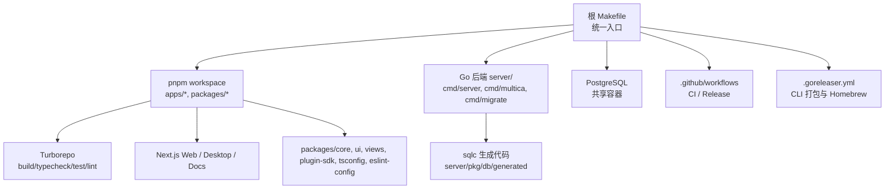
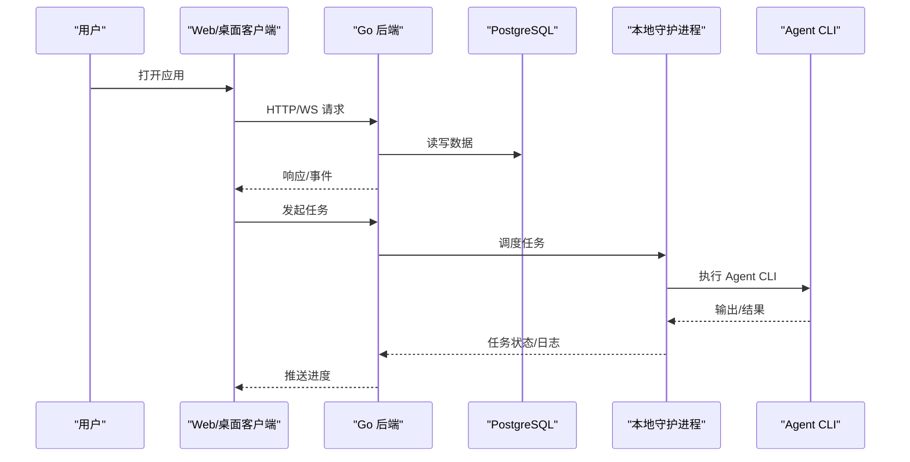
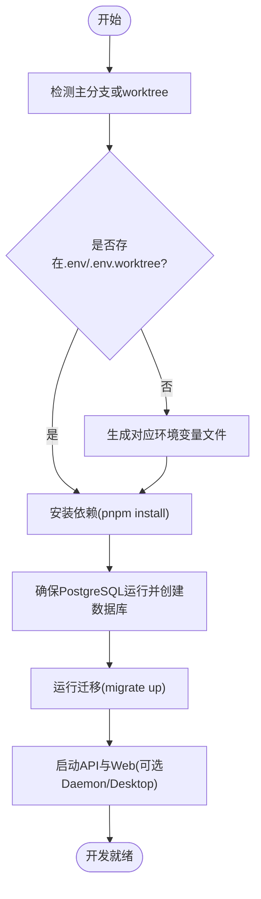
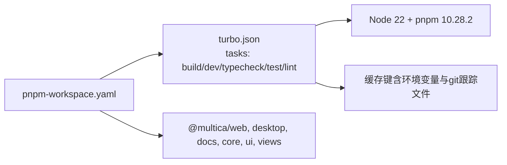
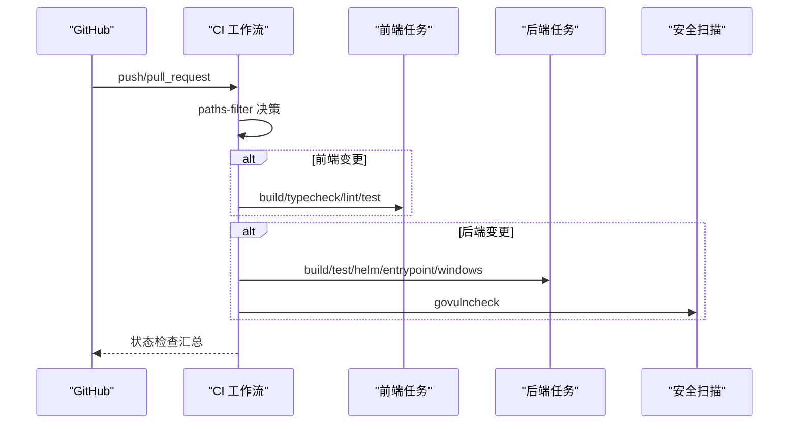
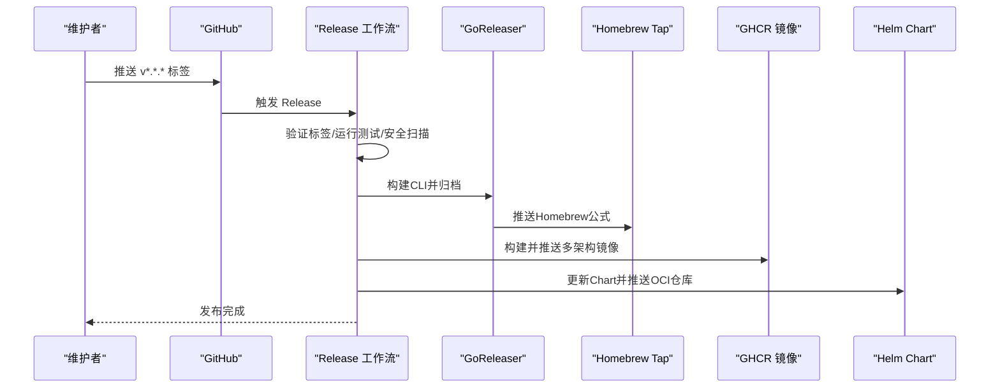
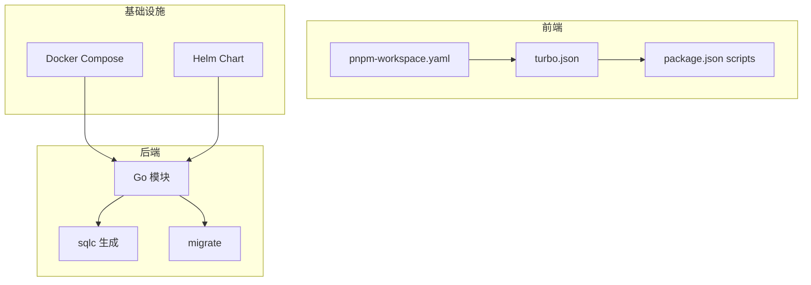

# 开发指南

<cite>
**本文引用的文件**
- [CONTRIBUTING.md](file://CONTRIBUTING.md)
- [Makefile](file://Makefile)
- [package.json](file://package.json)
- [pnpm-workspace.yaml](file://pnpm-workspace.yaml)
- [turbo.json](file://turbo.json)
- [.github/workflows/ci.yml](file://.github/workflows/ci.yml)
- [.github/workflows/release.yml](file://.github/workflows/release.yml)
- [.github/RELEASING.md](file://.github/RELEASING.md)
- [.github/PULL_REQUEST_TEMPLATE.md](file://.github/PULL_REQUEST_TEMPLATE.md)
- [.goreleaser.yml](file://.goreleaser.yml)
- [README.md](file://README.md)
</cite>

## 目录
1. [简介](#简介)
2. [项目结构](#项目结构)
3. [核心组件](#核心组件)
4. [架构总览](#架构总览)
5. [详细组件分析](#详细组件分析)
6. [依赖分析](#依赖分析)
7. [性能考虑](#性能考虑)
8. [故障排查指南](#故障排查指南)
9. [结论](#结论)
10. [附录](#附录)

## 简介
本指南面向贡献者与维护者，覆盖本地开发、Monorepo 工作流、包管理策略、代码规范与提交约定、代码审查流程、持续集成配置、调试技巧与工具推荐、新功能/修复/文档更新流程、性能优化建议、发布与版本管理，以及社区参与与治理规则。目标是让不同背景的开发者都能快速上手并高效协作。

## 项目结构
仓库采用 Monorepo：前端使用 pnpm workspaces + Turborepo，后端为 Go，数据库为 PostgreSQL，提供 Web、桌面（Electron）、移动端（Expo/iOS）应用与共享 packages。根级 Makefile 统一编排环境、构建、测试与迁移；CI 通过 GitHub Actions 执行前端、后端、SQLC 校验与安全扫描；Release 由语义化标签触发，生成 CLI、容器镜像与 Helm Chart。

**图表来源**
- [Makefile:146-376](file://Makefile#L146-L376)
- [pnpm-workspace.yaml:1-44](file://pnpm-workspace.yaml#L1-L44)
- [turbo.json:1-84](file://turbo.json#L1-L84)
- [.github/workflows/ci.yml:1-800](file://.github/workflows/ci.yml#L1-L800)
- [.goreleaser.yml:1-86](file://.goreleaser.yml#L1-L86)

**章节来源**
- [README.md:190-237](file://README.md#L190-L237)
- [Makefile:146-376](file://Makefile#L146-L376)
- [pnpm-workspace.yaml:1-44](file://pnpm-workspace.yaml#L1-L44)
- [turbo.json:1-84](file://turbo.json#L1-L84)

## 核心组件
- 环境与生命周期：通过 Makefile 的 up/down/status/list/destroy/gc/env-exec 等目标管理 API/Web/Daemon/Desktop 组件，支持主分支 checkout 与 Git worktree 隔离。
- 数据库：共享 PostgreSQL 容器，每个 checkout 独立数据库名；自动创建、迁移与重置。
- 前端工程化：pnpm workspace + Turborepo，统一 build/typecheck/test/lint；Vitest 单元测试；Playwright E2E。
- 后端工程化：Go 模块，sqlc 生成类型安全查询；migrate 管理迁移；test-go.sh 统一运行带 race 的测试。
- CI/CD：按变更路径分派任务；前端构建与测试拆分并行；后端包含 sqlc 校验与 govulncheck；Release 由语义化标签驱动，构建多架构镜像与 Helm Chart。

**章节来源**
- [Makefile:146-376](file://Makefile#L146-L376)
- [CONTRIBUTING.md:112-161](file://CONTRIBUTING.md#L112-L161)
- [CONTRIBUTING.md:344-386](file://CONTRIBUTING.md#L344-L386)
- [.github/workflows/ci.yml:14-166](file://.github/workflows/ci.yml#L14-L166)
- [.github/workflows/ci.yml:450-590](file://.github/workflows/ci.yml#L450-L590)

## 架构总览
下图展示从浏览器到后端、数据库与本地守护进程的交互关系，以及 CI/Release 在流水线中的位置。

**图表来源**
- [README.md:190-219](file://README.md#L190-L219)
- [Makefile:183-190](file://Makefile#L183-L190)

## 详细组件分析

### 开发与贡献流程
- 首次设置：复制 .env.example 到 .env；或在工作区中生成 .env.worktree；确保 Node 22、pnpm 10.28.2、Go 1.26.x、Docker 已安装。
- 一键启动：make dev 自动检测环境、安装依赖、确保数据库、运行迁移、启动后端与前端。
- 工作区隔离：每个 worktree 拥有独立数据库名与应用端口；通过 make worktree-env 生成配置，避免误用主库。
- 日常命令：start-main/start-worktree、stop-*、check-main/check-worktree、db-up/db-down、db-reset/db-drop。
- 完整栈测试：make up C=api,web,daemon 可拉起后端、前端与守护进程，完成端到端验证。

**图表来源**
- [Makefile:195-218](file://Makefile#L195-L218)
- [CONTRIBUTING.md:163-214](file://CONTRIBUTING.md#L163-L214)

**章节来源**
- [CONTRIBUTING.md:31-60](file://CONTRIBUTING.md#L31-L60)
- [CONTRIBUTING.md:112-161](file://CONTRIBUTING.md#L112-L161)
- [CONTRIBUTING.md:163-214](file://CONTRIBUTING.md#L163-L214)
- [CONTRIBUTING.md:287-342](file://CONTRIBUTING.md#L287-L342)
- [Makefile:195-218](file://Makefile#L195-L218)

### 包管理与 Monorepo 工作流
- 包范围：apps/* 与 packages/* 纳入 pnpm workspace；catalog 集中管理常用依赖版本。
- 脚本与过滤：根 package.json 提供 dev/build/test/lint 等脚本，并通过 turbo 的 filter 排除 mobile 以加速非移动相关 PR。
- Turborepo 缓存：全局依赖包含关键环境变量；mdx 任务作为前置；typecheck/test 通过 cache-inputs 边保证哈希正确性；lint 无依赖边以避免跨包副作用。
- 构建产物：Next.js 输出 .next/**，其他包输出 dist/** 或 out/**。

**图表来源**
- [pnpm-workspace.yaml:1-44](file://pnpm-workspace.yaml#L1-L44)
- [turbo.json:1-84](file://turbo.json#L1-L84)
- [package.json:1-65](file://package.json#L1-L65)

**章节来源**
- [pnpm-workspace.yaml:1-44](file://pnpm-workspace.yaml#L1-L44)
- [turbo.json:1-84](file://turbo.json#L1-L84)
- [package.json:1-65](file://package.json#L1-L65)

### 代码规范与提交约定
- 提交前检查：推荐使用 make check-main 或 make check-worktree，依次执行 TypeScript 类型检查、单元测试、Go 测试与 Playwright E2E。
- 代码风格：前端基于 ESLint（Next 配置），移动端使用 Expo 默认 ESLint；TypeScript 严格模式由各自 tsconfig 控制。
- 提交信息：遵循常规语义化提交；PR 模板要求说明问题、变更、测试步骤、风险与文档同步情况。
- AI 披露：若使用 AI 辅助编码，需在 PR 模板中披露工具与提示词，便于团队复盘与学习。

**章节来源**
- [CONTRIBUTING.md:360-386](file://CONTRIBUTING.md#L360-L386)
- [.github/PULL_REQUEST_TEMPLATE.md:1-61](file://.github/PULL_REQUEST_TEMPLATE.md#L1-L61)

### 代码审查流程
- 分支与合并：PR 仅合并至 main；CI 根据变更路径分派前端、后端与 SQLC 校验任务，全部通过后进入合并。
- 审查清单：依据 PR 模板勾选“已运行本地测试”“已更新文档”“已考虑风险”等项；如涉及 UI，需附前后对比截图。
- 自动化门禁：前端构建/测试/视图分片测试聚合为单一状态检查；后端包含测试、SQLC 校验与漏洞扫描。

**章节来源**
- [.github/workflows/ci.yml:14-166](file://.github/workflows/ci.yml#L14-L166)
- [.github/workflows/ci.yml:422-449](file://.github/workflows/ci.yml#L422-L449)
- [.github/workflows/ci.yml:571-590](file://.github/workflows/ci.yml#L571-L590)
- [.github/PULL_REQUEST_TEMPLATE.md:1-61](file://.github/PULL_REQUEST_TEMPLATE.md#L1-L61)

### 持续集成配置
- 变更探测：dorny/paths-filter 精确匹配前端、后端、SQLC 与图片预算相关文件，减少不必要任务。
- 前端流水线：构建、类型检查、Lint、Vitest 测试与视图分片并行；knip 当前为警告阶段，后续可提升为阻塞。
- 后端流水线：Go 构建、迁移、测试（含 race）、Helm 配置测试、入口信号测试、Windows 平台专项测试。
- 安全扫描：govulncheck 默认失败关闭；紧急情况下可通过仓库变量临时绕过指定标签。

**图表来源**
- [.github/workflows/ci.yml:14-166](file://.github/workflows/ci.yml#L14-L166)
- [.github/workflows/ci.yml:202-449](file://.github/workflows/ci.yml#L202-L449)
- [.github/workflows/ci.yml:450-590](file://.github/workflows/ci.yml#L450-L590)

**章节来源**
- [.github/workflows/ci.yml:14-166](file://.github/workflows/ci.yml#L14-L166)
- [.github/workflows/ci.yml:202-449](file://.github/workflows/ci.yml#L202-L449)
- [.github/workflows/ci.yml:450-590](file://.github/workflows/ci.yml#L450-L590)

### 调试技巧与开发工具
- 本地调试：
  - 使用 make api-dev/web-dev/desktop-dev 单独启动组件，配合浏览器 DevTools 与后端日志定位问题。
  - 通过 make env-exec 在当前环境上下文执行任意命令，如运行 Playwright 或查看数据库。
- 数据库调试：
  - 使用 docker compose exec postgres 进入数据库容器，列出数据库、连接与查询。
  - 需要重置时优先使用 db-reset 对当前环境数据库重建并迁移。
- 守护进程调试：
  - 本地 daemon 通过 CLI 存储的认证登录；注意守护进程必须从构建的二进制运行，而非 go run。
- 工具推荐：
  - 前端：Vitest、Playwright、ESLint、Turborepo。
  - 后端：Go test -race、sqlc、migrate、Helm。
  - 通用：Docker Compose、Makefile 封装命令。

**章节来源**
- [CONTRIBUTING.md:387-457](file://CONTRIBUTING.md#L387-L457)
- [CONTRIBUTING.md:458-585](file://CONTRIBUTING.md#L458-L585)
- [Makefile:183-190](file://Makefile#L183-L190)
- [Makefile:236-266](file://Makefile#L236-L266)

### 如何添加新功能、修复 Bug 和更新文档
- 新增功能：
  - 在 apps 或 packages 下实现逻辑，补充单测与必要 E2E 用例。
  - 若涉及 UI，更新 landing copy 与 docs 内容，并在 PR 模板中勾选相应项。
- 修复 Bug：
  - 复现问题后编写最小化测试；确保 make check-main 或 make check-worktree 通过。
  - 如涉及数据库，遵循“无外键、事务清理、并发索引”的规则，并附上迁移文件。
- 更新文档：
  - 修改 apps/docs 内容；必要时重新生成 mdx 源文件；确保 CI 中 reserved-slugs 与文档构建通过。

**章节来源**
- [.github/PULL_REQUEST_TEMPLATE.md:36-47](file://.github/PULL_REQUEST_TEMPLATE.md#L36-L47)
- [CONTRIBUTING.md:360-386](file://CONTRIBUTING.md#L360-L386)

### 性能优化建议与最佳实践
- 前端：
  - 利用 Turborepo 缓存与任务边，避免重复 typecheck 与构建；合理使用 filter 缩小影响面。
  - 关注 knip 报告，及时清理死代码与幽灵依赖。
- 后端：
  - 使用 sqlc 生成类型安全查询，减少运行时错误；迁移中使用并发索引创建。
  - 测试开启 race detector，尽早发现并发问题。
- 数据库：
  - 避免外键与级联，关系清理在应用层事务处理；迁移保持原子性与幂等。
- 守护进程：
  - 每轮 prompt 易变字段放在消息而非 brief，保障 prompt 缓存前缀稳定。

**章节来源**
- [turbo.json:23-81](file://turbo.json#L23-L81)
- [.github/workflows/ci.yml:308-312](file://.github/workflows/ci.yml#L308-L312)
- [Makefile:344-348](file://Makefile#L344-L348)

### 发布流程与版本管理
- 版本标签：仅允许 vX.Y.Z 或 vX.Y.Z-suffix 的语义化标签；禁止 dirty tag。
- 验证阶段：运行 Go 测试与 govulncheck；紧急情况下可通过仓库变量临时绕过该标签的安全扫描。
- 产物发布：
  - CLI：GoReleaser 构建多平台二进制，归档并推送到 Homebrew Tap。
  - 镜像：多架构 Docker 镜像（backend/web）通过 Buildx 构建并合并为 manifest list。
  - Helm Chart：更新 Chart.yaml 版本与 appVersion，推送至 OCI 仓库。
  - Desktop：Linux/Windows 安装包通过 electron-builder 发布至 GitHub Release。

**图表来源**
- [.github/workflows/release.yml:1-454](file://.github/workflows/release.yml#L1-L454)
- [.goreleaser.yml:1-86](file://.goreleaser.yml#L1-L86)
- [.github/RELEASING.md:1-35](file://.github/RELEASING.md#L1-L35)

**章节来源**
- [.github/workflows/release.yml:1-454](file://.github/workflows/release.yml#L1-L454)
- [.goreleaser.yml:1-86](file://.goreleaser.yml#L1-L86)
- [.github/RELEASING.md:1-35](file://.github/RELEASING.md#L1-L35)

### 社区参与与治理规则
- 许可条款：贡献即同意 Multica License（Apache 2.0 附加条件），可用于商业目的，许可证可由生产者调整。
- 行为准则：遵循 PR 模板与 CI 门禁；如涉及中文产品文案，对照术语与混合规则校对。
- 讨论渠道：通过 Issue 模板报告缺陷或提出需求；使用 Discord/X 等平台获取支持与公告。

**章节来源**
- [CONTRIBUTING.md:16-29](file://CONTRIBUTING.md#L16-L29)
- [.github/PULL_REQUEST_TEMPLATE.md:36-47](file://.github/PULL_REQUEST_TEMPLATE.md#L36-L47)
- [README.md:17-23](file://README.md#L17-L23)

## 依赖分析
- 前端依赖：pnpm catalog 统一管理 React、Tailwind、Vitest、Zustand 等；Turborepo 负责任务图与缓存。
- 后端依赖：Go 模块依赖 sqlc、gorilla/websocket、Chi 路由；测试依赖 Redis 与 Postgres 服务。
- 基础设施：Docker Compose 提供 PostgreSQL；Helm 用于自托管部署。

**图表来源**
- [pnpm-workspace.yaml:1-44](file://pnpm-workspace.yaml#L1-L44)
- [turbo.json:1-84](file://turbo.json#L1-L84)
- [Makefile:353-364](file://Makefile#L353-L364)

**章节来源**
- [pnpm-workspace.yaml:1-44](file://pnpm-workspace.yaml#L1-L44)
- [turbo.json:1-84](file://turbo.json#L1-L84)
- [Makefile:353-364](file://Makefile#L353-L364)

## 性能考虑
- 缓存与并行：充分利用 Turborepo 的任务缓存与并行执行；CI 中拆分前端构建与测试以降低墙钟时间。
- 资源限制：图像预算检查防止大体积位图入库；按需运行 knip 以减少依赖膨胀。
- 数据库：迁移中索引创建使用并发方式，避免锁表；应用层事务处理关系清理，降低数据库负担。
- 守护进程：prompt 缓存前缀稳定，减少重复计算；任务目录隔离，避免竞争与冲突。

[本节为通用指导，不直接分析具体文件]

## 故障排查指南
- 环境问题：
  - 缺少环境变量：根据提示创建 .env 或 .env.worktree；确认 POSTGRES_DB、DATABASE_URL、PORT、FRONTEND_PORT。
  - 端口冲突：使用 make status/list 查看占用；必要时销毁并重建环境。
- 数据库问题：
  - 列表数据库：docker compose exec postgres 执行查询；确认 worktree 未误用主库。
  - 重置数据库：使用 db-reset 对当前环境重建并迁移；谨慎使用 db-drop。
- 守护进程问题：
  - 必须从构建的二进制运行；避免 go run 导致二进制被删除。
  - 守护进程内不允许再次启动 daemon；如需调试，先停止现有进程。
- CI 失败：
  - 查看变更路径是否命中预期任务；必要时扩大过滤范围或修正脚本。
  - 安全扫描失败：记录原因并按 RELEASING 流程申请临时绕过（仅限紧急情况）。

**章节来源**
- [CONTRIBUTING.md:458-585](file://CONTRIBUTING.md#L458-L585)
- [.github/RELEASING.md:13-35](file://.github/RELEASING.md#L13-L35)

## 结论
本指南总结了 Multica 的开发工作流、Monorepo 策略、代码规范、CI/Release 配置与调试方法。遵循这些实践可以显著提升协作效率与交付质量。建议新贡献者先从 make dev 开始，逐步熟悉工作区隔离、测试与发布流程；维护者应持续关注 CI 状态、安全扫描与文档同步。

## 附录
- 常用命令速查：
  - 环境：make up/down/status/list/destroy/gc/env-exec
  - 应用：make start-main/start-worktree、make stop-*、make check-main/check-worktree
  - 数据库：make db-up/db-down、make db-reset/db-drop
  - 构建与测试：make build/test/sqlc
- 参考文档：
  - README 中的架构与开发指引
  - CONTRIBUTING 中的详细工作流与故障排查
  - CI/Release 工作流与发布手册

[本节为概览性内容，不直接分析具体文件]