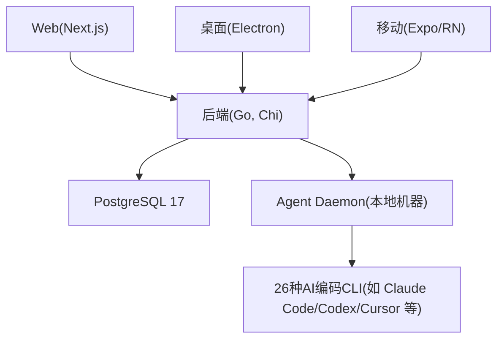
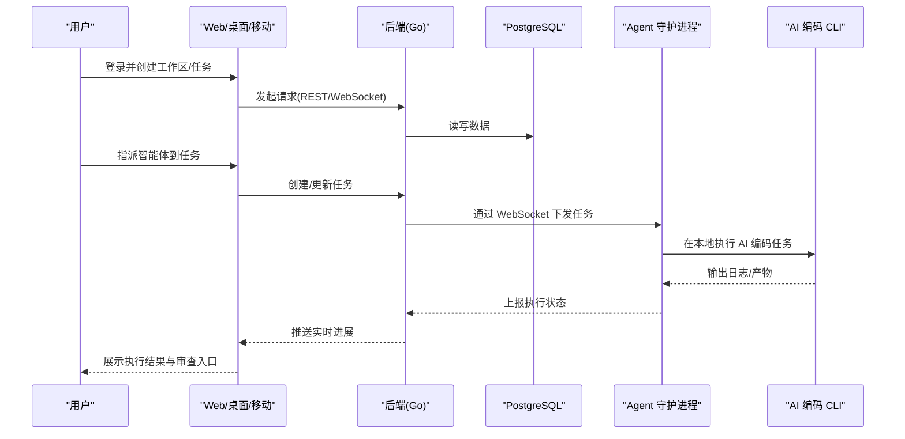
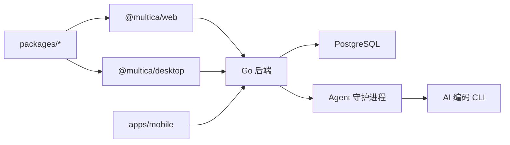

# 快速开始

<cite>
**本文引用的文件**
- [README.md](file://README.md)
- [SELF_HOSTING.md](file://SELF_HOSTING.md)
- [docker-compose.selfhost.yml](file://docker-compose.selfhost.yml)
- [Makefile](file://Makefile)
- [scripts/dev.sh](file://scripts/dev.sh)
- [CONTRIBUTING.md](file://CONTRIBUTING.md)
- [.env.example](file://.env.example)
- [package.json](file://package.json)
- [apps/web/package.json](file://apps/web/package.json)
- [server/go.mod](file://server/go.mod)
- [docker-compose.yml](file://docker-compose.yml)
</cite>

## 目录
1. [简介](#简介)
2. [项目结构](#项目结构)
3. [核心组件](#核心组件)
4. [架构总览](#架构总览)
5. [详细组件分析](#详细组件分析)
6. [依赖关系分析](#依赖关系分析)
7. [性能注意事项](#性能注意事项)
8. [故障排除指南](#故障排除指南)
9. [结论](#结论)
10. [附录](#附录)

## 简介
本指南面向首次接触 Multica 的用户，帮助你在最短时间内完成以下目标：
- 注册并使用 Multica Cloud（在线服务）
- 下载并安装桌面应用，自动连接本机为运行时代码执行器
- 自托管部署后端与前端（Docker Compose 或 Helm）
- 搭建本地开发环境（Node.js、pnpm、Go、Docker）
- 连接运行时代码执行器、创建第一个 AI 代理、分配任务并查看执行结果
- 常见问题的定位与解决

Multica 将智能体作为“一等公民”的团队成员：指派问题、自动领取、在受控运行时中工作、评论进度、提交审查。你可在浏览器、桌面端或移动端体验同一工作区。

**章节来源**
- [README.md:38-92](file://README.md#L38-L92)
- [README.md:95-143](file://README.md#L95-L143)

## 项目结构
仓库采用多包/多应用单体组织：
- apps/web：Next.js 前端（App Router）
- apps/desktop：Electron 桌面端（复用 Web UI 包）
- apps/mobile：Expo/React Native 移动端
- server：Go 后端（Chi + sqlc + gorilla/websocket），提供 REST API 与 WebSocket
- packages：共享包（core、ui、views 等）
- deploy/helm：Kubernetes Helm Chart
- docker-compose.*：自托管编排（PostgreSQL、后端、前端）
- scripts：安装与开发脚本（含一键启动、环境检测、迁移等）

**图示来源**
- [README.md:190-218](file://README.md#L190-L218)
- [docker-compose.selfhost.yml:35-214](file://docker-compose.selfhost.yml#L35-L214)

**章节来源**
- [README.md:190-218](file://README.md#L190-L218)
- [docker-compose.selfhost.yml:35-214](file://docker-compose.selfhost.yml#L35-L214)

## 核心组件
- 后端服务：Go 实现，REST + WebSocket；负责认证、工作区/任务/智能体管理、调度、存储等
- 前端应用：Next.js 16，提供 Web、桌面、移动端统一界面
- 数据库：PostgreSQL 17（pgcrypto、pg_trgm）
- Agent 守护进程：运行在你本机，发现已安装的 AI CLI，接收任务并在本地执行
- 运行时：支持约 26 种编码智能体 CLI（Claude Code、Codex、Cursor 等）

**章节来源**
- [README.md:147-169](file://README.md#L147-L169)
- [README.md:190-218](file://README.md#L190-L218)

## 架构总览
下图展示了从浏览器/桌面到后端、数据库以及本地守护进程与 AI CLI 的交互路径。

**图示来源**
- [README.md:190-218](file://README.md#L190-L218)
- [docker-compose.selfhost.yml:55-214](file://docker-compose.selfhost.yml#L55-L214)

## 详细组件分析

### 使用方式一：注册并使用 Multica Cloud
- 访问 multica.ai 注册账号
- 在浏览器或桌面端连接你的计算机作为运行时代码执行器
- 创建智能体并指派任务，即可看到执行日志与结果

要点：
- 无需终端：注册后直接可用
- 桌面端会自动把本机注册为运行时代码执行器
- 需要在本机安装至少一个支持的 AI 编码 CLI（如 Claude Code、Codex、Cursor 等）

**章节来源**
- [README.md:95-143](file://README.md#L95-L143)
- [README.md:147-169](file://README.md#L147-L169)

### 使用方式二：下载桌面应用
- 下载 Multica Desktop（macOS/Windows/Linux）
- 登录后自动检测本机已安装的 AI 编码 CLI
- 在侧边栏“运行时代码执行器”中添加/管理机器
- 创建智能体并指派任务

**章节来源**
- [README.md:95-143](file://README.md#L95-L143)

### 使用方式三：自托管部署（推荐：Docker Compose）
- 安装 Docker 与 Docker Compose
- 一键安装 CLI 并配置自托管服务器
- 启动后端与前端，默认端口：前端 3000，后端 8080
- 登录方式：
  - 推荐：配置邮件发送（RESEND_API_KEY）
  - 未配置邮件时：后端日志会打印一次性验证码
  - 本地测试：设置 APP_ENV=development 与 MULTICA_DEV_VERIFICATION_CODE

常用命令：
- 一键安装并启动：见下方“快速安装”
- 手动启动：make selfhost / make selfhost-build
- 停止：make selfhost-stop

环境变量关键项（节选）：
- JWT_SECRET（必须）
- RESEND_API_KEY（可选，用于邮件验证码）
- MULTICA_DEV_VERIFICATION_CODE（仅开发模式有效）
- PORT/FRONTEND_PORT（可覆盖）
- DATABASE_URL（指向 PostgreSQL）

**章节来源**
- [SELF_HOSTING.md:15-169](file://SELF_HOSTING.md#L15-L169)
- [docker-compose.selfhost.yml:35-214](file://docker-compose.selfhost.yml#L35-L214)
- [.env.example:32-101](file://.env.example#L32-L101)

### 使用方式四：Kubernetes 部署（Helm）
- 使用官方 OCI Helm Chart 或源码 Chart
- 创建命名空间、Secret、Ingress
- 升级/回滚/删除资源
- 登录流程与 Docker Compose 一致（邮件验证码/开发验证码）

**章节来源**
- [SELF_HOSTING.md:172-371](file://SELF_HOSTING.md#L172-L371)

### 开发环境搭建（本地）
前置依赖：
- Node.js 22
- pnpm 10.28.2
- Go 1.26.6
- Docker

快速启动：
- 单命令启动：make dev
  - 自动检测环境、生成 .env/.env.worktree、安装依赖、确保 PostgreSQL、运行迁移、启动后端与前端
- 分步启动：
  - 准备环境：make setup-main 或 make setup-worktree
  - 启动：make start-main 或 make start-worktree
  - 停止：make stop-main 或 make stop-worktree
  - 检查：make check-main 或 make check-worktree

说明：
- 主分支使用 .env，worktree 使用 .env.worktree
- 所有 checkout 共享同一个 PostgreSQL 容器，但数据库隔离
- 可通过 make up C=api,web,daemon 拉起完整栈（包含本地 daemon）

**章节来源**
- [CONTRIBUTING.md:43-49](file://CONTRIBUTING.md#L43-L49)
- [CONTRIBUTING.md:163-183](file://CONTRIBUTING.md#L163-L183)
- [scripts/dev.sh:7-18](file://scripts/dev.sh#L7-L18)
- [scripts/dev.sh:20-68](file://scripts/dev.sh#L20-L68)
- [Makefile:149-187](file://Makefile#L149-L187)
- [Makefile:195-218](file://Makefile#L195-L218)

### 连接运行时代码执行器
- 在 Web 或桌面端打开“运行时代码执行器”，添加本机或远程机器
- 粘贴终端命令以注册该机器
- 确认守护进程状态：multica daemon status
- 确保本机已安装并登录至少一个 AI 编码 CLI

**章节来源**
- [README.md:126-143](file://README.md#L126-L143)
- [SELF_HOSTING.md:99-169](file://SELF_HOSTING.md#L99-L169)

### 创建第一个 AI 代理并分配任务
步骤概览：
1. 登录（Cloud 或自托管）
2. 连接运行时代码执行器
3. 创建智能体（选择运行时代码执行器与提供商，命名）
4. 创建问题并将智能体设为指派人
5. 智能体会自动领取任务、在工作区执行、评论进展、完成后进入审查

**章节来源**
- [README.md:126-143](file://README.md#L126-L143)

### 查看执行结果
- 在“任务”页面回放每一步工具调用、命令与错误（带时间戳）
- 查看每个运行的 Token 用量
- 审查工作成果，决定是否合入

**章节来源**
- [README.md:70-79](file://README.md#L70-L79)

## 依赖关系分析
- 前端依赖 Next.js、React、TanStack Query、Zustand 等
- 后端依赖 Go 1.26.6、Chi、sqlc、gorilla/websocket、PostgreSQL 驱动等
- 自托管通过 Docker Compose 编排 PostgreSQL、后端、前端
- 开发脚本校验 Node/pnpm/Go/Docker 并自动初始化环境

**图示来源**
- [package.json:1-65](file://package.json#L1-L65)
- [apps/web/package.json:1-48](file://apps/web/package.json#L1-L48)
- [server/go.mod:1-84](file://server/go.mod#L1-L84)
- [docker-compose.selfhost.yml:35-214](file://docker-compose.selfhost.yml#L35-L214)

**章节来源**
- [package.json:1-65](file://package.json#L1-L65)
- [apps/web/package.json:1-48](file://apps/web/package.json#L1-L48)
- [server/go.mod:1-84](file://server/go.mod#L1-L84)

## 性能注意事项
- 自托管生产建议启用 Redis 用于速率限制、实时中继与缓存（可选）
- 合理设置数据库连接池大小与超时参数
- 控制并发任务数与重试策略，避免过载
- 使用反向代理终止 TLS，保护后端与前端端口
- 对 WeCom 智能机器人场景，注意副本数量与长连接租约限制

[本节为通用指导，不直接分析具体文件]

## 故障排除指南
常见问题与处理：
- 缺少环境变量：确保 .env 存在且包含必要项（如 JWT_SECRET）
- 端口冲突：修改 PORT/FRONTEND_PORT 或使用 worktree 独立端口
- 数据库不可达：检查 DATABASE_URL、PostgreSQL 容器是否运行
- 登录验证码：未配置邮件时查看后端日志中的验证码；或设置开发固定验证码
- 守护进程未运行：multica daemon status；必要时重启
- 无法拉取镜像：若官方镜像未发布，使用 make selfhost-build 从源码构建
- 权限/路径问题：确保 CLI 二进制在 PATH 中，工作目录有写权限

参考命令：
- 查看服务状态：make status
- 停止/启动：make down / make up
- 重置数据库：make db-reset（谨慎操作）
- 查看日志：docker compose logs

**章节来源**
- [SELF_HOSTING.md:87-169](file://SELF_HOSTING.md#L87-L169)
- [Makefile:157-187](file://Makefile#L157-L187)
- [Makefile:236-266](file://Makefile#L236-L266)
- [.env.example:32-101](file://.env.example#L32-L101)

## 结论
通过本指南，你可以：
- 快速注册并使用 Multica Cloud
- 安装桌面应用并连接本机作为运行时代码执行器
- 自托管部署后端与前端，或在 Kubernetes 上运行
- 搭建本地开发环境，进行全栈调试
- 创建智能体、分配任务、查看执行结果与审查

如需深入，请参考文档中心的概念、教程与高级配置。

[本节为总结性内容，不直接分析具体文件]

## 附录

### 快速安装（自托管）
- macOS/Linux：
  - 安装 CLI 并配置自托管服务器
  - 启动服务后访问 http://localhost:3000
- Windows（PowerShell）：
  - 设置环境变量后执行 PowerShell 安装脚本
  - 后续步骤同上

**章节来源**
- [SELF_HOSTING.md:15-57](file://SELF_HOSTING.md#L15-L57)
- [SELF_HOSTING.md:64-85](file://SELF_HOSTING.md#L64-L85)

### 开发环境一键启动
- 前置：Node.js、pnpm、Go、Docker
- 命令：make dev
- 说明：自动检测环境、安装依赖、确保数据库、运行迁移、启动后端与前端

**章节来源**
- [CONTRIBUTING.md:163-183](file://CONTRIBUTING.md#L163-L183)
- [scripts/dev.sh:7-18](file://scripts/dev.sh#L7-L18)
- [scripts/dev.sh:20-68](file://scripts/dev.sh#L20-L68)

### 常用环境变量（节选）
- JWT_SECRET：必须，JWT 签名密钥
- RESEND_API_KEY：可选，邮件验证码
- MULTICA_DEV_VERIFICATION_CODE：开发模式固定验证码
- PORT/FRONTEND_PORT：后端/前端端口
- DATABASE_URL：数据库连接串
- CORS_ALLOWED_ORIGINS：允许的跨域来源
- NEXT_PUBLIC_API_URL/NEXT_PUBLIC_WS_URL：前端使用的 API/WebSocket 地址

**章节来源**
- [.env.example:32-101](file://.env.example#L32-L101)
- [.env.example:593-603](file://.env.example#L593-L603)