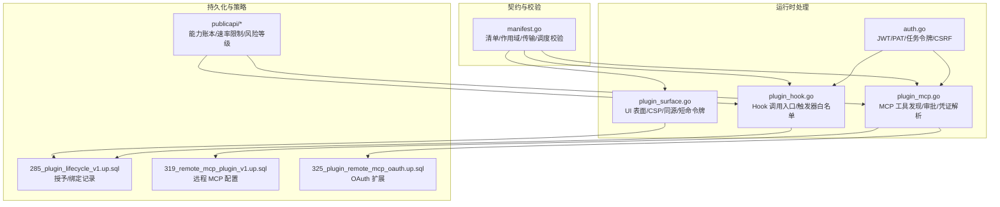
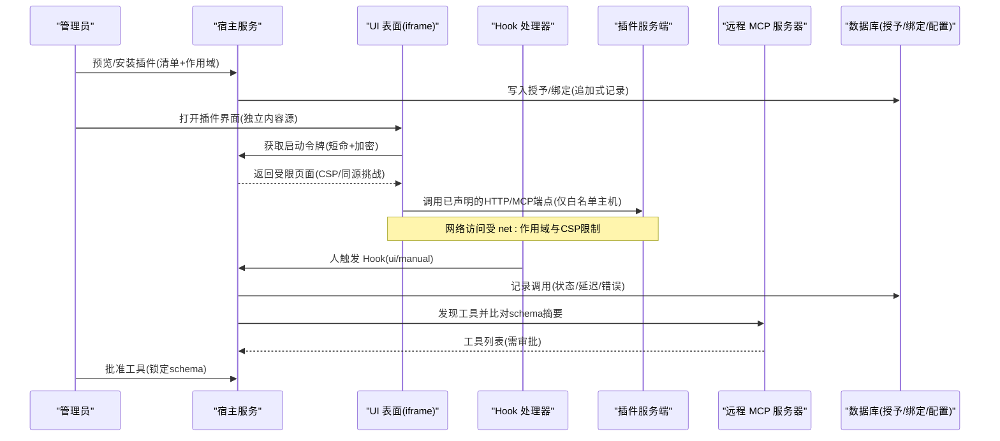
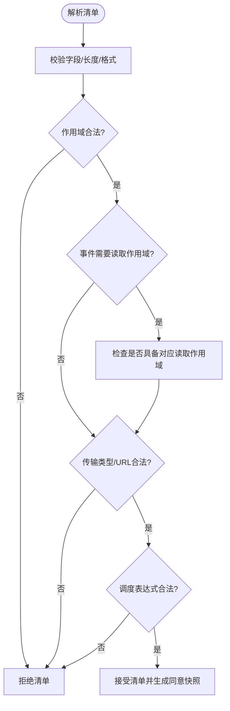
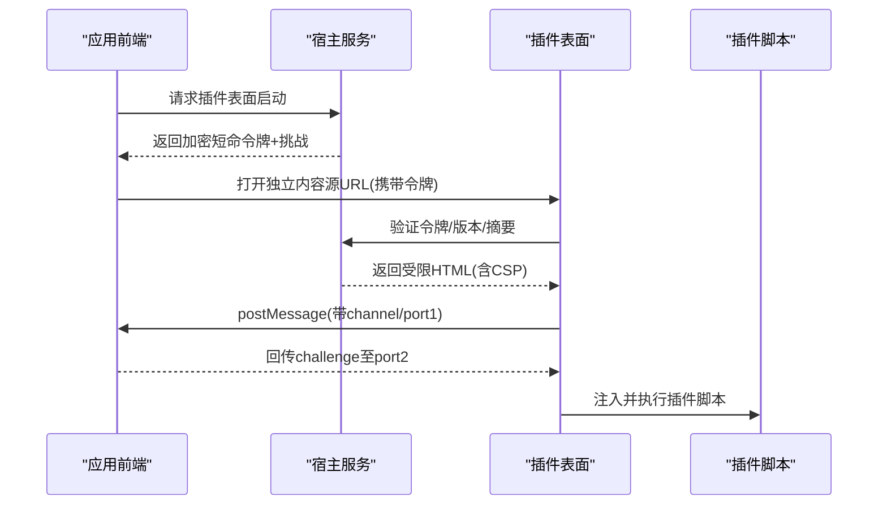
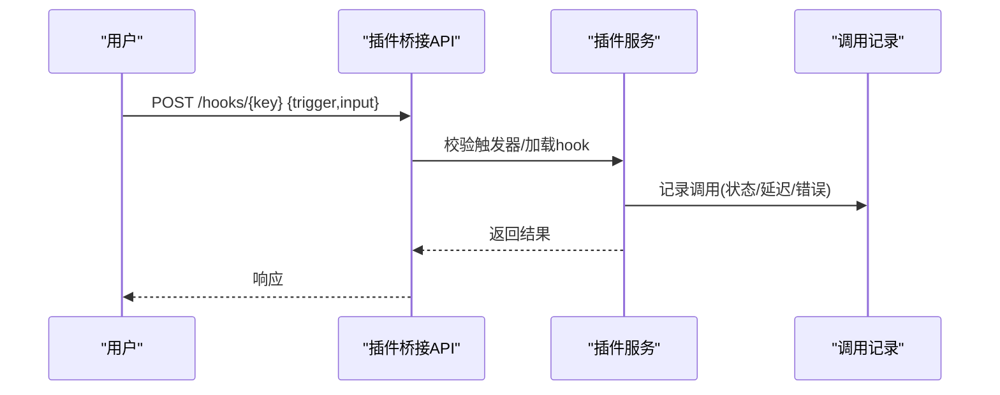
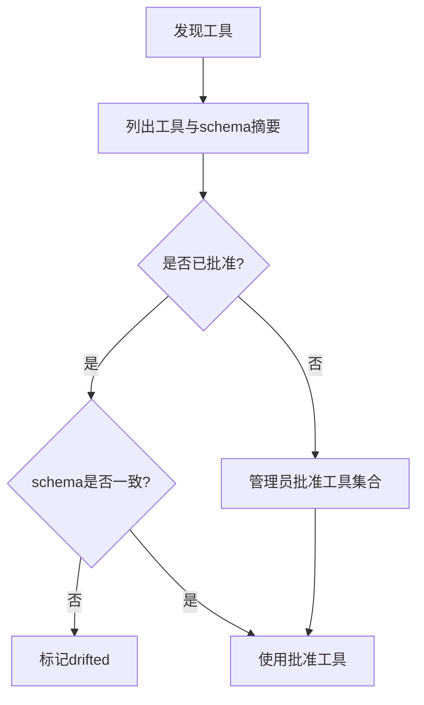
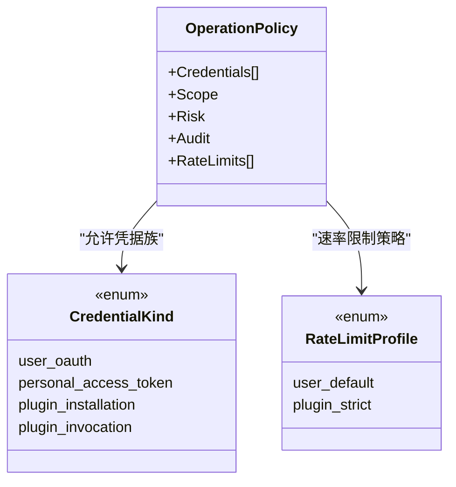
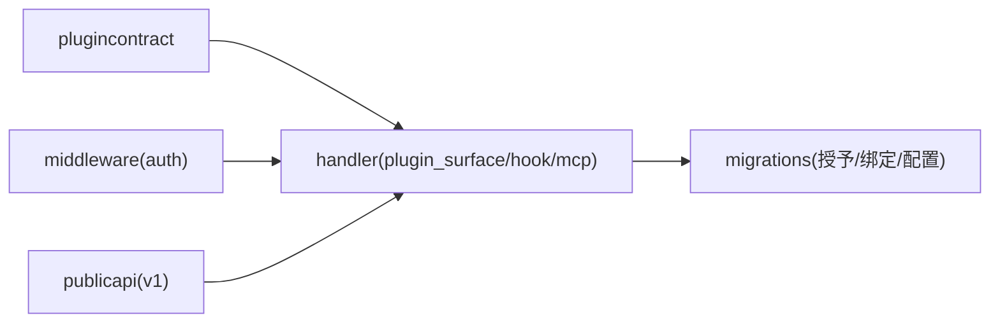

# 安全模型

<cite>
**本文引用的文件**
- [server/pkg/plugincontract/manifest.go](file://server/pkg/plugincontract/manifest.go)
- [server/internal/handler/plugin_surface.go](file://server/internal/handler/plugin_surface.go)
- [server/internal/handler/plugin_hook.go](file://server/internal/handler/plugin_hook.go)
- [server/internal/handler/plugin_mcp.go](file://server/internal/handler/plugin_mcp.go)
- [server/internal/middleware/auth.go](file://server/internal/middleware/auth.go)
- [server/pkg/publicapi/v1/foundation.go](file://server/pkg/publicapi/v1/foundation.go)
- [server/pkg/publicapi/v1/routes.go](file://server/pkg/publicapi/v1/routes.go)
- [server/pkg/publicapi/v1/README.md](file://server/pkg/publicapi/v1/README.md)
- [server/migrations/285_plugin_lifecycle_v1.up.sql](file://server/migrations/285_plugin_lifecycle_v1.up.sql)
- [server/migrations/319_remote_mcp_plugin_v1.up.sql](file://server/migrations/319_remote_mcp_plugin_v1.up.sql)
- [server/migrations/325_plugin_remote_mcp_oauth.up.sql](file://server/migrations/325_plugin_remote_mcp_oauth.up.sql)
- [server/pkg/remotemcp/devorigin.go](file://server/pkg/remotemcp/devorigin.go)
- [server/pkg/agent/hermes.go](file://server/pkg/agent/hermes.go)
- [apps/desktop/src/main/navigation-guard.ts](file://apps/desktop/src/main/navigation-guard.ts)
</cite>

## 目录
1. [简介](#简介)
2. [项目结构](#项目结构)
3. [核心组件](#核心组件)
4. [架构总览](#架构总览)
5. [详细组件分析](#详细组件分析)
6. [依赖关系分析](#依赖关系分析)
7. [性能与安全权衡](#性能与安全权衡)
8. [故障排查指南](#故障排查指南)
9. [结论](#结论)
10. [附录：配置与最佳实践](#附录配置与最佳实践)

## 简介
本文件系统化阐述 Multica 插件安全模型，覆盖沙箱隔离、权限模型、认证授权、输入输出校验、恶意插件防护、审计日志以及部署最佳实践。重点围绕以下方面：
- 插件沙箱：UI 表面（iframe）的 CSP 与同源策略、网络白名单、资源加载限制；Agent 执行环境的文件系统与网络能力受控。
- 权限模型：基于 manifest 的能力声明、安装时审批的最小权限原则、作用域绑定与撤销。
- 认证与授权：插件安装令牌、调用令牌、MCP 连接凭证、用户/工作区级鉴权。
- 输入验证与输出过滤：清单严格解析、URL/路径/域名白名单、CSP 生成、敏感字段脱敏。
- 恶意插件检测与防护：清单尺寸与语法限制、传输协议强制 HTTPS、工具集 schema 指纹锁定、开发环境白名单。
- 审计与日志：操作策略标记、不可变变更记录、调用记录查询。
- 安全配置与最佳实践：最小权限、专用内容源、密钥轮换、超时与频率限制。

## 项目结构
从安全视角看，插件系统由“契约定义 + 运行时处理 + 持久化策略”三层组成：
- 契约层：plugincontract 定义清单、作用域、触发器、传输类型等，集中进行强约束校验。
- 运行时层：handler 提供 UI 表面、Hook 调用、MCP 工具发现与审批、插件生命周期管理。
- 持久化层：迁移脚本维护安装、授予、绑定、配置等不可变或追加式记录，支撑可追溯审计。

图表来源
- [server/pkg/plugincontract/manifest.go:15-106](file://server/pkg/plugincontract/manifest.go#L15-L106)
- [server/internal/handler/plugin_surface.go:24-29](file://server/internal/handler/plugin_surface.go#L24-L29)
- [server/internal/handler/plugin_hook.go:22-31](file://server/internal/handler/plugin_hook.go#L22-L31)
- [server/internal/handler/plugin_mcp.go:13-31](file://server/internal/handler/plugin_mcp.go#L13-L31)
- [server/internal/middleware/auth.go:34-51](file://server/internal/middleware/auth.go#L34-L51)
- [server/migrations/285_plugin_lifecycle_v1.up.sql:105-128](file://server/migrations/285_plugin_lifecycle_v1.up.sql#L105-L128)
- [server/migrations/319_remote_mcp_plugin_v1.up.sql:31-58](file://server/migrations/319_remote_mcp_plugin_v1.up.sql#L31-L58)
- [server/migrations/325_plugin_remote_mcp_oauth.up.sql:1-18](file://server/migrations/325_plugin_remote_mcp_oauth.up.sql#L1-L18)
- [server/pkg/publicapi/v1/foundation.go:11-73](file://server/pkg/publicapi/v1/foundation.go#L11-L73)

章节来源
- [server/pkg/plugincontract/manifest.go:15-106](file://server/pkg/plugincontract/manifest.go#L15-L106)
- [server/internal/handler/plugin_surface.go:24-29](file://server/internal/handler/plugin_surface.go#L24-L29)
- [server/internal/handler/plugin_hook.go:22-31](file://server/internal/handler/plugin_hook.go#L22-L31)
- [server/internal/handler/plugin_mcp.go:13-31](file://server/internal/handler/plugin_mcp.go#L13-L31)
- [server/internal/middleware/auth.go:34-51](file://server/internal/middleware/auth.go#L34-L51)
- [server/migrations/285_plugin_lifecycle_v1.up.sql:105-128](file://server/migrations/285_plugin_lifecycle_v1.up.sql#L105-L128)
- [server/migrations/319_remote_mcp_plugin_v1.up.sql:31-58](file://server/migrations/319_remote_mcp_plugin_v1.up.sql#L31-L58)
- [server/migrations/325_plugin_remote_mcp_oauth.up.sql:1-18](file://server/migrations/325_plugin_remote_mcp_oauth.up.sql#L1-L18)
- [server/pkg/publicapi/v1/foundation.go:11-73](file://server/pkg/publicapi/v1/foundation.go#L11-L73)

## 核心组件
- 插件契约与校验：对清单字段、作用域、触发器、事件、调度、传输 URL、相对路径等进行强约束，拒绝未知字段与越界值，确保管理员同意的范围不被篡改。
- UI 表面（iframe）安全：独立内容源、加密短命令牌、严格 CSP、禁止应用凭据进入内容源、同源挑战握手。
- Hook 调用入口：仅允许已声明的触发器，区分人触发的同步调用与异步事件派发，限制浏览器直接驱动非预期触发器。
- MCP 工具治理：动态发现工具并基于 schema 摘要进行审批锁定，支持 OAuth 等认证方式，开发环境通过环境变量放宽但保持 HTTPS。
- 认证中间件：统一处理 JWT、PAT、任务令牌、云节点 PAT，设置可信头部，防止伪造身份穿越。
- 公共 API 能力账本：为每条路由声明凭据族、作用域、风险等级、审计状态与速率限制，插件请求走更严格策略。

章节来源
- [server/pkg/plugincontract/manifest.go:356-446](file://server/pkg/plugincontract/manifest.go#L356-L446)
- [server/internal/handler/plugin_surface.go:149-265](file://server/internal/handler/plugin_surface.go#L149-L265)
- [server/internal/handler/plugin_hook.go:31-94](file://server/internal/handler/plugin_hook.go#L31-L94)
- [server/internal/handler/plugin_mcp.go:31-100](file://server/internal/handler/plugin_mcp.go#L31-L100)
- [server/internal/middleware/auth.go:51-267](file://server/internal/middleware/auth.go#L51-L267)
- [server/pkg/publicapi/v1/foundation.go:11-73](file://server/pkg/publicapi/v1/foundation.go#L11-L73)
- [server/pkg/publicapi/v1/routes.go:1-55](file://server/pkg/publicapi/v1/routes.go#L1-L55)

## 架构总览
下图展示插件在宿主中的安全边界与数据流：管理员审批清单与作用域，UI 表面在独立内容源中运行并通过 CSP 限制网络；Hook 调用经中间件鉴权后转发到插件服务端；MCP 工具需经 schema 摘要审批；所有关键决策写入不可变表以支持审计。

图表来源
- [server/pkg/plugincontract/manifest.go:448-492](file://server/pkg/plugincontract/manifest.go#L448-L492)
- [server/internal/handler/plugin_surface.go:149-265](file://server/internal/handler/plugin_surface.go#L149-L265)
- [server/internal/handler/plugin_hook.go:31-94](file://server/internal/handler/plugin_hook.go#L31-L94)
- [server/internal/handler/plugin_mcp.go:31-100](file://server/internal/handler/plugin_mcp.go#L31-L100)
- [server/migrations/285_plugin_lifecycle_v1.up.sql:105-128](file://server/migrations/285_plugin_lifecycle_v1.up.sql#L105-L128)

## 详细组件分析

### 插件清单与权限模型
- 能力声明：清单中的 scopes、hooks、surfaces、resources 必须显式声明，未知字段拒绝。
- 作用域控制：固定作用域与 net: 域名作用域；事件订阅需具备对应读取作用域，避免“推送绕过读取”。
- 调度限制：cron 表达式需合法且不低于最小间隔，防止高频出站流量。
- 传输限制：仅允许 http/mcp，URL 必须为纯 HTTPS，主机必须在 net: 作用域内精确匹配。
- 最小权限：安装时管理员选择 granted_scopes；后续变更需二次同意。

图表来源
- [server/pkg/plugincontract/manifest.go:356-446](file://server/pkg/plugincontract/manifest.go#L356-L446)
- [server/pkg/plugincontract/manifest.go:448-492](file://server/pkg/plugincontract/manifest.go#L448-L492)
- [server/pkg/plugincontract/manifest.go:547-707](file://server/pkg/plugincontract/manifest.go#L547-L707)
- [server/pkg/plugincontract/manifest.go:709-781](file://server/pkg/plugincontract/manifest.go#L709-L781)

章节来源
- [server/pkg/plugincontract/manifest.go:356-446](file://server/pkg/plugincontract/manifest.go#L356-L446)
- [server/pkg/plugincontract/manifest.go:448-492](file://server/pkg/plugincontract/manifest.go#L448-L492)
- [server/pkg/plugincontract/manifest.go:547-707](file://server/pkg/plugincontract/manifest.go#L547-L707)
- [server/pkg/plugincontract/manifest.go:709-781](file://server/pkg/plugincontract/manifest.go#L709-L781)

### UI 表面（iframe）沙箱隔离
- 独立内容源：要求专用 origin，禁止与应用/API 共用，避免跨域凭据泄露。
- 短命令牌：启动令牌加密、带挑战、版本与摘要绑定，过期即失效。
- CSP 强化：默认禁用默认源，脚本/样式内联，图片/字体 data:，connect-src 仅允许 net: 白名单主机，禁用 frame/object/base-uri/form-action。
- 同源挑战：通过 MessageChannel 建立桥接通道，仅在收到正确 challenge 后才注入代码。
- 禁止凭据：内容源不接收 Cookie/Authorization，阻断会话劫持。

图表来源
- [server/internal/handler/plugin_surface.go:149-265](file://server/internal/handler/plugin_surface.go#L149-L265)
- [server/internal/handler/plugin_surface.go:267-293](file://server/internal/handler/plugin_surface.go#L267-L293)
- [server/internal/handler/plugin_surface.go:295-363](file://server/internal/handler/plugin_surface.go#L295-L363)

章节来源
- [server/internal/handler/plugin_surface.go:149-265](file://server/internal/handler/plugin_surface.go#L149-L265)
- [server/internal/handler/plugin_surface.go:267-293](file://server/internal/handler/plugin_surface.go#L267-L293)
- [server/internal/handler/plugin_surface.go:295-363](file://server/internal/handler/plugin_surface.go#L295-L363)

### Hook 调用与触发器控制
- 触发器白名单：仅允许 ui/manual 通过 HTTP 接口调用，event/agent/schedule 由宿主内部派发或通过 MCP。
- 身份绑定：人触发的调用会记录调用者成员身份，回调令牌用于回写归属。
- 错误映射：将服务层错误映射为明确的状态码，便于定位“未授权/不存在/冲突/配额不足”等问题。

图表来源
- [server/internal/handler/plugin_hook.go:31-94](file://server/internal/handler/plugin_hook.go#L31-L94)

章节来源
- [server/internal/handler/plugin_hook.go:31-94](file://server/internal/handler/plugin_hook.go#L31-L94)

### MCP 工具发现与审批
- 动态发现：列出插件 MCP 暴露的工具及其 schema 摘要。
- 审批锁定：管理员批准的工具集合持久化，若 schema 漂移则标记 drifted，需重新审批。
- 凭证解析：按贡献 ID 解析安装与 hook key，按需下发认证头/凭证，避免在任务记录中落盘密钥。
- 开发环境：可通过环境变量允许本地来源，但仍需 HTTPS，并可选择信任额外 CA。

图表来源
- [server/internal/handler/plugin_mcp.go:31-100](file://server/internal/handler/plugin_mcp.go#L31-L100)
- [server/pkg/remotemcp/devorigin.go:11-34](file://server/pkg/remotemcp/devorigin.go#L11-L34)

章节来源
- [server/internal/handler/plugin_mcp.go:31-100](file://server/internal/handler/plugin_mcp.go#L31-L100)
- [server/pkg/remotemcp/devorigin.go:11-34](file://server/pkg/remotemcp/devorigin.go#L11-L34)

### 认证与授权机制
- 凭据族：用户 OAuth、个人访问令牌、插件安装令牌、插件调用令牌；插件请求采用更严格的速率限制。
- 中间件：统一解析 Bearer/Cookie，支持任务令牌、云节点 PAT、普通 PAT、JWT，设置可信头部并拒绝伪造。
- 能力账本：每条路由声明允许的凭据族、作用域、风险等级、审计状态与速率限制，插件走 plugin_strict。
- 工作区/成员授权：Handler 层对工作区与成员进行校验，确保资源访问边界。

图表来源
- [server/pkg/publicapi/v1/foundation.go:11-73](file://server/pkg/publicapi/v1/foundation.go#L11-L73)
- [server/pkg/publicapi/v1/routes.go:42-55](file://server/pkg/publicapi/v1/routes.go#L42-L55)

章节来源
- [server/internal/middleware/auth.go:51-267](file://server/internal/middleware/auth.go#L51-L267)
- [server/pkg/publicapi/v1/foundation.go:11-73](file://server/pkg/publicapi/v1/foundation.go#L11-L73)
- [server/pkg/publicapi/v1/routes.go:42-55](file://server/pkg/publicapi/v1/routes.go#L42-L55)

### 输入验证与输出过滤
- 清单与配置：严格 JSON Schema 子集校验，拒绝未知字段、超长字段、非法字符、重复项。
- URL/路径：仅允许 https，禁止片段、用户信息、查询参数；相对路径禁止遍历与绝对路径。
- 作用域：仅允许固定作用域与 net: 域名作用域，事件订阅需具备对应读取作用域。
- 输出：UI 表面文档设置严格 CSP、Referrer-Policy、X-Content-Type-Options、Permissions-Policy 等安全头。

章节来源
- [server/pkg/plugincontract/manifest.go:356-446](file://server/pkg/plugincontract/manifest.go#L356-L446)
- [server/pkg/plugincontract/manifest.go:448-492](file://server/pkg/plugincontract/manifest.go#L448-L492)
- [server/pkg/plugincontract/manifest.go:709-781](file://server/pkg/plugincontract/manifest.go#L709-L781)
- [server/internal/handler/plugin_surface.go:267-293](file://server/internal/handler/plugin_surface.go#L267-L293)

### 恶意插件的检测与防护
- 清单尺寸与语法限制：最大清单大小、版本长度上限、语义化版本校验。
- 传输协议强制：仅 https，禁止不安全 URL。
- 工具集锁定：MCP 工具按 schema 摘要批准，漂移需重新审批。
- 开发环境白名单：通过环境变量限定可信来源与 CA，生产默认关闭。
- 桌面导航加固：拦截危险导航，防止渲染进程被重定向到恶意站点。

章节来源
- [server/pkg/plugincontract/manifest.go:356-446](file://server/pkg/plugincontract/manifest.go#L356-L446)
- [server/pkg/plugincontract/manifest.go:709-781](file://server/pkg/plugincontract/manifest.go#L709-L781)
- [server/pkg/remotemcp/devorigin.go:11-34](file://server/pkg/remotemcp/devorigin.go#L11-L34)
- [apps/desktop/src/main/navigation-guard.ts:1-32](file://apps/desktop/src/main/navigation-guard.ts#L1-L32)

### 安全审计与日志记录
- 能力账本：每条路由声明审计状态（not_required/planned/enforced），插件请求走更严格策略。
- 不可变记录：授予与绑定为追加式修订日志，读端取最新修订，支持撤销与时间线回溯。
- 调用记录：Hook 调用记录状态、延迟、错误、计划时间等，便于排障与审计。
- 日志脱敏：任务命令参数与敏感字段在日志中进行脱敏处理。

章节来源
- [server/pkg/publicapi/v1/README.md:26-46](file://server/pkg/publicapi/v1/README.md#L26-L46)
- [server/migrations/285_plugin_lifecycle_v1.up.sql:105-128](file://server/migrations/285_plugin_lifecycle_v1.up.sql#L105-L128)
- [server/internal/handler/plugin_hook.go:121-168](file://server/internal/handler/plugin_hook.go#L121-L168)

## 依赖关系分析
- 契约与运行时耦合：handler 依赖 plugincontract 的作用域与传输类型常量，确保 UI 表面与 Hook 调用遵循同一套规则。
- 认证与路由：middleware 设置可信头部，publicapi 的 OperationPolicy 决定哪些凭据族可访问哪些路由。
- 持久化与审计：迁移脚本定义不可变记录结构，handler 通过服务层写入并对外暴露只读视图。

图表来源
- [server/pkg/plugincontract/manifest.go:15-106](file://server/pkg/plugincontract/manifest.go#L15-L106)
- [server/internal/handler/plugin_surface.go:24-29](file://server/internal/handler/plugin_surface.go#L24-L29)
- [server/internal/handler/plugin_hook.go:22-31](file://server/internal/handler/plugin_hook.go#L22-L31)
- [server/internal/handler/plugin_mcp.go:13-31](file://server/internal/handler/plugin_mcp.go#L13-L31)
- [server/internal/middleware/auth.go:34-51](file://server/internal/middleware/auth.go#L34-L51)
- [server/pkg/publicapi/v1/foundation.go:11-73](file://server/pkg/publicapi/v1/foundation.go#L11-L73)
- [server/migrations/285_plugin_lifecycle_v1.up.sql:105-128](file://server/migrations/285_plugin_lifecycle_v1.up.sql#L105-L128)

章节来源
- [server/pkg/plugincontract/manifest.go:15-106](file://server/pkg/plugincontract/manifest.go#L15-L106)
- [server/internal/handler/plugin_surface.go:24-29](file://server/internal/handler/plugin_surface.go#L24-L29)
- [server/internal/handler/plugin_hook.go:22-31](file://server/internal/handler/plugin_hook.go#L22-L31)
- [server/internal/handler/plugin_mcp.go:13-31](file://server/internal/handler/plugin_mcp.go#L13-L31)
- [server/internal/middleware/auth.go:34-51](file://server/internal/middleware/auth.go#L34-L51)
- [server/pkg/publicapi/v1/foundation.go:11-73](file://server/pkg/publicapi/v1/foundation.go#L11-L73)
- [server/migrations/285_plugin_lifecycle_v1.up.sql:105-128](file://server/migrations/285_plugin_lifecycle_v1.up.sql#L105-L128)

## 性能与安全权衡
- 清单校验前置：在发布/预览阶段完成复杂校验（如 cron 窗口扫描），避免运行时高开销。
- 短命令牌与 CSP：减少会话暴露面，降低长期攻击收益。
- 工具集锁定：schema 摘要比较轻量，但能阻止运行时工具集漂移带来的风险。
- 速率限制：插件请求走更严格 profile，抑制滥用与资源耗尽。

[本节为通用指导，无需具体文件引用]

## 故障排查指南
- 插件不可用：确认功能开关与路由策略，检查插件是否启用、清单是否有效。
- Hook 调用失败：查看调用记录（状态/延迟/错误），确认触发器与输入是否符合约定。
- MCP 工具漂移：检查 approved_tools 与 discovered tools 的 schema_digest 是否一致，必要时重新审批。
- 认证失败：检查凭据族、令牌来源（Bearer/Cookie）、CSRF、任务令牌有效性。
- 内容源问题：确认独立内容源配置、令牌是否过期、CSP 是否阻断必要网络。

章节来源
- [server/internal/handler/plugin_hook.go:121-168](file://server/internal/handler/plugin_hook.go#L121-L168)
- [server/internal/handler/plugin_mcp.go:31-100](file://server/internal/handler/plugin_mcp.go#L31-L100)
- [server/internal/middleware/auth.go:51-267](file://server/internal/middleware/auth.go#L51-L267)
- [server/internal/handler/plugin_surface.go:149-265](file://server/internal/handler/plugin_surface.go#L149-L265)

## 结论
Multica 的插件安全模型以“契约先行、最小权限、严格校验、可审计”为核心：通过清单强约束与安装审批实现最小权限；通过独立内容源、CSP 与短命令牌实现 UI 沙箱；通过触发器白名单与 MCP 工具锁定实现调用与工具集可控；通过能力账本与不可变记录实现审计可追溯。结合速率限制与开发环境白名单，形成纵深防御体系。

[本节为总结性内容，无需具体文件引用]

## 附录：配置与最佳实践
- 启用插件 v1：确保功能开关开启后再暴露插件管理路由。
- 配置独立内容源：设置专用 MULTICA_PLUGIN_SURFACE_ORIGIN，并与应用/API 分离。
- 配置密钥：设置 MULTICA_PLUGIN_SECRET_KEY，用于表面令牌加密封装。
- 限制网络访问：仅在清单中声明必要的 net: 域名，避免宽泛匹配。
- 审批 MCP 工具：定期审查 approved_tools，关注 drifted 工具并重新审批。
- 开发环境：谨慎设置 MULTICA_PLUGIN_DEV_ORIGINS 与 MULTICA_PLUGIN_DEV_CA，生产默认关闭。
- 速率限制：插件请求走 plugin_strict，避免滥用。
- 审计：关注 OperationPolicy 的 Audit 状态，逐步将 planned 推进到 enforced。
- 日志脱敏：确保任务命令参数与敏感字段在日志中脱敏。

章节来源
- [server/internal/handler/plugin.go:16-26](file://server/internal/handler/plugin.go#L16-L26)
- [server/internal/handler/plugin_surface.go:149-265](file://server/internal/handler/plugin_surface.go#L149-L265)
- [server/pkg/plugincontract/manifest.go:448-492](file://server/pkg/plugincontract/manifest.go#L448-L492)
- [server/internal/handler/plugin_mcp.go:31-100](file://server/internal/handler/plugin_mcp.go#L31-L100)
- [server/pkg/remotemcp/devorigin.go:11-34](file://server/pkg/remotemcp/devorigin.go#L11-L34)
- [server/pkg/publicapi/v1/foundation.go:48-73](file://server/pkg/publicapi/v1/foundation.go#L48-L73)
- [server/pkg/publicapi/v1/README.md:26-46](file://server/pkg/publicapi/v1/README.md#L26-L46)