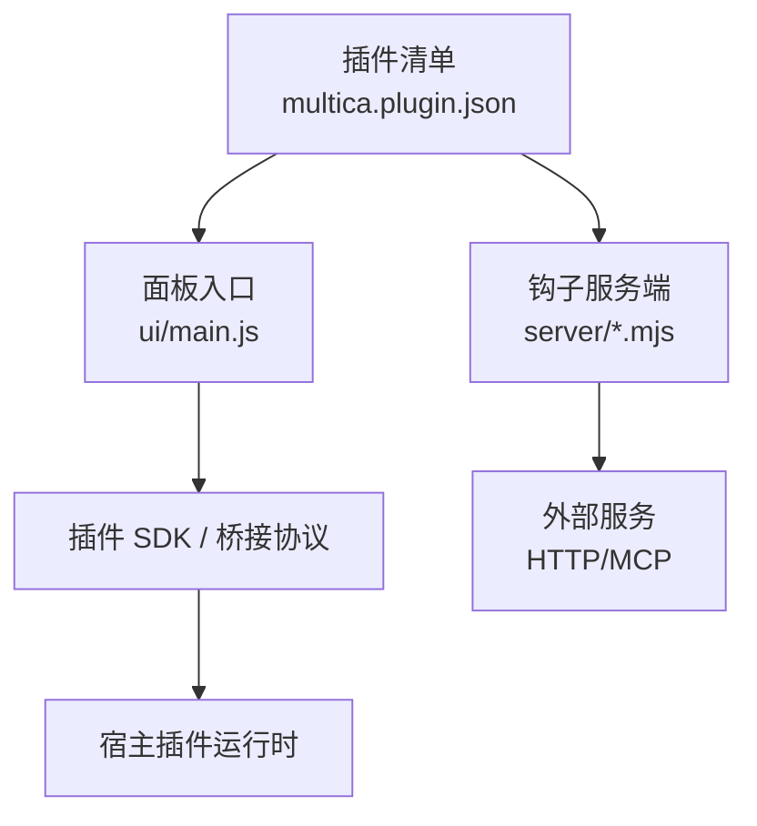
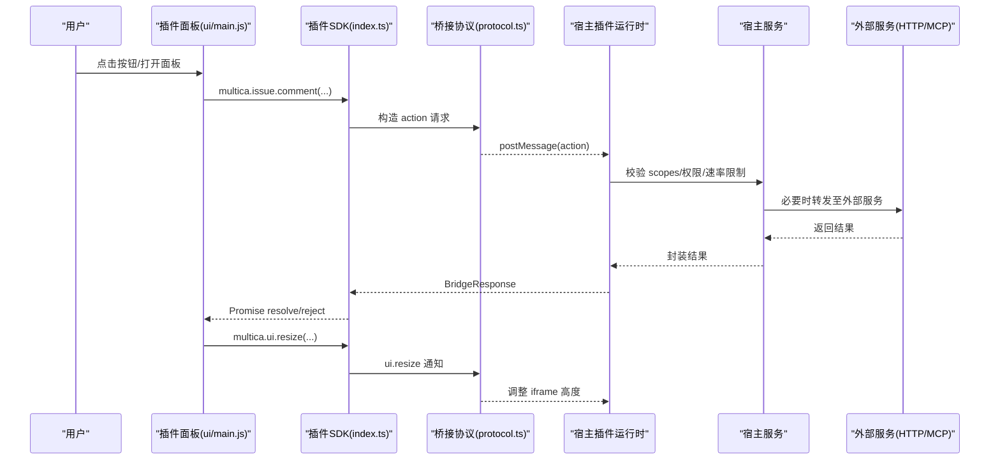
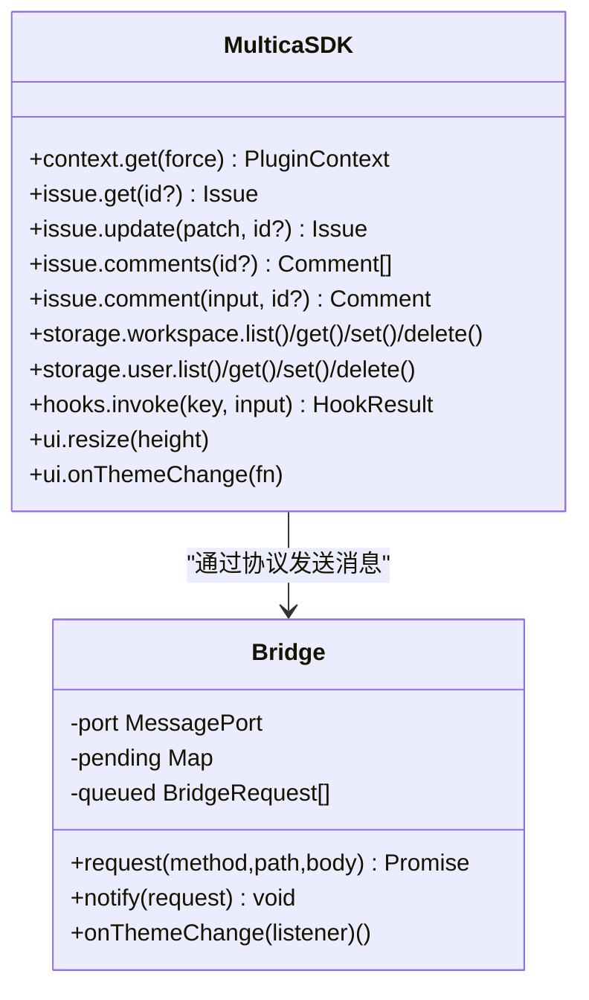
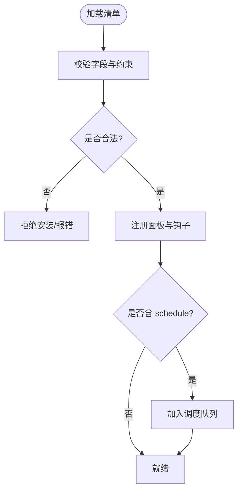
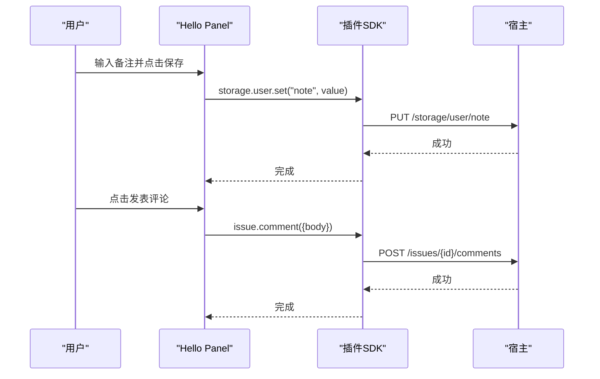
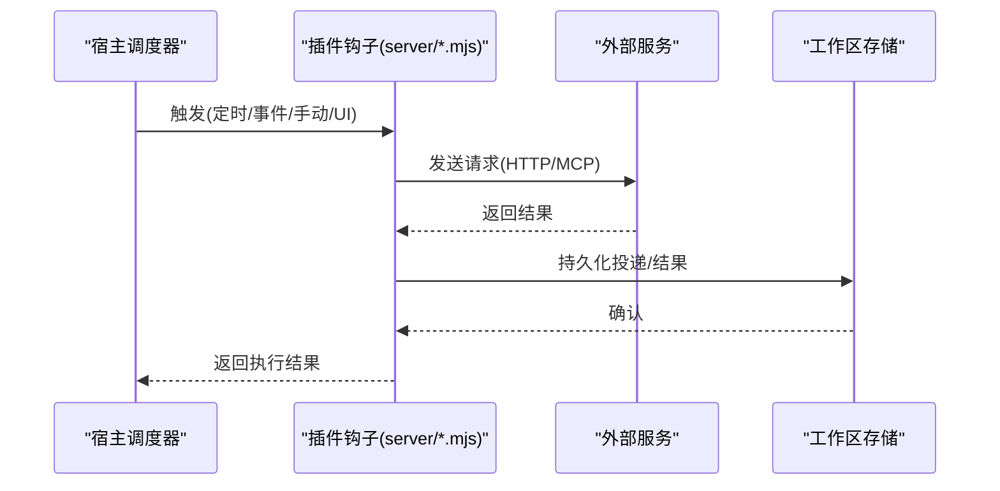
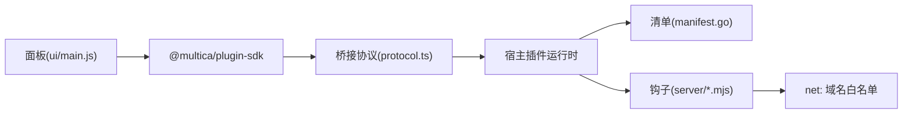

# 插件开发指南

<cite>
**本文引用的文件**
- [packages/plugin-sdk/package.json](file://packages/plugin-sdk/package.json)
- [packages/plugin-sdk/index.ts](file://packages/plugin-sdk/index.ts)
- [packages/plugin-sdk/protocol.ts](file://packages/plugin-sdk/protocol.ts)
- [packages/plugin-sdk/README.md](file://packages/plugin-sdk/README.md)
- [examples/plugins/hello-panel/multica.plugin.json](file://examples/plugins/hello-panel/multica.plugin.json)
- [examples/plugins/hello-panel/ui/main.js](file://examples/plugins/hello-panel/ui/main.js)
- [examples/plugins/schedule-pulse/multica.plugin.json](file://examples/plugins/schedule-pulse/multica.plugin.json)
- [examples/plugins/schedule-pulse/ui/main.js](file://examples/plugins/schedule-pulse/ui/main.js)
- [examples/plugins/triage-notify/multica.plugin.json](file://examples/plugins/triage-notify/multica.plugin.json)
- [examples/plugins/triage-notify/ui/main.js](file://examples/plugins/triage-notify/ui/main.js)
- [examples/plugins/deploy-sentinel/multica.plugin.json](file://examples/plugins/deploy-sentinel/multica.plugin.json)
- [examples/plugins/release-checklist/multica.plugin.json](file://examples/plugins/release-checklist/multica.plugin.json)
- [server/pkg/plugincontract/manifest.go](file://server/pkg/plugincontract/manifest.go)
- [server/pkg/plugincontract/manifest_test.go](file://server/pkg/plugincontract/manifest_test.go)
</cite>

## 目录
1. [简介](#简介)
2. [项目结构](#项目结构)
3. [核心组件](#核心组件)
4. [架构总览](#架构总览)
5. [详细组件分析](#详细组件分析)
6. [依赖关系分析](#依赖关系分析)
7. [性能考虑](#性能考虑)
8. [故障排查指南](#故障排查指南)
9. [结论](#结论)
10. [附录](#附录)

## 简介
本指南面向希望在 Multica 中开发插件的工程师，覆盖从环境搭建、标准项目结构、SDK 使用（API、事件与状态）、构建测试调试、打包发布到版本管理与最佳实践的全流程。Multica 插件由两部分组成：
- 前端面板（Surface）：运行在沙箱 iframe 中的脚本，通过桥接协议与宿主通信，调用受权限控制的 API。
- 后端钩子（Hook）：由 Manifest 声明的 HTTP/MCP 端点，由宿主按触发器调度执行。

插件以“清单 + 资源”的形式发布，安装后绑定版本，管理员升级前对使用者不可变。

## 项目结构
一个最小可用的插件包含以下要素：
- 清单文件 multica.plugin.json：描述插件元信息、权限范围、配置项以及贡献的面板与钩子。
- 面板入口 ui/main.js：在沙箱 iframe 中运行的脚本，通过 SDK 或内联桥接调用宿主能力。
- 可选 server/*：钩子的服务端实现（HTTP/MCP），由宿主转发并安全执行。

示例参考：
- hello-panel：最简面板，演示读取上下文、评论与用户存储。
- schedule-pulse：定时 Hook + 面板展示工作区存储结果。
- triage-notify：UI 触发 Hook，将问题发送到外部服务并回写评论。
- deploy-sentinel：复杂场景，含多 Hook、MCP 传输、技能资源与多种配置类型。

图表来源
- [examples/plugins/hello-panel/multica.plugin.json:1-21](file://examples/plugins/hello-panel/multica.plugin.json#L1-L21)
- [examples/plugins/hello-panel/ui/main.js:1-108](file://examples/plugins/hello-panel/ui/main.js#L1-L108)
- [packages/plugin-sdk/index.ts:1-282](file://packages/plugin-sdk/index.ts#L1-L282)
- [packages/plugin-sdk/protocol.ts:1-76](file://packages/plugin-sdk/protocol.ts#L1-L76)

章节来源
- [examples/plugins/hello-panel/multica.plugin.json:1-21](file://examples/plugins/hello-panel/multica.plugin.json#L1-L21)
- [examples/plugins/schedule-pulse/multica.plugin.json:1-49](file://examples/plugins/schedule-pulse/multica.plugin.json#L1-L49)
- [examples/plugins/triage-notify/multica.plugin.json:1-86](file://examples/plugins/triage-notify/multica.plugin.json#L1-L86)
- [examples/plugins/deploy-sentinel/multica.plugin.json:1-119](file://examples/plugins/deploy-sentinel/multica.plugin.json#L1-L119)

## 核心组件
- 插件 SDK（@multica/plugin-sdk）：提供 multica.* 命名空间，封装上下文、问题、评论、存储、钩子调用、主题与尺寸控制等能力；所有调用均通过 MessagePort 桥接到宿主，不直接持有凭据。
- 桥接协议（protocol.ts）：定义请求/响应/事件格式、主题令牌、方法类型与校验函数，确保宿主与插件侧契约一致且无第三方依赖。
- 清单模型（manifest.go）：定义 manifest_version、key、scopes、contributes.surfaces、contributes.hooks、transport、schedule 等字段及校验规则。

关键要点
- 零运行时依赖：SDK 不引入 @multica/core 或 @multica/ui，避免第三方污染。
- 安全边界：iframe 为沙箱且 origin 为 null，所有操作经宿主代理，遵循已授予 scopes 与用户自身权限。
- 主题与尺寸：宿主推送设计令牌，插件可订阅变化；面板需主动 resize 高度。

章节来源
- [packages/plugin-sdk/index.ts:1-282](file://packages/plugin-sdk/index.ts#L1-L282)
- [packages/plugin-sdk/protocol.ts:1-76](file://packages/plugin-sdk/protocol.ts#L1-L76)
- [server/pkg/plugincontract/manifest.go:168-235](file://server/pkg/plugincontract/manifest.go#L168-L235)

## 架构总览
插件运行于宿主提供的沙箱 iframe 中，通过私有 MessagePort 与宿主通信。面板只负责 UI 与交互，业务逻辑通过宿主调用的 Hook 完成，从而获得签名、速率限制、域名白名单与审计记录。

图表来源
- [packages/plugin-sdk/index.ts:150-168](file://packages/plugin-sdk/index.ts#L150-L168)
- [packages/plugin-sdk/protocol.ts:32-56](file://packages/plugin-sdk/protocol.ts#L32-L56)
- [examples/plugins/triage-notify/ui/main.js:66-90](file://examples/plugins/triage-notify/ui/main.js#L66-L90)

## 详细组件分析

### 插件 SDK 与桥接
- 上下文与权限：multica.context.get() 返回 workspace/user/issue/config/granted_net_domains。
- 问题与评论：multica.issue.get/update/comments/comment，自动注入当前 issue id。
- 存储：multica.storage.user|workspace 提供 list/get/set/delete，键不存在时 get 返回 null。
- 钩子调用：multica.hooks.invoke(hookKey, input) 仅允许调用清单中声明了 ui 触发的钩子。
- UI 能力：resize 与 onThemeChange。
- 错误模型：MulticaPluginError 携带 HTTP 语义 status。

图表来源
- [packages/plugin-sdk/index.ts:26-81](file://packages/plugin-sdk/index.ts#L26-L81)
- [packages/plugin-sdk/index.ts:90-168](file://packages/plugin-sdk/index.ts#L90-L168)
- [packages/plugin-sdk/index.ts:172-271](file://packages/plugin-sdk/index.ts#L172-L271)

章节来源
- [packages/plugin-sdk/index.ts:1-282](file://packages/plugin-sdk/index.ts#L1-L282)
- [packages/plugin-sdk/protocol.ts:1-76](file://packages/plugin-sdk/protocol.ts#L1-L76)

### 清单与钩子模型
- 清单必填：manifest_version、key、name、version、author、scopes、contributes。
- 面板 Surface：key/type/name/entry/platforms，entry 必须为相对路径的 .js/.mjs。
- 钩子 Hook：key/name/description/input_schema/triggers/events/schedule/transport/timeout_ms。
- 传输 Transport：type 支持 http/mcp，url 必须被 net: 作用域覆盖。
- 校验：拒绝路径穿越、绝对 URL、不支持的触发器、版本越界等。

图表来源
- [server/pkg/plugincontract/manifest.go:168-235](file://server/pkg/plugincontract/manifest.go#L168-L235)
- [server/pkg/plugincontract/manifest_test.go:249-291](file://server/pkg/plugincontract/manifest_test.go#L249-L291)

章节来源
- [server/pkg/plugincontract/manifest.go:168-235](file://server/pkg/plugincontract/manifest.go#L168-L235)
- [server/pkg/plugincontract/manifest_test.go:249-291](file://server/pkg/plugincontract/manifest_test.go#L249-L291)

### 面板开发模式（示例）
- Hello Panel：读取上下文、显示问题标题、保存用户备注、发表评论。
- Schedule Pulse：面板读取工作区存储中由定时 Hook 写入的计数与投递信息。
- Triage Notify：面板发起 ui 触发钩子，根据结果渲染成功/失败状态。

图表来源
- [examples/plugins/hello-panel/ui/main.js:51-108](file://examples/plugins/hello-panel/ui/main.js#L51-L108)
- [packages/plugin-sdk/index.ts:172-236](file://packages/plugin-sdk/index.ts#L172-L236)

章节来源
- [examples/plugins/hello-panel/ui/main.js:1-108](file://examples/plugins/hello-panel/ui/main.js#L1-L108)
- [examples/plugins/schedule-pulse/ui/main.js:1-68](file://examples/plugins/schedule-pulse/ui/main.js#L1-L68)
- [examples/plugins/triage-notify/ui/main.js:1-135](file://examples/plugins/triage-notify/ui/main.js#L1-L135)

### 钩子开发模式（示例）
- 定时 Hook（schedule-pulse）：每 5 分钟触发一次，向工作区存储写入投递信息，面板可读。
- 事件 Hook（triage-notify）：监听 issue.created，将问题发送至外部服务并回写评论。
- 复杂 Hook（deploy-sentinel）：包含 agent/manual/ui 触发、MCP 传输、技能资源与多种配置类型。

图表来源
- [examples/plugins/schedule-pulse/multica.plugin.json:28-46](file://examples/plugins/schedule-pulse/multica.plugin.json#L28-L46)
- [examples/plugins/triage-notify/multica.plugin.json:39-83](file://examples/plugins/triage-notify/multica.plugin.json#L39-L83)
- [examples/plugins/deploy-sentinel/multica.plugin.json:62-116](file://examples/plugins/deploy-sentinel/multica.plugin.json#L62-L116)

章节来源
- [examples/plugins/schedule-pulse/multica.plugin.json:1-49](file://examples/plugins/schedule-pulse/multica.plugin.json#L1-L49)
- [examples/plugins/triage-notify/multica.plugin.json:1-86](file://examples/plugins/triage-notify/multica.plugin.json#L1-L86)
- [examples/plugins/deploy-sentinel/multica.plugin.json:1-119](file://examples/plugins/deploy-sentinel/multica.plugin.json#L1-L119)

## 依赖关系分析
- 插件面板依赖插件 SDK，通过协议与宿主通信，不直接访问浏览器存储或跨域 Cookie。
- 宿主对 Hook 的调用受清单 scopes 与 net: 域名白名单约束，超时与重试策略由宿主管理。
- 清单校验严格，防止路径穿越、非法 entry、未授权域名等风险。

图表来源
- [packages/plugin-sdk/index.ts:1-282](file://packages/plugin-sdk/index.ts#L1-L282)
- [packages/plugin-sdk/protocol.ts:1-76](file://packages/plugin-sdk/protocol.ts#L1-L76)
- [server/pkg/plugincontract/manifest.go:168-235](file://server/pkg/plugincontract/manifest.go#L168-L235)

章节来源
- [packages/plugin-sdk/package.json:1-26](file://packages/plugin-sdk/package.json#L1-L26)
- [packages/plugin-sdk/README.md:1-81](file://packages/plugin-sdk/README.md#L1-L81)

## 性能考虑
- 减少不必要调用：缓存 context，仅在需要时刷新；批量更新存储。
- 合理设置超时：为不同钩子设置合适的 timeout_ms，避免阻塞调度器。
- 主题变更优化：仅在主题切换时更新样式，避免频繁重绘。
- 面板尺寸：内容稳定后再 resize，避免多次重排。
- 网络请求：尽量复用连接，避免短连接风暴；对高频 Hook 做幂等与去重。

## 故障排查指南
常见问题与定位建议：
- 面板无法加载或报桥接不可用：检查是否在沙箱 iframe 中运行，全局端口是否存在。
- 权限不足（403）：确认清单 scopes 是否包含所需能力，以及当前用户是否具备相应权限。
- 网络受限（CSP/域名）：确保目标域名在 net: 作用域中声明，否则面板无法发起请求。
- 清单校验失败：检查 entry 是否为相对路径的 .js/.mjs；hook transport 的 url 是否被 net: 覆盖；版本号是否符合规范。
- 钩子未执行：确认 triggers 与 events 配置正确；定时任务 cron/timezone 是否正确；外部服务可达性与超时。

章节来源
- [packages/plugin-sdk/README.md:15-40](file://packages/plugin-sdk/README.md#L15-L40)
- [server/pkg/plugincontract/manifest_test.go:249-291](file://server/pkg/plugincontract/manifest_test.go#L249-L291)

## 结论
Multica 插件体系通过“清单 + 面板 + 钩子”的解耦设计，在保证安全与权限边界的前提下，提供了灵活可扩展的集成能力。遵循本指南的结构与最佳实践，可以快速构建高质量、可维护、易发布的插件。

## 附录

### 开发环境搭建与启动
- 工具链：Node.js、pnpm（用于 monorepo 与文档站点）、Go（用于服务端与清单校验）。
- 本地开发：
  - 克隆仓库并安装依赖。
  - 启动文档与 Web 应用以便预览插件面板。
  - 使用示例插件作为模板，复制 multica.plugin.json 与 ui/main.js 开始开发。
- 调试：
  - 在浏览器开发者工具中查看 iframe 控制台，捕获桥接消息。
  - 在服务端日志中观察 Hook 调用与外部服务响应。

[本节为通用指导，不直接分析具体文件]

### 标准项目结构与文件组织
- 根目录：multica.plugin.json（清单）
- ui/main.js：面板入口（ES Module，单文件部署）
- server/*.mjs：钩子服务端实现（HTTP/MCP）
- skills/*：技能资源（如 SKILL.md）

章节来源
- [examples/plugins/hello-panel/multica.plugin.json:1-21](file://examples/plugins/hello-panel/multica.plugin.json#L1-L21)
- [examples/plugins/deploy-sentinel/multica.plugin.json:114-116](file://examples/plugins/deploy-sentinel/multica.plugin.json#L114-L116)

### 使用插件 SDK 进行开发
- 上下文与权限：通过 multica.context.get() 获取 workspace/user/issue/config 等信息。
- 问题与评论：使用 multica.issue.* 系列方法读写问题与评论。
- 存储：使用 multica.storage.user|workspace 进行键值存储。
- 钩子调用：通过 multica.hooks.invoke 调用声明了 ui 触发的钩子。
- 主题与尺寸：使用 multica.ui.onThemeChange 与 resize 适配宿主主题与布局。

章节来源
- [packages/plugin-sdk/index.ts:199-271](file://packages/plugin-sdk/index.ts#L199-L271)
- [packages/plugin-sdk/README.md:5-13](file://packages/plugin-sdk/README.md#L5-L13)

### 构建、测试与调试
- 构建：将面板打包为单文件 JS（无模块图），便于托管与加载。
- 测试：
  - 单元测试：针对钩子逻辑编写测试用例。
  - 集成测试：通过宿主运行面板与钩子，验证端到端流程。
- 调试：
  - 面板：浏览器控制台与 Network 面板。
  - 钩子：服务端日志与外部服务回调。

[本节为通用指导，不直接分析具体文件]

### 打包与发布
- 打包：将清单与所有引用资源压缩为 zip。
- 发布：在设置 → 插件中上传 zip。新版本发布后，管理员升级前对已安装实例不可变。

章节来源
- [packages/plugin-sdk/README.md:42-50](file://packages/plugin-sdk/README.md#L42-L50)

### 版本管理与依赖处理
- 版本：清单 version 字段需符合语义化版本；宿主会校验长度与格式。
- 依赖：面板不应依赖第三方模块图；钩子依赖由服务端自行管理。
- 升级：管理员升级后，新版本的清单与代码才会生效。

章节来源
- [server/pkg/plugincontract/manifest.go:168-187](file://server/pkg/plugincontract/manifest.go#L168-L187)
- [server/pkg/plugincontract/manifest_test.go:253-261](file://server/pkg/plugincontract/manifest_test.go#L253-L261)

### 完整开发工作流与最佳实践
- 工作流：
  1) 创建清单，声明 scopes、surfaces、hooks。
  2) 实现 ui/main.js，使用 SDK 与宿主交互。
  3) 实现 server/*.mjs，处理外部服务调用与持久化。
  4) 本地联调，逐步增加测试与异常分支。
  5) 打包上传，管理员审批与升级。
- 最佳实践：
  - 最小权限原则：仅申请必要 scopes。
  - 安全优先：所有外部调用走宿主代理，遵守 net: 白名单。
  - 可观测性：记录关键步骤与错误，便于追踪。
  - 幂等与去重：定时 Hook 与事件 Hook 应保证重复触发不影响结果。

[本节为通用指导，不直接分析具体文件]