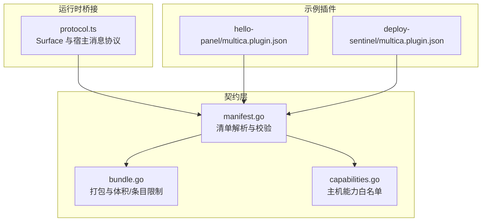
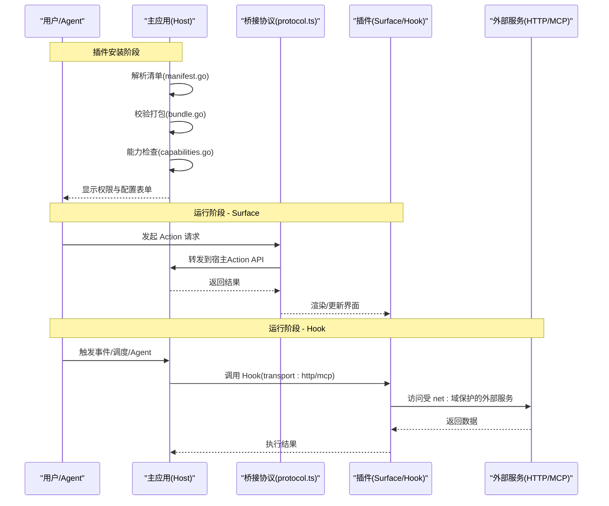
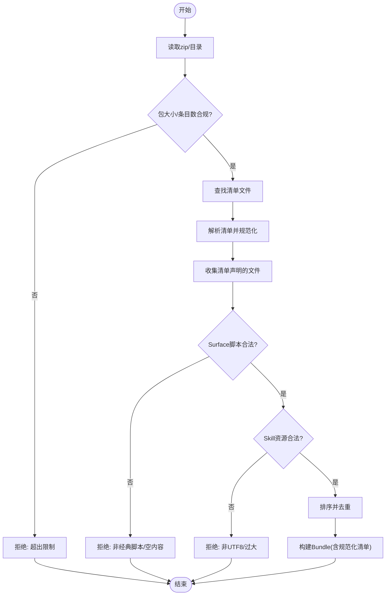
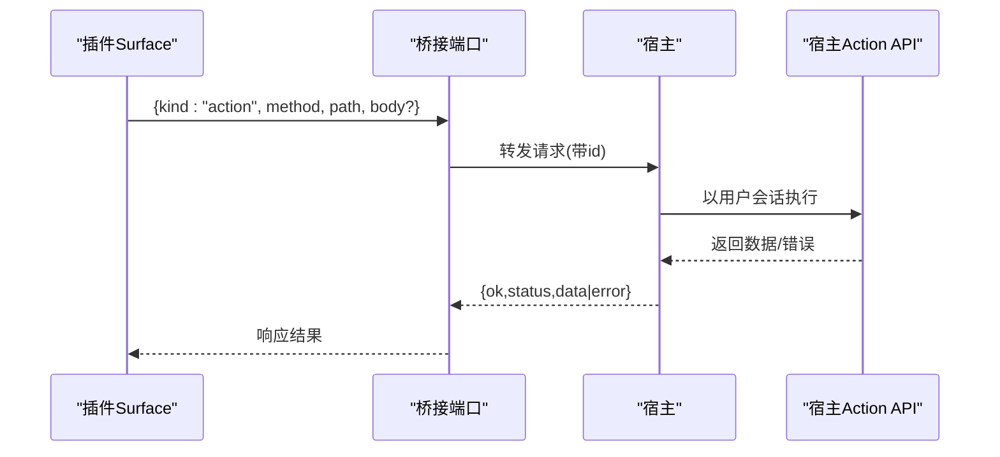
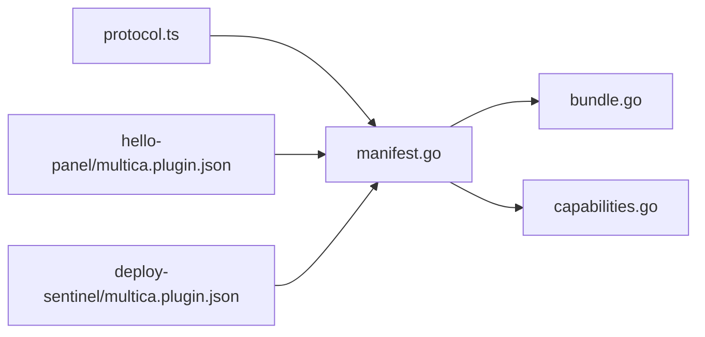

# 插件架构设计

<cite>
**本文引用的文件**
- [bundle.go](file://server/pkg/plugincontract/bundle.go)
- [capabilities.go](file://server/pkg/plugincontract/capabilities.go)
- [manifest.go](file://server/pkg/plugincontract/manifest.go)
- [multica.plugin.json（hello-panel）](file://examples/plugins/hello-panel/multica.plugin.json)
- [multica.plugin.json（deploy-sentinel）](file://examples/plugins/deploy-sentinel/multica.plugin.json)
- [protocol.ts](file://packages/plugin-sdk/protocol.ts)
</cite>

## 目录
1. [简介](#简介)
2. [项目结构](#项目结构)
3. [核心组件](#核心组件)
4. [架构总览](#架构总览)
5. [详细组件分析](#详细组件分析)
6. [依赖关系分析](#依赖关系分析)
7. [性能与安全性考量](#性能与安全性考量)
8. [故障排查指南](#故障排查指南)
9. [结论](#结论)
10. [附录：清单字段速查](#附录：清单字段速查)

## 简介
本文件系统性阐述 Multica 插件系统的整体架构与设计原则，覆盖插件契约、包结构与能力声明机制；详解 manifest.json 的元数据、依赖与权限声明；说明 bundle.go 的打包与校验逻辑、capabilities.go 的能力接口；解释插件与主应用之间的通信协议和数据交换格式；并给出插件加载机制、版本管理与兼容性检查的设计要点。文末提供架构图与交互流程图，帮助开发者快速理解插件系统的工作原理。

## 项目结构
插件系统由“契约层 + 运行时桥接”两部分组成：
- 契约层位于 server/pkg/plugincontract，定义插件清单、打包规范与能力边界。
- 运行时桥接位于 packages/plugin-sdk，定义插件 Surface（UI 面板）与宿主之间的消息协议。
- 示例插件位于 examples/plugins，展示清单与资源组织方式。

图表来源
- [manifest.go:176-243](file://server/pkg/plugincontract/manifest.go#L176-L243)
- [bundle.go:56-132](file://server/pkg/plugincontract/bundle.go#L56-L132)
- [capabilities.go:16-58](file://server/pkg/plugincontract/capabilities.go#L16-L58)
- [protocol.ts:20-56](file://packages/plugin-sdk/protocol.ts#L20-L56)
- [multica.plugin.json（hello-panel）:1-21](file://examples/plugins/hello-panel/multica.plugin.json#L1-L21)
- [multica.plugin.json（deploy-sentinel）:1-119](file://examples/plugins/deploy-sentinel/multica.plugin.json#L1-L119)

章节来源
- [manifest.go:176-243](file://server/pkg/plugincontract/manifest.go#L176-L243)
- [bundle.go:56-132](file://server/pkg/plugincontract/bundle.go#L56-L132)
- [capabilities.go:16-58](file://server/pkg/plugincontract/capabilities.go#L16-L58)
- [protocol.ts:20-56](file://packages/plugin-sdk/protocol.ts#L20-L56)
- [multica.plugin.json（hello-panel）:1-21](file://examples/plugins/hello-panel/multica.plugin.json#L1-L21)
- [multica.plugin.json（deploy-sentinel）:1-119](file://examples/plugins/deploy-sentinel/multica.plugin.json#L1-L119)

## 核心组件
- 清单 Manifest：描述插件身份、版本、作者、图标、权限范围、配置项以及贡献项（表面、钩子、资源）。
- 打包 Bundle：对 zip 或本地目录进行严格校验与裁剪，仅保留清单声明的文件，并在发布时完成安全与体积约束。
- 能力 Capabilities：声明当前主机构建支持的能力集合，用于安装期兼容性检查。
- 通信协议 Protocol：定义 Surface 与宿主之间的消息类型、请求/响应与事件。

章节来源
- [manifest.go:176-243](file://server/pkg/plugincontract/manifest.go#L176-L243)
- [bundle.go:56-132](file://server/pkg/plugincontract/bundle.go#L56-L132)
- [capabilities.go:16-58](file://server/pkg/plugincontract/capabilities.go#L16-L58)
- [protocol.ts:20-56](file://packages/plugin-sdk/protocol.ts#L20-L56)

## 架构总览
插件系统与主应用的交互分为三类：
- Action（插件 → 主应用）：Surface 通过桥接协议调用主应用提供的 API。
- Hook（主应用 → 插件）：主应用在 UI/手动/事件/调度/智能体等触发下调用插件暴露的钩子。
- Resource（静态资源）：如技能文档，安装时写入系统，不产生双向调用。

图表来源
- [manifest.go:42-77](file://server/pkg/plugincontract/manifest.go#L42-L77)
- [bundle.go:87-132](file://server/pkg/plugincontract/bundle.go#L87-L132)
- [capabilities.go:23-58](file://server/pkg/plugincontract/capabilities.go#L23-L58)
- [protocol.ts:20-56](file://packages/plugin-sdk/protocol.ts#L20-L56)
- [multica.plugin.json（deploy-sentinel）:62-112](file://examples/plugins/deploy-sentinel/multica.plugin.json#L62-L112)

## 详细组件分析

### 清单 Manifest：结构、校验与权限
- 元数据：键、名称、描述、版本（语义化）、作者、图标。
- 权限 scopes：固定作用域与 net: 域名白名单，控制 Action API 与网络访问。
- 配置 config：由宿主渲染表单，支持字符串、数字、布尔、枚举、密钥等类型。
- 贡献 contributes：
  - surfaces：挂载在宿主固定位置的 iframe，入口为 .js/.mjs 脚本。
  - hooks：由 UI/手动/事件/调度/智能体触发，支持 HTTP 与 MCP 传输，可声明输入 schema、超时、事件订阅与 cron 调度。
  - resources：静态资源（如 skill），安装时写入系统表，卸载时移除。

关键校验点包括：
- 版本长度与语义化版本校验。
- 作用域去重与白名单校验，net: 域名格式校验。
- 事件订阅需具备对应读取权限。
- 调度表达式最小间隔限制与时间区合法性。
- 钩子传输 URL 必须 HTTPS，且目标主机必须在 net: 范围内。

章节来源
- [manifest.go:176-243](file://server/pkg/plugincontract/manifest.go#L176-L243)
- [manifest.go:400-446](file://server/pkg/plugincontract/manifest.go#L400-L446)
- [manifest.go:448-492](file://server/pkg/plugincontract/manifest.go#L448-L492)
- [manifest.go:494-545](file://server/pkg/plugincontract/manifest.go#L494-L545)
- [manifest.go:547-707](file://server/pkg/plugincontract/manifest.go#L547-L707)
- [manifest.go:709-781](file://server/pkg/plugincontract/manifest.go#L709-L781)

### 打包 Bundle：发布时一次性校验与安全裁剪
- 输入：zip 归档或本地目录（开发通道）。
- 限制：包大小、单文件大小、总解压大小、条目数量、技能文档大小。
- 流程：
  - 解析 zip 条目路径，拒绝符号链接、绝对路径、回退路径与非相对路径。
  - 定位清单文件，解析并生成规范化快照。
  - 仅收集清单声明的文件，重复条目去重，按路径排序存储。
  - 校验 Surface 脚本为经典脚本（禁止顶层 import/export/await/import.meta）。
  - 校验 Skill 资源为 UTF-8 文本且不超过上限。

图表来源
- [bundle.go:27-47](file://server/pkg/plugincontract/bundle.go#L27-L47)
- [bundle.go:87-132](file://server/pkg/plugincontract/bundle.go#L87-L132)
- [bundle.go:156-229](file://server/pkg/plugincontract/bundle.go#L156-L229)
- [bundle.go:240-319](file://server/pkg/plugincontract/bundle.go#L240-L319)
- [bundle.go:321-409](file://server/pkg/plugincontract/bundle.go#L321-L409)

章节来源
- [bundle.go:87-132](file://server/pkg/plugincontract/bundle.go#L87-L132)
- [bundle.go:156-229](file://server/pkg/plugincontract/bundle.go#L156-L229)
- [bundle.go:240-319](file://server/pkg/plugincontract/bundle.go#L240-L319)
- [bundle.go:321-409](file://server/pkg/plugincontract/bundle.go#L321-L409)

### 能力 Capabilities：安装期兼容性检查
- 主机能力白名单：包含支持的 Surface 类型、Hook 触发器、Hook 传输方式与资源类型。
- 检查逻辑：遍历清单中的贡献项，若不在主机能力集合中，则汇总缺失项并返回错误。
- 设计意图：避免“静默不可用”的安装结果，确保管理员在安装时即可看到完整的能力缺口。

章节来源
- [capabilities.go:16-58](file://server/pkg/plugincontract/capabilities.go#L16-L58)
- [capabilities.go:69-103](file://server/pkg/plugincontract/capabilities.go#L69-L103)

### 通信协议 Protocol：Surface 与宿主的消息通道
- 通道标识：通过 MessagePort 绑定身份，而非 origin；宿主在启动挑战通过后接受唯一通道。
- 消息类型：
  - 请求：action（调用宿主 Action API，指定方法与路径）、ui.resize（调整高度）。
  - 响应：统一 ok/status/data/error 结构。
  - 事件：theme（主题令牌变更）。
- 安全原则：无凭据跨边界传输；所有 API 调用由宿主以用户会话执行并返回结果。

图表来源
- [protocol.ts:20-56](file://packages/plugin-sdk/protocol.ts#L20-L56)

章节来源
- [protocol.ts:20-56](file://packages/plugin-sdk/protocol.ts#L20-L56)

### 示例插件清单解读
- hello-panel：声明一个 issue_panel 类型的 Surface，入口为 ui/main.js，平台支持 web/desktop。
- deploy-sentinel：声明多个 Hook（HTTP/MCP 传输），事件订阅与调度，以及 skill 资源；同时声明 net: 域名权限以允许访问外部服务。

章节来源
- [multica.plugin.json（hello-panel）:1-21](file://examples/plugins/hello-panel/multica.plugin.json#L1-L21)
- [multica.plugin.json（deploy-sentinel）:1-119](file://examples/plugins/deploy-sentinel/multica.plugin.json#L1-L119)

## 依赖关系分析
- 清单与打包：manifest.go 定义数据结构与校验规则；bundle.go 基于清单裁剪并验证实际文件。
- 能力与清单：capabilities.go 提供主机能力集合，manifest.go 的贡献项在此集合中进行兼容性检查。
- 协议与清单：protocol.ts 定义 Surface 与宿主通信格式；清单中的 surfaces.entry 指向被宿主注入 CSP 的经典脚本。
- 示例与契约：examples/plugins 下的清单展示了如何组合 surfaces、hooks、resources 与 scopes/config。

图表来源
- [manifest.go:176-243](file://server/pkg/plugincontract/manifest.go#L176-L243)
- [bundle.go:56-132](file://server/pkg/plugincontract/bundle.go#L56-L132)
- [capabilities.go:16-58](file://server/pkg/plugincontract/capabilities.go#L16-L58)
- [protocol.ts:20-56](file://packages/plugin-sdk/protocol.ts#L20-L56)
- [multica.plugin.json（hello-panel）:1-21](file://examples/plugins/hello-panel/multica.plugin.json#L1-L21)
- [multica.plugin.json（deploy-sentinel）:1-119](file://examples/plugins/deploy-sentinel/multica.plugin.json#L1-L119)

章节来源
- [manifest.go:176-243](file://server/pkg/plugincontract/manifest.go#L176-L243)
- [bundle.go:56-132](file://server/pkg/plugincontract/bundle.go#L56-L132)
- [capabilities.go:16-58](file://server/pkg/plugincontract/capabilities.go#L16-L58)
- [protocol.ts:20-56](file://packages/plugin-sdk/protocol.ts#L20-L56)
- [multica.plugin.json（hello-panel）:1-21](file://examples/plugins/hello-panel/multica.plugin.json#L1-L21)
- [multica.plugin.json（deploy-sentinel）:1-119](file://examples/plugins/deploy-sentinel/multica.plugin.json#L1-L119)

## 性能与安全性考量
- 体积与条目限制：防止恶意大体积包与过多条目导致内存/磁盘压力。
- 懒加载与只读清单：仅解压清单声明的文件，未引用内容不被读取。
- 脚本沙箱：Surface 为经典脚本，禁止模块语法，宿主注入 CSP 控制网络与执行环境。
- 网络白名单：通过 net: 作用域精确匹配主机名，禁止后缀匹配，避免越权访问。
- 调度节流：最小间隔限制，防止高频轮询造成出站流量风暴。
- 超时控制：Hook 超时范围限制，保障系统稳定性。

[本节为通用指导，无需具体文件来源]

## 故障排查指南
- 清单解析失败：检查 manifest_version、未知字段、拼写错误与 JSON 尾随数据。
- 作用域错误：确认 scopes 列表为空、重复或包含不支持的值；net: 域名格式不正确。
- 事件订阅权限不足：订阅的事件需要对应的读取权限，否则安装时报错。
- 调度表达式非法：cron 表达式不符合五字段标准或频率过高；时间区无效。
- 传输 URL 不合规：非 HTTPS、主机未在 net: 范围内。
- 打包校验失败：zip 包含符号链接、绝对路径、回退路径；Surface 脚本非经典脚本或为空；Skill 资源非 UTF-8 或过大。
- 能力不兼容：清单声明了当前主机不支持的 surface/hook transport/resource 类型。

章节来源
- [manifest.go:400-446](file://server/pkg/plugincontract/manifest.go#L400-L446)
- [manifest.go:448-492](file://server/pkg/plugincontract/manifest.go#L448-L492)
- [manifest.go:547-707](file://server/pkg/plugincontract/manifest.go#L547-L707)
- [manifest.go:709-781](file://server/pkg/plugincontract/manifest.go#L709-L781)
- [bundle.go:240-319](file://server/pkg/plugincontract/bundle.go#L240-L319)
- [bundle.go:321-409](file://server/pkg/plugincontract/bundle.go#L321-L409)
- [capabilities.go:69-103](file://server/pkg/plugincontract/capabilities.go#L69-L103)

## 结论
Multica 插件系统通过严格的契约与发布期校验，将“谁可以做什么”明确化：清单声明能力，打包保证一致性，能力检查确保兼容性，协议限定通信边界。该设计使插件既能扩展产品功能，又能在安全与性能上得到保障。开发者应遵循清单规范、最小权限原则与协议约定，以获得稳定可靠的插件体验。

[本节为总结性内容，无需具体文件来源]

## 附录：清单字段速查
- 元数据：manifest_version、key、name、description、version、author、icon。
- 权限：scopes（固定作用域与 net: 域名）。
- 配置：config.fields（type/label/description/required/options/placeholder/multiline）。
- 贡献：
  - surfaces：key/type/name/entry/platforms。
  - hooks：key/name/description/input_schema/triggers/events/schedule/transport/timeout_ms。
  - resources：type/key/entry（skill 资源路径固定为 skills/{key}/SKILL.md）。

章节来源
- [manifest.go:176-243](file://server/pkg/plugincontract/manifest.go#L176-L243)
- [manifest.go:494-545](file://server/pkg/plugincontract/manifest.go#L494-L545)
- [manifest.go:547-707](file://server/pkg/plugincontract/manifest.go#L547-L707)