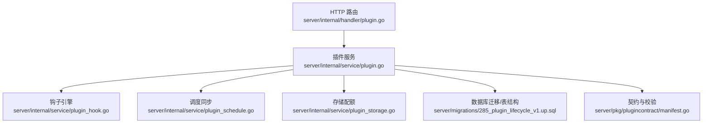
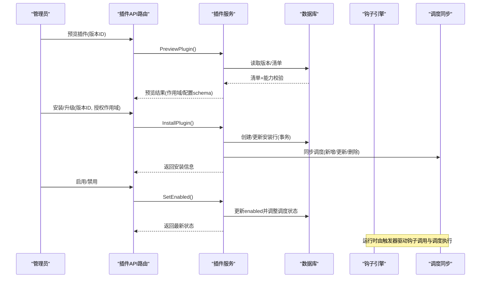
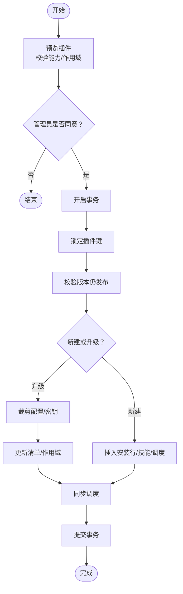
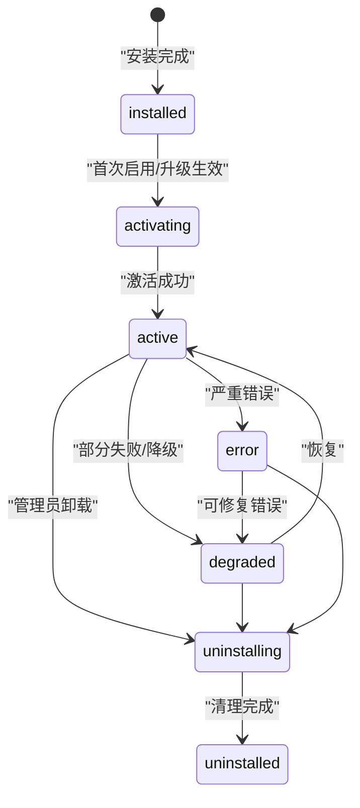
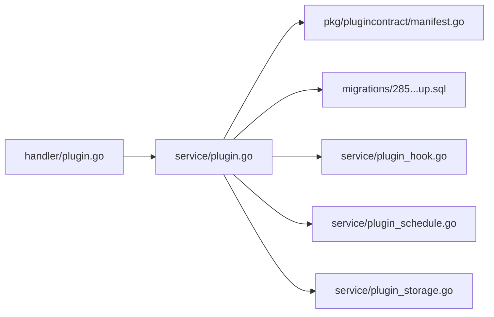
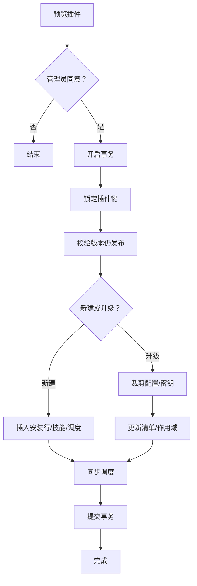
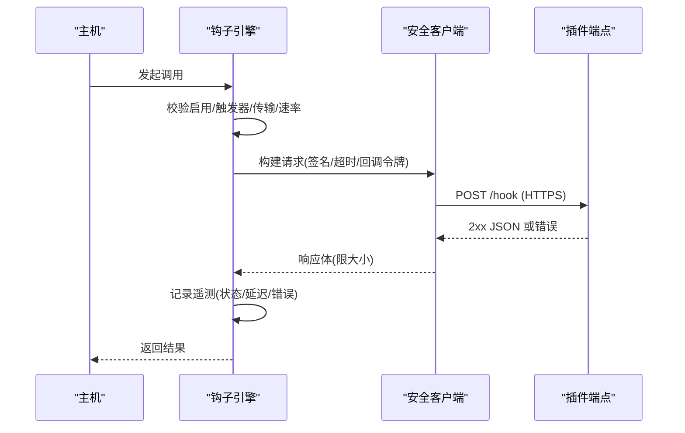

# 插件生命周期管理

<cite>
**本文引用的文件**
- [server/internal/service/plugin.go](file://server/internal/service/plugin.go)
- [server/internal/service/plugin_hook.go](file://server/internal/service/plugin_hook.go)
- [server/internal/service/plugin_schedule.go](file://server/internal/service/plugin_schedule.go)
- [server/internal/handler/plugin.go](file://server/internal/handler/plugin.go)
- [server/pkg/plugincontract/manifest.go](file://server/pkg/plugincontract/manifest.go)
- [server/migrations/285_plugin_lifecycle_v1.up.sql](file://server/migrations/285_plugin_lifecycle_v1.up.sql)
- [server/internal/service/plugin_action.go](file://server/internal/service/plugin_action.go)
- [server/internal/service/plugin_token.go](file://server/internal/service/plugin_token.go)
- [server/internal/service/plugin_storage.go](file://server/internal/service/plugin_storage.go)
</cite>

## 目录
1. [简介](#简介)
2. [项目结构](#项目结构)
3. [核心组件](#核心组件)
4. [架构总览](#架构总览)
5. [详细组件分析](#详细组件分析)
6. [依赖关系分析](#依赖关系分析)
7. [性能与资源限制](#性能与资源限制)
8. [故障处理与恢复](#故障处理与恢复)
9. [结论](#结论)
10. [附录：状态图与流程图](#附录：状态图与流程图)

## 简介
本文件系统性说明 Multica 插件从安装到卸载的完整生命周期，覆盖安装验证、依赖检查、资源分配、激活注册、运行监控与清理回收；阐述插件状态管理机制（installed、activating、active、degraded、error、uninstalling、uninstalled）及转换条件；解释热更新与版本升级流程；总结错误处理与故障恢复策略；并给出性能监控与资源使用统计要点。文末提供生命周期状态图与关键事件流程图，便于快速理解各阶段处理逻辑。

## 项目结构
插件能力由“契约层 + 服务层 + 路由层 + 数据层”组成：
- 契约层：定义 manifest、hook、surface、resource、config、scope 等公共模型与校验规则。
- 服务层：实现安装、配置、启用/禁用、卸载、钩子调用、调度同步、存储配额等核心逻辑。
- 路由层：暴露 REST API，将请求映射到服务方法，并将服务错误映射为 HTTP 状态码。
- 数据层：通过迁移脚本维护 plugin_installation 等表结构与约束，保障状态一致性。

**图表来源**
- [server/internal/handler/plugin.go:180-339](file://server/internal/handler/plugin.go#L180-L339)
- [server/internal/service/plugin.go:260-471](file://server/internal/service/plugin.go#L260-L471)
- [server/internal/service/plugin_hook.go:192-242](file://server/internal/service/plugin_hook.go#L192-L242)
- [server/internal/service/plugin_schedule.go:13-85](file://server/internal/service/plugin_schedule.go#L13-L85)
- [server/internal/service/plugin_storage.go:127-156](file://server/internal/service/plugin_storage.go#L127-L156)
- [server/migrations/285_plugin_lifecycle_v1.up.sql:73-103](file://server/migrations/285_plugin_lifecycle_v1.up.sql#L73-L103)
- [server/pkg/plugincontract/manifest.go:176-243](file://server/pkg/plugincontract/manifest.go#L176-L243)

**章节来源**
- [server/internal/handler/plugin.go:180-339](file://server/internal/handler/plugin.go#L180-L339)
- [server/internal/service/plugin.go:260-471](file://server/internal/service/plugin.go#L260-L471)
- [server/pkg/plugincontract/manifest.go:176-243](file://server/pkg/plugincontract/manifest.go#L176-L243)
- [server/migrations/285_plugin_lifecycle_v1.up.sql:73-103](file://server/migrations/285_plugin_lifecycle_v1.up.sql#L73-L103)

## 核心组件
- 插件服务（PluginService）：负责预览、安装、升级、配置、启用/禁用、卸载、钩子调用、调度同步、存储配额等。
- 钩子引擎：对外安全调用插件服务端点，包含签名、超时、限流、熔断、遥测记录。
- 调度器同步：根据 manifest 中的 schedule 声明，维护持久化调度投影，支持启用/禁用切换时重算下次执行时间。
- 存储配额：对插件键值存储实施单值大小、键数量、总量预算三重限制。
- 契约与校验：严格解析与校验 manifest，确保发布物与宿主能力一致，防止漂移。
- 路由与错误映射：将服务错误分类映射为 HTTP 状态码，统一响应格式。

**章节来源**
- [server/internal/service/plugin.go:260-471](file://server/internal/service/plugin.go#L260-L471)
- [server/internal/service/plugin_hook.go:192-242](file://server/internal/service/plugin_hook.go#L192-L242)
- [server/internal/service/plugin_schedule.go:13-85](file://server/internal/service/plugin_schedule.go#L13-L85)
- [server/internal/service/plugin_storage.go:127-156](file://server/internal/service/plugin_storage.go#L127-L156)
- [server/pkg/plugincontract/manifest.go:360-446](file://server/pkg/plugincontract/manifest.go#L360-L446)
- [server/internal/handler/plugin.go:28-52](file://server/internal/handler/plugin.go#L28-L52)

## 架构总览
插件生命周期贯穿“预览 → 安装/升级 → 启用 → 运行（钩子/事件/调度）→ 禁用/卸载”。所有变更在事务中完成，保证安装、配置、调度、存储等子系统的原子性。

**图表来源**
- [server/internal/handler/plugin.go:210-339](file://server/internal/handler/plugin.go#L210-L339)
- [server/internal/service/plugin.go:260-471](file://server/internal/service/plugin.go#L260-L471)
- [server/internal/service/plugin_schedule.go:13-85](file://server/internal/service/plugin_schedule.go#L13-L85)

**章节来源**
- [server/internal/handler/plugin.go:210-339](file://server/internal/handler/plugin.go#L210-L339)
- [server/internal/service/plugin.go:260-471](file://server/internal/service/plugin.go#L260-L471)
- [server/internal/service/plugin_schedule.go:13-85](file://server/internal/service/plugin_schedule.go#L13-L85)

## 详细组件分析

### 安装与升级
- 预览：读取已发布版本的清单，校验宿主能力，计算新增作用域，供管理员审批。
- 安装：锁定工作区插件键，校验版本仍有效，写入安装行、技能资源、调度投影，全部在一个事务内提交。
- 升级：在同一事务中裁剪不再需要的配置与密钥，更新清单与作用域，重新同步技能与调度。

**图表来源**
- [server/internal/service/plugin.go:260-471](file://server/internal/service/plugin.go#L260-L471)
- [server/internal/service/plugin_schedule.go:13-85](file://server/internal/service/plugin_schedule.go#L13-L85)

**章节来源**
- [server/internal/service/plugin.go:260-471](file://server/internal/service/plugin.go#L260-L471)
- [server/internal/service/plugin_schedule.go:13-85](file://server/internal/service/plugin_schedule.go#L13-L85)

### 启用/禁用与状态切换
- 启用：立即隐藏/显示贡献，同时启用/禁用调度投影；禁用后重新启用会旋转 generation 并基于当前时间重算下次执行。
- 卸载：在一个事务中删除调度、存储、密钥、调用记录、技能、安装行，避免孤儿数据。

**图表来源**
- [server/migrations/285_plugin_lifecycle_v1.up.sql:73-103](file://server/migrations/285_plugin_lifecycle_v1.up.sql#L73-L103)
- [server/internal/service/plugin.go:697-766](file://server/internal/service/plugin.go#L697-L766)

**章节来源**
- [server/migrations/285_plugin_lifecycle_v1.up.sql:73-103](file://server/migrations/285_plugin_lifecycle_v1.up.sql#L73-L103)
- [server/internal/service/plugin.go:697-766](file://server/internal/service/plugin.go#L697-L766)

### 钩子调用与运行监控
- 调用前校验：安装启用、触发器允许、传输类型支持、速率限制。
- 网络与安全：目标域名必须在 net: 作用域内；生产环境强制 HTTPS 与公网可达；开发模式仅信任白名单 origin 与指定 CA；请求体签名防重放。
- 超时与限流：默认超时、可配置超时；每分钟调用次数限制；失败熔断窗口。
- 遥测记录：每次调用记录状态、延迟、尝试次数、错误摘要（脱敏）。

```mermaid
sequenceDiagram
participant Host as "主机"
participant Hook as "钩子引擎"
participant Net as "出站客户端"
participant Plugin as "插件服务端点"
Host->>Hook : InvokeHook(invocation)
Hook->>Hook : 校验启用/触发器/传输/速率
Hook->>Net : 构建请求(签名/超时/回调令牌)
Net->>Plugin : POST /hook (HTTPS, 签名头)
Plugin-->>Net : 2xx JSON 或错误
Net-->>Hook : 响应体(限大小)
Hook->>Hook : 记录遥测(状态/延迟/错误)
Hook-->>Host : 结果(HookResult)
```

**图表来源**
- [server/internal/service/plugin_hook.go:192-242](file://server/internal/service/plugin_hook.go#L192-L242)
- [server/internal/service/plugin_hook.go:244-349](file://server/internal/service/plugin_hook.go#L244-L349)
- [server/internal/service/plugin_hook.go:510-541](file://server/internal/service/plugin_hook.go#L510-L541)
- [server/internal/service/plugin_hook.go:543-568](file://server/internal/service/plugin_hook.go#L543-L568)

**章节来源**
- [server/internal/service/plugin_hook.go:192-242](file://server/internal/service/plugin_hook.go#L192-L242)
- [server/internal/service/plugin_hook.go:244-349](file://server/internal/service/plugin_hook.go#L244-L349)
- [server/internal/service/plugin_hook.go:510-568](file://server/internal/service/plugin_hook.go#L510-L568)

### 配置与密钥管理
- 配置字段按 manifest schema 校验，普通字段落库，secret 字段加密存储。
- 升级时自动裁剪不再声明的配置与密钥，避免残留不可达数据。
- 查询仅返回已配置的密钥名称，不泄露任何值。

**章节来源**
- [server/internal/service/plugin.go:538-631](file://server/internal/service/plugin.go#L538-L631)
- [server/internal/service/plugin.go:473-521](file://server/internal/service/plugin.go#L473-L521)
- [server/internal/service/plugin.go:683-695](file://server/internal/service/plugin.go#L683-L695)

### 存储配额与隔离
- 三重限制：单值字节上限、键数量上限、总字节预算。
- 写入前查询用量（排除待写入键），超限则拒绝。
- 作用域隔离：按 scopeType/scopeID 隔离不同范围的数据。

**章节来源**
- [server/internal/service/plugin_storage.go:127-156](file://server/internal/service/plugin_storage.go#L127-L156)

### 认证与鉴权
- 安装令牌：插件向主机证明身份，主机仅验签不存储明文。
- 回调令牌：短时效、单次调用，用于钩子处理器回调 Action API。
- 动作鉴权：校验安装存在且启用，并持有所需作用域；资源级权限沿用宿主用户权限。

**章节来源**
- [server/internal/service/plugin_token.go:102-124](file://server/internal/service/plugin_token.go#L102-L124)
- [server/internal/service/plugin_action.go:39-65](file://server/internal/service/plugin_action.go#L39-L65)

## 依赖关系分析
- 路由层依赖服务层进行业务编排，服务层依赖契约层进行模型校验，依赖数据库迁移定义的表结构与约束。
- 钩子引擎依赖远程 MCP 安全客户端与签名机制，确保出站访问受控。
- 调度同步依赖 manifest 中的 schedule 声明，并在启用/禁用时重算下次执行时间。

**图表来源**
- [server/internal/handler/plugin.go:180-339](file://server/internal/handler/plugin.go#L180-L339)
- [server/internal/service/plugin.go:260-471](file://server/internal/service/plugin.go#L260-L471)
- [server/pkg/plugincontract/manifest.go:176-243](file://server/pkg/plugincontract/manifest.go#L176-L243)
- [server/migrations/285_plugin_lifecycle_v1.up.sql:73-103](file://server/migrations/285_plugin_lifecycle_v1.up.sql#L73-L103)
- [server/internal/service/plugin_hook.go:192-242](file://server/internal/service/plugin_hook.go#L192-L242)
- [server/internal/service/plugin_schedule.go:13-85](file://server/internal/service/plugin_schedule.go#L13-L85)
- [server/internal/service/plugin_storage.go:127-156](file://server/internal/service/plugin_storage.go#L127-L156)

**章节来源**
- [server/internal/handler/plugin.go:180-339](file://server/internal/handler/plugin.go#L180-L339)
- [server/internal/service/plugin.go:260-471](file://server/internal/service/plugin.go#L260-L471)
- [server/pkg/plugincontract/manifest.go:176-243](file://server/pkg/plugincontract/manifest.go#L176-L243)
- [server/migrations/285_plugin_lifecycle_v1.up.sql:73-103](file://server/migrations/285_plugin_lifecycle_v1.up.sql#L73-L103)
- [server/internal/service/plugin_hook.go:192-242](file://server/internal/service/plugin_hook.go#L192-L242)
- [server/internal/service/plugin_schedule.go:13-85](file://server/internal/service/plugin_schedule.go#L13-L85)
- [server/internal/service/plugin_storage.go:127-156](file://server/internal/service/plugin_storage.go#L127-L156)

## 性能与资源限制
- 钩子调用：
  - 默认超时与可配置超时，防止长尾阻塞。
  - 每分钟调用次数限制，避免滥用。
  - 失败熔断窗口，降低雪崩风险。
  - 响应体大小限制，防止内存耗尽。
- 存储配额：
  - 单值字节上限、键数量上限、总字节预算，保护存储资源。
- 遥测指标：
  - 每次调用记录状态、延迟、尝试次数、错误摘要，可用于性能分析与告警。

**章节来源**
- [server/internal/service/plugin_hook.go:36-64](file://server/internal/service/plugin_hook.go#L36-L64)
- [server/internal/service/plugin_hook.go:510-568](file://server/internal/service/plugin_hook.go#L510-L568)
- [server/internal/service/plugin_storage.go:127-156](file://server/internal/service/plugin_storage.go#L127-L156)

## 故障处理与恢复
- 错误分类：invalid、not_found、conflict、forbidden、incompatible、quota、unavailable，路由层映射为对应 HTTP 状态码。
- 幂等与回滚：安装/升级/配置/启用/卸载均使用事务，失败回滚，避免半写状态。
- 恢复策略：
  - 禁用后重新启用会旋转 generation 并基于当前时间重算调度，避免遗留计划。
  - 卸载时一次性清理所有应用侧数据，避免孤儿。
  - 钩子失败记录状态与错误摘要，结合熔断与重试策略逐步恢复。

**章节来源**
- [server/internal/handler/plugin.go:28-52](file://server/internal/handler/plugin.go#L28-L52)
- [server/internal/service/plugin.go:697-766](file://server/internal/service/plugin.go#L697-L766)
- [server/internal/service/plugin_schedule.go:98-131](file://server/internal/service/plugin_schedule.go#L98-L131)
- [server/internal/service/plugin_hook.go:570-596](file://server/internal/service/plugin_hook.go#L570-L596)

## 结论
Multica 的插件生命周期以“契约先行、事务保障、安全外发、可观测运行”为核心原则。通过严格的 manifest 校验、作用域控制、出站安全与配额限制，确保插件在可控范围内扩展系统能力；通过事务化的安装/升级/启用/卸载与详细的遥测记录，提供可靠的运维与排障基础。建议在生产环境中：
- 明确配置 dev origins 与 CA，仅用于开发调试。
- 关注钩子调用频率与失败率，合理设置超时与熔断阈值。
- 定期审查存储配额使用情况，避免接近上限导致写入失败。
- 利用调度投影与启用/禁用开关，平滑灰度与回滚。

## 附录：状态图与流程图

### 插件生命周期状态图

**图表来源**
- [server/migrations/285_plugin_lifecycle_v1.up.sql:73-103](file://server/migrations/285_plugin_lifecycle_v1.up.sql#L73-L103)
- [server/internal/service/plugin.go:697-766](file://server/internal/service/plugin.go#L697-L766)

### 安装/升级事件流程图

**图表来源**
- [server/internal/service/plugin.go:260-471](file://server/internal/service/plugin.go#L260-L471)
- [server/internal/service/plugin_schedule.go:13-85](file://server/internal/service/plugin_schedule.go#L13-L85)

### 钩子调用时序图

**图表来源**
- [server/internal/service/plugin_hook.go:192-242](file://server/internal/service/plugin_hook.go#L192-L242)
- [server/internal/service/plugin_hook.go:244-349](file://server/internal/service/plugin_hook.go#L244-L349)
- [server/internal/service/plugin_hook.go:510-568](file://server/internal/service/plugin_hook.go#L510-L568)