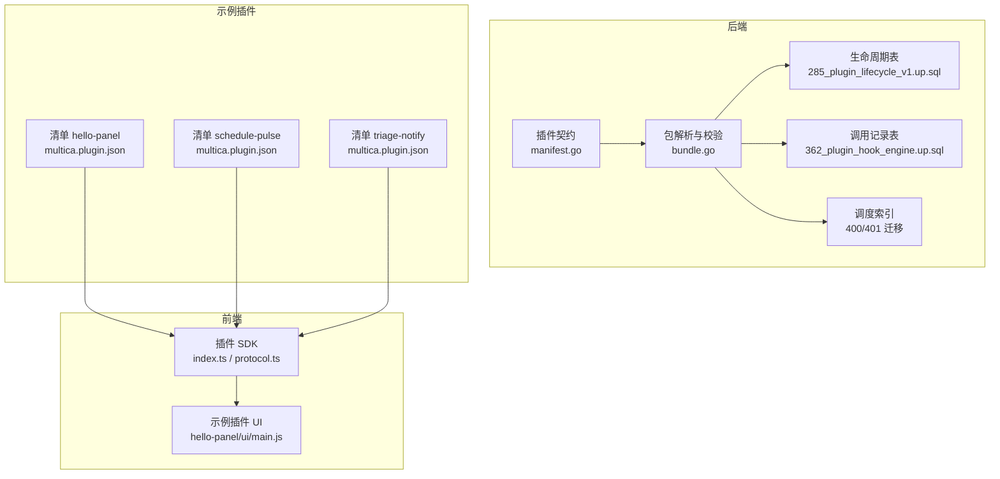
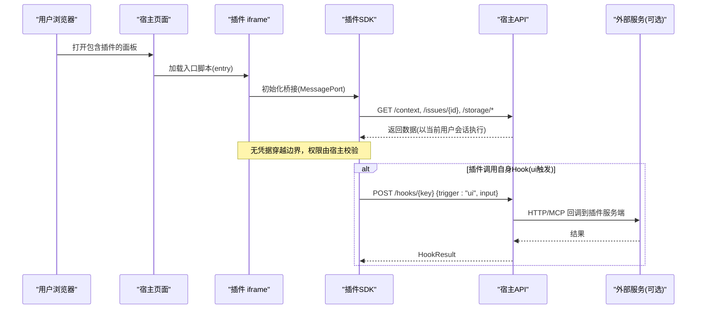
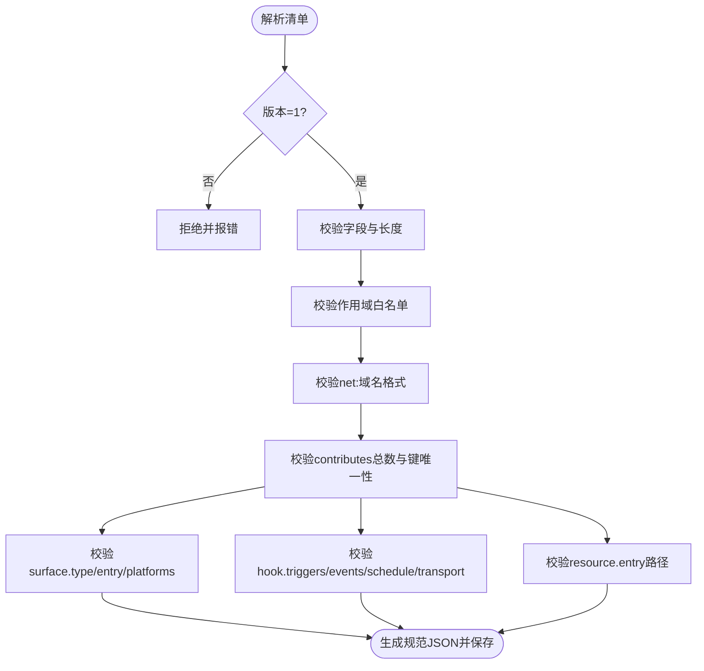
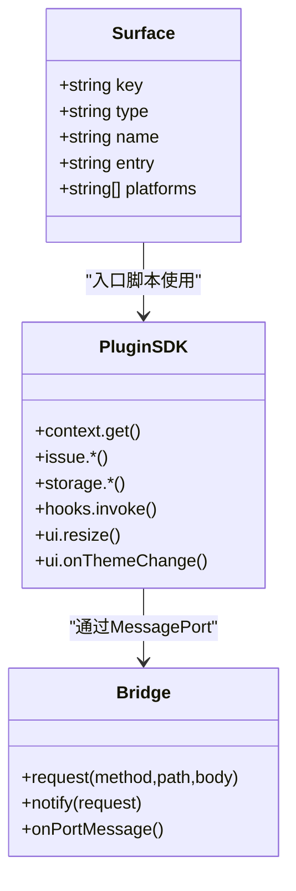
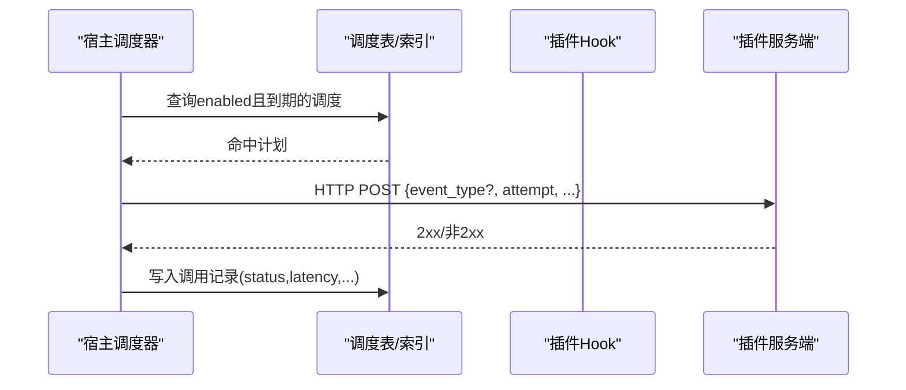
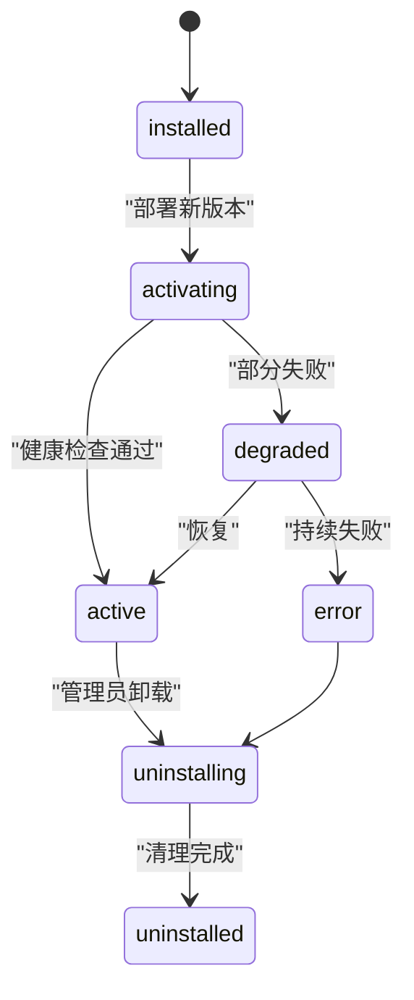
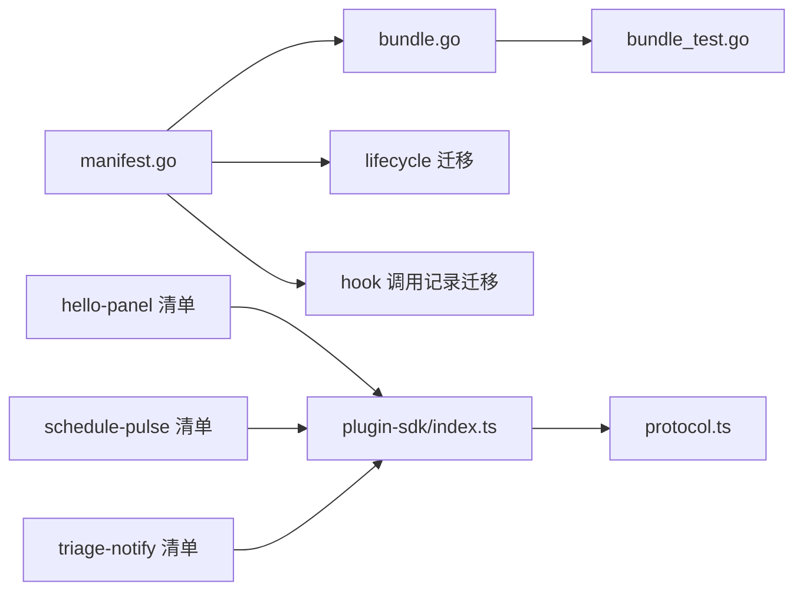

# 插件系统

<cite>
**本文引用的文件**
- [manifest.go](file://server/pkg/plugincontract/manifest.go)
- [bundle.go](file://server/pkg/plugincontract/bundle.go)
- [bundle_test.go](file://server/pkg/plugincontract/bundle_test.go)
- [index.ts](file://packages/plugin-sdk/index.ts)
- [protocol.ts](file://packages/plugin-sdk/protocol.ts)
- [multica.plugin.json（hello-panel）](file://examples/plugins/hello-panel/multica.plugin.json)
- [main.js（hello-panel）](file://examples/plugins/hello-panel/ui/main.js)
- [multica.plugin.json（schedule-pulse）](file://examples/plugins/schedule-pulse/multica.plugin.json)
- [multica.plugin.json（triage-notify）](file://examples/plugins/triage-notify/multica.plugin.json)
- [285_plugin_lifecycle_v1.up.sql](file://server/migrations/285_plugin_lifecycle_v1.up.sql)
- [362_plugin_hook_engine.up.sql](file://server/migrations/362_plugin_hook_engine.up.sql)
- [400_plugin_hook_schedule_installation_key_index.up.sql](file://server/migrations/400_plugin_hook_schedule_installation_key_index.up.sql)
- [401_plugin_hook_schedule_enabled_index.up.sql](file://server/migrations/401_plugin_hook_schedule_enabled_index.up.sql)
- [types.go](file://server/pkg/remotemcp/types.go)
- [security-model.mdx](file://apps/docs/content/docs/security-model.mdx)
</cite>

## 目录
1. [简介](#简介)
2. [项目结构](#项目结构)
3. [核心组件](#核心组件)
4. [架构总览](#架构总览)
5. [详细组件分析](#详细组件分析)
6. [依赖关系分析](#依赖关系分析)
7. [性能考量](#性能考量)
8. [故障排查指南](#故障排查指南)
9. [结论](#结论)
10. [附录：插件开发指南与发布分发](#附录：插件开发指南与发布分发)

## 简介
本文件系统性说明 Multica 的插件系统，覆盖契约设计、版本管理、生命周期、表面系统（Surface System）、钩子系统（Hook System）、资源系统、安全模型与权限控制、以及插件开发、调试、发布与更新流程。目标是让读者既能理解整体架构，也能按图索骥完成插件开发与运维。

## 项目结构
插件系统横跨后端契约、前端 SDK、示例插件与数据库迁移：
- 后端契约与包校验：server/pkg/plugincontract（清单解析、包构建与校验）
- 前端 SDK：packages/plugin-sdk（iframe 内运行的插件 UI 调用宿主 API 的桥接）
- 示例插件：examples/plugins/*（展示 Surface、Hook、Resource 的典型用法）
- 生命周期与调度持久化：server/migrations（安装状态、调用记录、调度索引等）
- 安全模型文档：apps/docs/content/docs/security-model.mdx

图表来源
- [manifest.go:176-243](file://server/pkg/plugincontract/manifest.go#L176-L243)
- [bundle.go:134-173](file://server/pkg/plugincontract/bundle.go#L134-L173)
- [285_plugin_lifecycle_v1.up.sql:73-103](file://server/migrations/285_plugin_lifecycle_v1.up.sql#L73-L103)
- [362_plugin_hook_engine.up.sql:1-30](file://server/migrations/362_plugin_hook_engine.up.sql#L1-L30)
- [400_plugin_hook_schedule_installation_key_index.up.sql:1-2](file://server/migrations/400_plugin_hook_schedule_installation_key_index.up.sql#L1-L2)
- [401_plugin_hook_schedule_enabled_index.up.sql:1-3](file://server/migrations/401_plugin_hook_schedule_enabled_index.up.sql#L1-L3)
- [index.ts:1-282](file://packages/plugin-sdk/index.ts#L1-L282)
- [protocol.ts:1-76](file://packages/plugin-sdk/protocol.ts#L1-L76)
- [multica.plugin.json（hello-panel）:1-21](file://examples/plugins/hello-panel/multica.plugin.json#L1-L21)
- [multica.plugin.json（schedule-pulse）:1-49](file://examples/plugins/schedule-pulse/multica.plugin.json#L1-L49)
- [multica.plugin.json（triage-notify）:1-86](file://examples/plugins/triage-notify/multica.plugin.json#L1-L86)

章节来源
- [manifest.go:176-243](file://server/pkg/plugincontract/manifest.go#L176-L243)
- [bundle.go:134-173](file://server/pkg/plugincontract/bundle.go#L134-L173)
- [index.ts:1-282](file://packages/plugin-sdk/index.ts#L1-L282)
- [protocol.ts:1-76](file://packages/plugin-sdk/protocol.ts#L1-L76)
- [multica.plugin.json（hello-panel）:1-21](file://examples/plugins/hello-panel/multica.plugin.json#L1-L21)
- [multica.plugin.json（schedule-pulse）:1-49](file://examples/plugins/schedule-pulse/multica.plugin.json#L1-L49)
- [multica.plugin.json（triage-notify）:1-86](file://examples/plugins/triage-notify/multica.plugin.json#L1-L86)
- [285_plugin_lifecycle_v1.up.sql:73-103](file://server/migrations/285_plugin_lifecycle_v1.up.sql#L73-L103)
- [362_plugin_hook_engine.up.sql:1-30](file://server/migrations/362_plugin_hook_engine.up.sql#L1-L30)
- [400_plugin_hook_schedule_installation_key_index.up.sql:1-2](file://server/migrations/400_plugin_hook_schedule_installation_key_index.up.sql#L1-L2)
- [401_plugin_hook_schedule_enabled_index.up.sql:1-3](file://server/migrations/401_plugin_hook_schedule_enabled_index.up.sql#L1-L3)

## 核心组件
- 插件清单 Manifest：定义插件身份、版本、权限范围、配置表单、贡献项（Surface/Hook/Resource）。严格校验未知字段、语义化版本、作用域白名单、传输目标域名匹配等。
- 插件包 Bundle：从压缩包或本地目录解析并仅保留清单声明的文件，限制单文件大小与总大小，确保“所见即所得”。
- 插件 SDK：在 iframe 中运行，通过 MessagePort 与宿主通信，提供 context、issue、storage、hooks.invoke、ui.resize/onThemeChange 等能力。所有请求由宿主以当前用户会话执行，不泄露凭据。
- 钩子 Hook：声明式暴露插件能力，支持 ui/manual/agent/event/schedule 触发；事件订阅需具备对应读取权限；调度有最小间隔限制；传输目标必须被 net: 作用域授权。
- 资源 Resource：静态贡献（如技能文本），不参与调用。
- 生命周期：安装、激活、启用/禁用、降级、卸载等状态机，配合生成版本与代次（generation）实现可回滚的灰度升级。
- 调用记录：每次钩子调用落库（不含敏感体），用于速率限制、熔断与作者排障。

章节来源
- [manifest.go:176-243](file://server/pkg/plugincontract/manifest.go#L176-L243)
- [manifest.go:400-707](file://server/pkg/plugincontract/manifest.go#L400-L707)
- [bundle.go:134-173](file://server/pkg/plugincontract/bundle.go#L134-L173)
- [index.ts:26-282](file://packages/plugin-sdk/index.ts#L26-L282)
- [protocol.ts:1-76](file://packages/plugin-sdk/protocol.ts#L1-L76)
- [285_plugin_lifecycle_v1.up.sql:73-103](file://server/migrations/285_plugin_lifecycle_v1.up.sql#L73-L103)
- [362_plugin_hook_engine.up.sql:1-30](file://server/migrations/362_plugin_hook_engine.up.sql#L1-L30)

## 架构总览
插件系统由“宿主—插件”双向协作构成：
- 插件 UI 在沙箱 iframe 中运行，通过 SDK 向宿主发起受控请求（上下文、问题、评论、存储等）。
- 宿主根据清单将插件能力暴露为 Action（插件调宿主）与 Hook（宿主调插件）。
- 调度器基于 cron 表达式周期性唤醒 schedule 类型 Hook。
- 所有网络访问受 net: 作用域约束，CSP 与传输目标一致。

图表来源
- [index.ts:150-259](file://packages/plugin-sdk/index.ts#L150-L259)
- [protocol.ts:20-56](file://packages/plugin-sdk/protocol.ts#L20-L56)
- [manifest.go:210-235](file://server/pkg/plugincontract/manifest.go#L210-L235)
- [multica.plugin.json（triage-notify）:39-83](file://examples/plugins/triage-notify/multica.plugin.json#L39-L83)

## 详细组件分析

### 插件契约与版本管理
- 清单版本：当前只接受 manifest_version=1，未知字段拒绝，保证管理员审批快照一致性。
- 插件标识与显示信息：反向 DNS key、名称、描述、图标、作者链接等均有长度与格式校验。
- 版本：语义化版本，长度受限，便于安装记录与回滚。
- 权限作用域：固定作用域白名单 + net:<domain> 动态域名授权，用于 Action 权限与 iframe CSP/connect-src 白名单。
- 配置表单：由宿主渲染，字段类型有限（string/number/bool/enum/secret），保持跨插件一致体验。
- 贡献项上限：总计不超过 64 项，防止滥用。

图表来源
- [manifest.go:356-387](file://server/pkg/plugincontract/manifest.go#L356-L387)
- [manifest.go:400-707](file://server/pkg/plugincontract/manifest.go#L400-L707)

章节来源
- [manifest.go:176-243](file://server/pkg/plugincontract/manifest.go#L176-L243)
- [manifest.go:400-707](file://server/pkg/plugincontract/manifest.go#L400-L707)

### 插件包构建与校验
- 统一入口：上传包与本地开发通道共用同一构建逻辑，避免标准不一致。
- 文件白名单：仅保留清单声明的文件，拒绝未声明文件。
- 体积限制：单文件与总体积上限，防止恶意大包。
- 包裹目录：允许一层顶层目录包裹，但清单条目相对路径不变。

章节来源
- [bundle.go:134-173](file://server/pkg/plugincontract/bundle.go#L134-L173)
- [bundle_test.go:53-87](file://server/pkg/plugincontract/bundle_test.go#L53-L87)
- [bundle_test.go:207-231](file://server/pkg/plugincontract/bundle_test.go#L207-L231)

### 表面系统（Surface System）与 iframe 嵌入
- 宿主负责生成 HTML 文档并注入 CSP，插件仅提供 JS 入口，从而将网络策略控制权留在宿主。
- 支持的 surface 类型：issue_panel、sidebar_panel、modal，平台限定 web/desktop。
- 运行时通过 MessagePort 建立私有通道，不依赖 origin 鉴权。
- 主题与尺寸：宿主推送主题 token，插件可请求调整高度。

图表来源
- [manifest.go:200-208](file://server/pkg/plugincontract/manifest.go#L200-L208)
- [index.ts:90-168](file://packages/plugin-sdk/index.ts#L90-L168)
- [protocol.ts:20-56](file://packages/plugin-sdk/protocol.ts#L20-L56)

章节来源
- [manifest.go:200-208](file://server/pkg/plugincontract/manifest.go#L200-L208)
- [index.ts:90-168](file://packages/plugin-sdk/index.ts#L90-L168)
- [protocol.ts:20-56](file://packages/plugin-sdk/protocol.ts#L20-L56)

### 钩子系统与事件驱动回调
- 触发器：
  - ui：由插件 UI 主动调用宿主接口，再转发到插件服务端。
  - manual：管理员或工作流手动触发。
  - agent：智能体调用。
  - event：产品事件驱动（如 issue.created），需要对应读取权限。
  - schedule：cron 调度，最小间隔 5 分钟，仅支持 http 传输。
- 传输：http 或 mcp，URL 必须 HTTPS，且主机名必须在 net: 作用域中精确匹配。
- 超时：100ms~30000ms，超出视为失败。
- 幂等与重试：调度与事件可能重试，插件应幂等处理。

图表来源
- [manifest.go:210-235](file://server/pkg/plugincontract/manifest.go#L210-L235)
- [manifest.go:665-683](file://server/pkg/plugincontract/manifest.go#L665-L683)
- [362_plugin_hook_engine.up.sql:1-30](file://server/migrations/362_plugin_hook_engine.up.sql#L1-L30)
- [401_plugin_hook_schedule_enabled_index.up.sql:1-3](file://server/migrations/401_plugin_hook_schedule_enabled_index.up.sql#L1-L3)

章节来源
- [manifest.go:210-235](file://server/pkg/plugincontract/manifest.go#L210-L235)
- [manifest.go:665-683](file://server/pkg/plugincontract/manifest.go#L665-L683)
- [362_plugin_hook_engine.up.sql:1-30](file://server/migrations/362_plugin_hook_engine.up.sql#L1-L30)
- [401_plugin_hook_schedule_enabled_index.up.sql:1-3](file://server/migrations/401_plugin_hook_schedule_enabled_index.up.sql#L1-L3)

### 资源系统（Resources）
- 目前支持 skill 类型，约定路径 skills/{key}/SKILL.md，作为静态资源被宿主消费，不涉及调用。

章节来源
- [manifest.go:237-243](file://server/pkg/plugincontract/manifest.go#L237-L243)
- [manifest.go:686-705](file://server/pkg/plugincontract/manifest.go#L686-L705)

### 插件生命周期
- 状态机：installed → activating → active/degraded/error → uninstalling → uninstalled。
- 版本与代次：desired_generation/active_generation 控制灰度与回滚；active_release_id 指向生效版本。
- 时间戳：installed_at/disabled_at/uninstalled_at 辅助审计。

图表来源
- [285_plugin_lifecycle_v1.up.sql:73-103](file://server/migrations/285_plugin_lifecycle_v1.up.sql#L73-L103)

章节来源
- [285_plugin_lifecycle_v1.up.sql:73-103](file://server/migrations/285_plugin_lifecycle_v1.up.sql#L73-L103)

### 安全模型与权限控制
- 边界：默认以守护进程用户的系统权限执行智能体任务；文件系统无沙箱保障，隔离应在守护进程之外。
- 插件 UI 安全：iframe 无 cookie/localStorage，无法直接访问 Multica API；所有操作经宿主代理并以当前用户会话执行。
- 作用域控制：Action 权限与作用域绑定；事件订阅需具备等价读取权限；网络访问仅限 net: 授权域名。
- MCP 连接前缀：插件贡献的连接以特定前缀区分，避免路由歧义。

章节来源
- [security-model.mdx:1-18](file://apps/docs/content/docs/security-model.mdx#L1-L18)
- [index.ts:1-13](file://packages/plugin-sdk/index.ts#L1-L13)
- [manifest.go:89-106](file://server/pkg/plugincontract/manifest.go#L89-L106)
- [manifest.go:753-781](file://server/pkg/plugincontract/manifest.go#L753-L781)
- [types.go:40-55](file://server/pkg/remotemcp/types.go#L40-L55)

## 依赖关系分析
- 契约层对业务解耦：plugincontract 独立于 handler/service/db，保证前后端稳定契约。
- SDK 零运行时依赖：不引入 @multica/core 或 @multica/ui，避免第三方污染。
- 包解析与清单强耦合：bundle 解析后严格遵循清单声明，杜绝越权文件。
- 调度与索引：启用状态的过滤索引提升调度效率。

图表来源
- [manifest.go:1-13](file://server/pkg/plugincontract/manifest.go#L1-L13)
- [bundle.go:134-173](file://server/pkg/plugincontract/bundle.go#L134-L173)
- [bundle_test.go:53-87](file://server/pkg/plugincontract/bundle_test.go#L53-L87)
- [index.ts:1-282](file://packages/plugin-sdk/index.ts#L1-L282)
- [protocol.ts:1-76](file://packages/plugin-sdk/protocol.ts#L1-L76)
- [multica.plugin.json（hello-panel）:1-21](file://examples/plugins/hello-panel/multica.plugin.json#L1-L21)
- [multica.plugin.json（schedule-pulse）:1-49](file://examples/plugins/schedule-pulse/multica.plugin.json#L1-L49)
- [multica.plugin.json（triage-notify）:1-86](file://examples/plugins/triage-notify/multica.plugin.json#L1-L86)

章节来源
- [manifest.go:1-13](file://server/pkg/plugincontract/manifest.go#L1-L13)
- [bundle.go:134-173](file://server/pkg/plugincontract/bundle.go#L134-L173)
- [bundle_test.go:53-87](file://server/pkg/plugincontract/bundle_test.go#L53-L87)
- [index.ts:1-282](file://packages/plugin-sdk/index.ts#L1-L282)
- [protocol.ts:1-76](file://packages/plugin-sdk/protocol.ts#L1-L76)

## 性能考量
- 清单与包校验在发布时完成，避免运行时开销。
- 调度最小间隔 5 分钟，降低高频外呼压力。
- 调用记录不包含请求/响应体，减少存储与 IO。
- 启用状态索引优化调度扫描。
- iframe 主题变更通过事件推送，避免轮询。

[本节为通用指导，无需具体文件引用]

## 故障排查指南
- 清单解析失败：检查 manifest_version、字段拼写、作用域白名单、net: 域名格式、contributes 键唯一性与上限。
- 包校验失败：确认仅包含清单声明的文件，单文件与总大小未超限。
- 钩子超时/失败：核对 timeout_ms、HTTP 可达性、HTTPS、主机名是否在 net: 作用域；查看调用记录表中的 status/latency/attempt。
- 事件订阅权限不足：确保已声明对应读取作用域（如 issues:read/comments:read）。
- 调度不触发：检查 cron 表达式、时区、最小间隔、索引是否生效。
- 插件 UI 无法调用 API：确认 MessagePort 已建立、路径与方法正确、宿主返回错误码含义。

章节来源
- [manifest.go:356-387](file://server/pkg/plugincontract/manifest.go#L356-L387)
- [manifest.go:400-707](file://server/pkg/plugincontract/manifest.go#L400-L707)
- [bundle.go:134-173](file://server/pkg/plugincontract/bundle.go#L134-L173)
- [362_plugin_hook_engine.up.sql:1-30](file://server/migrations/362_plugin_hook_engine.up.sql#L1-L30)
- [401_plugin_hook_schedule_enabled_index.up.sql:1-3](file://server/migrations/401_plugin_hook_schedule_enabled_index.up.sql#L1-L3)
- [index.ts:150-168](file://packages/plugin-sdk/index.ts#L150-L168)

## 结论
Multica 插件系统通过严格的清单契约、安全的 iframe 桥接、声明式钩子与调度、以及完善的生命周期与记录机制，实现了可扩展、可控、可观测的插件生态。开发者只需关注业务逻辑，宿主负责权限、安全与稳定性保障。

[本节为总结，无需具体文件引用]

## 附录：插件开发指南与发布分发

### 快速开始
- 新建插件目录，创建清单 multica.plugin.json，声明 key/name/version/scopes/contributes。
- 编写 Surface 入口脚本（.js/.mjs），通过 SDK 获取上下文、读写问题与存储。
- 如需后台能力，声明 Hook 并实现 HTTP/MCP 端点，确保 URL 在 net: 作用域中。

参考示例
- 基础面板：[multica.plugin.json（hello-panel）:1-21](file://examples/plugins/hello-panel/multica.plugin.json#L1-L21)、[main.js（hello-panel）:1-108](file://examples/plugins/hello-panel/ui/main.js#L1-L108)
- 定时任务：[multica.plugin.json（schedule-pulse）:1-49](file://examples/plugins/schedule-pulse/multica.plugin.json#L1-L49)
- 事件+手动+UI 多触发：[multica.plugin.json（triage-notify）:1-86](file://examples/plugins/triage-notify/multica.plugin.json#L1-L86)

### SDK 使用要点
- 通过 multica.context.get 获取当前用户与工作区、问题上下文。
- 通过 multica.issue.* 读取/更新问题与评论。
- 通过 multica.storage.user/workspace 进行键值存储。
- 通过 multica.hooks.invoke 调用本插件的 ui 触发 Hook。
- 通过 multica.ui.resize 与 onThemeChange 适配界面。

章节来源
- [index.ts:26-282](file://packages/plugin-sdk/index.ts#L26-L282)
- [protocol.ts:20-56](file://packages/plugin-sdk/protocol.ts#L20-L56)

### 调试技巧
- 在 iframe 控制台观察主题变化与消息桥接。
- 若调用失败，检查宿主返回的错误对象（含 HTTP 状态码）。
- 查看钩子调用记录表定位失败原因与重试次数。
- 使用示例插件作为最小可运行基线，逐步叠加功能。

章节来源
- [index.ts:150-168](file://packages/plugin-sdk/index.ts#L150-L168)
- [362_plugin_hook_engine.up.sql:1-30](file://server/migrations/362_plugin_hook_engine.up.sql#L1-L30)

### 发布、分发与更新
- 打包：将清单与声明的文件打包为 zip，或通过本地开发通道解析目录。
- 校验：宿主统一走 buildBundle 流程，确保上传与本地一致的标准。
- 安装与激活：进入生命周期状态机，支持 desired/active generation 灰度与回滚。
- 更新：提交新版本清单与包，宿主评估健康状态后切换 active_release。
- 卸载：进入卸载流程并清理关联资源。

章节来源
- [bundle.go:134-173](file://server/pkg/plugincontract/bundle.go#L134-L173)
- [285_plugin_lifecycle_v1.up.sql:73-103](file://server/migrations/285_plugin_lifecycle_v1.up.sql#L73-L103)