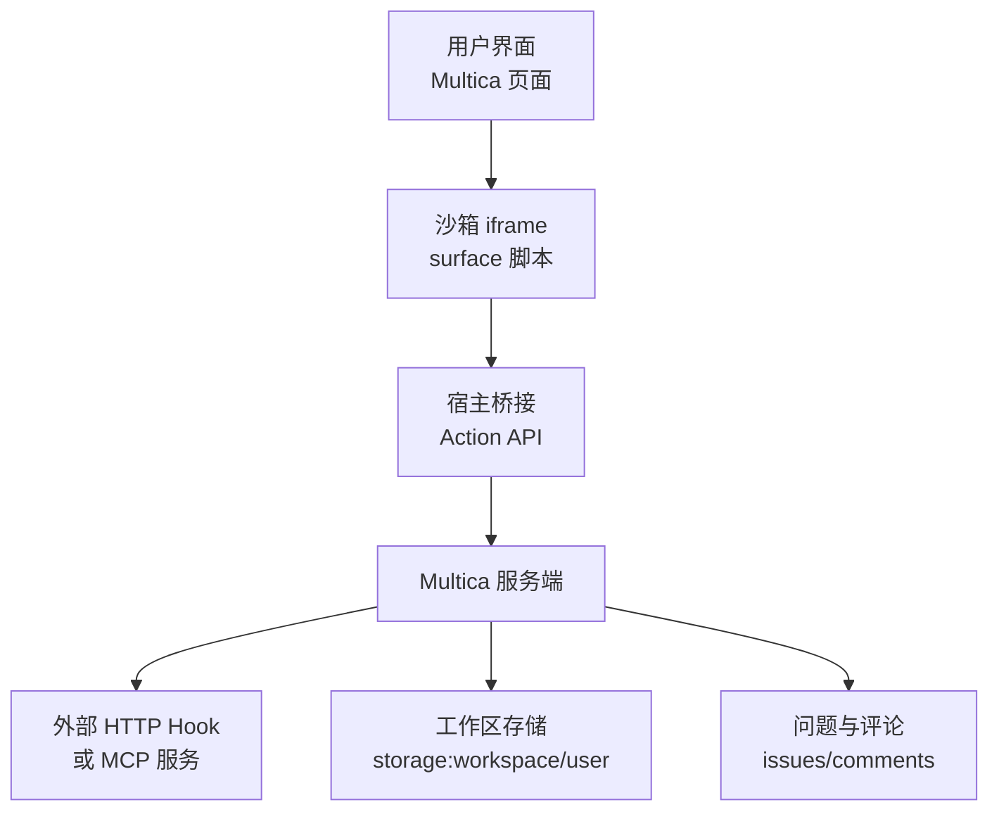
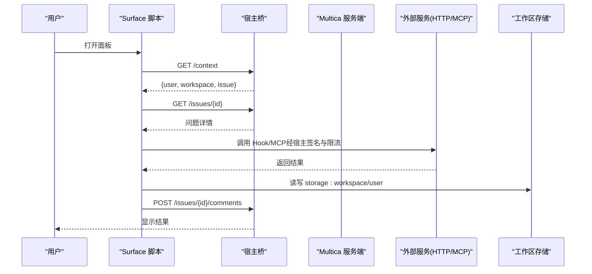
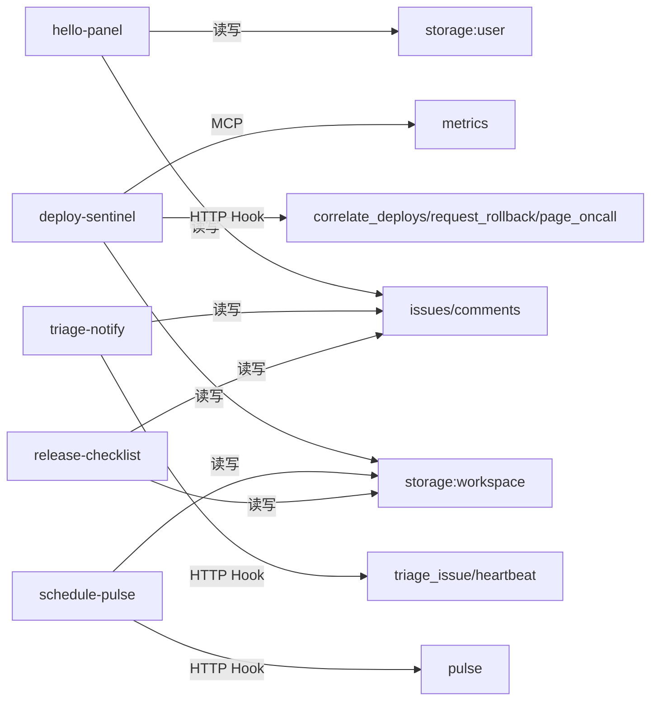

# 示例插件

<cite>
**本文引用的文件**
- [examples/plugins/hello-panel/multica.plugin.json](file://examples/plugins/hello-panel/multica.plugin.json)
- [examples/plugins/hello-panel/ui/main.js](file://examples/plugins/hello-panel/ui/main.js)
- [examples/plugins/hello-panel/README.md](file://examples/plugins/hello-panel/README.md)
- [examples/plugins/deploy-sentinel/multica.plugin.json](file://examples/plugins/deploy-sentinel/multica.plugin.json)
- [examples/plugins/deploy-sentinel/ui/main.js](file://examples/plugins/deploy-sentinel/ui/main.js)
- [examples/plugins/deploy-sentinel/README.md](file://examples/plugins/deploy-sentinel/README.md)
- [examples/plugins/schedule-pulse/multica.plugin.json](file://examples/plugins/schedule-pulse/multica.plugin.json)
- [examples/plugins/schedule-pulse/ui/main.js](file://examples/plugins/schedule-pulse/ui/main.js)
- [examples/plugins/triage-notify/multica.plugin.json](file://examples/plugins/triage-notify/multica.plugin.json)
- [examples/plugins/triage-notify/ui/main.js](file://examples/plugins/triage-notify/ui/main.js)
- [examples/plugins/release-checklist/multica.plugin.json](file://examples/plugins/release-checklist/multica.plugin.json)
- [examples/plugins/release-checklist/ui/main.js](file://examples/plugins/release-checklist/ui/main.js)
</cite>

## 目录
1. [简介](#简介)
2. [项目结构](#项目结构)
3. [核心组件](#核心组件)
4. [架构总览](#架构总览)
5. [详细组件分析](#详细组件分析)
6. [依赖关系分析](#依赖关系分析)
7. [性能与可靠性](#性能与可靠性)
8. [故障排查指南](#故障排查指南)
9. [结论](#结论)
10. [附录：从零开发你的第一个插件](#附录从零开发你的第一个插件)

## 简介
本文件系统性解析 Multica 仓库中的五个示例插件，覆盖 UI 面板、部署监控、定时任务、通知处理与发布检查。每个示例均从功能特性、实现原理、使用方法、关键代码与设计模式、运行环境与配置要求、扩展建议与最佳实践等维度展开，帮助读者快速理解并基于示例构建自己的插件。

## 项目结构
所有示例插件统一遵循“清单 + 前端表面 + 可选后端 Hook/MCP”的结构：
- 清单 multica.plugin.json：声明插件元信息、权限范围、配置项、贡献点（surfaces/hooks/resources）。
- 前端 surface（ui/main.js）：在沙箱 iframe 中运行，通过宿主桥接调用 Multica Action API（上下文、问题、评论、存储、Hook 调用）。
- 可选后端：HTTP Hook 或 MCP 服务，由宿主以签名、限流、域名白名单等方式安全转发。

图表来源
- [examples/plugins/hello-panel/ui/main.js:12-47](file://examples/plugins/hello-panel/ui/main.js#L12-L47)
- [examples/plugins/deploy-sentinel/ui/main.js:17-60](file://examples/plugins/deploy-sentinel/ui/main.js#L17-L60)
- [examples/plugins/triage-notify/ui/main.js:13-47](file://examples/plugins/triage-notify/ui/main.js#L13-L47)
- [examples/plugins/release-checklist/ui/main.js:12-46](file://examples/plugins/release-checklist/ui/main.js#L12-L46)

章节来源
- [examples/plugins/hello-panel/multica.plugin.json:1-21](file://examples/plugins/hello-panel/multica.plugin.json#L1-L21)
- [examples/plugins/deploy-sentinel/multica.plugin.json:1-119](file://examples/plugins/deploy-sentinel/multica.plugin.json#L1-L119)
- [examples/plugins/schedule-pulse/multica.plugin.json:1-49](file://examples/plugins/schedule-pulse/multica.plugin.json#L1-L49)
- [examples/plugins/triage-notify/multica.plugin.json:1-86](file://examples/plugins/triage-notify/multica.plugin.json#L1-L86)
- [examples/plugins/release-checklist/multica.plugin.json:1-54](file://examples/plugins/release-checklist/multica.plugin.json#L1-L54)

## 核心组件
- 插件清单（multica.plugin.json）
  - 定义 key、name、version、scopes、contributes（surfaces、hooks、resources）、config。
  - surfaces 暴露 issue_panel 类型的前端入口；hooks 暴露 agent/manual/ui/event/schedule 触发器；resources 可注入 skill。
- 前端 surface（ui/main.js）
  - 通过 MessagePort 与宿主通信，调用 /context、/issues/*、/comments、/storage/*、/hooks/*。
  - 使用 ui.resize 自适应高度；主题通过 theme 消息注入。
- 后端 Hook/MCP
  - HTTP Hook：HTTPS 地址，受 net: 域名白名单限制，支持超时控制。
  - MCP：作为工具源，需管理员审批后对智能体可见。

章节来源
- [examples/plugins/hello-panel/multica.plugin.json:1-21](file://examples/plugins/hello-panel/multica.plugin.json#L1-L21)
- [examples/plugins/deploy-sentinel/multica.plugin.json:1-119](file://examples/plugins/deploy-sentinel/multica.plugin.json#L1-L119)
- [examples/plugins/schedule-pulse/multica.plugin.json:1-49](file://examples/plugins/schedule-pulse/multica.plugin.json#L1-L49)
- [examples/plugins/triage-notify/multica.plugin.json:1-86](file://examples/plugins/triage-notify/multica.plugin.json#L1-L86)
- [examples/plugins/release-checklist/multica.plugin.json:1-54](file://examples/plugins/release-checklist/multica.plugin.json#L1-L54)

## 架构总览
下图展示一个典型插件的端到端交互：用户在 Multica 打开面板，UI 通过宿主桥调取上下文与数据；如需外部能力，则通过 Hook/MCP 访问受控的外部服务；结果写回问题评论或工作区存储。

图表来源
- [examples/plugins/deploy-sentinel/ui/main.js:54-60](file://examples/plugins/deploy-sentinel/ui/main.js#L54-L60)
- [examples/plugins/triage-notify/ui/main.js:66-89](file://examples/plugins/triage-notify/ui/main.js#L66-L89)
- [examples/plugins/release-checklist/ui/main.js:178-210](file://examples/plugins/release-checklist/ui/main.js#L178-L210)

## 详细组件分析

### hello-panel（UI 面板）
- 功能特性
  - 读取当前问题与上下文，展示用户与工作区信息。
  - 通过 storage:user 保存仅当前成员可见的备注。
  - 以 comments:write 权限发布测试评论。
  - 演示 ui.resize 自适应高度与主题适配。
- 实现原理
  - 通过 MessagePort 与宿主通信，封装 call(method, path, body) 进行请求。
  - 使用 /context 获取身份与问题，/issues/{id} 拉取标题，/storage/user 存取备注，/issues/{id}/comments 发布评论。
- 使用方法
  - 将插件打包上传至设置中的插件管理；无需自有服务器。
  - 在任意问题页打开 Hello 面板即可体验。
- 关键代码与设计模式
  - 最小化客户端：无模块图，单文件 ES 模块，便于静态托管。
  - Promise 队列与 pending Map 管理异步响应。
  - 主题与应用样式通过 CSS 变量注入。
- 运行环境与配置
  - 仅需 Multica 环境；无 net: 域名授权，因此无法直接外发网络请求。
- 扩展建议
  - 接入更多 Action API（如标签、字段、附件）。
  - 结合 storage:workspace 实现团队共享笔记。
  - 增加错误提示与重试逻辑。

章节来源
- [examples/plugins/hello-panel/multica.plugin.json:1-21](file://examples/plugins/hello-panel/multica.plugin.json#L1-L21)
- [examples/plugins/hello-panel/ui/main.js:12-108](file://examples/plugins/hello-panel/ui/main.js#L12-L108)
- [examples/plugins/hello-panel/README.md:1-40](file://examples/plugins/hello-panel/README.md#L1-L40)

### deploy-sentinel（部署监控）
- 功能特性
  - 关联生产事件与近期部署，提供回滚申请流程。
  - 事件驱动通知值班工程师。
  - 集成团队指标 MCP 工具，供智能体查询时序、告警与依赖。
- 实现原理
  - 定义多个 Hook：correlate_deploys、request_rollback、page_oncall、metrics。
  - 通过 ui 触发器调用 correlate_deploys 与 request_rollback；event 触发 page_oncall；mcp 传输接入指标服务。
  - 前端在沙箱中通过 /hooks/{key} 调用自身 Hook，由宿主签名并限速。
- 使用方法
  - 安装后在工作区配置服务前缀、回滚窗口、环境、令牌等。
  - 在问题面板查看最近部署并发起回滚申请。
- 关键代码与设计模式
  - 拒绝策略：超出时间窗或理由过短即拒绝，返回明确原因以便智能体调整行为。
  - 空结果语义：无部署时返回“未找到部署”的总结，而非空列表。
  - Skill 资源：SKILL.md 描述工具与调用顺序，与 Hook 设计协同。
- 运行环境与配置
  - 需要两个 HTTPS 后端：Hook 处理器与 MCP 服务。
  - 本地开发需自签证书并通过 MULTICA_PLUGIN_DEV_ORIGINS 与 MULTICA_PLUGIN_DEV_CA 放行。
- 扩展建议
  - 增加更多 Hook（如变更集对比、影响面评估）。
  - 为 MCP 工具添加输入校验与输出规范化。
  - 引入审计日志与告警聚合。

章节来源
- [examples/plugins/deploy-sentinel/multica.plugin.json:1-119](file://examples/plugins/deploy-sentinel/multica.plugin.json#L1-L119)
- [examples/plugins/deploy-sentinel/ui/main.js:17-135](file://examples/plugins/deploy-sentinel/ui/main.js#L17-L135)
- [examples/plugins/deploy-sentinel/README.md:1-114](file://examples/plugins/deploy-sentinel/README.md#L1-L114)

### schedule-pulse（定时任务）
- 功能特性
  - 每五分钟唤醒一次，记录一次唯一 delivery_id 的工作区脉冲。
  - 前端只读展示最近一次调度交付的状态。
- 实现原理
  - 通过 schedule 触发器与 cron 表达式调度 Hook。
  - Hook 写入 storage:workspace/last_pulse，包含 count、delivery_id、last_planned_at、last_attempt。
  - 前端读取该键值展示状态。
- 使用方法
  - 安装后无需额外配置；Multica 自动按周期执行。
- 关键代码与设计模式
  - 幂等性：同一 delivery_id 重复投递不计数。
  - 前后端解耦：前端只读，后端负责持久化与调度。
- 运行环境与配置
  - 仅需 Multica；无需自有服务器。
- 扩展建议
  - 增加失败重试与告警。
  - 将脉冲指标上报到监控系统。
  - 支持多租户隔离与配额控制。

章节来源
- [examples/plugins/schedule-pulse/multica.plugin.json:1-49](file://examples/plugins/schedule-pulse/multica.plugin.json#L1-L49)
- [examples/plugins/schedule-pulse/ui/main.js:1-68](file://examples/plugins/schedule-pulse/ui/main.js#L1-L68)

### triage-notify（通知处理）
- 功能特性
  - 将问题发送至外部分诊服务，并将建议的负责人与优先级以评论形式写回。
  - 提供无副作用的心跳 Hook，用于确认调度投递已送达。
- 实现原理
  - 定义 triage_issue（ui/manual/event）与 scheduled_heartbeat（schedule）两个 Hook。
  - 前端通过 /hooks/triage_issue 调用，宿主签名并限速；成功后写评论。
  - 心跳 Hook 仅做确认，不写 Multica。
- 使用方法
  - 安装后在工作区配置 team 参数。
  - 在问题面板点击“Triage this issue”触发分诊。
- 关键代码与设计模式
  - 区分 refused 与 service failure：前者是权限/限流/禁用导致，后者是外部服务异常。
  - 事件驱动：issue.created 自动触发分诊。
- 运行环境与配置
  - 需要 HTTPS 的分诊服务与心跳服务。
  - 通过 net:triage.example.com 授权出站访问。
- 扩展建议
  - 增加重试与退避策略。
  - 将分诊结果结构化写入自定义字段。
  - 增加反馈闭环（人工修正后更新模型）。

章节来源
- [examples/plugins/triage-notify/multica.plugin.json:1-86](file://examples/plugins/triage-notify/multica.plugin.json#L1-L86)
- [examples/plugins/triage-notify/ui/main.js:1-135](file://examples/plugins/triage-notify/ui/main.js#L1-L135)

### release-checklist（发布检查）
- 功能特性
  - 工作区级定义发布检查清单，每个问题独立维护勾选状态。
  - 全部完成后发布签署评论，支持严格模式（必须全部完成才允许提交）。
- 实现原理
  - 清单来自工作区配置；状态以 storage:workspace/checklist:{issueId} 存储。
  - 勾选变化时即时持久化；提交时根据模板渲染签署评论并发布。
- 使用方法
  - 在工作区插件设置中填写清单项与签署模板。
  - 在问题面板逐项勾选并提交签署。
- 关键代码与设计模式
  - 以文本为键存储勾选集合，避免清单项重排导致状态错位。
  - 严格模式与宽松模式切换，提升合规性。
- 运行环境与配置
  - 仅需 Multica；无需自有服务器。
- 扩展建议
  - 增加审核流程与电子签名。
  - 与 CI/CD 状态联动，自动推进清单。
  - 导出审计报告与趋势统计。

章节来源
- [examples/plugins/release-checklist/multica.plugin.json:1-54](file://examples/plugins/release-checklist/multica.plugin.json#L1-L54)
- [examples/plugins/release-checklist/ui/main.js:1-214](file://examples/plugins/release-checklist/ui/main.js#L1-L214)

## 依赖关系分析
各示例插件之间的依赖关系主要体现在清单声明的 scopes、contributes 以及 Hook/MCP 的使用上。

图表来源
- [examples/plugins/hello-panel/multica.plugin.json:8-18](file://examples/plugins/hello-panel/multica.plugin.json#L8-L18)
- [examples/plugins/deploy-sentinel/multica.plugin.json:9-116](file://examples/plugins/deploy-sentinel/multica.plugin.json#L9-L116)
- [examples/plugins/schedule-pulse/multica.plugin.json:11-46](file://examples/plugins/schedule-pulse/multica.plugin.json#L11-L46)
- [examples/plugins/triage-notify/multica.plugin.json:11-83](file://examples/plugins/triage-notify/multica.plugin.json#L11-L83)
- [examples/plugins/release-checklist/multica.plugin.json:11-51](file://examples/plugins/release-checklist/multica.plugin.json#L11-L51)

章节来源
- [examples/plugins/hello-panel/multica.plugin.json:1-21](file://examples/plugins/hello-panel/multica.plugin.json#L1-L21)
- [examples/plugins/deploy-sentinel/multica.plugin.json:1-119](file://examples/plugins/deploy-sentinel/multica.plugin.json#L1-L119)
- [examples/plugins/schedule-pulse/multica.plugin.json:1-49](file://examples/plugins/schedule-pulse/multica.plugin.json#L1-L49)
- [examples/plugins/triage-notify/multica.plugin.json:1-86](file://examples/plugins/triage-notify/multica.plugin.json#L1-L86)
- [examples/plugins/release-checklist/multica.plugin.json:1-54](file://examples/plugins/release-checklist/multica.plugin.json#L1-L54)

## 性能与可靠性
- 前端性能
  - 单文件 ES 模块，无模块图，减少加载与解析开销。
  - 使用 ui.resize 按需调整高度，避免滚动抖动。
- 网络与超时
  - Hook 与 MCP 均配置 timeout_ms，防止长时间阻塞。
  - 通过 net: 域名白名单限制出站，降低攻击面。
- 幂等与去重
  - schedule-pulse 使用 delivery_id 保证重复投递不计数。
- 错误处理
  - 区分 refused 与 service failure，给出明确错误信息。
  - 拒绝策略（如 deploy-sentinel 的回滚窗口与理由长度）提升质量。
- 可扩展性
  - 通过 Hook 与 MCP 解耦业务逻辑，便于横向扩展。
  - 工作区存储与用户存储分离，满足共享与隐私需求。

[本节为通用指导，不直接分析具体文件]

## 故障排查指南
- 无法连接外部服务
  - 检查 net: 是否包含目标域名；确保 HTTPS 且证书有效。
  - 本地开发需设置 MULTICA_PLUGIN_DEV_ORIGINS 与 MULTICA_PLUGIN_DEV_CA。
- 权限不足
  - 确认 scopes 已授予（如 issues:read、comments:write、storage:*）。
  - 若出现 refused，通常是权限、限流或安装被禁用。
- 前端报错
  - 检查宿主桥是否可用（MessagePort 是否存在）。
  - 确认 /context、/issues/{id}、/storage/* 路径正确。
- 定时任务未执行
  - 核对 cron 表达式与时区；确认 Hook 类型为 schedule。
- 状态不同步
  - 检查 storage:workspace 键名与序列化格式；确保并发写入时的幂等性。

章节来源
- [examples/plugins/deploy-sentinel/README.md:42-91](file://examples/plugins/deploy-sentinel/README.md#L42-L91)
- [examples/plugins/triage-notify/ui/main.js:66-89](file://examples/plugins/triage-notify/ui/main.js#L66-L89)
- [examples/plugins/release-checklist/ui/main.js:178-210](file://examples/plugins/release-checklist/ui/main.js#L178-L210)

## 结论
这五个示例覆盖了插件开发的常见场景：纯 UI 面板、事件与定时任务、外部服务集成、智能体工具与技能注入。它们展示了 Multica 插件体系的核心契约：清单声明、沙箱安全、宿主桥接、Hook/MCP 扩展、存储分层与权限控制。基于这些示例，你可以快速构建稳定、可审计、可扩展的企业级插件。

[本节为总结性内容，不直接分析具体文件]

## 附录：从零开发你的第一个插件
- 步骤概览
  - 创建 multica.plugin.json，声明 key、name、version、scopes、contributes。
  - 编写 ui/main.js，实现最小可用面板：读取上下文、展示数据、调用 Hook/MCP、写存储或评论。
  - 打包上传至 Multica 插件管理，或在开发模式下通过 MULTICA_PLUGIN_DIR 直接发布。
- 推荐实践
  - 优先使用 storage:workspace 共享状态，storage:user 保存个人偏好。
  - 对外部调用一律通过宿主桥调用 /hooks/*，不要在前端直连外部服务。
  - 为 Hook 设置合理的 timeout_ms，并处理拒绝与失败分支。
  - 使用 SKILL.md 描述工具与调用顺序，使智能体能正确使用你的插件。
- 参考路径
  - 最小面板：[examples/plugins/hello-panel/ui/main.js:12-108](file://examples/plugins/hello-panel/ui/main.js#L12-L108)
  - 复杂 Hook 与 MCP：[examples/plugins/deploy-sentinel/multica.plugin.json:51-116](file://examples/plugins/deploy-sentinel/multica.plugin.json#L51-L116)
  - 定时任务：[examples/plugins/schedule-pulse/multica.plugin.json:28-46](file://examples/plugins/schedule-pulse/multica.plugin.json#L28-L46)
  - 事件驱动：[examples/plugins/triage-notify/multica.plugin.json:39-83](file://examples/plugins/triage-notify/multica.plugin.json#L39-L83)
  - 工作区状态与评论：[examples/plugins/release-checklist/ui/main.js:178-210](file://examples/plugins/release-checklist/ui/main.js#L178-L210)

章节来源
- [examples/plugins/hello-panel/README.md:18-39](file://examples/plugins/hello-panel/README.md#L18-L39)
- [examples/plugins/deploy-sentinel/README.md:42-114](file://examples/plugins/deploy-sentinel/README.md#L42-L114)