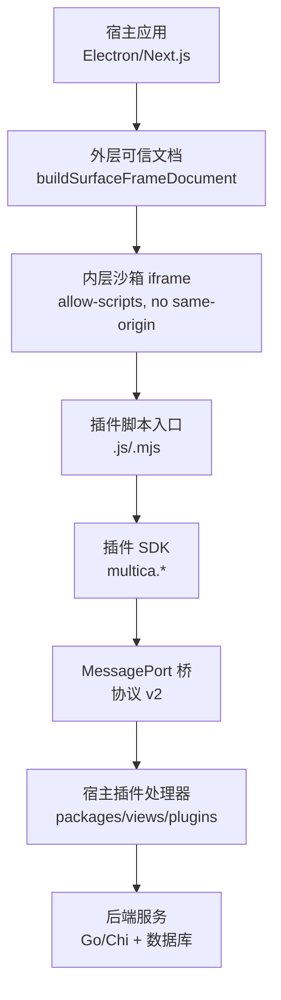
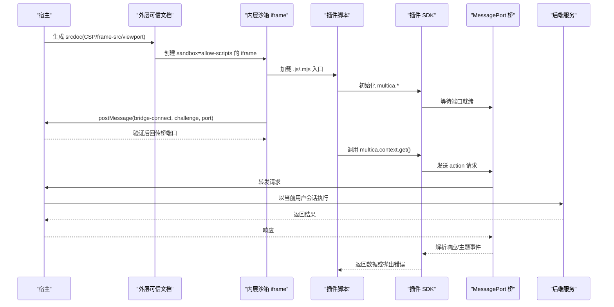
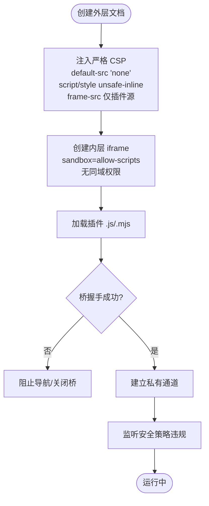
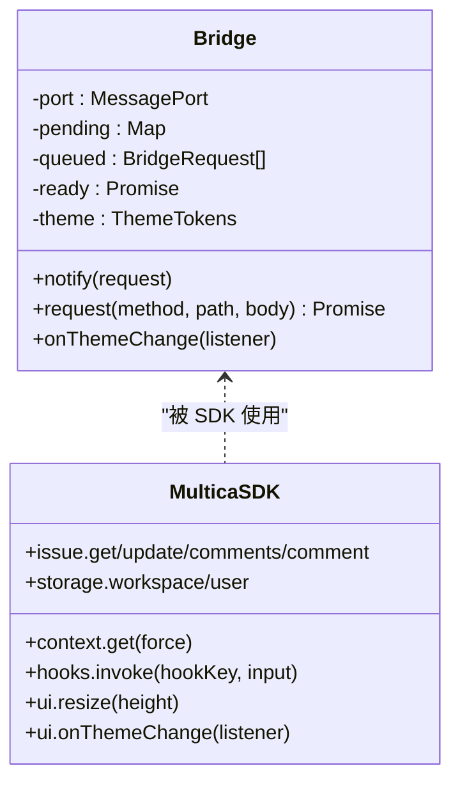
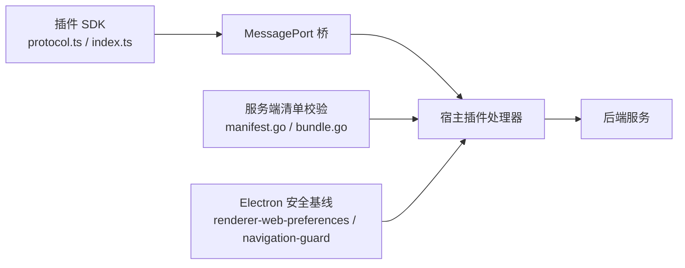

# 表面系统集成

<cite>
**本文引用的文件**
- [surface-document.ts](file://packages/views/plugins/surface-document.ts)
- [protocol.ts](file://packages/plugin-sdk/protocol.ts)
- [index.ts](file://packages/plugin-sdk/index.ts)
- [manifest.go](file://server/pkg/plugincontract/manifest.go)
- [bundle.go](file://server/pkg/plugincontract/bundle.go)
- [plugin-surface-document.spec.ts](file://e2e/plugin-surface-document.spec.ts)
- [plugin-surface-security.spec.ts](file://e2e/plugin-surface-security.spec.ts)
- [iframe-scroll-bridge.spec.ts](file://e2e/iframe-scroll-bridge.spec.ts)
- [renderer-web-preferences.ts](file://apps/desktop/src/main/renderer-web-preferences.ts)
- [navigation-guard.ts](file://apps/desktop/src/main/navigation-guard.ts)
- [main-renderer-messages.ts](file://apps/desktop/src/shared/main-renderer-messages.ts)
- [index.ts](file://apps/desktop/src/main/index.ts)
</cite>

## 目录
1. [简介](#简介)
2. [项目结构](#项目结构)
3. [核心组件](#核心组件)
4. [架构总览](#架构总览)
5. [详细组件分析](#详细组件分析)
6. [依赖关系分析](#依赖关系分析)
7. [性能考量](#性能考量)
8. [故障排查指南](#故障排查指南)
9. [结论](#结论)
10. [附录：集成示例与最佳实践](#附录集成示例与最佳实践)

## 简介
本文件系统性说明 Multica 的“表面系统（Surface System）”如何通过 iframe 技术实现 UI 扩展，覆盖以下要点：
- 宿主如何创建、配置并安全隔离插件 iframe；
- 插件 UI 的嵌入机制：路由映射、消息传递与事件处理；
- 插件与宿主的通信协议：API 调用、状态同步与事件广播；
- 跨域安全策略与 CSP 配置；
- 响应式设计与移动端适配方案；
- 完整集成示例与调试技巧、性能优化方法。

## 项目结构
围绕 Surface System 的关键代码分布在如下位置：
- 前端视图层：生成受信任的外层容器文档与内层沙箱 iframe 的桥接逻辑；
- 插件 SDK：为插件侧提供统一的 API 封装与消息通道；
- 服务端契约：对插件清单中的 Surface 声明进行校验与安全约束；
- Electron 桌面端：渲染进程的安全偏好、导航守卫与主从进程消息队列；
- E2E 测试：覆盖真实 Chromium 行为，验证沙箱、CSP、滚动桥接等关键特性。

图表来源
- [surface-document.ts:63-156](file://packages/views/plugins/surface-document.ts#L63-L156)
- [protocol.ts:20-56](file://packages/plugin-sdk/protocol.ts#L20-L56)
- [index.ts:90-168](file://packages/plugin-sdk/index.ts#L90-L168)
- [manifest.go:200-208](file://server/pkg/plugincontract/manifest.go#L200-L208)

章节来源
- [surface-document.ts:63-156](file://packages/views/plugins/surface-document.ts#L63-L156)
- [manifest.go:200-208](file://server/pkg/plugincontract/manifest.go#L200-L208)

## 核心组件
- 表面文档构建器：负责生成外层可信 HTML，注入严格 CSP，创建仅允许脚本的内层沙箱 iframe，并通过一次性挑战完成桥连接。
- 插件 SDK：在插件侧暴露 multica.* API，通过 MessagePort 将请求转发给宿主执行，避免凭据进入插件帧。
- 服务端清单校验：强制 Surface 入口为经典脚本，限制类型与平台，并将 Hook 传输目标限定到已声明的 net: 域名。
- Electron 安全基线：启用进程沙箱、禁用 webSecurity（迁移前）、安装导航守卫、维护主/渲染消息队列。

章节来源
- [surface-document.ts:1-156](file://packages/views/plugins/surface-document.ts#L1-L156)
- [index.ts:1-282](file://packages/plugin-sdk/index.ts#L1-L282)
- [manifest.go:200-235](file://server/pkg/plugincontract/manifest.go#L200-L235)
- [renderer-web-preferences.ts:29-51](file://apps/desktop/src/main/renderer-web-preferences.ts#L29-L51)
- [navigation-guard.ts:77-89](file://apps/desktop/src/main/navigation-guard.ts#L77-L89)

## 架构总览
Surface System 采用“外层可信 + 内层沙箱”的双层 iframe 模型：
- 外层由宿主生成，承载严格的 CSP 与 frame-src 白名单，仅允许加载插件内容源；
- 内层以 allow-scripts 且禁止同域的方式运行插件代码，确保不同插件之间相互隔离；
- 插件与宿主通过一次性的 MessageChannel 握手建立私有通道，后续所有 API 调用均经此通道转发；
- 宿主在用户会话上下文中执行实际 API 调用，插件不持有凭据；
- 服务端对插件清单进行强校验，确保网络访问范围与能力声明一致。

图表来源
- [surface-document.ts:63-156](file://packages/views/plugins/surface-document.ts#L63-L156)
- [protocol.ts:20-56](file://packages/plugin-sdk/protocol.ts#L20-L56)
- [index.ts:90-168](file://packages/plugin-sdk/index.ts#L90-L168)

## 详细组件分析

### 表面文档与 iframe 安全隔离
- 外层文档使用最小化 CSP：默认拒绝一切资源，仅放行 script/style，frame-src 精确限定插件内容源；
- 内层 iframe 仅开启 allow-scripts，不授予同域权限，使每个插件获得独立的不透明 origin，彼此不可见；
- 通过一次性 challenge 与版本协商建立桥连接，连接成功后销毁 token，防止重放；
- 监听安全策略违规事件，拦截非法导航并通知宿主终止表面；
- 支持通过 srcdoc 热重载而不触发“恶意导航”误报。

图表来源
- [surface-document.ts:63-156](file://packages/views/plugins/surface-document.ts#L63-L156)
- [plugin-surface-security.spec.ts:4-32](file://e2e/plugin-surface-security.spec.ts#L4-L32)
- [plugin-surface-security.spec.ts:34-86](file://e2e/plugin-surface-security.spec.ts#L34-L86)

章节来源
- [surface-document.ts:63-156](file://packages/views/plugins/surface-document.ts#L63-L156)
- [plugin-surface-security.spec.ts:4-105](file://e2e/plugin-surface-security.spec.ts#L4-L105)

### 插件 SDK 与消息协议
- 协议版本：v2，通过全局 MessagePort 标识通道；
- 请求格式：action（GET/POST/PATCH/PUT/DELETE）与 ui.resize；
- 响应格式：统一 ok/status/data/error；
- 主题事件：host 主动推送 theme tokens，插件可订阅变化；
- 超时控制：默认 15s，超时返回 408；
- 存储 API：按 workspace/user 作用域提供 list/get/set/delete；
- 上下文与问题：获取当前用户/工作区/问题信息，并支持评论读写；
- Hook 调用：通过宿主代理调用本插件声明的 ui 触发钩子，保证签名、限流与网域白名单。

图表来源
- [index.ts:90-168](file://packages/plugin-sdk/index.ts#L90-L168)
- [index.ts:172-282](file://packages/plugin-sdk/index.ts#L172-L282)
- [protocol.ts:20-76](file://packages/plugin-sdk/protocol.ts#L20-L76)

章节来源
- [index.ts:1-282](file://packages/plugin-sdk/index.ts#L1-L282)
- [protocol.ts:1-76](file://packages/plugin-sdk/protocol.ts#L1-L76)

### 服务端清单校验与网络访问控制
- Surface 声明：key/type/name/entry/platforms，仅允许有限类型；
- 入口限制：必须为 .js/.mjs 经典脚本，宿主负责生成文档并注入 CSP；
- Hook 传输：URL 必须 HTTPS，且主机名必须在 manifest 的 net: 作用域中精确匹配；
- 打包校验：表面脚本需为 UTF-8 文本，禁止顶层 import/export/await/import.meta，确保单文件无模块图。

章节来源
- [manifest.go:200-235](file://server/pkg/plugincontract/manifest.go#L200-L235)
- [manifest.go:556-587](file://server/pkg/plugincontract/manifest.go#L556-L587)
- [manifest.go:753-781](file://server/pkg/plugincontract/manifest.go#L753-L781)
- [bundle.go:240-259](file://server/pkg/plugincontract/bundle.go#L240-L259)

### Electron 渲染进程安全与导航守卫
- 渲染进程启用进程沙箱；webSecurity 在迁移前保持关闭，但其他安全基线（contextIsolation on、nodeIntegration off、sandbox on）始终生效；
- 安装 will-navigate 守卫，仅允许可信渲染 URL 导航，否则阻止并记录告警；
- 主/渲染消息通道具备就绪状态与队列机制，确保早期消息不丢失。

章节来源
- [renderer-web-preferences.ts:29-51](file://apps/desktop/src/main/renderer-web-preferences.ts#L29-L51)
- [navigation-guard.ts:77-89](file://apps/desktop/src/main/navigation-guard.ts#L77-L89)
- [main-renderer-messages.ts:41-92](file://apps/desktop/src/shared/main-renderer-messages.ts#L41-L92)
- [index.ts:722-751](file://apps/desktop/src/main/index.ts#L722-L751)

### 滚动桥接与移动端适配
- 滚动桥接：在沙箱 iframe 内上报滚动位置，宿主恢复时携带令牌校验，避免串扰；
- 防抖与恢复：在延迟追加内容后仍保持目标滚动位置，并在用户接管滚动后让出控制权；
- 移动端适配：外层文档设置 viewport 与 100% 宽高，隐藏溢出，配合主题 tokens 自适应样式。

章节来源
- [iframe-scroll-bridge.spec.ts:1-258](file://e2e/iframe-scroll-bridge.spec.ts#L1-L258)
- [surface-document.ts:83-92](file://packages/views/plugins/surface-document.ts#L83-L92)

## 依赖关系分析
- 插件 SDK 与服务端契约解耦：SDK 不依赖 @multica/core/ui，仅定义轻量协议；
- 宿主与插件通过 MessagePort 绑定身份，而非 event.origin，规避沙箱 origin 为 null 的问题；
- 服务端对清单的校验前置，确保运行时不会发生未授权的网络访问；
- Electron 安全策略与导航守卫共同构成进程级边界，与浏览器 CSP 形成纵深防御。

图表来源
- [protocol.ts:20-56](file://packages/plugin-sdk/protocol.ts#L20-L56)
- [index.ts:90-168](file://packages/plugin-sdk/index.ts#L90-L168)
- [manifest.go:556-587](file://server/pkg/plugincontract/manifest.go#L556-L587)
- [renderer-web-preferences.ts:29-51](file://apps/desktop/src/main/renderer-web-preferences.ts#L29-L51)
- [navigation-guard.ts:77-89](file://apps/desktop/src/main/navigation-guard.ts#L77-L89)

章节来源
- [protocol.ts:1-76](file://packages/plugin-sdk/protocol.ts#L1-L76)
- [index.ts:1-282](file://packages/plugin-sdk/index.ts#L1-L282)
- [manifest.go:200-235](file://server/pkg/plugincontract/manifest.go#L200-L235)
- [renderer-web-preferences.ts:29-51](file://apps/desktop/src/main/renderer-web-preferences.ts#L29-L51)
- [navigation-guard.ts:77-89](file://apps/desktop/src/main/navigation-guard.ts#L77-L89)

## 性能考量
- 首屏加载：外层文档最小化 CSS，按需加载插件脚本；
- 桥连接：一次性握手，避免重复认证开销；
- 请求批处理：SDK 内部维护 pending 与队列，减少无效重试；
- 主题更新：事件驱动的主题变更，避免轮询；
- 滚动恢复：基于 ResizeObserver 与令牌校验，避免频繁重算；
- 超时控制：默认 15s，避免悬挂请求占用资源。

[本节为通用指导，无需特定文件引用]

## 故障排查指南
- 插件报错未捕获：外层文档会报告同步启动错误，宿主需监听错误消息并确认 ack；
- 导航被阻断：若触发 frame-src 违规，外层会发出导航被阻止事件，检查 CSP 与 frame-src 配置；
- 桥连接失败：核对协议版本、challenge 是否一致，确认端口已正确传递；
- 滚动错位：检查 restore 消息中的令牌是否匹配，避免多实例串扰；
- Electron 导航异常：确认 will-navigate 守卫是否放行可信 URL，检查主/渲染消息队列是否就绪。

章节来源
- [plugin-surface-document.spec.ts:10-89](file://e2e/plugin-surface-document.spec.ts#L10-L89)
- [plugin-surface-security.spec.ts:34-86](file://e2e/plugin-surface-security.spec.ts#L34-L86)
- [iframe-scroll-bridge.spec.ts:150-163](file://e2e/iframe-scroll-bridge.spec.ts#L150-L163)
- [navigation-guard.ts:77-89](file://apps/desktop/src/main/navigation-guard.ts#L77-L89)

## 结论
Surface System 通过“外层可信 + 内层沙箱”的 iframe 架构，结合严格的 CSP、精确的 frame-src 白名单与一次性的桥握手，实现了插件 UI 的安全嵌入与隔离。插件 SDK 屏蔽了底层消息细节，提供一致的 API 抽象；服务端清单校验确保网络访问与能力声明一致；Electron 安全基线与导航守卫补齐了桌面端边界。该设计在保证安全的前提下，提供了良好的可扩展性与开发体验。

[本节为总结性内容，无需特定文件引用]

## 附录：集成示例与最佳实践

### 开发可嵌入的插件界面
- 清单声明：在插件清单中声明 Surface，指定 key、type、name、entry（.js/.mjs）与 platforms；
- 入口脚本：编写经典脚本，避免顶层 import/export/await/import.meta；
- 使用 SDK：在插件中引入 multica.*，通过 context、issue、storage、hooks、ui 等接口与宿主交互；
- 主题适配：订阅主题变化，动态调整样式；
- 滚动管理：如需长页面，遵循滚动桥接约定，使用令牌恢复位置。

章节来源
- [manifest.go:200-235](file://server/pkg/plugincontract/manifest.go#L200-L235)
- [bundle.go:240-259](file://server/pkg/plugincontract/bundle.go#L240-L259)
- [index.ts:199-282](file://packages/plugin-sdk/index.ts#L199-L282)

### 调试技巧
- 使用 E2E 测试用例模拟真实 Chromium 行为，验证 srcdoc 重载、错误上报、导航阻断；
- 在宿主侧监听 surface 生命周期事件（如 navigated、error），定位问题阶段；
- 检查 CSP 违规事件，确认 frame-src/connect-src 是否符合预期；
- 在 Electron 中观察 will-navigate 日志，确认导航是否被守卫阻止。

章节来源
- [plugin-surface-document.spec.ts:10-89](file://e2e/plugin-surface-document.spec.ts#L10-L89)
- [plugin-surface-security.spec.ts:4-105](file://e2e/plugin-surface-security.spec.ts#L4-L105)
- [navigation-guard.ts:77-89](file://apps/desktop/src/main/navigation-guard.ts#L77-L89)

### 性能优化建议
- 精简插件入口，避免大体积脚本；
- 合理使用缓存（如 context 缓存），减少重复请求；
- 对长列表/长页面使用虚拟滚动，降低 DOM 压力；
- 利用主题事件批量更新样式，避免多次重排；
- 合理设置请求超时，及时释放资源。

[本节为通用指导，无需特定文件引用]