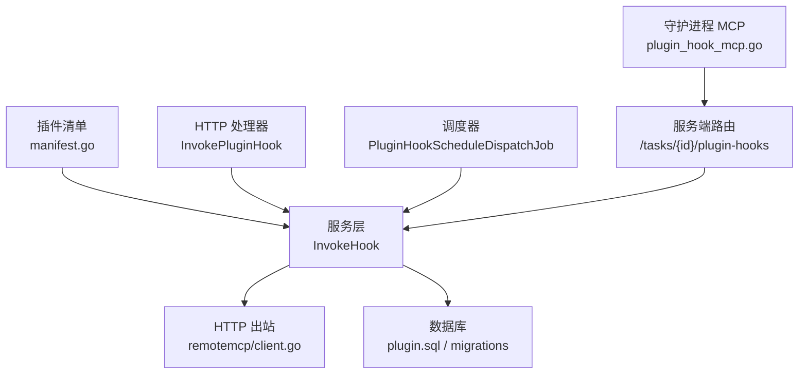
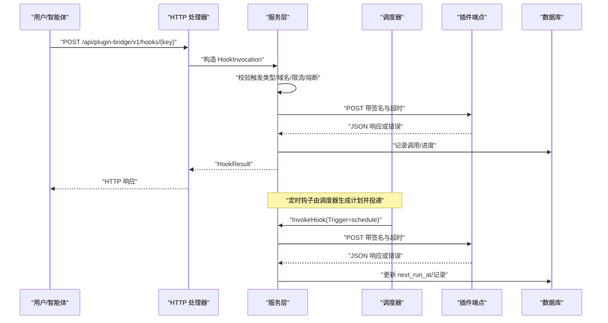
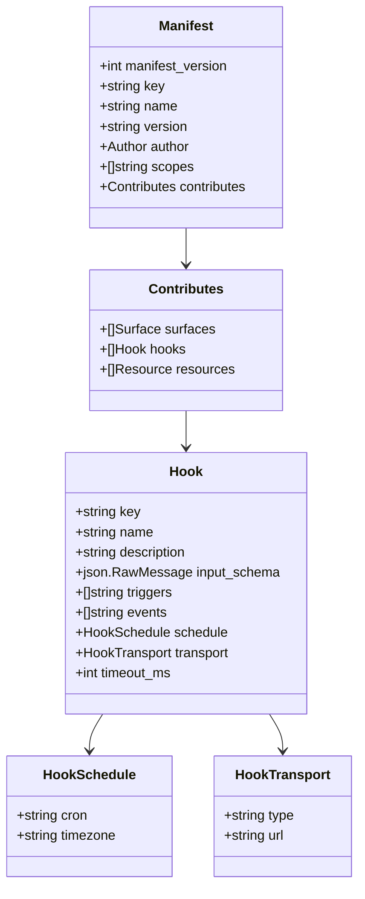
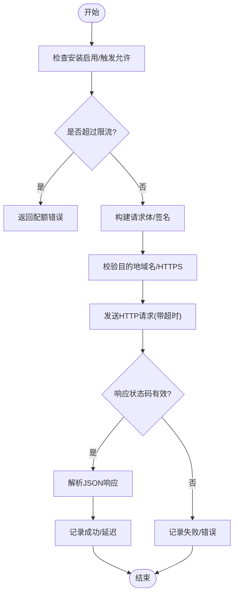
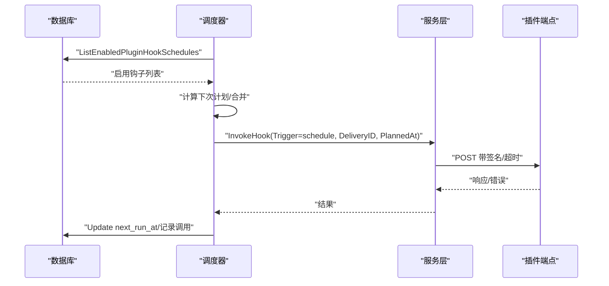
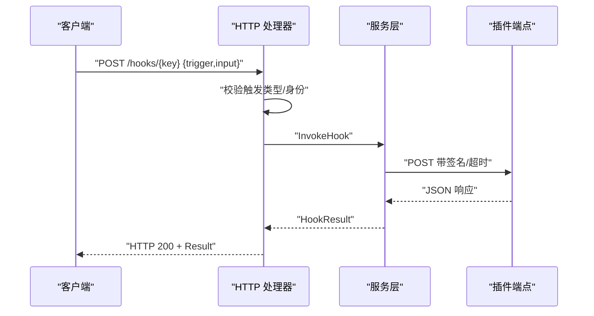
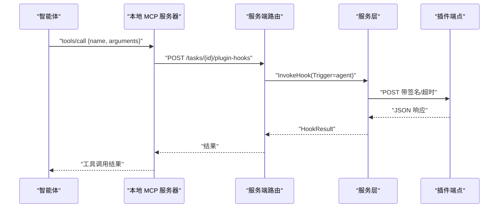
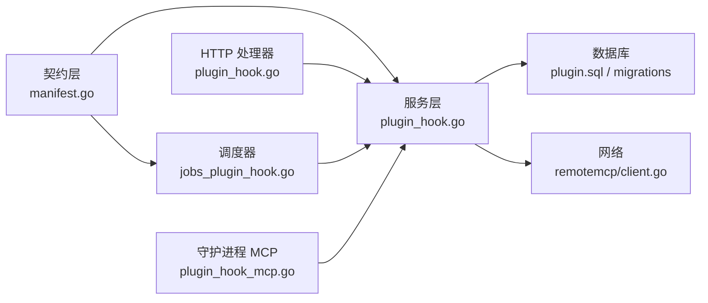

# 钩子系统

<cite>
**本文引用的文件**
- [manifest.go](file://server/pkg/plugincontract/manifest.go)
- [plugin_hook.go（服务层）](file://server/internal/service/plugin_hook.go)
- [jobs_plugin_hook.go（调度器）](file://server/internal/scheduler/jobs_plugin_hook.go)
- [plugin_hook.go（HTTP 处理器）](file://server/internal/handler/plugin_hook.go)
- [plugin.sql（数据库查询）](file://server/pkg/db/queries/plugin.sql)
- [399_plugin_hook_schedule.up.sql](file://server/migrations/399_plugin_hook_schedule.up.sql)
- [400_plugin_hook_schedule_installation_key_index.up.sql](file://server/migrations/400_plugin_hook_schedule_installation_key_index.up.sql)
- [401_plugin_hook_schedule_enabled_index.up.sql](file://server/migrations/401_plugin_hook_schedule_enabled_index.up.sql)
- [plugin_hook_mcp.go（守护进程 MCP）](file://server/internal/daemon/plugin_hook_mcp.go)
- [client.go（远程 MCP 安全客户端）](file://server/pkg/remotemcp/client.go)
- [devorigin.go（开发环境白名单）](file://server/pkg/remotemcp/devorigin.go)
</cite>

## 目录
1. [简介](#简介)
2. [项目结构](#项目结构)
3. [核心组件](#核心组件)
4. [架构总览](#架构总览)
5. [详细组件分析](#详细组件分析)
6. [依赖关系分析](#依赖关系分析)
7. [性能与并发](#性能与并发)
8. [故障排查指南](#故障排查指南)
9. [结论](#结论)
10. [附录：最佳实践与示例](#附录最佳实践与示例)

## 简介
本文件系统性地说明 Multica 的插件钩子系统。钩子是“主机调用插件”的能力，由插件在清单中声明，并由宿主按触发类型进行调度与执行。系统支持多种触发类型：
- UI/手动触发：用户界面或命令面板发起，阻塞等待结果。
- 事件触发：异步事件总线驱动，不阻塞请求。
- 定时触发：基于 cron 的周期性任务，通过持久化调度器可靠投递。

钩子通过 HTTP 传输到插件端点，具备签名校验、速率限制、熔断保护、超时控制、响应体大小限制等安全与稳定性保障。定时钩子使用数据库驱动的分布式调度器，具备重试、合并与幂等投递能力。

## 项目结构
钩子系统横跨多个包与职责清晰的层次：
- 契约定义：插件清单与钩子模型、触发类型、传输方式、安全策略。
- 服务层：构建请求体、签名、网络发送、限流与熔断、记录调用。
- 调度器：定时钩子的计划生成、去重、重试与推进下一次运行时间。
- HTTP 处理器：UI/手动触发的入口，鉴权与参数校验。
- 守护进程 MCP：将插件钩子暴露为本地工具，供智能体调用并路由回服务端执行。
- 数据库迁移与查询：存储安装、调度配置与调用记录。

图表来源
- [manifest.go:49-72](file://server/pkg/plugincontract/manifest.go#L49-L72)
- [plugin_hook.go（服务层）:192-242](file://server/internal/service/plugin_hook.go#L192-L242)
- [jobs_plugin_hook.go:96-116](file://server/internal/scheduler/jobs_plugin_hook.go#L96-L116)
- [plugin_hook.go（HTTP 处理器）:31-94](file://server/internal/handler/plugin_hook.go#L31-L94)
- [plugin_hook_mcp.go:16-34](file://server/internal/daemon/plugin_hook_mcp.go#L16-L34)
- [client.go:114-148](file://server/pkg/remotemcp/client.go#L114-L148)
- [plugin.sql:156-198](file://server/pkg/db/queries/plugin.sql#L156-L198)

章节来源
- [manifest.go:49-72](file://server/pkg/plugincontract/manifest.go#L49-L72)
- [plugin_hook.go（服务层）:192-242](file://server/internal/service/plugin_hook.go#L192-L242)
- [jobs_plugin_hook.go:96-116](file://server/internal/scheduler/jobs_plugin_hook.go#L96-L116)
- [plugin_hook.go（HTTP 处理器）:31-94](file://server/internal/handler/plugin_hook.go#L31-L94)
- [plugin_hook_mcp.go:16-34](file://server/internal/daemon/plugin_hook_mcp.go#L16-L34)
- [client.go:114-148](file://server/pkg/remotemcp/client.go#L114-L148)
- [plugin.sql:156-198](file://server/pkg/db/queries/plugin.sql#L156-L198)

## 核心组件
- 插件契约与钩子模型：定义触发类型、事件列表、定时配置、传输方式、超时与安全约束。
- 服务层钩子引擎：负责参数组装、签名、网络发送、限流、熔断、错误分类与调用记录。
- 调度器：读取启用的定时钩子，计算下次执行时间，合并重复计划，处理失败重试与推进 next_run_at。
- HTTP 处理器：接收 UI/手动触发，校验触发类型与权限，构造调用并返回结果。
- 守护进程 MCP：为每个任务启动本地 MCP 服务器，将插件钩子作为工具暴露给智能体；工具调用被转发至服务端统一执行。
- 数据库：存储安装信息、钩子清单快照、定时配置、调用记录与索引。

章节来源
- [manifest.go:210-235](file://server/pkg/plugincontract/manifest.go#L210-L235)
- [plugin_hook.go（服务层）:66-111](file://server/internal/service/plugin_hook.go#L66-L111)
- [jobs_plugin_hook.go:22-45](file://server/internal/scheduler/jobs_plugin_hook.go#L22-L45)
- [plugin_hook.go（HTTP 处理器）:22-29](file://server/internal/handler/plugin_hook.go#L22-L29)
- [plugin_hook_mcp.go:36-46](file://server/internal/daemon/plugin_hook_mcp.go#L36-L46)
- [plugin.sql:156-198](file://server/pkg/db/queries/plugin.sql#L156-L198)

## 架构总览
钩子系统的整体流程如下：
- 注册与声明：插件通过清单声明钩子、触发类型、事件、定时与传输目标。
- 触发来源：
  - UI/手动：HTTP 接口接收请求，校验后进入服务层。
  - 事件：事件总线驱动，异步投递。
  - 定时：调度器根据 cron 生成计划，进入服务层。
- 执行与网络：服务层校验目的地域名、签名请求、设置超时与响应大小限制，发送 HTTP 请求。
- 结果与记录：记录调用状态、延迟、错误信息；定时场景维护 delivery_id 与 planned_at。

图表来源
- [plugin_hook.go（HTTP 处理器）:31-94](file://server/internal/handler/plugin_hook.go#L31-L94)
- [plugin_hook.go（服务层）:192-242](file://server/internal/service/plugin_hook.go#L192-L242)
- [jobs_plugin_hook.go:222-297](file://server/internal/scheduler/jobs_plugin_hook.go#L222-L297)
- [client.go:114-148](file://server/pkg/remotemcp/client.go#L114-L148)
- [plugin.sql:156-198](file://server/pkg/db/queries/plugin.sql#L156-L198)

## 详细组件分析

### 插件契约与钩子模型
- 触发类型：ui、manual、agent、event、schedule。其中 event 与 schedule 为异步，不阻塞用户请求。
- 事件订阅：仅允许已知事件，且需具备对应读取范围（如 issue.* 需要 issues:read）。
- 定时配置：cron 表达式与时区分离，禁止高频（最小间隔 5 分钟），仅支持 http 传输。
- 传输与超时：支持 http 与 mcp；http 传输必须 HTTPS，且目标域名必须在 net: 范围内；可配置 timeout_ms（100-30000ms）。

图表来源
- [manifest.go:176-235](file://server/pkg/plugincontract/manifest.go#L176-L235)
- [manifest.go:210-235](file://server/pkg/plugincontract/manifest.go#L210-L235)

章节来源
- [manifest.go:49-72](file://server/pkg/plugincontract/manifest.go#L49-L72)
- [manifest.go:210-235](file://server/pkg/plugincontract/manifest.go#L210-L235)
- [manifest.go:658-684](file://server/pkg/plugincontract/manifest.go#L658-L684)

### 服务层钩子引擎
- 入参与上下文：包含安装信息、钩子、触发类型、事件类型、Actor、IssueID、输入、delivery_id、planned_at、attempt。
- 安全与网络：
  - 校验目的地域名是否在 granted net: 范围内。
  - 非开发环境强制 HTTPS 与公网可达；开发环境可通过环境变量白名单。
  - 请求体签名：timestamp 与 body 组合 HMAC，防止重放与篡改。
  - 超时与响应体大小限制。
- 限流与熔断：
  - 每分钟最多 120 次尝试。
  - 5 分钟内失败达到阈值则熔断，停止背景投递。
- 记录与错误：
  - 记录 invocation、status、latency、error、delivery_id、planned_at。
  - 错误分类：refused/timeout/failed，并脱敏外部错误消息。

图表来源
- [plugin_hook.go（服务层）:192-242](file://server/internal/service/plugin_hook.go#L192-L242)
- [plugin_hook.go（服务层）:244-349](file://server/internal/service/plugin_hook.go#L244-L349)
- [plugin_hook.go（服务层）:510-541](file://server/internal/service/plugin_hook.go#L510-L541)
- [plugin_hook.go（服务层）:543-568](file://server/internal/service/plugin_hook.go#L543-L568)

章节来源
- [plugin_hook.go（服务层）:66-111](file://server/internal/service/plugin_hook.go#L66-L111)
- [plugin_hook.go（服务层）:192-242](file://server/internal/service/plugin_hook.go#L192-L242)
- [plugin_hook.go（服务层）:244-349](file://server/internal/service/plugin_hook.go#L244-L349)
- [plugin_hook.go（服务层）:383-424](file://server/internal/service/plugin_hook.go#L383-L424)
- [plugin_hook.go（服务层）:426-508](file://server/internal/service/plugin_hook.go#L426-L508)
- [plugin_hook.go（服务层）:510-541](file://server/internal/service/plugin_hook.go#L510-L541)
- [plugin_hook.go（服务层）:543-568](file://server/internal/service/plugin_hook.go#L543-L568)

### 调度器（定时钩子）
- 作用：从数据库加载启用的定时钩子，计算下次执行时间，合并重复计划，处理失败重试与推进 next_run_at。
- 关键机制：
  - 缓存与合并：同一 scope 在同一计划时间点合并多次 occurrence。
  - 串行性：同一 generation 严格串行，避免新旧计划冲突。
  - 重试与退避：最大尝试次数与退避时间。
  - 推进逻辑：成功或达到最大尝试后推进 next_run_at。
- 数据模型：
  - plugin_hook_schedule：存储 cron、timezone、generation、activated_at、next_run_at、enabled。
  - plugin_invocation：新增 delivery_id、planned_at，用于幂等与可观测性。

图表来源
- [jobs_plugin_hook.go:96-116](file://server/internal/scheduler/jobs_plugin_hook.go#L96-L116)
- [jobs_plugin_hook.go:118-196](file://server/internal/scheduler/jobs_plugin_hook.go#L118-L196)
- [jobs_plugin_hook.go:222-297](file://server/internal/scheduler/jobs_plugin_hook.go#L222-L297)
- [plugin.sql:156-198](file://server/pkg/db/queries/plugin.sql#L156-L198)
- [399_plugin_hook_schedule.up.sql:26-35](file://server/migrations/399_plugin_hook_schedule.up.sql#L26-L35)

章节来源
- [jobs_plugin_hook.go:22-45](file://server/internal/scheduler/jobs_plugin_hook.go#L22-L45)
- [jobs_plugin_hook.go:96-116](file://server/internal/scheduler/jobs_plugin_hook.go#L96-L116)
- [jobs_plugin_hook.go:118-196](file://server/internal/scheduler/jobs_plugin_hook.go#L118-L196)
- [jobs_plugin_hook.go:222-297](file://server/internal/scheduler/jobs_plugin_hook.go#L222-L297)
- [399_plugin_hook_schedule.up.sql:26-35](file://server/migrations/399_plugin_hook_schedule.up.sql#L26-L35)
- [400_plugin_hook_schedule_installation_key_index.up.sql:1-2](file://server/migrations/400_plugin_hook_schedule_installation_key_index.up.sql#L1-L2)
- [401_plugin_hook_schedule_enabled_index.up.sql:1-3](file://server/migrations/401_plugin_hook_schedule_enabled_index.up.sql#L1-L3)

### HTTP 处理器（UI/手动触发）
- 入口：POST /api/plugin-bridge/v1/hooks/{key}
- 校验：
  - 触发类型仅限 ui 或 manual。
  - 调用者必须是成员（非插件自身回调）。
  - 查找已同意清单中的钩子，校验触发允许。
- 执行：构造 HookInvocation 并调用服务层，返回 HookResult。
- 管理接口：列出调用记录、旋转令牌、撤销令牌。

图表来源
- [plugin_hook.go（HTTP 处理器）:31-94](file://server/internal/handler/plugin_hook.go#L31-L94)
- [plugin_hook.go（服务层）:192-242](file://server/internal/service/plugin_hook.go#L192-L242)

章节来源
- [plugin_hook.go（HTTP 处理器）:31-94](file://server/internal/handler/plugin_hook.go#L31-L94)
- [plugin_hook.go（HTTP 处理器）:121-168](file://server/internal/handler/plugin_hook.go#L121-L168)
- [plugin_hook.go（HTTP 处理器）:180-205](file://server/internal/handler/plugin_hook.go#L180-L205)

### 守护进程 MCP（智能体调用）
- 作用：为每个任务启动本地 MCP 服务器，将插件钩子作为工具暴露给智能体。
- 行为：
  - tools/list 返回工具描述（名称、描述、输入 schema）。
  - tools/call 将调用转发至服务端统一执行，确保签名、限流、熔断一致。
  - 工具调用失败以工具错误返回，不影响智能体继续执行任务。
- 安全：路径使用随机 token，端口绑定 127.0.0.1，避免进程间误访问。

图表来源
- [plugin_hook_mcp.go:16-34](file://server/internal/daemon/plugin_hook_mcp.go#L16-L34)
- [plugin_hook_mcp.go:139-174](file://server/internal/daemon/plugin_hook_mcp.go#L139-L174)
- [plugin_hook_mcp.go:194-233](file://server/internal/daemon/plugin_hook_mcp.go#L194-L233)

章节来源
- [plugin_hook_mcp.go:16-34](file://server/internal/daemon/plugin_hook_mcp.go#L16-L34)
- [plugin_hook_mcp.go:70-130](file://server/internal/daemon/plugin_hook_mcp.go#L70-L130)
- [plugin_hook_mcp.go:139-174](file://server/internal/daemon/plugin_hook_mcp.go#L139-L174)
- [plugin_hook_mcp.go:194-233](file://server/internal/daemon/plugin_hook_mcp.go#L194-L233)

### 安全与网络限制
- 域名白名单：仅允许 manifest 中声明的 net: 域名；精确匹配，不支持后缀匹配。
- HTTPS 强制：生产环境必须 HTTPS；开发环境可通过环境变量白名单。
- 签名与重放防护：timestamp + body 的 HMAC，时间窗口容忍度有限。
- 回调令牌：短生命周期、窄范围，调用结束后自动撤销。
- 响应体限制：防止大响应消耗资源。

章节来源
- [manifest.go:753-781](file://server/pkg/plugincontract/manifest.go#L753-L781)
- [plugin_hook.go（服务层）:244-349](file://server/internal/service/plugin_hook.go#L244-L349)
- [client.go:114-148](file://server/pkg/remotemcp/client.go#L114-L148)
- [devorigin.go:11-34](file://server/pkg/remotemcp/devorigin.go#L11-L34)

## 依赖关系分析
- 契约层对调度与服务层提供常量与模型。
- 服务层依赖契约层、数据库查询、远程 MCP 安全客户端。
- 调度器依赖服务层与数据库查询，使用缓存与合并减少重复计划。
- HTTP 处理器依赖服务层与数据库查询。
- 守护进程 MCP 依赖服务端路由与服务层。

图表来源
- [manifest.go:49-72](file://server/pkg/plugincontract/manifest.go#L49-L72)
- [plugin_hook.go（服务层）:192-242](file://server/internal/service/plugin_hook.go#L192-L242)
- [jobs_plugin_hook.go:96-116](file://server/internal/scheduler/jobs_plugin_hook.go#L96-L116)
- [plugin_hook.go（HTTP 处理器）:31-94](file://server/internal/handler/plugin_hook.go#L31-L94)
- [plugin_hook_mcp.go:16-34](file://server/internal/daemon/plugin_hook_mcp.go#L16-L34)
- [client.go:114-148](file://server/pkg/remotemcp/client.go#L114-L148)
- [plugin.sql:156-198](file://server/pkg/db/queries/plugin.sql#L156-L198)

章节来源
- [manifest.go:49-72](file://server/pkg/plugincontract/manifest.go#L49-L72)
- [plugin_hook.go（服务层）:192-242](file://server/internal/service/plugin_hook.go#L192-L242)
- [jobs_plugin_hook.go:96-116](file://server/internal/scheduler/jobs_plugin_hook.go#L96-L116)
- [plugin_hook.go（HTTP 处理器）:31-94](file://server/internal/handler/plugin_hook.go#L31-L94)
- [plugin_hook_mcp.go:16-34](file://server/internal/daemon/plugin_hook_mcp.go#L16-L34)
- [client.go:114-148](file://server/pkg/remotemcp/client.go#L114-L148)
- [plugin.sql:156-198](file://server/pkg/db/queries/plugin.sql#L156-L198)

## 性能与并发
- 定时钩子最小间隔：5 分钟，避免高频 outbound 流量。
- 调度器合并：同一计划时间点的多次 occurrence 合并为一次投递。
- 限流：每分钟最多 120 次尝试，防止突发流量。
- 熔断：5 分钟内失败达到阈值则暂停背景投递，直到窗口滚动。
- 超时：默认 10 秒，可按钩子配置调整（100-30000ms）。
- 响应体限制：最大 1MB，防止内存占用过大。
- 并发控制：调度器使用锁与缓存保证同一 scope 的串行性与一致性。

章节来源
- [manifest.go:60-64](file://server/pkg/plugincontract/manifest.go#L60-L64)
- [jobs_plugin_hook.go:41-94](file://server/internal/scheduler/jobs_plugin_hook.go#L41-L94)
- [plugin_hook.go（服务层）:510-541](file://server/internal/service/plugin_hook.go#L510-L541)
- [plugin_hook.go（服务层）:44-49](file://server/internal/service/plugin_hook.go#L44-L49)

## 故障排查指南
- 常见问题定位：
  - 查看调用记录：通过管理接口列出最近调用，关注 status、error、latency、delivery_id、planned_at。
  - 检查域名与 HTTPS：确认目标域名在 net: 范围内且为 HTTPS。
  - 检查签名与时间戳：确保插件端点验证签名与时间窗口。
  - 检查限流与熔断：若频繁失败，可能触发熔断，等待窗口滚动或修复端点。
- 调试技巧：
  - 使用开发环境白名单临时指向本地端点，便于联调。
  - 观察调度器的 skipped_reason 与 coalesced_occurrences，判断是否因变更或失败跳过。
  - 核对 manifest 中的 triggers、events、schedule、transport 配置是否正确。

章节来源
- [plugin_hook.go（HTTP 处理器）:121-168](file://server/internal/handler/plugin_hook.go#L121-L168)
- [jobs_plugin_hook.go:299-301](file://server/internal/scheduler/jobs_plugin_hook.go#L299-L301)
- [plugin_hook.go（服务层）:570-596](file://server/internal/service/plugin_hook.go#L570-L596)
- [devorigin.go:11-34](file://server/pkg/remotemcp/devorigin.go#L11-L34)

## 结论
Multica 的钩子系统以契约为中心，通过服务层统一实现安全、稳定与可观测的调用流程。支持 UI/手动、事件与定时多种触发类型，具备签名校验、限流、熔断、超时与响应体限制等保障。定时钩子基于数据库调度器，具备幂等投递、重试与合并能力。守护进程 MCP 将插件能力暴露给智能体，同时保持与主流程一致的安全与治理。

## 附录：最佳实践与示例
- 开发建议：
  - 明确声明 triggers 与 events，避免未授权触发。
  - 使用合理的 timeout_ms，避免过长阻塞或过短失败。
  - 遵循 net: 域名白名单，生产环境使用 HTTPS。
  - 合理设计 input_schema，便于前端渲染与校验。
- 性能优化：
  - 避免高频 cron，至少 5 分钟间隔。
  - 利用 delivery_id 与 planned_at 实现幂等处理。
  - 监控调用记录与错误，及时定位问题。
- 常见场景：
  - 事件通知：issue.created、comment.created 等事件推送。
  - 定时任务：每日汇总、清理过期数据等。
  - 智能体调用：通过 MCP 工具调用插件能力，辅助任务执行。

章节来源
- [manifest.go:108-161](file://server/pkg/plugincontract/manifest.go#L108-L161)
- [manifest.go:658-684](file://server/pkg/plugincontract/manifest.go#L658-L684)
- [plugin_hook.go（服务层）:113-151](file://server/internal/service/plugin_hook.go#L113-L151)
- [jobs_plugin_hook.go:222-297](file://server/internal/scheduler/jobs_plugin_hook.go#L222-L297)
- [plugin_hook_mcp.go:16-34](file://server/internal/daemon/plugin_hook_mcp.go#L16-L34)