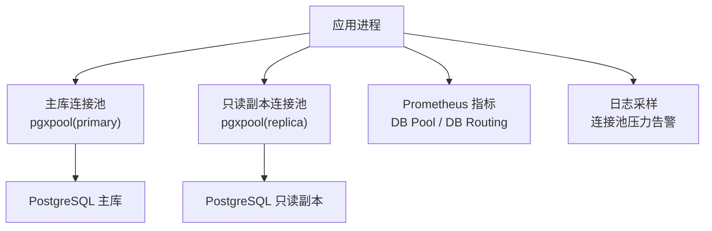
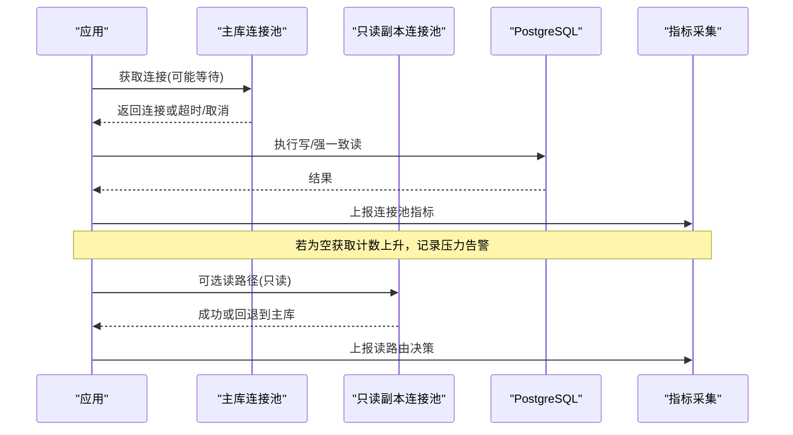
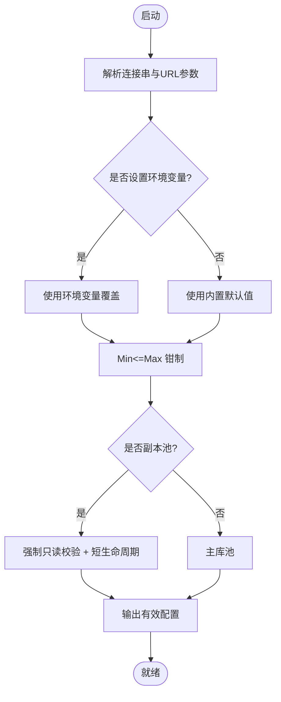
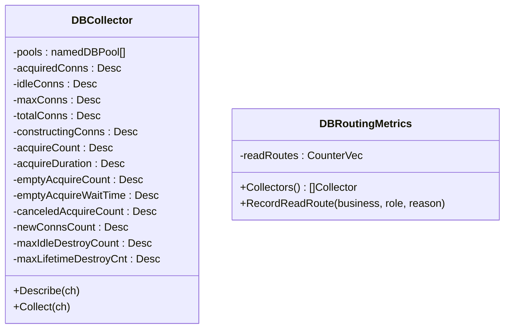
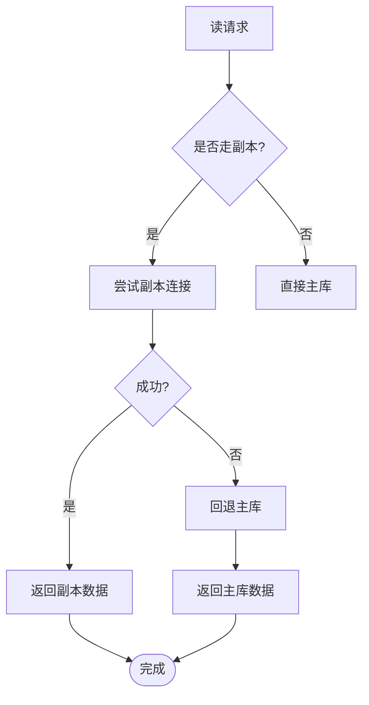
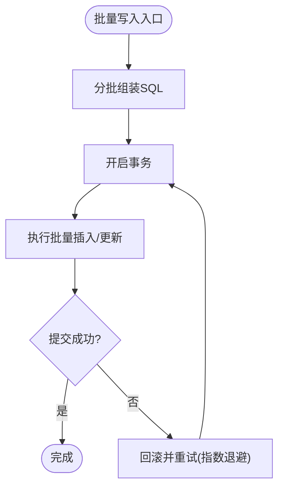
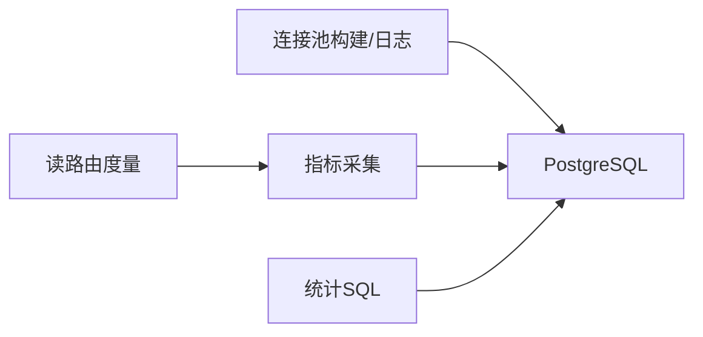

# 性能调优

<cite>
**本文引用的文件**
- [SELF_HOSTING_ADVANCED.md](file://SELF_HOSTING_ADVANCED.md)
- [dbstats.go](file://server/cmd/server/dbstats.go)
- [db.go](file://server/internal/metrics/db.go)
- [db_routing.go](file://server/internal/metrics/db_routing.go)
- [client_usage.sql](file://server/pkg/db/queries/client_usage.sql)
- [runtime_usage.sql](file://server/pkg/db/queries/runtime_usage.sql)
- [046_drop_runtime_usage.down.sql](file://server/migrations/046_drop_runtime_usage.down.sql)
</cite>

## 目录
1. [简介](#简介)
2. [项目结构](#项目结构)
3. [核心组件](#核心组件)
4. [架构总览](#架构总览)
5. [详细组件分析](#详细组件分析)
6. [依赖关系分析](#依赖关系分析)
7. [性能考量](#性能考量)
8. [故障排查指南](#故障排查指南)
9. [结论](#结论)
10. [附录](#附录)

## 简介
本文件聚焦数据库性能调优，覆盖查询性能分析与慢查询优化、连接池配置与资源管理、缓存策略与读写分离、大数据量处理（分页与批量）、监控指标与性能分析工具使用、容量规划与扩容策略，以及基准测试与优化案例。内容基于代码库中的连接池实现、指标采集、迁移与查询脚本及自托管高级配置文档进行系统化整理。

## 项目结构
与数据库性能相关的关键位置：
- 连接池构建与日志：server/cmd/server/dbstats.go
- Prometheus 指标导出：server/internal/metrics/db.go、server/internal/metrics/db_routing.go
- 只读副本路由度量：server/internal/metrics/db_routing.go
- 统计与聚合 SQL：server/pkg/db/queries/*.sql
- 迁移与索引约束：server/migrations/*.sql
- 自托管高级配置（含连接池参数说明）：SELF_HOSTING_ADVANCED.md

图表来源
- [dbstats.go:82-112](file://server/cmd/server/dbstats.go#L82-L112)
- [db.go:31-56](file://server/internal/metrics/db.go#L31-L56)
- [db_routing.go:9-16](file://server/internal/metrics/db_routing.go#L9-L16)
- [SELF_HOSTING_ADVANCED.md:17-29](file://SELF_HOSTING_ADVANCED.md#L17-L29)

章节来源
- [SELF_HOSTING_ADVANCED.md:17-29](file://SELF_HOSTING_ADVANCED.md#L17-L29)
- [dbstats.go:82-112](file://server/cmd/server/dbstats.go#L82-L112)
- [db.go:31-56](file://server/internal/metrics/db.go#L31-L56)
- [db_routing.go:9-16](file://server/internal/metrics/db_routing.go#L9-L16)

## 核心组件
- 连接池构建与默认值：为高并发守护进程场景提供合理的 MaxConns/MinConns，避免 pgx 默认过小导致获取等待。
- 只读副本连接池：独立预算、强制只读校验、短生命周期自动刷新，失败回退主库并开启被动熔断。
- 指标与可观测性：暴露连接池状态、获取耗时、空获取次数、取消次数等；记录业务侧的读路由决策。
- 统计与聚合：按小时/天维度汇总任务用量与运行时用量，支撑仪表盘与成本核算。
- 迁移与索引：遵循并发建索引、单语句迁移、无外键级联等规则，保障线上安全与一致性。

章节来源
- [dbstats.go:17-52](file://server/cmd/server/dbstats.go#L17-L52)
- [dbstats.go:114-154](file://server/cmd/server/dbstats.go#L114-L154)
- [db.go:8-24](file://server/internal/metrics/db.go#L8-L24)
- [db_routing.go:5-16](file://server/internal/metrics/db_routing.go#L5-L16)
- [runtime_usage.sql:25-41](file://server/pkg/db/queries/runtime_usage.sql#L25-L41)
- [client_usage.sql:41-47](file://server/pkg/db/queries/client_usage.sql#L41-L47)
- [046_drop_runtime_usage.down.sql:1-16](file://server/migrations/046_drop_runtime_usage.down.sql#L1-L16)

## 架构总览
下图展示请求在读写路径上的流转、连接池与指标采集点，以及与只读副本的交互和回退策略。

图表来源
- [dbstats.go:213-291](file://server/cmd/server/dbstats.go#L213-L291)
- [db.go:82-102](file://server/internal/metrics/db.go#L82-L102)
- [db_routing.go:25-30](file://server/internal/metrics/db_routing.go#L25-L30)
- [SELF_HOSTING_ADVANCED.md:17-29](file://SELF_HOSTING_ADVANCED.md#L17-L29)

## 详细组件分析

### 连接池配置与资源管理
- 默认大小与优先级：优先环境变量，其次 URL 中 pool_* 参数，最后内置默认值；避免使用 pgx 默认 max(4, NumCPU)。
- 主库池：默认 Max=25、Min=5，兼顾突发与冷启动预热。
- 副本池：独立预算 Max=10、Min=0；连接生命周期默认 5 分钟，便于晋升后重新验证只读属性；失败透明回退主库并短暂被动熔断。
- 只读校验：对副本连接强制只读校验，确保 fail-closed。
- 启动日志：打印有效池配置，便于排障。

图表来源
- [dbstats.go:82-154](file://server/cmd/server/dbstats.go#L82-L154)
- [dbstats.go:213-227](file://server/cmd/server/dbstats.go#L213-L227)
- [SELF_HOSTING_ADVANCED.md:17-29](file://SELF_HOSTING_ADVANCED.md#L17-L29)

章节来源
- [dbstats.go:82-154](file://server/cmd/server/dbstats.go#L82-L154)
- [dbstats.go:213-227](file://server/cmd/server/dbstats.go#L213-L227)
- [SELF_HOSTING_ADVANCED.md:17-29](file://SELF_HOSTING_ADVANCED.md#L17-L29)

### 监控指标与性能分析
- 连接池指标：已用连接、空闲连接、最大连接、总连接、构建中连接、获取次数、获取耗时、空获取次数、空获取等待时间、取消次数、新建连接数、因空闲上限销毁数、因生命周期销毁数。
- 读路由指标：按业务、角色、原因记录选择副本或回退主库的次数。
- 日志采样：周期性采样连接池统计，当出现空获取或取消增长时发出警告，辅助定位连接池瓶颈。

图表来源
- [db.go:8-24](file://server/internal/metrics/db.go#L8-L24)
- [db.go:82-102](file://server/internal/metrics/db.go#L82-L102)
- [db_routing.go:5-16](file://server/internal/metrics/db_routing.go#L5-L16)
- [db_routing.go:25-30](file://server/internal/metrics/db_routing.go#L25-L30)

章节来源
- [db.go:8-24](file://server/internal/metrics/db.go#L8-L24)
- [db.go:82-102](file://server/internal/metrics/db.go#L82-L102)
- [db_routing.go:5-16](file://server/internal/metrics/db_routing.go#L5-L16)
- [db_routing.go:25-30](file://server/internal/metrics/db_routing.go#L25-L30)
- [dbstats.go:229-291](file://server/cmd/server/dbstats.go#L229-L291)

### 缓存策略与读写分离
- 读写分离：支持可选只读副本连接串；新连接强制只读校验；业务层显式选择读路径；副本失败透明回退主库并开启短时被动熔断。
- 一致性：副本读不保证最终一致性边界，需关注复制延迟；一致性敏感读留在主库。
- 连接回收：副本连接默认 5 分钟生命周期，便于晋升后重新验证只读属性。
- 应用层缓存：结合任务/运行时用量的小时级汇总表，降低重复聚合计算压力。

图表来源
- [SELF_HOSTING_ADVANCED.md:17-29](file://SELF_HOSTING_ADVANCED.md#L17-L29)
- [db_routing.go:9-16](file://server/internal/metrics/db_routing.go#L9-L16)

章节来源
- [SELF_HOSTING_ADVANCED.md:17-29](file://SELF_HOSTING_ADVANCED.md#L17-L29)
- [db_routing.go:9-16](file://server/internal/metrics/db_routing.go#L9-L16)

### 大数据量处理的优化技巧
- 分页：通过游标或基于时间的范围扫描，配合合适的索引，减少全表扫描与内存占用。
- 批量操作：将多次写入合并为批量插入/更新，减少往返与锁竞争；注意事务粒度与幂等设计。
- 聚合与汇总：使用小时/日维度的汇总表（如任务用量、运行时用量），避免实时重算大表。
- 并发建索引：迁移中使用并发创建索引，避免阻塞线上写入。

图表来源
- [046_drop_runtime_usage.down.sql:1-16](file://server/migrations/046_drop_runtime_usage.down.sql#L1-L16)
- [runtime_usage.sql:25-41](file://server/pkg/db/queries/runtime_usage.sql#L25-L41)

章节来源
- [046_drop_runtime_usage.down.sql:1-16](file://server/migrations/046_drop_runtime_usage.down.sql#L1-L16)
- [runtime_usage.sql:25-41](file://server/pkg/db/queries/runtime_usage.sql#L25-L41)

### 查询性能分析与慢查询优化策略
- 分析工具：启用 Prometheus 指标与连接池日志，观察获取等待、空获取次数与取消次数；结合数据库层的慢查询日志与执行计划进行分析。
- 常见优化：
  - 为高频过滤条件建立合适索引，避免选择性差的查询。
  - 将复杂聚合下沉到汇总表，减少实时计算。
  - 控制事务长度，减少锁持有时间。
  - 使用分页与增量拉取，避免一次性加载大量数据。
- 指标联动：当连接池空获取次数与等待时间上升时，优先检查是否存在慢查询或热点行锁。

章节来源
- [dbstats.go:229-291](file://server/cmd/server/dbstats.go#L229-L291)
- [db.go:82-102](file://server/internal/metrics/db.go#L82-L102)
- [runtime_usage.sql:25-41](file://server/pkg/db/queries/runtime_usage.sql#L25-L41)

### 容量规划与扩容策略
- 连接预算：pod 数量 × 每 pod 最大连接数应远低于 PostgreSQL 的 max_connections 上限；前置连接池器（PgBouncer/RDS Proxy/Supavisor）时可提高应用侧连接上限。
- 副本预算：副本连接预算独立于主库；根据读流量与聚合负载评估副本池大小。
- 水平扩展：增加后端实例时，同步评估连接池与数据库连接上限；必要时引入连接池器。
- 弹性伸缩：结合指标（获取等待、空获取次数、取消次数）与数据库 CPU/IO 水位，触发扩缩容。

章节来源
- [SELF_HOSTING_ADVANCED.md:17-29](file://SELF_HOSTING_ADVANCED.md#L17-L29)

### 性能基准测试与优化案例研究
- 基线指标：以连接池获取等待时间、空获取次数、取消次数、活跃连接数作为核心基线。
- 压测方法：模拟守护进程高频 claim/心跳模式，观察连接池饱和点与尾延迟；逐步调整 Max/Min 与副本池大小。
- 案例要点：
  - 将默认连接池从极小值提升到生产合理值，显著降低尾延迟。
  - 引入只读副本分担读负载，配合连接生命周期缩短，提升稳定性。
  - 通过小时级汇总表降低聚合查询压力，稳定仪表盘响应时间。

章节来源
- [dbstats.go:17-52](file://server/cmd/server/dbstats.go#L17-L52)
- [dbstats.go:213-291](file://server/cmd/server/dbstats.go#L213-L291)
- [runtime_usage.sql:25-41](file://server/pkg/db/queries/runtime_usage.sql#L25-L41)

## 依赖关系分析
- 组件耦合：连接池构建与指标采集解耦；读路由度量独立于具体业务逻辑，仅记录决策标签。
- 外部依赖：pgxpool 提供连接池能力；Prometheus 客户端用于指标导出；PostgreSQL 提供存储与聚合函数。
- 潜在风险：副本连接失效时的回退路径需保持低开销；连接池过大可能导致数据库连接耗尽。

图表来源
- [dbstats.go:82-154](file://server/cmd/server/dbstats.go#L82-L154)
- [db.go:82-102](file://server/internal/metrics/db.go#L82-L102)
- [db_routing.go:25-30](file://server/internal/metrics/db_routing.go#L25-L30)
- [runtime_usage.sql:25-41](file://server/pkg/db/queries/runtime_usage.sql#L25-L41)

章节来源
- [dbstats.go:82-154](file://server/cmd/server/dbstats.go#L82-L154)
- [db.go:82-102](file://server/internal/metrics/db.go#L82-L102)
- [db_routing.go:25-30](file://server/internal/metrics/db_routing.go#L25-L30)
- [runtime_usage.sql:25-41](file://server/pkg/db/queries/runtime_usage.sql#L25-L41)

## 性能考量
- 连接池大小：在高并发守护进程场景下，过小的连接池会导致获取等待与尾延迟飙升；建议按“小池多等待”原则并结合压测确定。
- 副本连接生命周期：较短的生命周期有助于快速感知副本晋升与只读状态变化，避免长时间使用过期连接。
- 指标驱动调优：以空获取次数、获取等待时间、取消次数为核心信号，结合数据库慢查询日志与执行计划持续优化。
- 聚合与汇总：将高频聚合查询下沉到汇总表，降低实时计算压力，提升仪表盘与报表稳定性。

[本节为通用指导，不直接分析具体文件]

## 故障排查指南
- 连接池压力告警：当空获取次数或取消次数增长时，检查是否存在连接泄漏、慢查询或连接池过小。
- 副本回退：若读路径频繁回退主库，检查副本连接健康与复制延迟；确认只读校验与连接生命周期配置。
- 指标异常：对比获取等待时间与空获取次数，定位是否为连接池瓶颈；结合数据库层指标判断是否为慢查询导致。
- 迁移与索引：确保迁移使用并发建索引，避免阻塞线上写入；核对索引选择性是否符合预期。

章节来源
- [dbstats.go:229-291](file://server/cmd/server/dbstats.go#L229-L291)
- [SELF_HOSTING_ADVANCED.md:17-29](file://SELF_HOSTING_ADVANCED.md#L17-L29)
- [db.go:82-102](file://server/internal/metrics/db.go#L82-L102)

## 结论
通过合理的连接池配置、只读副本策略、指标驱动的监控与调优、以及大数据量的分页与批量优化，可以显著提升数据库性能与系统稳定性。建议在生产环境中持续收集连接池与数据库指标，结合慢查询分析与压测结果，迭代优化连接池大小、索引设计与查询模式，确保系统在规模增长时保持稳定与高效。

[本节为总结，不直接分析具体文件]

## 附录
- 关键环境变量参考：DATABASE_URL、DATABASE_MAX_CONNS、DATABASE_MIN_CONNS、DATABASE_REPLICA_URL、DATABASE_REPLICA_MAX_CONNS、DATABASE_REPLICA_MIN_CONNS。
- 指标端点：启用 METRICS_ADDR 后可通过 /metrics 获取 Prometheus 指标。
- 健康检查：/health、/readyz、/healthz 用于探测服务与依赖状态。

章节来源
- [SELF_HOSTING_ADVANCED.md:17-29](file://SELF_HOSTING_ADVANCED.md#L17-L29)
- [SELF_HOSTING_ADVANCED.md:612-633](file://SELF_HOSTING_ADVANCED.md#L612-L633)
- [SELF_HOSTING_ADVANCED.md:592-611](file://SELF_HOSTING_ADVANCED.md#L592-L611)