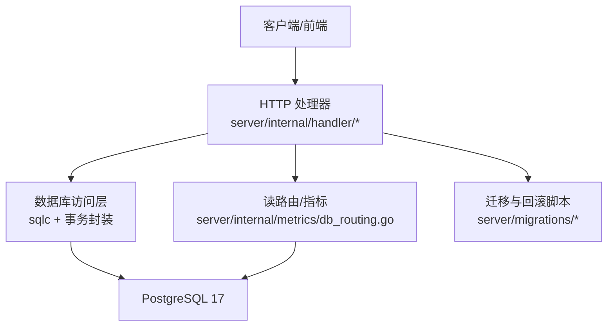
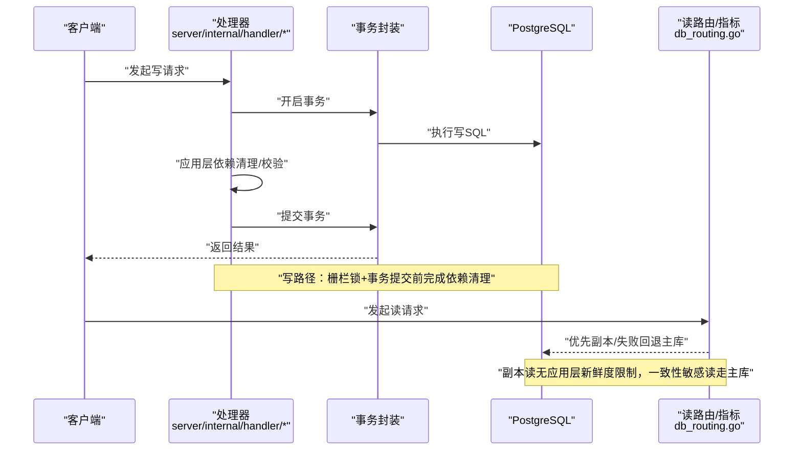
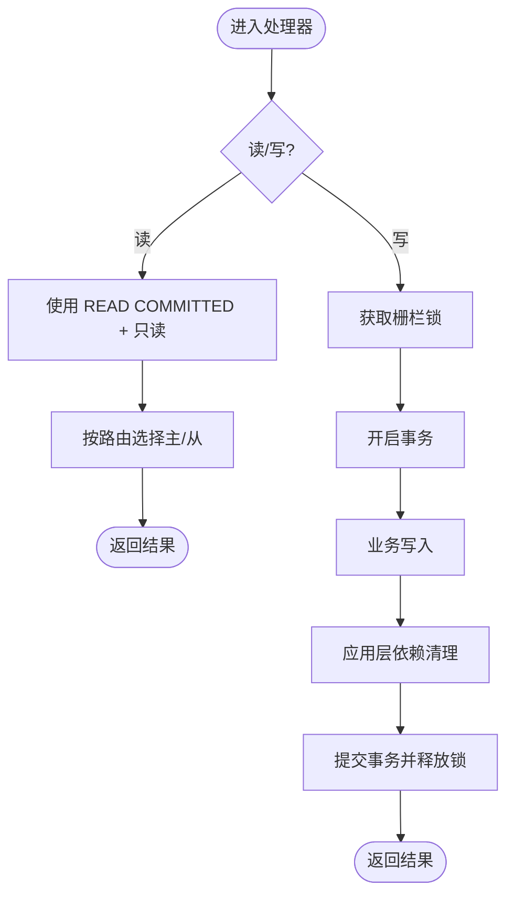
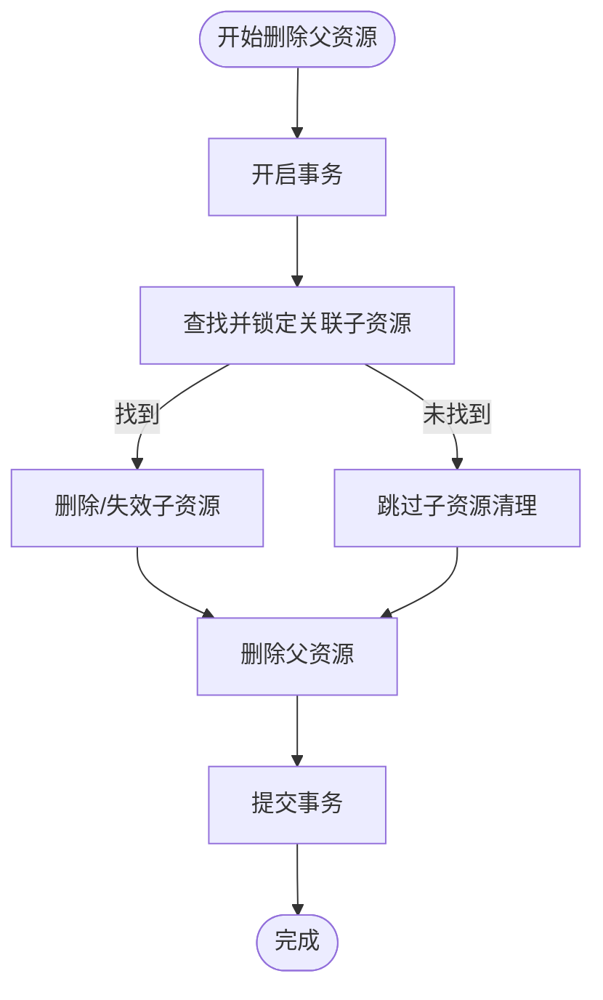
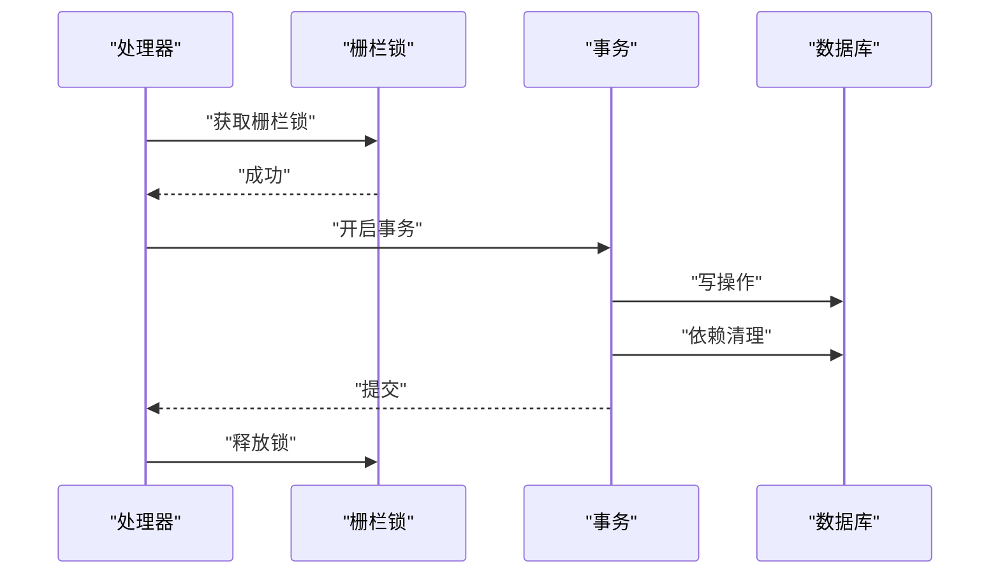
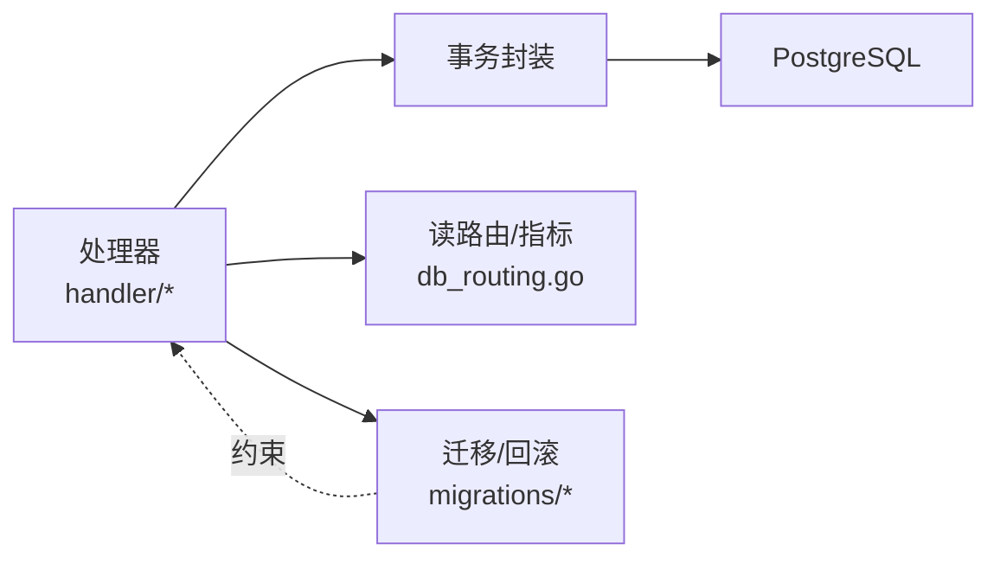

# 数据一致性

<cite>
**本文引用的文件**
- [CLAUDE.md](file://CLAUDE.md)
- [search.go](file://server/internal/handler/search.go)
- [daemon.go](file://server/internal/handler/daemon.go)
- [db_routing.go](file://server/internal/metrics/db_routing.go)
- [173_remove_resource_label_foreign_keys.down.sql](file://server/migrations/173_remove_resource_label_foreign_keys.down.sql)
- [193_issue_property_drop_workspace_fk.down.sql](file://server/migrations/193_issue_property_drop_workspace_fk.down.sql)
- [environment-variables.mdx](file://apps/docs/content/docs/environment-variables.mdx)
</cite>

## 目录
1. [简介](#简介)
2. [项目结构](#项目结构)
3. [核心组件](#核心组件)
4. [架构总览](#架构总览)
5. [详细组件分析](#详细组件分析)
6. [依赖关系分析](#依赖关系分析)
7. [性能考量](#性能考量)
8. [故障排查指南](#故障排查指南)
9. [结论](#结论)
10. [附录](#附录)

## 简介
本文件聚焦 Multica 后端的数据一致性保障体系，围绕事务处理机制、隔离级别选择、应用层关系管理与级联清理、并发控制与锁、数据完整性验证与业务规则保证、分布式事务与最终一致性方案、数据修复工具与回滚策略，以及一致性测试方法与故障恢复流程进行系统化说明。Multica 采用 Go + Chi + sqlc + gorilla/websocket 的后端架构，数据库为 PostgreSQL 17；迁移与索引构建遵循“无外键、应用层维护关系”的硬约束，并通过事务将写操作与其依赖清理原子化提交。

## 项目结构
与数据一致性相关的代码主要分布在：
- 服务端处理器（handler）：封装请求到领域服务的事务边界，协调读写路径与依赖清理。
- 指标与路由（metrics/db_routing）：提供主从读路由与连接复用策略，影响一致性语义。
- 迁移脚本（migrations）：体现“禁止外键与级联”的设计原则，并在回滚文件中明确不恢复外键。
- 全局规范（CLAUDE.md）：定义数据库与迁移规则、UUID 解析、API 兼容性等一致性相关约定。

**图示来源**
- [search.go:52-52](file://server/internal/handler/search.go#L52-L52)
- [db_routing.go:1-200](file://server/internal/metrics/db_routing.go#L1-L200)
- [173_remove_resource_label_foreign_keys.down.sql:1-2](file://server/migrations/173_remove_resource_label_foreign_keys.down.sql#L1-L2)
- [193_issue_property_drop_workspace_fk.down.sql:1-2](file://server/migrations/193_issue_property_drop_workspace_fk.down.sql#L1-L2)

**章节来源**
- [CLAUDE.md:110-116](file://CLAUDE.md#L110-L116)

## 核心组件
- 事务边界与隔离级别
  - 搜索查询使用默认隔离级别 READ COMMITTED 且只读模式，避免长事务与锁竞争。
  - 守护进程会话领取等关键写路径通过持有“栅栏锁”从第一条语句到 COMMIT 关闭竞态窗口，确保状态切换的一致性。
- 应用层关系管理
  - 禁止数据库外键与级联删除/更新，所有关系校验与依赖清理在应用层以事务包裹，保证父操作与清理操作的原子性。
- 读路由与一致性
  - 主从读路由支持副本连接回收与失败回退主库；副本读无应用层强制新鲜度限制，需监控延迟并将一致性敏感读落在主库。
- 迁移与索引
  - 所有索引创建必须使用 CONCURRENTLY，且每个并发索引建在独立单语句迁移中；条件跳过迁移仍记录在 schema_migrations，后续迁移需幂等 DDL。

**章节来源**
- [search.go:52-52](file://server/internal/handler/search.go#L52-L52)
- [daemon.go:817-817](file://server/internal/handler/daemon.go#L817-L817)
- [CLAUDE.md:110-116](file://CLAUDE.md#L110-L116)
- [environment-variables.mdx:49-53](file://apps/docs/content/docs/environment-variables.mdx#L49-L53)

## 架构总览
下图展示一次典型写操作的事务边界与一致性要点：处理器进入事务，执行业务写入与应用层依赖清理，最后提交；读路径根据一致性需求选择主库或副本。

**图示来源**
- [daemon.go:817-817](file://server/internal/handler/daemon.go#L817-L817)
- [db_routing.go:1-200](file://server/internal/metrics/db_routing.go#L1-L200)

## 详细组件分析

### 事务处理机制与隔离级别
- 读路径
  - 搜索查询显式使用 READ COMMITTED 且只读模式，降低锁冲突与阻塞风险。
- 写路径
  - 关键写流程（如守护进程会话领取）通过“栅栏锁”从首条语句到 COMMIT 保持临界区，防止并发下的状态不一致。
- 隔离级别选择
  - 默认 READ COMMITTED 满足大多数场景；对强一致要求的写路径通过短事务与栅栏锁实现“伪串行化”。

**图示来源**
- [search.go:52-52](file://server/internal/handler/search.go#L52-L52)
- [daemon.go:817-817](file://server/internal/handler/daemon.go#L817-L817)

**章节来源**
- [search.go:52-52](file://server/internal/handler/search.go#L52-L52)
- [daemon.go:817-817](file://server/internal/handler/daemon.go#L817-L817)

### 应用层关系管理与级联清理
- 设计原则
  - 禁止数据库外键与级联删除/更新；所有关系校验与依赖清理在应用层用事务包裹，确保与父操作原子提交。
- 实践要点
  - 删除父实体时，先在同一事务内删除/标记子实体，再提交；若任一步骤失败则整体回滚。
  - 迁移回滚脚本明确不恢复外键，强调关系由应用层负责。

**图示来源**
- [173_remove_resource_label_foreign_keys.down.sql:1-2](file://server/migrations/173_remove_resource_label_foreign_keys.down.sql#L1-L2)
- [193_issue_property_drop_workspace_fk.down.sql:1-2](file://server/migrations/193_issue_property_drop_workspace_fk.down.sql#L1-L2)
- [CLAUDE.md:110-116](file://CLAUDE.md#L110-L116)

**章节来源**
- [CLAUDE.md:110-116](file://CLAUDE.md#L110-L116)
- [173_remove_resource_label_foreign_keys.down.sql:1-2](file://server/migrations/173_remove_resource_label_foreign_keys.down.sql#L1-L2)
- [193_issue_property_drop_workspace_fk.down.sql:1-2](file://server/migrations/193_issue_property_drop_workspace_fk.down.sql#L1-L2)

### 并发控制与锁机制
- 栅栏锁（Fence Lock）
  - 在关键写路径中，从第一条语句到 COMMIT 期间持有锁，避免并发读取/写入导致的状态不一致。
- 读路由与副本
  - 副本连接定期回收以刷新只读视图；副本读无应用层强制新鲜度，一致性敏感读应落主库。
- 连接预算
  - 主从连接上限独立，需结合 API 进程数规划总连接预算，避免耗尽数据库连接。

**图示来源**
- [daemon.go:817-817](file://server/internal/handler/daemon.go#L817-L817)
- [environment-variables.mdx:49-53](file://apps/docs/content/docs/environment-variables.mdx#L49-L53)

**章节来源**
- [daemon.go:817-817](file://server/internal/handler/daemon.go#L817-L817)
- [environment-variables.mdx:49-53](file://apps/docs/content/docs/environment-variables.mdx#L49-L53)

### 数据完整性验证与业务规则保证
- UUID 输入校验
  - 处理器中严格区分来源：路径参数需经 loader 解析为实体 ID；纯 UUID 输入使用专用解析函数并立即错误返回；可信来源可使用快速解析。
- 工作区隔离
  - 所有查询需按 workspace_id 过滤，成员资格门控访问，确保多租户数据隔离。
- 迁移幂等
  - 条件跳过的迁移仍记录顺序；后续涉及对象变更的迁移需使用 IF EXISTS/IF NOT EXISTS 等幂等 DDL。

**章节来源**
- [CLAUDE.md:144-151](file://CLAUDE.md#L144-L151)
- [CLAUDE.md:256-259](file://CLAUDE.md#L256-L259)
- [CLAUDE.md:110-116](file://CLAUDE.md#L110-L116)

### 分布式事务与最终一致性方案
- 当前实现
  - 单体服务内通过短事务与栅栏锁保证强一致；跨服务/外部系统交互未在本仓库直接体现。
- 建议方案
  - 对外部异步任务采用事件驱动的最终一致性：本地事务内发布事件，消费者重试与幂等处理；必要时引入补偿事务或 Saga 编排。
  - 读侧通过主从路由与监控延迟，将一致性敏感读固定到主库，缓解副本滞后带来的可见性问题。

[本节为概念性说明，不直接分析具体文件]

### 数据修复工具与回滚策略
- 迁移回滚
  - 回滚脚本明确不恢复外键，表明关系清理始终由应用层负责；迁移运行器在非事务环境下执行，以支持并发索引构建。
- 数据回填
  - 仓库包含多个 backfill 命令用于历史数据修复与补齐，应在事务或分批策略下执行，避免长时间锁与内存占用。

**章节来源**
- [173_remove_resource_label_foreign_keys.down.sql:1-2](file://server/migrations/173_remove_resource_label_foreign_keys.down.sql#L1-L2)
- [CLAUDE.md:110-116](file://CLAUDE.md#L110-L116)

### 一致性测试方法与故障恢复流程
- 测试方法
  - 后端 Go 测试通过共享 fixtures 插入数据并驱动处理器，断言响应与状态；E2E 使用 TestApiClient 进行端到端验证。
  - 针对一致性场景，编写并发用例：同时触发写路径，验证栅栏锁与事务提交后的最终状态。
- 故障恢复
  - 写失败时事务自动回滚；读失败时读路由回退主库；副本延迟通过监控告警与降级策略处理。

**章节来源**
- [CLAUDE.md:204-232](file://CLAUDE.md#L204-L232)
- [environment-variables.mdx:49-53](file://apps/docs/content/docs/environment-variables.mdx#L49-L53)

## 依赖关系分析
- 处理器依赖事务封装与数据库访问层；读路由模块为读路径提供主从选择与指标上报。
- 迁移脚本与回滚文件作为契约，约束运行时行为：无外键、应用层维护关系。
- 全局规范（CLAUDE.md）贯穿各层，统一一致性策略与编码约定。

**图示来源**
- [search.go:52-52](file://server/internal/handler/search.go#L52-L52)
- [db_routing.go:1-200](file://server/internal/metrics/db_routing.go#L1-L200)
- [173_remove_resource_label_foreign_keys.down.sql:1-2](file://server/migrations/173_remove_resource_label_foreign_keys.down.sql#L1-L2)
- [CLAUDE.md:110-116](file://CLAUDE.md#L110-L116)

**章节来源**
- [search.go:52-52](file://server/internal/handler/search.go#L52-L52)
- [db_routing.go:1-200](file://server/internal/metrics/db_routing.go#L1-L200)
- [173_remove_resource_label_foreign_keys.down.sql:1-2](file://server/migrations/173_remove_resource_label_foreign_keys.down.sql#L1-L2)
- [CLAUDE.md:110-116](file://CLAUDE.md#L110-L116)

## 性能考量
- 读路径
  - 使用 READ COMMITTED 与只读事务减少锁开销；副本读可提升吞吐但需监控延迟。
- 写路径
  - 栅栏锁缩短临界区，避免长事务；依赖清理与写操作同属一个短事务，降低锁持有时间。
- 连接预算
  - 主从连接上限独立，需结合进程数与峰值估算，避免连接耗尽导致雪崩。

[本节提供通用指导，不直接分析具体文件]

## 故障排查指南
- 常见问题
  - 副本读数据陈旧：检查副本延迟与是否命中副本；一致性敏感读强制走主库。
  - 写路径死锁：确认栅栏锁范围最小化，避免嵌套事务与长事务。
  - 迁移失败：确认每个并发索引在独立单语句迁移中；条件跳过迁移后需幂等 DDL。
- 定位手段
  - 通过指标与日志观察读路由选择与失败回退；核对事务边界与依赖清理顺序。

**章节来源**
- [environment-variables.mdx:49-53](file://apps/docs/content/docs/environment-variables.mdx#L49-L53)
- [CLAUDE.md:110-116](file://CLAUDE.md#L110-L116)

## 结论
Multica 通过“禁止外键、应用层维护关系”的核心约束，配合短事务、栅栏锁与读路由策略，实现了高一致性与高可用的数据层。迁移与回滚脚本强化了这一设计契约。对于跨服务场景，建议采用事件驱动的最终一致性方案，并结合监控与降级策略保障用户体验。

## 附录
- 术语
  - 栅栏锁：在关键写路径中从首条语句到提交期间持有的锁，用于关闭竞态窗口。
  - 读路由：根据配置与健康状况在主库与副本之间选择读目标。
  - 幂等 DDL：可重复执行的数据库结构变更语句，如 IF EXISTS/IF NOT EXISTS。

[本节为概念性说明，不直接分析具体文件]