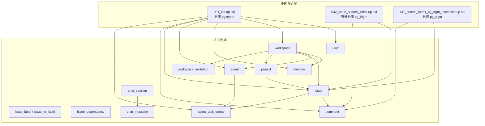
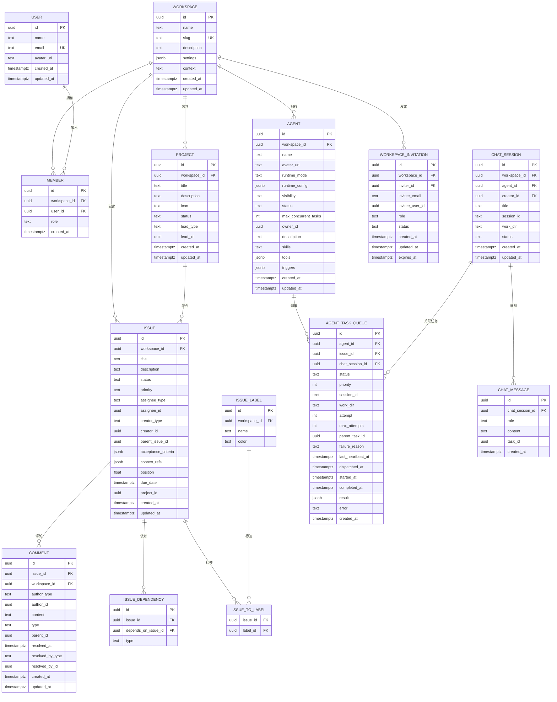
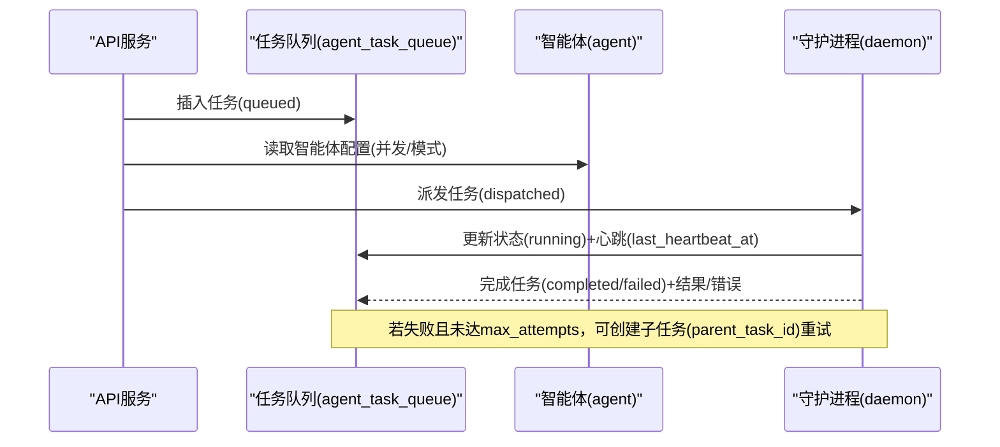
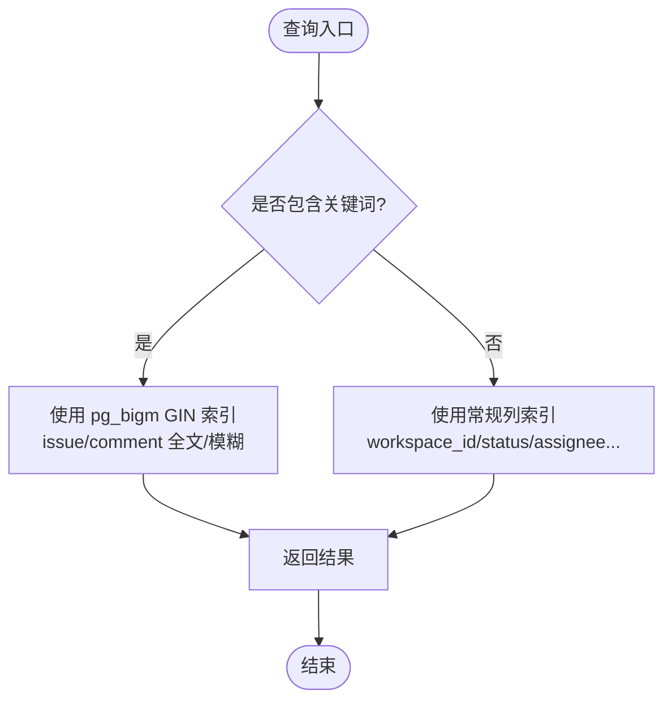

# 数据库设计

<cite>
**本文引用的文件**
- [001_init.up.sql](file://server/migrations/001_init.up.sql)
- [002_agent_config.up.sql](file://server/migrations/002_agent_config.up.sql)
- [006_workspace_context.up.sql](file://server/migrations/006_workspace_context.up.sql)
- [017_comment_parent_id.up.sql](file://server/migrations/017_comment_parent_id.up.sql)
- [025_comment_workspace_id.up.sql](file://server/migrations/025_comment_workspace_id.up.sql)
- [020_task_session.up.sql](file://server/migrations/020_task_session.up.sql)
- [032_issue_search_index.up.sql](file://server/migrations/032_issue_search_index.up.sql)
- [033_chat.up.sql](file://server/migrations/033_chat.up.sql)
- [033_comment_search_index.up.sql](file://server/migrations/033_comment_search_index.up.sql)
- [034_projects.up.sql](file://server/migrations/034_projects.up.sql)
- [041_workspace_invitation.up.sql](file://server/migrations/041_workspace_invitation.up.sql)
- [055_task_lease_and_retry.up.sql](file://server/migrations/055_task_lease_and_retry.up.sql)
- [069_comment_resolved_at.up.sql](file://server/migrations/069_comment_resolved_at.up.sql)
- [137_search_index_pg_trgm_extension.up.sql](file://server/migrations/137_search_index_pg_trgm_extension.up.sql)
- [CLAUDE.md](file://CLAUDE.md)
- [SELF_HOSTING_ADVANCED.md](file://SELF_HOSTING_ADVANCED.md)
</cite>

## 目录
1. [简介](#简介)
2. [项目结构](#项目结构)
3. [核心组件](#核心组件)
4. [架构总览](#架构总览)
5. [详细组件分析](#详细组件分析)
6. [依赖关系分析](#依赖关系分析)
7. [性能与索引优化](#性能与索引优化)
8. [故障排查指南](#故障排查指南)
9. [结论](#结论)
10. [附录](#附录)

## 简介
本文件面向 Multica 后端数据层，系统性阐述 PostgreSQL 17 的选型原因与特性利用、核心表结构与实体关系、迁移管理策略（遵循无外键约束原则）、索引优化与查询调优、数据一致性与事务处理、备份恢复方案、数据访问模式与缓存策略，以及数据生命周期管理与归档规则。文档以迁移脚本为依据，确保所有设计与实现细节均可追溯至具体代码文件。

## 项目结构
- 数据库版本化：所有 DDL/DML 变更通过 server/migrations 下的 SQL 迁移文件管理，按序号递增，包含 up/down 成对脚本。
- 扩展启用：在初始化迁移中启用 pgcrypto；在搜索相关迁移中按需启用 pg_bigm 与 pg_trgm。
- 表与索引：核心业务表（用户、工作空间、成员、智能体、问题、评论、任务队列、聊天会话/消息、项目、邀请等）及其索引均在迁移中定义或演进。
- 运行期上下文：任务执行相关的 session_id、work_dir、重试与租约字段通过迁移逐步引入，支撑守护进程恢复与并发控制。

图表来源
- [001_init.up.sql:1-178](file://server/migrations/001_init.up.sql#L1-L178)
- [032_issue_search_index.up.sql:1-21](file://server/migrations/032_issue_search_index.up.sql#L1-L21)
- [137_search_index_pg_trgm_extension.up.sql:1-4](file://server/migrations/137_search_index_pg_trgm_extension.up.sql#L1-L4)

章节来源
- [001_init.up.sql:1-178](file://server/migrations/001_init.up.sql#L1-L178)
- [032_issue_search_index.up.sql:1-21](file://server/migrations/032_issue_search_index.up.sql#L1-L21)
- [137_search_index_pg_trgm_extension.up.sql:1-4](file://server/migrations/137_search_index_pg_trgm_extension.up.sql#L1-L4)

## 核心组件
- 用户与成员：user 表存储用户基本信息；member 维护用户与工作空间的成员关系及角色。
- 工作空间：workspace 作为多租户隔离单元，承载设置与上下文信息。
- 智能体：agent 描述智能体的运行时模式、可见性、并发限制、所有者与配置（技能、工具、触发器）。
- 问题与标签：issue 表达任务/需求，支持状态、优先级、指派、父问题、验收标准、上下文引用、时间戳；issue_label/issue_to_label 实现多对多标签。
- 依赖关系：issue_dependency 表达阻塞/被阻塞/关联关系。
- 评论：comment 支持类型、作者、内容、回复链（parent_id）、工作空间归属、解决标记。
- 任务队列：agent_task_queue 驱动智能体执行，记录状态、优先级、结果、错误、会话与工作目录、重试与心跳。
- 聊天：chat_session/chat_message 提供用户与智能体的持久对话能力，并允许任务与聊天会话关联。
- 项目：project 聚合问题，支持负责人、图标、状态。
- 邀请：workspace_invitation 管理工作空间邀请流程与过期策略。

章节来源
- [001_init.up.sql:5-178](file://server/migrations/001_init.up.sql#L5-L178)
- [002_agent_config.up.sql:1-7](file://server/migrations/002_agent_config.up.sql#L1-L7)
- [006_workspace_context.up.sql:1-2](file://server/migrations/006_workspace_context.up.sql#L1-L2)
- [017_comment_parent_id.up.sql:1-2](file://server/migrations/017_comment_parent_id.up.sql#L1-L2)
- [025_comment_workspace_id.up.sql:1-9](file://server/migrations/025_comment_workspace_id.up.sql#L1-L9)
- [020_task_session.up.sql:1-8](file://server/migrations/020_task_session.up.sql#L1-L8)
- [033_chat.up.sql:1-37](file://server/migrations/033_chat.up.sql#L1-L37)
- [034_projects.up.sql:1-21](file://server/migrations/034_projects.up.sql#L1-L21)
- [041_workspace_invitation.up.sql:1-21](file://server/migrations/041_workspace_invitation.up.sql#L1-L21)
- [055_task_lease_and_retry.up.sql:1-27](file://server/migrations/055_task_lease_and_retry.up.sql#L1-L27)
- [069_comment_resolved_at.up.sql:1-13](file://server/migrations/069_comment_resolved_at.up.sql#L1-L13)

## 架构总览
下图展示核心实体之间的关系与关键属性，体现“应用层关系管理”的设计原则（不依赖数据库外键级联），并通过索引和约束保障查询与一致性。

图表来源
- [001_init.up.sql:5-178](file://server/migrations/001_init.up.sql#L5-L178)
- [002_agent_config.up.sql:1-7](file://server/migrations/002_agent_config.up.sql#L1-L7)
- [006_workspace_context.up.sql:1-2](file://server/migrations/006_workspace_context.up.sql#L1-L2)
- [017_comment_parent_id.up.sql:1-2](file://server/migrations/017_comment_parent_id.up.sql#L1-L2)
- [025_comment_workspace_id.up.sql:1-9](file://server/migrations/025_comment_workspace_id.up.sql#L1-L9)
- [020_task_session.up.sql:1-8](file://server/migrations/020_task_session.up.sql#L1-L8)
- [033_chat.up.sql:1-37](file://server/migrations/033_chat.up.sql#L1-L37)
- [034_projects.up.sql:1-21](file://server/migrations/034_projects.up.sql#L1-L21)
- [041_workspace_invitation.up.sql:1-21](file://server/migrations/041_workspace_invitation.up.sql#L1-L21)
- [055_task_lease_and_retry.up.sql:1-27](file://server/migrations/055_task_lease_and_retry.up.sql#L1-L27)
- [069_comment_resolved_at.up.sql:1-13](file://server/migrations/069_comment_resolved_at.up.sql#L1-L13)

## 详细组件分析

### 用户与工作空间（多租户隔离）
- 用户：唯一邮箱、头像、时间戳。
- 工作空间：唯一 slug、JSONB 设置、可选上下文文本。
- 成员：角色枚举校验，唯一 (workspace_id, user_id)。
- 邀请：唯一 pending 索引，按邮箱/用户快速查找待处理邀请，带过期时间。

章节来源
- [001_init.up.sql:5-33](file://server/migrations/001_init.up.sql#L5-L33)
- [006_workspace_context.up.sql:1-2](file://server/migrations/006_workspace_context.up.sql#L1-L2)
- [041_workspace_invitation.up.sql:1-21](file://server/migrations/041_workspace_invitation.up.sql#L1-L21)

### 智能体与任务队列（执行引擎）
- 智能体：运行时模式、可见性、状态、并发上限、所有者、描述/技能/工具/触发器等配置。
- 任务队列：状态机（排队/派发/运行/完成/失败/取消）、优先级、结果与错误、会话与工作目录、重试与心跳、父任务指针。
- 聊天任务：允许 issue_id 为空，新增 chat_session_id 关联聊天会话。

图表来源
- [001_init.up.sql:127-140](file://server/migrations/001_init.up.sql#L127-L140)
- [020_task_session.up.sql:1-8](file://server/migrations/020_task_session.up.sql#L1-L8)
- [033_chat.up.sql:32-37](file://server/migrations/033_chat.up.sql#L32-L37)
- [055_task_lease_and_retry.up.sql:1-27](file://server/migrations/055_task_lease_and_retry.up.sql#L1-L27)

章节来源
- [001_init.up.sql:35-49](file://server/migrations/001_init.up.sql#L35-L49)
- [002_agent_config.up.sql:1-7](file://server/migrations/002_agent_config.up.sql#L1-L7)
- [020_task_session.up.sql:1-8](file://server/migrations/020_task_session.up.sql#L1-L8)
- [033_chat.up.sql:1-37](file://server/migrations/033_chat.up.sql#L1-L37)
- [055_task_lease_and_retry.up.sql:1-27](file://server/migrations/055_task_lease_and_retry.up.sql#L1-L27)

### 问题、标签与依赖（协作与追踪）
- 问题：状态、优先级、指派、创建者、父问题、验收标准、上下文引用、位置、到期日、项目归属。
- 标签：issue_label 与 issue_to_label 多对多。
- 依赖：blocks/blocked_by/related 三类关系。

章节来源
- [001_init.up.sql:51-94](file://server/migrations/001_init.up.sql#L51-L94)
- [034_projects.up.sql:1-21](file://server/migrations/034_projects.up.sql#L1-L21)

### 评论（协作与闭环）
- 评论：类型、作者、内容、工作空间归属、回复链（parent_id）、解决标记（resolved_at/resolved_by_*）与一致性检查约束。
- 搜索：当 pg_bigm 可用时构建 GIN bigram 索引加速 LIKE '%keyword%'。

章节来源
- [001_init.up.sql:96-107](file://server/migrations/001_init.up.sql#L96-L107)
- [017_comment_parent_id.up.sql:1-2](file://server/migrations/017_comment_parent_id.up.sql#L1-L2)
- [025_comment_workspace_id.up.sql:1-9](file://server/migrations/025_comment_workspace_id.up.sql#L1-L9)
- [033_comment_search_index.up.sql:1-10](file://server/migrations/033_comment_search_index.up.sql#L1-L10)
- [069_comment_resolved_at.up.sql:1-13](file://server/migrations/069_comment_resolved_at.up.sql#L1-L13)

### 聊天会话与消息（AI 对话持久化）
- 会话：工作空间、智能体、创建者、标题、会话标识、工作目录、状态。
- 消息：角色、内容、关联任务 ID。
- 索引：按会话与创建时间排序检索。

章节来源
- [033_chat.up.sql:1-37](file://server/migrations/033_chat.up.sql#L1-L37)

### 项目（聚合与负责人）
- 项目：标题、描述、图标、状态、负责人（成员/智能体）。
- 问题关联：issue.project_id 指向项目，便于聚合视图与统计。

章节来源
- [034_projects.up.sql:1-21](file://server/migrations/034_projects.up.sql#L1-L21)

## 依赖关系分析
- 应用层关系管理：遵循“禁止数据库外键与级联”的原则，关系与清理逻辑在应用层事务中处理，保证跨表操作的原子性与可观测性。
- 迁移顺序与幂等：条件跳过迁移仍记录于 schema_migrations，后续迁移需使用 IF EXISTS/IF NOT EXISTS 等幂等 DDL。
- 并发索引：每个索引构建在独立单语句迁移文件中，避免多语句迁移中的并发索引冲突。

章节来源
- [CLAUDE.md:110-116](file://CLAUDE.md#L110-L116)

## 性能与索引优化
- 全文/模糊搜索
  - pg_bigm：为 issue.title/description 与 comment.content 构建 GIN bigram 索引，加速 LIKE '%keyword%' 查询；不可用时优雅降级。
  - pg_trgm：在后续迁移中安装 pg_trgm 以支持三元组回退搜索索引（与 bigram 互补）。
- 常用查询路径索引
  - 工作空间维度：issue(workspace_id)、agent(workspace_id)、project(workspace_id)、chat_session(workspace_id)。
  - 任务队列：agent_task_queue(agent_id, status)、parent_task_id 索引用于重试树遍历。
  - 评论：comment(issue_id)、comment(issue_id, resolved_at) 用于按问题筛选与已解决过滤。
  - 邀请：workspace_invitation 针对 pending 状态的复合/部分索引，提升邀请列表与去重效率。
- 连接池与读副本
  - 支持 DATABASE_REPLICA_URL 与对应连接池参数，便于未来将只读流量路由到副本。

图表来源
- [032_issue_search_index.up.sql:1-21](file://server/migrations/032_issue_search_index.up.sql#L1-L21)
- [033_comment_search_index.up.sql:1-10](file://server/migrations/033_comment_search_index.up.sql#L1-L10)
- [137_search_index_pg_trgm_extension.up.sql:1-4](file://server/migrations/137_search_index_pg_trgm_extension.up.sql#L1-L4)
- [001_init.up.sql:167-178](file://server/migrations/001_init.up.sql#L167-L178)
- [041_workspace_invitation.up.sql:14-21](file://server/migrations/041_workspace_invitation.up.sql#L14-L21)

章节来源
- [032_issue_search_index.up.sql:1-21](file://server/migrations/032_issue_search_index.up.sql#L1-L21)
- [033_comment_search_index.up.sql:1-10](file://server/migrations/033_comment_search_index.up.sql#L1-L10)
- [137_search_index_pg_trgm_extension.up.sql:1-4](file://server/migrations/137_search_index_pg_trgm_extension.up.sql#L1-L4)
- [001_init.up.sql:167-178](file://server/migrations/001_init.up.sql#L167-L178)
- [041_workspace_invitation.up.sql:14-21](file://server/migrations/041_workspace_invitation.up.sql#L14-L21)
- [SELF_HOSTING_ADVANCED.md:17-27](file://SELF_HOSTING_ADVANCED.md#L17-L27)

## 故障排查指南
- 迁移失败或对象缺失
  - 条件跳过迁移仍会写入 schema_migrations，后续迁移需具备幂等性；若因缺少扩展导致索引创建失败，应检查 pg_bigm/pg_trgm 安装与权限。
- 任务执行异常
  - 通过 agent_task_queue.failure_reason 分类（代理错误/超时/运行时离线/运行时恢复/手动），结合 attempt/max_attempts 与 parent_task_id 判断重试链路。
  - 使用 last_heartbeat_at 识别长时间运行或停滞任务。
- 评论未正确归属
  - 确认 comment.workspace_id 已回填并设为非空；如出现不一致，检查迁移 025 的执行情况。
- 邀请重复或无法领取
  - 检查 workspace_invitation 的唯一 pending 索引与过期时间；确认 invitee_email/invitee_user_id 索引命中。

章节来源
- [CLAUDE.md:110-116](file://CLAUDE.md#L110-L116)
- [055_task_lease_and_retry.up.sql:1-27](file://server/migrations/055_task_lease_and_retry.up.sql#L1-L27)
- [025_comment_workspace_id.up.sql:1-9](file://server/migrations/025_comment_workspace_id.up.sql#L1-L9)
- [041_workspace_invitation.up.sql:1-21](file://server/migrations/041_workspace_invitation.up.sql#L1-L21)

## 结论
本设计以 PostgreSQL 17 为基础，充分利用 pgcrypto、pg_bigm、pg_trgm 等扩展增强安全与搜索能力；通过严格的迁移规范与无外键约束的应用层关系管理，确保高可用与可演进性；围绕用户、工作空间、智能体、问题、评论、任务队列、聊天、项目与邀请等核心实体，构建了清晰的数据模型与高效的索引体系；配合连接池与读副本配置，为大规模部署提供可扩展基础。

## 附录

### PostgreSQL 17 选型与特性利用
- 安全性与加密：启用 pgcrypto，支持随机 UUID 生成与密码哈希等场景。
- 搜索能力：pg_bigm 提供 CJK 友好的 bigram GIN 索引；pg_trgm 提供三元组回退搜索，提升模糊匹配性能。
- 并发与稳定性：迁移采用 CONCURRENTLY 构建索引，避免锁竞争；条件迁移保持幂等与可恢复性。

章节来源
- [001_init.up.sql:1-3](file://server/migrations/001_init.up.sql#L1-L3)
- [032_issue_search_index.up.sql:1-21](file://server/migrations/032_issue_search_index.up.sql#L1-L21)
- [137_search_index_pg_trgm_extension.up.sql:1-4](file://server/migrations/137_search_index_pg_trgm_extension.up.sql#L1-L4)
- [CLAUDE.md:110-116](file://CLAUDE.md#L110-L116)

### 数据一致性、事务与备份恢复
- 一致性：应用层事务负责跨表关系与清理；迁移幂等确保多次执行安全。
- 事务：迁移 runner 在非显式事务中执行单语句迁移，支持并发索引构建。
- 备份恢复：建议基于 PostgreSQL 原生 WAL/物理备份与逻辑导出组合策略；结合环境变量中的连接超时与启动超时配置，确保迁移与 API 启动期间的容错。

章节来源
- [CLAUDE.md:110-116](file://CLAUDE.md#L110-L116)
- [SELF_HOSTING_ADVANCED.md:17-27](file://SELF_HOSTING_ADVANCED.md#L17-L27)

### 数据访问模式与缓存策略
- 访问模式：以工作空间为维度的范围查询为主；任务队列按智能体与状态拉取；聊天会话按会话与时间分页。
- 缓存建议：对热点只读数据（如工作空间设置、智能体元信息）可在应用层引入内存缓存；对搜索结果可使用短期缓存降低数据库压力；写路径保持强一致，读路径可选择最终一致。

[本节为通用指导，不直接分析具体文件]

### 数据生命周期管理与归档规则
- 活跃数据：用户、工作空间、智能体、问题、评论、任务、聊天会话与消息保持在线。
- 归档策略：对历史任务、聊天消息与活动日志可按时间窗口进行归档或冷存储；保留必要索引以支持审计与回溯。
- 清理规则：邀请过期后标记 expired；评论解决后可归档或仅保留关键字段；任务完成后清理临时 work_dir 引用。

[本节为通用指导，不直接分析具体文件]