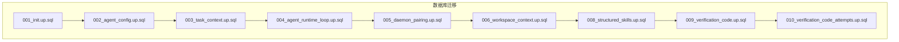
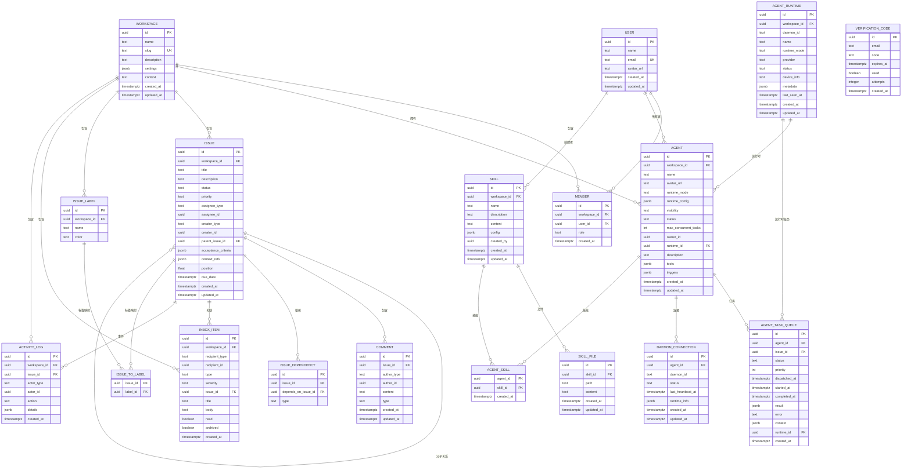
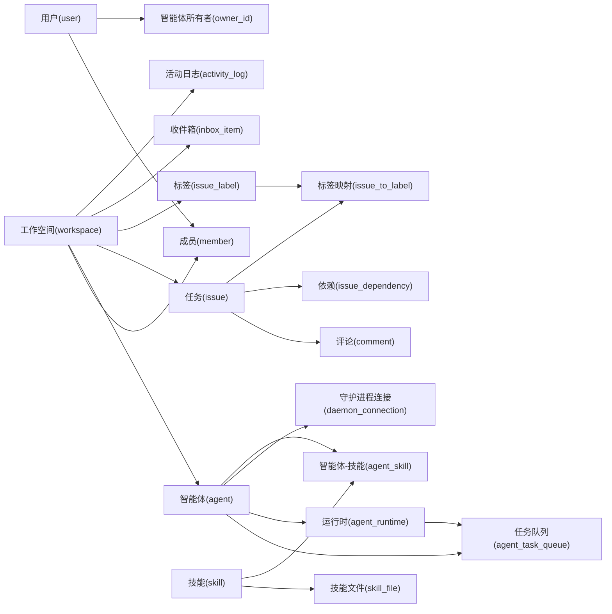

# 核心表结构

<cite>
**本文引用的文件**
- [server/migrations/001_init.up.sql](file://server/migrations/001_init.up.sql)
- [server/migrations/002_agent_config.up.sql](file://server/migrations/002_agent_config.up.sql)
- [server/migrations/003_task_context.up.sql](file://server/migrations/003_task_context.up.sql)
- [server/migrations/004_agent_runtime_loop.up.sql](file://server/migrations/004_agent_runtime_loop.up.sql)
- [server/migrations/005_daemon_pairing.up.sql](file://server/migrations/005_daemon_pairing.up.sql)
- [server/migrations/006_workspace_context.up.sql](file://server/migrations/006_workspace_context.up.sql)
- [server/migrations/008_structured_skills.up.sql](file://server/migrations/008_structured_skills.up.sql)
- [server/migrations/009_verification_code.up.sql](file://server/migrations/009_verification_code.up.sql)
- [server/migrations/010_verification_code_attempts.up.sql](file://server/migrations/010_verification_code_attempts.up.sql)
</cite>

## 目录
1. [简介](#简介)
2. [项目结构](#项目结构)
3. [核心组件](#核心组件)
4. [架构总览](#架构总览)
5. [详细组件分析](#详细组件分析)
6. [依赖关系分析](#依赖关系分析)
7. [性能考虑](#性能考虑)
8. [故障排查指南](#故障排查指南)
9. [结论](#结论)
10. [附录](#附录)

## 简介
本文件聚焦 Multica 后端数据库的核心表结构设计，围绕用户、工作空间、任务（Issue）、智能体（Agent）、评论等关键实体展开。文档说明各表的字段定义、数据类型与约束，阐述实体间的一对多、多对多关系设计，解释主键与外键策略，并结合项目规则说明“应用层管理关系”的设计取舍。同时给出数据验证规则、业务规则实现要点、ER 图与示例数据，以及扩展性与演进方向建议。

## 项目结构
本项目采用 Go 后端 + PostgreSQL 的架构，数据库结构通过迁移脚本演进。核心表结构由一系列按序执行的 SQL 迁移文件定义，涵盖初始化、智能体配置、任务上下文、运行时、守护进程配对、结构化技能、验证码等能力。

图表来源
- [server/migrations/001_init.up.sql:1-178](file://server/migrations/001_init.up.sql#L1-L178)
- [server/migrations/002_agent_config.up.sql:1-7](file://server/migrations/002_agent_config.up.sql#L1-L7)
- [server/migrations/003_task_context.up.sql:1-13](file://server/migrations/003_task_context.up.sql#L1-L13)
- [server/migrations/004_agent_runtime_loop.up.sql:1-93](file://server/migrations/004_agent_runtime_loop.up.sql#L1-L93)
- [server/migrations/005_daemon_pairing.up.sql:1-21](file://server/migrations/005_daemon_pairing.up.sql#L1-L21)
- [server/migrations/006_workspace_context.up.sql:1-2](file://server/migrations/006_workspace_context.up.sql#L1-L2)
- [server/migrations/008_structured_skills.up.sql:1-42](file://server/migrations/008_structured_skills.up.sql#L1-L42)
- [server/migrations/009_verification_code.up.sql:1-11](file://server/migrations/009_verification_code.up.sql#L1-L11)
- [server/migrations/010_verification_code_attempts.up.sql:1-2](file://server/migrations/010_verification_code_attempts.up.sql#L1-L2)

章节来源
- [server/migrations/001_init.up.sql:1-178](file://server/migrations/001_init.up.sql#L1-L178)

## 核心组件
本节概述核心实体及其职责：
- 用户（user）：系统使用者，唯一标识为 UUID，包含基本信息与时间戳。
- 工作空间（workspace）：协作边界，包含名称、别名、描述、设置与上下文。
- 成员（member）：用户与工作空间的关联，角色限定为 owner/admin/member。
- 智能体（agent）：工作空间内的 AI 执行主体，具备运行模式、可见性、状态、并发限制及所有者。
- 任务（issue）：工作空间内的工作项，支持层级（父子）、状态、优先级、指派、验收标准、上下文引用、排序与截止日期。
- 标签（issue_label）与任务-标签（issue_to_label）：多对多标签体系。
- 依赖（issue_dependency）：任务间的依赖关系（阻塞、被阻塞、相关）。
- 评论（comment）：任务讨论记录，支持多种类型。
- 收件箱（inbox_item）：面向成员或智能体的通知消息。
- 智能体任务队列（agent_task_queue）：调度到智能体的任务，含状态、优先级、结果与错误信息。
- 守护进程连接（daemon_connection）：智能体与本地/云端守护进程的在线连接。
- 活动日志（activity_log）：工作空间内的事件审计。
- 运行时（agent_runtime）：智能体的实际运行实例，绑定工作空间与守护进程。
- 技能（skill）、技能文件（skill_file）、智能体-技能（agent_skill）：结构化技能体系。
- 验证码（verification_code）：邮箱验证码与尝试次数。

章节来源
- [server/migrations/001_init.up.sql:5-178](file://server/migrations/001_init.up.sql#L5-L178)
- [server/migrations/002_agent_config.up.sql:1-7](file://server/migrations/002_agent_config.up.sql#L1-L7)
- [server/migrations/003_task_context.up.sql:1-13](file://server/migrations/003_task_context.up.sql#L1-L13)
- [server/migrations/004_agent_runtime_loop.up.sql:1-93](file://server/migrations/004_agent_runtime_loop.up.sql#L1-L93)
- [server/migrations/005_daemon_pairing.up.sql:1-21](file://server/migrations/005_daemon_pairing.up.sql#L1-L21)
- [server/migrations/006_workspace_context.up.sql:1-2](file://server/migrations/006_workspace_context.up.sql#L1-L2)
- [server/migrations/008_structured_skills.up.sql:1-42](file://server/migrations/008_structured_skills.up.sql#L1-L42)
- [server/migrations/009_verification_code.up.sql:1-11](file://server/migrations/009_verification_code.up.sql#L1-L11)
- [server/migrations/010_verification_code_attempts.up.sql:1-2](file://server/migrations/010_verification_code_attempts.up.sql#L1-L2)

## 架构总览
下图展示核心实体之间的关系，包括一对多、多对多与自引用关系，并体现工作空间作为协作边界的聚合根作用。

图表来源
- [server/migrations/001_init.up.sql:5-178](file://server/migrations/001_init.up.sql#L5-L178)
- [server/migrations/002_agent_config.up.sql:1-7](file://server/migrations/002_agent_config.up.sql#L1-L7)
- [server/migrations/003_task_context.up.sql:1-13](file://server/migrations/003_task_context.up.sql#L1-L13)
- [server/migrations/004_agent_runtime_loop.up.sql:1-93](file://server/migrations/004_agent_runtime_loop.up.sql#L1-L93)
- [server/migrations/005_daemon_pairing.up.sql:1-21](file://server/migrations/005_daemon_pairing.up.sql#L1-L21)
- [server/migrations/006_workspace_context.up.sql:1-2](file://server/migrations/006_workspace_context.up.sql#L1-L2)
- [server/migrations/008_structured_skills.up.sql:1-42](file://server/migrations/008_structured_skills.up.sql#L1-L42)
- [server/migrations/009_verification_code.up.sql:1-11](file://server/migrations/009_verification_code.up.sql#L1-L11)
- [server/migrations/010_verification_code_attempts.up.sql:1-2](file://server/migrations/010_verification_code_attempts.up.sql#L1-L2)

## 详细组件分析

### 用户与工作空间（user, workspace, member）
- 用户表提供唯一邮箱与基本资料；工作空间提供协作边界与 JSONB 设置；成员表实现用户与工作空间的多对多关系，并通过角色进行权限控制。
- 约束与索引：
  - 邮箱唯一约束保证身份唯一性。
  - 成员表对工作空间与用户的组合唯一约束避免重复加入。
  - 工作空间索引用于快速查询成员列表。
- 业务规则：
  - 角色枚举限制为 owner/admin/member。
  - 删除工作空间时级联清理成员。

章节来源
- [server/migrations/001_init.up.sql:5-33](file://server/migrations/001_init.up.sql#L5-L33)
- [server/migrations/001_init.up.sql:168-177](file://server/migrations/001_init.up.sql#L168-L177)

### 智能体与运行时（agent, agent_runtime）
- 智能体表描述工作空间内的 AI 主体，包含运行模式、可见性、状态、并发限制与所有者；运行时表记录实际运行实例，绑定工作空间与守护进程，并提供提供者信息与设备信息。
- 迁移将旧智能体数据迁移至运行时，并在智能体表中引入运行时 ID 的外键约束，确保智能体必须属于某个运行时。
- 约束与索引：
  - 智能体状态与运行模式使用 CHECK 约束。
  - 运行时在工作空间维度具有唯一性约束（结合 daemon_id 与 provider）。
  - 针对工作空间与状态的索引优化查询。
- 业务规则：
  - 智能体可见性限制为 workspace/private。
  - 运行时状态仅允许 online/offline。

章节来源
- [server/migrations/001_init.up.sql:35-49](file://server/migrations/001_init.up.sql#L35-L49)
- [server/migrations/002_agent_config.up.sql:1-7](file://server/migrations/002_agent_config.up.sql#L1-L7)
- [server/migrations/004_agent_runtime_loop.up.sql:1-93](file://server/migrations/004_agent_runtime_loop.up.sql#L1-L93)

### 任务与评论（issue, comment, inbox_item）
- 任务表支持层级（父任务）、状态、优先级、指派（成员或智能体）、验收标准、上下文引用、排序与截止日期；评论表记录任务讨论，支持多种类型；收件箱表面向成员或智能体的通知。
- 约束与索引：
  - 任务状态与优先级使用 CHECK 约束。
  - 评论作者类型限定为 member/agent。
  - 收件箱接收者类型限定为 member/agent，严重级别限定为 action_required/attention/info。
  - 针对工作空间、状态、父任务、评论、收件箱的索引提升查询效率。
- 业务规则：
  - 任务可被指派给成员或智能体，创建者同样可为成员或智能体。
  - 评论类型限定为 comment/status_change/progress_update/system。

章节来源
- [server/migrations/001_init.up.sql:51-124](file://server/migrations/001_init.up.sql#L51-L124)
- [server/migrations/001_init.up.sql:168-175](file://server/migrations/001_init.up.sql#L168-L175)

### 标签与依赖（issue_label, issue_to_label, issue_dependency）
- 标签表定义工作空间内的标签；任务-标签表实现多对多关系；依赖表表达任务之间的依赖类型（blocks/blocked_by/related）。
- 约束与索引：
  - 任务-标签联合主键防止重复关联。
  - 依赖类型使用 CHECK 约束。
- 业务规则：
  - 标签颜色与名称在工作空间内唯一（通过应用层校验）。
  - 依赖关系需避免循环依赖（应用层校验）。

章节来源
- [server/migrations/001_init.up.sql:74-94](file://server/migrations/001_init.up.sql#L74-L94)

### 智能体任务队列与守护进程（agent_task_queue, daemon_connection）
- 任务队列表记录分配给智能体的任务，包含状态、优先级、调度时间、结果与错误；守护进程连接表维护智能体与守护进程的在线状态与心跳。
- 迁移增强：
  - 增加任务上下文 JSONB 字段以传递执行所需信息。
  - 创建部分索引优化待处理任务的轮询。
  - 为守护进程连接添加唯一约束（agent_id, daemon_id）支持 upsert。
- 业务规则：
  - 任务状态限定为 queued/dispatched/running/completed/failed/cancelled。
  - 守护进程状态限定为 connected/disconnected。

章节来源
- [server/migrations/001_init.up.sql:126-153](file://server/migrations/001_init.up.sql#L126-L153)
- [server/migrations/003_task_context.up.sql:1-13](file://server/migrations/003_task_context.up.sql#L1-L13)

### 活动日志（activity_log）
- 记录工作空间内的事件，包括操作者类型、动作与详情；便于审计与分析。
- 约束与索引：
  - 操作者类型限定为 member/agent/system。
  - 针对任务的索引提升按任务查询事件的效率。

章节来源
- [server/migrations/001_init.up.sql:155-165](file://server/migrations/001_init.up.sql#L155-L165)
- [server/migrations/001_init.up.sql:175](file://server/migrations/001_init.up.sql#L175)

### 结构化技能（skill, skill_file, agent_skill）
- 技能表定义工作空间内的技能实体，包含内容、配置与创建者；技能文件表存储技能的多个文件；智能体-技能表实现多对多关联。
- 约束与索引：
  - 技能在工作空间内名称唯一。
  - 技能文件在技能内路径唯一。
  - 智能体-技能联合主键防止重复关联。
  - 针对工作空间、技能、智能体的索引提升查询效率。
- 业务规则：
  - 技能内容可为空但必填字段存在默认值。
  - 智能体可通过技能表获得能力集合。

章节来源
- [server/migrations/008_structured_skills.up.sql:1-42](file://server/migrations/008_structured_skills.up.sql#L1-L42)

### 验证码（verification_code）
- 存储邮箱验证码、过期时间与使用状态；追加尝试次数字段用于安全控制。
- 约束与索引：
  - 针对邮箱、使用状态与过期时间的复合索引加速查询。
- 业务规则：
  - 验证码使用后标记为已用。
  - 尝试次数用于限制暴力破解。

章节来源
- [server/migrations/009_verification_code.up.sql:1-11](file://server/migrations/009_verification_code.up.sql#L1-L11)
- [server/migrations/010_verification_code_attempts.up.sql:1-2](file://server/migrations/010_verification_code_attempts.up.sql#L1-L2)

### 工作空间上下文（workspace.context）
- 在工作空间表中增加上下文字段，用于存储与工作空间相关的额外文本信息。

章节来源
- [server/migrations/006_workspace_context.up.sql:1-2](file://server/migrations/006_workspace_context.up.sql#L1-L2)

## 依赖关系分析
下图展示核心表之间的依赖关系，突出工作空间作为聚合根的作用，以及智能体、任务、评论、技能等实体的归属与关联。

图表来源
- [server/migrations/001_init.up.sql:5-178](file://server/migrations/001_init.up.sql#L5-L178)
- [server/migrations/004_agent_runtime_loop.up.sql:1-93](file://server/migrations/004_agent_runtime_loop.up.sql#L1-L93)
- [server/migrations/008_structured_skills.up.sql:1-42](file://server/migrations/008_structured_skills.up.sql#L1-L42)

章节来源
- [server/migrations/001_init.up.sql:5-178](file://server/migrations/001_init.up.sql#L5-L178)
- [server/migrations/004_agent_runtime_loop.up.sql:1-93](file://server/migrations/004_agent_runtime_loop.up.sql#L1-L93)
- [server/migrations/008_structured_skills.up.sql:1-42](file://server/migrations/008_structured_skills.up.sql#L1-L42)

## 性能考虑
- 索引策略：
  - 针对高频查询列建立索引，如工作空间、状态、父任务、收件箱接收者与阅读状态、任务队列的智能机与状态。
  - 使用部分索引优化待处理任务的轮询，减少扫描范围。
- 数据类型选择：
  - 使用 UUID 作为主键，避免集中式 ID 生成瓶颈。
  - 使用 JSONB 存储灵活配置与上下文，便于扩展。
- 约束与校验：
  - 使用 CHECK 约束限制枚举值，减少应用层校验成本。
  - 通过唯一约束避免重复数据。
- 扩展性：
  - 工作空间设置与任务上下文使用 JSONB，便于未来新增字段而不改动表结构。
  - 技能体系通过多表解耦，支持文件化与多智能体复用。

[本节为通用性能指导，不直接分析具体文件]

## 故障排查指南
- 任务无法派发：
  - 检查任务队列状态是否为 queued/dispatched，确认智能机是否在线且未超过并发限制。
  - 查看守护进程连接状态与心跳时间。
- 评论或收件箱异常：
  - 确认作者/接收者类型与 ID 是否存在于对应实体。
  - 检查任务是否存在且属于当前工作空间。
- 技能关联失败：
  - 确认技能在工作空间内名称唯一，智能机与技能的关联不存在重复。
- 验证码无效：
  - 检查验证码是否过期、是否已使用，以及尝试次数是否超限。

章节来源
- [server/migrations/001_init.up.sql:126-153](file://server/migrations/001_init.up.sql#L126-L153)
- [server/migrations/003_task_context.up.sql:1-13](file://server/migrations/003_task_context.up.sql#L1-L13)
- [server/migrations/009_verification_code.up.sql:1-11](file://server/migrations/009_verification_code.up.sql#L1-L11)
- [server/migrations/010_verification_code_attempts.up.sql:1-2](file://server/migrations/010_verification_code_attempts.up.sql#L1-L2)

## 结论
本项目的核心表结构以工作空间为聚合根，围绕用户、智能机、任务、评论、技能等实体构建协作与自动化执行能力。通过迁移脚本逐步演进，既保证了初始结构的稳定性，又提供了灵活的扩展点（JSONB、多表解耦）。在关系管理方面，遵循“应用层管理关系”的策略，通过事务与约束共同保障数据一致性。未来可在现有基础上继续增强索引、优化查询与扩展技能体系，以满足更多协作场景与自动化需求。

[本节为总结性内容，不直接分析具体文件]

## 附录

### 数据验证规则与业务规则实现要点
- 枚举校验：
  - 成员角色、智能机状态、任务状态、优先级、评论类型、收件箱严重级别、依赖类型等均通过 CHECK 约束限制。
- 唯一性校验：
  - 邮箱、工作空间别名、技能名称、技能文件路径、守护进程连接等通过唯一约束或联合主键保证。
- 业务规则：
  - 任务指派与创建者类型限定为成员或智能机。
  - 智能机可见性限制为工作空间或私有。
  - 验证码使用后标记为已用，尝试次数用于安全控制。

章节来源
- [server/migrations/001_init.up.sql:25-124](file://server/migrations/001_init.up.sql#L25-L124)
- [server/migrations/008_structured_skills.up.sql:1-42](file://server/migrations/008_structured_skills.up.sql#L1-L42)
- [server/migrations/009_verification_code.up.sql:1-11](file://server/migrations/009_verification_code.up.sql#L1-L11)
- [server/migrations/010_verification_code_attempts.up.sql:1-2](file://server/migrations/010_verification_code_attempts.up.sql#L1-L2)

### 示例数据（概念性）
以下示例用于帮助理解表结构与关系，非真实数据：
- 用户：ID=U1，邮箱=user@example.com，名称=张三。
- 工作空间：ID=W1，名称=团队A，别名=team-a。
- 成员：W1 与 U1 关联，角色=admin。
- 智能机：ID=A1，名称=代码助手，运行模式=local，可见性=workspace。
- 任务：ID=T1，标题=修复登录问题，状态=in_progress，优先级=high。
- 评论：ID=C1，内容=已定位问题，类型=status_change。
- 技能：ID=S1，名称=代码审查，内容=审查提示模板。
- 智能机-技能：A1 与 S1 关联。

[本节为概念性示例，不直接分析具体文件]

### 表设计的扩展性与演进方向
- 扩展性：
  - 使用 JSONB 存储灵活配置与上下文，便于新增字段而不改动表结构。
  - 技能体系通过多表解耦，支持文件化与多智能机复用。
- 演进方向：
  - 增加更多索引以优化复杂查询。
  - 引入更细粒度的权限模型（基于角色与资源）。
  - 扩展任务生命周期状态与依赖类型，支持更复杂的协作流程。

[本节为通用指导，不直接分析具体文件]