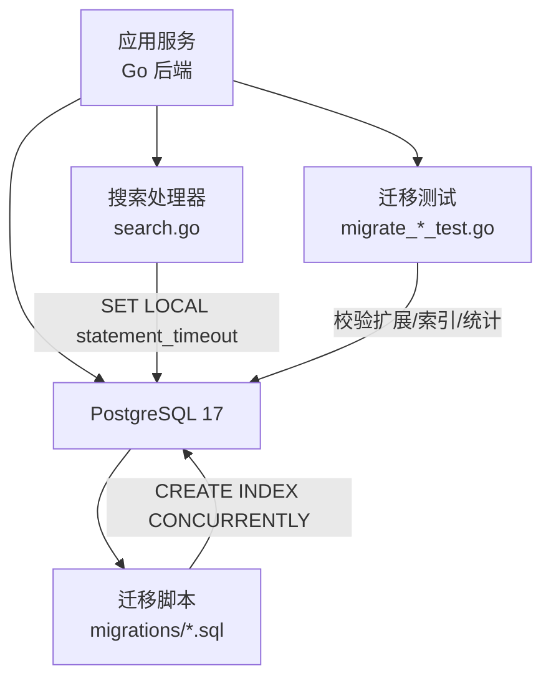
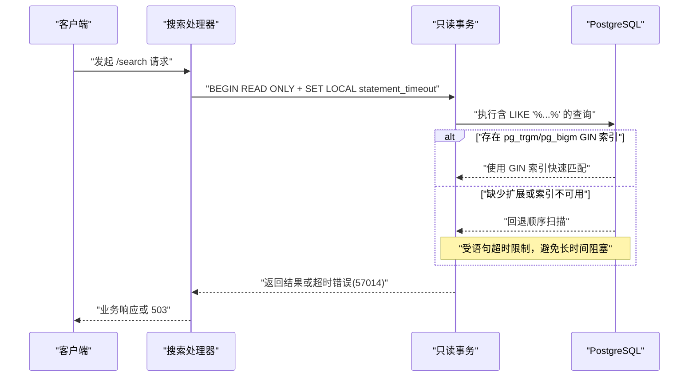
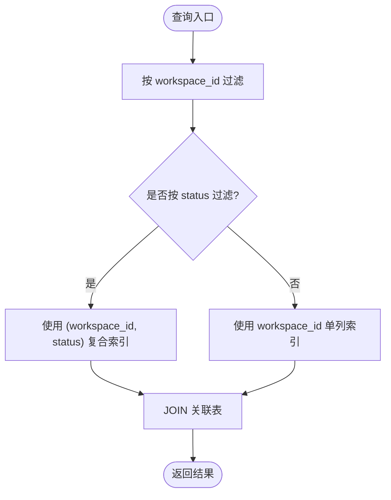
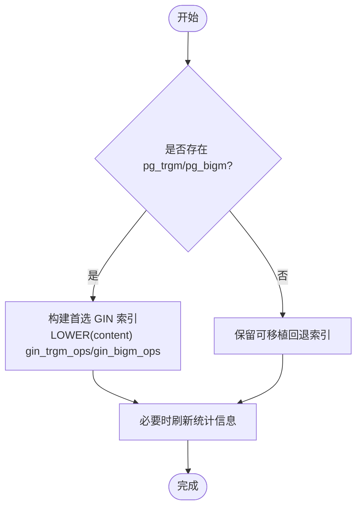
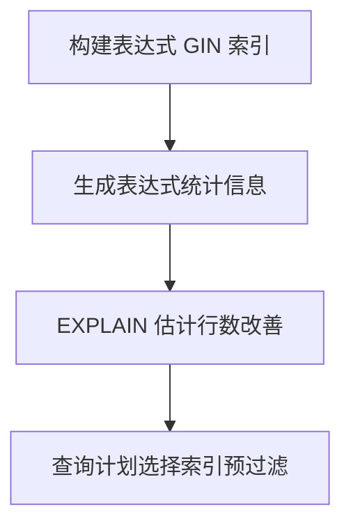
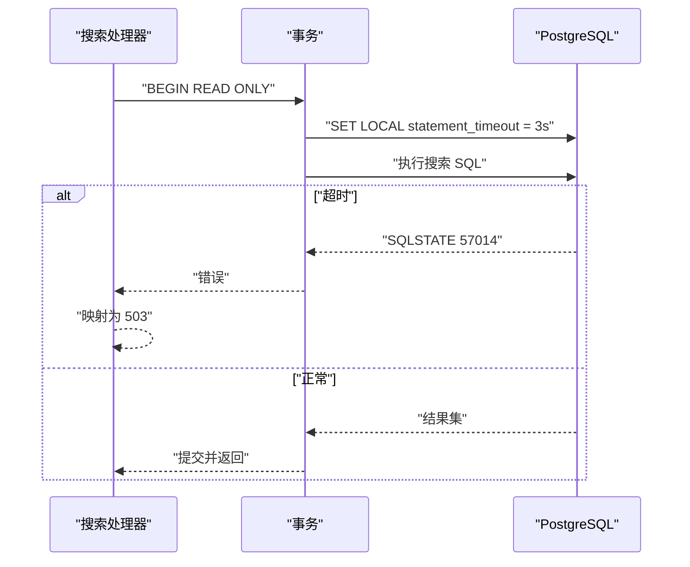
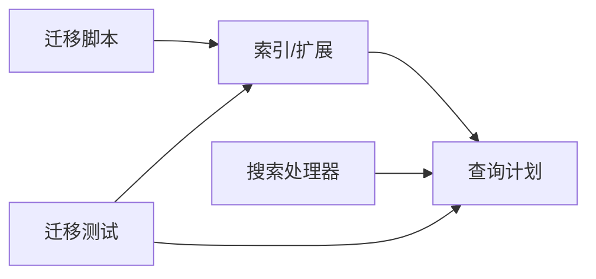

# 索引优化

<cite>
**本文引用的文件**
- [server/migrations/001_init.up.sql](file://server/migrations/001_init.up.sql)
- [server/internal/handler/search.go](file://server/internal/handler/search.go)
- [server/cmd/migrate/migrate_comment_search_index_strategy_test.go](file://server/cmd/migrate/migrate_comment_search_index_strategy_test.go)
- [server/cmd/migrate/migrate_issue_properties_bigm_index_test.go](file://server/cmd/migrate/migrate_issue_properties_bigm_index_test.go)
- [SELF_HOSTING_ADVANCED.md](file://SELF_HOSTING_ADVANCED.md)
</cite>

## 目录
1. [简介](#简介)
2. [项目结构](#项目结构)
3. [核心组件](#核心组件)
4. [架构总览](#架构总览)
5. [详细组件分析](#详细组件分析)
6. [依赖关系分析](#依赖关系分析)
7. [性能考量](#性能考量)
8. [故障排查指南](#故障排查指南)
9. [结论](#结论)
10. [附录](#附录)

## 简介
本文件面向数据库索引优化，结合代码库中的迁移与搜索实现，系统阐述索引设计原则、类型选择策略（B-tree、GIN、GiST）、复合索引设计与查询优化技巧、全文搜索（pg_trgm）落地方案、索引维护策略与性能监控方法，并给出查询计划分析与调优案例、最佳实践与常见陷阱。

## 项目结构
本项目后端使用 Go + Chi + sqlc，数据库为 PostgreSQL 17。索引相关能力主要分布在：
- 迁移脚本：集中定义表结构与索引创建，遵循“每个索引独立单语句迁移”的规范。
- 搜索处理层：对 /search 类请求设置语句级超时与只读事务保护，避免无索引时的慢查询拖垮前端体验。
- 迁移测试：验证 pg_trgm/pg_bigm 扩展可用性、索引构建条件、统计信息收集与回滚行为。

**图示来源**
- [server/internal/handler/search.go:13-32](file://server/internal/handler/search.go#L13-L32)
- [server/migrations/001_init.up.sql:167-177](file://server/migrations/001_init.up.sql#L167-L177)
- [server/cmd/migrate/migrate_comment_search_index_strategy_test.go:13-20](file://server/cmd/migrate/migrate_comment_search_index_strategy_test.go#L13-L20)

**章节来源**
- [server/migrations/001_init.up.sql:167-177](file://server/migrations/001_init.up.sql#L167-L177)
- [server/internal/handler/search.go:13-32](file://server/internal/handler/search.go#L13-L32)

## 核心组件
- 基础索引体系：在初始化迁移中为高频查询路径建立 B-tree 复合索引，如按工作区、状态、关联 ID 等维度加速过滤与连接。
- 全文搜索加速：通过 pg_trgm 扩展与 GIN 索引支持 LIKE '%pattern%' 的快速匹配；当环境缺失扩展时提供可回退策略与降级保障。
- 搜索安全网：搜索接口统一以只读事务 + 语句级超时执行，防止无索引导致的长耗时阻塞。
- 表达式索引与统计：针对 JSONB 属性文本化后的模糊匹配，构建表达式 GIN 索引并补充统计信息，确保规划器正确评估选择性。

**章节来源**
- [server/migrations/001_init.up.sql:167-177](file://server/migrations/001_init.up.sql#L167-L177)
- [server/internal/handler/search.go:13-32](file://server/internal/handler/search.go#L13-L32)
- [server/cmd/migrate/migrate_comment_search_index_strategy_test.go:13-20](file://server/cmd/migrate/migrate_comment_search_index_strategy_test.go#L13-L20)
- [server/cmd/migrate/migrate_issue_properties_bigm_index_test.go:15-33](file://server/cmd/migrate/migrate_issue_properties_bigm_index_test.go#L15-L33)

## 架构总览
搜索链路从应用层进入，强制只读事务与语句超时，再落到 PostgreSQL。若存在合适的 GIN 全文索引（pg_trgm/pg_bigm），则走快速路径；否则回退到顺序扫描，但受超时保护。迁移层负责在不同环境中按需构建索引与统计，保证上线后查询计划稳定。

**图示来源**
- [server/internal/handler/search.go:46-105](file://server/internal/handler/search.go#L46-L105)
- [server/internal/handler/search.go:107-121](file://server/internal/handler/search.go#L107-L121)
- [server/cmd/migrate/migrate_comment_search_index_strategy_test.go:13-20](file://server/cmd/migrate/migrate_comment_search_index_strategy_test.go#L13-L20)

## 详细组件分析

### 基础 B-tree 索引与复合索引设计
- 工作区隔离与状态过滤：在工作区与状态上建立复合索引，支撑按工作区筛选与状态分页。
- 关联查询加速：为外键字段建立索引，减少 JOIN 成本。
- 多列前缀匹配：将高选择性列置于复合索引前列，提升等值与范围查询效率。

**图示来源**
- [server/migrations/001_init.up.sql:167-177](file://server/migrations/001_init.up.sql#L167-L177)

**章节来源**
- [server/migrations/001_init.up.sql:167-177](file://server/migrations/001_init.up.sql#L167-L177)

### 全文搜索索引（pg_trgm 与 GIN）
- 目标场景：LOWER(col) LIKE '%pattern%' 的模糊匹配。
- 实现方式：安装 pg_trgm 扩展，对 LOWER(content) 建立 GIN 索引并使用 gin_trgm_ops 操作符类。
- 环境适配：迁移测试覆盖不同环境（自带 pgvector 镜像、自托管等），检测扩展可用性并决定是否构建首选索引；若不可用，保留可移植的回退索引。
- 回滚安全：回滚方向需保持幂等，确保未构建索引的环境不报错。

**图示来源**
- [server/cmd/migrate/migrate_comment_search_index_strategy_test.go:13-20](file://server/cmd/migrate/migrate_comment_search_index_strategy_test.go#L13-L20)
- [server/cmd/migrate/migrate_comment_search_index_strategy_test.go:79-118](file://server/cmd/migrate/migrate_comment_search_index_strategy_test.go#L79-L118)

**章节来源**
- [server/cmd/migrate/migrate_comment_search_index_strategy_test.go:13-20](file://server/cmd/migrate/migrate_comment_search_index_strategy_test.go#L13-L20)
- [server/cmd/migrate/migrate_comment_search_index_strategy_test.go:79-118](file://server/cmd/migrate/migrate_comment_search_index_strategy_test.go#L79-L118)

### 表达式索引与统计信息（JSONB 属性模糊匹配）
- 问题背景：对 properties::text 进行 LOWER(...) LIKE '%...%' 时，仅建表达式索引不足以让规划器准确评估选择性，需要额外统计信息。
- 解决方案：分两步迁移——先构建表达式 GIN 索引，再单独生成该表达式的统计信息，使规划器能正确预估并选择索引预过滤。
- 验证方式：通过 EXPLAIN 估计行数对比，确认统计信息改善后估计更贴近实际。

**图示来源**
- [server/cmd/migrate/migrate_issue_properties_bigm_index_test.go:15-33](file://server/cmd/migrate/migrate_issue_properties_bigm_index_test.go#L15-L33)
- [server/cmd/migrate/migrate_issue_properties_bigm_index_test.go:106-180](file://server/cmd/migrate/migrate_issue_properties_bigm_index_test.go#L106-L180)

**章节来源**
- [server/cmd/migrate/migrate_issue_properties_bigm_index_test.go:15-33](file://server/cmd/migrate/migrate_issue_properties_bigm_index_test.go#L15-L33)
- [server/cmd/migrate/migrate_issue_properties_bigm_index_test.go:106-180](file://server/cmd/migrate/migrate_issue_properties_bigm_index_test.go#L106-L180)

### 搜索安全网与超时控制
- 只读事务：搜索查询在 READ ONLY 事务中执行，避免锁竞争与写冲突。
- 语句级超时：通过 SET LOCAL statement_timeout 限制单次 SQL 执行时间，防止无索引导致的前端假死。
- 错误识别：捕获 SQLSTATE 57014 区分超时与一般错误，向上层返回 503，便于前端差异化处理。

**图示来源**
- [server/internal/handler/search.go:46-105](file://server/internal/handler/search.go#L46-L105)
- [server/internal/handler/search.go:107-121](file://server/internal/handler/search.go#L107-L121)

**章节来源**
- [server/internal/handler/search.go:13-32](file://server/internal/handler/search.go#L13-L32)
- [server/internal/handler/search.go:46-105](file://server/internal/handler/search.go#L46-L105)
- [server/internal/handler/search.go:107-121](file://server/internal/handler/search.go#L107-L121)

## 依赖关系分析
- 迁移与运行时：迁移脚本负责索引创建与扩展安装；运行期搜索处理器依赖这些索引以获得低延迟。
- 测试与生产一致性：迁移测试模拟多种环境（有无扩展、已有索引形态），确保迁移逻辑在生产环境具备鲁棒性。
- 外部依赖：PostgreSQL 版本与扩展（pg_trgm、pg_bigm）可用性直接影响索引策略与查询计划。

**图示来源**
- [server/migrations/001_init.up.sql:167-177](file://server/migrations/001_init.up.sql#L167-L177)
- [server/cmd/migrate/migrate_comment_search_index_strategy_test.go:13-20](file://server/cmd/migrate/migrate_comment_search_index_strategy_test.go#L13-L20)
- [server/cmd/migrate/migrate_issue_properties_bigm_index_test.go:15-33](file://server/cmd/migrate/migrate_issue_properties_bigm_index_test.go#L15-L33)

**章节来源**
- [server/migrations/001_init.up.sql:167-177](file://server/migrations/001_init.up.sql#L167-L177)
- [server/cmd/migrate/migrate_comment_search_index_strategy_test.go:13-20](file://server/cmd/migrate/migrate_comment_search_index_strategy_test.go#L13-L20)
- [server/cmd/migrate/migrate_issue_properties_bigm_index_test.go:15-33](file://server/cmd/migrate/migrate_issue_properties_bigm_index_test.go#L15-L33)

## 性能考量
- 连接池与副本：合理配置主从连接数与最小连接数，避免连接耗尽；副本用于只读负载，注意复制延迟与一致性要求。
- 语句超时：搜索类查询必须设置合理的语句超时，避免无索引导致的长尾。
- 统计信息：表达式索引需配合 ANALYZE 生成统计，确保规划器正确评估选择性。
- 索引维护：增量构建与并发创建，降低在线影响；定期重建与 VACUUM/ANALYZE 保持统计新鲜。

**章节来源**
- [SELF_HOSTING_ADVANCED.md:17-27](file://SELF_HOSTING_ADVANCED.md#L17-L27)
- [server/internal/handler/search.go:13-32](file://server/internal/handler/search.go#L13-L32)
- [server/cmd/migrate/migrate_issue_properties_bigm_index_test.go:106-180](file://server/cmd/migrate/migrate_issue_properties_bigm_index_test.go#L106-L180)

## 故障排查指南
- 搜索卡死或超时：检查是否安装了 pg_trgm/pg_bigm 扩展，以及对应 GIN 索引是否存在且有效；查看搜索语句是否命中索引。
- 查询计划退化：确认表达式索引的统计信息是否已生成；必要时手动触发 ANALYZE。
- 迁移失败或回滚异常：核对迁移条件判断（扩展/操作符类可用性），确保回滚幂等。
- 连接池瓶颈：调整最大/最小连接数，考虑引入连接池代理或读写分离。

**章节来源**
- [server/internal/handler/search.go:13-32](file://server/internal/handler/search.go#L13-L32)
- [server/cmd/migrate/migrate_comment_search_index_strategy_test.go:13-20](file://server/cmd/migrate/migrate_comment_search_index_strategy_test.go#L13-L20)
- [server/cmd/migrate/migrate_issue_properties_bigm_index_test.go:106-180](file://server/cmd/migrate/migrate_issue_properties_bigm_index_test.go#L106-L180)
- [SELF_HOSTING_ADVANCED.md:17-27](file://SELF_HOSTING_ADVANCED.md#L17-L27)

## 结论
本项目通过“迁移驱动 + 运行时保护”的方式，实现了稳健的索引优化策略：基础 B-tree 复合索引覆盖常规过滤与连接；全文搜索借助 pg_trgm/pg_bigm 的 GIN 索引实现高效模糊匹配；搜索处理器以只读事务与语句超时为兜底，确保用户体验。同时，通过迁移测试与环境探测，保证在不同部署环境下的一致性与可回滚性。建议持续跟踪查询计划与统计信息，结合连接池与副本配置，形成闭环的性能治理体系。

## 附录
- 索引设计原则
  - 优先为高频过滤、排序、连接列建立索引；复合索引将高选择性列前置。
  - 全文搜索使用 GIN + pg_trgm/pg_bigm；JSONB 文本化模糊匹配采用表达式索引并补充统计。
  - 迁移中每个索引独立单语句，使用并发创建以减少锁定。
- 常见陷阱
  - 忽略统计信息导致规划器误判；表达式索引必须 ANALYZE。
  - 扩展缺失或未安装导致回退到顺序扫描；需在迁移中检测并提供回退方案。
  - 搜索无超时保护导致前端假死；务必设置语句级超时。
- 监控与调优
  - 关注 EXPLAIN 输出与估计行数；对比有/无统计信息的差异。
  - 监控连接池指标与副本延迟；根据负载调整连接数与只读路由。