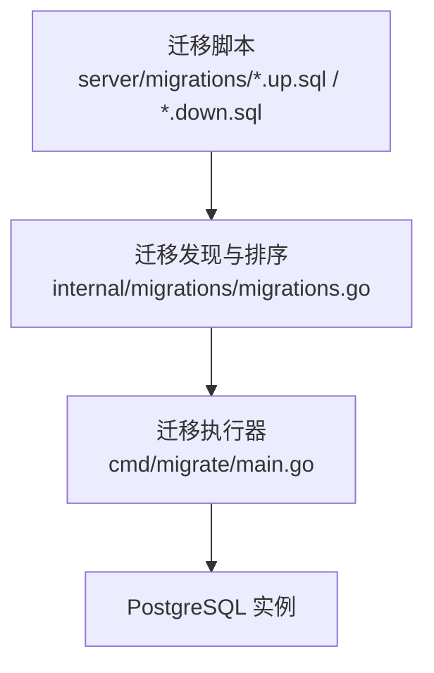
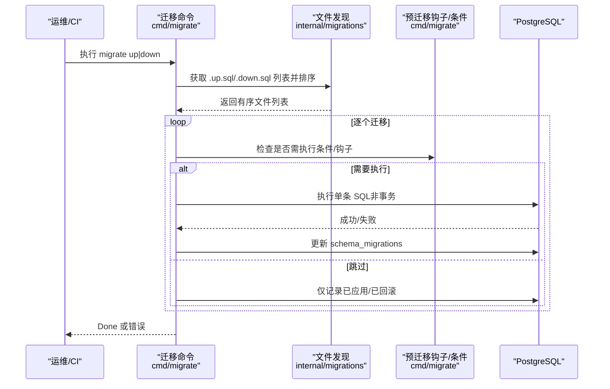
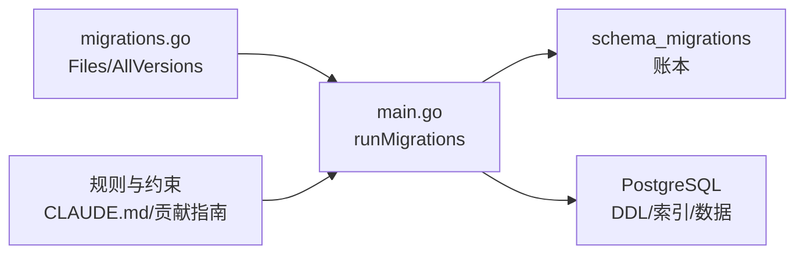

# 迁移管理

<cite>
**本文引用的文件**
- [server/cmd/migrate/main.go](file://server/cmd/migrate/main.go)
- [server/internal/migrations/migrations.go](file://server/internal/migrations/migrations.go)
- [server/internal/migrations/migrations_lint_test.go](file://server/internal/migrations/migrations_lint_test.go)
- [server/cmd/migrate/README.md](file://server/cmd/migrate/README.md)
- [CLAUDE.md](file://CLAUDE.md)
- [apps/docs/content/docs/developers/contributing.ko.mdx](file://apps/docs/content/docs/developers/contributing.ko.mdx)
- [server/migrations/001_init.up.sql](file://server/migrations/001_init.up.sql)
- [server/migrations/001_init.down.sql](file://server/migrations/001_init.down.sql)
</cite>

## 目录
1. [简介](#简介)
2. [项目结构](#项目结构)
3. [核心组件](#核心组件)
4. [架构总览](#架构总览)
5. [详细组件分析](#详细组件分析)
6. [依赖关系分析](#依赖关系分析)
7. [性能考虑](#性能考虑)
8. [故障排查指南](#故障排查指南)
9. [结论](#结论)
10. [附录](#附录)

## 简介
本文件面向数据库迁移管理的工程实践，覆盖命名规范、版本控制策略、UP/DOWN 执行顺序、无外键约束的设计原则与应用层事务、索引迁移最佳实践（含 CREATE INDEX CONCURRENTLY）、数据回滚与失败处理、迁移测试方法以及生产部署流程。同时给出迁移冲突解决与数据一致性保证机制的落地方案。

## 项目结构
仓库采用 Go 后端 + PostgreSQL 的架构，迁移脚本集中存放于 server/migrations，迁移发现与排序逻辑位于 server/internal/migrations，迁移执行入口为 server/cmd/migrate。

**图示来源**
- [server/internal/migrations/migrations.go:20-72](file://server/internal/migrations/migrations.go#L20-L72)
- [server/cmd/migrate/main.go:688-769](file://server/cmd/migrate/main.go#L688-L769)

**章节来源**
- [server/internal/migrations/migrations.go:20-72](file://server/internal/migrations/migrations.go#L20-L72)
- [server/cmd/migrate/main.go:688-769](file://server/cmd/migrate/main.go#L688-L769)

## 核心组件
- 迁移文件发现与排序：按文件名前缀数字升序执行 up，降序执行 down；支持从工作目录或可执行文件目录向上查找 migrations 目录。
- 迁移执行器：通过 advisory lock 串行化多副本/并发迁移；维护 schema_migrations 账本；支持 pre-migration hook 与条件跳过；对并发索引构建进行无效索引清理。
- 规则与约束：禁止数据库外键与级联；所有索引必须使用 CONCURRENTLY；每个并发索引单独一个单语句迁移文件；条件跳过的迁移仍记录到账本。

**章节来源**
- [server/internal/migrations/migrations.go:52-100](file://server/internal/migrations/migrations.go#L52-L100)
- [server/cmd/migrate/main.go:35-40](file://server/cmd/migrate/main.go#L35-L40)
- [server/cmd/migrate/main.go:639-651](file://server/cmd/migrate/main.go#L639-L651)
- [CLAUDE.md:110-116](file://CLAUDE.md#L110-L116)

## 架构总览
迁移运行时的关键交互如下：命令行驱动迁移方向，发现并排序 SQL 文件，依次执行 UP 或 DOWN；在执行前可能触发预置钩子（如清理无效索引、数据回填）；根据环境条件决定是否跳过某些迁移；最终将版本写入 schema_migrations。

**图示来源**
- [server/cmd/migrate/main.go:688-769](file://server/cmd/migrate/main.go#L688-L769)
- [server/internal/migrations/migrations.go:52-72](file://server/internal/migrations/migrations.go#L52-L72)

## 详细组件分析

### 命名规范与版本控制策略
- 命名格式：NNN_description.up.sql 与 NNN_description.down.sql 成对存在。
- 版本顺序：基于文件名前缀数字严格排序；up 升序、down 降序。
- 成对强制：lint 测试要求每个迁移必须有 up 和 down 两个文件。
- 账本记录：无论是否因条件跳过，都会记录到 schema_migrations，确保“顺序正确”而非“全部执行”。

**章节来源**
- [server/internal/migrations/migrations.go:52-72](file://server/internal/migrations/migrations.go#L52-L72)
- [server/internal/migrations/migrations_lint_test.go:12-32](file://server/internal/migrations/migrations_lint_test.go#L12-L32)
- [server/cmd/migrate/main.go:35-40](file://server/cmd/migrate/main.go#L35-L40)

### UP 与 DOWN 的作用与执行顺序
- UP：正向演进数据库结构（建表、加列、加索引等），按数字升序执行。
- DOWN：回滚到前一版本，按数字降序执行；部分审计类迁移 down 可为空操作。
- 执行粒度：每个迁移文件独立执行，避免跨文件事务导致无法使用 CONCURRENTLY。

**章节来源**
- [server/internal/migrations/migrations.go:52-72](file://server/internal/migrations/migrations.go#L52-L72)
- [server/migrations/001_init.up.sql:1-178](file://server/migrations/001_init.up.sql#L1-L178)
- [server/migrations/001_init.down.sql:1-14](file://server/migrations/001_init.down.sql#L1-L14)

### 无外键约束的设计原则与应用层事务
- 禁止在迁移中使用 FOREIGN KEY/REFERENCES/CASCADE；关系校验与依赖清理在应用层完成。
- 当清理与主操作需原子性时，使用应用层事务包裹。
- 该策略便于水平扩展、跨库拆分与灰度发布，降低锁竞争与死锁风险。

**章节来源**
- [CLAUDE.md:110-116](file://CLAUDE.md#L110-L116)
- [apps/docs/content/docs/developers/contributing.ko.mdx:123-138](file://apps/docs/content/docs/developers/contributing.ko.mdx#L123-L138)

### 索引迁移最佳实践（CREATE INDEX CONCURRENTLY）
- 所有索引必须使用 CREATE INDEX CONCURRENTLY 或 CREATE UNIQUE INDEX CONCURRENTLY，包括新建表的索引。
- 每个并发索引必须放在独立的单语句迁移文件中，因为 PG 不允许在事务或多语句字符串中并发建索引。
- 执行器会为每个并发索引构建注册“无效索引清理”钩子，防止中断后 IF NOT EXISTS 误判成功。
- 可选优化索引（如 pg_bigm 的 bigram 索引）通过条件判断仅在可用时构建，并在不可用时降级到 trgm 或其他兼容方案。

**章节来源**
- [CLAUDE.md:110-116](file://CLAUDE.md#L110-L116)
- [server/cmd/migrate/main.go:42-83](file://server/cmd/migrate/main.go#L42-L83)
- [server/cmd/migrate/main.go:141-301](file://server/cmd/migrate/main.go#L141-L301)
- [server/cmd/migrate/main.go:566-602](file://server/cmd/migrate/main.go#L566-L602)
- [server/cmd/migrate/README.md:1-86](file://server/cmd/migrate/README.md#L1-L86)

### 数据回滚策略与迁移失败处理
- 回滚顺序：按 down 文件数字降序执行；若某步失败，停止并提示修复。
- 幂等与可重试：迁移 SQL 应幂等；执行器对瞬态数据库错误自动重试；迁移失败不会记录到 schema_migrations，下次继续尝试。
- 并发索引回滚：down 路径同样会清理可能残留的 INVALID 索引，确保可重试。
- 特殊保护：某些迁移在回滚前进行安全检查（如源上下文数据存在时拒绝回滚）。

**章节来源**
- [server/cmd/migrate/main.go:303-352](file://server/cmd/migrate/main.go#L303-L352)
- [server/cmd/migrate/main.go:369-395](file://server/cmd/migrate/main.go#L369-L395)
- [server/cmd/migrate/main.go:688-769](file://server/cmd/migrate/main.go#L688-L769)

### 迁移测试方法
- 文件完整性测试：验证每个迁移都有对应的 up/down 文件。
- 并发与条件测试：针对特定迁移编写测试，覆盖并发建索引、条件跳过、钩子执行等场景。
- 隔离执行：测试可使用临时目录与独立账本表，避免与生产 schema_migrations 冲突。

**章节来源**
- [server/internal/migrations/migrations_lint_test.go:12-32](file://server/internal/migrations/migrations_lint_test.go#L12-L32)
- [server/cmd/migrate/main.go:653-686](file://server/cmd/migrate/main.go#L653-L686)

### 生产环境部署流程
- 启动阶段：服务启动前执行 migrate up，确保 schema 就绪；支持连接重试与迁移重试。
- 多副本安全：通过 advisory lock 串行化迁移，避免多实例并发冲突。
- 灰度与回滚：先滚动升级只读副本，再切换写流量；必要时执行 migrate down 回滚到上一版本。
- 监控与告警：记录迁移开始/结束、跳过原因、失败堆栈；对长时间未完成的迁移告警。

**章节来源**
- [server/cmd/migrate/main.go:688-769](file://server/cmd/migrate/main.go#L688-L769)
- [server/cmd/migrate/main.go:639-651](file://server/cmd/migrate/main.go#L639-L651)

### 迁移冲突解决与数据一致性保证
- 冲突预防：advisory lock 串行化迁移；每个迁移独立执行，避免长事务阻塞。
- 条件迁移：通过条件函数决定是否需要执行，但仍在账本记录，保证后续迁移可见性与顺序。
- 数据一致性：应用层负责关系一致性与清理；必要时用应用事务保证原子性；对可选索引提供降级路径，确保查询正确性不受影响。

**章节来源**
- [server/cmd/migrate/main.go:35-40](file://server/cmd/migrate/main.go#L35-L40)
- [server/cmd/migrate/main.go:397-445](file://server/cmd/migrate/main.go#L397-L445)
- [CLAUDE.md:110-116](file://CLAUDE.md#L110-L116)

## 依赖关系分析
- 迁移发现依赖 internal/migrations 提供的 Files/AllVersions/ExtractVersion。
- 迁移执行依赖 cmd/migrate 的主循环、hook/condition 映射、advisory lock 与 schema_migrations 账本。
- 规则约束来自 CLAUDE.md 与贡献指南，贯穿迁移设计与实现。

**图示来源**
- [server/internal/migrations/migrations.go:52-100](file://server/internal/migrations/migrations.go#L52-L100)
- [server/cmd/migrate/main.go:688-769](file://server/cmd/migrate/main.go#L688-L769)
- [CLAUDE.md:110-116](file://CLAUDE.md#L110-L116)

**章节来源**
- [server/internal/migrations/migrations.go:52-100](file://server/internal/migrations/migrations.go#L52-L100)
- [server/cmd/migrate/main.go:688-769](file://server/cmd/migrate/main.go#L688-L769)

## 性能考虑
- 并发建索引：使用 CREATE INDEX CONCURRENTLY 避免锁表与业务中断；每个索引独立迁移文件，减少锁持有时间。
- 条件优化索引：在 pg_bigm 可用时优先 bigram 索引，否则回退到 trgm；缺失扩展时不阻塞上线。
- 统计信息：表达式索引需 ANALYZE 以收集统计，否则计划器可能不使用索引。
- 大表索引：对热点表（如 agent_task_queue）谨慎评估建索引窗口与影响面。

**章节来源**
- [server/cmd/migrate/README.md:1-86](file://server/cmd/migrate/README.md#L1-L86)
- [CLAUDE.md:110-116](file://CLAUDE.md#L110-L116)

## 故障排查指南
- 常见错误
  - 找不到 migrations 目录：检查工作目录或可执行文件路径是否正确。
  - 并发索引构建失败：检查是否存在 INVALID 索引，使用清理钩子或手动 DROP INDEX CONCURRENTLY 后重试。
  - 条件迁移被跳过：确认环境是否满足条件（如扩展/操作符类），必要时手动补建。
- 诊断步骤
  - 查看 schema_migrations 确定已应用版本。
  - 检查 pg_index 中索引状态（indisvalid/indisready/indislive）。
  - 核对迁移日志中的跳过原因与钩子输出。
- 恢复建议
  - 对于评论搜索索引：优先重建 bigram 索引，若无 pg_bigm 则重建 trgm 索引。
  - 对于属性过滤索引：安装 pg_bigm 后按需构建并 ANALYZE。

**章节来源**
- [server/cmd/migrate/main.go:566-602](file://server/cmd/migrate/main.go#L566-L602)
- [server/cmd/migrate/README.md:1-86](file://server/cmd/migrate/README.md#L1-L86)

## 结论
本项目采用严格的迁移命名与版本控制、无外键的应用层关系治理、全量并发索引构建与条件优化、完善的钩子与条件机制，以及幂等与可重试的执行模型，确保在生产环境中安全、可控地演进数据库结构。配合测试与文档化的回滚策略，可在多副本与灰度场景下保持高可用与数据一致性。

## 附录
- 快速参考
  - 新增迁移：创建 NNN_desc.up.sql 与 NNN_desc.down.sql，遵循无外键与并发索引规则。
  - 新增索引：拆分为独立单语句迁移，使用 CONCURRENTLY，并在必要时注册清理钩子。
  - 条件迁移：在 main.go 的条件映射中添加 gate，确保账本记录与后续迁移兼容。
  - 回滚：执行 migrate down，遇到保护性检查时按提示清理数据后再试。

**章节来源**
- [server/internal/migrations/migrations_lint_test.go:12-32](file://server/internal/migrations/migrations_lint_test.go#L12-L32)
- [server/cmd/migrate/main.go:397-445](file://server/cmd/migrate/main.go#L397-L445)
- [CLAUDE.md:110-116](file://CLAUDE.md#L110-L116)