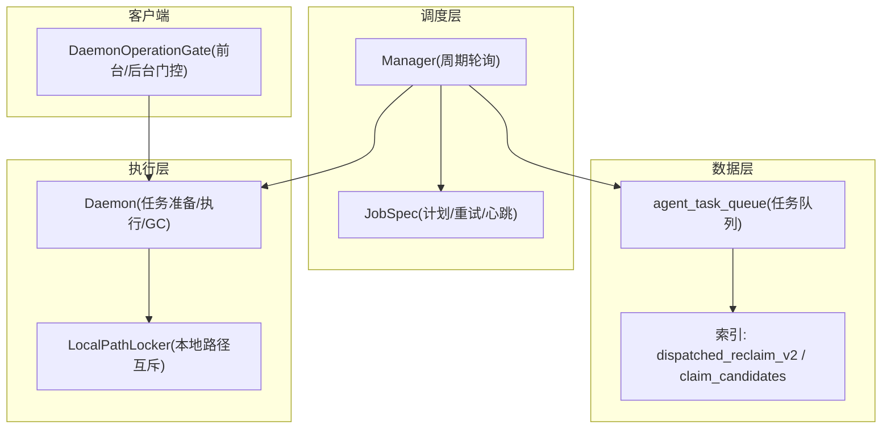
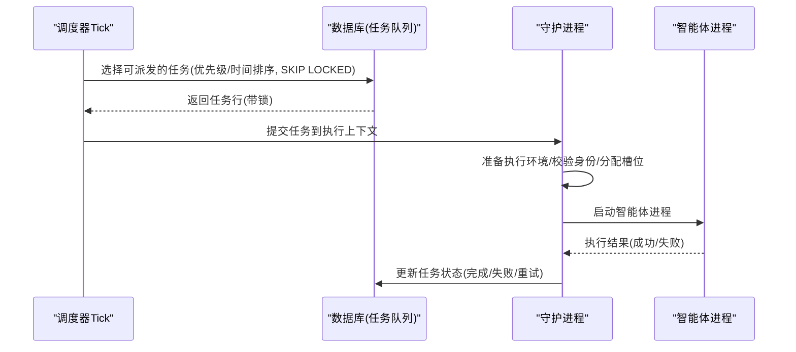
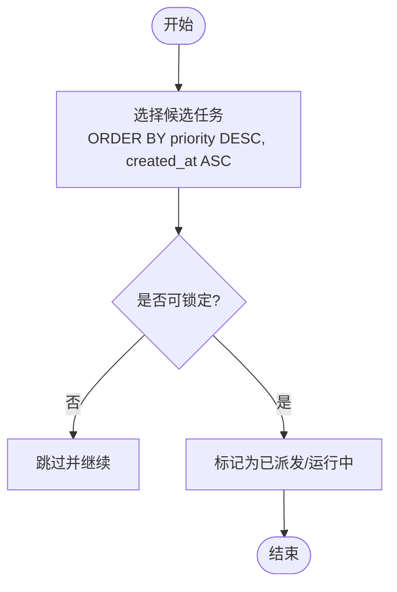
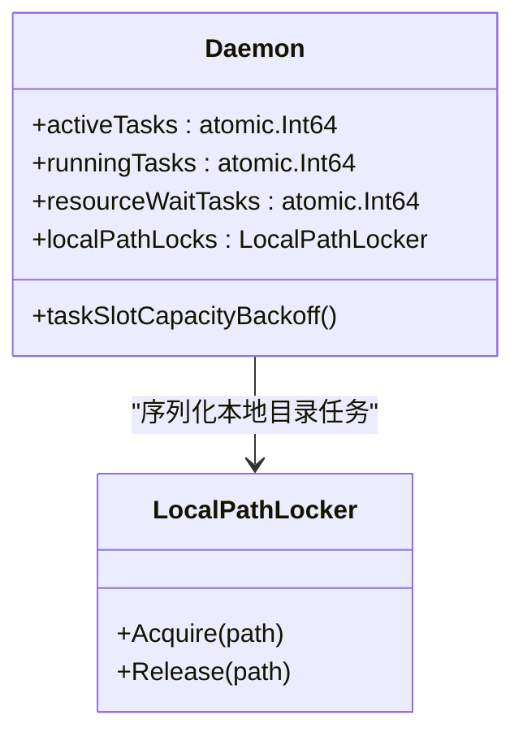
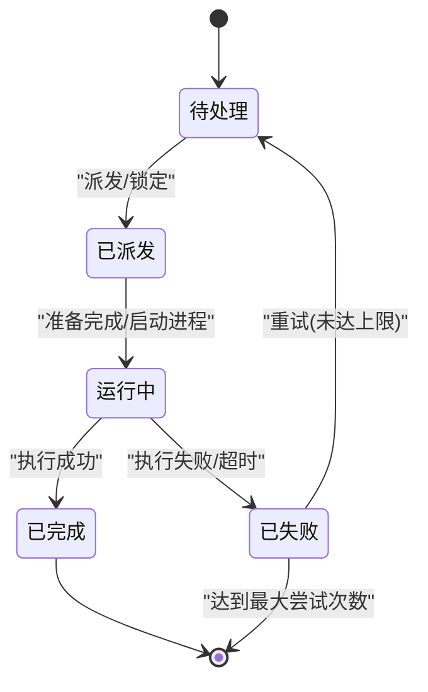
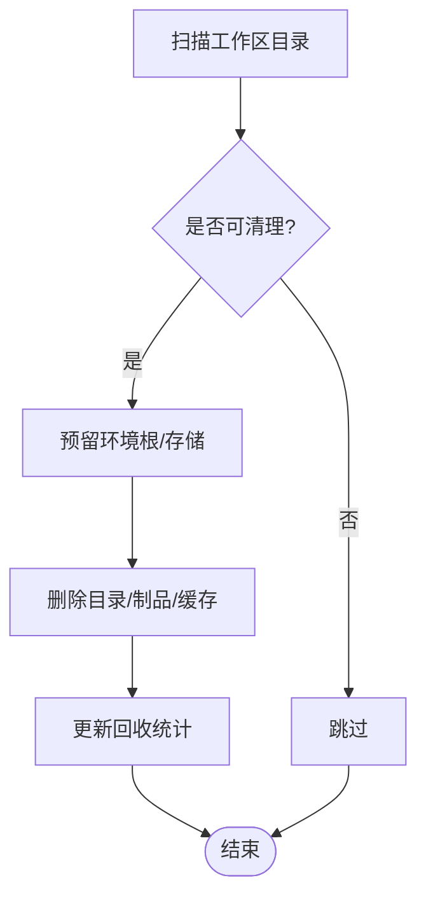
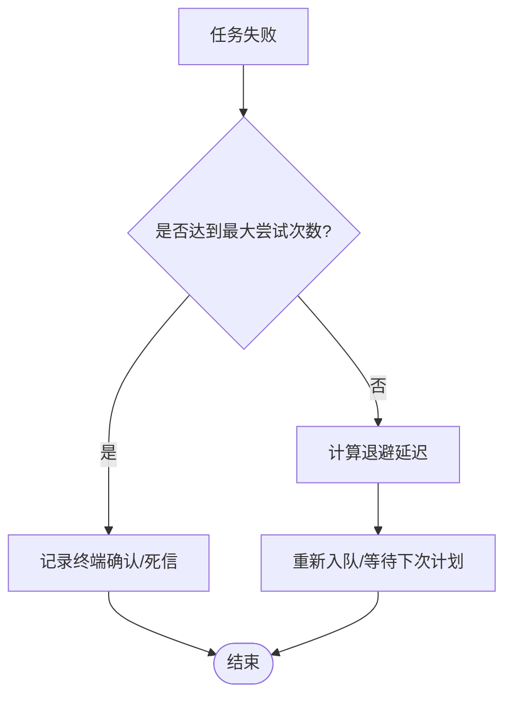
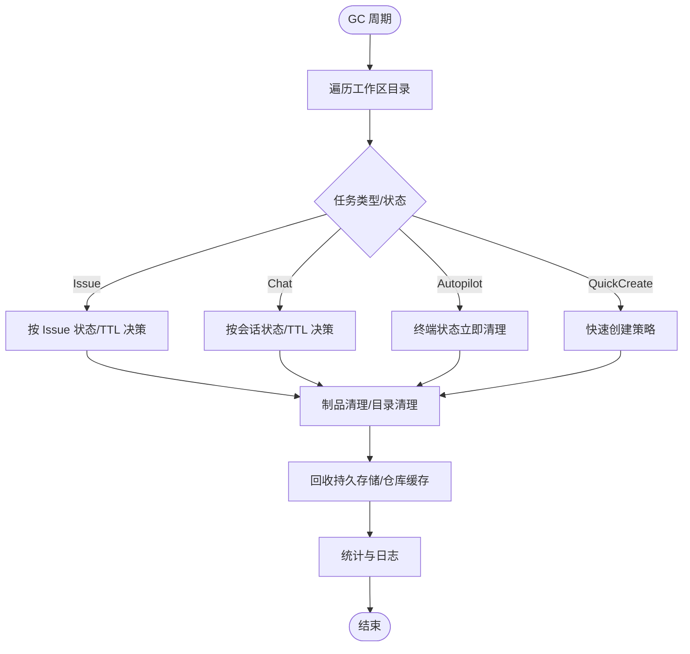
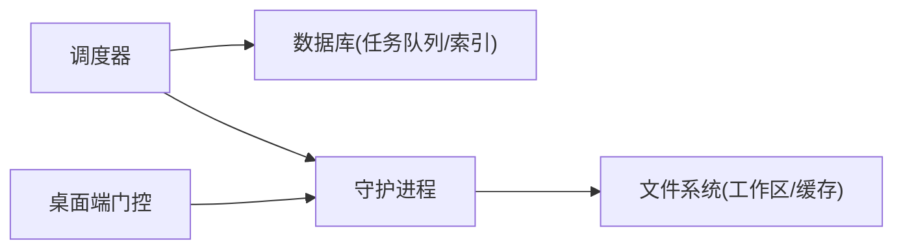

# 任务调度

<cite>
**本文引用的文件**
- [server/internal/scheduler/manager.go](file://server/internal/scheduler/manager.go)
- [server/internal/scheduler/spec.go](file://server/internal/scheduler/spec.go)
- [server/pkg/db/queries/agent.sql](file://server/pkg/db/queries/agent.sql)
- [server/migrations/390_agent_task_queue_dispatched_reclaim_v2_index.up.sql](file://server/migrations/390_agent_task_queue_dispatched_reclaim_v2_index.up.sql)
- [server/migrations/391_drop_agent_task_queue_dispatched_prepare_index.down.sql](file://server/migrations/391_drop_agent_task_queue_dispatched_prepare_index.down.sql)
- [server/internal/daemon/daemon.go](file://server/internal/daemon/daemon.go)
- [server/internal/daemon/gc.go](file://server/internal/daemon/gc.go)
- [apps/desktop/src/main/daemon-recovery.ts](file://apps/desktop/src/main/daemon-recovery.ts)
</cite>

## 目录
1. [简介](#简介)
2. [项目结构](#项目结构)
3. [核心组件](#核心组件)
4. [架构总览](#架构总览)
5. [详细组件分析](#详细组件分析)
6. [依赖关系分析](#依赖关系分析)
7. [性能考量](#性能考量)
8. [故障排查指南](#故障排查指南)
9. [结论](#结论)
10. [附录](#附录)

## 简介
本文件面向“智能体任务”的调度与执行，覆盖以下主题：
- 调度算法与优先级管理（数据库驱动的任务队列、按优先级与时间顺序派发）
- 并发控制（全局并发限制、工作线程池、本地路径互斥）
- 队列状态转换（待处理、运行中、完成/失败）
- 资源管理（磁盘空间、内存使用、进程数量监控与限制）
- 失败重试机制（重试策略、退避算法、死信/终止态）
- 垃圾回收（临时文件清理、工作目录回收、持久存储释放）
- 性能监控与瓶颈分析工具
- 配置优化与故障排查建议

## 项目结构
围绕任务调度的关键代码分布在服务端调度器、数据库查询与索引、守护进程执行与资源管理、以及桌面端操作门控等位置。整体组织方式如下：
- 调度器：基于数据库的执行记录表实现分布式锁与审计日志，提供周期轮询、计划计算、抢占式续租与心跳保活
- 任务队列：通过 SQL 查询与部分索引实现高并发下的公平派发与防竞争
- 守护进程：负责任务准备、环境装配、进程生命周期、资源占用统计与垃圾回收
- 桌面端：对前台/后台操作的串行化与忙闲控制，避免重复或冲突操作

图表来源
- [server/internal/scheduler/manager.go:93-136](file://server/internal/scheduler/manager.go#L93-L136)
- [server/internal/scheduler/spec.go:99-192](file://server/internal/scheduler/spec.go#L99-L192)
- [server/pkg/db/queries/agent.sql:918-937](file://server/pkg/db/queries/agent.sql#L918-L937)
- [server/pkg/db/queries/agent.sql:2286-2319](file://server/pkg/db/queries/agent.sql#L2286-L2319)
- [server/internal/daemon/daemon.go:373-626](file://server/internal/daemon/daemon.go#L373-L626)
- [apps/desktop/src/main/daemon-recovery.ts:248-306](file://apps/desktop/src/main/daemon-recovery.ts#L248-L306)

章节来源
- [server/internal/scheduler/manager.go:93-136](file://server/internal/scheduler/manager.go#L93-L136)
- [server/internal/scheduler/spec.go:99-192](file://server/internal/scheduler/spec.go#L99-L192)
- [server/pkg/db/queries/agent.sql:918-937](file://server/pkg/db/queries/agent.sql#L918-L937)
- [server/pkg/db/queries/agent.sql:2286-2319](file://server/pkg/db/queries/agent.sql#L2286-L2319)
- [server/internal/daemon/daemon.go:373-626](file://server/internal/daemon/daemon.go#L373-L626)
- [apps/desktop/src/main/daemon-recovery.ts:248-306](file://apps/desktop/src/main/daemon-recovery.ts#L248-L306)

## 核心组件
- 调度管理器 Manager：周期性 tick，计算应执行的 plan_time，尝试抢占并执行处理器，维护心跳与最终状态写入
- 作业规范 JobSpec：定义 cadence、catch-up 模式、超时、心跳间隔、最大尝试次数、重试退避、作用域与处理器
- 任务队列 agent_task_queue：承载任务的优先级、创建时间、运行时标识、状态与重试信息；配合部分索引实现高效派发与重取
- 守护进程 Daemon：负责任务准备、环境装配、进程启动与回收、资源统计、GC 与本地路径互斥
- 桌面端操作门控 DaemonOperationGate：保证前台操作串行、后台操作在空闲时执行，防止并发冲突

章节来源
- [server/internal/scheduler/manager.go:15-136](file://server/internal/scheduler/manager.go#L15-L136)
- [server/internal/scheduler/spec.go:23-192](file://server/internal/scheduler/spec.go#L23-L192)
- [server/pkg/db/queries/agent.sql:918-937](file://server/pkg/db/queries/agent.sql#L918-L937)
- [server/internal/daemon/daemon.go:373-626](file://server/internal/daemon/daemon.go#L373-L626)
- [apps/desktop/src/main/daemon-recovery.ts:248-306](file://apps/desktop/src/main/daemon-recovery.ts#L248-L306)

## 架构总览
调度器以数据库为协调中心，将“计划时间”作为分布式锁粒度，确保同一计划仅被一个实例执行。守护进程从队列中领取任务，进行环境准备与执行，完成后回写结果。桌面端通过门控控制 UI 相关的前台/后台操作，避免与守护进程执行冲突。

图表来源
- [server/internal/scheduler/manager.go:138-189](file://server/internal/scheduler/manager.go#L138-L189)
- [server/pkg/db/queries/agent.sql:918-937](file://server/pkg/db/queries/agent.sql#L918-L937)
- [server/internal/daemon/daemon.go:373-626](file://server/internal/daemon/daemon.go#L373-L626)

## 详细组件分析

### 调度算法与优先级管理
- 优先级与顺序：任务按优先级降序、创建时间升序排列，确保高优先级先执行，同优先级内遵循 FIFO
- 批量与分片：支持按运行时 ID 批量获取候选任务，减少网络往返；跨运行时合并排序保持公平性
- 抢占与锁：使用 FOR UPDATE SKIP LOCKED 避免锁竞争，保证并发安全
- 过期与重取：针对已派发但未启动的任务，通过索引与扫描进行重取与恢复

图表来源
- [server/pkg/db/queries/agent.sql:918-937](file://server/pkg/db/queries/agent.sql#L918-L937)
- [server/pkg/db/queries/agent.sql:2286-2319](file://server/pkg/db/queries/agent.sql#L2286-L2319)
- [server/migrations/390_agent_task_queue_dispatched_reclaim_v2_index.up.sql:1-5](file://server/migrations/390_agent_task_queue_dispatched_reclaim_v2_index.up.sql#L1-L5)

章节来源
- [server/pkg/db/queries/agent.sql:918-937](file://server/pkg/db/queries/agent.sql#L918-L937)
- [server/pkg/db/queries/agent.sql:2286-2319](file://server/pkg/db/queries/agent.sql#L2286-L2319)
- [server/migrations/390_agent_task_queue_dispatched_reclaim_v2_index.up.sql:1-5](file://server/migrations/390_agent_task_queue_dispatched_reclaim_v2_index.up.sql#L1-L5)

### 并发控制与线程池管理
- 全局并发限制：守护进程维护 activeTasks、runningTasks、resourceWaitTasks 等原子计数器，用于健康检查与限流
- 槽位等待与退避：任务槽位等待超时与容量不足时的退避时间，避免频繁重试造成抖动
- 本地路径互斥：LocalPathLocker 确保同一本地目录的任务串行执行，避免并发写入冲突
- 桌面端门控：前台操作串行化，后台操作在空闲时执行，防止与守护进程执行冲突

图表来源
- [server/internal/daemon/daemon.go:544-626](file://server/internal/daemon/daemon.go#L544-L626)
- [server/internal/daemon/daemon.go:594-600](file://server/internal/daemon/daemon.go#L594-L600)

章节来源
- [server/internal/daemon/daemon.go:544-626](file://server/internal/daemon/daemon.go#L544-L626)
- [apps/desktop/src/main/daemon-recovery.ts:248-306](file://apps/desktop/src/main/daemon-recovery.ts#L248-L306)

### 队列管理与状态转换
- 待处理队列（queued）：新任务进入，等待派发
- 运行中队列（dispatched/running）：任务被派发并开始准备或执行
- 完成/失败队列（completed/failed）：任务结束，记录结果与重试信息
- 状态转换由调度器与守护进程协作完成，结合数据库事务与锁保证一致性

图表来源
- [server/pkg/db/queries/agent.sql:918-937](file://server/pkg/db/queries/agent.sql#L918-L937)
- [server/pkg/db/queries/agent.sql:1983-2008](file://server/pkg/db/queries/agent.sql#L1983-L2008)

章节来源
- [server/pkg/db/queries/agent.sql:918-937](file://server/pkg/db/queries/agent.sql#L918-L937)
- [server/pkg/db/queries/agent.sql:1983-2008](file://server/pkg/db/queries/agent.sql#L1983-L2008)

### 资源管理与监控
- 磁盘空间：GC 循环定期扫描工作区目录，依据 TTL 与策略清理任务目录、制品、仓库缓存与临时目录
- 内存使用：守护进程维护活跃环境与持久存储引用计数，防止 GC 误删正在使用的资源
- 进程数量：通过原子计数器与系统调用（Windows Job Object 会计信息）监控进程数与活跃度
- 指标暴露：健康接口与日志输出包含活跃任务数、等待资源数、GC 回收统计等

图表来源
- [server/internal/daemon/gc.go:27-193](file://server/internal/daemon/gc.go#L27-L193)
- [server/internal/daemon/gc.go:195-374](file://server/internal/daemon/gc.go#L195-L374)

章节来源
- [server/internal/daemon/gc.go:27-193](file://server/internal/daemon/gc.go#L27-L193)
- [server/internal/daemon/gc.go:195-374](file://server/internal/daemon/gc.go#L195-L374)

### 失败重试与死信队列
- 重试策略：根据 JobSpec 的最大尝试次数与退避数组决定下一次尝试时间
- 退避算法：retryDelay(attempt) 从 RetryBackoff 中选择延迟，超出长度则复用最后项
- 死信/终止态：当达到最大尝试次数，记录终端确认并停止自动重试，转为人工处理

图表来源
- [server/internal/scheduler/spec.go:237-251](file://server/internal/scheduler/spec.go#L237-L251)
- [server/pkg/db/queries/agent.sql:1983-2008](file://server/pkg/db/queries/agent.sql#L1983-L2008)

章节来源
- [server/internal/scheduler/spec.go:237-251](file://server/internal/scheduler/spec.go#L237-L251)
- [server/pkg/db/queries/agent.sql:1983-2008](file://server/pkg/db/queries/agent.sql#L1983-L2008)

### 垃圾回收机制
- 任务目录清理：依据任务类型（issue/chat/autopilot/quick-create）与父记录状态决定清理策略
- 制品清理：对可再生制品（如 Codex 缓存）按 TTL 清理，保留必要日志与审计信息
- 仓库缓存回收：清理失效 worktree 引用与不再需要的裸仓库缓存
- 持久存储释放：Codex 会话存储与 Hermes 记忆/会话存储按各自 TTL 回收，同时保护活跃任务引用

图表来源
- [server/internal/daemon/gc.go:83-193](file://server/internal/daemon/gc.go#L83-L193)
- [server/internal/daemon/gc.go:554-653](file://server/internal/daemon/gc.go#L554-L653)
- [server/internal/daemon/gc.go:683-739](file://server/internal/daemon/gc.go#L683-L739)
- [server/internal/daemon/gc.go:741-794](file://server/internal/daemon/gc.go#L741-L794)

章节来源
- [server/internal/daemon/gc.go:83-193](file://server/internal/daemon/gc.go#L83-L193)
- [server/internal/daemon/gc.go:554-653](file://server/internal/daemon/gc.go#L554-L653)
- [server/internal/daemon/gc.go:683-739](file://server/internal/daemon/gc.go#L683-L739)
- [server/internal/daemon/gc.go:741-794](file://server/internal/daemon/gc.go#L741-L794)

### 性能监控与瓶颈分析
- 调度器指标：每次 tick 的错误日志、计划计算耗时、抢占冲突与窃取情况
- 守护进程指标：活跃任务数、运行中任务数、资源等待任务数、GC 回收字节数与模式分布
- 数据库指标：任务队列索引命中、SKIP LOCKED 竞争情况、批量 claim 的性能
- 诊断建议：关注长时间 RUNNING 的租约、心跳丢失、handler panic 与超时错误

章节来源
- [server/internal/scheduler/manager.go:121-189](file://server/internal/scheduler/manager.go#L121-L189)
- [server/internal/daemon/daemon.go:544-626](file://server/internal/daemon/daemon.go#L544-L626)
- [server/internal/daemon/gc.go:176-193](file://server/internal/daemon/gc.go#L176-L193)

## 依赖关系分析
- 调度器依赖数据库查询与索引，确保并发安全与公平派发
- 守护进程依赖本地文件系统、仓库缓存与技能包缓存，负责环境装配与进程管理
- 桌面端通过门控与守护进程交互，避免 UI 操作干扰执行流程

图表来源
- [server/internal/scheduler/manager.go:93-136](file://server/internal/scheduler/manager.go#L93-L136)
- [server/internal/daemon/daemon.go:373-626](file://server/internal/daemon/daemon.go#L373-L626)
- [apps/desktop/src/main/daemon-recovery.ts:248-306](file://apps/desktop/src/main/daemon-recovery.ts#L248-L306)

章节来源
- [server/internal/scheduler/manager.go:93-136](file://server/internal/scheduler/manager.go#L93-L136)
- [server/internal/daemon/daemon.go:373-626](file://server/internal/daemon/daemon.go#L373-L626)
- [apps/desktop/src/main/daemon-recovery.ts:248-306](file://apps/desktop/src/main/daemon-recovery.ts#L248-L306)

## 性能考量
- 调度器 Tick 间隔：应小于最短作业周期，避免积压；首次 tick 立即执行以减少冷启动延迟
- 批量 Claim：跨运行时批量获取候选任务，减少网络往返；合并排序保持公平性
- 索引优化：部分索引提升 dispatched/claim 查询性能，避免全表扫描
- 守护进程准备超时：硬边界保障任务准备阶段不无限阻塞，区分 provider 执行超时
- GC 频率与 TTL：平衡清理及时性与资源重建成本，避免频繁重建缓存影响性能

章节来源
- [server/internal/scheduler/manager.go:93-136](file://server/internal/scheduler/manager.go#L93-L136)
- [server/pkg/db/queries/agent.sql:2286-2319](file://server/pkg/db/queries/agent.sql#L2286-L2319)
- [server/migrations/390_agent_task_queue_dispatched_reclaim_v2_index.up.sql:1-5](file://server/migrations/390_agent_task_queue_dispatched_reclaim_v2_index.up.sql#L1-L5)
- [server/internal/daemon/daemon.go:69-84](file://server/internal/daemon/daemon.go#L69-L84)
- [server/internal/daemon/gc.go:27-61](file://server/internal/daemon/gc.go#L27-L61)

## 故障排查指南
- 任务卡住：检查 RUNNING 租约是否过期，查看心跳丢失与抢占窃取日志
- 重试风暴：确认最大尝试次数与退避配置，避免短周期高频重试
- 资源耗尽：监控活跃任务数与资源等待任务数，调整并发限制与 GC 策略
- 权限问题：GC 检查 404 可能表示无访问权限，需检查令牌与工作区绑定
- 桌面端冲突：前台操作串行化失败或后台操作被拒绝，检查门控状态与忙闲标志

章节来源
- [server/internal/scheduler/manager.go:317-430](file://server/internal/scheduler/manager.go#L317-L430)
- [server/internal/daemon/gc.go:545-552](file://server/internal/daemon/gc.go#L545-L552)
- [apps/desktop/src/main/daemon-recovery.ts:248-306](file://apps/desktop/src/main/daemon-recovery.ts#L248-L306)

## 结论
本方案通过数据库驱动的调度器与守护进程协同，实现了高并发、公平且可观测的智能体任务调度。优先级与时间顺序保证公平派发，局部索引与 SKIP LOCKED 提升并发性能；守护进程的资源管理与 GC 机制确保系统长期稳定运行；重试与死信机制提供容错能力；桌面端门控避免 UI 与执行冲突。建议在生产环境中合理配置 Tick 间隔、重试退避与 GC TTL，并结合日志与指标持续优化。

## 附录
- 配置建议：
  - 调度器：设置合理的 Cadence、ScheduleDelay、CatchUpMode、MaxPlansPerTick、RunTimeout、StaleTimeout、HeartbeatInterval、MaxAttempts、RetryBackoff
  - 守护进程：配置 WorkspacesRoot、GCInterval、GCTTL、GCCompletedTaskTTL、GCOrphanTTL、GCArtifactTTL、GCRepoTTL、GCHermesMemoryTTL、GCHermesSessionTTL
  - 桌面端：合理设置前台/后台操作门控，避免与守护进程执行冲突
- 监控建议：
  - 关注调度器 tick 错误、计划计算耗时、抢占冲突与窃取
  - 监控守护进程活跃任务数、资源等待任务数、GC 回收统计
  - 检查数据库索引命中率与 SKIP LOCKED 竞争情况