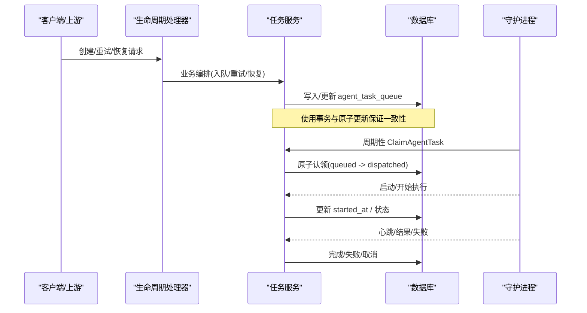
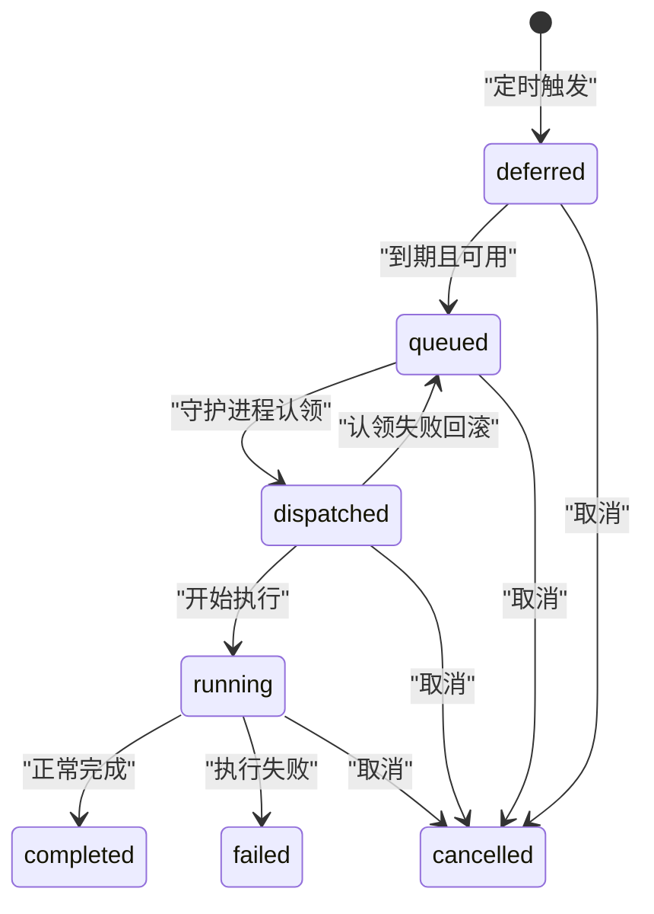
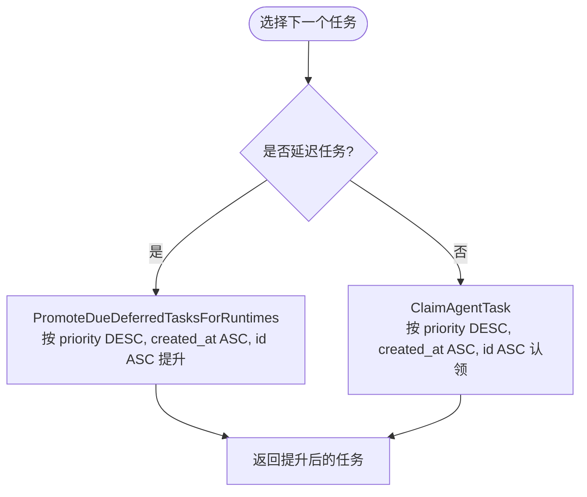
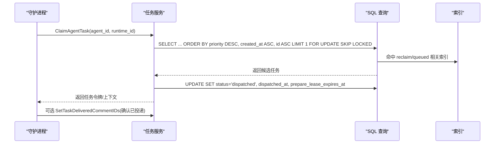
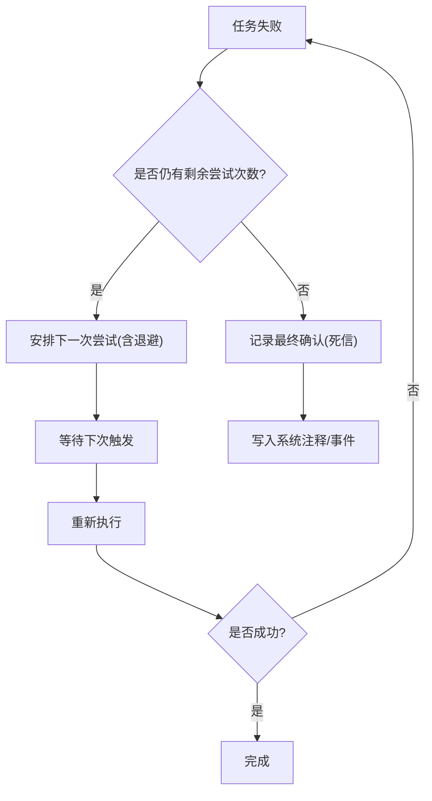
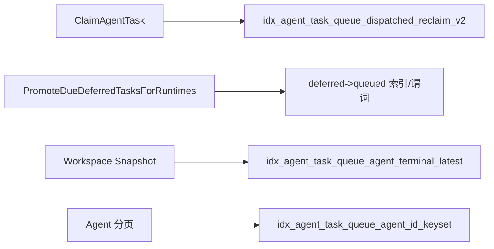
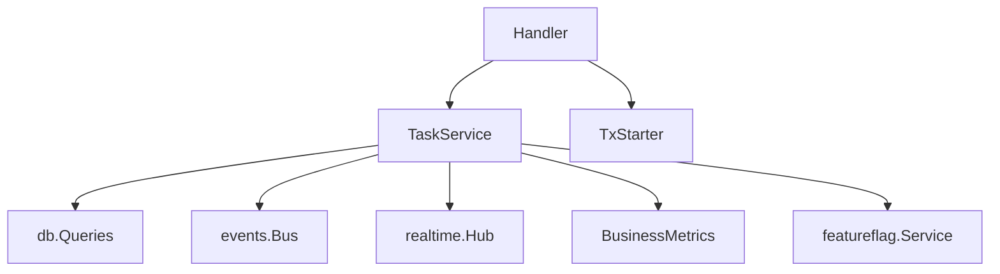

# 任务队列管理

<cite>
**本文引用的文件**
- [server/internal/service/task.go](file://server/internal/service/task.go)
- [server/internal/handler/task_lifecycle.go](file://server/internal/handler/task_lifecycle.go)
- [server/pkg/db/queries/agent.sql](file://server/pkg/db/queries/agent.sql)
- [apps/docs/content/docs/tasks.mdx](file://apps/docs/content/docs/tasks.mdx)
- [server/migrations/390_agent_task_queue_dispatched_reclaim_v2_index.up.sql](file://server/migrations/390_agent_task_queue_dispatched_reclaim_v2_index.up.sql)
- [server/migrations/233_agent_task_queue_agent_terminal_latest_index.up.sql](file://server/migrations/233_agent_task_queue_agent_terminal_latest_index.up.sql)
- [server/migrations/278_agent_task_queue_agent_id_keyset_index.up.sql](file://server/migrations/278_agent_task_queue_agent_id_keyset_index.up.sql)
- [server/migrations/125_agent_task_queue_dispatched_prepare_index.down.sql](file://server/migrations/125_agent_task_queue_dispatched_prepare_index.down.sql)
- [server/migrations/055_task_lease_and_retry.down.sql](file://server/migrations/055_task_lease_and_retry.down.sql)
</cite>

## 目录
1. [简介](#简介)
2. [项目结构](#项目结构)
3. [核心组件](#核心组件)
4. [架构总览](#架构总览)
5. [详细组件分析](#详细组件分析)
6. [依赖关系分析](#依赖关系分析)
7. [性能考量](#性能考量)
8. [故障排查指南](#故障排查指南)
9. [结论](#结论)
10. [附录](#附录)

## 简介
本文件面向任务队列（Agent Task Queue）的完整生命周期、优先级与分发机制、重试与死信处理、以及性能优化与监控调试。任务在数据库中通过 agent_task_queue 表持久化，状态包括 deferred、queued、dispatched、waiting_local_directory、running、completed、failed、cancelled。调度与执行由服务端服务层与守护进程（daemon）协作完成：服务端负责入队、认领、重放、失败恢复；守护进程负责拉取任务、启动智能体、上报心跳与结果。

## 项目结构
- 服务层：server/internal/service/task.go 实现任务入队、认领、重试、回收等核心逻辑，并集成指标、事件、实时通知与特性开关。
- 处理器层：server/internal/handler/task_lifecycle.go 暴露守护进程使用的接口，如孤儿任务恢复、会话钉住、手动重试等。
- 数据访问层：server/pkg/db/queries/agent.sql 提供 SQL 查询与更新，涵盖认领、批量认领、延迟任务提升、运行中快照、统计等。
- 文档与迁移：apps/docs/content/docs/tasks.mdx 描述状态与超时；migrations 包含关键索引与约束变更。

```mermaid
graph TB
subgraph "服务端"
SVC["TaskService<br/>任务服务"]
HND["Handler<br/>生命周期处理器"]
end
subgraph "数据库"
DB["PostgreSQL<br/>agent_task_queue 等表"]
IDX["索引<br/>reclaim / terminal / keyset"]
end
subgraph "守护进程"
DAEMON["Daemon<br/>运行时/智能体执行"]
end
HND --> SVC
SVC --> DB
DAEMON --> SVC
SVC --> IDX
```

图表来源
- [server/internal/service/task.go:39-91](file://server/internal/service/task.go#L39-L91)
- [server/internal/handler/task_lifecycle.go:17-59](file://server/internal/handler/task_lifecycle.go#L17-L59)
- [server/pkg/db/queries/agent.sql:738-806](file://server/pkg/db/queries/agent.sql#L738-L806)
- [server/migrations/390_agent_task_queue_dispatched_reclaim_v2_index.up.sql:1-5](file://server/migrations/390_agent_task_queue_dispatched_reclaim_v2_index.up.sql#L1-L5)

章节来源
- [server/internal/service/task.go:39-91](file://server/internal/service/task.go#L39-L91)
- [server/internal/handler/task_lifecycle.go:17-59](file://server/internal/handler/task_lifecycle.go#L17-L59)
- [server/pkg/db/queries/agent.sql:738-806](file://server/pkg/db/queries/agent.sql#L738-L806)
- [apps/docs/content/docs/tasks.mdx:33-48](file://apps/docs/content/docs/tasks.mdx#L33-L48)

## 核心组件
- 任务服务（TaskService）：封装入队、认领、重试、回收、指标与事件广播等能力，并提供空队列缓存与“待回收”提示缓存以优化热路径。
- 生命周期处理器（Handler）：暴露守护进程调用的接口，用于孤儿任务恢复、会话钉住、手动重试等。
- 数据访问（SQL 查询）：提供原子化的认领、批量认领、延迟任务提升、运行中快照、统计等 SQL 操作，配合专用索引保障性能。
- 守护进程（Daemon）：周期性拉取任务、启动智能体、维护心跳、汇报结果或失败。

章节来源
- [server/internal/service/task.go:39-91](file://server/internal/service/task.go#L39-L91)
- [server/internal/handler/task_lifecycle.go:17-59](file://server/internal/handler/task_lifecycle.go#L17-L59)
- [server/pkg/db/queries/agent.sql:738-937](file://server/pkg/db/queries/agent.sql#L738-L937)

## 架构总览
任务从创建到完成的端到端流程如下：
- 入队：服务层计算归属与上下文，插入 agent_task_queue，状态为 queued 或 deferred。
- 提升：deferred 到期后提升为 queued。
- 认领：守护进程调用 ClaimAgentTask，将状态改为 dispatched，并设置 prepare lease。
- 启动：守护进程开始执行，若需等待本地目录则进入 waiting_local_directory；否则进入 running。
- 完成/失败：完成后置为 completed；失败时进入 failed，触发重试或死信。
- 取消：可被取消至 cancelled。

图表来源
- [server/internal/handler/task_lifecycle.go:17-59](file://server/internal/handler/task_lifecycle.go#L17-L59)
- [server/internal/service/task.go:180-196](file://server/internal/service/task.go#L180-L196)
- [server/pkg/db/queries/agent.sql:738-806](file://server/pkg/db/queries/agent.sql#L738-L806)

## 详细组件分析

### 任务生命周期与状态转换
- 状态集合：deferred、queued、dispatched、waiting_local_directory、running、completed、failed、cancelled。
- 关键转换：
  - deferred -> queued：到期且满足条件（运行时在线、无同 issue+agent 占用）。
  - queued -> dispatched：守护进程成功认领。
  - dispatched -> running：守护进程开始执行。
  - running -> completed/failed/cancelled：执行结束或外部干预。
  - dispatched -> queued：认领失败回滚。
  - 任意活跃状态 -> cancelled：取消流程。

图表来源
- [apps/docs/content/docs/tasks.mdx:33-48](file://apps/docs/content/docs/tasks.mdx#L33-L48)
- [server/pkg/db/queries/agent.sql:738-806](file://server/pkg/db/queries/agent.sql#L738-L806)
- [server/pkg/db/queries/agent.sql:2258-2391](file://server/pkg/db/queries/agent.sql#L2258-L2391)

章节来源
- [apps/docs/content/docs/tasks.mdx:33-48](file://apps/docs/content/docs/tasks.mdx#L33-L48)
- [server/pkg/db/queries/agent.sql:2258-2391](file://server/pkg/db/queries/agent.sql#L2258-L2391)

### 优先级算法与排序策略
- 排序键：priority DESC、created_at ASC、id ASC。
- priority 的来源：入队时根据时间戳、工作空间权重、智能体类型等综合计算（具体计算逻辑在服务层入队路径），确保高优先级任务优先被认领。
- 提升阶段：deferred 提升到 queued 时同样按 priority DESC、created_at ASC、id ASC 选择首个任务。

图表来源
- [server/pkg/db/queries/agent.sql:2355-2391](file://server/pkg/db/queries/agent.sql#L2355-L2391)
- [server/pkg/db/queries/agent.sql:738-806](file://server/pkg/db/queries/agent.sql#L738-L806)

章节来源
- [server/pkg/db/queries/agent.sql:738-806](file://server/pkg/db/queries/agent.sql#L738-L806)
- [server/pkg/db/queries/agent.sql:2355-2391](file://server/pkg/db/queries/agent.sql#L2355-L2391)

### 任务分发与并发控制
- 认领流程（ClaimAgentTask）：
  - 仅对 runtime 健康且在线的任务进行认领。
  - 同一 (issue, agent) 或 (chat_session, agent) 或 quick-create 形状的任务串行化，避免重复执行。
  - 使用 FOR UPDATE SKIP LOCKED 防止并发争抢。
- 批量认领与恢复：
  - ReclaimStaleDispatchedTasksForRuntimes：跨多个 runtime 批量找回丢失响应的 dispatched 任务。
  - 通过 prepare_lease 与 claim recovery window 保护长准备阶段与网络抖动。
- 负载均衡：
  - 基于 runtime 可见性（public/private）与 owner 匹配限制认领范围。
  - 结合运行时心跳与 stale 阈值，避免向离线机器派发。

图表来源
- [server/pkg/db/queries/agent.sql:738-806](file://server/pkg/db/queries/agent.sql#L738-L806)
- [server/pkg/db/queries/agent.sql:808-831](file://server/pkg/db/queries/agent.sql#L808-L831)
- [server/migrations/390_agent_task_queue_dispatched_reclaim_v2_index.up.sql:1-5](file://server/migrations/390_agent_task_queue_dispatched_reclaim_v2_index.up.sql#L1-L5)

章节来源
- [server/pkg/db/queries/agent.sql:738-937](file://server/pkg/db/queries/agent.sql#L738-L937)
- [server/migrations/390_agent_task_queue_dispatched_reclaim_v2_index.up.sql:1-5](file://server/migrations/390_agent_task_queue_dispatched_reclaim_v2_index.up.sql#L1-L5)

### 重试机制与死信队列
- 自动重试：
  - 失败任务通过 HandleFailedTasks 统一处理，可能生成新的尝试任务。
  - 支持受限自动尝试次数，达到上限后记录最终确认，停止自动生成。
- 指数退避：
  - 通过 attempt、max_attempts、parent_task_id、failure_reason 等字段记录重试历史与原因（迁移定义）。
  - 结合调度器与后台任务实现退避策略（服务层与调度层协作）。
- 死信队列：
  - 当自动尝试耗尽，AcknowledgeExhaustedDelegatedFailureRecovery 标记最新恢复任务为已确认，并写入系统注释说明不再继续生成。
  - 可通过 UI 或 API 手动重试（RerunIssue/RetrySourceContextQuickCreate）。

图表来源
- [server/pkg/db/queries/agent.sql:1983-2008](file://server/pkg/db/queries/agent.sql#L1983-L2008)
- [server/migrations/055_task_lease_and_retry.down.sql:1-8](file://server/migrations/055_task_lease_and_retry.down.sql#L1-L8)
- [server/internal/handler/task_lifecycle.go:17-59](file://server/internal/handler/task_lifecycle.go#L17-L59)

章节来源
- [server/pkg/db/queries/agent.sql:1983-2008](file://server/pkg/db/queries/agent.sql#L1983-L2008)
- [server/migrations/055_task_lease_and_retry.down.sql:1-8](file://server/migrations/055_task_lease_and_retry.down.sql#L1-L8)
- [server/internal/handler/task_lifecycle.go:17-59](file://server/internal/handler/task_lifecycle.go#L17-L59)

### 性能优化：索引设计与查询优化
- 关键索引：
  - idx_agent_task_queue_dispatched_reclaim_v2：(runtime_id, dispatched_at ASC, priority DESC)，加速过时 dispatched 任务的批量找回。
  - idx_agent_task_queue_agent_terminal_latest：(agent_id, completed_at DESC NULLS LAST, created_at DESC, id DESC) WHERE status IN ('completed','failed')，加速每个 agent 的最新终态任务查找。
  - idx_agent_task_queue_agent_id_keyset：(agent_id, id)，加速按 agent 分页遍历。
  - 其他：prepare 阶段索引、聊天任务挂起索引等（见迁移列表）。
- 查询优化：
  - 使用部分索引（WHERE 子句）减少热路径扫描。
  - 使用 FOR UPDATE SKIP LOCKED 避免锁竞争。
  - 批量操作（多 runtime 批量 reclaim）减少往返。
  - 运行中快照按状态优先级排序并限制行数，避免大表全扫。

图表来源
- [server/migrations/390_agent_task_queue_dispatched_reclaim_v2_index.up.sql:1-5](file://server/migrations/390_agent_task_queue_dispatched_reclaim_v2_index.up.sql#L1-L5)
- [server/migrations/233_agent_task_queue_agent_terminal_latest_index.up.sql:1-22](file://server/migrations/233_agent_task_queue_agent_terminal_latest_index.up.sql#L1-L22)
- [server/migrations/278_agent_task_queue_agent_id_keyset_index.up.sql:1-14](file://server/migrations/278_agent_task_queue_agent_id_keyset_index.up.sql#L1-L14)

章节来源
- [server/migrations/390_agent_task_queue_dispatched_reclaim_v2_index.up.sql:1-5](file://server/migrations/390_agent_task_queue_dispatched_reclaim_v2_index.up.sql#L1-L5)
- [server/migrations/233_agent_task_queue_agent_terminal_latest_index.up.sql:1-22](file://server/migrations/233_agent_task_queue_agent_terminal_latest_index.up.sql#L1-L22)
- [server/migrations/278_agent_task_queue_agent_id_keyset_index.up.sql:1-14](file://server/migrations/278_agent_task_queue_agent_id_keyset_index.up.sql#L1-L14)

### 任务监控与调试工具
- 指标与事件：
  - 任务入队、认领、失败等事件通过 Metrics 与 Bus 上报，便于监控告警。
  - 实时通知（Hub）可用于前端实时更新任务状态。
- 守护进程恢复：
  - RecoverOrphanedTasks：守护进程重启时恢复孤儿任务，避免长时间卡住。
- 会话钉住：
  - PinTaskSession：持久化 session_id 与 work_dir，崩溃后可恢复对话。
- 手动重试：
  - RerunIssue：针对问题手动重试，可选择特定历史任务作为目标。
  - RetrySourceContextQuickCreate：快速创建的上下文可重试并转移不可变上下文。

章节来源
- [server/internal/service/task.go:39-91](file://server/internal/service/task.go#L39-L91)
- [server/internal/handler/task_lifecycle.go:17-59](file://server/internal/handler/task_lifecycle.go#L17-L59)
- [server/internal/handler/task_lifecycle.go:61-141](file://server/internal/handler/task_lifecycle.go#L61-L141)
- [server/internal/handler/task_lifecycle.go:143-274](file://server/internal/handler/task_lifecycle.go#L143-L274)

## 依赖关系分析
- 服务层依赖：
  - 数据库查询（db.Queries）：所有任务状态的原子更新与读取。
  - 事件总线（events.Bus）与实时中心（realtime.Hub）：用于广播任务状态变化。
  - 指标（obsmetrics.BusinessMetrics）：记录入队、认领、失败等业务指标。
  - 特性开关（featureflag.Service）：控制 Composio MCP overlay、Quick Actions 等功能。
- 处理器层依赖：
  - 事务启动器（TxStarter）：保证会话钉住等操作的原子性。
  - 鉴权与授权：确保只有合法用户/守护进程可操作任务。
- 数据层依赖：
  - PostgreSQL 索引与约束：保证并发安全与查询性能。
  - 迁移脚本：逐步演进 schema 与索引。

图表来源
- [server/internal/service/task.go:39-91](file://server/internal/service/task.go#L39-L91)
- [server/internal/handler/task_lifecycle.go:108-141](file://server/internal/handler/task_lifecycle.go#L108-L141)

章节来源
- [server/internal/service/task.go:39-91](file://server/internal/service/task.go#L39-L91)
- [server/internal/handler/task_lifecycle.go:108-141](file://server/internal/handler/task_lifecycle.go#L108-L141)

## 性能考量
- 热路径优化：
  - 空队列缓存（EmptyClaimCache）：避免稳态下频繁扫描数据库。
  - 待回收提示缓存（ReclaimCheck）：减少无条件 reclaim 更新。
- 索引设计：
  - 部分索引与复合索引覆盖高频查询模式（认领、提升、快照）。
- 批量操作：
  - 批量 reclaim 减少网络往返，提高吞吐。
- 锁与并发：
  - FOR UPDATE SKIP LOCKED 避免锁竞争，提升并发认领效率。
- 资源隔离：
  - 运行时可见性与 owner 匹配限制认领范围，避免跨租户/私有资源误用。

[本节为通用指导，不直接分析具体文件]

## 故障排查指南
- 任务卡在 dispatched：
  - 检查 prepare_lease_expires_at 与 claim recovery window，必要时触发 ReclaimStaleDispatchedTasksForRuntimes。
- 任务未进入 running：
  - 检查 waiting_local_directory 是否因目录锁阻塞；确认守护进程是否成功获取目录。
- 任务失败后未重试：
  - 检查 max_attempts 是否耗尽；查看 AcknowledgeExhaustedDelegatedFailureRecovery 是否已记录最终确认。
- 守护进程重启后任务异常：
  - 调用 RecoverOrphanedTasks 恢复孤儿任务，并通过 HandleFailedTasks 统一处理。
- 手动重试：
  - 使用 RerunIssue 或 RetrySourceContextQuickCreate 重新入队，注意权限与引用源。

章节来源
- [server/pkg/db/queries/agent.sql:851-937](file://server/pkg/db/queries/agent.sql#L851-L937)
- [server/pkg/db/queries/agent.sql:1983-2008](file://server/pkg/db/queries/agent.sql#L1983-L2008)
- [server/internal/handler/task_lifecycle.go:17-59](file://server/internal/handler/task_lifecycle.go#L17-L59)
- [server/internal/handler/task_lifecycle.go:143-274](file://server/internal/handler/task_lifecycle.go#L143-L274)

## 结论
本任务队列系统通过精细的状态机、严格的并发控制、完善的优先级与重试机制，以及针对性的索引与缓存优化，实现了高可靠、高性能的智能体任务调度。守护进程与服务端的紧密协作确保了任务从入队到完成的端到端一致性。建议在生产环境中持续监控指标与日志，结合索引与配置调优，保持系统稳定与高效。

[本节为总结，不直接分析具体文件]

## 附录
- 状态与超时参考：deferred、queued、dispatched、waiting_local_directory、running、completed、failed、cancelled 及其超时行为参见文档。
- 迁移清单：关键索引与约束变更见 migrations 目录，确保在线升级与零停机。

章节来源
- [apps/docs/content/docs/tasks.mdx:33-48](file://apps/docs/content/docs/tasks.mdx#L33-L48)
- [server/migrations/390_agent_task_queue_dispatched_reclaim_v2_index.up.sql:1-5](file://server/migrations/390_agent_task_queue_dispatched_reclaim_v2_index.up.sql#L1-L5)
- [server/migrations/233_agent_task_queue_agent_terminal_latest_index.up.sql:1-22](file://server/migrations/233_agent_task_queue_agent_terminal_latest_index.up.sql#L1-L22)
- [server/migrations/278_agent_task_queue_agent_id_keyset_index.up.sql:1-14](file://server/migrations/278_agent_task_queue_agent_id_keyset_index.up.sql#L1-L14)