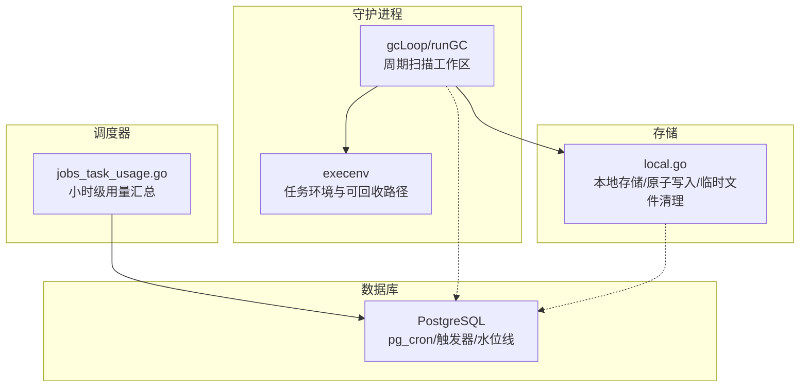
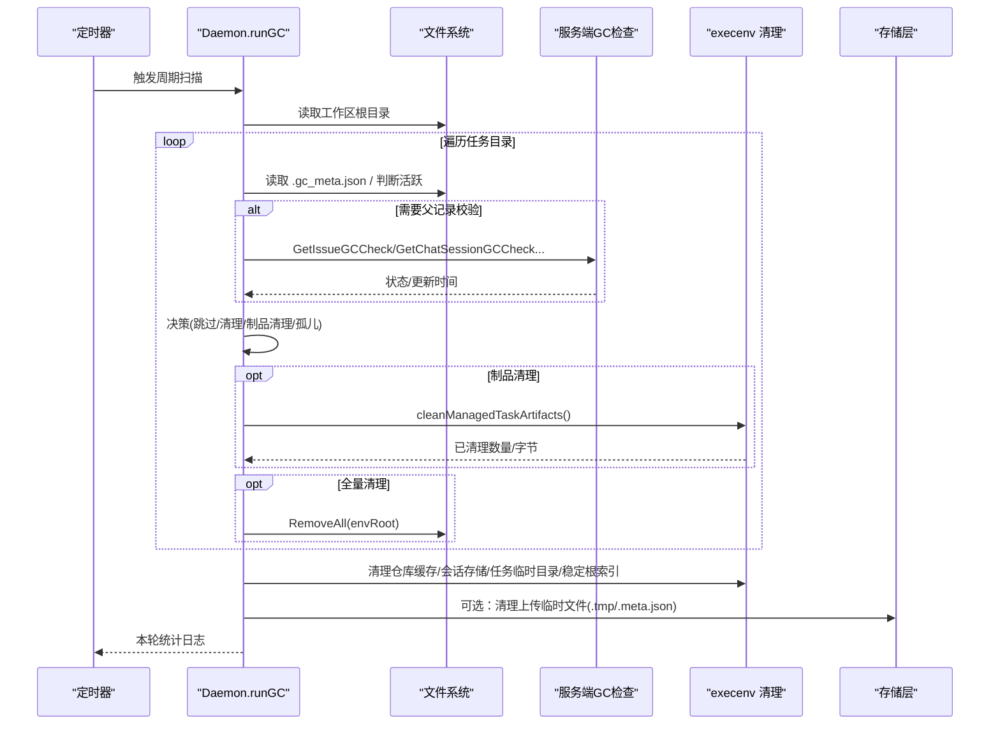
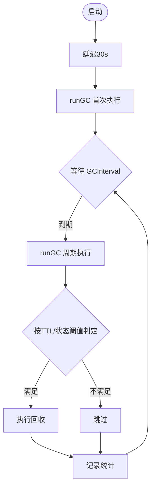
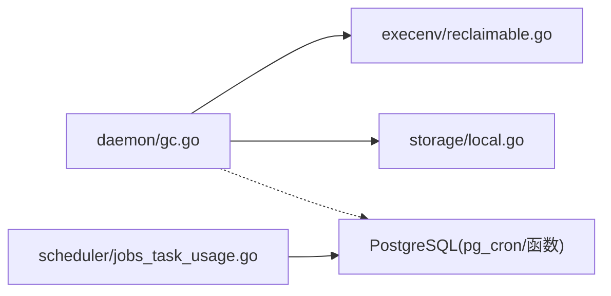

# 垃圾回收

<cite>
**本文引用的文件**
- [server/internal/daemon/gc.go](file://server/internal/daemon/gc.go)
- [server/internal/daemon/execenv/reclaimable.go](file://server/internal/daemon/execenv/reclaimable.go)
- [server/internal/scheduler/jobs_task_usage.go](file://server/internal/scheduler/jobs_task_usage.go)
- [server/internal/storage/local.go](file://server/internal/storage/local.go)
- [server/migrations/243_workspace_teardown_dirty_trigger_guard.up.sql](file://server/migrations/243_workspace_teardown_dirty_trigger_guard.up.sql)
- [server/migrations/076_task_usage_pgcron_extension.up.sql](file://server/migrations/076_task_usage_pgcron_extension.up.sql)
- [apps/docs/content/docs/troubleshooting.mdx](file://apps/docs/content/docs/troubleshooting.mdx)
- [.github/workflows/ci.yml](file://.github/workflows/ci.yml)
</cite>

## 目录
1. [简介](#简介)
2. [项目结构](#项目结构)
3. [核心组件](#核心组件)
4. [架构总览](#架构总览)
5. [详细组件分析](#详细组件分析)
6. [依赖关系分析](#依赖关系分析)
7. [性能考虑](#性能考虑)
8. [故障排查指南](#故障排查指南)
9. [结论](#结论)
10. [附录](#附录)

## 简介
本文件系统性阐述 Multica 后端的垃圾回收（GC）机制，覆盖触发方式、资源类型与策略、算法与实现要点、安全性保证、性能优化以及监控与调优建议。重点包括：
- 定时扫描与阈值触发的回收集合
- 事件驱动的回放与归档（任务使用量汇总）
- 不同类型资源的回收策略：临时文件清理、工作目录回收、数据库记录归档、内存对象释放
- 回收算法的应用场景：引用计数、标记清除、分代回收
- 数据一致性检查、回滚机制与故障恢复
- 增量回收、并行处理与资源预分配等优化手段
- 监控指标与调优建议

## 项目结构
后端采用 Go + Chi + sqlc + gorilla/websocket，数据库为 PostgreSQL 17。守护进程负责智能体任务的执行环境装配与生命周期管理，其中包含完整的本地磁盘与工作目录回收逻辑；调度器负责周期性任务（如任务用量小时级汇总）；存储层提供本地与远端两种上传/删除能力，并内置原子写入与临时文件清理。

图表来源
- [server/internal/daemon/gc.go:25-61](file://server/internal/daemon/gc.go#L25-L61)
- [server/internal/daemon/execenv/reclaimable.go:5-16](file://server/internal/daemon/execenv/reclaimable.go#L5-L16)
- [server/internal/scheduler/jobs_task_usage.go:15-56](file://server/internal/scheduler/jobs_task_usage.go#L15-L56)
- [server/internal/storage/local.go:196-246](file://server/internal/storage/local.go#L196-L246)
- [server/migrations/076_task_usage_pgcron_extension.up.sql:1-31](file://server/migrations/076_task_usage_pgcron_extension.up.sql#L1-L31)

章节来源
- [server/internal/daemon/gc.go:25-61](file://server/internal/daemon/gc.go#L25-L61)
- [server/internal/scheduler/jobs_task_usage.go:15-56](file://server/internal/scheduler/jobs_task_usage.go#L15-L56)
- [server/internal/storage/local.go:196-246](file://server/internal/storage/local.go#L196-L246)
- [server/migrations/076_task_usage_pgcron_extension.up.sql:1-31](file://server/migrations/076_task_usage_pgcron_extension.up.sql#L1-L31)

## 核心组件
- 守护进程 GC 循环：按配置间隔启动，首次延迟运行一次，随后周期性扫描工作区根目录，对任务目录、仓库缓存、会话存储、任务临时目录、稳定根索引等进行回收。
- 任务目录决策：基于元数据（kind、issue/chat/autopilot/quick-create 标识）、父记录状态（通过服务端 GC 检查接口）、完成时间与 TTL 决定“跳过/清理/仅清理制品/孤儿清理”。
- 可回收制品子路径：daemon 管理的可再生制品（如 Codex sandbox-bin）在任务完成后按 TTL 清理，避免无限增长。
- 调度器任务用量汇总：每 5 分钟尝试执行小时级汇总，内部通过 SQL 函数与 advisory lock 保证并发安全，结合水位线推进历史。
- 本地存储原子写入与临时文件清理：上传使用临时文件+重命名，崩溃残留可通过确定性临时文件名被删除路径回收。

章节来源
- [server/internal/daemon/gc.go:83-193](file://server/internal/daemon/gc.go#L83-L193)
- [server/internal/daemon/gc.go:401-528](file://server/internal/daemon/gc.go#L401-L528)
- [server/internal/daemon/execenv/reclaimable.go:5-16](file://server/internal/daemon/execenv/reclaimable.go#L5-L16)
- [server/internal/scheduler/jobs_task_usage.go:15-56](file://server/internal/scheduler/jobs_task_usage.go#L15-L56)
- [server/internal/storage/local.go:196-246](file://server/internal/storage/local.go#L196-L246)

## 架构总览
GC 由守护进程以定时器驱动，遍历工作区根下的每个任务目录，读取 .gc_meta.json 并结合服务端 GC 检查接口判定是否可回收。同时，独立模块清理跨工作区的共享资源（仓库缓存、Codex/Hermes 会话存储、任务临时目录、稳定根索引）。调度器负责数据库侧的用量汇总，确保统计数据的及时性与幂等性。

图表来源
- [server/internal/daemon/gc.go:25-61](file://server/internal/daemon/gc.go#L25-L61)
- [server/internal/daemon/gc.go:83-193](file://server/internal/daemon/gc.go#L83-L193)
- [server/internal/daemon/gc.go:401-528](file://server/internal/daemon/gc.go#L401-L528)
- [server/internal/storage/local.go:196-246](file://server/internal/storage/local.go#L196-L246)

## 详细组件分析

### 触发机制：定时扫描、阈值触发与事件驱动
- 定时扫描：守护进程启动后延迟 30 秒执行一次，随后按 GCInterval 周期执行 runGC。
- 阈值触发：依据 GCTTL、GCCompletedTaskTTL、GCOrphanTTL、GCArtifactTTL、GCHermesMemoryTTL、GCHermesSessionTTL、GCCodexSessionTTL 等阈值进行回收判定。
- 事件驱动：数据库侧通过 pg_cron 或内置调度器定期执行 rollup_task_usage_hourly，结合水位线与 advisory lock 推进汇总；工作区拆除时通过触发器将脏键入队，用于后续用量聚合。

图表来源
- [server/internal/daemon/gc.go:25-61](file://server/internal/daemon/gc.go#L25-L61)
- [server/internal/daemon/gc.go:83-193](file://server/internal/daemon/gc.go#L83-L193)
- [server/migrations/076_task_usage_pgcron_extension.up.sql:1-31](file://server/migrations/076_task_usage_pgcron_extension.up.sql#L1-L31)
- [server/migrations/243_workspace_teardown_dirty_trigger_guard.up.sql:1-25](file://server/migrations/243_workspace_teardown_dirty_trigger_guard.up.sql#L1-L25)

章节来源
- [server/internal/daemon/gc.go:25-61](file://server/internal/daemon/gc.go#L25-L61)
- [server/internal/daemon/gc.go:83-193](file://server/internal/daemon/gc.go#L83-L193)
- [server/migrations/076_task_usage_pgcron_extension.up.sql:1-31](file://server/migrations/076_task_usage_pgcron_extension.up.sql#L1-L31)
- [server/migrations/243_workspace_teardown_dirty_trigger_guard.up.sql:1-25](file://server/migrations/243_workspace_teardown_dirty_trigger_guard.up.sql#L1-L25)

### 资源类型与回收策略
- 工作目录回收（envRoot）：
  - Issue/Chat/Autopilot/QuickCreate 等任务类型分别根据父记录状态与完成时间决定是否全量清理。
  - 本地目录任务（LocalDirectory）默认保留 envRoot，仅允许制品级清理，避免破坏用户审计轨迹。
- 制品清理（Regenerable Artifacts）：
  - daemon 管理的可再生制品（如 codex-home/.sandbox-bin）在任务完成后超过 GCArtifactTTL 即清理，降低长期驻留成本。
- 会话存储回收：
  - Codex 会话存储、Hermes 记忆存储、Hermes 会话存储各自有独立 TTL，超出阈值后批量清理。
- 仓库缓存回收：
  - 清理裸仓缓存中失效的 worktree 引用，并驱逐不再需要的缓存。
- 任务临时目录回收：
  - 基于内核锁（.task_lock）判断拥有者进程是否仍持有句柄，避免误删；Windows 下需容忍共享冲突并在下次周期回收。
- 稳定根索引回收：
  - 清理未发布的稳定根记录与废弃条目，结合服务端任务终态检查。
- 上传临时文件清理：
  - 本地存储使用确定性临时文件名（.<key>.tmp），删除路径会一并清理，防止崩溃残留。

章节来源
- [server/internal/daemon/gc.go:195-374](file://server/internal/daemon/gc.go#L195-L374)
- [server/internal/daemon/gc.go:429-508](file://server/internal/daemon/gc.go#L429-L508)
- [server/internal/daemon/gc.go:554-653](file://server/internal/daemon/gc.go#L554-L653)
- [server/internal/daemon/gc.go:683-739](file://server/internal/daemon/gc.go#L683-L739)
- [server/internal/daemon/gc.go:741-794](file://server/internal/daemon/gc.go#L741-L794)
- [server/internal/daemon/execenv/reclaimable.go:5-16](file://server/internal/daemon/execenv/reclaimable.go#L5-L16)
- [server/internal/storage/local.go:196-246](file://server/internal/storage/local.go#L196-L246)
- [.github/workflows/ci.yml:761-773](file://.github/workflows/ci.yml#L761-L773)

### 回收算法与应用场景
- 引用计数：适用于会话存储与制品的生命周期管理，当引用归零且超过 TTL 时回收。
- 标记清除：用于工作区目录与仓库缓存的可达性判定，结合父记录状态与 mtime 标记可回收集合。
- 分代回收：不同资源采用不同 TTL（短期制品 vs 长期记忆存储），体现“新生代”快速回收、“老年代”长保的策略。

章节来源
- [server/internal/daemon/gc.go:429-508](file://server/internal/daemon/gc.go#L429-L508)
- [server/internal/daemon/gc.go:554-653](file://server/internal/daemon/gc.go#L554-L653)
- [server/internal/daemon/gc.go:683-739](file://server/internal/daemon/gc.go#L683-L739)

### 安全性保证：一致性、回滚与恢复
- 所有权与并发保护：
  - 在执行任何删除前，先验证任务目录所有权并预留 envRoot，防止并发复用导致误删。
  - 对于活跃 envRoot 直接跳过，保障正在运行的任务不受影响。
- 幂等与容错：
  - 服务端 GC 检查失败时保守跳过，避免网络抖动导致误删。
  - 本地存储删除路径幂等，缺失文件视为成功；临时文件通过确定性名称可被回收。
- 数据库一致性：
  - 工作区拆除时通过触发器将脏键入队，避免在拆库事务内维护 per-row dirty-key 的开销。
  - 用量汇总通过 SQL 函数与 advisory lock 保证并发安全，水位线驱动历史推进。
- 故障恢复：
  - Windows 共享冲突场景下，GC 容忍失败并保留 .task_lock，待句柄关闭后下一周期再清理。
  - 本地存储崩溃残留的临时文件可在删除路径中被回收。

章节来源
- [server/internal/daemon/gc.go:319-374](file://server/internal/daemon/gc.go#L319-L374)
- [server/internal/daemon/gc.go:401-428](file://server/internal/daemon/gc.go#L401-L428)
- [server/migrations/243_workspace_teardown_dirty_trigger_guard.up.sql:1-25](file://server/migrations/243_workspace_teardown_dirty_trigger_guard.up.sql#L1-L25)
- [server/internal/scheduler/jobs_task_usage.go:58-101](file://server/internal/scheduler/jobs_task_usage.go#L58-L101)
- [.github/workflows/ci.yml:761-773](file://.github/workflows/ci.yml#L761-L773)
- [server/internal/storage/local.go:196-246](file://server/internal/storage/local.go#L196-L246)

### 性能优化：增量、并行与预分配
- 增量回收：
  - 按批次查询 issue GC 检查结果（issueGCBatchSize=500），减少单次请求压力。
  - 仅对超期制品进行精细清理，避免全量扫描带来的开销。
- 并行处理：
  - 守护进程对多个工作区与任务目录的遍历与清理具备上下文取消支持，便于扩展为并发执行。
  - 仓库缓存清理与多类存储清理相互独立，可并行化。
- 资源预分配：
  - 本地存储上传使用原子写入（临时文件+重命名），避免中间态损坏目标文件，提升可靠性。
  - 任务临时目录清理基于内核锁，避免重复尝试造成的系统调用风暴。

章节来源
- [server/internal/daemon/gc.go:255-317](file://server/internal/daemon/gc.go#L255-L317)
- [server/internal/storage/local.go:196-246](file://server/internal/storage/local.go#L196-L246)
- [server/internal/daemon/gc.go:161-174](file://server/internal/daemon/gc.go#L161-L174)

### 监控指标与调优建议
- 关键指标（单轮 GC 统计）：
  - cleaned/orphaned/skipped：任务目录清理、孤儿清理、跳过计数
  - artifact_dirs/artifact_removed：制品目录命中与移除数
  - stores_reclaimed/hermes_memory_stores_reclaimed/hermes_session_stores_reclaimed：各类会话存储回收数
  - repo_caches_reclaimed/task_temp_dirs_reclaimed/task_root_index_entries_reclaimed：仓库缓存、任务临时目录、稳定根索引回收数
  - bytes_reclaimed/by_pattern：回收字节与按模式统计
- 调优建议：
  - 合理设置各 TTL（GCTTL/GCCompletedTaskTTL/GCArtifactTTL/GCOrphanTTL 等），平衡空间占用与恢复成本。
  - 关注 by_pattern 分布，针对性调整制品匹配规则。
  - 若高频出现 skipped，检查活跃 envRoot 与所有权预留逻辑是否过于保守。
  - 针对 Windows 共享冲突，确认下一周期能正常回收，必要时延长重试间隔。

章节来源
- [server/internal/daemon/gc.go:63-81](file://server/internal/daemon/gc.go#L63-L81)
- [server/internal/daemon/gc.go:176-193](file://server/internal/daemon/gc.go#L176-L193)

## 依赖关系分析
- 守护进程 GC 依赖 execenv 提供的任务元数据读取、可回收制品路径、会话存储清理、任务临时目录清理、稳定根索引清理等能力。
- 调度器依赖数据库的 pg_cron 扩展与 SQL 函数，通过水位线与 advisory lock 实现安全的增量汇总。
- 存储层提供原子写入与删除能力，确保上传过程与崩溃恢复的一致性。

图表来源
- [server/internal/daemon/gc.go:83-193](file://server/internal/daemon/gc.go#L83-L193)
- [server/internal/daemon/execenv/reclaimable.go:5-16](file://server/internal/daemon/execenv/reclaimable.go#L5-L16)
- [server/internal/storage/local.go:196-246](file://server/internal/storage/local.go#L196-L246)
- [server/internal/scheduler/jobs_task_usage.go:15-56](file://server/internal/scheduler/jobs_task_usage.go#L15-L56)

章节来源
- [server/internal/daemon/gc.go:83-193](file://server/internal/daemon/gc.go#L83-L193)
- [server/internal/scheduler/jobs_task_usage.go:15-56](file://server/internal/scheduler/jobs_task_usage.go#L15-L56)
- [server/internal/storage/local.go:196-246](file://server/internal/storage/local.go#L196-L246)

## 性能考虑
- 批量化与节流：issue GC 检查分批进行，避免一次性大请求；各 TTL 控制回收频率与范围。
- 最小化 IO：优先读取轻量元数据（.gc_meta.json），仅在必要时访问深层目录。
- 幂等与重试：删除操作幂等，失败不阻塞后续周期；Windows 共享冲突容忍并在下一周期重试。
- 原子写入：上传使用临时文件+重命名，避免部分写入导致的文件损坏与额外清理成本。

[本节为通用指导，不直接分析具体文件]

## 故障排查指南
- 工作区拆除与脏键入队：
  - 若升级过程中遇到迁移阻塞，可参考文档手动执行小时级汇总或回填命令。
- 用量汇总调度：
  - 小时级汇总由后端内置调度器执行；若需手动验证，可调用对应 SQL 函数。
- Windows 任务临时目录回收：
  - CI 测试覆盖了真实共享冲突场景，确认 .task_lock 保留与下一周期回收行为。

章节来源
- [apps/docs/content/docs/troubleshooting.mdx:180-195](file://apps/docs/content/docs/troubleshooting.mdx#L180-L195)
- [.github/workflows/ci.yml:761-773](file://.github/workflows/ci.yml#L761-L773)

## 结论
Multica 的垃圾回收体系围绕守护进程的周期扫描与多种阈值策略构建，覆盖工作目录、制品、会话存储、仓库缓存、任务临时目录与稳定根索引等多类资源。通过所有权校验、并发预留、幂等删除与数据库侧的事件驱动汇总，系统在安全性与一致性方面具备充分保障。配合批量化、原子写入与平台差异兼容，GC 在高负载与复杂环境下仍能稳健运行。建议持续监控回收指标并按业务特征调优 TTL 与制品策略，以获得最佳的空间与性能平衡。

[本节为总结，不直接分析具体文件]

## 附录
- 配置项参考（示例）：
  - GCEnabled：是否启用 GC
  - GCInterval：扫描间隔
  - GCTTL：任务/会话完成后的清理阈值
  - GCCompletedTaskTTL：已完成任务的强制清理阈值
  - GCOrphanTTL：孤儿目录清理阈值
  - GCArtifactTTL：制品清理阈值
  - GCCodexSessionTTL/GCHermesMemoryTTL/GCHermesSessionTTL：各类会话存储 TTL
- 相关迁移与调度：
  - pg_cron 扩展启用与用量汇总调度
  - 工作区拆除时的触发器保护

章节来源
- [server/migrations/076_task_usage_pgcron_extension.up.sql:1-31](file://server/migrations/076_task_usage_pgcron_extension.up.sql#L1-L31)
- [server/migrations/243_workspace_teardown_dirty_trigger_guard.up.sql:1-25](file://server/migrations/243_workspace_teardown_dirty_trigger_guard.up.sql#L1-L25)