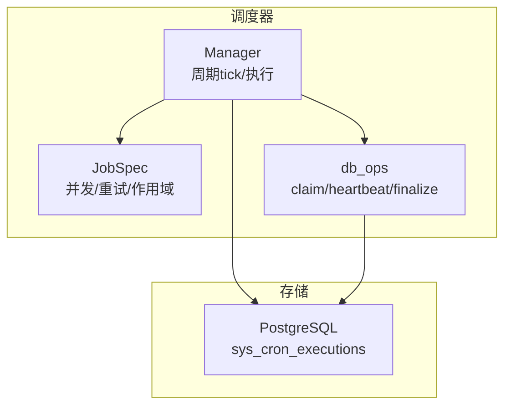
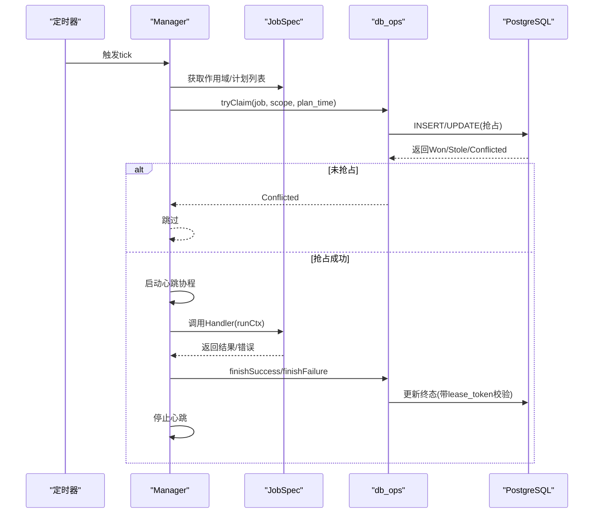
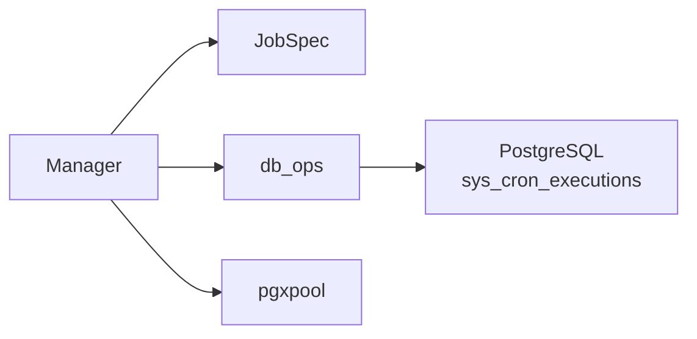

# 并发控制

<cite>
**本文引用的文件**
- [server/internal/scheduler/manager.go](file://server/internal/scheduler/manager.go)
- [server/internal/scheduler/spec.go](file://server/internal/scheduler/spec.go)
- [server/internal/scheduler/db_ops.go](file://server/internal/scheduler/db_ops.go)
- [apps/docs/content/docs/daemon-runtimes.mdx](file://apps/docs/content/docs/daemon-runtimes.mdx)
- [server/pkg/protocol/messages.go](file://server/pkg/protocol/messages.go)
</cite>

## 目录
1. [简介](#简介)
2. [项目结构](#项目结构)
3. [核心组件](#核心组件)
4. [架构总览](#架构总览)
5. [详细组件分析](#详细组件分析)
6. [依赖关系分析](#依赖关系分析)
7. [性能考虑](#性能考虑)
8. [故障排查指南](#故障排查指南)
9. [结论](#结论)
10. [附录](#附录)

## 简介
本文件聚焦于 Multica 后端的并发控制体系，覆盖全局并发限制、工作线程池与调度器、任务级并发与互斥、分布式锁机制（数据库级）、资源竞争处理策略（死锁检测、超时、降级）以及并发性能调优与问题诊断。系统通过“数据库-backed 执行记录表”实现跨进程/实例的分布式锁与审计，配合守护进程的本地并发上限，形成端到端的并发治理。

## 项目结构
与并发控制直接相关的后端代码集中在 scheduler 包：
- Manager：每进程调度器，周期性 tick 并驱动作业执行，维护心跳与失败重试。
- Spec：作业规格定义，包含并发与重试参数、作用域提供者、计划生成钩子等。
- db_ops：基于 PostgreSQL 的原子 claim/heartbeat/finalize 操作，提供分布式租约与状态机。

**图表来源**
- [server/internal/scheduler/manager.go:93-136](file://server/internal/scheduler/manager.go#L93-L136)
- [server/internal/scheduler/spec.go:99-192](file://server/internal/scheduler/spec.go#L99-L192)
- [server/internal/scheduler/db_ops.go:50-163](file://server/internal/scheduler/db_ops.go#L50-L163)

**章节来源**
- [server/internal/scheduler/manager.go:1-136](file://server/internal/scheduler/manager.go#L1-L136)
- [server/internal/scheduler/spec.go:1-192](file://server/internal/scheduler/spec.go#L1-L192)
- [server/internal/scheduler/db_ops.go:1-163](file://server/internal/scheduler/db_ops.go#L1-L163)

## 核心组件
- 全局并发限制与工作线程池
  - 守护进程默认最多同时运行固定数量的任务，每个智能体也有独立上限；实际并发取两者较小值。超出时新任务进入队列等待。
  - 可通过环境变量调整机器级上限，单智能体上限可在设置中配置。
- 调度器（Manager）
  - 每进程一个 Manager，按 TickInterval 唤醒，遍历已注册作业，计算待执行 plan_time 并尝试抢占（tryClaim）。
  - 对成功抢占的作业启动后台心跳协程，调用业务 Handler，并在完成后写入 SUCCESS/FAILED。
- 作业规格（JobSpec）
  - 定义 Cadence、CatchUpMode、MaxPlansPerTick、RunTimeout、StaleTimeout、HeartbeatInterval、AllowStaleReentry、MaxAttempts、RetryBackoff、Scopes、PlansForScope、Handler 等。
  - validate() 强制 RunTimeout < StaleTimeout、HeartbeatInterval < StaleTimeout 等不变式。
- 数据库分布式锁（db_ops）
  - tryClaim：先尝试 INSERT，冲突时再尝试 UPDATE 抢占（支持 FAILED 重试或 RUNNING 过期抢占），返回 Won/Stole/Conflicted。
  - heartbeat：周期性续租，若行被他人抢占则返回租约丢失错误。
  - finishSuccess/finishFailure：以 lease_token + RUNNING 为条件写终态，防止竞态覆盖。
  - markStaleAsFailed：非可重入作业在 tick 前将过期的 RUNNING 标记为 FAILED。

**章节来源**
- [apps/docs/content/docs/daemon-runtimes.mdx:70-75](file://apps/docs/content/docs/daemon-runtimes.mdx#L70-L75)
- [server/internal/scheduler/manager.go:93-136](file://server/internal/scheduler/manager.go#L93-L136)
- [server/internal/scheduler/spec.go:99-192](file://server/internal/scheduler/spec.go#L99-L192)
- [server/internal/scheduler/db_ops.go:50-163](file://server/internal/scheduler/db_ops.go#L50-L163)

## 架构总览
下图展示一次 tick 到任务执行的完整流程，包括分布式抢占、心跳续租、最终状态落库与失败重试。

**图表来源**
- [server/internal/scheduler/manager.go:121-136](file://server/internal/scheduler/manager.go#L121-L136)
- [server/internal/scheduler/manager.go:287-430](file://server/internal/scheduler/manager.go#L287-L430)
- [server/internal/scheduler/db_ops.go:50-163](file://server/internal/scheduler/db_ops.go#L50-L163)
- [server/internal/scheduler/db_ops.go:222-303](file://server/internal/scheduler/db_ops.go#L222-L303)

## 详细组件分析

### 全局并发限制与动态调整
- 守护进程级上限：默认每台守护进程最多同时运行固定数量任务；每个智能体有独立上限；有效并发为两者较小值。
- 动态调整：
  - 机器级上限通过环境变量调整。
  - 单智能体上限可在设置中调整。
- 排队行为：达到上限后新任务继续排队，直到有空闲槽位。

**章节来源**
- [apps/docs/content/docs/daemon-runtimes.mdx:70-75](file://apps/docs/content/docs/daemon-runtimes.mdx#L70-L75)

### 任务级并发控制与互斥
- 作用域（Scope）：用于限定锁粒度。全局作业使用 ScopeGlobal 锁定整个数据库范围；分片作业可按 shard 划分作用域。
- 计划粒度（plan_time）：以 Cadence 对齐的时间桶作为并发单元，同一 (job, scope, plan_time) 仅一个实例能抢占成功。
- 抢占与互斥：
  - tryClaim 保证唯一性：INSERT 冲突后走 UPDATE 抢占分支，支持 FAILED 重试与 RUNNING 过期抢占。
  - 非可重入作业（AllowStaleReentry=false）不允许抢占其他实例的 RUNNING，过期后由扫描器标记为 FAILED。
- 捕获模式（CatchUpMode）：
  - latest_only：仅追赶最新一桶。
  - every_plan：按时间顺序回放多桶，受 MaxPlansPerTick 与 CatchUpWindow 限制。

**章节来源**
- [server/internal/scheduler/spec.go:23-69](file://server/internal/scheduler/spec.go#L23-L69)
- [server/internal/scheduler/spec.go:102-192](file://server/internal/scheduler/spec.go#L102-L192)
- [server/internal/scheduler/db_ops.go:50-163](file://server/internal/scheduler/db_ops.go#L50-L163)

### 分布式锁机制
- 数据库级锁（推荐）：通过 sys_cron_executions 表的唯一约束与原子 SQL 实现分布式租约，天然具备幂等与审计能力。
- Redis 分布式锁：当前代码路径未见直接使用；如需扩展，建议以数据库锁为主，Redis 作为可选加速层（例如热点 key 的轻量预检），但必须以数据库为准。
- 内存锁：仅适用于单进程内临界区保护（如 Manager 内部注册表访问），不用于跨进程协调。

**章节来源**
- [server/internal/scheduler/db_ops.go:50-163](file://server/internal/scheduler/db_ops.go#L50-L163)
- [server/internal/scheduler/manager.go:64-91](file://server/internal/scheduler/manager.go#L64-L91)

### 资源竞争处理策略
- 死锁检测：调度器避免嵌套锁，所有关键路径通过单一数据库表原子操作完成；心跳与终态写入均以 lease_token 保护，降低循环等待风险。
- 超时处理：
  - RunTimeout：限制单个 Handler 的执行时长。
  - StaleTimeout：心跳间隔必须小于该值；超过 stale_after 且允许重入时可被抢占，否则标记为 FAILED。
- 优雅降级：
  - 抢占失败（Conflicted）静默跳过，不影响整体吞吐。
  - 心跳丢失或终态写入被抢占时，忽略后续写入，避免重复执行。
  - 非可重入作业过期后转为 FAILED，需人工修复或重试策略兜底。

**章节来源**
- [server/internal/scheduler/spec.go:131-148](file://server/internal/scheduler/spec.go#L131-L148)
- [server/internal/scheduler/manager.go:319-430](file://server/internal/scheduler/manager.go#L319-L430)
- [server/internal/scheduler/db_ops.go:165-189](file://server/internal/scheduler/db_ops.go#L165-L189)

### 并发性能调优
- 连接池配置
  - 使用 pgxpool 连接数据库；合理设置最大连接数与空闲连接数以匹配并发度与 QPS。
  - 心跳与终态写入均为短事务，注意批量与超时配置，避免连接耗尽。
- Goroutine 管理
  - 每个抢占成功的作业会启动一个心跳协程；确保上下文及时取消，避免泄漏。
  - 长任务应定期调用 Heartbeat，保持租约活跃。
- 内存使用优化
  - HandlerResult.Result 字段需保持小体积（内部有长度限制），大对象应落日志而非结果集。
  - 避免在 Handler 中持有大对象引用过久，减少 GC 压力。
- 计划批大小
  - MaxPlansPerTick 控制单次 tick 的最大计划数，防止突发积压导致雪崩。
  - CatchUpWindow 限制回放窗口，避免长时间停机后的集中回放。

**章节来源**
- [server/internal/scheduler/spec.go:121-133](file://server/internal/scheduler/spec.go#L121-L133)
- [server/internal/scheduler/db_ops.go:305-322](file://server/internal/scheduler/db_ops.go#L305-L322)
- [server/internal/scheduler/manager.go:432-462](file://server/internal/scheduler/manager.go#L432-L462)

### 并发问题的诊断与排查
- 常见问题定位
  - 抢占失败：检查是否已被其他实例抢占或已达终态；关注 Conflicted 场景。
  - 租约丢失：心跳或终态写入返回 ErrLeaseLost，说明被抢占或已完成，应停止后续逻辑。
  - 超时与重试：根据 error_code 区分 run_timeout、canceled、lease_lost、handler_panic 等。
- 监控指标
  - 利用审计行中的 duration_ms、error_code、next_retry_at 等字段评估作业健康度与重试情况。
  - 观察 stale  RUNNING 数量，确认 AllowStaleReentry 配置是否合理。
- 排障步骤
  - 查看最近一次 plan_time 的状态与 attempt 计数。
  - 核对 RunTimeout、StaleTimeout、HeartbeatInterval 的相对关系是否符合约束。
  - 检查数据库连接池与慢查询，排除外部瓶颈。

**章节来源**
- [server/internal/scheduler/db_ops.go:17-27](file://server/internal/scheduler/db_ops.go#L17-L27)
- [server/internal/scheduler/db_ops.go:191-220](file://server/internal/scheduler/db_ops.go#L191-L220)
- [server/internal/scheduler/manager.go:464-490](file://server/internal/scheduler/manager.go#L464-L490)

## 依赖关系分析

**图表来源**
- [server/internal/scheduler/manager.go:1-62](file://server/internal/scheduler/manager.go#L1-L62)
- [server/internal/scheduler/db_ops.go:1-37](file://server/internal/scheduler/db_ops.go#L1-L37)

**章节来源**
- [server/internal/scheduler/manager.go:1-62](file://server/internal/scheduler/manager.go#L1-L62)
- [server/internal/scheduler/db_ops.go:1-37](file://server/internal/scheduler/db_ops.go#L1-L37)

## 性能考虑
- 将 RunTimeout 设置为远小于 StaleTimeout，确保心跳能在超时前多次续租。
- HeartbeatInterval 应显著小于 StaleTimeout，避免频繁抖动。
- 合理设置 MaxPlansPerTick 与 CatchUpWindow，平衡回放速度与稳定性。
- 对 Handler 进行限流与背压，避免下游资源（工具账户配额、磁盘 IO）过载。
- 使用数据库时间（dbNow）作为统一时钟源，避免多实例时钟漂移导致的计划错位。

[本节为通用指导，不直接分析具体文件]

## 故障排查指南
- 现象：任务长期 RUNNING 无进展
  - 检查心跳是否正常；若心跳丢失，可能被标记为 FAILED 或被抢占。
  - 核对 AllowStaleReentry 配置；非可重入作业过期后会转 FAILED。
- 现象：任务频繁失败并重试
  - 查看 error_code 与 next_retry_at；若是 run_timeout，考虑增大 RunTimeout 或优化 Handler。
  - 若是 handler_error，检查业务异常与日志。
- 现象：抢占冲突高
  - 检查作用域设计是否过粗；必要时拆分 Scope 以降低竞争。
  - 调整 Cadence 与 CatchUpMode，避免过多历史计划堆积。

**章节来源**
- [server/internal/scheduler/db_ops.go:165-189](file://server/internal/scheduler/db_ops.go#L165-L189)
- [server/internal/scheduler/manager.go:319-430](file://server/internal/scheduler/manager.go#L319-L430)

## 结论
Multica 的并发控制以“数据库-backed 执行记录表”为核心，实现了跨进程/实例的分布式锁、心跳续租与审计追踪；结合守护进程的本地并发上限与作用域/计划粒度的细粒度控制，既保证了正确性，又具备良好的可扩展性与可观测性。通过合理的超时、重试与回压策略，系统能够在资源受限与高并发场景下保持稳定运行。

[本节为总结，不直接分析具体文件]

## 附录
- RPC 超时提示：服务端对 daemon→server 的 RPC 请求支持 TimeoutMs，用于在服务端侧对慢请求做边界控制，避免客户端超时后仍提交结果。
- 守护进程并发上限与环境变量：详见守护进程文档中的并发限制段落。

**章节来源**
- [server/pkg/protocol/messages.go:70-84](file://server/pkg/protocol/messages.go#L70-L84)
- [apps/docs/content/docs/daemon-runtimes.mdx:70-75](file://apps/docs/content/docs/daemon-runtimes.mdx#L70-L75)