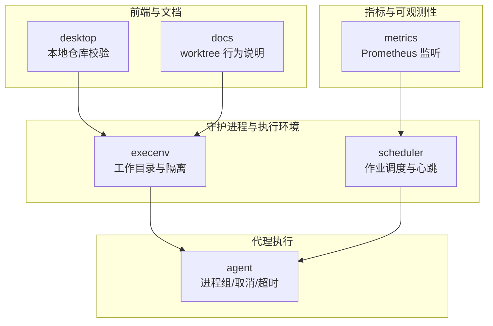
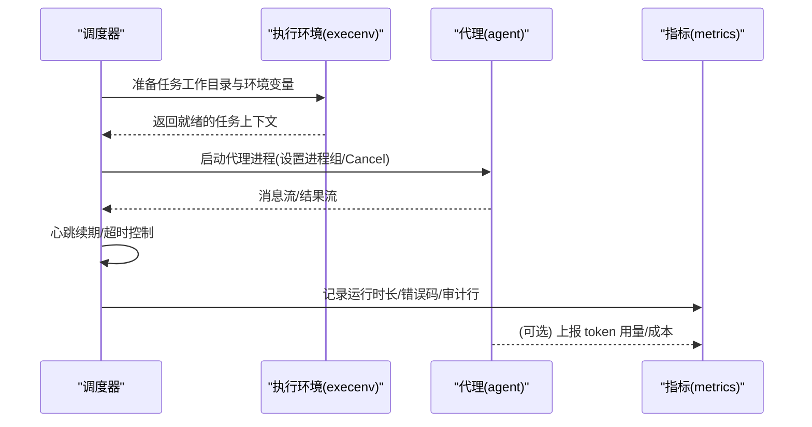
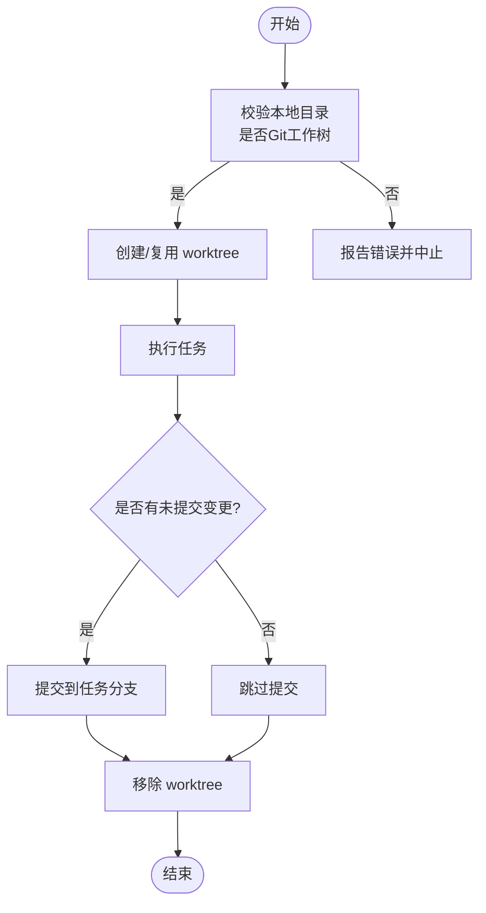
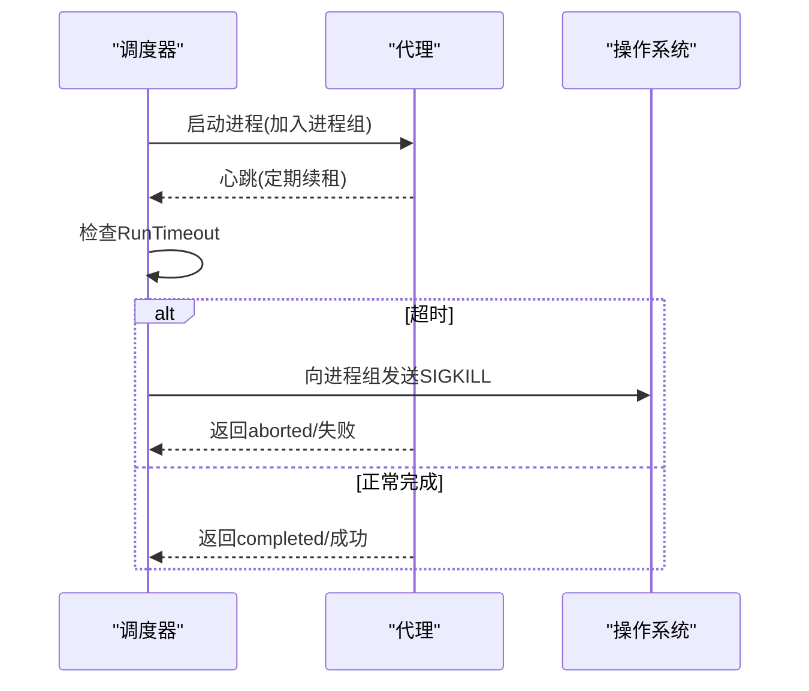
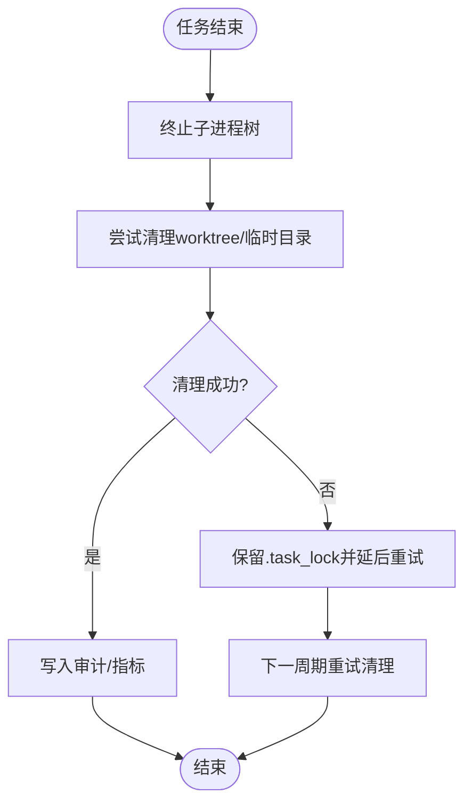
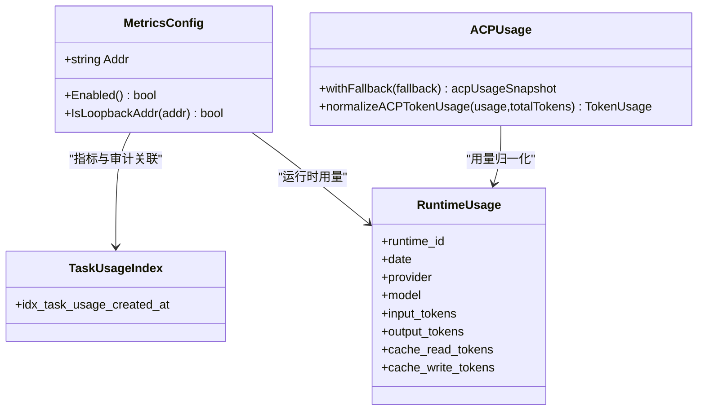
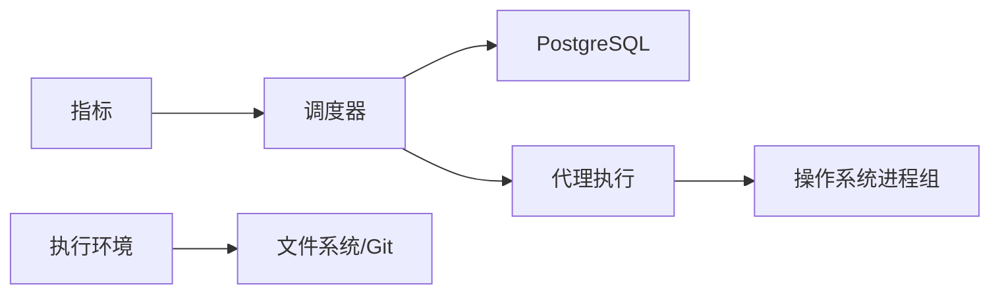

# 资源管理

<cite>
**本文引用的文件**
- [server/internal/daemon/execenv/codex_memory.go](file://server/internal/daemon/execenv/codex_memory.go)
- [server/internal/metrics/config.go](file://server/internal/metrics/config.go)
- [server/internal/scheduler/manager.go](file://server/internal/scheduler/manager.go)
- [server/pkg/agent/launch.go](file://server/pkg/agent/launch.go)
- [apps/desktop/src/main/local-directory.ts](file://apps/desktop/src/main/local-directory.ts)
- [apps/docs/content/docs/project-resources.mdx](file://apps/docs/content/docs/project-resources.mdx)
- [server/migrations/075_task_usage_created_at_index.up.sql](file://server/migrations/075_task_usage_created_at_index.up.sql)
- [server/migrations/046_drop_runtime_usage.down.sql](file://server/migrations/046_drop_runtime_usage.down.sql)
- [server/pkg/agent/acp_usage.go](file://server/pkg/agent/acp_usage.go)
- [apps/desktop/scripts/worktree-dev-env.test.mjs](file://apps/desktop/scripts/worktree-dev-env.test.mjs)
</cite>

## 目录
1. [简介](#简介)
2. [项目结构](#项目结构)
3. [核心组件](#核心组件)
4. [架构总览](#架构总览)
5. [详细组件分析](#详细组件分析)
6. [依赖关系分析](#依赖关系分析)
7. [性能考量](#性能考量)
8. [故障排查指南](#故障排查指南)
9. [结论](#结论)
10. [附录](#附录)

## 简介
本文件聚焦任务执行过程中的资源管理与监控，覆盖以下方面：
- CPU、内存与磁盘空间的实时监控指标与采集点
- 工作目录管理：git worktree 的创建、复用与清理策略
- 临时文件管理：构建缓存、日志与中间结果的存储与清理
- 进程资源限制：并发控制、内存上限与超时处理
- 资源回收机制：垃圾回收触发条件、回收策略与释放顺序
- 监控指标与性能分析工具的配置与使用

## 项目结构
资源管理相关代码主要分布在服务端守护进程（daemon）与调度器（scheduler）、代理执行层（agent）以及前端桌面端与工作区脚本中。关键路径如下：
- 守护进程执行环境：server/internal/daemon/execenv
- 调度器与作业生命周期：server/internal/scheduler
- 代理执行与进程组管理：server/pkg/agent
- 指标暴露配置：server/internal/metrics
- 桌面端本地仓库校验：apps/desktop/src/main/local-directory.ts
- 文档与迁移：apps/docs 与 server/migrations

图表来源
- [server/internal/daemon/execenv/codex_memory.go:1-344](file://server/internal/daemon/execenv/codex_memory.go#L1-L344)
- [server/internal/scheduler/manager.go:93-490](file://server/internal/scheduler/manager.go#L93-L490)
- [server/pkg/agent/launch.go:117-140](file://server/pkg/agent/launch.go#L117-L140)
- [server/internal/metrics/config.go:1-36](file://server/internal/metrics/config.go#L1-L36)
- [apps/desktop/src/main/local-directory.ts:38-92](file://apps/desktop/src/main/local-directory.ts#L38-L92)
- [apps/docs/content/docs/project-resources.mdx:86-87](file://apps/docs/content/docs/project-resources.mdx#L86-L87)

章节来源
- [server/internal/daemon/execenv/codex_memory.go:1-344](file://server/internal/daemon/execenv/codex_memory.go#L1-L344)
- [server/internal/scheduler/manager.go:93-490](file://server/internal/scheduler/manager.go#L93-L490)
- [server/pkg/agent/launch.go:117-140](file://server/pkg/agent/launch.go#L117-L140)
- [server/internal/metrics/config.go:1-36](file://server/internal/metrics/config.go#L1-L36)
- [apps/desktop/src/main/local-directory.ts:38-92](file://apps/desktop/src/main/local-directory.ts#L38-L92)
- [apps/docs/content/docs/project-resources.mdx:86-87](file://apps/docs/content/docs/project-resources.mdx#L86-L87)

## 核心组件
- 执行环境与隔离：通过 execenv 为每个任务准备独立的工作目录与运行时环境，并注入受控配置以禁用可能跨任务泄漏的 Codex 原生记忆子系统。
- 调度器：负责任务计划、租约获取、心跳续期、失败重试与审计记录，提供运行超时与最大尝试次数等安全边界。
- 代理执行：统一设置进程组与取消策略，确保任务取消时能终止整个子进程树；支持优雅关闭的后端自定义 Cancel。
- 指标与可观测性：通过环境变量启用 Prometheus 指标监听，并提供回环地址检测能力。
- 工作目录与仓库：桌面端校验本地目录是否为 Git 工作树；文档明确 worktree 的提交、分支保留与清理策略。

章节来源
- [server/internal/daemon/execenv/codex_memory.go:1-344](file://server/internal/daemon/execenv/codex_memory.go#L1-L344)
- [server/internal/scheduler/manager.go:93-490](file://server/internal/scheduler/manager.go#L93-L490)
- [server/pkg/agent/launch.go:117-140](file://server/pkg/agent/launch.go#L117-L140)
- [server/internal/metrics/config.go:1-36](file://server/internal/metrics/config.go#L1-L36)
- [apps/desktop/src/main/local-directory.ts:38-92](file://apps/desktop/src/main/local-directory.ts#L38-L92)
- [apps/docs/content/docs/project-resources.mdx:86-87](file://apps/docs/content/docs/project-resources.mdx#L86-L87)

## 架构总览
下图展示了从调度到执行再到指标采集的关键流程，包括任务上下文装配、进程组管理、心跳与超时、以及指标暴露。

图表来源
- [server/internal/scheduler/manager.go:287-430](file://server/internal/scheduler/manager.go#L287-L430)
- [server/pkg/agent/launch.go:117-140](file://server/pkg/agent/launch.go#L117-L140)
- [server/internal/metrics/config.go:13-19](file://server/internal/metrics/config.go#L13-L19)
- [server/pkg/agent/acp_usage.go:112-137](file://server/pkg/agent/acp_usage.go#L112-L137)

## 详细组件分析

### 工作目录与 git worktree 管理
- 工作目录隔离：每个任务在 WorkspacesRoot 下拥有独立的 env root，代码从共享裸缓存 checkout 出 git worktree，避免污染用户工作区。
- 复用策略：同一 (agent, issue) 的多轮通过 PriorWorkDir 复用同一 workdir，减少重复 checkout。
- 清理策略：
  - 任务结束后，未提交的变更会被提交到对应分支后再移除 worktree。
  - 若无法提交（例如 GPG 签名不可用），worktree 会刻意保留以便排查。
  - 无变更的任务不会留下空分支，除非该分支承载了历史工作。
- 本地仓库校验：桌面端在启动前校验目标路径为绝对路径、可读可写且位于 Git 工作树下。

图表来源
- [apps/desktop/src/main/local-directory.ts:38-92](file://apps/desktop/src/main/local-directory.ts#L38-L92)
- [apps/docs/content/docs/project-resources.mdx:86-87](file://apps/docs/content/docs/project-resources.mdx#L86-L87)

章节来源
- [apps/desktop/src/main/local-directory.ts:38-92](file://apps/desktop/src/main/local-directory.ts#L38-L92)
- [apps/docs/content/docs/project-resources.mdx:86-87](file://apps/docs/content/docs/project-resources.mdx#L86-L87)

### 临时文件与缓存管理
- 构建缓存与中间结果：基于共享裸缓存 .repos 进行代码 checkout，减少磁盘与网络开销；任务级临时目录由执行环境管理，并在任务完成后按策略清理。
- 日志与审计：调度器将每次执行的耗时、错误码与审计信息持久化，便于回溯与性能分析。
- 清理健壮性：CI 测试覆盖了 Windows 下因句柄占用导致的删除失败场景，确保下次扫描能正确清理残留目录。

章节来源
- [server/internal/scheduler/manager.go:287-430](file://server/internal/scheduler/manager.go#L287-L430)
- [server/migrations/075_task_usage_created_at_index.up.sql:1-5](file://server/migrations/075_task_usage_created_at_index.up.sql#L1-L5)

### 进程资源限制与超时处理
- 进程组与取消：所有代理进程统一加入进程组，并在取消时向整个进程组发送 SIGKILL，避免子进程泄漏。
- 超时控制：
  - 调度器为每个作业设置 RunTimeout，并通过心跳续期保障长任务存活。
  - 代理侧 runContext 对正超时值施加硬截止；零或负超时将不强制截止时间，交由守护进程的闲置看门狗管理。
- 并发控制：通过 max_concurrent_tasks 等配置项限制同时运行的任务数，防止资源耗尽。

图表来源
- [server/pkg/agent/launch.go:117-140](file://server/pkg/agent/launch.go#L117-L140)
- [server/internal/scheduler/manager.go:339-375](file://server/internal/scheduler/manager.go#L339-L375)

章节来源
- [server/pkg/agent/launch.go:117-140](file://server/pkg/agent/launch.go#L117-L140)
- [server/internal/scheduler/manager.go:339-375](file://server/internal/scheduler/manager.go#L339-L375)

### 资源回收机制
- 触发条件：
  - 任务完成或失败后，清理 worktree 与任务临时目录。
  - 调度器周期性扫描并标记过期 RUNNING 租约为 FAILED，释放资源。
  - 当删除失败（如 Windows 句柄占用）时，保留锁标志，待下次周期再尝试清理。
- 回收策略：
  - 优先提交未保存变更，再移除 worktree。
  - 无变更的任务删除分支，避免脏分支残留。
  - 心跳丢失或租约被抢占时，立即停止后续操作并退出。
- 释放顺序：先停止子进程树，再清理文件系统对象，最后更新审计与指标。

图表来源
- [server/internal/scheduler/manager.go:146-176](file://server/internal/scheduler/manager.go#L146-L176)
- [server/internal/scheduler/manager.go:432-462](file://server/internal/scheduler/manager.go#L432-L462)
- [apps/docs/content/docs/project-resources.mdx:86-87](file://apps/docs/content/docs/project-resources.mdx#L86-L87)

章节来源
- [server/internal/scheduler/manager.go:146-176](file://server/internal/scheduler/manager.go#L146-L176)
- [server/internal/scheduler/manager.go:432-462](file://server/internal/scheduler/manager.go#L432-L462)
- [apps/docs/content/docs/project-resources.mdx:86-87](file://apps/docs/content/docs/project-resources.mdx#L86-L87)

### 监控指标与性能分析
- 指标暴露：通过 METRICS_ADDR 环境变量启用 Prometheus 指标监听；默认仅监听回环地址以确保安全。
- 任务用量统计：
  - 使用 task_usage 表记录任务级别的用量，并建立 created_at 索引以优化懒查询。
  - runtime_usage 表用于记录运行时维度用量（provider/model/token 等）。
- Token 用量归一化：ACP 用量在不同表示间进行合并与去重，避免缓存命中被重复计费。
- 开发端口与多实例：桌面端根据路径派生偏移量，为多个 worktree 分配互不冲突的渲染端口，便于并行调试。

图表来源
- [server/internal/metrics/config.go:1-36](file://server/internal/metrics/config.go#L1-L36)
- [server/migrations/075_task_usage_created_at_index.up.sql:1-5](file://server/migrations/075_task_usage_created_at_index.up.sql#L1-L5)
- [server/migrations/046_drop_runtime_usage.down.sql:1-16](file://server/migrations/046_drop_runtime_usage.down.sql#L1-L16)
- [server/pkg/agent/acp_usage.go:112-137](file://server/pkg/agent/acp_usage.go#L112-L137)
- [server/pkg/agent/acp_usage.go:238-264](file://server/pkg/agent/acp_usage.go#L238-L264)
- [apps/desktop/scripts/worktree-dev-env.test.mjs:1-41](file://apps/desktop/scripts/worktree-dev-env.test.mjs#L1-L41)

章节来源
- [server/internal/metrics/config.go:1-36](file://server/internal/metrics/config.go#L1-L36)
- [server/migrations/075_task_usage_created_at_index.up.sql:1-5](file://server/migrations/075_task_usage_created_at_index.up.sql#L1-L5)
- [server/migrations/046_drop_runtime_usage.down.sql:1-16](file://server/migrations/046_drop_runtime_usage.down.sql#L1-L16)
- [server/pkg/agent/acp_usage.go:112-137](file://server/pkg/agent/acp_usage.go#L112-L137)
- [server/pkg/agent/acp_usage.go:238-264](file://server/pkg/agent/acp_usage.go#L238-L264)
- [apps/desktop/scripts/worktree-dev-env.test.mjs:1-41](file://apps/desktop/scripts/worktree-dev-env.test.mjs#L1-L41)

### 执行环境中的内存与上下文隔离
- 背景：Codex CLI 自带原生记忆子系统，可能在任务间或工作区之间泄漏上下文。
- 策略：在执行环境准备阶段，向 per-task config.toml 注入受管块，禁用 memories 特性与生成/消费开关，从而阻断泄漏路径。
- 用户可控：可通过环境变量开启原生记忆（接受泄漏风险），但默认关闭以保证隔离。

章节来源
- [server/internal/daemon/execenv/codex_memory.go:1-344](file://server/internal/daemon/execenv/codex_memory.go#L1-L344)

## 依赖关系分析
- 低耦合高内聚：
  - 调度器负责编排与审计，不直接操作文件系统；执行环境专注隔离与配置注入；代理层专注进程生命周期。
- 外部依赖：
  - PostgreSQL 用于调度租约、审计与用量统计。
  - Prometheus 用于指标暴露。
  - Git 用于 worktree 管理与版本隔离。
- 潜在循环依赖：未发现明显循环依赖；各模块通过接口与事件解耦。

图表来源
- [server/internal/scheduler/manager.go:93-490](file://server/internal/scheduler/manager.go#L93-L490)
- [server/internal/daemon/execenv/codex_memory.go:1-344](file://server/internal/daemon/execenv/codex_memory.go#L1-L344)
- [server/pkg/agent/launch.go:117-140](file://server/pkg/agent/launch.go#L117-L140)
- [server/internal/metrics/config.go:1-36](file://server/internal/metrics/config.go#L1-L36)

章节来源
- [server/internal/scheduler/manager.go:93-490](file://server/internal/scheduler/manager.go#L93-L490)
- [server/internal/daemon/execenv/codex_memory.go:1-344](file://server/internal/daemon/execenv/codex_memory.go#L1-L344)
- [server/pkg/agent/launch.go:117-140](file://server/pkg/agent/launch.go#L117-L140)
- [server/internal/metrics/config.go:1-36](file://server/internal/metrics/config.go#L1-L36)

## 性能考量
- 并发与吞吐：通过 max_concurrent_tasks 限制并发度，结合调度器的 catch-up 模式与最大计划数，避免雪崩。
- I/O 优化：共享裸缓存减少重复 clone；worktree 复用降低磁盘与网络压力。
- 指标采样：仅在回环地址暴露指标，降低对外暴露面；按需启用 Prometheus。
- 超时与心跳：合理设置 RunTimeout 与 HeartbeatInterval，平衡长任务稳定性与资源占用。

## 故障排查指南
- 任务卡死或进程泄漏：
  - 检查代理进程组与取消逻辑是否正确生效。
  - 确认调度器心跳是否正常续租，是否存在租约丢失。
- 磁盘空间不足：
  - 检查 worktree 与任务临时目录是否按策略清理。
  - 关注 Windows 句柄占用导致的删除失败，等待下一周期重试。
- 指标不可见：
  - 确认 METRICS_ADDR 已设置且为回环地址。
  - 验证 /health/realtime 保护令牌配置。
- 用量统计异常：
  - 核对 task_usage 与 runtime_usage 索引与数据一致性。
  - 检查 ACP 用量归一化逻辑是否生效。

章节来源
- [server/pkg/agent/launch.go:117-140](file://server/pkg/agent/launch.go#L117-L140)
- [server/internal/scheduler/manager.go:146-176](file://server/internal/scheduler/manager.go#L146-L176)
- [server/internal/metrics/config.go:13-19](file://server/internal/metrics/config.go#L13-L19)
- [server/migrations/075_task_usage_created_at_index.up.sql:1-5](file://server/migrations/075_task_usage_created_at_index.up.sql#L1-L5)
- [server/migrations/046_drop_runtime_usage.down.sql:1-16](file://server/migrations/046_drop_runtime_usage.down.sql#L1-L16)
- [server/pkg/agent/acp_usage.go:112-137](file://server/pkg/agent/acp_usage.go#L112-L137)

## 结论
本系统通过执行环境隔离、调度器编排、代理进程组管理与指标采集，构建了完整的资源管理与监控体系。工作目录采用 git worktree 实现强隔离与可追溯；临时文件与缓存遵循最小化与可清理原则；进程资源通过超时、心跳与并发控制得到保障；指标与审计为问题定位与性能优化提供了坚实基础。

## 附录
- 环境变量参考：
  - METRICS_ADDR：启用 Prometheus 指标监听
  - REALTIME_METRICS_TOKEN：保护实时健康端点
  - ANALYTICS_DISABLED/POSTHOG_*：分析传输控制
- 常用命令与脚本：
  - 工作区开发端口派生与冲突规避
  - 本地仓库校验与 Git 工作树识别

章节来源
- [server/internal/metrics/config.go:1-36](file://server/internal/metrics/config.go#L1-L36)
- [apps/desktop/scripts/worktree-dev-env.test.mjs:1-41](file://apps/desktop/scripts/worktree-dev-env.test.mjs#L1-L41)
- [apps/desktop/src/main/local-directory.ts:38-92](file://apps/desktop/src/main/local-directory.ts#L38-L92)