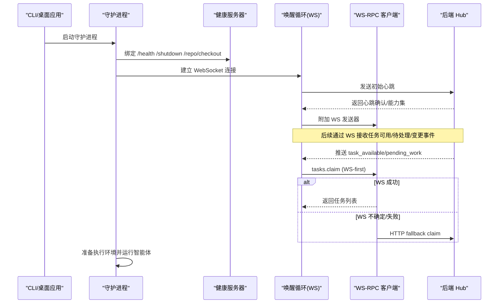
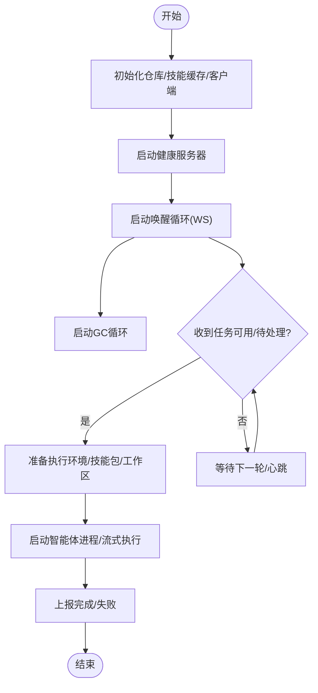
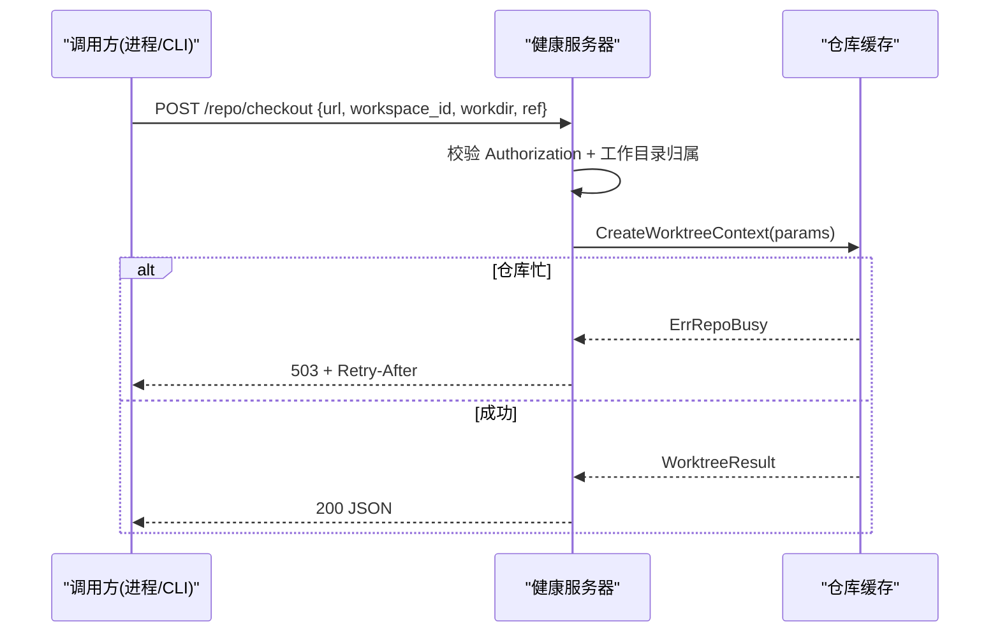
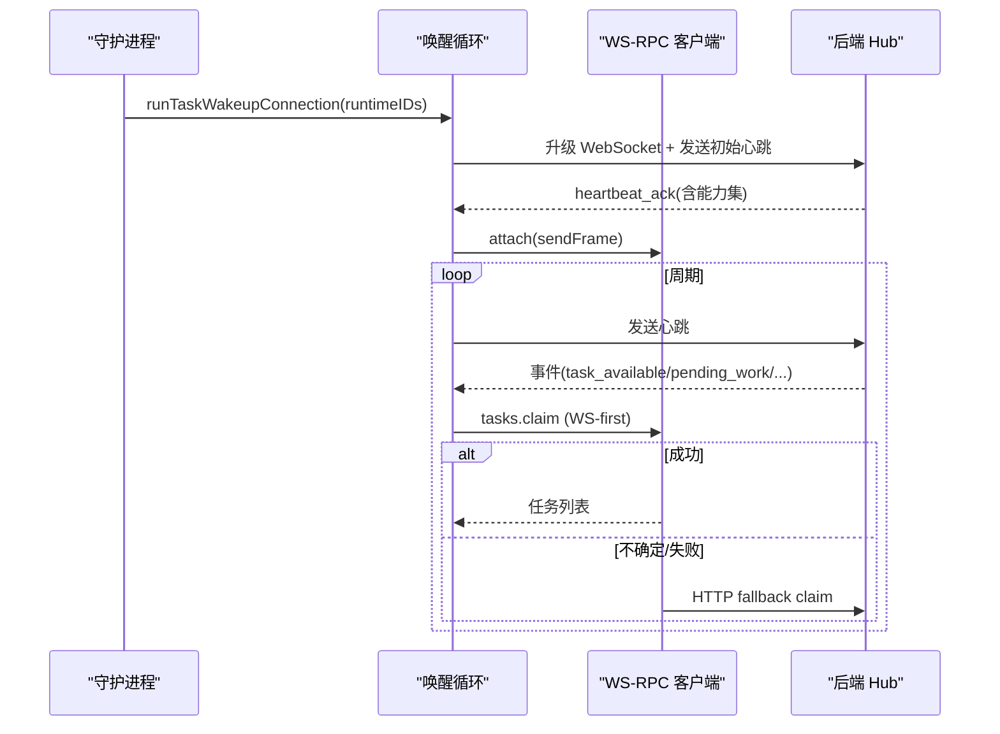
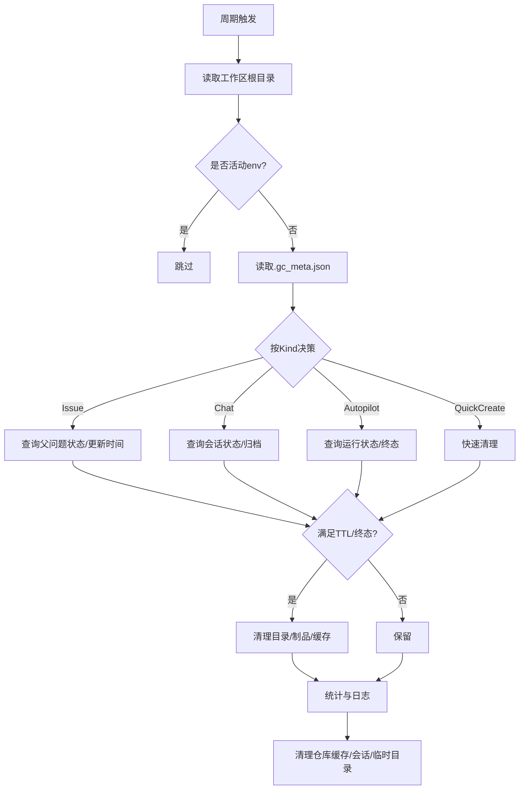
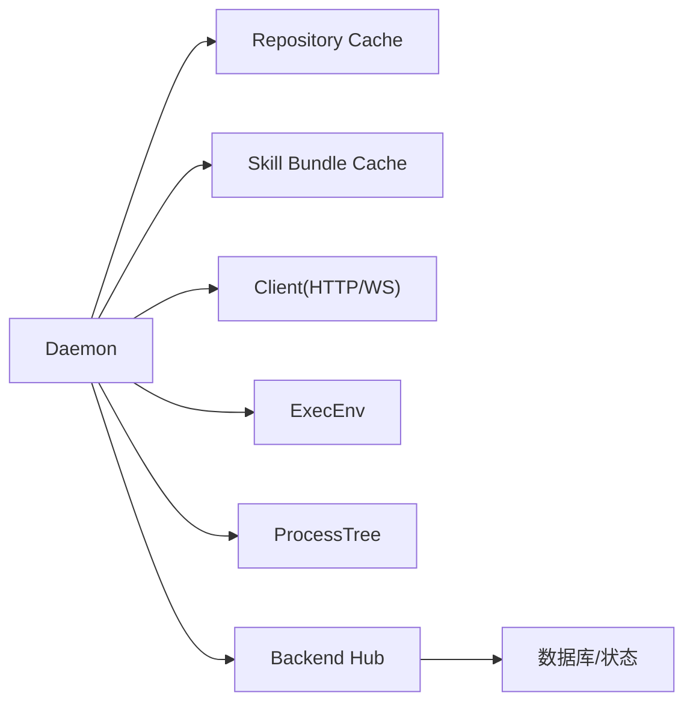

# 守护进程架构

<cite>
**本文引用的文件**
- [daemon.go](file://server/internal/daemon/daemon.go)
- [config.go](file://server/internal/daemon/config.go)
- [health.go](file://server/internal/daemon/health.go)
- [wsrpc.go](file://server/internal/daemon/wsrpc.go)
- [wakeup.go](file://server/internal/daemon/wakeup.go)
- [gc.go](file://server/internal/daemon/gc.go)
- [hub.go](file://server/internal/daemonws/hub.go)
- [CLI_AND_DAEMON.md](file://CLI_AND_DAEMON.md)
</cite>

## 目录
1. [简介](#简介)
2. [项目结构](#项目结构)
3. [核心组件](#核心组件)
4. [架构总览](#架构总览)
5. [详细组件分析](#详细组件分析)
6. [依赖关系分析](#依赖关系分析)
7. [性能与资源限制](#性能与资源限制)
8. [故障排查指南](#故障排查指南)
9. [结论](#结论)
10. [附录：配置与环境变量](#附录：配置与环境变量)

## 简介
本文件系统性阐述智能体系统中的本地守护进程（daemon）架构。守护进程作为本地执行环境的管理者，负责发现并注册可用的智能体运行时、与后端通过 WebSocket 和 HTTP 通信、调度任务执行、维护工作区与仓库缓存、执行垃圾回收与健康检查，并提供可观测性与运维能力。其目标是让智能体在本地安全、可靠、高效地执行任务，同时保持与后端的强一致状态。

## 项目结构
守护进程位于 server/internal/daemon 包，WebSocket 服务端逻辑位于 server/internal/daemonws 包。关键文件职责如下：
- daemon.go：守护进程主循环、任务调度、工作区与仓库缓存、健康端口、自动更新等。
- config.go：配置加载、环境变量解析、默认值策略。
- health.go：本地健康与关闭接口、仓库 checkout 鉴权与限流。
- wakeup.go：任务唤醒连接、心跳发送与处理、WS RPC 能力协商。
- wsrpc.go：基于 WebSocket 的通用 RPC 客户端（tasks.claim 等），含不确定结果回退策略。
- gc.go：周期性垃圾回收（任务目录、制品、仓库缓存、会话存储等）。
- hub.go：后端 Hub 管理守护进程连接、广播任务可用/待处理/变更事件、RPC 路由。

```mermaid
graph TB
subgraph "本地守护进程"
D["Daemon<br/>任务调度/注册/GC"]
WU["Wakeup Loop<br/>WS 连接/心跳"]
WR["WS-RPC Client<br/>tasks.claim 等"]
HC["Health Server<br/>/health /shutdown /repo/checkout"]
GC["GC Loop<br/>清理工作区/制品/缓存"]
end
subgraph "后端服务"
HUB["Hub<br/>WS 连接/广播/RPC 路由"]
API["HTTP API<br/>任务派发/状态/配置"]
end
D --> WU
D --> WR
D --> HC
D --> GC
WU < --> |WebSocket 帧| HUB
WR -.->|RPC over WS| HUB
D --> |HTTP| API
HUB --> |事件推送| WU
```

图表来源
- [daemon.go:373-686](file://server/internal/daemon/daemon.go#L373-L686)
- [wakeup.go:46-256](file://server/internal/daemon/wakeup.go#L46-L256)
- [wsrpc.go:84-387](file://server/internal/daemon/wsrpc.go#L84-L387)
- [health.go:86-398](file://server/internal/daemon/health.go#L86-L398)
- [gc.go:25-193](file://server/internal/daemon/gc.go#L25-L193)
- [hub.go:310-443](file://server/internal/daemonws/hub.go#L310-L443)

章节来源
- [daemon.go:373-686](file://server/internal/daemon/daemon.go#L373-L686)
- [config.go:100-648](file://server/internal/daemon/config.go#L100-L648)
- [health.go:86-398](file://server/internal/daemon/health.go#L86-L398)
- [wakeup.go:46-256](file://server/internal/daemon/wakeup.go#L46-L256)
- [wsrpc.go:84-387](file://server/internal/daemon/wsrpc.go#L84-L387)
- [gc.go:25-193](file://server/internal/daemon/gc.go#L25-L193)
- [hub.go:310-443](file://server/internal/daemonws/hub.go#L310-L443)

## 核心组件
- 守护进程主对象：维护工作区状态、运行时索引、版本探测、并发控制、自动更新、本地路径锁、仓库缓存、技能包缓存等。
- 配置系统：从环境变量、CLI 覆盖、配置文件加载，提供默认值与校验。
- 健康与关闭：本地 HTTP 暴露 /health、/shutdown、/repo/checkout，用于进程管理与任务内仓库访问。
- 唤醒与心跳：建立到后端的 WebSocket 控制通道，周期性发送心跳，接收任务可用/待处理/变更事件。
- WS-RPC：在 WebSocket 上复用请求/响应 RPC（如 tasks.claim），具备不确定结果的安全回退到 HTTP。
- 垃圾回收：按策略清理任务目录、制品、仓库缓存、Codex/Hermes 会话与记忆存储、临时目录等。

章节来源
- [daemon.go:373-686](file://server/internal/daemon/daemon.go#L373-L686)
- [config.go:100-648](file://server/internal/daemon/config.go#L100-L648)
- [health.go:86-398](file://server/internal/daemon/health.go#L86-L398)
- [wakeup.go:46-256](file://server/internal/daemon/wakeup.go#L46-L256)
- [wsrpc.go:84-387](file://server/internal/daemon/wsrpc.go#L84-L387)
- [gc.go:25-193](file://server/internal/daemon/gc.go#L25-L193)

## 架构总览
守护进程启动后：
- 加载配置并初始化仓库缓存、技能缓存、客户端、健康服务器等。
- 启动健康服务器监听本地端口。
- 启动唤醒循环，建立到后端的 WebSocket 控制连接，发送初始心跳。
- 启动 GC 循环，定期扫描工作区根目录并按策略清理。
- 根据后端推送的事件或定时轮询，批量认领任务并在本地隔离环境中执行。



图表来源
- [daemon.go:634-686](file://server/internal/daemon/daemon.go#L634-L686)
- [health.go:379-398](file://server/internal/daemon/health.go#L379-L398)
- [wakeup.go:99-256](file://server/internal/daemon/wakeup.go#L99-L256)
- [wsrpc.go:315-387](file://server/internal/daemon/wsrpc.go#L315-L387)
- [hub.go:412-443](file://server/internal/daemonws/hub.go#L412-L443)

## 详细组件分析

### 守护进程主循环与任务调度
- 生命周期：New 初始化仓库缓存、技能缓存、客户端、工作区映射、运行时索引、版本缓存、本地路径锁、后台同步组等；Run 启动健康服务器、唤醒循环、GC 循环等。
- 任务执行：handleTask 负责从 claimed 任务到 provider 执行的完整流程，包含超时控制、环境准备、技能包下载、工作区 checkout、进程隔离与监控。
- 并发与容量：最大并发任务数、空闲/工具调用看门狗、任务准备超时、本地目录互斥锁等保障稳定性。
- 自动更新：检测二进制版本变化，等待无任务时重启以跟随新二进制。



图表来源
- [daemon.go:634-686](file://server/internal/daemon/daemon.go#L634-L686)
- [wakeup.go:46-256](file://server/internal/daemon/wakeup.go#L46-L256)
- [gc.go:25-193](file://server/internal/daemon/gc.go#L25-L193)

章节来源
- [daemon.go:373-686](file://server/internal/daemon/daemon.go#L373-L686)

### 配置与环境变量
- 优先级：CLI 覆盖 > 环境变量 > 默认值。
- 关键项：服务器地址、轮询间隔、心跳间隔、最大并发、Agent 超时、看门狗、GC 策略、自动更新/重载、工作区根路径、健康端口等。
- 特殊处理：OpenClaw 命令覆盖、自定义运行时 profile 路径覆盖、多 profile 支持、WorkspacesRoot 解析、官方云与自托管差异默认值。

章节来源
- [config.go:100-648](file://server/internal/daemon/config.go#L100-L648)
- [CLI_AND_DAEMON.md:243-399](file://CLI_AND_DAEMON.md#L243-L399)

### 健康检查与本地接口
- /health：返回进程 PID、OS、运行时长、profile、daemon_id、设备名、服务器地址、CLI 版本、活跃任务计数、已跳过代理、重新加载原因、工作区与运行时列表等。
- /shutdown：POST 触发优雅关闭，取消顶层上下文。
- /repo/checkout：受限于当前活动任务的 Bearer Token，校验工作目录归属，调用仓库缓存创建 worktree，支持忙重试头。



图表来源
- [health.go:119-180](file://server/internal/daemon/health.go#L119-L180)
- [health.go:400-517](file://server/internal/daemon/health.go#L400-L517)

章节来源
- [health.go:86-398](file://server/internal/daemon/health.go#L86-L398)
- [health.go:400-517](file://server/internal/daemon/health.go#L400-L517)

### WebSocket 与 RPC 通信
- 唤醒连接：守护进程建立到 /api/daemon/ws 的 WebSocket，周期性发送心跳，接收 task_available、pending_work、runtime_profiles_changed、workspaces_changed、heartbeat_ack 等事件。
- WS-RPC：在同一个连接上复用 RPC（如 tasks.claim），具备能力协商（rpc-v1）、请求 ID 关联、响应宽限时间、不确定结果安全回退到 HTTP。
- 后端 Hub：维护连接索引、去重投递、慢客户端驱逐、按 runtime/workspace/user 广播事件、RPC 路由。



图表来源
- [wakeup.go:99-256](file://server/internal/daemon/wakeup.go#L99-L256)
- [wakeup.go:283-330](file://server/internal/daemon/wakeup.go#L283-L330)
- [wakeup.go:374-450](file://server/internal/daemon/wakeup.go#L374-L450)
- [wsrpc.go:161-284](file://server/internal/daemon/wsrpc.go#L161-L284)
- [wsrpc.go:315-387](file://server/internal/daemon/wsrpc.go#L315-L387)
- [hub.go:412-443](file://server/internal/daemonws/hub.go#L412-L443)
- [hub.go:445-546](file://server/internal/daemonws/hub.go#L445-L546)

章节来源
- [wakeup.go:46-256](file://server/internal/daemon/wakeup.go#L46-L256)
- [wakeup.go:283-330](file://server/internal/daemon/wakeup.go#L283-L330)
- [wakeup.go:374-450](file://server/internal/daemon/wakeup.go#L374-L450)
- [wsrpc.go:84-387](file://server/internal/daemon/wsrpc.go#L84-L387)
- [hub.go:310-443](file://server/internal/daemonws/hub.go#L310-L443)
- [hub.go:445-546](file://server/internal/daemonws/hub.go#L445-L546)

### 垃圾回收与工作区管理
- 扫描范围：工作区根目录下的任务目录、稳定根记录、仓库缓存 .repos、Codex/Hermes 会话与记忆存储、系统临时目录。
- 策略：按任务类型（issue/chat/autopilot/quick-create）与父记录状态决定清理；支持制品模式匹配清理、托管缓存（如 Codex sandbox-bin）独立回收；本地目录 env 不直接删除，仅清理制品。
- 并发保护：对活动 env root 与 store 使用引用计数与条件变量，避免 GC 与任务并发冲突。



图表来源
- [gc.go:25-193](file://server/internal/daemon/gc.go#L25-L193)
- [gc.go:195-374](file://server/internal/daemon/gc.go#L195-L374)
- [gc.go:513-653](file://server/internal/daemon/gc.go#L513-L653)
- [gc.go:683-781](file://server/internal/daemon/gc.go#L683-L781)

章节来源
- [gc.go:25-193](file://server/internal/daemon/gc.go#L25-L193)
- [gc.go:195-374](file://server/internal/daemon/gc.go#L195-L374)
- [gc.go:513-653](file://server/internal/daemon/gc.go#L513-L653)
- [gc.go:683-781](file://server/internal/daemon/gc.go#L683-L781)

### 进程管理与隔离
- 每任务隔离：为每个任务创建隔离的工作目录，代码从共享裸仓库缓存 checkout 出 git worktree，减少重复克隆。
- 进程树与看门狗：对智能体进程进行监控，空闲/工具调用看门狗防止卡死；任务准备阶段有硬超时。
- 本地目录互斥：同一本地目录被多个任务使用时串行化，避免并发写入冲突。

章节来源
- [daemon.go:373-686](file://server/internal/daemon/daemon.go#L373-L686)
- [config.go:100-648](file://server/internal/daemon/config.go#L100-L648)

## 依赖关系分析
- 守护进程依赖：
  - 仓库缓存（repocache）：共享裸仓库与 worktree 管理。
  - 技能包缓存（skill bundle cache）：加速技能水合。
  - 客户端（client）：HTTP 与 WS 通信。
  - 执行环境（execenv）：构建智能体上下文、brief、MCP 注入、会话/记忆存储管理。
  - 进程树（processtree）：进程监控与看门狗。
- 后端 Hub 依赖：
  - WebSocket 连接管理、事件去重与广播、RPC 路由、指标记录。



图表来源
- [daemon.go:373-686](file://server/internal/daemon/daemon.go#L373-L686)
- [hub.go:310-443](file://server/internal/daemonws/hub.go#L310-L443)

章节来源
- [daemon.go:373-686](file://server/internal/daemon/daemon.go#L373-L686)
- [hub.go:310-443](file://server/internal/daemonws/hub.go#L310-L443)

## 性能与资源限制
- 并发控制：最大并发任务数、任务准备超时、空闲/工具调用看门狗、本地目录互斥锁。
- 网络优化：WS-first claim 降低延迟，不确定结果安全回退避免双认领；心跳间隔可调；写缓冲满时降级。
- 磁盘优化：仓库缓存共享、制品模式匹配清理、托管缓存独立回收、会话/记忆 TTL 管理、临时目录按活锁清理。
- 健康与可观测性：/health 暴露运行指标；Hub 侧指标记录消息种类与投递情况。

章节来源
- [config.go:100-648](file://server/internal/daemon/config.go#L100-L648)
- [health.go:86-398](file://server/internal/daemon/health.go#L86-L398)
- [wakeup.go:46-256](file://server/internal/daemon/wakeup.go#L46-L256)
- [wsrpc.go:84-387](file://server/internal/daemon/wsrpc.go#L84-L387)
- [gc.go:25-193](file://server/internal/daemon/gc.go#L25-L193)

## 故障排查指南
- 无法认领任务：
  - 检查 WS 连接是否建立、心跳是否收到 ack；查看 Hub 侧投递指标。
  - 若 WS 不确定结果，观察是否进入 HTTP fallback 窗口。
- 任务卡死：
  - 调整 Agent 超时与看门狗；检查工具调用是否长时间无输出。
- 磁盘空间不足：
  - 调整 GC 策略与 TTL；关注制品与托管缓存回收；检查仓库缓存占用。
- 仓库 checkout 失败：
  - 检查 /repo/checkout 鉴权与工作目录归属；注意忙重试头与 503。
- 健康检查异常：
  - 查看 /health 返回的状态、任务计数、跳过代理原因、重新加载原因。

章节来源
- [wakeup.go:46-256](file://server/internal/daemon/wakeup.go#L46-L256)
- [wsrpc.go:315-387](file://server/internal/daemon/wsrpc.go#L315-L387)
- [health.go:400-517](file://server/internal/daemon/health.go#L400-L517)
- [gc.go:25-193](file://server/internal/daemon/gc.go#L25-L193)

## 结论
守护进程作为智能体的本地执行管理者，通过健壮的配置系统、可靠的 WS/HTTP 通信、严格的并发与资源控制、完善的垃圾回收与健康检查，确保任务在本地安全高效执行。结合后端的 Hub 事件驱动与指标体系，可实现低延迟的任务分发与高可用的运维观测。

## 附录：配置与环境变量
- 主要环境变量与标志：
  - 轮询与心跳：MULTICA_DAEMON_POLL_INTERVAL、MULTICA_DAEMON_WS_CLAIM_POLL_INTERVAL、MULTICA_DAEMON_HEARTBEAT_INTERVAL。
  - 任务与看门狗：MULTICA_AGENT_TIMEOUT、MULTICA_AGENT_IDLE_WATCHDOG、MULTICA_AGENT_TOOL_WATCHDOG、MULTICA_CODEX_SEMANTIC_INACTIVITY_TIMEOUT、MULTICA_CODEX_FIRST_TURN_TIMEOUT、MULTICA_CODEX_HANDSHAKE_TIMEOUT。
  - 并发与标识：MULTICA_DAEMON_MAX_CONCURRENT_TASKS、MULTICA_DAEMON_ID、MULTICA_DAEMON_DEVICE_NAME、MULTICA_AGENT_RUNTIME_NAME。
  - 工作区与 GC：MULTICA_WORKSPACES_ROOT、MULTICA_GC_ENABLED、MULTICA_GC_INTERVAL、MULTICA_GC_TTL、MULTICA_GC_COMPLETED_TASK_TTL、MULTICA_GC_ORPHAN_TTL、MULTICA_GC_ARTIFACT_TTL、MULTICA_GC_ARTIFACT_PATTERNS、MULTICA_GC_REPO_TTL、MULTICA_GC_REPO_MAINTENANCE_ENABLED、MULTICA_GC_CODEX_SESSION_TTL、MULTICA_GC_HERMES_MEMORY_TTL、MULTICA_GC_HERMES_SESSION_TTL、MULTICA_GC_TASK_TEMP_LEGACY_TTL。
  - 自动更新与重载：MULTICA_DAEMON_AUTO_UPDATE、MULTICA_DAEMON_AUTO_RELOAD、MULTICA_DAEMON_AUTO_UPDATE_INTERVAL。
  - 各智能体路径/模型/参数：MULTICA_*_PATH、MULTICA_*_MODEL、MULTICA_*_ARGS。
- 配置文件：
  - 支持 OpenClaw 命令覆盖与自定义运行时 profile 路径覆盖；多 profile 下各自状态目录与日志。

章节来源
- [CLI_AND_DAEMON.md:243-399](file://CLI_AND_DAEMON.md#L243-L399)
- [config.go:100-648](file://server/internal/daemon/config.go#L100-L648)