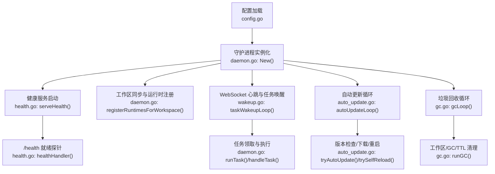
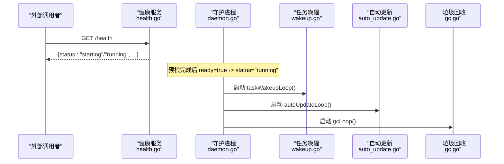
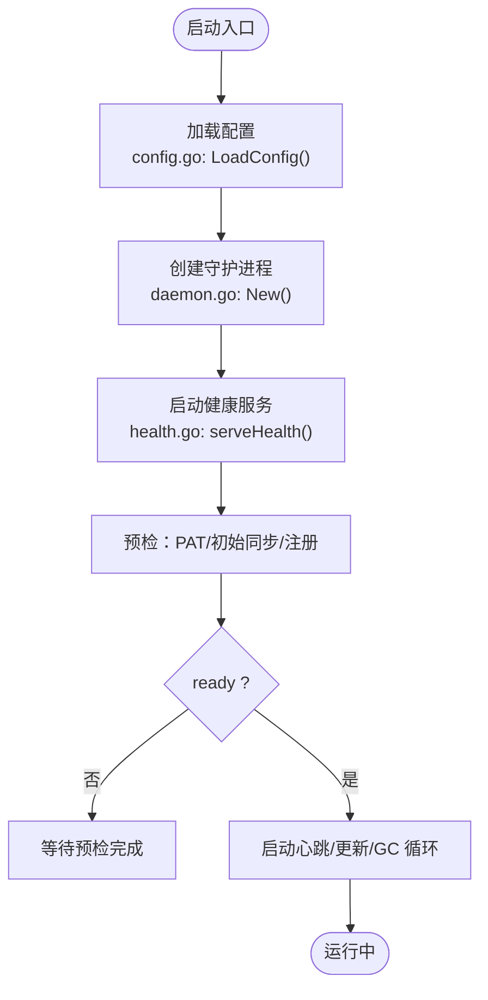
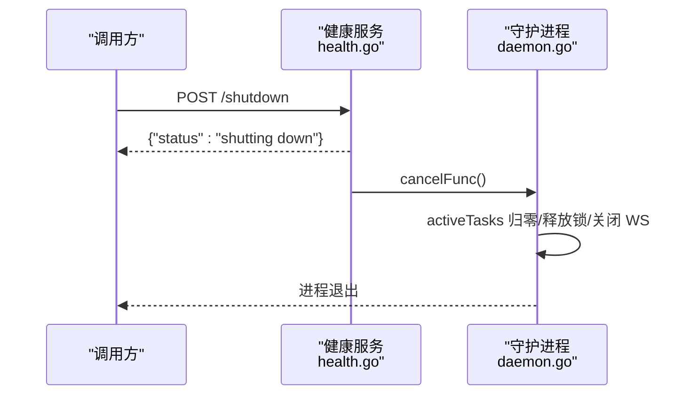
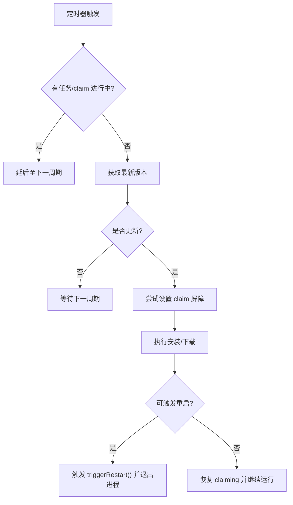
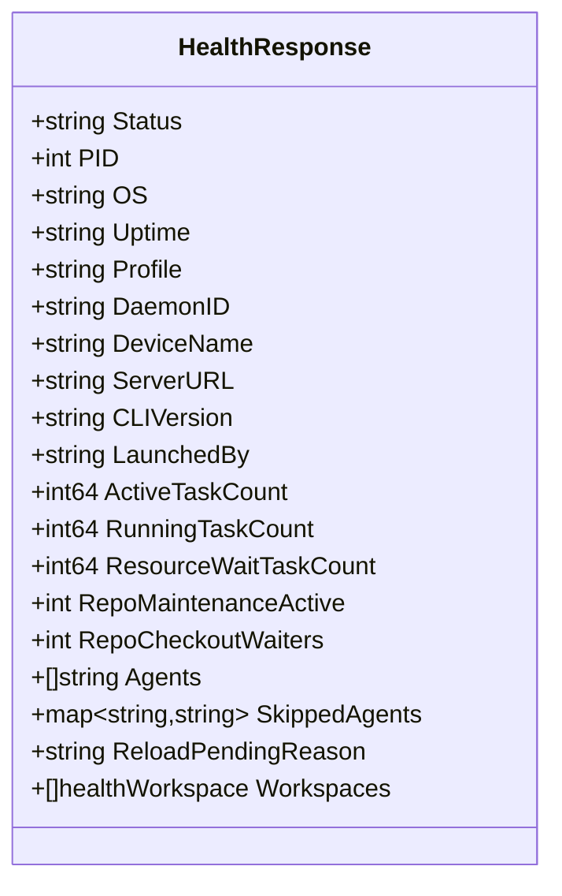
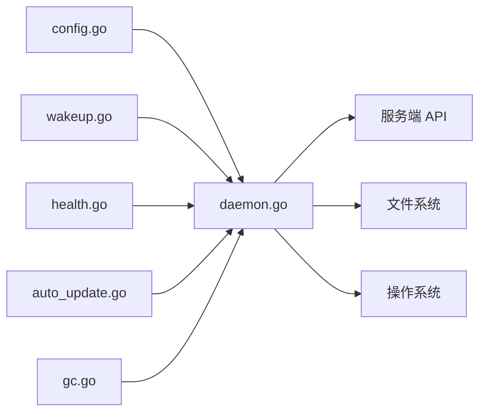

# 守护进程生命周期管理

<cite>
**本文引用的文件**
- [daemon.go](file://server/internal/daemon/daemon.go)
- [config.go](file://server/internal/daemon/config.go)
- [auto_update.go](file://server/internal/daemon/auto_update.go)
- [health.go](file://server/internal/daemon/health.go)
- [wakeup.go](file://server/internal/daemon/wakeup.go)
- [gc.go](file://server/internal/daemon/gc.go)
</cite>

## 目录
1. [简介](#简介)
2. [项目结构](#项目结构)
3. [核心组件](#核心组件)
4. [架构总览](#架构总览)
5. [详细组件分析](#详细组件分析)
6. [依赖关系分析](#依赖关系分析)
7. [性能考量](#性能考量)
8. [故障排查指南](#故障排查指南)
9. [结论](#结论)
10. [附录](#附录)

## 简介
本文件面向守护进程（Daemon）的生命周期管理，覆盖启动流程、关闭流程、自动更新、健康检查与状态监控、日志系统、故障恢复机制以及部署与环境配置。内容基于 server/internal/daemon 包中的实现进行梳理，并结合仓库中关于智能体执行环境、工作区与仓库缓存的约定进行说明。

## 项目结构
守护进程的核心位于 Go 后端 server/internal/daemon 包，围绕以下关键文件组织：
- daemon.go：守护进程主结构、任务调度、注册、资源管理与生命周期控制
- config.go：配置加载、环境变量解析、默认值与策略选择
- auto_update.go：版本检查、下载安装与优雅重启
- health.go：本地健康端点、停机接口与工作区仓库 checkout 鉴权
- wakeup.go：与服务端的 WebSocket 心跳、任务唤醒与能力协商
- gc.go：工作区与缓存的周期性清理（GC）

**图表来源**
- [config.go:195-648](file://server/internal/daemon/config.go#L195-L648)
- [daemon.go:634-687](file://server/internal/daemon/daemon.go#L634-L687)
- [health.go:379-398](file://server/internal/daemon/health.go#L379-L398)
- [wakeup.go:46-78](file://server/internal/daemon/wakeup.go#L46-L78)
- [auto_update.go:116-189](file://server/internal/daemon/auto_update.go#L116-L189)
- [gc.go:27-61](file://server/internal/daemon/gc.go#L27-L61)

**章节来源**
- [config.go:195-648](file://server/internal/daemon/config.go#L195-L648)
- [daemon.go:634-687](file://server/internal/daemon/daemon.go#L634-L687)
- [health.go:379-398](file://server/internal/daemon/health.go#L379-L398)
- [wakeup.go:46-78](file://server/internal/daemon/wakeup.go#L46-L78)
- [auto_update.go:116-189](file://server/internal/daemon/auto_update.go#L116-L189)
- [gc.go:27-61](file://server/internal/daemon/gc.go#L27-L61)

## 核心组件
- 配置系统：从环境变量与 CLI 覆盖项加载，解析服务器地址、端口、超时、并发度、GC 策略、自动更新开关等。
- 守护进程主体：维护工作区状态、运行时索引、任务槽位、版本探测、重试与降级、锁与屏障（防止升级中断任务）。
- 健康服务：提供 /health 就绪探针、/shutdown 优雅停机、/repo/checkout 安全 checkout。
- 任务唤醒：通过 WebSocket 维持心跳、接收任务可用提示、能力协商与批量 claim 回退。
- 自动更新：定时拉取最新版本、比较版本、下载并触发重启；同时检测磁盘上二进制变化并热重载。
- 垃圾回收：按策略清理任务目录、仓库缓存、会话存储与临时目录，支持多种 TTL 与模式。

**章节来源**
- [config.go:100-160](file://server/internal/daemon/config.go#L100-L160)
- [daemon.go:373-626](file://server/internal/daemon/daemon.go#L373-L626)
- [health.go:19-79](file://server/internal/daemon/health.go#L19-L79)
- [wakeup.go:42-78](file://server/internal/daemon/wakeup.go#L42-L78)
- [auto_update.go:116-189](file://server/internal/daemon/auto_update.go#L116-L189)
- [gc.go:27-61](file://server/internal/daemon/gc.go#L27-L61)

## 架构总览
守护进程启动后，先绑定健康端口并暴露 /health，随后完成预检（如 PAT 续期、初始工作区同步、运行时注册），将状态切换为 running。之后并行运行：
- WebSocket 心跳与任务唤醒循环
- 自动更新轮询与自重载检测
- GC 周期扫描与清理

**图表来源**
- [health.go:298-355](file://server/internal/daemon/health.go#L298-L355)
- [wakeup.go:46-78](file://server/internal/daemon/wakeup.go#L46-L78)
- [auto_update.go:116-189](file://server/internal/daemon/auto_update.go#L116-L189)
- [gc.go:27-61](file://server/internal/daemon/gc.go#L27-L61)

## 详细组件分析

### 启动流程：配置加载、环境初始化、工作区同步与运行时注册
- 配置加载：LoadConfig 从环境变量与 CLI 覆盖项解析，确定服务器地址、健康端口、并发度、GC 策略、自动更新开关等。
- 守护进程实例化：New 创建 Daemon，初始化仓库缓存、技能包缓存、客户端、工作区映射、运行时索引、锁与条件变量，并设置执行环境与 runner。
- 健康服务启动：serveHealth 绑定本地监听器，注册 /health、/shutdown、/repo/checkout。
- 工作区同步与运行时注册：在预检完成后，按工作区维度注册运行时，记录已发送的版本信息，处理自定义运行时配置漂移。
- 就绪标志：preflight 完成后设置 ready=true，/health 返回 running。

**图表来源**
- [config.go:195-648](file://server/internal/daemon/config.go#L195-L648)
- [daemon.go:634-687](file://server/internal/daemon/daemon.go#L634-L687)
- [health.go:379-398](file://server/internal/daemon/health.go#L379-L398)

**章节来源**
- [config.go:195-648](file://server/internal/daemon/config.go#L195-L648)
- [daemon.go:634-687](file://server/internal/daemon/daemon.go#L634-L687)
- [health.go:298-355](file://server/internal/daemon/health.go#L298-L355)

### 关闭流程：任务清理、资源释放与优雅停机
- 优雅停机：/shutdown 接受 POST 请求后异步取消根上下文，避免响应与关闭竞态。
- 任务保护：activeTasks 计数包含准备阶段与本地目录等待，确保升级或重启不会中断进行中任务。
- 资源释放：WS 连接关闭顺序严格（先关连接、再分离 RPC、再关闭写通道、最后等待 writer 退出），避免重复 claim 或 panic。
- GC 与后台任务：在 ctx 取消时停止 ticker，等待 goroutine 退出。

**图表来源**
- [health.go:357-377](file://server/internal/daemon/health.go#L357-L377)
- [wakeup.go:211-256](file://server/internal/daemon/wakeup.go#L211-L256)
- [daemon.go:544-575](file://server/internal/daemon/daemon.go#L544-L575)

**章节来源**
- [health.go:357-377](file://server/internal/daemon/health.go#L357-L377)
- [wakeup.go:211-256](file://server/internal/daemon/wakeup.go#L211-L256)
- [daemon.go:544-575](file://server/internal/daemon/daemon.go#L544-L575)

### 自动更新：版本检查、下载安装与进程重启
- 双路径：
  - tryAutoUpdate：定期从发布源获取新版本，比较后执行安装并触发重启。
  - trySelfReload：检测磁盘上的 multica 二进制版本与当前进程不同则重启。
- 安全屏障：使用 claimMu + pauseClaims + claimsInFlight 与 activeTasks 共同保证不中断进行中任务与正在领取的任务。
- 失败重试：网络抖动或下载失败仅记录警告，下一周期重试；无法触发重启时保留 claiming 能力。

**图表来源**
- [auto_update.go:191-291](file://server/internal/daemon/auto_update.go#L191-L291)
- [auto_update.go:293-411](file://server/internal/daemon/auto_update.go#L293-L411)
- [daemon.go:544-575](file://server/internal/daemon/daemon.go#L544-L575)

**章节来源**
- [auto_update.go:116-189](file://server/internal/daemon/auto_update.go#L116-L189)
- [auto_update.go:191-291](file://server/internal/daemon/auto_update.go#L191-L291)
- [auto_update.go:293-411](file://server/internal/daemon/auto_update.go#L293-L411)
- [daemon.go:544-575](file://server/internal/daemon/daemon.go#L544-L575)

### 健康检查与状态监控：就绪探针、存活探针与性能指标
- /health：
  - status：starting/running，由 ready 原子标志决定
  - PID、OS、Uptime、Profile、DaemonID、DeviceName、ServerURL、CLIVersion、LaunchedBy
  - 任务统计：ActiveTaskCount、RunningTaskCount、ResourceWaitTaskCount
  - 代理与跳过原因：Agents、SkippedAgents
  - 仓库维护活动：RepoMaintenanceActive、RepoCheckoutWaiters
  - 待重载原因：ReloadPendingReason
  - 工作区列表：Workspaces[].ID, .Runtimes
- /shutdown：POST 触发优雅停机
- /repo/checkout：受任务令牌鉴权的安全 checkout 接口，支持忙重试头

**图表来源**
- [health.go:19-79](file://server/internal/daemon/health.go#L19-L79)
- [health.go:298-355](file://server/internal/daemon/health.go#L298-L355)

**章节来源**
- [health.go:19-79](file://server/internal/daemon/health.go#L19-L79)
- [health.go:298-355](file://server/internal/daemon/health.go#L298-L355)

### 日志系统：结构化日志、日志级别与调试模式
- 日志框架：使用标准库 log/slog，所有关键路径均输出结构化字段（如错误、耗时、标识符）。
- 关键日志点：
  - 自动更新：拉取失败、版本比较、升级成功/失败、重启调度
  - 健康服务：监听地址、错误、拒绝原因
  - 任务唤醒：WS 连接建立/断开、心跳丢失、消息无效负载
  - GC：周期开始/结束、清理统计、各模块回收数量
- 调试建议：结合 /health 的 ReloadPendingReason、SkippedAgents 与日志定位问题；对 WS 断连与重连关注 backoff 与 jitter。

**章节来源**
- [auto_update.go:191-291](file://server/internal/daemon/auto_update.go#L191-L291)
- [health.go:379-398](file://server/internal/daemon/health.go#L379-L398)
- [wakeup.go:46-78](file://server/internal/daemon/wakeup.go#L46-L78)
- [gc.go:27-61](file://server/internal/daemon/gc.go#L27-L61)

### 故障恢复机制：崩溃重启、数据一致性与错误处理策略
- 崩溃恢复：
  - 任务准备超时与 provider 执行超时区分，便于上层重试
  - 运行时行在服务端删除时通过 WS ack 或 HTTP 404 触发 handleRuntimeGone 自愈
- 数据一致性：
  - 工作区注册序列锁（workspaceRegisterLock）保证“发送 Register—应用响应—注销过时条目”的原子性，避免并发导致的状态不一致
  - 任务目录所有权校验与预留（reserveEnvRootForGC）防止并发回收
- 错误处理策略：
  - 自动更新失败仅告警并延迟重试
  - WS 写入缓冲满时丢弃心跳，依靠 HTTP 心跳窗口兜底
  - repo/checkout 忙时返回 503 与 Retry-After，支持客户端重试

**章节来源**
- [daemon.go:373-626](file://server/internal/daemon/daemon.go#L373-L626)
- [wakeup.go:340-372](file://server/internal/daemon/wakeup.go#L340-L372)
- [gc.go:319-374](file://server/internal/daemon/gc.go#L319-L374)
- [health.go:400-516](file://server/internal/daemon/health.go#L400-L516)

### 部署配置与环境变量设置指南
- 关键环境变量（示例）：
  - MULTICA_SERVER_URL：服务端基础地址（支持 ws/wss/http/https）
  - MULTICA_DAEMON_PORT：健康端口（默认 19514）
  - MULTICA_DAEMON_MAX_CONCURRENT_TASKS：最大并发任务数
  - MULTICA_AGENT_TIMEOUT：单任务绝对超时（0 表示无上限）
  - MULTICA_AGENT_IDLE_WATCHDOG：空闲看门狗（0 禁用）
  - MULTICA_CODEX_SEMANTIC_INACTIVITY_TIMEOUT：Codex 语义空闲超时
  - MULTICA_GC_*：GC 相关开关与 TTL
  - MULTICA_DAEMON_AUTO_UPDATE / MULTICA_DAEMON_AUTO_RELOAD：自动更新/重载开关
- 配置优先级：CLI 覆盖 > 环境变量 > 默认值
- 工作区根目录：可通过 MULTICA_WORKSPACES_ROOT 指定，否则默认用户目录下多 profile 隔离

**章节来源**
- [config.go:100-160](file://server/internal/daemon/config.go#L100-L160)
- [config.go:195-648](file://server/internal/daemon/config.go#L195-L648)
- [config.go:695-754](file://server/internal/daemon/config.go#L695-L754)

## 依赖关系分析
守护进程内部模块耦合清晰：
- daemon.go 作为中枢，依赖：
  - config.go：配置
  - wakeup.go：WS 心跳与任务唤醒
  - health.go：健康与停机
  - auto_update.go：自动更新
  - gc.go：垃圾回收
- 对外依赖：
  - 服务端 API（HTTP/WebSocket）
  - 文件系统（工作区、仓库缓存、技能包缓存）
  - 操作系统（进程、信号、PATH）

**图表来源**
- [daemon.go:373-626](file://server/internal/daemon/daemon.go#L373-L626)
- [config.go:195-648](file://server/internal/daemon/config.go#L195-L648)
- [wakeup.go:46-78](file://server/internal/daemon/wakeup.go#L46-L78)
- [health.go:379-398](file://server/internal/daemon/health.go#L379-L398)
- [auto_update.go:116-189](file://server/internal/daemon/auto_update.go#L116-L189)
- [gc.go:27-61](file://server/internal/daemon/gc.go#L27-L61)

**章节来源**
- [daemon.go:373-626](file://server/internal/daemon/daemon.go#L373-L626)
- [config.go:195-648](file://server/internal/daemon/config.go#L195-L648)
- [wakeup.go:46-78](file://server/internal/daemon/wakeup.go#L46-L78)
- [health.go:379-398](file://server/internal/daemon/health.go#L379-L398)
- [auto_update.go:116-189](file://server/internal/daemon/auto_update.go#L116-L189)
- [gc.go:27-61](file://server/internal/daemon/gc.go#L27-L61)

## 性能考量
- 并发与限流：
  - MaxConcurrentTasks 限制并发任务数，避免资源耗尽
  - WS 写缓冲与心跳丢弃策略，防止拥塞放大
- 超时与看门狗：
  - AgentTimeout 与 IdleWatchdog 防止长时间挂起
  - Codex 语义空闲超时与首条消息超时保障交互体验
- GC 策略：
  - 多粒度 TTL（任务目录、仓库缓存、会话存储、临时目录）
  - 只清理可再生制品，保护日志与持久数据
- 自动更新：
  - 仅在空闲且无任务/claim 进行时执行，避免影响吞吐

[本节为通用性能指导，无需特定文件引用]

## 故障排查指南
- 健康端点诊断：
  - 查看 /health 的 status、ActiveTaskCount、RunningTaskCount、SkippedAgents、ReloadPendingReason
- WS 连接问题：
  - 关注 wakeup 日志中的连接建立/断开、backoff 与消息无效负载
  - 若频繁断连，检查网络代理与证书
- 自动更新失败：
  - 检查网络可达与版本格式；确认 AutoUpdateEnabled/AutoReloadEnabled
- GC 行为异常：
  - 核对 GCInterval/GCTTL/GCArtifactTTL 等参数
  - 观察 GC 日志中的清理统计与跳过原因
- repo/checkout 鉴权失败：
  - 确认请求携带有效 Bearer 令牌，且属于当前活跃任务
  - 旧版 CLI 会因缺少认证头被拒绝，需升级

**章节来源**
- [health.go:298-355](file://server/internal/daemon/health.go#L298-L355)
- [wakeup.go:46-78](file://server/internal/daemon/wakeup.go#L46-L78)
- [auto_update.go:191-291](file://server/internal/daemon/auto_update.go#L191-L291)
- [gc.go:27-61](file://server/internal/daemon/gc.go#L27-L61)
- [health.go:400-516](file://server/internal/daemon/health.go#L400-L516)

## 结论
守护进程通过清晰的启动/关闭流程、健壮的自动更新机制、完善的健康检查与监控、严格的并发与超时控制、以及精细化的垃圾回收策略，实现了高可靠、可观测、易运维的智能体任务执行环境。建议在部署时合理配置环境变量与 GC 策略，并通过 /health 与日志持续观察运行状态，及时定位与处理异常。

## 附录
- 工作区与仓库模型：
  - WorkspacesRoot 下每个任务一个 env root，代码从共享裸缓存（.repos）checkout 出 git worktree
  - 同一 (agent, issue) 的多轮通过 PriorWorkDir 复用同一 workdir，不同任务各占目录并行
- 执行环境装配：
  - execenv 负责组装智能体上下文，brief 以标记块写入 CLAUDE.md/AGENTS.md，技能水合到 provider 原生 skills 目录
  - 每轮 prompt 由 daemon.BuildPrompt 生成，易变字段放在每轮消息而非 brief，以保缓存前缀稳定

[本节为概念性补充，无需特定文件引用]