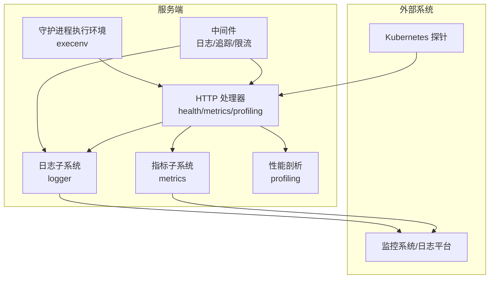
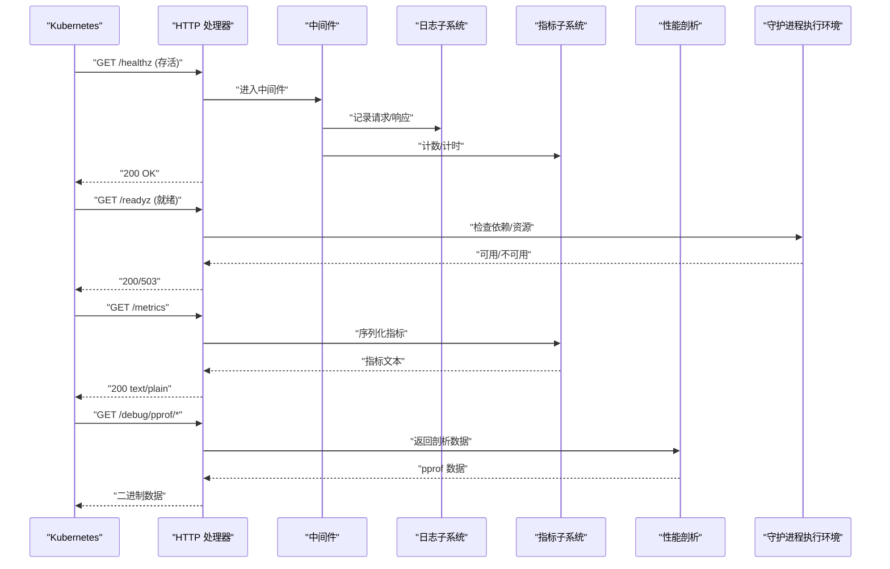
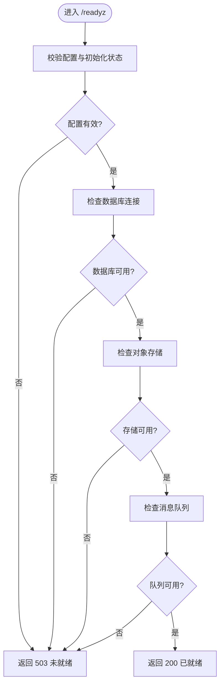
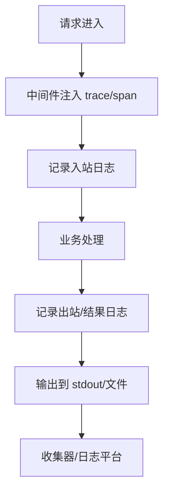
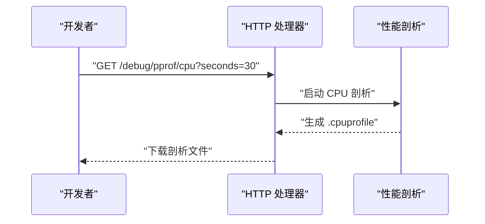
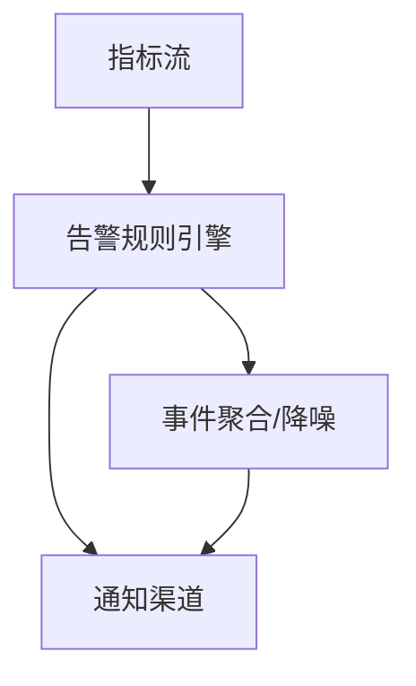
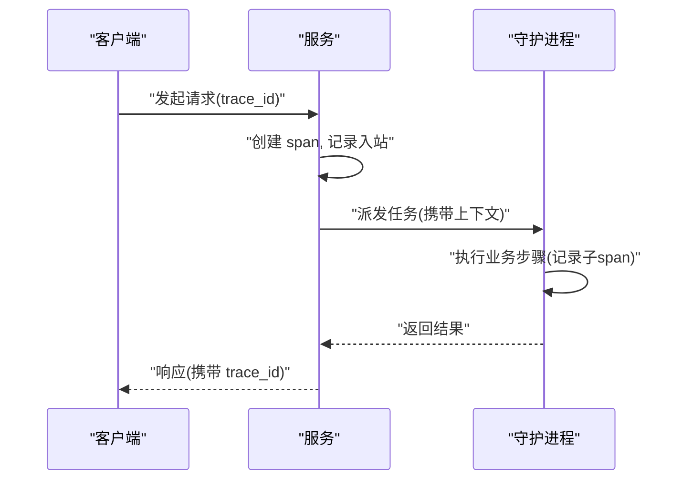
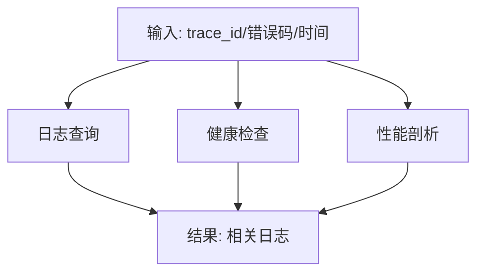
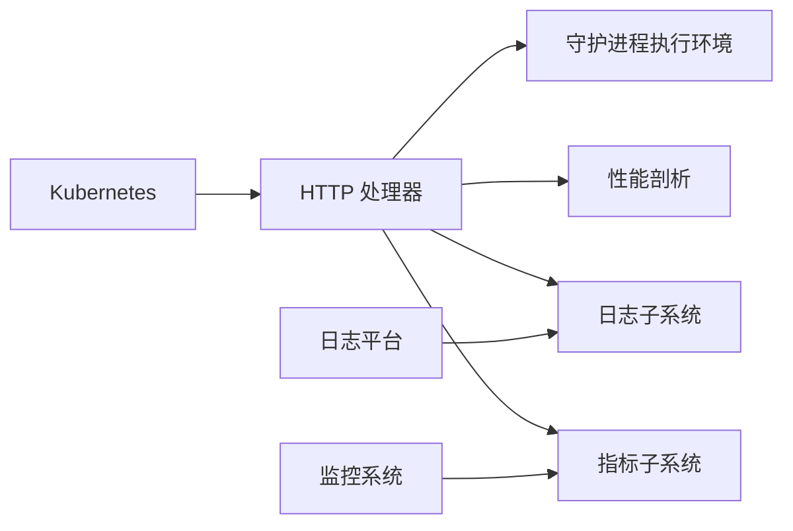

# 监控与调试

<cite>
**本文引用的文件**
- [server/internal/daemon/execenv](file://server/internal/daemon/execenv)
- [server/internal/metrics](file://server/internal/metrics)
- [server/internal/logger](file://server/internal/logger)
- [server/internal/profiling](file://server/internal/profiling)
- [server/internal/handler](file://server/internal/handler)
- [server/internal/middleware](file://server/internal/middleware)
- [server/cmd/server](file://server/cmd/server)
- [deploy/helm/multica/templates/backend.yaml](file://deploy/helm/multica/templates/backend.yaml)
- [docker/entrypoint.sh](file://docker/entrypoint.sh)
</cite>

## 目录
1. [简介](#简介)
2. [项目结构](#项目结构)
3. [核心组件](#核心组件)
4. [架构总览](#架构总览)
5. [详细组件分析](#详细组件分析)
6. [依赖关系分析](#依赖关系分析)
7. [性能考量](#性能考量)
8. [故障诊断指南](#故障诊断指南)
9. [结论](#结论)
10. [附录](#附录)

## 简介
本章节面向守护进程（Daemon）的监控与调试，聚焦以下目标：
- 健康检查端点：就绪探针、存活探针与依赖检查。
- 性能监控指标：CPU 使用率、内存占用、任务吞吐量、响应时间等。
- 日志系统：结构化日志、日志级别、日志轮转与远程收集。
- 调试模式：详细日志输出、堆栈跟踪与性能剖析。
- 告警机制：阈值设置、通知渠道与事件聚合。
- 分布式追踪：请求链路追踪、上下文传播与瓶颈识别。
- 故障诊断工具：健康检查 API、日志查询与性能剖析。
- 监控仪表板与可视化方案。

## 项目结构
后端服务以 Go 实现，关键监控与可观测性能力分布在如下模块：
- 指标采集与导出：metrics 包负责定义与暴露系统与应用指标。
- 日志子系统：logger 包提供结构化日志、级别控制与扩展点。
- 性能剖析：profiling 包提供运行时剖析接口。
- 守护进程执行环境：execenv 装配智能体运行上下文，影响任务执行的可观测性。
- HTTP 路由与中间件：handler 与 middleware 暴露健康检查、指标与剖析端点，并注入追踪与日志上下文。
- 部署配置：Helm 模板与容器入口脚本用于在 Kubernetes 中启用探针与运行时参数。

图表来源
- [server/internal/handler](file://server/internal/handler)
- [server/internal/middleware](file://server/internal/middleware)
- [server/internal/metrics](file://server/internal/metrics)
- [server/internal/logger](file://server/internal/logger)
- [server/internal/profiling](file://server/internal/profiling)
- [server/internal/daemon/execenv](file://server/internal/daemon/execenv)

章节来源
- [server/internal/metrics](file://server/internal/metrics)
- [server/internal/logger](file://server/internal/logger)
- [server/internal/profiling](file://server/internal/profiling)
- [server/internal/daemon/execenv](file://server/internal/daemon/execenv)
- [server/internal/handler](file://server/internal/handler)
- [server/internal/middleware](file://server/internal/middleware)

## 核心组件
- 健康检查端点
  - 就绪探针：验证服务是否已加载配置、完成初始化并可接受流量。
  - 存活探针：验证进程是否处于活跃状态，必要时触发重启。
  - 依赖检查：校验数据库、对象存储、消息队列等关键依赖可达且可用。
- 指标子系统
  - 系统级：CPU 使用率、内存占用、GC 统计、goroutine 数量。
  - 应用级：任务创建/完成速率、队列长度、错误率、P95/P99 延迟。
  - 导出格式：Prometheus 文本格式或 OpenMetrics，供 Prometheus 抓取。
- 日志子系统
  - 结构化字段：trace_id、span_id、service、version、host、component。
  - 级别控制：debug/info/warn/error/fatal，支持动态调整。
  - 轮转策略：按大小/时间切分，保留周期与压缩。
  - 远程收集：stdout 管道化至 sidecar/Fluent Bit/Vector，或直接写入远端。
- 性能剖析
  - CPU/内存/阻塞/互斥剖析端点，配合 pprof 工具链。
  - 采样率与开销控制，避免生产环境过度开销。
- 守护进程执行环境
  - 为每个任务装配工作目录、环境变量、权限与资源限制。
  - 将 brief、技能水合、prompt 构建过程纳入可观测性上下文。

章节来源
- [server/internal/handler](file://server/internal/handler)
- [server/internal/metrics](file://server/internal/metrics)
- [server/internal/logger](file://server/internal/logger)
- [server/internal/profiling](file://server/internal/profiling)
- [server/internal/daemon/execenv](file://server/internal/daemon/execenv)

## 架构总览
下图展示从 Kubernetes 探针到服务内部各子系统的调用路径，以及指标与日志的对外输出。

图表来源
- [server/internal/handler](file://server/internal/handler)
- [server/internal/middleware](file://server/internal/middleware)
- [server/internal/metrics](file://server/internal/metrics)
- [server/internal/logger](file://server/internal/logger)
- [server/internal/profiling](file://server/internal/profiling)
- [server/internal/daemon/execenv](file://server/internal/daemon/execenv)

## 详细组件分析

### 健康检查端点（就绪/存活/依赖）
- 存活探针（/healthz）
  - 目的：确认进程存活，无严重死锁或崩溃。
  - 行为：快速返回成功；若检测到致命错误则返回失败。
- 就绪探针（/readyz）
  - 目的：确认服务已完成初始化并可以接收流量。
  - 行为：检查配置加载、连接池、缓存预热、依赖可用性。
- 依赖检查
  - 数据库：连接建立、简单查询、事务测试。
  - 对象存储：列出桶/键前缀、读写小对象。
  - 消息队列：发送/消费心跳消息。
  - 第三方 API：鉴权、最小请求、超时与重试策略。

图表来源
- [server/internal/handler](file://server/internal/handler)
- [server/internal/daemon/execenv](file://server/internal/daemon/execenv)

章节来源
- [server/internal/handler](file://server/internal/handler)

### 性能监控指标
- 系统指标
  - CPU 使用率、内存占用、GC 次数与停顿、goroutine 数、FD 数。
- 应用指标
  - 任务创建/完成速率、队列深度、错误率、P95/P99 延迟、并发度。
- 指标维度
  - 按服务版本、实例、任务类型、错误码、区域等标签区分。
- 导出与抓取
  - 通过 /metrics 暴露 Prometheus 格式；Prometheus 定期抓取。
- 指标质量
  - 命名规范、单位统一、标签基数控制、避免高基数字段。

图表来源
- [server/internal/metrics](file://server/internal/metrics)

章节来源
- [server/internal/metrics](file://server/internal/metrics)

### 日志系统
- 结构化日志
  - 固定字段：trace_id、span_id、service、version、host、component、level。
  - 业务字段：task_id、agent_id、workspace、step 等。
- 日志级别
  - debug：详细调试信息，默认在生产关闭。
  - info：正常流程事件。
  - warn：潜在问题，需关注。
  - error：可恢复错误，附带上下文。
  - fatal：不可恢复错误，进程退出。
- 日志轮转
  - 按大小/时间切分，保留天数与压缩策略。
  - 多实例共享日志目录时的并发安全。
- 远程收集
  - stdout 管道化至 sidecar/Fluent Bit/Vector。
  - 可选直接写入远端（如 Loki/Elasticsearch），注意背压与重试。

图表来源
- [server/internal/middleware](file://server/internal/middleware)
- [server/internal/logger](file://server/internal/logger)

章节来源
- [server/internal/logger](file://server/internal/logger)
- [server/internal/middleware](file://server/internal/middleware)

### 调试模式
- 详细日志输出
  - 通过环境变量或配置开关提升日志级别。
  - 对敏感字段进行脱敏。
- 堆栈跟踪
  - 捕获 panic 并输出完整堆栈。
  - 关联 trace_id 便于跨服务定位。
- 性能剖析
  - 启用 CPU/内存/阻塞/互斥剖析端点。
  - 限制访问范围（仅内网/管理员）。
  - 控制采样率与保留时长。

图表来源
- [server/internal/profiling](file://server/internal/profiling)
- [server/internal/handler](file://server/internal/handler)

章节来源
- [server/internal/profiling](file://server/internal/profiling)
- [server/internal/handler](file://server/internal/handler)

### 告警机制
- 阈值设置
  - 基于指标（错误率、延迟、队列长度、资源使用）设定阈值。
  - 分级告警：警告/严重，不同持续时间与抖动抑制。
- 通知渠道
  - 邮件、IM（钉钉/飞书/Slack）、电话、Webhook。
  - 去重与合并：相同根因合并通知，避免风暴。
- 事件聚合
  - 按服务/实例/错误类型聚合，计算趋势与峰值。
  - 与变更事件（发布/回滚）关联，辅助根因分析。

[本节为概念性说明，不直接分析具体文件]

### 分布式追踪
- 请求链路追踪
  - 为每个请求分配 trace_id，贯穿 HTTP/WebSocket/异步任务。
  - 记录关键阶段：入站、鉴权、调度、执行、出站。
- 上下文传播
  - 通过 HTTP Header 与消息头传递 trace/span 上下文。
  - 守护进程任务执行时继承上下文，确保端到端可见。
- 性能瓶颈识别
  - 基于 span 耗时与错误率定位慢步骤。
  - 结合指标与日志交叉分析。

[本节为概念性说明，不直接分析具体文件]

### 故障诊断工具
- 健康检查 API
  - /healthz：存活检查。
  - /readyz：就绪检查与依赖探测。
- 日志查询
  - 基于 trace_id、span_id、任务 ID、错误码过滤。
  - 结合时间窗口与关键字检索。
- 性能剖析
  - CPU/内存/阻塞/互斥剖析，结合火焰图分析热点。
  - 限制访问与采样策略，避免影响线上稳定性。

[本节为概念性说明，不直接分析具体文件]

## 依赖关系分析
- 组件耦合
  - handler 依赖 metrics、logger、profiling 与 execenv。
  - middleware 注入日志与追踪上下文，增强可观测性。
- 外部依赖
  - Kubernetes 探针通过 HTTP 端点驱动。
  - 监控系统通过 /metrics 抓取指标。
  - 日志平台通过 stdout 或 SDK 收集日志。
- 风险点
  - 指标标签基数过高导致存储压力。
  - 日志量过大导致磁盘与带宽瓶颈。
  - 剖析端点被滥用影响性能。

图表来源
- [server/internal/handler](file://server/internal/handler)
- [server/internal/metrics](file://server/internal/metrics)
- [server/internal/logger](file://server/internal/logger)
- [server/internal/profiling](file://server/internal/profiling)
- [server/internal/daemon/execenv](file://server/internal/daemon/execenv)

章节来源
- [server/internal/handler](file://server/internal/handler)
- [server/internal/metrics](file://server/internal/metrics)
- [server/internal/logger](file://server/internal/logger)
- [server/internal/profiling](file://server/internal/profiling)
- [server/internal/daemon/execenv](file://server/internal/daemon/execenv)

## 性能考量
- 指标采集开销
  - 使用增量计数器与滑动窗口直方图，减少锁竞争。
  - 控制标签基数，避免 cardinality explosion。
- 日志写入优化
  - 批量写入与异步落盘，降低同步 IO 开销。
  - 合理轮转策略，避免频繁切换文件句柄。
- 剖析开关
  - 按需启用，限制频率与时长。
  - 生产环境默认关闭，仅在排查时开启。
- 依赖健康检查
  - 使用短超时与指数退避重试，避免雪崩。
  - 缓存依赖状态，减少频繁探测。

[本节为通用指导，不直接分析具体文件]

## 故障诊断指南
- 常见问题
  - 服务无法就绪：检查配置、依赖连接、资源配额。
  - 指标缺失：确认 /metrics 暴露与抓取配置。
  - 日志丢失：检查 stdout 管道、收集器状态与磁盘空间。
  - 性能退化：启用剖析，定位热点函数与锁竞争。
- 诊断步骤
  - 使用 /healthz 与 /readyz 快速判断服务状态。
  - 通过 trace_id 串联日志与指标，定位异常阶段。
  - 使用 pprof 分析 CPU/内存热点，结合火焰图优化。
- 回滚与恢复
  - 根据告警与指标趋势决定回滚或扩容。
  - 临时降级非关键功能，保障核心链路稳定。

章节来源
- [server/internal/handler](file://server/internal/handler)
- [server/internal/metrics](file://server/internal/metrics)
- [server/internal/logger](file://server/internal/logger)
- [server/internal/profiling](file://server/internal/profiling)

## 结论
本方案围绕守护进程的健康检查、指标、日志、剖析与追踪构建了完整的可观测性体系。通过标准化的端点与中间件，结合 Kubernetes 探针与外部监控系统，可实现从请求到执行的端到端可见性与可控性。建议在生产环境中严格管控指标标签基数与日志量，按需启用剖析，并通过告警与仪表板实现主动运维。

[本节为总结性内容，不直接分析具体文件]

## 附录
- 部署与运行时要点
  - Helm 模板中配置探针与资源限制，确保就绪/存活探针生效。
  - 容器入口脚本设置必要的环境变量与启动参数。
  - 服务命令启动时启用必要的监控与日志选项。

章节来源
- [deploy/helm/multica/templates/backend.yaml](file://deploy/helm/multica/templates/backend.yaml)
- [docker/entrypoint.sh](file://docker/entrypoint.sh)
- [server/cmd/server](file://server/cmd/server)