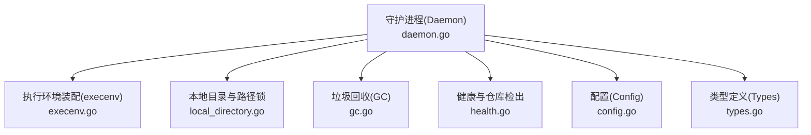
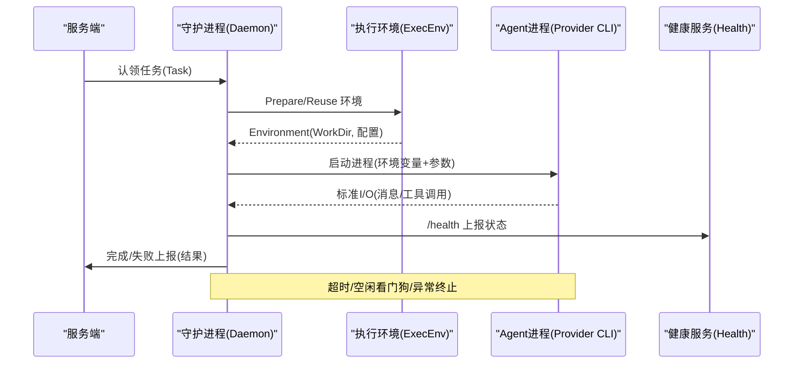
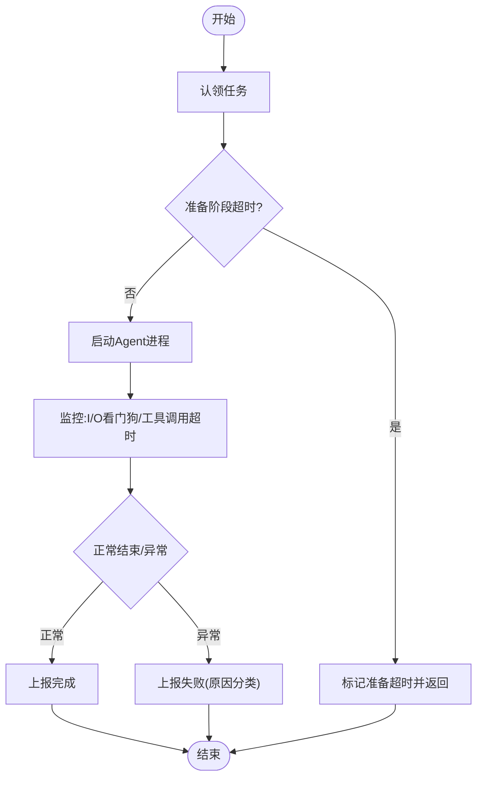
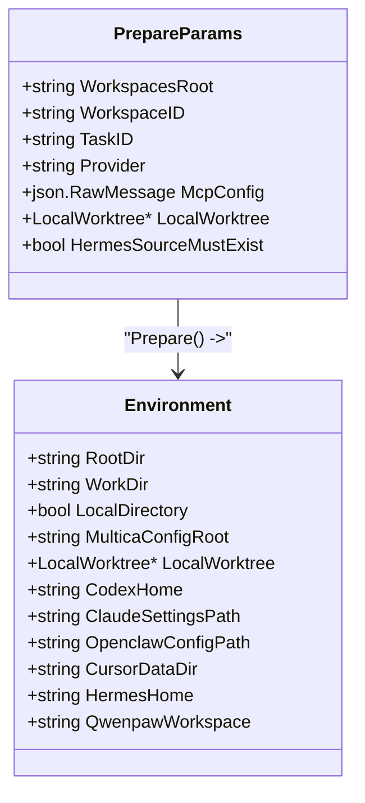
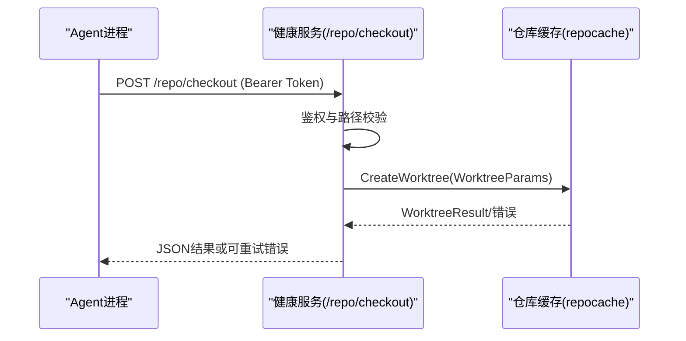
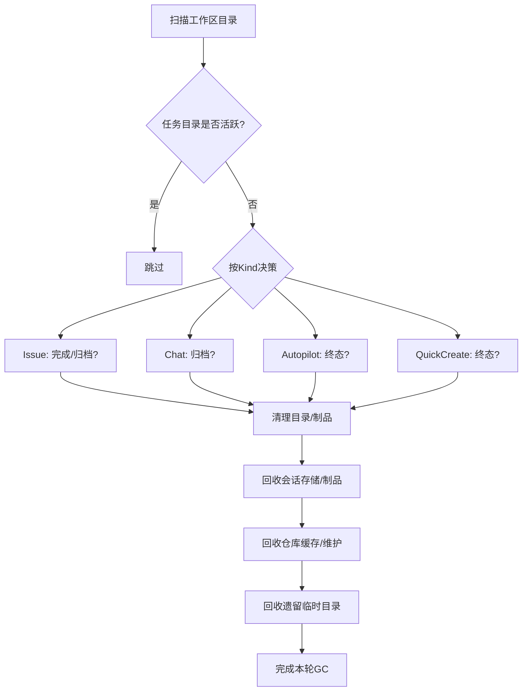
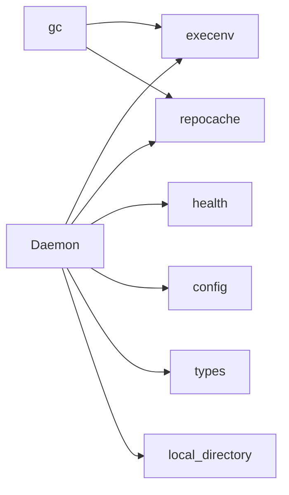

# 进程管理与调度

<cite>
**本文引用的文件**
- [daemon.go](file://server/internal/daemon/daemon.go)
- [config.go](file://server/internal/daemon/config.go)
- [types.go](file://server/internal/daemon/types.go)
- [gc.go](file://server/internal/daemon/gc.go)
- [health.go](file://server/internal/daemon/health.go)
- [execenv.go](file://server/internal/daemon/execenv/execenv.go)
- [local_directory.go](file://server/internal/daemon/local_directory.go)
</cite>

## 目录
1. [简介](#简介)
2. [项目结构](#项目结构)
3. [核心组件](#核心组件)
4. [架构总览](#架构总览)
5. [详细组件分析](#详细组件分析)
6. [依赖关系分析](#依赖关系分析)
7. [性能考量](#性能考量)
8. [故障排查指南](#故障排查指南)
9. [结论](#结论)
10. [附录](#附录)

## 简介
本文件聚焦守护进程的“进程管理与调度”能力，围绕以下目标展开：
- 守护进程如何创建、隔离并调度智能体任务执行进程（含参数传递与环境隔离）。
- 任务槽位与并发控制、资源限制与负载均衡。
- 工作目录管理：临时目录创建、代码仓库检出与工作树复用。
- 进程间通信：标准输入输出流、环境变量传递、信号处理与健康检查。
- 进程监控与健康检查：心跳检测、超时处理、异常终止。
- 垃圾回收与资源清理：临时文件删除、内存释放、磁盘空间管理。
- 进程安全最佳实践：权限控制、沙箱隔离、资源限制。
- 调试与故障排查方法。

## 项目结构
守护进程位于 server/internal/daemon，关键子模块包括：
- daemon.go：守护进程主循环、任务认领与执行编排、槽位与并发控制、健康与重启等。
- config.go：配置加载、默认值、GC 策略、自动更新与重载开关。
- types.go：任务、代理、运行时等数据结构定义。
- execenv/execenv.go：每任务执行环境装配（目录、上下文、Provider 特定设置、工作树）。
- local_directory.go：本地目录模式与路径锁、执行模式校验与安全白名单。
- gc.go：周期性垃圾回收（任务目录、仓库缓存、会话存储、制品清理）。
- health.go：本地健康端点、仓库检出鉴权与限流、关闭流程。

**图表来源**
- [daemon.go:373-626](file://server/internal/daemon/daemon.go#L373-L626)
- [execenv.go:38-127](file://server/internal/daemon/execenv/execenv.go#L38-L127)
- [local_directory.go:455-595](file://server/internal/daemon/local_directory.go#L455-L595)
- [gc.go:27-193](file://server/internal/daemon/gc.go#L27-L193)
- [health.go:86-117](file://server/internal/daemon/health.go#L86-L117)
- [config.go:100-160](file://server/internal/daemon/config.go#L100-L160)
- [types.go:68-176](file://server/internal/daemon/types.go#L68-L176)

**章节来源**
- [daemon.go:373-626](file://server/internal/daemon/daemon.go#L373-L626)
- [config.go:100-160](file://server/internal/daemon/config.go#L100-L160)

## 核心组件
- 守护进程 Daemon：负责任务轮询、认领、准备、执行、结果上报、生命周期管理、健康与自动更新。
- 执行环境 ExecEnv：为每个任务创建隔离的工作目录、注入上下文、按需检出仓库、按 Provider 生成配置。
- 本地目录 LocalDirectory：支持 in_place 与 worktree 两种执行模式，提供路径校验、黑名单保护与路径级互斥锁。
- 垃圾回收 GC：按策略清理任务目录、制品、仓库缓存、会话存储与遗留临时目录。
- 健康服务 Health：暴露 /health、/shutdown、/repo/checkout 等接口，实现鉴权、限流与错误提示。
- 配置 Config：集中管理并发度、超时、GC 策略、自动更新与重载行为。
- 类型 Types：Task、Agent、Runtime 等数据契约，贯穿认领到执行的全链路。

**章节来源**
- [daemon.go:373-626](file://server/internal/daemon/daemon.go#L373-L626)
- [execenv.go:38-127](file://server/internal/daemon/execenv/execenv.go#L38-L127)
- [local_directory.go:16-126](file://server/internal/daemon/local_directory.go#L16-L126)
- [gc.go:27-193](file://server/internal/daemon/gc.go#L27-L193)
- [health.go:86-117](file://server/internal/daemon/health.go#L86-L117)
- [config.go:100-160](file://server/internal/daemon/config.go#L100-L160)
- [types.go:68-176](file://server/internal/daemon/types.go#L68-L176)

## 架构总览
守护进程作为本地 Agent 运行时，从服务端认领任务，准备隔离的执行环境，启动具体 Provider 的 CLI 进程，并通过标准 I/O 与进程交互；同时通过健康端点与仓库检出接口对外暴露能力，配合 GC 定期回收资源。

**图表来源**
- [daemon.go:163-179](file://server/internal/daemon/daemon.go#L163-L179)
- [execenv.go:409-744](file://server/internal/daemon/execenv/execenv.go#L409-L744)
- [health.go:296-355](file://server/internal/daemon/health.go#L296-L355)
- [types.go:68-176](file://server/internal/daemon/types.go#L68-L176)

## 详细组件分析

### 守护进程与任务调度
- 任务认领与执行：Daemon 维护工作区状态、运行时索引、版本探测与注册序列，确保并发安全与幂等。
- 槽位与并发控制：通过 activeTasks、runningTasks、resourceWaitTasks 等计数器与配置 MaxConcurrentTasks 控制并发上限；claim 阶段使用 claimMu 防止升级期间抢占。
- 超时与看门狗：taskPrepareTimeout 约束准备阶段；AgentTimeout、AgentIdleWatchdog、AgentToolWatchdog、Codex 语义不活跃超时共同构成多层超时保护。
- 环境变量与令牌：taskMulticaEnvironment 注入任务级令牌与工作区根等必要变量，确保进程边界隔离。
- 健康与重启：/health 暴露运行态与指标；支持优雅关闭与自动更新后的自重启。

**图表来源**
- [daemon.go:69-84](file://server/internal/daemon/daemon.go#L69-L84)
- [daemon.go:163-179](file://server/internal/daemon/daemon.go#L163-L179)
- [config.go:21-90](file://server/internal/daemon/config.go#L21-L90)

**章节来源**
- [daemon.go:69-84](file://server/internal/daemon/daemon.go#L69-L84)
- [daemon.go:163-179](file://server/internal/daemon/daemon.go#L163-L179)
- [config.go:21-90](file://server/internal/daemon/config.go#L21-L90)

### 执行环境与进程隔离
- 目录与上下文：Prepare 创建 envRoot、workdir、output、logs、multica-config，并按 Provider 写入技能、MCP 配置、Hermes/Codex/OpenClaw 等专用目录。
- 工作树复用：对同一 (agent, issue) 的多轮可通过 PriorWorkDir 复用工作树；不同任务各自目录并行。
- 本地目录模式：in_place 直接在工作目录执行；worktree 在 envRoot 内创建独立 git worktree，避免污染用户目录。
- 安全与回滚：侧车文件清单记录变更，失败时回滚；本地目录路径校验拒绝系统根与家目录等危险路径。

**图表来源**
- [execenv.go:38-127](file://server/internal/daemon/execenv/execenv.go#L38-L127)
- [execenv.go:267-352](file://server/internal/daemon/execenv/execenv.go#L267-L352)

**章节来源**
- [execenv.go:409-744](file://server/internal/daemon/execenv/execenv.go#L409-L744)
- [local_directory.go:16-126](file://server/internal/daemon/local_directory.go#L16-L126)

### 仓库检出与工作树管理
- 检出入口：/repo/checkout 仅允许当前任务的 bearer token 访问，校验 workspace/task/workdir 一致性，并限制工作目录范围。
- 工作树参数：根据任务与仓库信息构建 WorktreeParams，支持 isolated 元数据布局以适配沙箱。
- 并发与重试：当仓库忙时返回可重试响应头，客户端可按 Retry-After 重试。

**图表来源**
- [health.go:400-516](file://server/internal/daemon/health.go#L400-L516)
- [daemon.go:107-131](file://server/internal/daemon/daemon.go#L107-L131)

**章节来源**
- [health.go:400-516](file://server/internal/daemon/health.go#L400-L516)
- [daemon.go:107-131](file://server/internal/daemon/daemon.go#L107-L131)

### 垃圾回收与资源清理
- 周期扫描：按配置的间隔扫描 WorkspacesRoot，按 Kind（issue/chat/autopilot/quick-create）分别决策。
- 策略要点：
  - 已完成且超时的 issue 任务目录可清理；聊天会话归档后按 TTL 清理。
  - 制品清理：node_modules/.next/.turbo 等可再生目录，按 GCArtifactTTL 清理。
  - 会话存储：Codex 会话、Hermes 记忆与会话存储按各自 TTL 回收。
  - 仓库缓存：长时间未使用的裸仓库缓存可驱逐。
  - 遗留临时目录：无执行锁的旧任务临时目录按 TTL 清理。
- 并发安全：清理前尝试获取 env root 所有权并预留，避免与正在运行的任务冲突。

**图表来源**
- [gc.go:27-193](file://server/internal/daemon/gc.go#L27-L193)
- [gc.go:195-374](file://server/internal/daemon/gc.go#L195-L374)
- [gc.go:554-653](file://server/internal/daemon/gc.go#L554-L653)
- [gc.go:683-739](file://server/internal/daemon/gc.go#L683-L739)
- [gc.go:741-794](file://server/internal/daemon/gc.go#L741-L794)

**章节来源**
- [gc.go:27-193](file://server/internal/daemon/gc.go#L27-L193)
- [gc.go:195-374](file://server/internal/daemon/gc.go#L195-L374)
- [gc.go:554-653](file://server/internal/daemon/gc.go#L554-L653)
- [gc.go:683-739](file://server/internal/daemon/gc.go#L683-L739)
- [gc.go:741-794](file://server/internal/daemon/gc.go#L741-L794)

### 进程间通信、环境变量与信号
- 环境变量：taskMulticaEnvironment 注入任务级令牌、工作区根、服务器地址、端口、任务标识与临时目录等。
- 标准 I/O：Provider 进程通过标准输入输出与守护进程交换消息（如模型响应、工具调用），由上层后端驱动。
- 信号与超时：看门狗基于 I/O 活跃度与工具调用时长进行强制停止；准备阶段有硬超时；健康端点支持优雅关闭。

**章节来源**
- [daemon.go:163-179](file://server/internal/daemon/daemon.go#L163-L179)
- [config.go:21-90](file://server/internal/daemon/config.go#L21-L90)
- [health.go:357-377](file://server/internal/daemon/health.go#L357-L377)

### 健康检查与监控
- /health：返回进程 PID、OS、运行时长、Profile、DaemonID、设备名、服务器地址、CLI 版本、活动任务数、可用代理列表、跳过代理原因、待重载原因与工作区运行时列表。
- /shutdown：POST 触发优雅关闭，取消顶层 context。
- /repo/checkout：受鉴权保护的仓库检出接口，返回错误或可重试响应。

**章节来源**
- [health.go:19-79](file://server/internal/daemon/health.go#L19-L79)
- [health.go:296-355](file://server/internal/daemon/health.go#L296-L355)
- [health.go:357-377](file://server/internal/daemon/health.go#L357-L377)
- [health.go:400-516](file://server/internal/daemon/health.go#L400-L516)

### 本地目录模式与路径锁
- 执行模式：in_place 直接在用户目录执行；worktree 在 envRoot 内创建独立工作树，避免并发写冲突。
- 路径校验：拒绝系统根、家目录等危险路径，并对符号链接解析后的真实路径再次校验。
- 路径锁：LocalPathLocker 按真实路径串行化同目录任务，支持上下文取消与等待者提示。

**章节来源**
- [local_directory.go:16-126](file://server/internal/daemon/local_directory.go#L16-L126)
- [local_directory.go:247-314](file://server/internal/daemon/local_directory.go#L247-L314)
- [local_directory.go:455-595](file://server/internal/daemon/local_directory.go#L455-L595)

## 依赖关系分析
- Daemon 依赖 execenv 装配执行环境，依赖 repocache 管理仓库缓存，依赖 health 暴露接口，依赖 config 读取配置，依赖 types 承载数据契约。
- 本地目录模式与路径锁为 Daemon 提供额外的并发控制与安全保障。
- GC 依赖 execenv 提供的元数据与清理能力，以及 repocache 的仓库维护。

**图表来源**
- [daemon.go:373-626](file://server/internal/daemon/daemon.go#L373-L626)
- [gc.go:27-193](file://server/internal/daemon/gc.go#L27-L193)
- [health.go:86-117](file://server/internal/daemon/health.go#L86-L117)
- [config.go:100-160](file://server/internal/daemon/config.go#L100-L160)
- [types.go:68-176](file://server/internal/daemon/types.go#L68-L176)
- [local_directory.go:455-595](file://server/internal/daemon/local_directory.go#L455-L595)

**章节来源**
- [daemon.go:373-626](file://server/internal/daemon/daemon.go#L373-L626)
- [gc.go:27-193](file://server/internal/daemon/gc.go#L27-L193)

## 性能考量
- 并发上限：MaxConcurrentTasks 限制最大并行任务数，避免资源耗尽。
- 超时与看门狗：多层超时（准备、空闲、工具调用、语义不活跃）保障长任务不会无限占用槽位。
- 仓库检出：支持忙时重试与有限等待，降低阻塞概率。
- GC 策略：制品与存储按 TTL 回收，减少磁盘压力；仓库缓存按闲置时间驱逐。
- 健康端点：轻量查询，不影响任务执行。

[本节为通用指导，无需引用具体文件]

## 故障排查指南
- 健康检查：
  - 访问 /health 查看状态、PID、运行时长、活动任务数、可用代理与跳过原因。
  - 若处于 starting 状态，表示预检未完成；running 表示可认领任务。
- 仓库检出失败：
  - 检查 Authorization 头是否携带当前任务的 bearer token。
  - 关注 401/403/503 响应及 Retry-After 头，必要时稍后重试。
- 任务卡死或无响应：
  - 检查 AgentIdleWatchdog、AgentToolWatchdog、Codex 语义不活跃超时配置。
  - 确认任务是否被路径锁阻塞（local_directory in_place 模式）。
- 磁盘空间不足：
  - 观察 GC 日志与 /health 中的 repo_maintenance_active、repo_checkout_waiters。
  - 调整 GCArtifactTTL、GCCodexSessionTTL、GCHermesMemoryTTL/GCHermesSessionTTL、GCRepoTTL。
- 优雅关闭：
  - 通过 /shutdown 触发，避免强杀导致资源泄漏。

**章节来源**
- [health.go:296-355](file://server/internal/daemon/health.go#L296-L355)
- [health.go:400-516](file://server/internal/daemon/health.go#L400-L516)
- [config.go:21-90](file://server/internal/daemon/config.go#L21-L90)
- [gc.go:27-193](file://server/internal/daemon/gc.go#L27-L193)

## 结论
守护进程通过严格的并发控制、多层超时与看门狗、隔离的执行环境、安全的本地目录模式、健壮的仓库检出机制与完善的垃圾回收策略，实现了稳定高效的智能体任务调度与进程管理。结合健康端点与诊断信息，运维人员可快速定位问题并进行调优。

[本节为总结性内容，无需引用具体文件]

## 附录
- 配置项速览（节选）：
  - 并发与超时：DefaultMaxConcurrentTasks、DefaultAgentTimeout、DefaultAgentIdleWatchdog、DefaultAgentToolWatchdog、DefaultCodexSemanticInactivityTimeout。
  - GC 策略：DefaultGCInterval、DefaultGCTTL、DefaultGCCompletedTaskTTL、DefaultGCOrphanTTL、DefaultGCArtifactTTL、DefaultGCCodexSessionTTL、DefaultGCHermesMemoryTTL、DefaultGCHermesSessionTTL、DefaultGCRepoTTL。
  - 自动更新与重载：AutoUpdateEnabled、AutoUpdateCheckInterval、AutoReloadEnabled。
- 环境变量（节选）：
  - MULTICA_TOKEN、MULTICA_SERVER_URL、MULTICA_DAEMON_PORT、MULTICA_WORKSPACE_ID、MULTICA_AGENT_NAME、MULTICA_AGENT_ID、MULTICA_TASK_ID、MULTICA_TASK_SLOT、TMPDIR/TMP/TEMP。

**章节来源**
- [config.go:21-90](file://server/internal/daemon/config.go#L21-L90)
- [daemon.go:163-179](file://server/internal/daemon/daemon.go#L163-L179)