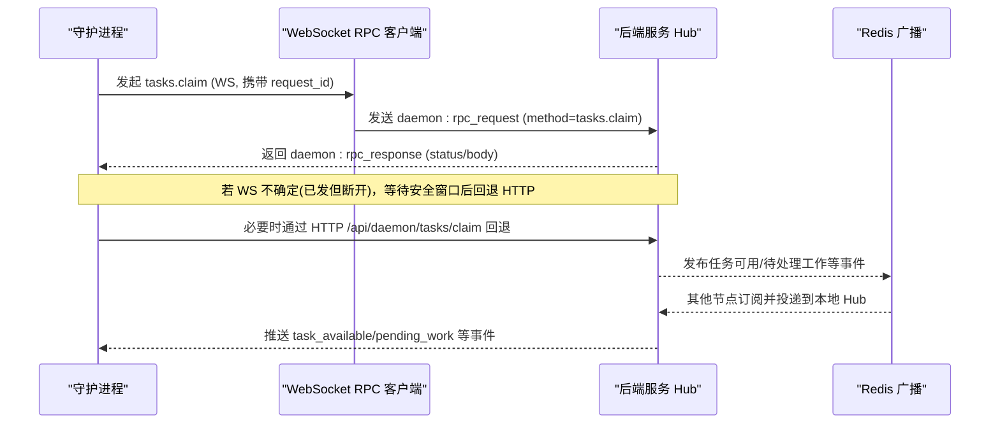
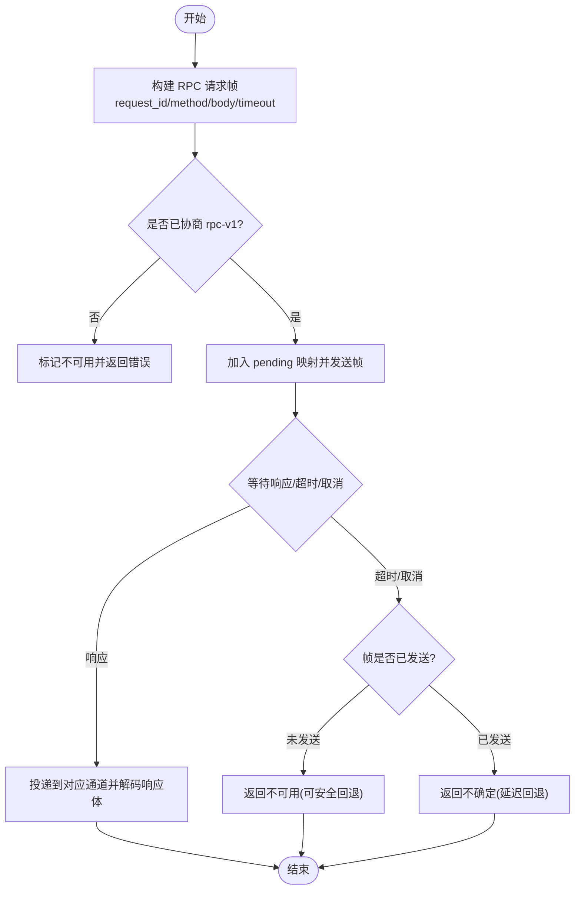
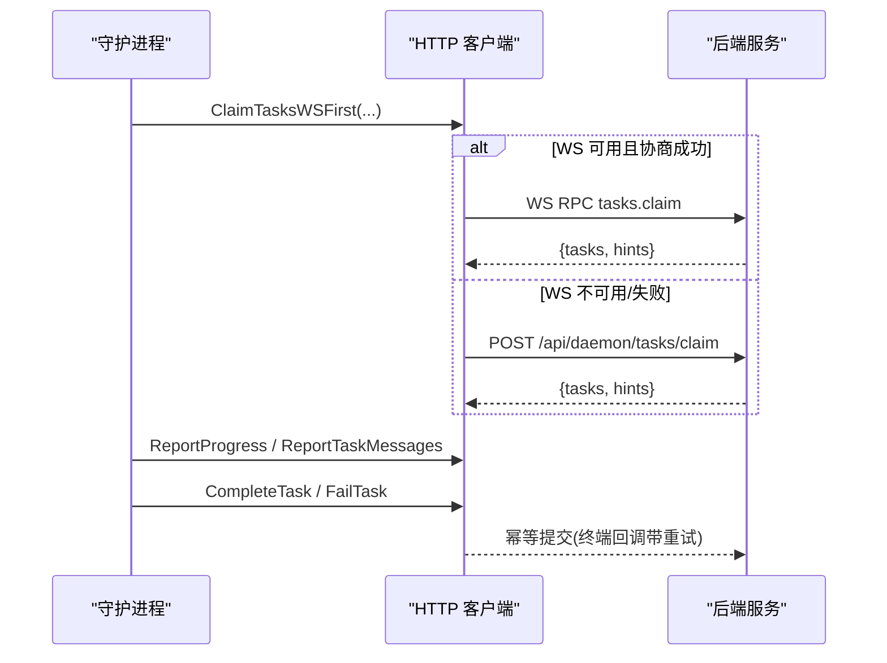
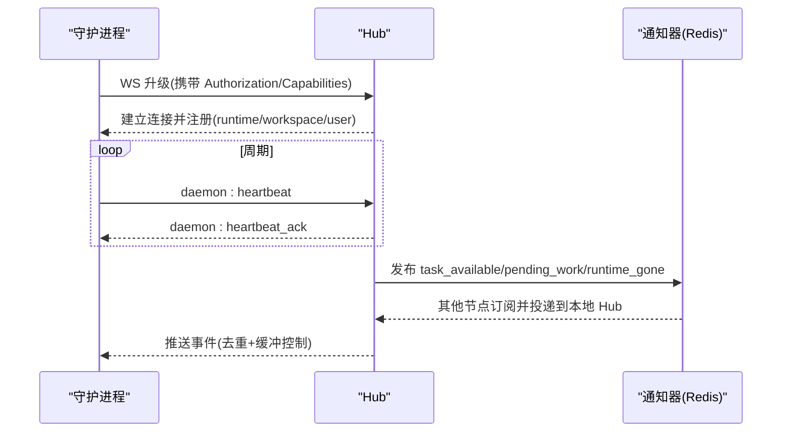
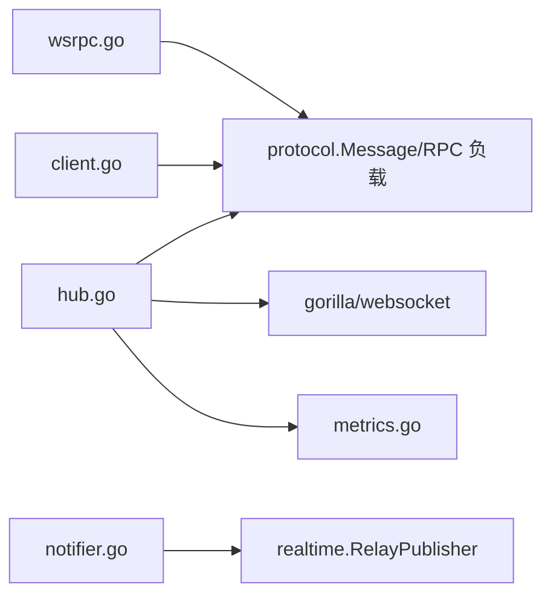

# 通信协议与消息传递

<cite>
**本文引用的文件**
- [wsrpc.go](file://server/internal/daemon/wsrpc.go)
- [client.go](file://server/internal/daemon/client.go)
- [hub.go](file://server/internal/daemonws/hub.go)
- [notifier.go](file://server/internal/daemonws/notifier.go)
- [metrics.go](file://server/internal/daemonws/metrics.go)
- [types.go](file://server/internal/daemon/types.go)
</cite>

## 目录
1. [简介](#简介)
2. [项目结构](#项目结构)
3. [核心组件](#核心组件)
4. [架构总览](#架构总览)
5. [详细组件分析](#详细组件分析)
6. [依赖关系分析](#依赖关系分析)
7. [性能考虑](#性能考虑)
8. [故障排查指南](#故障排查指南)
9. [结论](#结论)
10. [附录](#附录)

## 简介
本文件面向守护进程（Daemon）与后端服务之间的 WebSocket RPC 协议与消息传递机制，覆盖连接建立、认证与能力协商、任务调度（认领、状态更新、结果上报）、实时通信（心跳、断线重连、消息队列）、错误处理与重试、序列化格式与版本兼容、安全通信以及性能优化与监控指标。文档基于服务端与守护进程侧的现有实现进行梳理，帮助读者理解并正确使用该协议。

## 项目结构
围绕守护进程通信的关键代码分布在以下模块：
- 守护进程侧 WebSocket RPC 客户端与任务认领策略：server/internal/daemon/wsrpc.go
- 守护进程侧 HTTP 客户端与批量任务认领、心跳、进度/结果上报等：server/internal/daemon/client.go
- 服务端 WebSocket Hub、事件分发与去重、RPC 路由：server/internal/daemonws/hub.go
- 跨节点通知器（本地 Hub + Redis 广播）：server/internal/daemonws/notifier.go
- 监控指标定义与快照：server/internal/daemonws/metrics.go
- 守护进程侧数据模型（Task、AgentData、SkillData 等）：server/internal/daemon/types.go

```mermaid
graph TB
subgraph "守护进程"
DWS["WebSocket RPC 客户端<br/>wsrpc.go"]
DHTTP["HTTP 客户端<br/>client.go"]
DTYPES["数据类型<br/>types.go"]
end
subgraph "后端服务"
HUB["WebSocket Hub<br/>hub.go"]
NOTIF["通知器(本地+Redis)<br/>notifier.go"]
METRICS["指标<br/>metrics.go"]
end
DWS < --> HUB
DHTTP --> HUB
NOTIF --> HUB
HUB --> METRICS
DWS -.-> DTYPES
DHTTP -.-> DTYPES
```

**图示来源**
- [wsrpc.go:1-120](file://server/internal/daemon/wsrpc.go#L1-L120)
- [client.go:93-214](file://server/internal/daemon/client.go#L93-L214)
- [hub.go:310-443](file://server/internal/daemonws/hub.go#L310-L443)
- [notifier.go:11-49](file://server/internal/daemonws/notifier.go#L11-L49)
- [metrics.go:5-43](file://server/internal/daemonws/metrics.go#L5-L43)

**章节来源**
- [wsrpc.go:1-120](file://server/internal/daemon/wsrpc.go#L1-L120)
- [client.go:93-214](file://server/internal/daemon/client.go#L93-L214)
- [hub.go:310-443](file://server/internal/daemonws/hub.go#L310-L443)
- [notifier.go:11-49](file://server/internal/daemonws/notifier.go#L11-L49)
- [metrics.go:5-43](file://server/internal/daemonws/metrics.go#L5-L43)
- [types.go:68-176](file://server/internal/daemon/types.go#L68-L176)

## 核心组件
- 守护进程 WebSocket RPC 客户端（wsrpc.go）
  - 维护请求-响应关联（request_id），支持并发 RPC。
  - 通过 sendFrame 注入发送能力，无连接时快速失败以回退到 HTTP。
  - 提供 Call / CallIfRPCV1Supported，区分是否要求已协商 rpc-v1。
  - 对“不确定”结果（已发送但连接断开）采用安全窗口延迟 HTTP 回退，避免重复认领。
- 守护进程 HTTP 客户端（client.go）
  - 批量任务认领（tasks/claim）与旧版逐运行时认领兼容。
  - 心跳、进度、消息、完成/失败、会话钉住、工作区列表、令牌续期等接口。
  - 能力头 X-Client-Capabilities 用于功能协商（包含 RPCV1）。
- 服务端 WebSocket Hub（hub.go）
  - 管理连接、按 runtime/workspace/user 索引、推送事件（任务可用、待处理工作、运行时失效等）。
  - 安装 HeartbeatHandler 与 RPCHandler，将 daemon:rpc_request 分派到具体方法（如 tasks.claim）。
  - 写缓冲满或慢客户端会驱逐连接，保障整体吞吐。
- 通知器（notifier.go）
  - 本地 Hub 直推 + Redis 广播，保证多 API 节点下可达性。
  - 为任务可用、配置变更、待处理工作、运行时删除等事件生成帧并带 eventID 去重。
- 指标（metrics.go）
  - 连接数、唤醒发布/接收/投递命中/丢失、运行时失效事件等计数，便于观测。

**章节来源**
- [wsrpc.go:38-165](file://server/internal/daemon/wsrpc.go#L38-L165)
- [client.go:93-214](file://server/internal/daemon/client.go#L93-L214)
- [hub.go:284-389](file://server/internal/daemonws/hub.go#L284-L389)
- [notifier.go:11-49](file://server/internal/daemonws/notifier.go#L11-L49)
- [metrics.go:5-43](file://server/internal/daemonws/metrics.go#L5-L43)

## 架构总览
守护进程优先通过 WebSocket 发起 RPC（如 tasks.claim），若协商成功则走 WS；否则回退到 HTTP。服务端 Hub 负责鉴权后的连接注册、事件广播与 RPC 路由。跨节点通过 Redis 广播确保任意节点上的守护进程都能收到提示。



**图示来源**
- [wsrpc.go:307-386](file://server/internal/daemon/wsrpc.go#L307-L386)
- [hub.go:412-443](file://server/internal/daemonws/hub.go#L412-L443)
- [notifier.go:23-49](file://server/internal/daemonws/notifier.go#L23-L49)

## 详细组件分析

### 守护进程 WebSocket RPC 客户端
- 设计要点
  - 每个调用生成唯一 request_id，并在 pending map 中挂起响应通道。
  - 发送前可取消（cancel），避免在超时/取消后仍发出导致“不确定”结果。
  - 支持两种调用路径：Call（通用）与 CallIfRPCV1Supported（仅当当前连接明确协商了 rpc-v1）。
  - 超时策略：使用 serverTimeout + grace 等待响应，防止过早回退造成重复认领。
- 关键流程
  - 构造 Message{Type=EventDaemonRPCRequest, Payload=RPCRequestPayload}。
  - 发送后等待响应或超时/取消；未知 request_id 的响应直接丢弃。
  - 对“不确定”场景设置短期禁止立即 HTTP 回退的时间窗，避免双认领。



**图示来源**
- [wsrpc.go:161-284](file://server/internal/daemon/wsrpc.go#L161-L284)

**章节来源**
- [wsrpc.go:38-165](file://server/internal/daemon/wsrpc.go#L38-L165)
- [wsrpc.go:161-284](file://server/internal/daemon/wsrpc.go#L161-L284)
- [wsrpc.go:307-386](file://server/internal/daemon/wsrpc.go#L307-L386)

### 任务调度消息（认领、状态更新、结果报告）
- 任务认领
  - WS-first 策略：优先通过 WS 的 tasks.claim 方法执行；若协商失败或返回错误，回退到 HTTP 批量认领端点。
  - 若 WS 结果不确定（已发送但连接断开），延迟一段时间再尝试 HTTP 回退，避免重复认领。
  - 若服务器不支持批量端点（404），降级为旧版逐运行时认领。
- 状态更新与结果报告
  - 进度上报：/api/daemon/tasks/{id}/progress
  - 批量消息上报：/api/daemon/tasks/{id}/messages
  - 完成/失败：/api/daemon/tasks/{id}/complete 与 /api/daemon/tasks/{id}/fail
  - 会话钉住：/api/daemon/tasks/{id}/session
  - 取消确认：/api/daemon/tasks/{id}/cancel-ack（幂等，保留分支/工作目录信息）
- 数据模型
  - Task、AgentData、SkillData、TaskUsageEntry 等由 types.go 定义，承载任务上下文、技能、用量等信息。



**图示来源**
- [wsrpc.go:307-386](file://server/internal/daemon/wsrpc.go#L307-L386)
- [client.go:226-352](file://server/internal/daemon/client.go#L226-L352)
- [client.go:501-584](file://server/internal/daemon/client.go#L501-L584)
- [types.go:68-176](file://server/internal/daemon/types.go#L68-L176)

**章节来源**
- [wsrpc.go:307-386](file://server/internal/daemon/wsrpc.go#L307-L386)
- [client.go:226-352](file://server/internal/daemon/client.go#L226-L352)
- [client.go:501-584](file://server/internal/daemon/client.go#L501-L584)
- [types.go:68-176](file://server/internal/daemon/types.go#L68-L176)

### 实时通信机制（心跳、断线重连、消息队列）
- 心跳保持
  - 守护进程周期性发送心跳；服务端 Hub 安装 HeartbeatHandler 处理 daemon:heartbeat，并返回 ack。
  - 若 WS 心跳不可用，守护进程回退到 HTTP 心跳，由定时器驱动。
- 断线重连
  - Hub 在连接关闭时清理索引；守护进程 wsRPCClient.attach(nil) 清空能力与 pending，后续调用快速失败直至新连接建立并完成 rpc-v1 握手。
- 消息队列与提示
  - Hub 维护 per-client 写缓冲（send chan []byte），非阻塞 trySend；缓冲满或慢客户端会被驱逐。
  - 通过 notifier 向本地 Hub 与 Redis 广播任务可用、待处理工作、运行时配置变更、运行时删除等事件，实现跨节点可达。



**图示来源**
- [hub.go:310-443](file://server/internal/daemonws/hub.go#L310-L443)
- [notifier.go:23-49](file://server/internal/daemonws/notifier.go#L23-L49)
- [wsrpc.go:106-137](file://server/internal/daemon/wsrpc.go#L106-L137)

**章节来源**
- [hub.go:310-443](file://server/internal/daemonws/hub.go#L310-L443)
- [notifier.go:23-49](file://server/internal/daemonws/notifier.go#L23-L49)
- [wsrpc.go:106-137](file://server/internal/daemon/wsrpc.go#L106-L137)

### 错误处理与重试机制
- 网络异常与超时
  - WS 调用在超时或取消时，根据帧是否已发送决定返回“不可用”或“不确定”，从而决定是否允许 HTTP 回退。
  - 批量认领请求有独立短超时（batchClaimRequestTimeout），避免长尾影响所有运行时。
- 幂等性保证
  - 终端回调（complete/fail/cancel-ack）使用带重试的提交，服务端不覆盖已有值，确保多次提交安全。
  - 任务/运行时不存在等 404 语义被识别，触发本地清理或中断。
- 兼容性降级
  - 若服务器不支持批量认领端点（404），自动降级为旧版逐运行时认领。
  - 工作区列表端点 404 时切换到旧版全量接口。

**章节来源**
- [wsrpc.go:161-284](file://server/internal/daemon/wsrpc.go#L161-L284)
- [client.go:226-352](file://server/internal/daemon/client.go#L226-L352)
- [client.go:474-584](file://server/internal/daemon/client.go#L474-L584)
- [client.go:691-757](file://server/internal/daemon/client.go#L691-L757)

### 消息序列化格式与版本兼容
- 消息信封
  - WS 消息类型为 protocol.Message，包含 Type 与 Payload。RPC 请求使用 EventDaemonRPCRequest，负载为 RPCRequestPayload（含 request_id、method、body、timeout_ms）。
- JSON 结构与字段
  - 任务相关数据结构（Task、AgentData、SkillData、TaskUsageEntry 等）在 types.go 中定义，JSON 字段名稳定，新增字段可选，保证向后兼容。
- 能力协商
  - 守护进程通过 X-Client-Capabilities 声明支持的能力（包括 DaemonCapabilityRPCV1），服务端据此启用 WS-only 调度元数据与 RPC 路由。

**章节来源**
- [wsrpc.go:181-205](file://server/internal/daemon/wsrpc.go#L181-L205)
- [types.go:68-176](file://server/internal/daemon/types.go#L68-L176)
- [client.go:184-214](file://server/internal/daemon/client.go#L184-L214)

### 安全通信机制
- 令牌验证
  - 守护进程在 HTTP 请求中携带 Authorization: Bearer token；Hub 在升级前已鉴权，连接范围限定于 RuntimeIDs/WorkspaceIDs/UserID。
- 加密传输
  - WebSocket 升级在 HTTPS 之上进行，保证传输层加密。
- 访问控制
  - Hub 维护 ClientIdentity，限制每连接可操作的 runtime/workspace/user 范围；RPCHandler 与 HeartbeatHandler 均基于该身份进行授权校验。

**章节来源**
- [hub.go:22-42](file://server/internal/daemonws/hub.go#L22-L42)
- [hub.go:412-443](file://server/internal/daemonws/hub.go#L412-L443)
- [client.go:216-224](file://server/internal/daemon/client.go#L216-L224)

### 性能优化策略
- 连接池与缓冲
  - HTTP 客户端使用默认 Transport 克隆，支持连接复用；Hub 每连接维护 send 缓冲，非阻塞写入，慢客户端驱逐。
- 批量处理
  - 批量任务认领减少往返；批量消息上报聚合 agent 输出。
- 流量控制
  - 每连接并发 RPC 上限（maxInFlightRPCPerClient）；写缓冲满时拒绝并统计慢驱逐。
- 超时与预算
  - 批量认领请求级短超时；WS 调用使用 serverTimeout + grace，避免误判不确定结果为失败。

**章节来源**
- [client.go:121-147](file://server/internal/daemon/client.go#L121-L147)
- [client.go:260-310](file://server/internal/daemon/client.go#L260-L310)
- [hub.go:174-193](file://server/internal/daemonws/hub.go#L174-L193)
- [hub.go:298-301](file://server/internal/daemonws/hub.go#L298-L301)
- [wsrpc.go:240-284](file://server/internal/daemon/wsrpc.go#L240-L284)

### 调试工具与监控指标
- 指标项
  - 连接：ConnectsTotal、DisconnectsTotal、ActiveConnections
  - 唤醒：WakeupPublishedTotal、WakeupPublishErrors、WakeupReceivedTotal、WakeupDeliveredHit/Miss
  - 运行时失效：RuntimeGoneDeliveredHit/Miss、RuntimeGonePublishedTotal、RuntimeGonePublishErrors、RuntimeGoneReceivedTotal
  - 慢驱逐：SlowEvictionsTotal
- 使用方式
  - 通过 metrics.M.Snapshot() 获取当前指标快照，结合日志与告警观察 Hub 健康度与投递效率。

**章节来源**
- [metrics.go:5-43](file://server/internal/daemonws/metrics.go#L5-L43)

## 依赖关系分析
- 守护进程侧
  - wsrpc.go 依赖 protocol 包的消息类型与 RPC 负载结构；client.go 提供 HTTP 能力与能力头协商。
- 服务端侧
  - hub.go 依赖 gorilla/websocket 与 protocol 包；notifier.go 依赖 realtime.RelayPublisher 进行跨节点广播；metrics.go 提供原子计数器。
- 耦合与内聚
  - Hub 与 Notifier 解耦：Notifier 只负责构造帧与发布，Hub 专注连接与投递。
  - 守护进程 wsrpc 与 client 职责清晰：WS 优先、HTTP 兜底，互不侵入。



**图示来源**
- [wsrpc.go:1-13](file://server/internal/daemon/wsrpc.go#L1-L13)
- [client.go:1-20](file://server/internal/daemon/client.go#L1-L20)
- [hub.go:1-14](file://server/internal/daemonws/hub.go#L1-L14)
- [notifier.go:1-9](file://server/internal/daemonws/notifier.go#L1-L9)
- [metrics.go:1-4](file://server/internal/daemonws/metrics.go#L1-L4)

**章节来源**
- [wsrpc.go:1-13](file://server/internal/daemon/wsrpc.go#L1-L13)
- [client.go:1-20](file://server/internal/daemon/client.go#L1-L20)
- [hub.go:1-14](file://server/internal/daemonws/hub.go#L1-L14)
- [notifier.go:1-9](file://server/internal/daemonws/notifier.go#L1-L9)
- [metrics.go:1-4](file://server/internal/daemonws/metrics.go#L1-L4)

## 性能考虑
- 建议
  - 合理设置 batchClaimRequestTimeout 与 WS grace，平衡吞吐与可靠性。
  - 监控 SlowEvictionsTotal 与 WakeupDeliveredMiss，及时扩容或优化下游处理。
  - 利用能力协商逐步启用 WS-only 特性，降低 HTTP 压力。
  - 对大体积资源（如技能包）使用无固定超时的 bundleClient，并通过 context 控制整体预算。

[本节为通用指导，无需特定文件引用]

## 故障排查指南
- 常见问题定位
  - WS 不可用：检查 Capabilities 是否包含 RPCV1，确认连接已 attach 且未 detach。
  - 重复认领：关注“不确定”错误与安全窗口，避免立即回退 HTTP。
  - 慢客户端驱逐：观察 SlowEvictionsTotal，必要时调整客户端处理能力。
  - 404 兼容：批量端点 404 时自动降级，确认旧版链路正常。
- 诊断步骤
  - 查看 Hub 指标快照，核对连接数、投递命中率。
  - 检查守护进程日志中的 WS 错误与回退决策。
  - 核对任务状态与终端回调幂等性，确保 complete/fail 多次提交安全。

**章节来源**
- [wsrpc.go:161-284](file://server/internal/daemon/wsrpc.go#L161-L284)
- [client.go:260-352](file://server/internal/daemon/client.go#L260-L352)
- [metrics.go:26-43](file://server/internal/daemonws/metrics.go#L26-L43)

## 结论
本通信协议通过 WS-first 的 RPC 与 HTTP 兜底策略，在保证可靠性的同时提升低延迟交互体验；Hub 的事件广播与去重机制保障了多节点下的可达性与一致性；完善的错误处理、幂等设计与能力协商使系统具备良好兼容性与可观测性。建议在生产环境中持续监控指标并结合业务负载调优超时与批量参数。

[本节为总结，无需特定文件引用]

## 附录
- 关键端点与方法
  - WS RPC：daemon:rpc_request(method=tasks.claim)
  - HTTP 批量认领：POST /api/daemon/tasks/claim
  - 心跳：POST /api/daemon/heartbeat
  - 进度/消息/完成/失败：/api/daemon/tasks/{id}/{progress,messages,complete,fail}
- 能力头
  - X-Client-Capabilities：包含 DaemonCapabilityRPCV1 等能力标识

[本节为补充说明，无需特定文件引用]