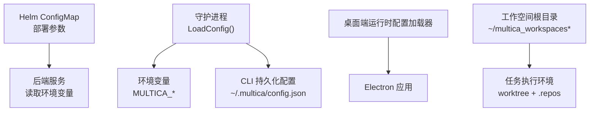
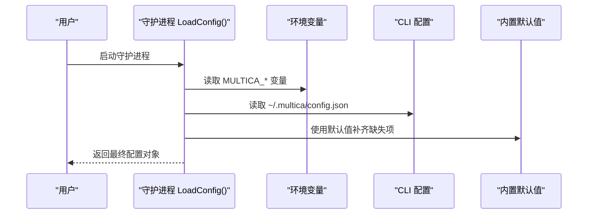
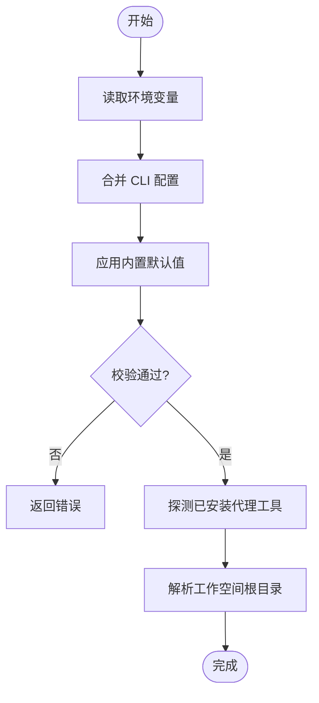
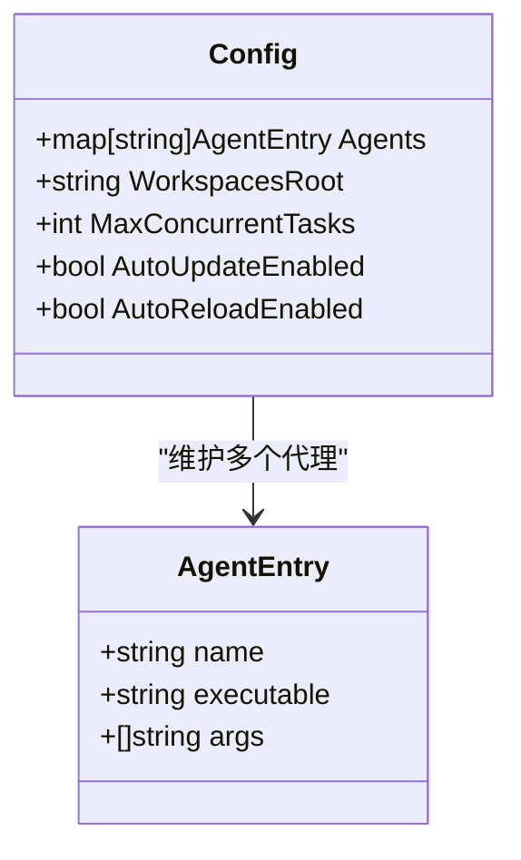
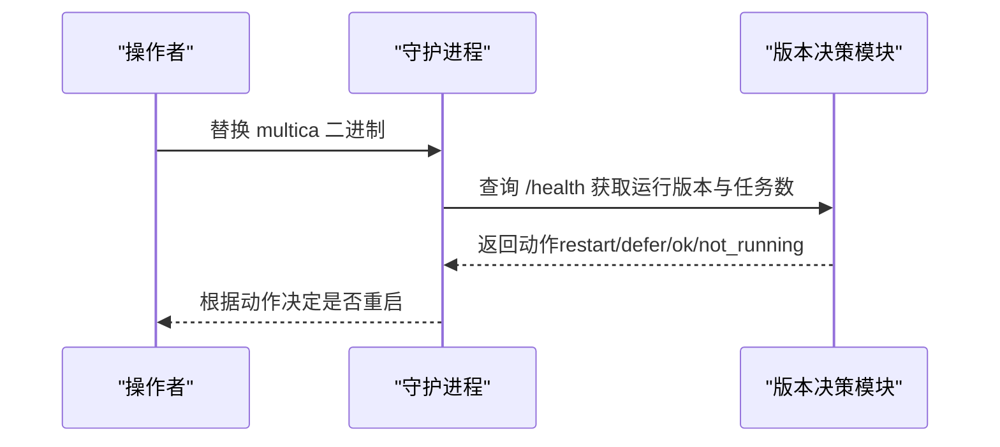
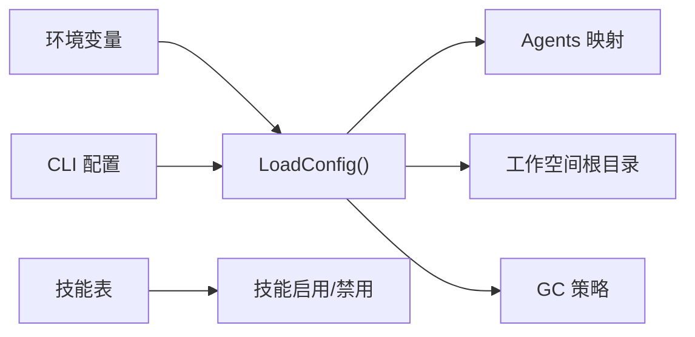

# 配置管理与环境设置

<cite>
**本文引用的文件**
- [server/internal/daemon/config.go](file://server/internal/daemon/config.go)
- [server/internal/cli/config.go](file://server/internal/cli/config.go)
- [apps/docs/content/docs/environment-variables.mdx](file://apps/docs/content/docs/environment-variables.mdx)
- [deploy/helm/multica/templates/configmap.yaml](file://deploy/helm/multica/templates/configmap.yaml)
- [SELF_HOSTING.md](file://SELF_HOSTING.md)
- [CONTRIBUTING.md](file://CONTRIBUTING.md)
- [server/pkg/featureflag/env_provider.go](file://server/pkg/featureflag/env_provider.go)
- [server/pkg/plugincontract/manifest.go](file://server/pkg/plugincontract/manifest.go)
- [server/pkg/db/queries/skill.sql](file://server/pkg/db/queries/skill.sql)
- [server/migrations/206_agent_disabled_runtime_skills.up.sql](file://server/migrations/206_agent_disabled_runtime_skills.up.sql)
- [apps/desktop/src/main/runtime-config-loader.ts](file://apps/desktop/src/main/runtime-config-loader.ts)
- [apps/desktop/src/main/version-decision.ts](file://apps/desktop/src/main/version-decision.ts)
</cite>

## 目录
1. [简介](#简介)
2. [项目结构](#项目结构)
3. [核心组件](#核心组件)
4. [架构总览](#架构总览)
5. [详细组件分析](#详细组件分析)
6. [依赖关系分析](#依赖关系分析)
7. [性能考虑](#性能考虑)
8. [故障排查指南](#故障排查指南)
9. [结论](#结论)
10. [附录](#附录)

## 简介
本文件面向守护进程（Daemon）的配置管理与环境设置，覆盖以下主题：
- 配置文件结构与默认值（YAML/JSON、字段说明）
- 环境变量配置（必需、可选、敏感信息处理）
- 工作空间配置（仓库绑定、权限与存储路径）
- 智能体配置（运行时选择、模型配置、技能包管理）
- 动态配置更新机制（热重载、配置验证、回滚策略）
- 多环境配置管理（开发、测试、生产差异化）
- 配置最佳实践（模板、版本控制、审计日志）
- 配置故障排查与调试方法

## 项目结构
守护进程配置由“环境变量 + CLI 持久化配置 + Helm ConfigMap”共同构成。后端通过 Helm 的 ConfigMap 注入服务器端运行参数；守护进程在本地读取环境变量与 `~/.multica/config.json` 进行合并解析；桌面端提供运行时配置的加载与默认值填充。

图表来源
- [deploy/helm/multica/templates/configmap.yaml:1-37](file://deploy/helm/multica/templates/configmap.yaml#L1-L37)
- [server/internal/daemon/config.go:100-160](file://server/internal/daemon/config.go#L100-L160)
- [server/internal/cli/config.go:22-166](file://server/internal/cli/config.go#L22-L166)
- [apps/docs/content/docs/environment-variables.mdx:221-257](file://apps/docs/content/docs/environment-variables.mdx#L221-L257)

章节来源
- [deploy/helm/multica/templates/configmap.yaml:1-37](file://deploy/helm/multica/templates/configmap.yaml#L1-L37)
- [server/internal/daemon/config.go:100-160](file://server/internal/daemon/config.go#L100-L160)
- [server/internal/cli/config.go:22-166](file://server/internal/cli/config.go#L22-L166)
- [apps/docs/content/docs/environment-variables.mdx:221-257](file://apps/docs/content/docs/environment-variables.mdx#L221-L257)

## 核心组件
- 守护进程配置加载器：负责从环境变量、CLI 持久化配置和内置默认值中解析守护进程行为（轮询、心跳、超时、GC、自动更新/重载等）。
- CLI 持久化配置：以 JSON 形式保存常用守护进程参数，支持按 profile 隔离。
- 环境变量参考：官方文档列出服务端与守护进程相关的环境变量及默认值。
- Helm ConfigMap：将后端所需环境变量注入到容器环境中。
- 桌面端运行时配置加载器：为 Electron 提供运行时配置加载、默认值填充与错误处理。

章节来源
- [server/internal/daemon/config.go:195-648](file://server/internal/daemon/config.go#L195-L648)
- [server/internal/cli/config.go:223-397](file://server/internal/cli/config.go#L223-L397)
- [apps/docs/content/docs/environment-variables.mdx:221-257](file://apps/docs/content/docs/environment-variables.mdx#L221-L257)
- [deploy/helm/multica/templates/configmap.yaml:1-37](file://deploy/helm/multica/templates/configmap.yaml#L1-L37)
- [apps/desktop/src/main/runtime-config-loader.ts:1-42](file://apps/desktop/src/main/runtime-config-loader.ts#L1-L42)

## 架构总览
守护进程启动时，配置优先级为：命令行覆盖 > 环境变量 > CLI 持久化配置 > 内置默认值。守护进程会探测已安装的 AI 工具（如 Claude、Codex、OpenCode 等），并据此构建 Agents 映射。工作空间根目录用于存放每个任务的执行环境，并通过 git worktree 与共享裸缓存 `.repos` 实现高效复用。

图表来源
- [server/internal/daemon/config.go:195-648](file://server/internal/daemon/config.go#L195-L648)
- [server/internal/cli/config.go:305-397](file://server/internal/cli/config.go#L305-L397)

## 详细组件分析

### 守护进程配置结构与环境变量
- 关键配置项包括：服务器地址、设备名、运行时名称、并发任务上限、健康检查端口、GC 策略、自动更新/重载开关、各代理工具的超时与空闲看门狗、工作空间根目录等。
- 环境变量命名规范统一以 `MULTICA_` 前缀，涵盖轮询间隔、心跳间隔、Agent 超时、空闲看门狗、Codex 语义不活跃超时、握手超时、GC 策略、自动更新/重载、工作空间根目录等。
- 敏感信息处理：服务端文档强调某些公开配置键不应包含凭据；守护进程侧对部分配置进行脱敏或限制传播，避免泄露。

图表来源
- [server/internal/daemon/config.go:195-648](file://server/internal/daemon/config.go#L195-L648)
- [apps/docs/content/docs/environment-variables.mdx:221-257](file://apps/docs/content/docs/environment-variables.mdx#L221-L257)

章节来源
- [server/internal/daemon/config.go:100-160](file://server/internal/daemon/config.go#L100-L160)
- [server/internal/daemon/config.go:195-648](file://server/internal/daemon/config.go#L195-L648)
- [apps/docs/content/docs/environment-variables.mdx:221-257](file://apps/docs/content/docs/environment-variables.mdx#L221-L257)

### 工作空间配置（仓库绑定、权限与存储路径）
- 工作空间根目录默认位于用户主目录下，可按 profile 隔离；可通过环境变量或 CLI 覆盖。
- 任务执行环境基于 git worktree 与共享裸缓存 `.repos`，同一 (agent, issue) 的多轮复用同一工作目录，不同任务并行隔离。
- 本地目录绑定仅对绑定的守护进程生效；安全规则拒绝系统根目录、用户家目录自身及常见系统目录；符号链接会先解析真实路径再校验。

章节来源
- [server/internal/daemon/config.go:719-754](file://server/internal/daemon/config.go#L719-L754)
- [apps/docs/content/docs/project-resources.mdx:23-37](file://apps/docs/content/docs/project-resources.mdx#L23-L37)
- [apps/docs/content/docs/project-resources.ko.mdx:51-59](file://apps/docs/content/docs/project-resources.ko.mdx#L51-L59)

### 智能体配置（运行时选择、模型配置与技能包管理）
- 守护进程启动时会探测 PATH 上的多种 AI 工具，形成 Agents 映射；可通过 CLI 配置中的 backends 与 profile command overrides 指定特定机器的可执行路径。
- 模型与命令路径可通过 `MULTICA_<PROVIDER>_PATH` 与 `MULTICA_<PROVIDER>_MODEL` 覆盖；部分工具还支持全局参数注入（如 `MULTICA_CLAUDE_ARGS`）。
- 技能包管理：数据库中存在 agent_skill 表，支持启用/禁用技能、按工作区列举技能；迁移记录显示存在“禁用运行时技能”的字段。

图表来源
- [server/internal/daemon/config.go:100-160](file://server/internal/daemon/config.go#L100-L160)
- [apps/docs/content/docs/environment-variables.mdx:249-257](file://apps/docs/content/docs/environment-variables.mdx#L249-L257)
- [server/pkg/db/queries/skill.sql:140-170](file://server/pkg/db/queries/skill.sql#L140-L170)
- [server/migrations/206_agent_disabled_runtime_skills.up.sql:1-2](file://server/migrations/206_agent_disabled_runtime_skills.up.sql#L1-L2)

章节来源
- [server/internal/daemon/config.go:256-261](file://server/internal/daemon/config.go#L256-L261)
- [apps/docs/content/docs/environment-variables.mdx:249-257](file://apps/docs/content/docs/environment-variables.mdx#L249-L257)
- [server/pkg/db/queries/skill.sql:140-170](file://server/pkg/db/queries/skill.sql#L140-L170)
- [server/migrations/206_agent_disabled_runtime_skills.up.sql:1-2](file://server/migrations/206_agent_disabled_runtime_skills.up.sql#L1-L2)

### 动态配置更新机制（热重载、配置验证与回滚策略）
- 自动重载：守护进程支持检测磁盘上二进制变化后自动重启进入新版本；可通过环境变量或 CLI 配置关闭。
- 自动更新：守护进程可定期检查 GitHub 发布并自更新；默认在官方云端开启、自托管默认关闭，可通过环境变量切换。
- 配置验证：CLI 配置写入采用原子写（临时文件 + rename），确保一致性；守护进程在解析时长、布尔、整数等类型时进行严格校验。
- 回滚策略：Kubernetes 场景下可使用 helm rollback 回滚到上一版本；守护进程侧若检测到版本不一致且无活动任务则安全重启。

图表来源
- [apps/desktop/src/main/version-decision.ts:1-37](file://apps/desktop/src/main/version-decision.ts#L1-L37)
- [server/internal/daemon/config.go:570-600](file://server/internal/daemon/config.go#L570-L600)
- [server/internal/cli/config.go:122-145](file://server/internal/cli/config.go#L122-L145)

章节来源
- [apps/desktop/src/main/version-decision.ts:1-37](file://apps/desktop/src/main/version-decision.ts#L1-L37)
- [server/internal/daemon/config.go:570-600](file://server/internal/daemon/config.go#L570-L600)
- [server/internal/cli/config.go:122-145](file://server/internal/cli/config.go#L122-L145)

### 多环境配置管理（开发、测试、生产）
- 开发/工作树：推荐使用 `.env`（主检出）与 `.env.worktree`（工作树）分离配置，避免误用主数据库；生成脚本会为工作树生成独立端口与数据库名。
- 生产：必须设置必要的环境变量（如数据库连接、JWT 密钥、前端域名等），并通过 Helm ConfigMap 注入。
- 差异化管理：通过环境变量与 CLI 配置区分不同环境的 URL、端口、并发度、GC 策略与自动更新/重载行为。

章节来源
- [CONTRIBUTING.md:50-110](file://CONTRIBUTING.md#L50-L110)
- [apps/docs/content/docs/environment-variables.mdx:12-27](file://apps/docs/content/docs/environment-variables.mdx#L12-L27)
- [deploy/helm/multica/templates/configmap.yaml:1-37](file://deploy/helm/multica/templates/configmap.yaml#L1-L37)

### 插件配置与字段顺序保持
- 插件清单（Manifest）的 config schema 解析保持声明顺序，确保 UI 表单渲染一致；字段数量、选项数量与显示文本长度均有限制。
- 该机制有助于在多环境或多版本升级时保持配置展示稳定。

章节来源
- [server/pkg/plugincontract/manifest.go:312-353](file://server/pkg/plugincontract/manifest.go#L312-L353)
- [server/pkg/plugincontract/manifest.go:494-531](file://server/pkg/plugincontract/manifest.go#L494-L531)

### 特性开关与环境提供者
- 特性开关通过环境变量提供，支持前缀约定（如 `FF_`），空字符串视为关闭，便于在不同环境快速启用/禁用功能。

章节来源
- [server/pkg/featureflag/env_provider.go:38-74](file://server/pkg/featureflag/env_provider.go#L38-L74)

## 依赖关系分析
- 守护进程配置加载依赖环境变量与 CLI 配置；CLI 配置读写遵循 profile 隔离与任务级私有根目录（TaskConfigRootEnv）的安全约束。
- 工作空间根目录解析与 GC 策略相互影响：GC 清理受 TTL 与模式匹配影响，同时保留必要的会话与记忆数据。
- 智能体发现与配置依赖 PATH 与 backends 覆盖；技能包启用状态由数据库驱动。

图表来源
- [server/internal/daemon/config.go:195-648](file://server/internal/daemon/config.go#L195-L648)
- [server/internal/cli/config.go:223-397](file://server/internal/cli/config.go#L223-L397)
- [server/pkg/db/queries/skill.sql:140-170](file://server/pkg/db/queries/skill.sql#L140-L170)

章节来源
- [server/internal/daemon/config.go:195-648](file://server/internal/daemon/config.go#L195-L648)
- [server/internal/cli/config.go:223-397](file://server/internal/cli/config.go#L223-L397)
- [server/pkg/db/queries/skill.sql:140-170](file://server/pkg/db/queries/skill.sql#L140-L170)

## 性能考虑
- 并发任务上限：通过 `MULTICA_DAEMON_MAX_CONCURRENT_TASKS` 控制，需结合机器资源与代理工具能力调优。
- 空闲看门狗与工具看门狗：合理设置 `MULTICA_AGENT_IDLE_WATCHDOG` 与 `MULTICA_AGENT_TOOL_WATCHDOG`，避免长时间占用并发槽位。
- GC 策略：调整 `MULTICA_GC_*` 系列变量，平衡磁盘占用与恢复成本；注意保留必要的会话与记忆数据。
- 自动更新/重载：在生产环境谨慎开启自动更新；自托管建议手动管控版本。

[本节为通用指导，不直接分析具体文件]

## 故障排查指南
- 缺少环境变量：确认 `.env` 或 `.env.worktree` 是否存在，检查 `DATABASE_URL`、`PORT`、`FRONTEND_PORT` 等关键变量。
- 守护进程未找到代理工具：确保至少一个 AI 工具安装在 PATH 上，并满足版本要求。
- 工作空间路径问题：检查 `MULTICA_WORKSPACES_ROOT` 是否指向有效目录；任务内使用专用环境变量避免误读。
- 自动更新/重载异常：查看守护进程日志，确认网络可达与版本比对逻辑；必要时关闭自动更新/重载。
- 插件配置错误：检查 Manifest 的 config schema 是否符合限制（字段数量、选项数量、显示文本长度）。

章节来源
- [CONTRIBUTING.md:458-530](file://CONTRIBUTING.md#L458-L530)
- [server/internal/daemon/config.go:256-261](file://server/internal/daemon/config.go#L256-L261)
- [server/pkg/plugincontract/manifest.go:494-531](file://server/pkg/plugincontract/manifest.go#L494-L531)

## 结论
守护进程配置体系围绕“环境变量 + CLI 持久化配置 + 内置默认值”构建，兼顾灵活性与安全性。通过 Helm ConfigMap 注入服务端参数，守护进程在本地完成解析与校验，并以工作空间根目录为核心组织任务执行环境。智能体配置支持多工具接入与技能包管理，动态更新机制保障版本演进的可控性。多环境管理借助 `.env` 与工作树隔离，配合严格的字段校验与 GC 策略，确保稳定性与可维护性。

[本节为总结，不直接分析具体文件]

## 附录
- 推荐实践
  - 使用 `.env` 与 `.env.worktree` 分离开发与工作树配置，避免误连主数据库。
  - 生产环境务必设置必要的环境变量（数据库、JWT、前端域名等），并通过 Helm ConfigMap 注入。
  - 将敏感信息放入 Secret 或环境变量，避免写入公开配置键。
  - 使用 CLI 配置持久化常用守护进程参数，减少重复输入。
  - 定期审查 GC 策略与看门狗阈值，平衡资源占用与恢复成本。
  - 在 Kubernetes 中使用 helm rollback 作为回滚策略，确保升级失败时可快速恢复。

[本节为通用指导，不直接分析具体文件]