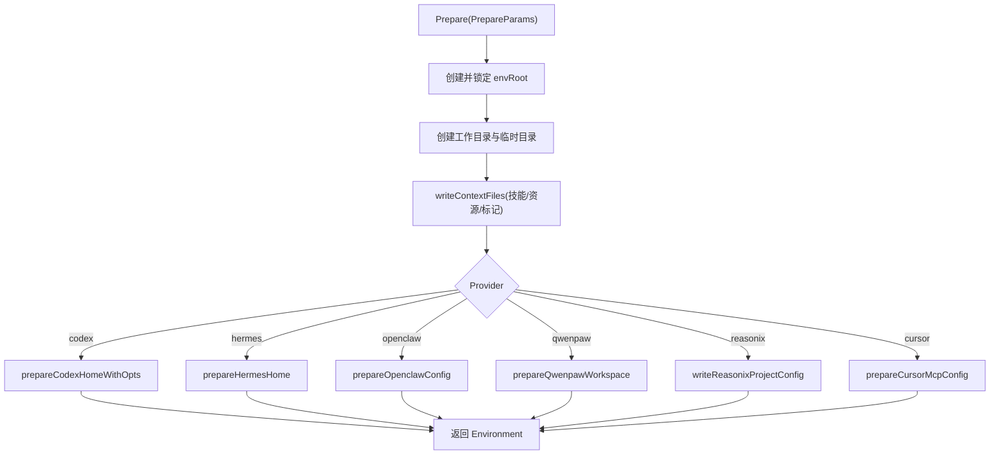
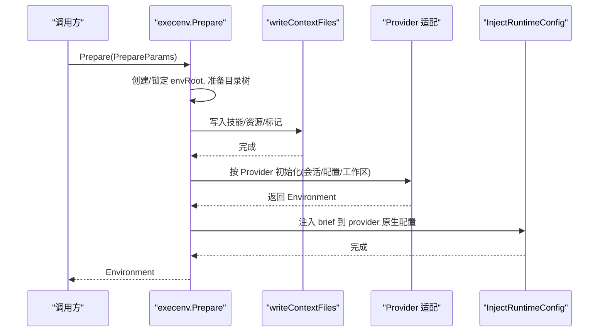
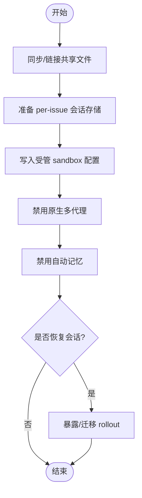
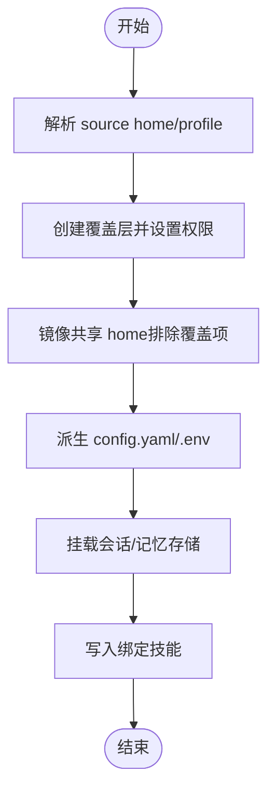
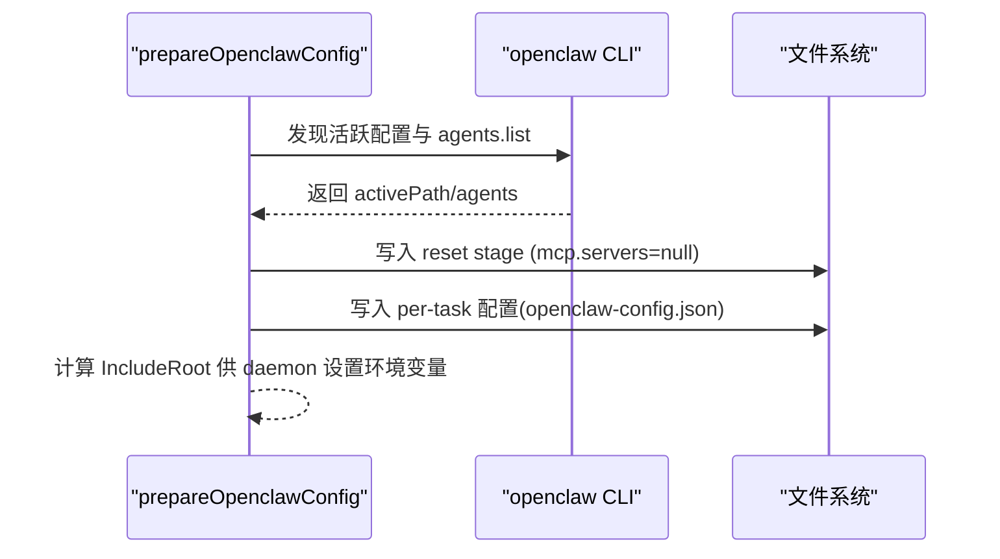
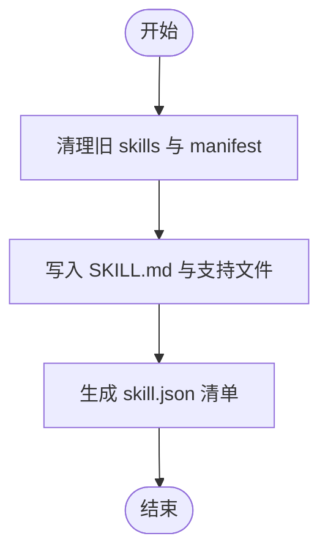
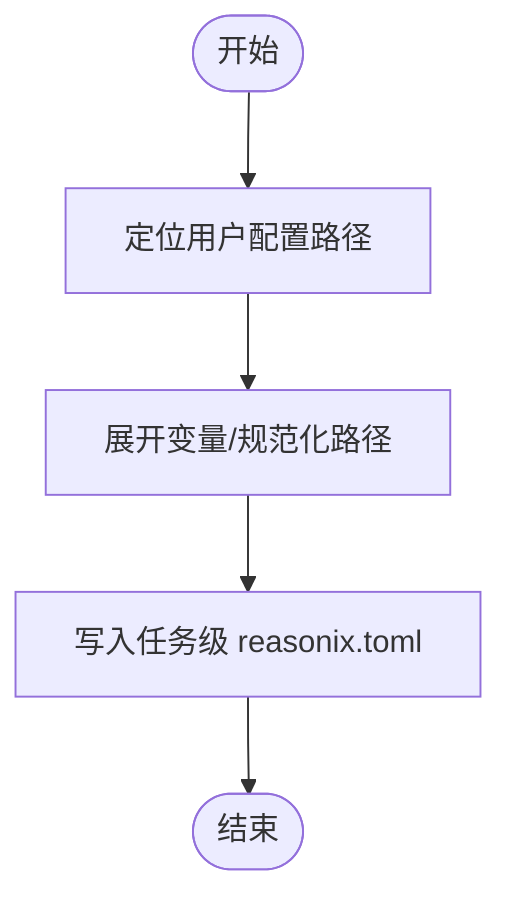
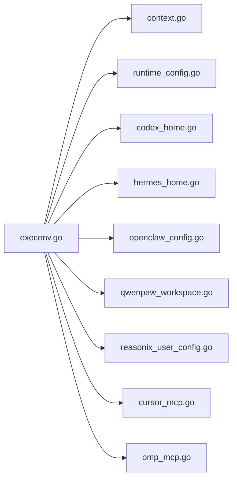

# Provider 适配器

<cite>
**本文引用的文件**
- [execenv.go](file://server/internal/daemon/execenv/execenv.go)
- [context.go](file://server/internal/daemon/execenv/context.go)
- [runtime_config.go](file://server/internal/daemon/execenv/runtime_config.go)
- [codex_home.go](file://server/internal/daemon/execenv/codex_home.go)
- [hermes_home.go](file://server/internal/daemon/execenv/hermes_home.go)
- [openclaw_config.go](file://server/internal/daemon/execenv/openclaw_config.go)
- [qwenpaw_workspace.go](file://server/internal/daemon/execenv/qwenpaw_workspace.go)
- [reasonix_user_config.go](file://server/internal/daemon/execenv/reasonix_user_config.go)
- [omp_mcp.go](file://server/internal/daemon/execenv/omp_mcp.go)
- [cursor_mcp.go](file://server/internal/daemon/execenv/cursor_mcp.go)
</cite>

## 目录
1. [简介](#简介)
2. [项目结构](#项目结构)
3. [核心组件](#核心组件)
4. [架构总览](#架构总览)
5. [详细组件分析](#详细组件分析)
6. [依赖关系分析](#依赖关系分析)
7. [性能考虑](#性能考虑)
8. [故障排查指南](#故障排查指南)
9. [结论](#结论)
10. [附录](#附录)

## 简介
本文件面向“Provider 适配器”主题，系统性说明 execenv 如何为约 26 种编码智能体 CLI 提供统一的任务执行环境抽象与装配能力。内容涵盖：
- 统一的 Prepare/Reuse 流程、工作目录与隔离策略
- 各 provider 的特定配置与初始化（Codex、Hermes、OpenClaw、QwenPaw、Reasonix 等）
- 用户配置管理与默认值处理机制
- MCP（Model Context Protocol）集成：服务器发现、工具注册与会话管理
- 侧车进程（sidecar）管理机制
- 新 provider 接入指南与最佳实践
- 配置示例与常见问题解决方案

## 项目结构
execenv 位于 server/internal/daemon/execenv，围绕“任务级隔离的执行环境”展开，核心职责包括：
- 创建并锁定任务根目录，准备 workdir/output/logs/multica-config
- 写入上下文与技能文件到 provider 原生发现路径
- 按 provider 生成或注入运行时配置（brief 与配置文件）
- 针对特定 provider 建立会话/记忆/工作区等持久化资源
- 通过 sidecar manifest 记录变更以便回滚清理

图表来源
- [execenv.go:409-744](file://server/internal/daemon/execenv/execenv.go#L409-L744)
- [context.go:121-193](file://server/internal/daemon/execenv/context.go#L121-L193)
- [codex_home.go:194-318](file://server/internal/daemon/execenv/codex_home.go#L194-L318)
- [hermes_home.go:358-439](file://server/internal/daemon/execenv/hermes_home.go#L358-L439)
- [openclaw_config.go:309-487](file://server/internal/daemon/execenv/openclaw_config.go#L309-L487)
- [qwenpaw_workspace.go:12-129](file://server/internal/daemon/execenv/qwenpaw_workspace.go#L12-L129)
- [reasonix_user_config.go:11-29](file://server/internal/daemon/execenv/reasonix_user_config.go#L11-L29)

章节来源
- [execenv.go:19-127](file://server/internal/daemon/execenv/execenv.go#L19-L127)
- [context.go:121-193](file://server/internal/daemon/execenv/context.go#L121-L193)

## 核心组件
- PrepareParams/Environment：定义准备参数与环境产物（根目录、工作目录、provider 专属路径等）
- TaskContextForEnv：任务上下文数据（仓库、技能、项目资源、渠道信息等），用于生成 brief 与侧车文件
- writeContextFiles：将技能与项目资源写入 provider 原生目录，并写入任务上下文标记
- InjectRuntimeConfig/CleanupRuntimeConfig：向 provider 原生配置文件注入/清理 brief，保证幂等与可回滚
- 各 provider 专用准备函数：Codex/Hermes/OpenClaw/QwenPaw/Reasonix/Cursor 等

章节来源
- [execenv.go:267-352](file://server/internal/daemon/execenv/execenv.go#L267-L352)
- [context.go:121-193](file://server/internal/daemon/execenv/context.go#L121-L193)
- [runtime_config.go:158-223](file://server/internal/daemon/execenv/runtime_config.go#L158-L223)

## 架构总览
execenv 作为“统一入口”，根据 Provider 分发到不同适配逻辑；同时通过 sidecar manifest 与 CleanupRuntimeConfig 保障本地目录流的回滚与幂等。

图表来源
- [execenv.go:409-744](file://server/internal/daemon/execenv/execenv.go#L409-L744)
- [context.go:121-193](file://server/internal/daemon/execenv/context.go#L121-L193)
- [runtime_config.go:158-223](file://server/internal/daemon/execenv/runtime_config.go#L158-L223)

## 详细组件分析

### Codex 适配器
- 目标：为 Codex 提供 per-task CODEX_HOME，隔离会话历史、模型缓存与多代理/记忆行为
- 关键流程：
  - 从共享 ~/.codex 同步/链接必要文件（auth.json 链接，config.toml/config.json/instructions.md 复制）
  - 设置 per-issue 会话存储，避免加载全量历史导致启动缓慢
  - 写入受管 sandbox 配置（Windows/macOS 差异化策略）
  - 禁用原生多代理与自动记忆，防止跨任务/跨工作区上下文泄漏
  - 支持 resume 场景下的 rollout 暴露与迁移

图表来源
- [codex_home.go:194-318](file://server/internal/daemon/execenv/codex_home.go#L194-L318)
- [codex_home.go:544-666](file://server/internal/daemon/execenv/codex_home.go#L544-L666)

章节来源
- [codex_home.go:17-93](file://server/internal/daemon/execenv/codex_home.go#L17-L93)
- [codex_home.go:194-318](file://server/internal/daemon/execenv/codex_home.go#L194-L318)
- [codex_home.go:544-666](file://server/internal/daemon/execenv/codex_home.go#L544-L666)

### Hermes 适配器
- 目标：构建 per-task HERMES_HOME 兼容覆盖层，使绑定技能可见且会话/记忆持久化
- 关键流程：
  - 解析平台默认 home 与 profile 选择（尊重自定义环境变量与粘性 profile）
  - 镜像共享 home（除覆盖项），派生 config.yaml（external_dirs 绝对化）、.env（固定 HERMES_HOME）
  - 挂载会话数据库 state.db 与 memories 持久化存储
  - 禁用外部 memory.provider，确保任务间隔离

图表来源
- [hermes_home.go:123-188](file://server/internal/daemon/execenv/hermes_home.go#L123-L188)
- [hermes_home.go:358-439](file://server/internal/daemon/execenv/hermes_home.go#L358-L439)
- [hermes_home.go:632-689](file://server/internal/daemon/execenv/hermes_home.go#L632-L689)

章节来源
- [hermes_home.go:15-64](file://server/internal/daemon/execenv/hermes_home.go#L15-L64)
- [hermes_home.go:358-439](file://server/internal/daemon/execenv/hermes_home.go#L358-L439)

### OpenClaw 适配器
- 目标：生成 per-task openclaw-config.json，强制 workspace 指向任务工作目录，并安全注入 MCP 服务器列表
- 关键流程：
  - 通过 CLI 发现活跃配置与 agents.list（带超时控制与缓存）
  - 当存在 managed mcp_config 时，使用 reset stage 清空用户 mcp.servers，再合并受管列表
  - 可选网关端点覆盖（host/port/token/tls）
  - 输出 IncludeRoot 以允许 $include 跨目录引用用户配置

图表来源
- [openclaw_config.go:309-487](file://server/internal/daemon/execenv/openclaw_config.go#L309-L487)
- [openclaw_config.go:537-623](file://server/internal/daemon/execenv/openclaw_config.go#L537-L623)
- [openclaw_config.go:686-772](file://server/internal/daemon/execenv/openclaw_config.go#L686-L772)

章节来源
- [openclaw_config.go:19-49](file://server/internal/daemon/execenv/openclaw_config.go#L19-L49)
- [openclaw_config.go:309-487](file://server/internal/daemon/execenv/openclaw_config.go#L309-L487)

### QwenPaw 适配器
- 目标：创建 per-task workspace，写入绑定技能与 skill.json 清单，使 QwenPaw 原生发现生效
- 关键流程：
  - 清理旧 skills 与 manifest，重建技能目录与 SKILL.md（确保 frontmatter name）
  - 生成 skill.json 清单，标记 enabled=true，channels=all，source=customized
  - 幂等重建，确保技能增删改即时生效

图表来源
- [qwenpaw_workspace.go:12-129](file://server/internal/daemon/execenv/qwenpaw_workspace.go#L12-L129)

章节来源
- [qwenpaw_workspace.go:12-129](file://server/internal/daemon/execenv/qwenpaw_workspace.go#L12-L129)

### Reasonix 适配器
- 目标：在任务工作目录写入 reasonix.toml，重述用户配置的权限，确保任务内 deny ask 等策略生效
- 关键流程：
  - 精确复现 Reasonix 的配置查找顺序（REASONIX_HOME、平台默认、XDG/OS 支持目录）
  - 基于任务环境变量（已剥离 blocklisted keys）进行变量展开与路径规范化
  - 写任务级配置，覆盖用户权限段，实现严格受限运行

图表来源
- [reasonix_user_config.go:11-29](file://server/internal/daemon/execenv/reasonix_user_config.go#L11-L29)
- [reasonix_user_config.go:144-265](file://server/internal/daemon/execenv/reasonix_user_config.go#L144-L265)

章节来源
- [reasonix_user_config.go:11-29](file://server/internal/daemon/execenv/reasonix_user_config.go#L11-L29)
- [reasonix_user_config.go:144-265](file://server/internal/daemon/execenv/reasonix_user_config.go#L144-L265)

### Cursor MCP 集成
- 目标：为 Cursor 提供 per-task CURSOR_DATA_DIR，隔离项目级 MCP 审批，避免全局 MCP 泄露到受管任务
- 关键流程：
  - 将 managed mcp_config 物化为项目级配置
  - 导出 CURSOR_DATA_DIR，限制仅该目录内的 MCP 批准生效

章节来源
- [cursor_mcp.go:1-200](file://server/internal/daemon/execenv/cursor_mcp.go#L1-L200)

### OMP MCP 集成
- 目标：为 Oh-My-Pi（OMP）准备 MCP 配置，使其在任务中可用
- 关键流程：
  - 将 managed mcp_config 转换为 OMP 可消费的配置形式
  - 写入任务工作目录，供 OMP 子进程读取

章节来源
- [omp_mcp.go:1-200](file://server/internal/daemon/execenv/omp_mcp.go#L1-L200)

## 依赖关系分析
- execenv 主流程依赖：
  - context.go：技能目录映射、项目资源写入、任务上下文标记
  - runtime_config.go：brief 注入/清理与 provider 原生配置文件路径映射
  - 各 provider 适配：codex_home.go、hermes_home.go、openclaw_config.go、qwenpaw_workspace.go、reasonix_user_config.go
  - MCP 集成：cursor_mcp.go、omp_mcp.go

图表来源
- [execenv.go:409-744](file://server/internal/daemon/execenv/execenv.go#L409-L744)
- [context.go:121-193](file://server/internal/daemon/execenv/context.go#L121-L193)
- [runtime_config.go:158-223](file://server/internal/daemon/execenv/runtime_config.go#L158-L223)

章节来源
- [execenv.go:409-744](file://server/internal/daemon/execenv/execenv.go#L409-L744)

## 性能考虑
- Codex 会话历史隔离：避免加载全量 sessions 导致的 initialize 卡顿
- OpenClaw CLI 超时与缓存：对配置发现步骤施加超时上限，并使用 per-profile 缓存减少重复开销
- 技能写入与清单重建：幂等重建，避免累积陈旧状态
- 会话/记忆持久化：通过链接而非拷贝，降低磁盘与时间成本

[本节为通用指导，不直接分析具体文件]

## 故障排查指南
- 常见错误与定位：
  - OpenClaw CLI 超时：检查 MULTICA_OPENCLAW_CLI_TIMEOUT 与主机性能，必要时调大超时
  - Codex 会话恢复失败：确认 per-issue store 是否存在对应 rollout，必要时回退到全新线程
  - Hermes 源 home 不存在：检查 profile 名称拼写与 active_profile 粘性设置
  - Reasonix 配置未生效：确认 REASONIX_HOME 与平台默认路径是否正确解析
  - Cursor/OMP MCP 未加载：检查 CURSOR_DATA_DIR 与 OMP MCP 配置是否写入成功

章节来源
- [openclaw_config.go:150-174](file://server/internal/daemon/execenv/openclaw_config.go#L150-L174)
- [codex_home.go:776-787](file://server/internal/daemon/execenv/codex_home.go#L776-L787)
- [hermes_home.go:382-391](file://server/internal/daemon/execenv/hermes_home.go#L382-L391)
- [reasonix_user_config.go:144-265](file://server/internal/daemon/execenv/reasonix_user_config.go#L144-L265)

## 结论
execenv 通过统一的 Prepare/Reuse 流程与各 provider 专用适配，实现了约 26 种编码智能体 CLI 的一致化执行环境。其设计重点在于：
- 严格的隔离与幂等：每任务独立目录、侧车回滚、brief 注入/清理
- 安全的配置管理：按 provider 原生机制注入 brief 与配置，避免污染用户环境
- 可扩展的 MCP 集成：通过 per-task 配置与隔离目录，安全地注册与管理工具与服务
- 稳健的持久化：会话与记忆通过链接与受管存储实现跨轮次复用

[本节为总结性内容，不直接分析具体文件]

## 附录

### 新 Provider 接入指南与最佳实践
- 新增 provider 需完成：
  - 在 resolveSkillsDir 中添加技能目录映射
  - 在 runtimeConfigPath 中添加 brief 注入目标文件
  - 如需特殊初始化，添加 provider 分支调用（参考 codex/hermes/openclaw 等）
  - 如需要 MCP 集成，参照 cursor_mcp.go/omp_mcp.go 模式实现 per-task 配置
- 最佳实践：
  - 保持幂等与可回滚：所有写入都应支持 Cleanup
  - 严格隔离：避免共享敏感状态，必要时使用 per-task 目录或链接
  - 谨慎处理超时与缓存：对 CLI 调用设置合理超时，利用缓存降低开销
  - 明确默认值与失败策略：fail-closed 优先，避免静默降级

[本节为通用指导，不直接分析具体文件]

### 配置示例与常见问题
- 配置示例（路径与字段说明）：
  - Codex：CODEX_HOME、per-issue session store、sandbox 配置
  - Hermes：HERMES_HOME、profile、external_dirs、memories/session 存储
  - OpenClaw：OPENCLAW_CONFIG_PATH、$include、mcp.servers、gateway 覆盖
  - QwenPaw：workspace 目录、skill.json 清单
  - Reasonix：reasonix.toml、权限段覆盖
- 常见问题：
  - 技能未生效：检查技能目录映射与 frontmatter name
  - 会话无法恢复：检查 per-issue store 与 rollout 是否存在
  - MCP 工具未注册：检查 managed mcp_config 与 per-task 配置是否写入

[本节为通用指导，不直接分析具体文件]