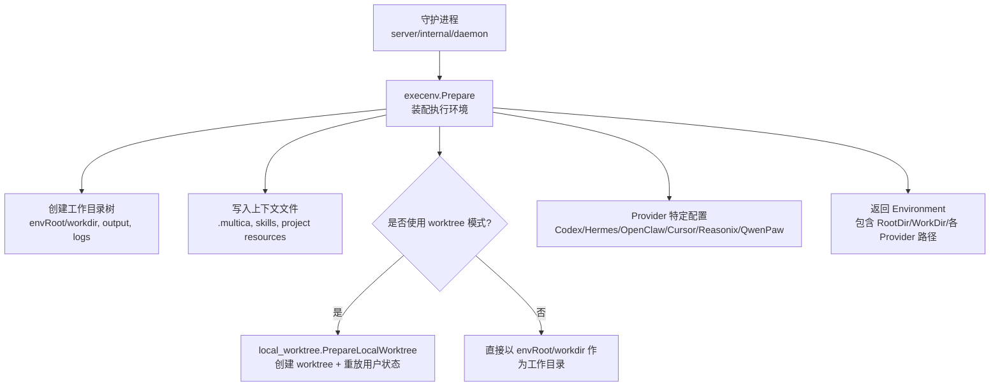
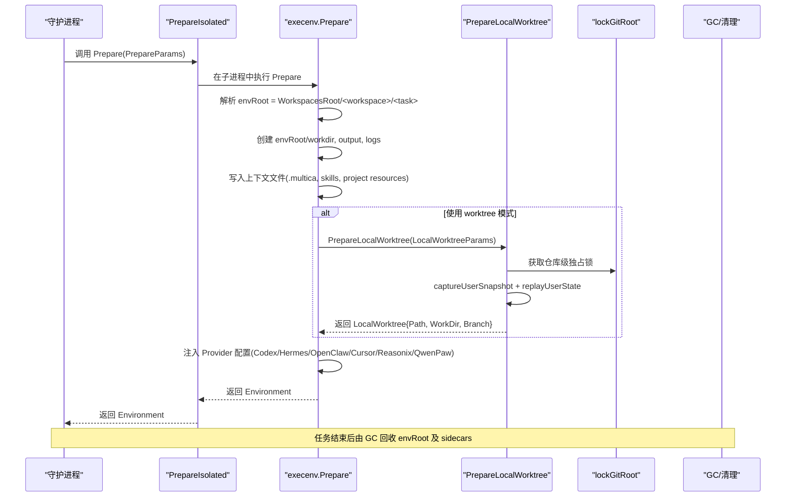
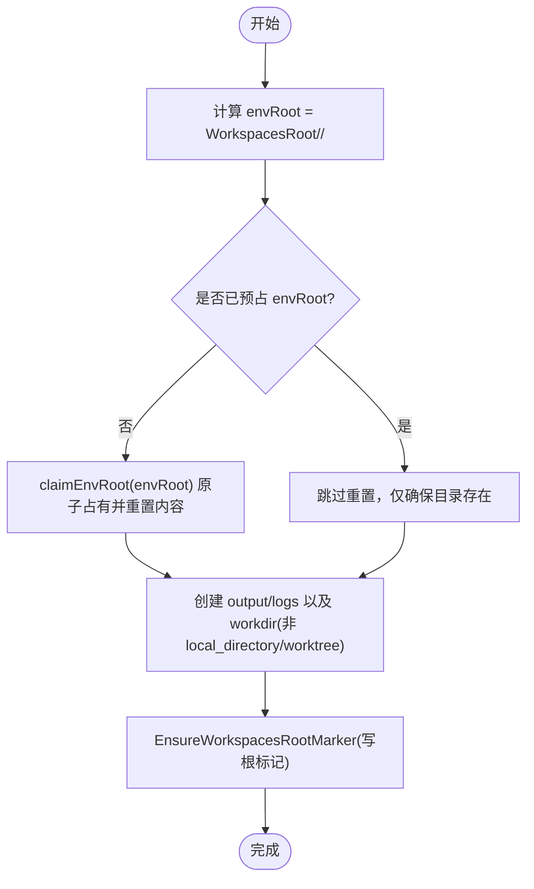
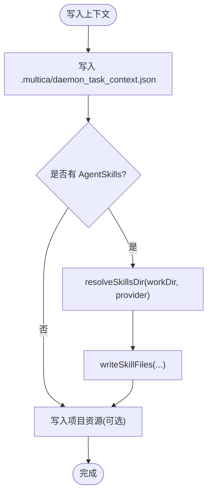
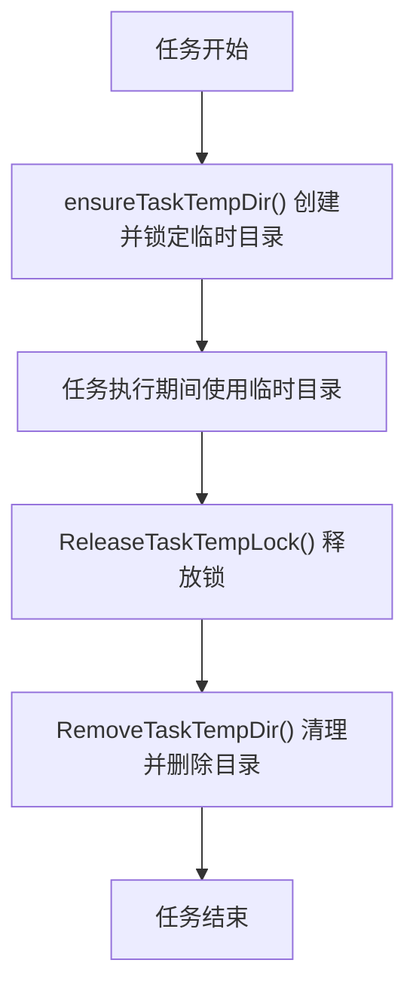
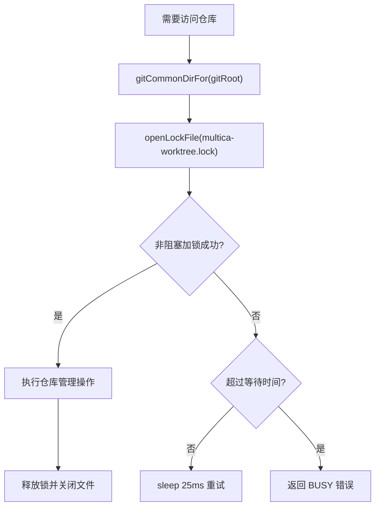
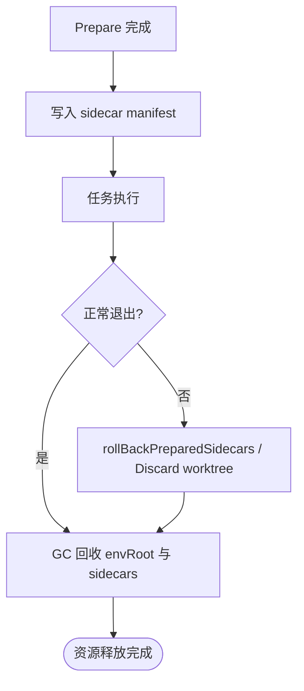
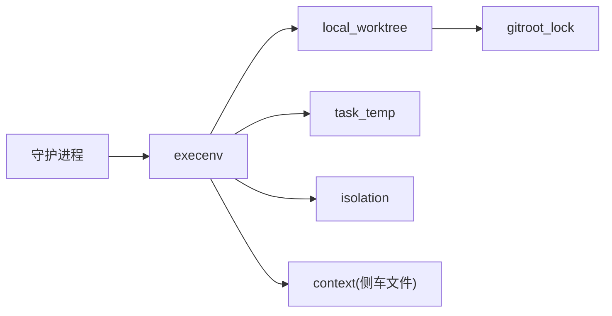

# 上下文装配

<cite>
**本文引用的文件**
- [execenv.go](file://server/internal/daemon/execenv/execenv.go)
- [context.go](file://server/internal/daemon/execenv/context.go)
- [local_worktree.go](file://server/internal/daemon/execenv/local_worktree.go)
- [gitroot_lock.go](file://server/internal/daemon/execenv/gitroot_lock.go)
- [isolation.go](file://server/internal/daemon/execenv/isolation.go)
- [task_temp.go](file://server/internal/daemon/execenv/task_temp.go)
- [reclaimable.go](file://server/internal/daemon/execenv/reclaimable.go)
- [config.go](file://server/internal/daemon/config.go)
- [daemon.go](file://server/internal/daemon/daemon.go)
</cite>

## 目录
1. [简介](#简介)
2. [项目结构](#项目结构)
3. [核心组件](#核心组件)
4. [架构总览](#架构总览)
5. [详细组件分析](#详细组件分析)
6. [依赖关系分析](#依赖关系分析)
7. [性能考量](#性能考量)
8. [故障排查指南](#故障排查指南)
9. [结论](#结论)
10. [附录：完整流程示例路径](#附录完整流程示例路径)

## 简介
本文件聚焦于智能体任务的执行上下文装配，围绕 execenv 包如何为每个任务准备隔离的执行环境展开。内容涵盖：
- WorkspacesRoot 下的目录结构与工作目录创建策略
- git worktree 的 checkout 与用户未提交变更的重放机制
- 共享裸缓存 .repos 的使用策略（由仓库层提供）
- 临时文件管理（task_temp 包）与生命周期
- Git 仓库锁定机制，避免并发冲突
- 上下文清理与资源回收策略，确保任务完成后释放系统资源
- 通过具体代码片段路径展示上下文装配的完整流程

## 项目结构
execenv 位于 server/internal/daemon/execenv，负责：
- 构建每任务隔离的环境根目录 envRoot
- 写入任务侧车文件（技能、项目资源、上下文标记等）
- 可选地创建 git worktree 以支持本地目录资源的并发执行
- 管理 per-task 临时目录与锁
- 跨进程隔离的准备过程（PrepareIsolated）



**图示来源**
- [execenv.go:409-745](file://server/internal/daemon/execenv/execenv.go#L409-L745)
- [local_worktree.go:283-506](file://server/internal/daemon/execenv/local_worktree.go#L283-L506)
- [context.go:159-193](file://server/internal/daemon/execenv/context.go#L159-L193)

**章节来源**
- [execenv.go:409-745](file://server/internal/daemon/execenv/execenv.go#L409-L745)
- [context.go:159-193](file://server/internal/daemon/execenv/context.go#L159-L193)
- [local_worktree.go:283-506](file://server/internal/daemon/execenv/local_worktree.go#L283-L506)

## 核心组件
- PrepareParams / TaskContextForEnv / Environment：定义装配输入、任务上下文与输出环境对象
- 工作目录与侧车文件：writeContextFiles、resolveSkillsDir、writeProjectResources
- Worktree 模式：PrepareLocalWorktree、Finalize、Discard、AbortWithReason
- 仓库锁定：lockGitRoot、acquireGitRootFileLock、gitCommonDirFor
- 隔离准备：PrepareIsolated/ReuseIsolated，跨进程执行 Prepare/Reuse
- 临时目录：task_temp.LockTaskTempDir/PruneTaskTempDirs/RemoveTaskTempDir
- 可回收产物：ManagedReclaimableArtifactSubpaths（如 codex-home/.sandbox-bin）

**章节来源**
- [execenv.go:38-127](file://server/internal/daemon/execenv/execenv.go#L38-L127)
- [execenv.go:267-352](file://server/internal/daemon/execenv/execenv.go#L267-L352)
- [context.go:159-193](file://server/internal/daemon/execenv/context.go#L159-L193)
- [local_worktree.go:75-208](file://server/internal/daemon/execenv/local_worktree.go#L75-L208)
- [gitroot_lock.go:13-76](file://server/internal/daemon/execenv/gitroot_lock.go#L13-L76)
- [isolation.go:105-216](file://server/internal/daemon/execenv/isolation.go#L105-L216)
- [task_temp.go:13-160](file://server/internal/daemon/execenv/task_temp.go#L13-L160)
- [reclaimable.go:10-16](file://server/internal/daemon/execenv/reclaimable.go#L10-L16)

## 架构总览
下图展示了从守护进程到 execenv 的上下文装配主流程，包括 worktree 分支与 provider 配置注入。



**图示来源**
- [isolation.go:105-216](file://server/internal/daemon/execenv/isolation.go#L105-L216)
- [execenv.go:409-745](file://server/internal/daemon/execenv/execenv.go#L409-L745)
- [local_worktree.go:283-506](file://server/internal/daemon/execenv/local_worktree.go#L283-L506)
- [gitroot_lock.go:149-241](file://server/internal/daemon/execenv/gitroot_lock.go#L149-L241)

## 详细组件分析

### 工作目录与 envRoot 结构
- envRoot 预测与解析：PredictRootDir/ResolveRootDir 基于 WorkspacesRoot、WorkspaceID、IssueIdentifier、TaskID 生成稳定路径段，避免 Windows 路径过长问题
- 目录创建：envRoot 下固定创建 output、logs；workdir 默认在 envRoot 内，除非使用 LocalWorkDir 或 worktree 模式
- 安全标记：EnsureWorkspacesRootMarker 在 WorkspacesRoot 放置 .multica/daemon_task_context.json，防止逃逸的子进程误用用户 PAT



**图示来源**
- [execenv.go:370-407](file://server/internal/daemon/execenv/execenv.go#L370-L407)
- [execenv.go:409-513](file://server/internal/daemon/execenv/execenv.go#L409-L513)
- [context.go:33-87](file://server/internal/daemon/execenv/context.go#L33-L87)

**章节来源**
- [execenv.go:370-407](file://server/internal/daemon/execenv/execenv.go#L370-L407)
- [execenv.go:409-513](file://server/internal/daemon/execenv/execenv.go#L409-L513)
- [context.go:33-87](file://server/internal/daemon/execenv/context.go#L33-L87)

### 上下文文件与技能水合
- writeContextFiles：写入任务上下文标记、按 provider 将技能写入对应目录（如 .claude/skills、.cursor/skills、openclaw 的 skills 等），并写入项目资源 JSON
- resolveSkillsDir：根据 provider 选择技能目录，兼容多种 CLI 的发现约定
- 项目资源：.multica/project/resources.json，用于向 agent 暴露项目级资源摘要



**图示来源**
- [context.go:159-193](file://server/internal/daemon/execenv/context.go#L159-L193)
- [context.go:311-435](file://server/internal/daemon/execenv/context.go#L311-L435)

**章节来源**
- [context.go:159-193](file://server/internal/daemon/execenv/context.go#L159-L193)
- [context.go:311-435](file://server/internal/daemon/execenv/context.go#L311-L435)

### Worktree 模式：checkout 与用户状态重放
- PrepareLocalWorktree：
  - 解析 git root，清理陈旧 worktree 注册
  - 捕获用户当前目录快照（含未跟踪文件），限制大小以防污染对象库
  - 决定继续已有分支或新建分支（ConversationKey 控制）
  - 重放用户状态到 worktree，处理冲突并记录
  - 建立 baseline commit，便于区分“任务产出”和“用户 WIP”
- Finalize：
  - 若存在未合并冲突则拒绝交付，保留 worktree 供人工处理
  - 自动提交未提交更改，记录 delivered tip，删除 worktree
  - 对空分支（无产出）删除分支，避免污染用户分支列表
- Discard：在未运行前丢弃 worktree 与分支

```mermaid
sequenceDiagram
participant P as "PrepareLocalWorktree"
participant L as "lockGitRoot"
participant U as "captureUserSnapshot"
participant R as "replayUserState"
participant F as "Finalize"
P->>L : 获取仓库级独占锁
P->>U : 生成用户目录快照(commit-like object)
P->>R : 重放到 worktree(可能产生冲突)
R-->>P : 返回冲突文件列表
P-->>P : 建立 baseline 并记录 owner/state
Note over P,F : 任务结束后进入 Finalize
F->>L : 再次获取锁
F->>F : 检查未合并冲突/脏状态
F->>F : 自动提交(如有)并验证交付点
F-->>F : 删除 worktree; 必要时删除分支
```

**图示来源**
- [local_worktree.go:283-506](file://server/internal/daemon/execenv/local_worktree.go#L283-L506)
- [local_worktree.go:508-705](file://server/internal/daemon/execenv/local_worktree.go#L508-L705)
- [gitroot_lock.go:149-241](file://server/internal/daemon/execenv/gitroot_lock.go#L149-L241)

**章节来源**
- [local_worktree.go:283-506](file://server/internal/daemon/execenv/local_worktree.go#L283-L506)
- [local_worktree.go:508-705](file://server/internal/daemon/execenv/local_worktree.go#L508-L705)
- [gitroot_lock.go:149-241](file://server/internal/daemon/execenv/gitroot_lock.go#L149-L241)

### 共享裸缓存 .repos 的使用策略
- 仓库层面由 repocache 管理共享裸仓库缓存；execenv 通过 `multica repo checkout` 按需 checkout 到 workdir 或 worktree
- 该策略减少重复 clone，提升多任务并行效率；checkout 结果受 GC 与 reuse 策略保护

[本节为概念性说明，不直接分析具体文件]

### 临时文件管理（task_temp）
- 每个任务拥有独立临时目录，命名前缀 multica-task-，并通过执行锁保证唯一性与可回收性
- LockTaskTempDir：创建并锁定任务临时目录
- PruneTaskTempDirs：周期性扫描，回收无锁且过期的目录
- RemoveTaskTempDir：先清理内容，再移除锁标记，最后删除目录
- 守护进程在任务生命周期中确保临时目录的创建与释放



**图示来源**
- [task_temp.go:13-160](file://server/internal/daemon/execenv/task_temp.go#L13-L160)
- [daemon.go:9458-9490](file://server/internal/daemon/daemon.go#L9458-L9490)

**章节来源**
- [task_temp.go:13-160](file://server/internal/daemon/execenv/task_temp.go#L13-L160)
- [daemon.go:9458-9490](file://server/internal/daemon/daemon.go#L9458-L9490)

### Git 仓库锁定机制
- 目标：跨进程串行化对同一仓库的管理操作（worktree add/remove/prune、branch 操作、index.lock 竞争）
- 实现：
  - 在仓库 COMMON git dir 下放置 multica-worktree.lock 文件锁
  - 轮询非阻塞 flock/LockFileEx，等待上限 gitRootLockWait
  - 同时维护 per-repo 内存互斥锁，作为回退保护
  - 失败时返回 BUSY 错误，要求上层重试或终止持有者



**图示来源**
- [gitroot_lock.go:13-76](file://server/internal/daemon/execenv/gitroot_lock.go#L13-L76)
- [gitroot_lock.go:149-241](file://server/internal/daemon/execenv/gitroot_lock.go#L149-L241)

**章节来源**
- [gitroot_lock.go:13-76](file://server/internal/daemon/execenv/gitroot_lock.go#L13-L76)
- [gitroot_lock.go:149-241](file://server/internal/daemon/execenv/gitroot_lock.go#L149-L241)

### 上下文清理与资源回收
- 侧车文件清单：sidecarManifest 记录 Prepare 创建的目录与文件，用于 local_directory 模式的回滚
- 可回收产物：ManagedReclaimableArtifactSubpaths 指定 envRoot 下可再生目录（如 codex-home/.sandbox-bin）
- GC 策略：守护进程的 GC 循环会回收 envRoot 及其 sidecars；worktree 模式在 Finalize 后删除 worktree 与分支
- 异常路径：prepareSucceeded 标志配合 defer 确保失败时丢弃 worktree 或回滚侧车



**图示来源**
- [execenv.go:566-718](file://server/internal/daemon/execenv/execenv.go#L566-L718)
- [reclaimable.go:10-16](file://server/internal/daemon/execenv/reclaimable.go#L10-L16)
- [local_worktree.go:707-739](file://server/internal/daemon/execenv/local_worktree.go#L707-L739)

**章节来源**
- [execenv.go:566-718](file://server/internal/daemon/execenv/execenv.go#L566-L718)
- [reclaimable.go:10-16](file://server/internal/daemon/execenv/reclaimable.go#L10-L16)
- [local_worktree.go:707-739](file://server/internal/daemon/execenv/local_worktree.go#L707-L739)

## 依赖关系分析
- execenv 依赖 daemon 的配置与调度（如 Profile、MCP 配置、OpenClaw Gateway）
- local_worktree 依赖 gitroot_lock 进行仓库级并发控制
- task_temp 与 daemon 的生命周期管理紧密耦合（创建/释放临时目录）
- isolation 将 Prepare/Reuse 放入短生命周期子进程，避免阻塞文件系统调用影响主进程



**图示来源**
- [isolation.go:105-216](file://server/internal/daemon/execenv/isolation.go#L105-L216)
- [local_worktree.go:283-506](file://server/internal/daemon/execenv/local_worktree.go#L283-L506)
- [gitroot_lock.go:149-241](file://server/internal/daemon/execenv/gitroot_lock.go#L149-L241)
- [task_temp.go:13-160](file://server/internal/daemon/execenv/task_temp.go#L13-L160)
- [context.go:159-193](file://server/internal/daemon/execenv/context.go#L159-L193)

**章节来源**
- [isolation.go:105-216](file://server/internal/daemon/execenv/isolation.go#L105-L216)
- [local_worktree.go:283-506](file://server/internal/daemon/execenv/local_worktree.go#L283-L506)
- [gitroot_lock.go:149-241](file://server/internal/daemon/execenv/gitroot_lock.go#L149-L241)
- [task_temp.go:13-160](file://server/internal/daemon/execenv/task_temp.go#L13-L160)
- [context.go:159-193](file://server/internal/daemon/execenv/context.go#L159-L193)

## 性能考量
- 工作目录复用：PriorWorkDir 支持同 (agent, issue) 的多轮复用同一 workdir，减少重复初始化开销
- Worktree 模式：允许多个任务在同一仓库上并发执行，避免队列等待
- 快照与重放：限制未跟踪文件数量与体积，防止对象库膨胀
- 锁定等待：gitRootLockWait 限制等待时间，避免长时间占用守护进程槽位
- 隔离准备：PrepareIsolated 将阻塞 I/O 移出主进程，提高整体吞吐

[本节为通用指导，不直接分析具体文件]

## 故障排查指南
- 仓库锁定繁忙：当 acquireGitRootFileLock 超时，返回 BUSY 错误，需等待持有者完成或终止其进程
- 未合并冲突：Finalize 检测到未解决冲突时会拒绝交付并保留 worktree，需在 worktree 中手动解决
- 临时目录无法删除：Windows 共享冲突场景下，PruneTaskTempDirs 会在句柄释放后下一周期清理
- 侧车回滚失败：local_directory 模式下，若 sidecar manifest 写入失败，Prepare 会失败并尝试回滚

**章节来源**
- [gitroot_lock.go:149-241](file://server/internal/daemon/execenv/gitroot_lock.go#L149-L241)
- [local_worktree.go:508-705](file://server/internal/daemon/execenv/local_worktree.go#L508-L705)
- [task_temp.go:13-160](file://server/internal/daemon/execenv/task_temp.go#L13-L160)
- [execenv.go:566-718](file://server/internal/daemon/execenv/execenv.go#L566-L718)

## 结论
execenv 通过严格的目录隔离、安全的上下文文件写入、可控的 worktree 重放与锁定机制，为每个智能体任务提供了可靠、可复用的执行环境。结合 task_temp 与 GC 策略，确保资源及时回收，避免泄漏。该设计在高并发、多 provider 环境下仍能保持稳定性与可观测性。

[本节为总结性内容，不直接分析具体文件]

## 附录：完整流程示例路径
- 环境准备入口：[execenv.go:409-745](file://server/internal/daemon/execenv/execenv.go#L409-L745)
- 工作目录与标记：[execenv.go:491-513](file://server/internal/daemon/execenv/execenv.go#L491-L513), [context.go:33-87](file://server/internal/daemon/execenv/context.go#L33-L87)
- 上下文文件与技能：[context.go:159-193](file://server/internal/daemon/execenv/context.go#L159-L193), [context.go:311-435](file://server/internal/daemon/execenv/context.go#L311-L435)
- Worktree 创建与重放：[local_worktree.go:283-506](file://server/internal/daemon/execenv/local_worktree.go#L283-L506)
- 仓库锁定：[gitroot_lock.go:149-241](file://server/internal/daemon/execenv/gitroot_lock.go#L149-L241)
- 隔离准备：[isolation.go:105-216](file://server/internal/daemon/execenv/isolation.go#L105-L216)
- 临时目录管理：[task_temp.go:13-160](file://server/internal/daemon/execenv/task_temp.go#L13-L160), [daemon.go:9458-9490](file://server/internal/daemon/daemon.go#L9458-L9490)
- 可回收产物：[reclaimable.go:10-16](file://server/internal/daemon/execenv/reclaimable.go#L10-L16)