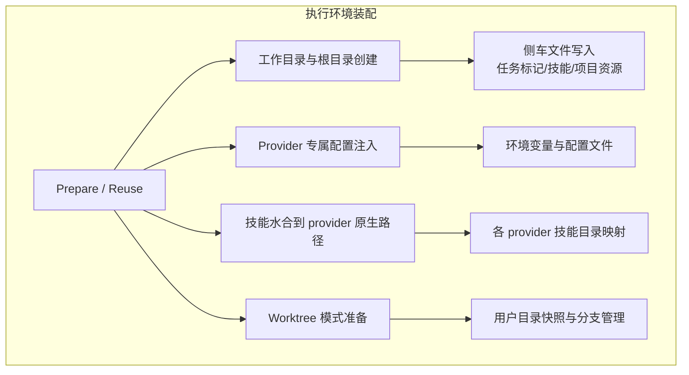
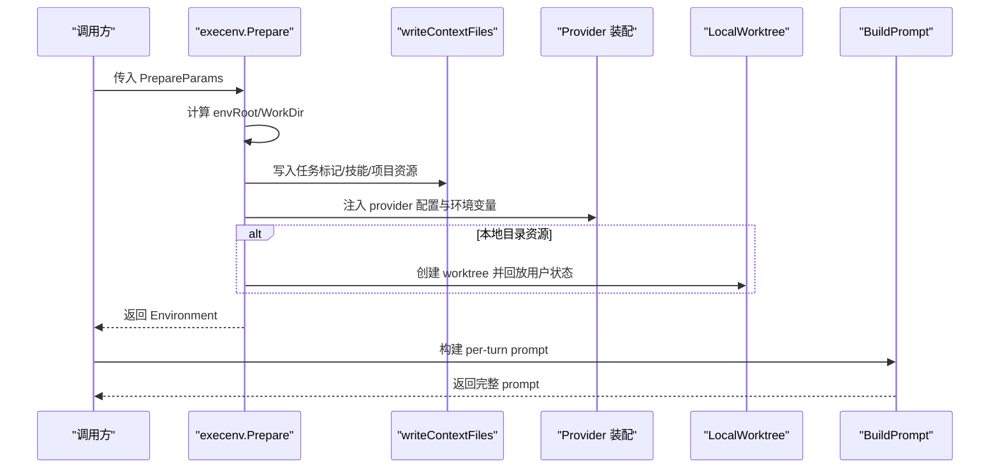
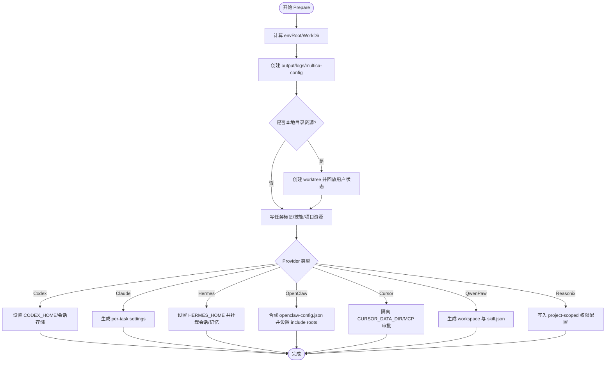
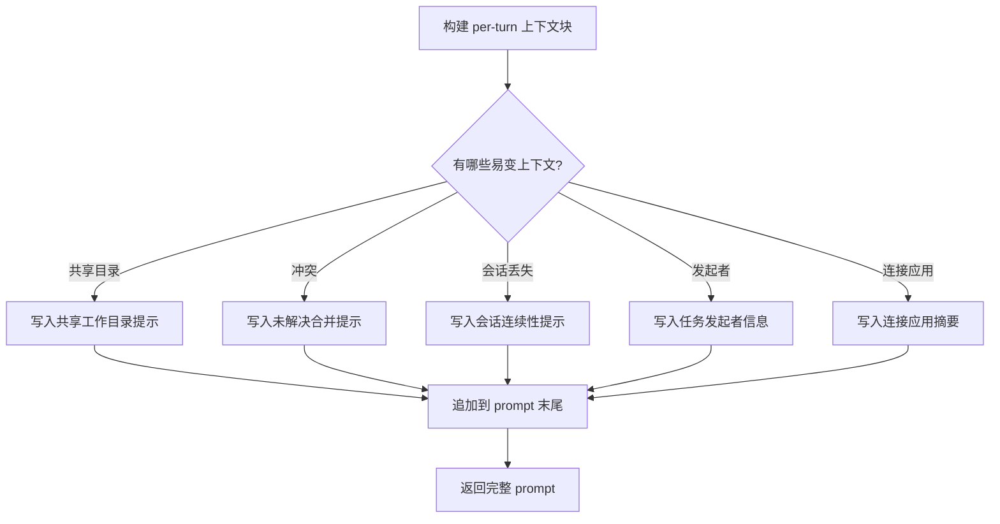
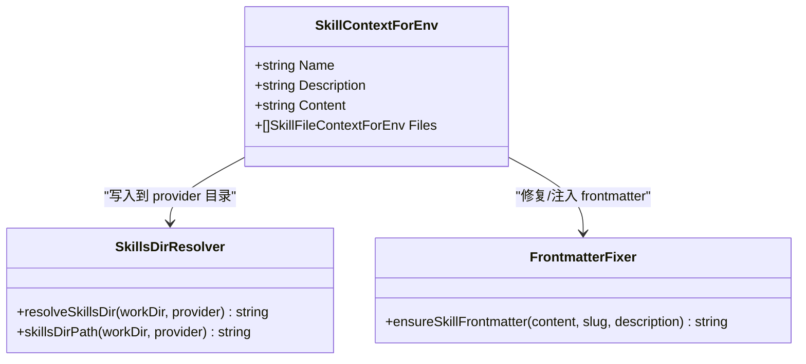
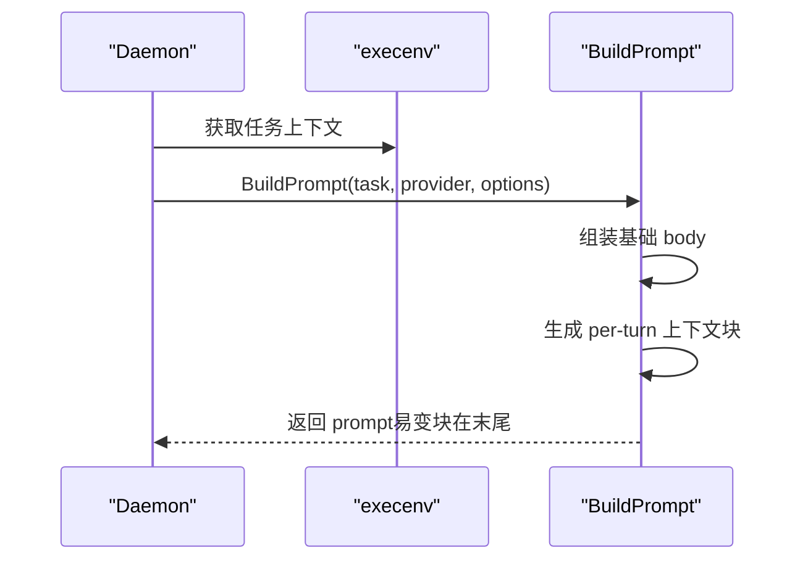
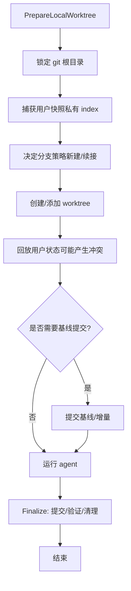
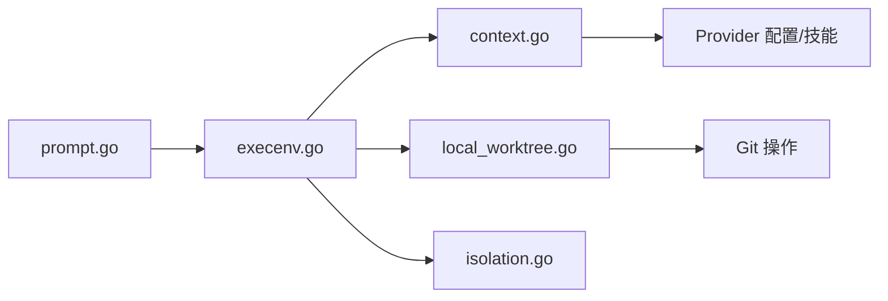

# 执行环境装配

<cite>
**本文引用的文件**
- [execenv.go](file://server/internal/daemon/execenv/execenv.go)
- [context.go](file://server/internal/daemon/execenv/context.go)
- [isolation.go](file://server/internal/daemon/execenv/isolation.go)
- [local_worktree.go](file://server/internal/daemon/execenv/local_worktree.go)
- [prompt.go](file://server/internal/daemon/prompt.go)
</cite>

## 目录
1. [简介](#简介)
2. [项目结构](#项目结构)
3. [核心组件](#核心组件)
4. [架构总览](#架构总览)
5. [详细组件分析](#详细组件分析)
6. [依赖关系分析](#依赖关系分析)
7. [性能考量](#性能考量)
8. [故障排查指南](#故障排查指南)
9. [结论](#结论)
10. [附录](#附录)

## 简介
本文件聚焦于 execenv 包如何为每个智能体任务装配独立的执行环境，覆盖以下关键主题：
- 上下文装配流程：工作目录准备、代码仓库 checkout（worktree）、环境变量与 provider 专属配置注入。
- brief 文件生成机制：将运行时信息以标记块形式写入 CLAUDE.md/AGENTS.md，并说明每轮易变字段策略以保护 prompt 缓存前缀。
- 技能水合过程：将平台无关的技能转换为各 provider 原生 skills 目录或 workspace 格式。
- 提示生成策略：每轮易变字段的处理与 prompt 缓存优化。
- 不同智能体 CLI 的特定适配逻辑与环境隔离机制。
- 执行环境的清理与资源回收策略。

## 项目结构
execenv 位于 server/internal/daemon/execenv，围绕“按任务隔离”的核心目标组织：
- 环境准备与生命周期：Prepare/Reuse、隔离子进程、锁与清理。
- 上下文与侧车文件：任务上下文标记、技能目录解析与写入、项目资源 JSON。
- Provider 专属装配：Codex、Claude、Hermes、OpenClaw、Cursor、QwenPaw、Reasonix 等。
- Worktree 模式：本地目录资源的并发安全与分支交付。
- 提示组装：daemon 层将每轮易变上下文追加到 prompt 末尾，避免破坏缓存前缀。

**图示来源**
- [execenv.go:409-744](file://server/internal/daemon/execenv/execenv.go#L409-L744)
- [context.go:159-193](file://server/internal/daemon/execenv/context.go#L159-L193)
- [local_worktree.go:283-506](file://server/internal/daemon/execenv/local_worktree.go#L283-L506)

**章节来源**
- [execenv.go:409-744](file://server/internal/daemon/execenv/execenv.go#L409-L744)
- [context.go:159-193](file://server/internal/daemon/execenv/context.go#L159-L193)
- [local_worktree.go:283-506](file://server/internal/daemon/execenv/local_worktree.go#L283-L506)

## 核心组件
- Prepare/Reuse：创建或复用任务级 env root，负责目录树、侧车文件、provider 配置、worktree 等。
- writeContextFiles：写入任务上下文标记、技能文件、项目资源 JSON。
- resolveSkillsDir/skillsDirPath：根据 provider 解析技能目录路径。
- LocalWorktree：本地目录资源的 worktree 模式，保证并发安全与分支交付。
- isolation：通过独立子进程执行 Prepare/Reuse，支持超时与进程树隔离。
- daemon.BuildPrompt：将每轮易变上下文追加到 prompt 末尾，保护缓存前缀。

**章节来源**
- [execenv.go:409-744](file://server/internal/daemon/execenv/execenv.go#L409-L744)
- [context.go:159-193](file://server/internal/daemon/execenv/context.go#L159-L193)
- [local_worktree.go:283-506](file://server/internal/daemon/execenv/local_worktree.go#L283-L506)
- [isolation.go:105-216](file://server/internal/daemon/execenv/isolation.go#L105-L216)
- [prompt.go:176-199](file://server/internal/daemon/prompt.go#L176-L199)

## 架构总览
下图展示了从 Prepare 到最终 prompt 的关键调用链与数据流：

**图示来源**
- [execenv.go:409-744](file://server/internal/daemon/execenv/execenv.go#L409-L744)
- [context.go:159-193](file://server/internal/daemon/execenv/context.go#L159-L193)
- [local_worktree.go:283-506](file://server/internal/daemon/execenv/local_worktree.go#L283-L506)
- [prompt.go:176-199](file://server/internal/daemon/prompt.go#L176-L199)

## 详细组件分析

### 上下文装配流程（工作目录、仓库 checkout、环境变量）
- 根目录与工作目录
  - 预测并解析 envRoot（包含 workspace/task 可读段 + 稳定 ID 后缀）。
  - 创建 output/logs/multica-config 等目录；workdir 默认在 envRoot/workdir，或在 local_directory/worktree 模式下替换。
- 仓库 checkout（worktree 模式）
  - 对本地目录资源，使用 git worktree 在 envRoot 下创建任务专属工作区，回放用户未提交状态，确保 agent 看到与用户一致的代码。
  - 通过分支记录与快照 ref 实现多轮续接与冲突回放。
- 环境变量与 provider 配置
  - 根据 provider 注入 CODEX_HOME、HERMES_HOME、OPENCLAW_CONFIG_PATH、CURSOR_DATA_DIR 等。
  - 为 Claude 生成 per-task settings，限制运行时技能策略而不改动用户全局配置。
  - 为 OpenClaw 合成 per-task 配置，固定 workspaceDir 指向 workdir，并允许 $include 链接回用户配置目录。
  - 为 Cursor 隔离 MCP 审批与认证源，避免污染用户全局状态。
  - 为 Hermes/QwenPaw/Reasonix 分别生成 overlay/workspace/config，使技能与权限生效。

**图示来源**
- [execenv.go:409-744](file://server/internal/daemon/execenv/execenv.go#L409-L744)
- [context.go:159-193](file://server/internal/daemon/execenv/context.go#L159-L193)
- [local_worktree.go:283-506](file://server/internal/daemon/execenv/local_worktree.go#L283-L506)

**章节来源**
- [execenv.go:409-744](file://server/internal/daemon/execenv/execenv.go#L409-L744)
- [context.go:159-193](file://server/internal/daemon/execenv/context.go#L159-L193)
- [local_worktree.go:283-506](file://server/internal/daemon/execenv/local_worktree.go#L283-L506)

### brief 文件生成机制与标记块
- 设计要点
  - 不再在 .agent_context 中维护 issue_context.md 等多余副本；brief 由 execenv 注入到 provider 原生位置（如 CLAUDE.md/AGENTS.md），并通过 daemon.BuildPrompt 将每轮易变上下文追加到 prompt 末尾，避免破坏缓存前缀。
  - 易变字段（发起人、连接应用、续接提示等）放在每轮消息而非 brief，从而保持 brief 作为 prompt 缓存前缀的稳定。
- 标记块内容
  - 共享本地目录警告、worktree 回放冲突列表、会话连续性提示、任务发起者信息、已连接应用能力摘要等。
- 写入位置
  - 技能文件写入各 provider 原生 skills 目录；brief 内容由 daemon 层拼装后随 prompt 发送，不直接落盘为通用 brief。

**图示来源**
- [prompt.go:50-73](file://server/internal/daemon/prompt.go#L50-L73)
- [prompt.go:176-199](file://server/internal/daemon/prompt.go#L176-L199)

**章节来源**
- [prompt.go:50-73](file://server/internal/daemon/prompt.go#L50-L73)
- [prompt.go:176-199](file://server/internal/daemon/prompt.go#L176-L199)

### 技能水合过程（平台无关 → provider 原生）
- 技能目录解析
  - resolveSkillsDir/skillsDirPath 根据 provider 选择对应目录（如 .claude/skills、.agents/skills、skills、skill_pool 等）。
  - Hermes 特殊：其无工作区相对发现，需通过 per-task HERMES_HOME overlay 暴露技能。
- SKILL.md frontmatter 修复
  - ensureSkillFrontmatter 保证 name 键存在且与目录 slug 一致，兼容多种 YAML 写法与非法块，必要时重建 frontmatter。
- 写入与清单
  - writeSkillFiles 将技能主文件与支持文件写入目标目录；sidecarManifest 记录所有创建的文件/目录，便于本地目录模式的回滚。
- Provider 特化
  - Codex：在 codex-home 中水合技能。
  - QwenPaw：生成 workspace 与 skill.json manifest，启用绑定技能。
  - OpenClaw：配合 per-task 配置，将 skills 目录固定在 workdir。

**图示来源**
- [context.go:311-435](file://server/internal/daemon/execenv/context.go#L311-L435)
- [context.go:439-513](file://server/internal/daemon/execenv/context.go#L439-L513)
- [execenv.go:632-682](file://server/internal/daemon/execenv/execenv.go#L632-L682)

**章节来源**
- [context.go:311-435](file://server/internal/daemon/execenv/context.go#L311-L435)
- [context.go:439-513](file://server/internal/daemon/execenv/context.go#L439-L513)
- [execenv.go:632-682](file://server/internal/daemon/execenv/execenv.go#L632-L682)

### 提示生成策略与缓存优化
- 策略
  - 将每轮易变上下文（会话连续性、发起者、连接应用、worktree 冲突等）追加到 prompt 末尾，而不是放入 brief 前缀，从而保护 prompt 缓存前缀不被频繁变更影响。
  - 对 chat 场景，依据通道类型与是否持久化历史选择合适的连续性提示。
- 优化点
  - 易变字段仅出现在 per-turn 块中，brief 保持稳定，提升缓存命中率。
  - 冲突列表有字节预算上限，避免极端文件名导致提示膨胀。

**图示来源**
- [prompt.go:50-73](file://server/internal/daemon/prompt.go#L50-L73)
- [prompt.go:176-199](file://server/internal/daemon/prompt.go#L176-L199)

**章节来源**
- [prompt.go:50-73](file://server/internal/daemon/prompt.go#L50-L73)
- [prompt.go:176-199](file://server/internal/daemon/prompt.go#L176-L199)

### 不同智能体 CLI 的特定适配逻辑与环境隔离
- Codex
  - 设置 per-task CODEX_HOME，基于版本与 profile 命名空间会话存储；Windows sandbox 决策读取自定义参数。
- Claude
  - 生成 per-task settings 文件，禁用/限制运行时技能，不影响用户全局配置。
- Hermes
  - 当绑定技能时，创建 per-task HERMES_HOME overlay，链接会话与记忆存储，使技能可被原生发现。
- OpenClaw
  - 合成 per-task 配置，固定 workspaceDir 为 workdir，允许 $include 链接回用户配置目录；可选 gateway pin。
- Cursor
  - 隔离 CURSOR_DATA_DIR，管理 mcp_config 与认证源，避免污染用户全局 MCP 审批。
- QwenPaw
  - 生成 workspace 与 skill.json manifest，启用绑定技能，通过 --workspace 传递。
- Reasonix
  - 写入 project-scoped 权限配置，限制 ask 工具，降级但不阻塞运行。

**章节来源**
- [execenv.go:632-744](file://server/internal/daemon/execenv/execenv.go#L632-L744)

### Worktree 模式与并发安全
- 目标
  - 同一本地目录的多任务并发执行，各自拥有独立 worktree，结果以分支形式交付，无需额外结果通道。
- 关键保障
  - 用户目录只读：通过私有 index 捕获用户快照，避免竞争 .git/index.lock。
  - 分支归属与续接：通过 owner（workspace/agent/conversation）与 ref 记录，确保后续任务续接正确分支。
  - 冲突回放：将用户自上次 turn 以来的编辑以 merge 冲突形式呈现给 agent，由 agent 决定取舍。
  - Finalize：自动提交未保存更改、验证交付点、删除 worktree，失败时保留 worktree 以便人工恢复。

**图示来源**
- [local_worktree.go:283-506](file://server/internal/daemon/execenv/local_worktree.go#L283-L506)
- [local_worktree.go:508-705](file://server/internal/daemon/execenv/local_worktree.go#L508-L705)

**章节来源**
- [local_worktree.go:283-506](file://server/internal/daemon/execenv/local_worktree.go#L283-L506)
- [local_worktree.go:508-705](file://server/internal/daemon/execenv/local_worktree.go#L508-L705)

### 执行环境的清理与资源回收
- 侧车文件回滚（本地目录模式）
  - sidecarManifest 记录所有创建的中间目录与文件；失败或结束时通过 CleanupSidecars 回滚，避免残留标记阻止 multica CLI。
- 工作区根标记自愈
  - EnsureWorkspacesRootMarker 在 workspacesRoot 写入守护进程标记，防止逃逸的子进程误用用户 PAT；原子写入，崩溃后可自愈。
- Worktree 清理
  - Finalize 成功后移除 worktree 与空分支；失败时保留 worktree 并报告路径，便于人工恢复。
- 会话/记忆存储
  - Hermes 会话与记忆存储通过 overlay 链接，任务结束后由 GC 回收 envRoot；若会话历史不可用，per-turn 提示会告知用户。

**章节来源**
- [context.go:33-87](file://server/internal/daemon/execenv/context.go#L33-L87)
- [execenv.go:594-718](file://server/internal/daemon/execenv/execenv.go#L594-L718)
- [local_worktree.go:707-739](file://server/internal/daemon/execenv/local_worktree.go#L707-L739)

## 依赖关系分析
- 模块内耦合
  - execenv.go 协调 context.go（侧车文件）、local_worktree.go（worktree）、provider 专用装配逻辑。
  - isolation.go 提供进程级隔离，屏蔽长时间阻塞的系统调用对主进程的影响。
  - prompt.go 与 execenv 协作，将易变上下文追加到 prompt 末尾，避免破坏缓存前缀。
- 外部依赖
  - git（worktree、快照、分支操作）。
  - 各 provider CLI（codex、claude、hermes、openclaw、cursor、qwenpaw、reasonix 等）。
- 潜在风险
  - 跨进程边界的数据序列化（LocalWorktree 的 MarshalJSON/UnmarshalJSON）必须携带必要状态，否则 Finalize 行为退化。
  - 文件系统锁（git 根目录、env root 独占锁）失败时需降级并记录日志，避免死锁。

**图示来源**
- [execenv.go:409-744](file://server/internal/daemon/execenv/execenv.go#L409-L744)
- [context.go:159-193](file://server/internal/daemon/execenv/context.go#L159-L193)
- [local_worktree.go:283-506](file://server/internal/daemon/execenv/local_worktree.go#L283-L506)
- [isolation.go:105-216](file://server/internal/daemon/execenv/isolation.go#L105-L216)
- [prompt.go:176-199](file://server/internal/daemon/prompt.go#L176-L199)

**章节来源**
- [execenv.go:409-744](file://server/internal/daemon/execenv/execenv.go#L409-L744)
- [context.go:159-193](file://server/internal/daemon/execenv/context.go#L159-L193)
- [local_worktree.go:283-506](file://server/internal/daemon/execenv/local_worktree.go#L283-L506)
- [isolation.go:105-216](file://server/internal/daemon/execenv/isolation.go#L105-L216)
- [prompt.go:176-199](file://server/internal/daemon/prompt.go#L176-L199)

## 性能考量
- 缓存友好
  - 将易变字段置于 per-turn 块末尾，保持 brief 稳定，提高 prompt 缓存命中率。
- I/O 与锁
  - worktree 模式通过私有 index 避免竞争 .git/index.lock；git 操作加超时，防止索引锁死。
- 资源控制
  - 未跟踪文件/大小限制，防止超大快照拖慢任务。
  - 冲突列表字节预算，避免极端文件名导致提示膨胀。
- 进程隔离
  - 通过 PrepareIsolated/ReuseIsolated 在独立子进程中执行，避免阻塞主进程并可终止进程树。

[本节为通用指导，不直接分析具体文件]

## 故障排查指南
- 常见错误与定位
  - 无法写入 workspacesRoot 标记：检查路径权限与是否存在非 daemon 拥有的同名文件。
  - worktree 创建失败：确认 git 根可用、HEAD 存在、未跟踪内容未超限。
  - 会话续接失败：检查 Hermes/Codex 会话存储是否可达；per-turn 提示会告知用户。
  - 技能加载异常：检查 SKILL.md frontmatter 是否合法，name 是否与目录 slug 一致。
- 恢复手段
  - 本地目录模式：Finalize 失败时会保留 worktree 路径，可通过 git worktree list 找到并恢复。
  - 侧车残留：手动删除 .multica/daemon_task_context.json 或相应 sidecar 文件后重试。
  - 会话丢失：per-turn 提示会明确说明，建议重新发起任务。

**章节来源**
- [context.go:33-87](file://server/internal/daemon/execenv/context.go#L33-L87)
- [local_worktree.go:508-705](file://server/internal/daemon/execenv/local_worktree.go#L508-L705)
- [prompt.go:50-73](file://server/internal/daemon/prompt.go#L50-L73)

## 结论
execenv 通过严格的目录隔离、provider 专属配置注入、worktree 并发安全与 per-turn 易变上下文策略，实现了高可靠、高性能的智能体执行环境装配。其设计兼顾了缓存友好性、资源回收与故障恢复，为多 provider 智能体提供了统一的执行底座。

[本节为总结，不直接分析具体文件]

## 附录
- 术语
  - env root：任务级根目录，包含 workdir、output、logs、multica-config 等。
  - worktree：git 工作区，用于本地目录资源的并发与分支交付。
  - brief：provider 原生指令文件（如 CLAUDE.md/AGENTS.md），由 execenv 注入并由 daemon 拼装 prompt。
  - 技能水合：将平台无关技能转换为 provider 原生格式并放置到对应目录。

[本节为概念说明，不直接分析具体文件]