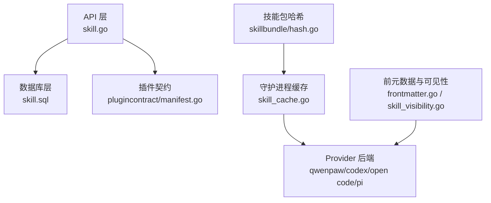
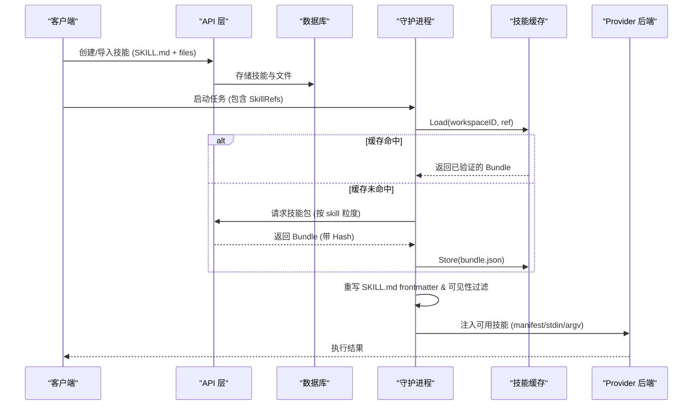
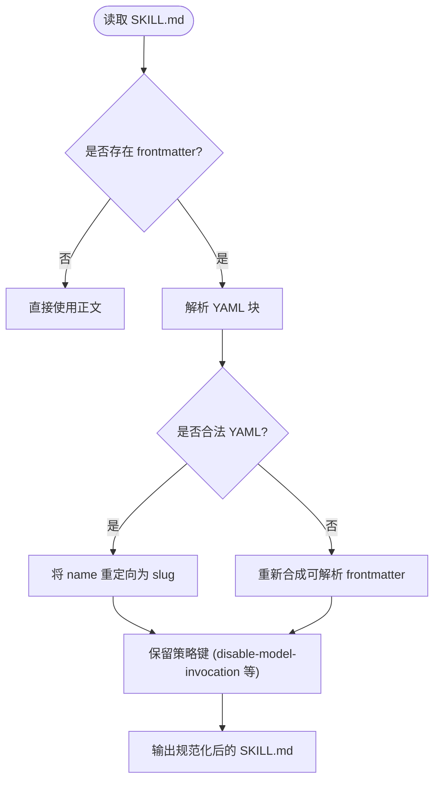
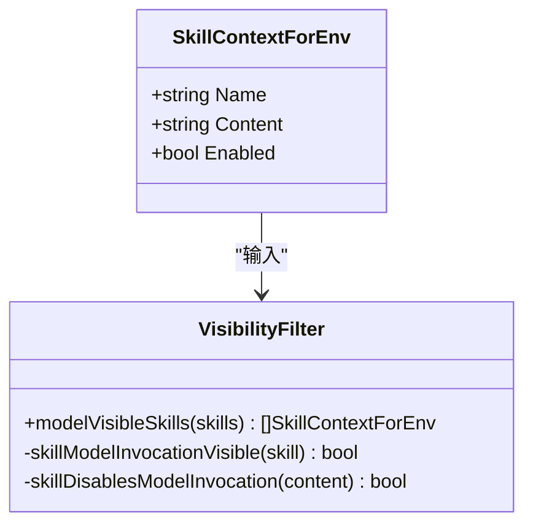
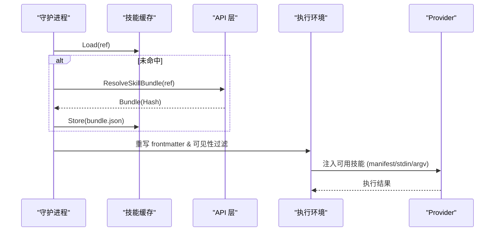
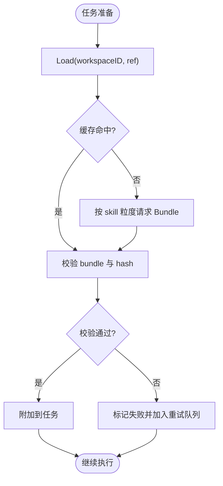
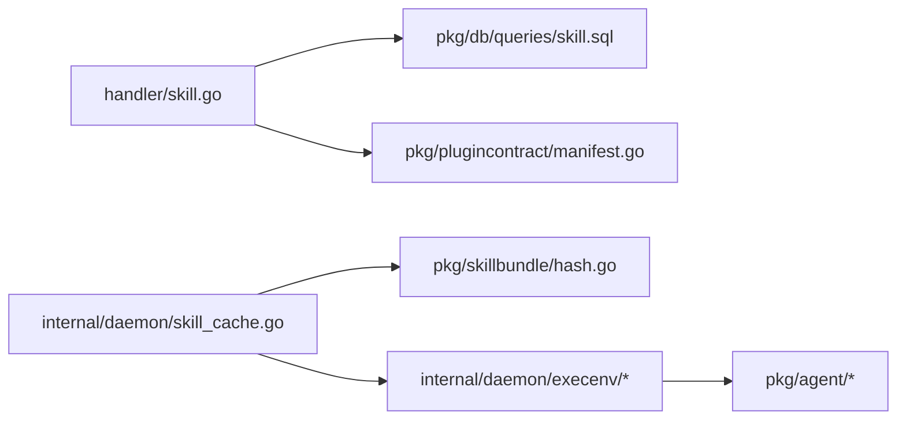

# 技能水合

<cite>
**本文引用的文件**
- [server/internal/daemon/skill_cache.go](file://server/internal/daemon/skill_cache.go)
- [server/internal/daemon/execenv/skill_visibility.go](file://server/internal/daemon/execenv/skill_visibility.go)
- [server/internal/daemon/execenv/skill_frontmatter_test.go](file://server/internal/daemon/execenv/skill_frontmatter_test.go)
- [server/internal/skill/frontmatter.go](file://server/internal/skill/frontmatter.go)
- [server/pkg/skillbundle/hash.go](file://server/pkg/skillbundle/hash.go)
- [server/internal/handler/skill.go](file://server/internal/handler/skill.go)
- [server/pkg/db/queries/skill.sql](file://server/pkg/db/queries/skill.sql)
- [server/migrations/368_skill_plugin_ownership.up.sql](file://server/migrations/368_skill_plugin_ownership.up.sql)
- [server/pkg/plugincontract/manifest.go](file://server/pkg/plugincontract/manifest.go)
- [server/pkg/agent/qwenpaw_integration_test.go](file://server/pkg/agent/qwenpaw_integration_test.go)
- [server/pkg/agent/codex_test.go](file://server/pkg/agent/codex_test.go)
- [server/pkg/agent/builtin_runtimes.go](file://server/pkg/agent/builtin_runtimes.go)
- [server/pkg/agent/opencode_stdin_windows_test.go](file://server/pkg/agent/opencode_stdin_windows_test.go)
- [server/pkg/agent/pi_stdin_windows_test.go](file://server/pkg/agent/pi_stdin_windows_test.go)
- [server/pkg/taskfailure/classify_test.go](file://server/pkg/taskfailure/classify_test.go)
</cite>

## 目录
1. [简介](#简介)
2. [项目结构](#项目结构)
3. [核心组件](#核心组件)
4. [架构总览](#架构总览)
5. [详细组件分析](#详细组件分析)
6. [依赖关系分析](#依赖关系分析)
7. [性能考虑](#性能考虑)
8. [故障排查指南](#故障排查指南)
9. [结论](#结论)
10. [附录](#附录)

## 简介
本文件系统性说明“技能水合”的完整流程：将平台无关的技能（以 SKILL.md 与附加文件为核心）转换为各 provider 原生 skills 格式，并在守护进程执行环境中安全、可缓存地交付给智能体。文档覆盖以下关键点：
- 技能前元数据解析与校验（SKILL.md frontmatter 规范化、名称归一化、策略键保留）。
- 技能可见性控制（基于工作区权限、角色与 disable-model-invocation 等策略）。
- 运行时技能策略（启用/禁用、安全检查、provider 特殊处理如 Codex 剥离、权限映射）。
- 技能缓存与更新机制（按 hash 一致性校验、增量重试、版本稳定）。
- 提供端到端流程图与配置要点，帮助快速定位问题与优化性能。

## 项目结构
技能水合涉及后端 API、守护进程、技能包构建与缓存、以及不同 provider 的后端实现。关键位置如下：
- 技能 API 与导入：server/internal/handler/skill.go
- 技能数据库模型与查询：server/pkg/db/queries/skill.sql
- 插件贡献技能归属：server/migrations/368_skill_plugin_ownership.up.sql、server/pkg/plugincontract/manifest.go
- 技能包哈希与清单：server/pkg/skillbundle/hash.go
- 守护进程技能缓存：server/internal/daemon/skill_cache.go
- 技能前元数据处理与可见性：server/internal/skill/frontmatter.go、server/internal/daemon/execenv/skill_visibility.go、execenv 测试用例
- Provider 集成与特殊处理：qwenpaw、codex、open code、pi 等后端测试与内置运行时描述

**图表来源**
- [server/internal/handler/skill.go:343-476](file://server/internal/handler/sill.go#L343-L476)
- [server/pkg/db/queries/skill.sql:1-170](file://server/pkg/db/queries/skill.sql#L1-L170)
- [server/pkg/plugincontract/manifest.go:686-730](file://server/pkg/plugincontract/manifest.go#L686-L730)
- [server/pkg/skillbundle/hash.go:43-83](file://server/pkg/skillbundle/hash.go#L43-L83)
- [server/internal/daemon/skill_cache.go:34-155](file://server/internal/daemon/skill_cache.go#L34-L155)
- [server/internal/skill/frontmatter.go:17-48](file://server/internal/skill/frontmatter.go#L17-L48)
- [server/internal/daemon/execenv/skill_visibility.go:30-99](file://server/internal/daemon/execenv/skill_visibility.go#L30-L99)

**章节来源**
- [server/internal/handler/skill.go:343-476](file://server/internal/handler/skill.go#L343-L476)
- [server/pkg/db/queries/skill.sql:1-170](file://server/pkg/db/queries/skill.sql#L1-L170)
- [server/pkg/plugincontract/manifest.go:686-730](file://server/pkg/plugincontract/manifest.go#L686-L730)
- [server/pkg/skillbundle/hash.go:43-83](file://server/pkg/skillbundle/hash.go#L43-L83)
- [server/internal/daemon/skill_cache.go:34-155](file://server/internal/daemon/skill_cache.go#L34-L155)
- [server/internal/skill/frontmatter.go:17-48](file://server/internal/skill/frontmatter.go#L17-L48)
- [server/internal/daemon/execenv/skill_visibility.go:30-99](file://server/internal/daemon/execenv/skill_visibility.go#L30-L99)

## 核心组件
- 技能包哈希与清单：对技能 ID、来源、名称、描述、内容以及所有附加文件进行排序并计算稳定哈希，用于缓存键与一致性校验。
- 守护进程技能缓存：按工作区与技能引用（ID、Source、Hash）组织缓存目录，原子写入 bundle.json，支持并发锁与失效验证。
- 前元数据处理：从 SKILL.md 提取 name/description，规范化空白与类型；在 execenv 中确保 frontmatter 可被严格 YAML 解析器加载，且保留策略键（如 disable-model-invocation）。
- 可见性与策略：根据 frontmatter 中的 disable-model-invocation 控制是否向模型暴露该技能；同时结合工作区角色与创建者权限限制编辑与删除。
- Provider 特殊处理：QwenPaw 通过 workspace skill manifest 驱动；Codex 剥离或调整权限字段；Open Code 与 Pi 通过 stdin/argv 传递 prompt 与可用技能列表，避免敏感信息泄漏。

**章节来源**
- [server/pkg/skillbundle/hash.go:43-83](file://server/pkg/skillbundle/hash.go#L43-L83)
- [server/internal/daemon/skill_cache.go:34-155](file://server/internal/daemon/skill_cache.go#L34-L155)
- [server/internal/skill/frontmatter.go:17-48](file://server/internal/skill/frontmatter.go#L17-L48)
- [server/internal/daemon/execenv/skill_visibility.go:30-99](file://server/internal/daemon/execenv/skill_visibility.go#L30-L99)
- [server/pkg/agent/qwenpaw_integration_test.go:177-211](file://server/pkg/agent/qwenpaw_integration_test.go#L177-L211)
- [server/pkg/agent/codex_test.go:230-273](file://server/pkg/agent/codex_test.go#L230-L273)
- [server/pkg/agent/opencode_stdin_windows_test.go:84-114](file://server/pkg/agent/opencode_stdin_windows_test.go#L84-L114)
- [server/pkg/agent/pi_stdin_windows_test.go:163-219](file://server/pkg/agent/pi_stdin_windows_test.go#L163-L219)

## 架构总览
技能水合的整体流程包括：
1. 技能创建/导入：API 接收 SKILL.md 与附件，校验路径与大小限制，持久化到数据库。
2. 任务准备：守护进程为每个任务组装技能引用（含 hash），尝试从缓存命中；未命中则向服务端请求技能包。
3. 缓存与一致性：下载后生成 bundle.json，使用 skillbundle.BuildManifest 计算哈希并与引用比对；失败时不缓存错误结果。
4. 前元数据与可见性：在 execenv 阶段重写 SKILL.md frontmatter，确保 name 与 slug 一致，保留策略键，过滤不可见技能。
5. Provider 适配：根据不同 provider 的要求写入 workspace skill manifest 或通过 stdin/argv 注入可用技能列表；对 Codex 做权限剥离与映射。

**图表来源**
- [server/internal/handler/skill.go:478-661](file://server/internal/handler/skill.go#L478-L661)
- [server/internal/daemon/skill_cache.go:34-155](file://server/internal/daemon/skill_cache.go#L34-L155)
- [server/pkg/skillbundle/hash.go:43-83](file://server/pkg/skillbundle/hash.go#L43-L83)
- [server/internal/daemon/execenv/skill_visibility.go:30-99](file://server/internal/daemon/execenv/skill_visibility.go#L30-L99)
- [server/pkg/agent/qwenpaw_integration_test.go:177-211](file://server/pkg/agent/qwenpaw_integration_test.go#L177-L211)
- [server/pkg/agent/opencode_stdin_windows_test.go:84-114](file://server/pkg/agent/opencode_stdin_windows_test.go#L84-L114)

## 详细组件分析

### 技能前元数据处理与验证
- 解析 SKILL.md frontmatter：提取 name 与 description，兼容多种 YAML 标量形式，并对结构化值进行 JSON 编码以保持语义一致。
- 重写与健壮性：当 frontmatter 不是合法 YAML 或 name 存在但无值时，重新合成可解析的 frontmatter，确保严格运行时（如 Codex）能正确加载。
- 名称归一化：将 name 重定向为磁盘 slug，避免不同 provider 对识别字段不一致导致技能无法调用。
- 策略键保留：确保 disable-model-invocation 等策略键在重写过程中不被丢弃或误改，维持作者意图。

**图表来源**
- [server/internal/skill/frontmatter.go:17-48](file://server/internal/skill/frontmatter.go#L17-L48)
- [server/internal/daemon/execenv/skill_frontmatter_test.go:31-124](file://server/internal/daemon/execenv/skill_frontmatter_test.go#L31-L124)
- [server/internal/daemon/execenv/skill_frontmatter_test.go:223-351](file://server/internal/daemon/execenv/skill_frontmatter_test.go#L223-L351)

**章节来源**
- [server/internal/skill/frontmatter.go:17-48](file://server/internal/skill/frontmatter.go#L17-L48)
- [server/internal/daemon/execenv/skill_frontmatter_test.go:31-124](file://server/internal/daemon/execenv/skill_frontmatter_test.go#L31-L124)
- [server/internal/daemon/execenv/skill_frontmatter_test.go:223-351](file://server/internal/daemon/execenv/skill_frontmatter_test.go#L223-L351)

### 技能可见性控制机制
- 模型可见性：通过 frontmatter 中的 disable-model-invocation 控制是否向模型暴露技能；若为 true 或等价字符串，则该技能不会出现在模型可调用列表中。
- 名称归一化：列出技能时使用磁盘 slug 而非显示名，确保模型能准确调用对应目录。
- 工作区与角色权限：只有技能创建者或工作区 owner/admin 可管理（修改/删除）技能；其他成员可查看和使用但不能覆盖内容。

**图表来源**
- [server/internal/daemon/execenv/skill_visibility.go:30-99](file://server/internal/daemon/execenv/skill_visibility.go#L30-L99)
- [server/internal/handler/skill.go:531-555](file://server/internal/handler/skill.go#L531-L555)

**章节来源**
- [server/internal/daemon/execenv/skill_visibility.go:30-99](file://server/internal/daemon/execenv/skill_visibility.go#L30-L99)
- [server/internal/handler/skill.go:531-555](file://server/internal/handler/skill.go#L531-L555)

### 运行时技能策略与安全检查
- 启用/禁用逻辑：守护进程在任务准备阶段根据 SkillRefs 与缓存决定哪些技能需要下载；单个技能失败不影响已成功缓存的技能。
- 安全检查：
  - 文件路径安全：禁止绝对路径与穿越路径，防止恶意文件写入。
  - 前元数据合法性：确保 frontmatter 可被严格 YAML 解析器加载，避免 provider 直接拒绝技能。
  - 策略键保护：重写 frontmatter 时必须保留 disable-model-invocation 等策略键，防止意外暴露隐藏技能。
- Provider 特殊处理：
  - QwenPaw：通过 workspace skill manifest 声明 enabled/channels/source/metadata，驱动技能加载。
  - Codex：剥离未知权限键并映射网络/文件系统权限，确保最小权限原则。
  - Open Code/Pi：通过 stdin/argv 传递 prompt 与可用技能列表，避免敏感信息泄漏到命令行参数。

**图表来源**
- [server/internal/daemon/skill_cache.go:34-155](file://server/internal/daemon/skill_cache.go#L34-L155)
- [server/pkg/agent/qwenpaw_integration_test.go:177-211](file://server/pkg/agent/qwenpaw_integration_test.go#L177-L211)
- [server/pkg/agent/codex_test.go:230-273](file://server/pkg/agent/codex_test.go#L230-L273)
- [server/pkg/agent/opencode_stdin_windows_test.go:84-114](file://server/pkg/agent/opencode_stdin_windows_test.go#L84-L114)
- [server/pkg/agent/pi_stdin_windows_test.go:163-219](file://server/pkg/agent/pi_stdin_windows_test.go#L163-L219)

**章节来源**
- [server/internal/daemon/skill_cache.go:34-155](file://server/internal/daemon/skill_cache.go#L34-L155)
- [server/pkg/agent/qwenpaw_integration_test.go:177-211](file://server/pkg/agent/qwenpaw_integration_test.go#L177-L211)
- [server/pkg/agent/codex_test.go:230-273](file://server/pkg/agent/codex_test.go#L230-L273)
- [server/pkg/agent/opencode_stdin_windows_test.go:84-114](file://server/pkg/agent/opencode_stdin_windows_test.go#L84-L114)
- [server/pkg/agent/pi_stdin_windows_test.go:163-219](file://server/pkg/agent/pi_stdin_windows_test.go#L163-L219)

### 不同 Provider 的特殊处理
- QwenPaw：要求 workspace skill manifest 中每个技能声明 enabled/channels/source/metadata/updated_at；测试展示了如何构造并验证技能生效。
- Codex：对权限响应进行剥离与映射，确保 network/fileSystem 权限符合预期；未知键会被丢弃并记录日志。
- Open Code/Pi：通过 stdin/argv 传递 prompt 与可用技能列表，避免将敏感信息放入命令行参数；测试验证了 argv 长度与内容安全性。

**章节来源**
- [server/pkg/agent/qwenpaw_integration_test.go:177-211](file://server/pkg/agent/qwenpaw_integration_test.go#L177-L211)
- [server/pkg/agent/codex_test.go:230-273](file://server/pkg/agent/codex_test.go#L230-L273)
- [server/pkg/agent/opencode_stdin_windows_test.go:84-114](file://server/pkg/agent/opencode_stdin_windows_test.go#L84-L114)
- [server/pkg/agent/pi_stdin_windows_test.go:163-219](file://server/pkg/agent/pi_stdin_windows_test.go#L163-L219)

### 技能缓存与更新机制
- 缓存键设计：按 workspaceID → source → id → hash 组织目录，bundle.json 存储技能包数据。
- 一致性校验：使用 skillbundle.BuildManifest 计算哈希，并与引用对比；文件路径需通过安全校验。
- 原子写入：先写入临时目录再 rename，避免部分写入导致的损坏；并发访问通过 per-ref 锁保证。
- 增量重试：单个技能下载失败不影响其他已缓存技能；下次调度仅重试缺失项。
- 服务器端更新：若技能在服务端被编辑，返回当前 bundle 与 hash，守护进程接受并缓存新 hash。

**图表来源**
- [server/internal/daemon/skill_cache.go:34-155](file://server/internal/daemon/skill_cache.go#L34-L155)
- [server/pkg/skillbundle/hash.go:43-83](file://server/pkg/skillbundle/hash.go#L43-L83)

**章节来源**
- [server/internal/daemon/skill_cache.go:34-155](file://server/internal/daemon/skill_cache.go#L34-L155)
- [server/pkg/skillbundle/hash.go:43-83](file://server/pkg/skillbundle/hash.go#L43-L83)

## 依赖关系分析
- API 层依赖数据库查询（skill.sql）获取技能列表、详情与文件元数据。
- 插件贡献技能通过 plugincontract/manifest.go 约束 entry 路径为 skills/{key}/SKILL.md，并通过迁移添加 plugin_installation_id 字段以追踪所有权。
- 守护进程依赖 skillbundle 计算哈希，依赖 execenv 进行前元数据重写与可见性过滤。
- Provider 后端通过内置运行时描述（builtin_runtimes.go）注册身份与默认命令，并在执行时注入技能上下文。

**图表来源**
- [server/internal/handler/skill.go:343-476](file://server/internal/handler/skill.go#L343-L476)
- [server/pkg/db/queries/skill.sql:1-170](file://server/pkg/db/queries/skill.sql#L1-L170)
- [server/pkg/plugincontract/manifest.go:686-730](file://server/pkg/plugincontract/manifest.go#L686-L730)
- [server/internal/daemon/skill_cache.go:34-155](file://server/internal/daemon/skill_cache.go#L34-L155)
- [server/pkg/skillbundle/hash.go:43-83](file://server/pkg/skillbundle/hash.go#L43-L83)
- [server/pkg/agent/builtin_runtimes.go:8-32](file://server/pkg/agent/builtin_runtimes.go#L8-L32)

**章节来源**
- [server/internal/handler/skill.go:343-476](file://server/internal/handler/skill.go#L343-L476)
- [server/pkg/db/queries/skill.sql:1-170](file://server/pkg/db/queries/skill.sql#L1-L170)
- [server/pkg/plugincontract/manifest.go:686-730](file://server/pkg/plugincontract/manifest.go#L686-L730)
- [server/internal/daemon/skill_cache.go:34-155](file://server/internal/daemon/skill_cache.go#L34-L155)
- [server/pkg/skillbundle/hash.go:43-83](file://server/pkg/skillbundle/hash.go#L43-L83)
- [server/pkg/agent/builtin_runtimes.go:8-32](file://server/pkg/agent/builtin_runtimes.go#L8-L32)

## 性能考虑
- 列表接口优化：技能列表不包含 SKILL.md 正文，避免大负载导致 CLI 超时。
- 导入限制：单文件最大 1 MiB，总包最大 8 MiB，文件数上限 256，防止滥用。
- 缓存命中率：按 skill 粒度请求与缓存，单个失败不影响其他技能；重试策略针对慢链路与部分传输优化。
- 哈希稳定性：文件路径排序与 v1 前缀确保跨运行一致，便于缓存复用。

[本节为通用指导，无需特定文件来源]

## 故障排查指南
- 技能包不可用：若下载超时或网络错误，错误会携带技能名称与等待时长，并映射为可重试的平台侧原因。
- 权限配置错误：Codex 权限响应中的未知键会被丢弃并记录日志；检查 network/fileSystem 权限是否符合预期。
- 前元数据非法：若 SKILL.md frontmatter 不是合法 YAML，execenv 会重新合成；确认 disable-model-invocation 未被意外移除。
- 缓存失效：bundle.json 校验失败时会删除并重新下载；检查 hash 与文件大小是否与引用一致。

**章节来源**
- [server/pkg/taskfailure/classify_test.go:439-468](file://server/pkg/taskfailure/classify_test.go#L439-L468)
- [server/pkg/agent/codex_test.go:230-273](file://server/pkg/agent/codex_test.go#L230-L273)
- [server/internal/daemon/execenv/skill_frontmatter_test.go:31-124](file://server/internal/daemon/execenv/skill_frontmatter_test.go#L31-L124)
- [server/internal/daemon/skill_cache.go:126-155](file://server/internal/daemon/skill_cache.go#L126-L155)

## 结论
技能水合通过标准化前元数据、严格可见性控制、健壮的缓存与一致性校验，以及针对不同 provider 的特殊处理，实现了平台无关技能到各 provider 原生格式的可靠转换。该机制在保证安全性的同时，兼顾了性能与可维护性，适合大规模团队协作场景下的智能体能力扩展。

[本节为总结，无需特定文件来源]

## 附录
- 配置示例要点：
  - QwenPaw workspace skill manifest 需包含 schema_version、version、skills 映射，每个技能声明 enabled/channels/source/metadata/updated_at。
  - 插件贡献技能的 entry 必须为 skills/{key}/SKILL.md，并通过 plugin_installation_id 追踪所有权。
  - 技能导入时需遵守文件大小与总数限制，二进制文件将被跳过。

**章节来源**
- [server/pkg/agent/qwenpaw_integration_test.go:177-211](file://server/pkg/agent/qwenpaw_integration_test.go#L177-L211)
- [server/pkg/plugincontract/manifest.go:686-730](file://server/pkg/plugincontract/manifest.go#L686-L730)
- [server/migrations/368_skill_plugin_ownership.up.sql:1-16](file://server/migrations/368_skill_plugin_ownership.up.sql#L1-L16)
- [server/internal/handler/skill.go:724-787](file://server/internal/handler/skill.go#L724-L787)