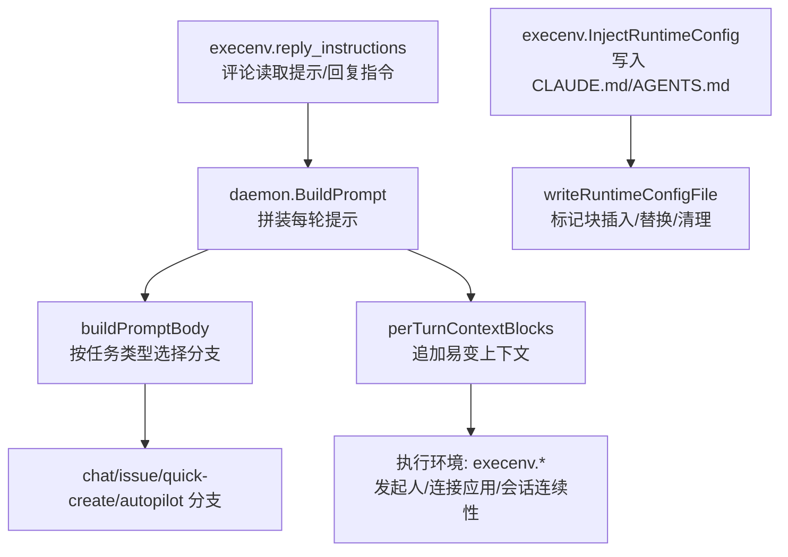
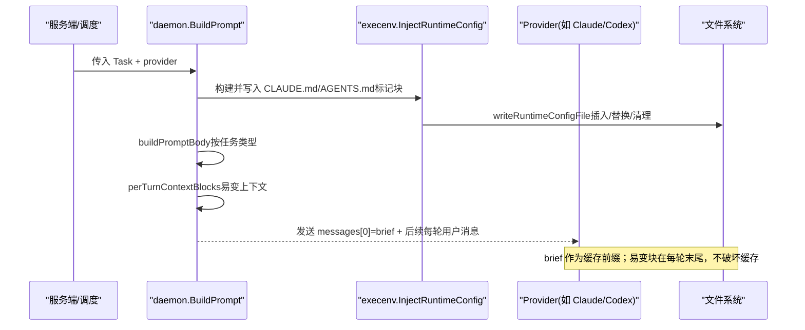
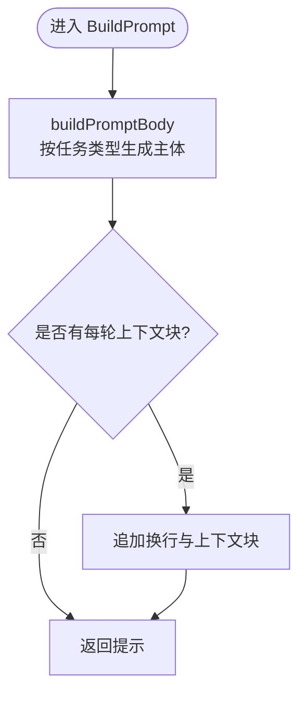
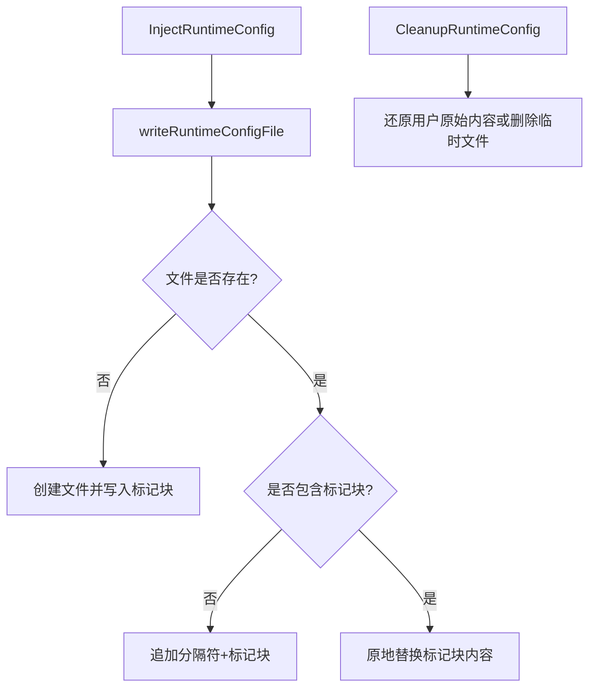
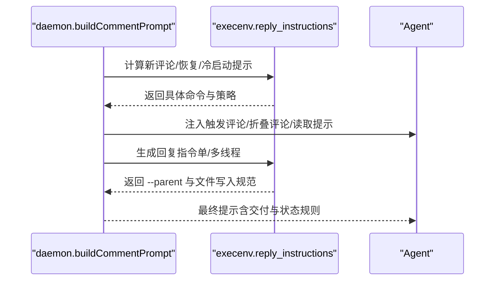
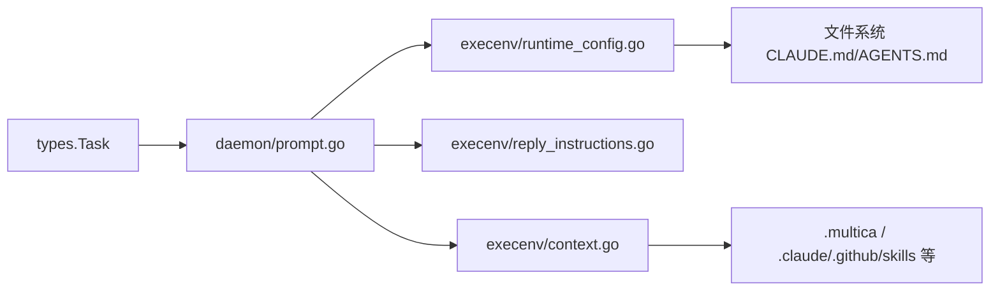

# 提示生成

<cite>
**本文引用的文件**
- [prompt.go](file://server/internal/daemon/prompt.go)
- [reply_instructions.go](file://server/internal/daemon/execenv/reply_instructions.go)
- [runtime_config.go](file://server/internal/daemon/execenv/runtime_config.go)
- [runtime_config_sections.go](file://server/internal/daemon/execenv/runtime_config_sections.go)
- [context.go](file://server/internal/daemon/execenv/context.go)
- [types.go](file://server/internal/daemon/types.go)
</cite>

## 目录
1. [简介](#简介)
2. [项目结构](#项目结构)
3. [核心组件](#核心组件)
4. [架构总览](#架构总览)
5. [详细组件分析](#详细组件分析)
6. [依赖关系分析](#依赖关系分析)
7. [性能考虑](#性能考虑)
8. [故障排查指南](#故障排查指南)
9. [结论](#结论)
10. [附录](#附录)

## 简介
本文聚焦 daemon.BuildPrompt 如何为每轮对话生成提示消息，并说明 brief 文件（CLAUDE.md/AGENTS.md）的生成与注入机制。重点解释：
- 每轮易变字段（发起人、连接应用、续接提示等）为何必须放在“每轮用户消息”而非 brief，以保护提示缓存前缀稳定。
- 回复指令的生成方式，包括任务状态、上下文信息、多线程回复等结构化数据。
- 多智能体协作场景下的提示组装策略。
- 完整流程与性能优化建议。

## 项目结构
本功能涉及两个层次：
- 运行时配置层（execenv）：负责将“固定不变或跨轮稳定的”元技能内容写入 CLAUDE.md/AGENTS.md，并以标记块隔离可替换区域。
- 提示构建层（daemon）：根据任务类型与每轮动态数据拼装最终提示，并将易变片段追加到每轮末尾，避免破坏缓存前缀。

图表来源
- [prompt.go:176-230](file://server/internal/daemon/prompt.go#L176-L230)
- [runtime_config.go:158-190](file://server/internal/daemon/execenv/runtime_config.go#L158-L190)
- [runtime_config.go:225-275](file://server/internal/daemon/execenv/runtime_config.go#L225-L275)
- [reply_instructions.go:5-60](file://server/internal/daemon/execenv/reply_instructions.go#L5-L60)

章节来源
- [prompt.go:176-230](file://server/internal/daemon/prompt.go#L176-L230)
- [runtime_config.go:158-190](file://server/internal/daemon/execenv/runtime_config.go#L158-L190)
- [runtime_config.go:225-275](file://server/internal/daemon/execenv/runtime_config.go#L225-L275)
- [reply_instructions.go:5-60](file://server/internal/daemon/execenv/reply_instructions.go#L5-L60)

## 核心组件
- BuildPrompt：入口函数，先构建主体，再按需追加每轮上下文块，保证缓存前缀稳定。
- buildPromptBody：按任务类型（聊天、评论触发、快速创建、自动运行、普通指派）生成不同主体。
- perTurnContextBlocks：聚合每轮易变上下文（共享工作目录警告、合并冲突、会话连续性通知、发起人、连接应用）。
- execenv 注入器：将运行时元技能写入 CLAUDE.md/AGENTS.md，使用 HTML 注释标记块，支持幂等替换与清理。
- 回复指令生成：提供新评论增量、恢复/冷启动提示、单/多线程回复指令等。

章节来源
- [prompt.go:63-199](file://server/internal/daemon/prompt.go#L63-L199)
- [runtime_config.go:158-190](file://server/internal/daemon/execenv/runtime_config.go#L158-L190)
- [reply_instructions.go:179-338](file://server/internal/daemon/execenv/reply_instructions.go#L179-L338)

## 架构总览
下图展示从任务声明到提示落盘与执行的端到端流程，以及 brief 与每轮提示的边界划分。

图表来源
- [prompt.go:176-230](file://server/internal/daemon/prompt.go#L176-L230)
- [runtime_config.go:158-190](file://server/internal/daemon/execenv/runtime_config.go#L158-L190)
- [runtime_config.go:225-275](file://server/internal/daemon/execenv/runtime_config.go#L225-L275)

## 详细组件分析

### BuildPrompt 与每轮提示装配
- 入口 BuildPrompt 会先调用 buildPromptBody 生成主体，再将 perTurnContextBlocks 的结果追加到末尾。这样，所有可能变化的内容都位于“已缓存前缀之后”，从而最大化缓存命中率。
- 若存在每轮上下文块，BuildPrompt 确保尾部换行正确拼接。

图表来源
- [prompt.go:176-199](file://server/internal/daemon/prompt.go#L176-L199)

章节来源
- [prompt.go:176-199](file://server/internal/daemon/prompt.go#L176-L199)

### 任务类型分支与主体生成
- 聊天任务：buildChatPrompt，处理受众、IM 通道感知、历史读取命令、附件上传策略等。
- 评论触发任务：buildCommentPrompt，嵌入触发评论与折叠评论，计算并注入评论读取提示（新评论/恢复/冷启动），生成回复指令（单线程或多线程）。
- 快速创建任务：buildQuickCreatePrompt，限定只能调用 issue create，并输出字段规则。
- 自动运行任务：buildAutopilotPrompt，注入 run-only 模式指令与边界限制。
- 普通指派任务：默认主体，引导 agent 先获取 issue 详情，再执行。

章节来源
- [prompt.go:201-773](file://server/internal/daemon/prompt.go#L201-L773)

### 每轮易变字段的处理策略
- 共享工作目录警告：当任务未持有目录锁但在工作区目录运行时，提示需提醒并发编辑风险。
- 工作树重放冲突：列出当前分支上的冲突文件，要求优先解决冲突再继续任务。
- 会话连续性通知：根据渠道类型与是否可恢复，给出不同的“会话丢失”提示。
- 发起人块：BuildTaskInitiatorBlock，区分成员/其他智能体，并强调权限边界。
- 连接应用块：BuildConnectedAppsBlock，列出 MCP 连接的应用，指导何时使用。

这些块统一由 perTurnContextBlocks 组合，并追加到每轮末尾，避免影响缓存前缀。

章节来源
- [prompt.go:50-174](file://server/internal/daemon/prompt.go#L50-L174)
- [runtime_config_sections.go:157-229](file://server/internal/daemon/execenv/runtime_config_sections.go#L157-L229)

### Brief 文件生成机制（CLAUDE.md/AGENTS.md）
- 注入点：InjectRuntimeConfig 根据 provider 决定目标文件名（如 CLAUDE.md、AGENTS.md、QWEN.md 等），并调用 writeRuntimeConfigFile。
- 标记块：使用 HTML 注释 BEGIN/END 包裹运行时内容，支持：
  - 首次创建文件时仅写入标记块；
  - 已有文件且无标记块时，追加固定分隔符+标记块；
  - 已有标记块时，原地替换块内容，避免无限增长。
- 清理：CleanupRuntimeConfig 能精确还原用户原始文件字节，删除由 daemon 创建的临时文件。

图表来源
- [runtime_config.go:158-190](file://server/internal/daemon/execenv/runtime_config.go#L158-L190)
- [runtime_config.go:225-275](file://server/internal/daemon/execenv/runtime_config.go#L225-L275)
- [runtime_config.go:317-394](file://server/internal/daemon/execenv/runtime_config.go#L317-L394)

章节来源
- [runtime_config.go:158-190](file://server/internal/daemon/execenv/runtime_config.go#L158-L190)
- [runtime_config.go:225-275](file://server/internal/daemon/execenv/runtime_config.go#L225-L275)
- [runtime_config.go:317-394](file://server/internal/daemon/execenv/runtime_config.go#L317-L394)

### 回复指令生成（任务状态、上下文、多智能体协作）
- 评论读取提示：
  - 新评论增量：BuildNewCommentsHint，携带 issue 级计数与触发线程增量，指引扫描步骤。
  - 恢复路径（空增量）：BuildResumedCommentsHint，明确“无需再扫描”。
  - 恢复路径（未知增量）：BuildResumedUnknownDeltaCommentsHint，强制走扫描。
  - 冷启动：BuildColdCommentsHint，直接指向触发线程与扫描命令。
- 回复指令：
  - 单线程：BuildCommentReplyInstructions，强调写文件→--content-file→清理，禁止 inline 与 heredoc 风险。
  - 多线程：BuildMultiThreadCommentReplyInstructions，按根线程分组，逐线程回复，禁止合并。
- 任务状态与工作流：
  - 工作流章节（writeWorkflowIssue）规定“先 in_progress，后交付，最后校验状态”的时序，强调状态反映问题真实状态而非运行生命周期。
  - 团队长角色（IsSquadLeader）有额外 no_action 与派工语义。

图表来源
- [prompt.go:343-503](file://server/internal/daemon/prompt.go#L343-L503)
- [reply_instructions.go:5-170](file://server/internal/daemon/execenv/reply_instructions.go#L5-L170)
- [reply_instructions.go:179-338](file://server/internal/daemon/execenv/reply_instructions.go#L179-L338)
- [runtime_config_sections.go:594-735](file://server/internal/daemon/execenv/runtime_config_sections.go#L594-L735)

章节来源
- [prompt.go:343-503](file://server/internal/daemon/prompt.go#L343-L503)
- [reply_instructions.go:5-170](file://server/internal/daemon/execenv/reply_instructions.go#L5-L170)
- [reply_instructions.go:179-338](file://server/internal/daemon/execenv/reply_instructions.go#L179-L338)
- [runtime_config_sections.go:594-735](file://server/internal/daemon/execenv/runtime_config_sections.go#L594-L735)

### 多智能体协作场景下的提示组装策略
- 团队长识别：taskIsSquadLeader 通过 is_leader_task/squad_id 能力位判断，或在旧服务器回退到 briefing marker。
- 团队长专属行为：
  - 工作流中允许 no_action 退出并通过 squad activity 记录。
  - 派工后父任务保持 in_progress，直到后续确认达成目标。
- 多智能体协作体现在：
  - 子任务创建与阶段推进（Sub-issue Creation）。
  - 多根线程的评论聚合与分线程回复（BuildMultiThreadCommentReplyInstructions）。
  - 团队长与成员的权限与动作边界（Instruction Precedence）。

章节来源
- [prompt.go:775-800](file://server/internal/daemon/prompt.go#L775-L800)
- [runtime_config_sections.go:594-735](file://server/internal/daemon/execenv/runtime_config_sections.go#L594-L735)
- [runtime_config_sections.go:737-750](file://server/internal/daemon/execenv/runtime_config_sections.go#L737-L750)

### 数据模型与关键字段
- Task 承载了所有用于提示生成的运行时信息，包括：
  - 会话与渠道：ChatSessionID、ChatChannelType、ChatType、ChatInThread、ChatMessage、ChatMessageAttachments。
  - 评论触发：TriggerCommentID、CoalescedComments、TriggerThreadID、NewCommentCount、NewCommentsSince、NewCommentsDeltaKnown。
  - 自动运行/快速创建：Autopilot*、QuickCreate*。
  - 发起人与身份：Initiator*、RequestingUser*。
  - 工作区与项目：WorkspaceContext、Project*、Repos、IssueStatuses。
  - 协作角色：IsLeaderTask、LeaderRoleResolved、SquadID/SquadName。

章节来源
- [types.go:70-176](file://server/internal/daemon/types.go#L70-L176)

## 依赖关系分析
- daemon.prompt 依赖 execenv 提供的运行时配置与回复指令生成。
- execenv.runtime_config 负责 brief 文件的写入与清理，确保对仓库文件的最小侵入与可逆操作。
- execenv.context 负责侧车文件（skills、project resources、task context marker）的写入，供各 provider 原生发现。
- types.Task 是所有提示组装的数据源，字段设计遵循“稳定在前、易变在后”的原则，配合 BuildPrompt 的追加策略实现缓存友好。

图表来源
- [types.go:70-176](file://server/internal/daemon/types.go#L70-L176)
- [prompt.go:176-230](file://server/internal/daemon/prompt.go#L176-L230)
- [runtime_config.go:158-190](file://server/internal/daemon/execenv/runtime_config.go#L158-L190)
- [context.go:121-193](file://server/internal/daemon/execenv/context.go#L121-L193)

章节来源
- [types.go:70-176](file://server/internal/daemon/types.go#L70-L176)
- [prompt.go:176-230](file://server/internal/daemon/prompt.go#L176-L230)
- [runtime_config.go:158-190](file://server/internal/daemon/execenv/runtime_config.go#L158-L190)
- [context.go:121-193](file://server/internal/daemon/execenv/context.go#L121-L193)

## 性能考虑
- 缓存前缀稳定：
  - 将易变字段（发起人、连接应用、续接提示、工作树冲突、共享目录警告）放入每轮用户消息末尾，避免破坏 messages[0] 的缓存前缀。
- 最小化重复：
  - 回复指令与评论读取提示集中在 execenv 生成，避免多处维护导致不一致与冗余。
- 文件写入幂等：
  - brief 标记块原地替换，避免文件无限增长；清理路径精确还原用户原始字节。
- 命令提示优化：
  - 评论读取采用“根扫描 + 按需展开”的两步法，避免全量拉取导致的延迟与成本。
- 安全与健壮性：
  - 文件名/路径使用 %q 转义，防止恶意文件名注入 Markdown 结构。
  - 评论正文一律通过文件写入与 --content-file 提交，规避 shell 管道与编码问题。

[本节为通用性能建议，不直接分析具体文件]

## 故障排查指南
- 提示缓存命中率低：
  - 检查是否将易变字段错误地写入了 brief（应放在 perTurnContextBlocks 并追加到每轮末尾）。
- 评论回复错乱：
  - 核对 BuildCommentReplyInstructions 与 BuildMultiThreadCommentReplyInstructions 的使用场景，确保 --parent 值来自本轮触发评论，不沿用历史值。
- 文件写入失败或乱码：
  - 确认使用文件写入工具生成 UTF-8 文件，再通过 --content-file 提交；Windows 下特别注意 PowerShell 编码问题。
- brief 污染用户仓库：
  - 使用 CleanupRuntimeConfig 进行清理，确保标记块被移除且用户原始内容无损。

章节来源
- [reply_instructions.go:179-338](file://server/internal/daemon/execenv/reply_instructions.go#L179-L338)
- [runtime_config.go:317-394](file://server/internal/daemon/execenv/runtime_config.go#L317-L394)

## 结论
- daemon.BuildPrompt 通过“稳定前缀 + 易变后缀”的策略，在保证提示一致性的同时最大化缓存命中。
- execenv 的 brief 注入机制以标记块为核心，实现了幂等写入与无损清理，保障对仓库文件的最小侵入。
- 回复指令与评论读取提示集中管理，既保证了跨平台一致性，又降低了维护成本。
- 多智能体协作通过团队长角色、子任务与多根线程回复机制得到清晰表达。
- 建议在新增易变字段时始终遵循“追加到每轮末尾”的原则，并复用 execenv 的生成函数，以保持缓存友好与一致性。

[本节为总结性内容，不直接分析具体文件]

## 附录
- 关键常量与标识：
  - 标记块开始/结束：BEGIN/END MULTICA-RUNTIME。
  - 团队长协议标记：Squad Operating Protocol（仅用于旧服务器回退识别）。
  - 自动运行边界：AutopilotIssueCommandsGuard。
- 渠道与受众：
  - ChatChannelType/ChatType 决定受众与历史读取命令。
  - ChannelCarriesFiles/ChannelDeliversFiles 决定附件投递策略。

章节来源
- [runtime_config.go:16-52](file://server/internal/daemon/execenv/runtime_config.go#L16-L52)
- [prompt.go:775-800](file://server/internal/daemon/prompt.go#L775-L800)
- [runtime_config_sections.go:571-592](file://server/internal/daemon/execenv/runtime_config_sections.go#L571-L592)