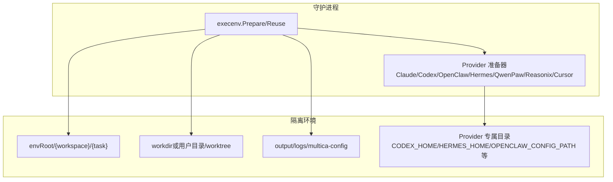
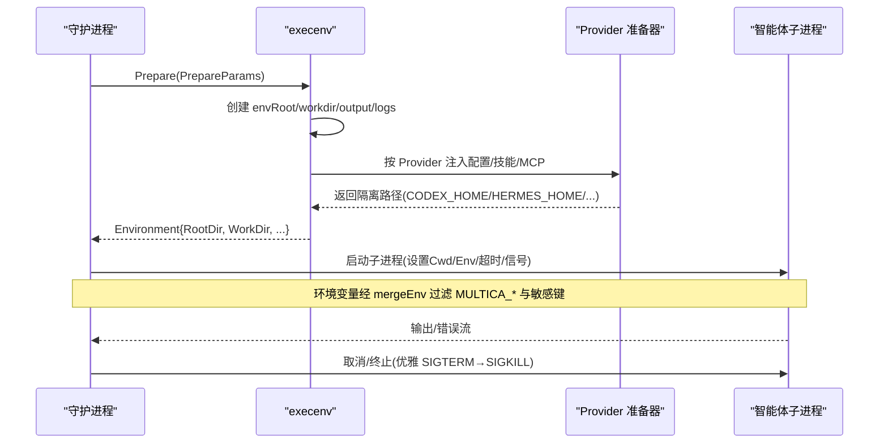
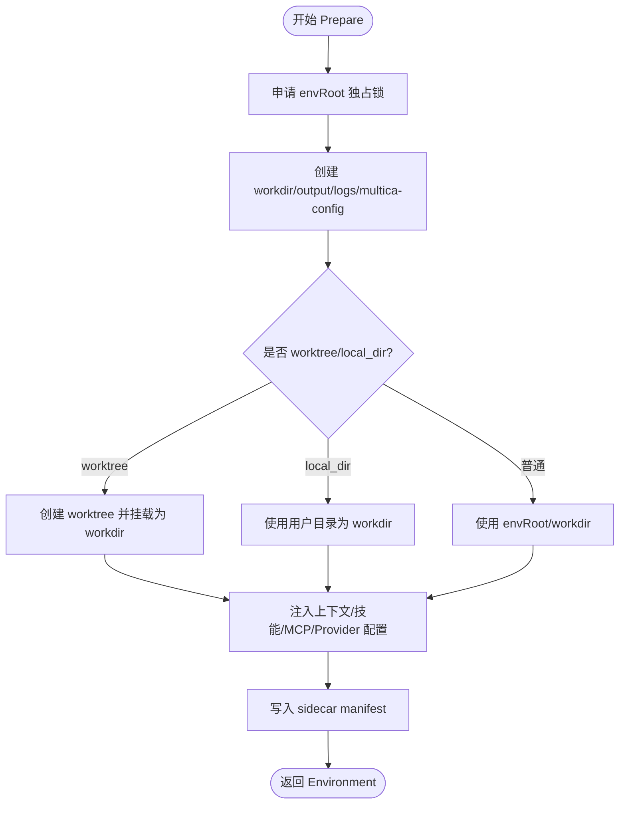
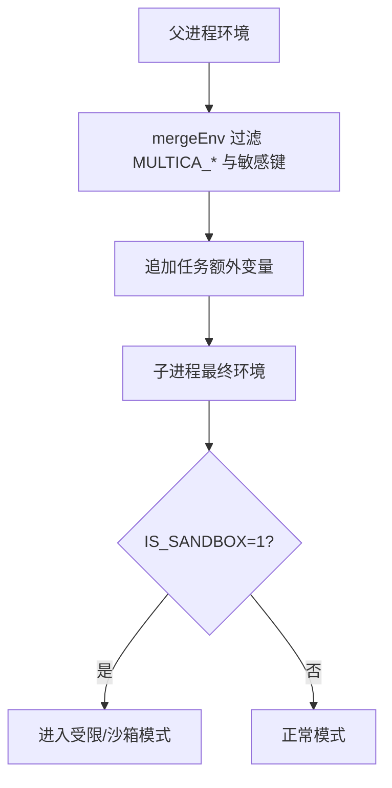
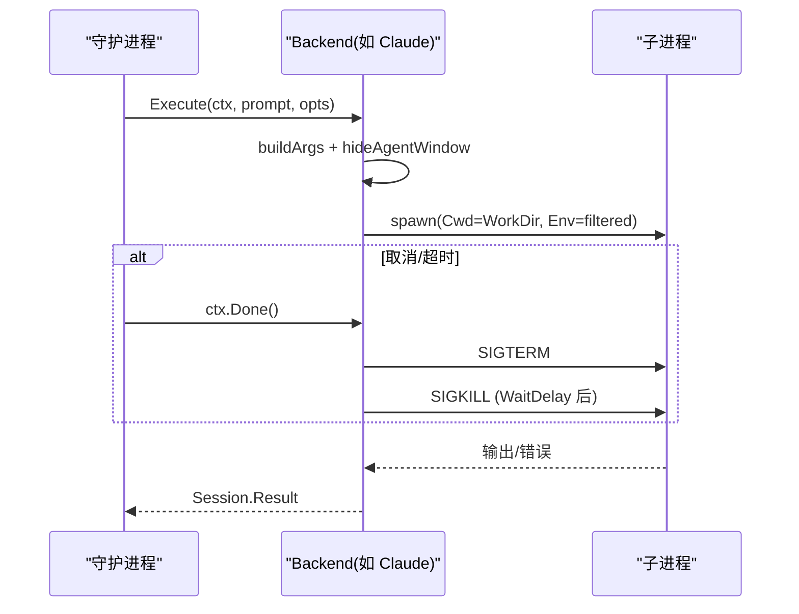
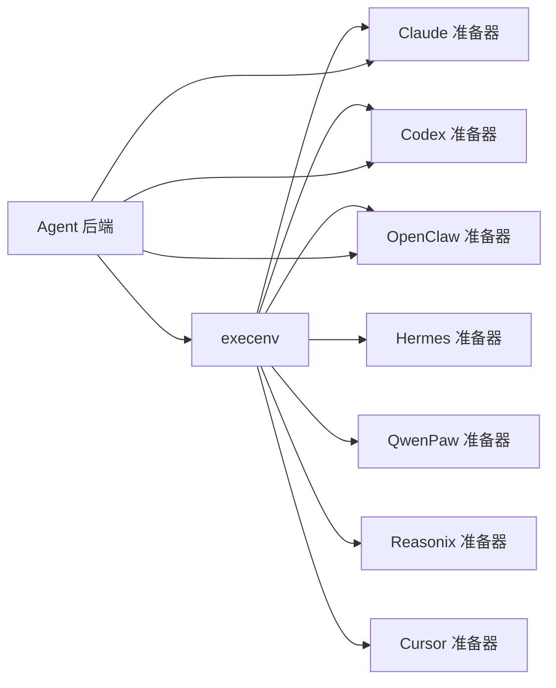

# 环境隔离

<cite>
**本文引用的文件**
- [execenv.go](file://server/internal/daemon/execenv/execenv.go)
- [execenv_test.go](file://server/internal/daemon/execenv/execenv_test.go)
- [isolation_unix.go](file://server/internal/daemon/execenv/isolation_unix.go)
- [isolation_windows.go](file://server/internal/daemon/execenv/isolation_windows.go)
- [envlock_unix.go](file://server/internal/daemon/execenv/envlock_unix.go)
- [envlock_windows.go](file://server/internal/daemon/execenv/envlock_windows.go)
- [claude.go](file://server/pkg/agent/claude.go)
- [openclaw.go](file://server/pkg/agent/openclaw.go)
- [CLI_AND_DAEMON.md](file://CLI_AND_DAEMON.md)
- [apps/docs/content/docs/daemon-runtimes.mdx](file://apps/docs/content/docs/daemon-runtimes.mdx)
</cite>

## 目录
1. [简介](#简介)
2. [项目结构](#项目结构)
3. [核心组件](#核心组件)
4. [架构总览](#架构总览)
5. [详细组件分析](#详细组件分析)
6. [依赖关系分析](#依赖关系分析)
7. [性能考虑](#性能考虑)
8. [故障排除指南](#故障排除指南)
9. [结论](#结论)
10. [附录](#附录)

## 简介
本文件系统性说明 Multica 守护进程如何通过 execenv 实现跨平台的执行环境隔离，覆盖 Unix 与 Windows 在进程、文件系统、环境变量等方面的差异化策略；阐述环境变量锁定机制，防止并发任务间变量污染；详解 Claude Code、Codex、OpenClaw 等智能体 CLI 的独立运行环境适配；并给出沙箱机制、资源限制、监控调试以及平台配置与排障建议。

## 项目结构
围绕“每任务一环境”的设计，execenv 负责为每个任务创建独立的根目录、工作目录、输出与日志目录，并向智能体注入上下文文件（如 CLAUDE.md/AGENTS.md）、技能水合、MCP 配置、会话存储等。不同 Provider（Claude、Codex、OpenClaw、Hermes、QwenPaw、Reasonix、Cursor）通过 execenv 的 Prepare/Reuse 流程获得各自所需的隔离侧车与运行时配置。

图表来源
- [execenv.go:409-744](file://server/internal/daemon/execenv/execenv.go#L409-L744)

章节来源
- [execenv.go:19-127](file://server/internal/daemon/execenv/execenv.go#L19-L127)
- [execenv.go:267-352](file://server/internal/daemon/execenv/execenv.go#L267-L352)
- [execenv.go:409-744](file://server/internal/daemon/execenv/execenv.go#L409-L744)

## 核心组件
- 环境根与工作目录：每个任务拥有稳定的 envRoot，默认 workdir 位于 envRoot/workdir；支持 local_directory 与 worktree 模式，避免直接修改用户目录。
- 上下文与技能注入：将任务元数据、项目上下文、仓库信息写入 .agent_context/.multica 等侧车目录，并按 Provider 生成 CLAUDE.md/AGENTS.md 等 brief。
- Provider 专属隔离：
  - Codex：按任务创建 CODEX_HOME，隔离会话与技能；Windows 下可结合自定义参数决定是否启用沙箱。
  - Claude：生成任务级 settings 文件以禁用运行时技能；必要时通过 IS_SANDBOX 控制权限绕过。
  - OpenClaw：合成 per-task 配置，固定 workspaceDir 指向 workdir，并通过 OPENCLAW_CONFIG_PATH 暴露。
  - Hermes：可选 HERMES_HOME 叠加层，链接用户真实 skills/memory/session 到任务目录。
  - QwenPaw：生成 per-task workspace，使绑定技能立即生效。
  - Reasonix：写入 project-scoped 配置限制工具能力。
  - Cursor：管理 MCP 配置与 CURSOR_DATA_DIR 隔离审批。
- 安全标记与清理：写 task marker、sidecar manifest，失败时回滚；GC 回收 envRoot。

章节来源
- [execenv.go:409-744](file://server/internal/daemon/execenv/execenv.go#L409-L744)
- [execenv_test.go:474-548](file://server/internal/daemon/execenv/execenv_test.go#L474-L548)
- [execenv_test.go:550-635](file://server/internal/daemon/execenv/execenv_test.go#L550-L635)

## 架构总览
下图展示从守护进程装配执行环境到子进程执行的端到端流程，包括环境准备、Provider 适配、环境变量过滤与沙箱标志传递。

图表来源
- [execenv.go:409-744](file://server/internal/daemon/execenv/execenv.go#L409-L744)
- [claude.go:50-94](file://server/pkg/agent/claude.go#L50-L94)
- [claude.go:900-935](file://server/pkg/agent/claude.go#L900-L935)

章节来源
- [execenv.go:409-744](file://server/internal/daemon/execenv/execenv.go#L409-L744)
- [claude.go:50-94](file://server/pkg/agent/claude.go#L50-L94)
- [claude.go:900-935](file://server/pkg/agent/claude.go#L900-L935)

## 详细组件分析

### 文件系统隔离
- 目录结构：envRoot 包含 workdir、output、logs、multica-config；本地目录模式下 workdir 指向用户目录，但 output/logs/multica-config 仍位于 envRoot。
- 工作树模式：对 local_directory 资源使用 git worktree 作为 workdir，任务结束后丢弃分支，避免污染用户目录。
- 侧车与清单：写入 sidecar manifest 记录所有变更；失败时回滚，保证用户目录不被残留标记阻塞。
- 路径安全：可读前缀经 sanitize 并截断，确保 Windows 路径预算不超限；稳定 ID 后缀防冲突。

图表来源
- [execenv.go:409-744](file://server/internal/daemon/execenv/execenv.go#L409-L744)
- [execenv_test.go:474-548](file://server/internal/daemon/execenv/execenv_test.go#L474-L548)

章节来源
- [execenv.go:409-744](file://server/internal/daemon/execenv/execenv.go#L409-L744)
- [execenv_test.go:474-548](file://server/internal/daemon/execenv/execenv_test.go#L474-L548)

### 环境变量隔离与锁定
- 继承过滤：子进程环境由 mergeEnv 构建，剔除 daemon 自身的多租户相关键（MULTICA_*）与敏感键，仅注入任务所需变量。
- 沙箱标志：IS_SANDBOX 用于指示子进程处于容器/沙箱中，影响权限检查与行为分支。
- 并发安全：env lock 在 Unix/Windows 上分别实现，确保同一 envRoot 不会被多个任务同时写入或破坏。

图表来源
- [claude.go:900-935](file://server/pkg/agent/claude.go#L900-L935)
- [envlock_unix.go](file://server/internal/daemon/execenv/envlock_unix.go)
- [envlock_windows.go](file://server/internal/daemon/execenv/envlock_windows.go)

章节来源
- [claude.go:900-935](file://server/pkg/agent/claude.go#L900-L935)
- [envlock_unix.go](file://server/internal/daemon/execenv/envlock_unix.go)
- [envlock_windows.go](file://server/internal/daemon/execenv/envlock_windows.go)

### 进程隔离与生命周期
- 工作目录与命令组装：根据 Provider 与 ExecOptions 组装命令行与 CWD，隐藏窗口（桌面端），设置 WaitDelay 与 Cancel 策略。
- 优雅退出：取消时先发送 SIGTERM，再 SIGKILL，避免 os/exec 默认行为导致进程组被立刻杀死。
- 超时与资源限制：通过 ExecOptions.Timeout 控制任务时长；配合守护进程的进程树控制器进行资源上限与回收。

图表来源
- [claude.go:50-94](file://server/pkg/agent/claude.go#L50-L94)

章节来源
- [claude.go:50-94](file://server/pkg/agent/claude.go#L50-L94)

### 平台差异：Unix vs Windows
- 隔离策略：
  - Unix：基于文件系统权限、进程 UID/GID、chroot/命名空间（由宿主容器提供）实现强隔离；execenv 通过目录结构与权限位（如 multica-config 0700）强化隔离。
  - Windows：通过工作树、独立 HOME/PROFILE 映射、受控环境变量、以及 Provider 特定的沙箱开关（如 Codex 的 windows.sandbox）达成等效隔离。
- 执行格式错误处理：非 Windows 平台统一按 ENOEXEC 处理不可执行程序；Windows 有平台特定判断。
- 进程树与句柄：Windows 需显式设置句柄继承标志，避免子进程继承父进程句柄。

章节来源
- [isolation_unix.go](file://server/internal/daemon/execenv/isolation_unix.go)
- [isolation_windows.go](file://server/internal/daemon/execenv/isolation_windows.go)
- [exec_format_other.go](file://server/pkg/agent/exec_format_other.go)

### 智能体 CLI 的特定适配
- Claude Code：
  - 注入任务级 settings 禁用运行时技能；必要时通过 IS_SANDBOX 允许在容器内绕过 root/sudo 限制。
  - 支持 --mcp-config 指向临时文件，避免继承外部会话的 MCP 配置。
- Codex：
  - 使用 per-task CODEX_HOME 隔离会话与技能；Windows 下可通过自定义参数选择沙箱模式。
  - 文档强调令牌仅在进程环境中保留，不应出现在提示或持久化配置中。
- OpenClaw：
  - 合成 per-task 配置，固定 workspaceDir 为 workdir；通过 OPENCLAW_CONFIG_PATH 暴露给子进程。
  - 版本检测与参数白名单，禁止用户覆盖关键参数。
- 其他：
  - Hermes：可选 HERMES_HOME 叠加层，链接 memory/session 到任务目录。
  - QwenPaw：生成 per-task workspace，使绑定技能立即生效。
  - Reasonix：写入 project-scoped 配置限制工具能力。
  - Cursor：管理 MCP 配置与 CURSOR_DATA_DIR 隔离审批。

章节来源
- [execenv.go:632-739](file://server/internal/daemon/execenv/execenv.go#L632-L739)
- [openclaw.go:37-66](file://server/pkg/agent/openclaw.go#L37-L66)
- [CLI_AND_DAEMON.md:201-231](file://CLI_AND_DAEMON.md#L201-L231)
- [apps/docs/content/docs/daemon-runtimes.mdx:111](file://apps/docs/content/docs/daemon-runtimes.mdx#L111)

### 沙箱机制与资源限制
- 沙箱标志：IS_SANDBOX=1 表示子进程运行于容器/沙箱，可用于放宽某些权限检查或切换行为分支。
- 令牌与环境：严格过滤 MULTICA_* 与敏感键，避免凭证泄露；Codex 等工具若自带过滤器，需在守护进程中放行必要变量。
- 资源限制：通过超时、优雅终止、进程树控制器限制 CPU/内存/IO；GC 定期回收 envRoot 与仓库缓存。

章节来源
- [claude.go:900-935](file://server/pkg/agent/claude.go#L900-L935)
- [apps/docs/content/docs/daemon-runtimes.mdx:111](file://apps/docs/content/docs/daemon-runtimes.mdx#L111)

### 监控与调试
- 日志与指标：execenv 与 Provider 后端均记录关键事件（准备、启动、取消、错误）；守护进程暴露指标便于观测。
- 诊断要点：
  - 确认 envRoot 存在且权限正确（multica-config 0700）。
  - 检查 sidecar manifest 是否写入成功，失败时是否触发回滚。
  - 验证 IS_SANDBOX 与 Provider 配置（如 OPENCLAW_CONFIG_PATH、CURSOR_DATA_DIR）是否正确传递。
  - 观察子进程退出码与标准输出/错误，定位 Prompt/技能加载问题。

章节来源
- [execenv.go:741-744](file://server/internal/daemon/execenv/execenv.go#L741-L744)
- [execenv_test.go:474-548](file://server/internal/daemon/execenv/execenv_test.go#L474-L548)

## 依赖关系分析
execenv 与 Agent 后端、Provider 准备器之间存在清晰边界：
- execenv 负责“环境与侧车”，不关心具体 Prompt 协议。
- Agent 后端负责“命令组装、I/O 流、超时与取消”。
- Provider 准备器负责“按 Provider 特性注入配置与技能”。

图表来源
- [execenv.go:632-739](file://server/internal/daemon/execenv/execenv.go#L632-L739)
- [claude.go:50-94](file://server/pkg/agent/claude.go#L50-L94)
- [openclaw.go:37-66](file://server/pkg/agent/openclaw.go#L37-L66)

章节来源
- [execenv.go:632-739](file://server/internal/daemon/execenv/execenv.go#L632-L739)
- [claude.go:50-94](file://server/pkg/agent/claude.go#L50-L94)
- [openclaw.go:37-66](file://server/pkg/agent/openclaw.go#L37-L66)

## 性能考虑
- 目录与路径：可读前缀截断与稳定 ID 后缀减少 Windows 路径长度压力。
- 共享缓存：仓库采用裸克隆 + worktree，减少重复 clone；GC 在空闲时维护 reflog/gc。
- 并发：envRoot 独占锁避免竞争；Prepare/Reuse 分离，复用会话与配置降低冷启动开销。
- I/O 最小化：仅在必要时写入 sidecar 与 manifest；失败快速回滚。

[本节为通用指导，无需引用具体文件]

## 故障排除指南
- 无法启动子进程：
  - 检查 PATH 中是否存在对应 CLI（如 openclaw/codex/claude）。
  - 确认 IS_SANDBOX 与 Provider 配置一致（例如 Claude 在 root/sudo 下需要 IS_SANDBOX=1）。
- 环境变量污染：
  - 确认 mergeEnv 已过滤 MULTICA_* 与敏感键；检查子进程实际环境。
- 文件访问失败：
  - 校验 envRoot/workdir 权限；确认 multica-config 为 0700。
  - 查看 sidecar manifest 是否完整；失败时是否触发回滚。
- 会话未恢复：
  - 检查 Provider 专属目录（CODEX_HOME/HERMES_HOME）是否存在且可读写。
  - 确认 ReuseParams 中的 ResumeSessionID/Profile 等参数正确传递。
- Windows 特有：
  - 确认工作树创建成功；检查句柄继承设置与沙箱开关。

章节来源
- [execenv.go:409-744](file://server/internal/daemon/execenv/execenv.go#L409-L744)
- [execenv_test.go:474-548](file://server/internal/daemon/execenv/execenv_test.go#L474-L548)
- [claude.go:900-935](file://server/pkg/agent/claude.go#L900-L935)

## 结论
Multica 通过 execenv 实现了以“任务为中心”的执行环境隔离，结合文件系统、环境变量、进程生命周期与 Provider 专属适配，确保不同智能体 CLI 在跨平台环境下安全、稳定地运行。Unix 与 Windows 的差异通过平台特定实现得到弥合；沙箱标志与严格的变量过滤进一步降低了风险。配合完善的监控与排障手段，可在生产环境中可靠地调度与执行 AI 任务。

[本节为总结性内容，无需引用具体文件]

## 附录
- 平台配置示例（概念性）：
  - Unix：确保守护进程以非 root 用户运行；如需容器化，设置 IS_SANDBOX=1。
  - Windows：为 Codex 指定 windows.sandbox 参数；确保工作树与 HOME 映射正确。
- 最佳实践：
  - 始终通过 execenv 准备环境，不要直接操作用户目录。
  - 谨慎传递敏感变量，遵循 mergeEnv 过滤规则。
  - 利用 Provider 专属目录隔离会话与配置，避免跨任务污染。

[本节为补充说明，无需引用具体文件]