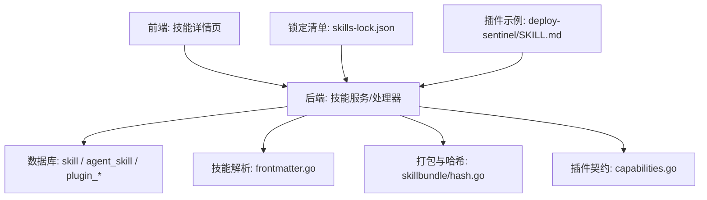
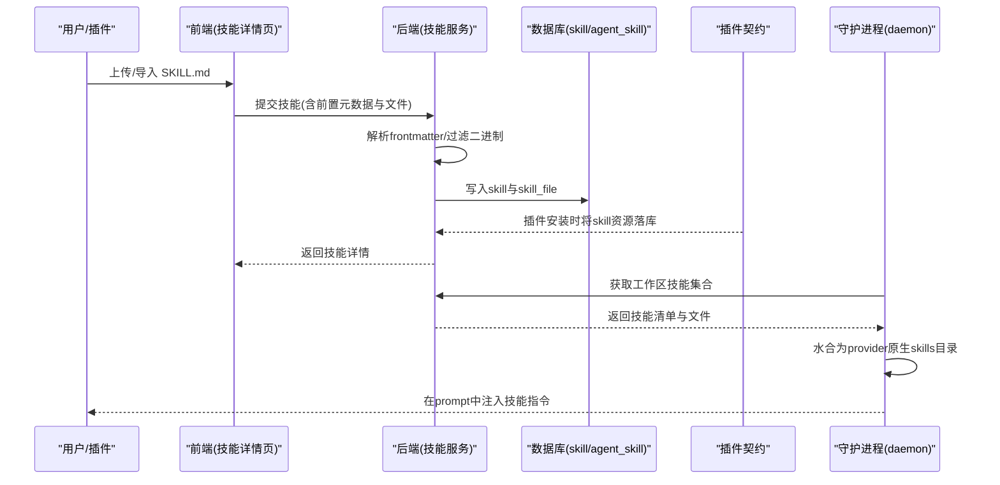
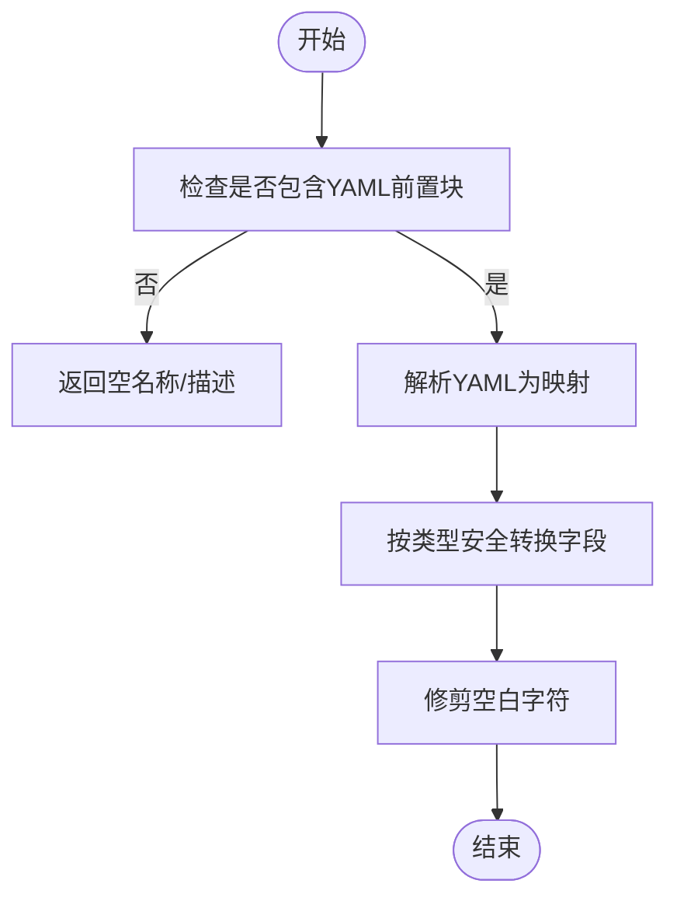
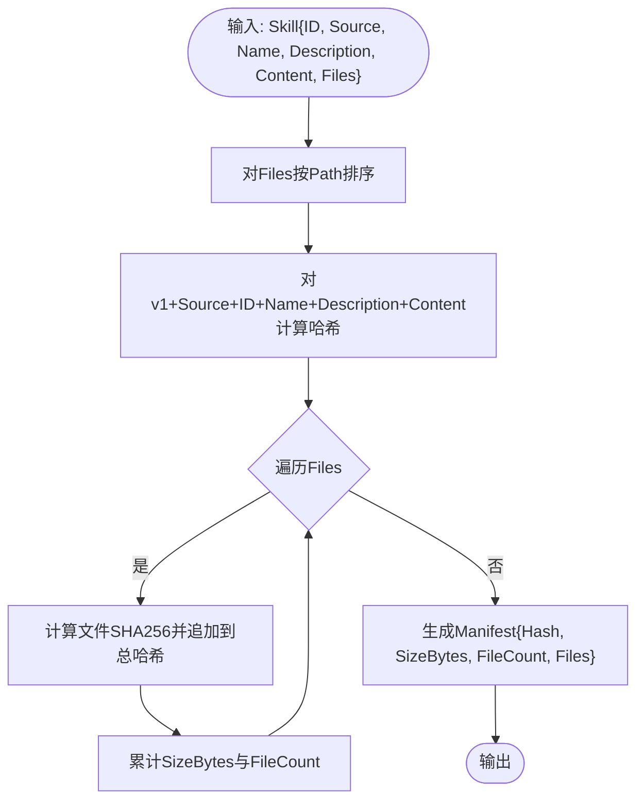
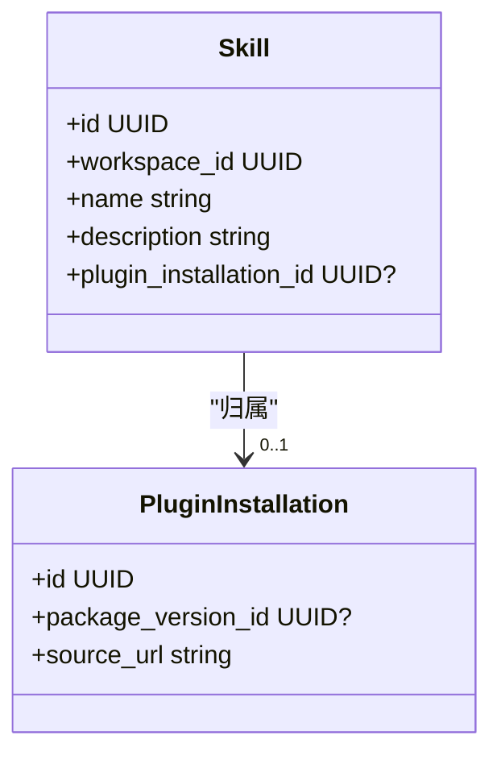
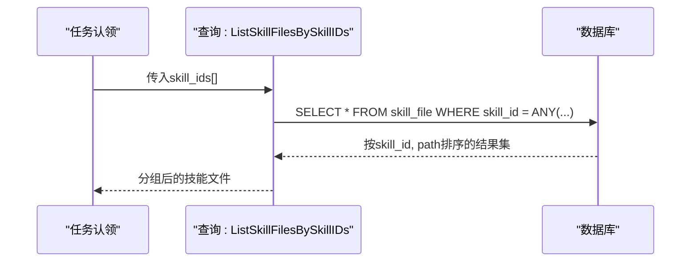
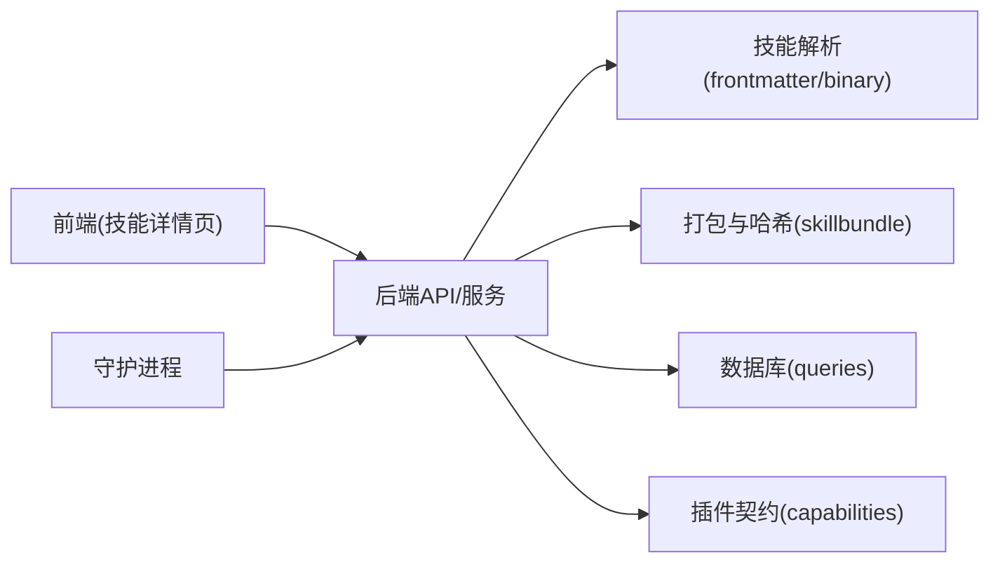

# 技能系统

<cite>
**本文引用的文件**
- [skills-lock.json](file://skills-lock.json)
- [server/internal/skill/frontmatter.go](file://server/internal/skill/frontmatter.go)
- [server/internal/skill/binary.go](file://server/internal/skill/binary.go)
- [server/pkg/skillbundle/hash.go](file://server/pkg/skillbundle/hash.go)
- [server/pkg/plugincontract/capabilities.go](file://server/pkg/plugincontract/capabilities.go)
- [server/migrations/368_skill_plugin_ownership.up.sql](file://server/migrations/368_skill_plugin_ownership.up.sql)
- [server/migrations/161_agent_skill_enabled.up.sql](file://server/migrations/161_agent_skill_enabled.up.sql)
- [server/pkg/db/queries/skill.sql](file://server/pkg/db/queries/skill.sql)
- [server/pkg/db/queries/plugin.sql](file://server/pkg/db/queries/plugin.sql)
- [apps/desktop/src/renderer/src/pages/skill-detail-page.tsx](file://apps/desktop/src/renderer/src/pages/skill-detail-page.tsx)
- [examples/plugins/deploy-sentinel/skills/incident-response/SKILL.md](file://examples/plugins/deploy-sentinel/skills/incident-response/SKILL.md)
- [apps/docs/content/docs/skills.zh.mdx](file://apps/docs/content/docs/skills.zh.mdx)
</cite>

## 目录
1. [简介](#简介)
2. [项目结构](#项目结构)
3. [核心组件](#核心组件)
4. [架构总览](#架构总览)
5. [详细组件分析](#详细组件分析)
6. [依赖关系分析](#依赖关系分析)
7. [性能考量](#性能考量)
8. [故障排查指南](#故障排查指南)
9. [结论](#结论)
10. [附录](#附录)

## 简介
本文件系统性阐述 Multica 的技能系统：技能作为可复用的知识单元，如何在工作区与智能体之间共享、组合与版本化；技能的创建、发布、安装与生命周期管理；技能包的目录结构与元数据定义；技能水合（将平台无关的 SKILL.md 转换为各 provider 原生格式）的流程；斜杠命令技能的注册、参数解析与执行；权限控制与安全边界；以及测试、调试与性能优化实践。

## 项目结构
技能系统在仓库中由“服务端能力 + 前端展示 + 插件示例 + 锁定清单”共同构成：
- 服务端技能解析与打包：位于 server/internal/skill 与 server/pkg/skillbundle，负责解析 SKILL.md 的前置元数据、识别二进制文件、生成稳定哈希清单。
- 插件与技能资源：通过 plugin contract 将插件声明的 skill 资源写入统一的 skill 表，并支持按安装来源清理。
- 数据库迁移与查询：skill 表扩展了插件归属与启用开关；提供批量读取技能文件的查询以优化热路径。
- 前端技能详情：桌面端页面通过工作区查询加载技能详情。
- 锁定清单：根级 skills-lock.json 记录已安装的外部技能源与计算哈希，用于可重复安装。
- 插件示例：examples/plugins 下的示例插件包含内置 SKILL.md，演示技能随插件安装到工作区的流程。

图表来源
- [server/internal/skill/frontmatter.go:17-48](file://server/internal/skill/frontmatter.go#L17-L48)
- [server/pkg/skillbundle/hash.go:43-79](file://server/pkg/skillbundle/hash.go#L43-L79)
- [server/pkg/plugincontract/capabilities.go:50-58](file://server/pkg/plugincontract/capabilities.go#L50-L58)
- [server/pkg/db/queries/skill.sql:47-67](file://server/pkg/db/queries/skill.sql#L47-L67)
- [server/pkg/db/queries/plugin.sql:330-346](file://server/pkg/db/queries/plugin.sql#L330-L346)
- [apps/desktop/src/renderer/src/pages/skill-detail-page.tsx:8-16](file://apps/desktop/src/renderer/src/pages/skill-detail-page.tsx#L8-L16)
- [skills-lock.json:1-27](file://skills-lock.json#L1-L27)
- [examples/plugins/deploy-sentinel/skills/incident-response/SKILL.md:1-60](file://examples/plugins/deploy-sentinel/skills/incident-response/SKILL.md#L1-L60)

章节来源
- [server/internal/skill/frontmatter.go:17-48](file://server/internal/skill/frontmatter.go#L17-L48)
- [server/pkg/skillbundle/hash.go:43-79](file://server/pkg/skillbundle/hash.go#L43-L79)
- [server/pkg/plugincontract/capabilities.go:50-58](file://server/pkg/plugincontract/capabilities.go#L50-L58)
- [server/pkg/db/queries/skill.sql:47-67](file://server/pkg/db/queries/skill.sql#L47-L67)
- [server/pkg/db/queries/plugin.sql:330-346](file://server/pkg/db/queries/plugin.sql#L330-L346)
- [apps/desktop/src/renderer/src/pages/skill-detail-page.tsx:8-16](file://apps/desktop/src/renderer/src/pages/skill-detail-page.tsx#L8-L16)
- [skills-lock.json:1-27](file://skills-lock.json#L1-L27)
- [examples/plugins/deploy-sentinel/skills/incident-response/SKILL.md:1-60](file://examples/plugins/deploy-sentinel/skills/incident-response/SKILL.md#L1-L60)

## 核心组件
- 技能元数据解析：从 SKILL.md 的 YAML 前置块提取 name 与 description，兼容多种标量与结构化值，并在两端（Go/TS）保持一致的转换策略。
- 二进制文件过滤：保守黑名单判断常见二进制扩展名，避免将非文本内容存入 TEXT 列或经 JSON 序列化后损坏。
- 技能包清单与哈希：对技能主内容与附加文件进行排序与哈希，生成稳定的 Manifest，用于缓存、去重与变更检测。
- 插件技能归属：插件安装的 skill 资源直接写入现有 skill 表，并通过 plugin_installation_id 标记来源，便于卸载时精准清理。
- 智能体启用开关：agent_skill.enabled 允许为每个智能体独立开启/关闭某项技能。
- 批量文件读取：按 skill_ids 批量拉取技能文件，减少热路径上的往返次数。
- 前端技能详情：桌面端通过工作区查询加载技能详情，支撑查看与编辑体验。

章节来源
- [server/internal/skill/frontmatter.go:17-48](file://server/internal/skill/frontmatter.go#L17-L48)
- [server/internal/skill/binary.go:8-40](file://server/internal/skill/binary.go#L8-L40)
- [server/pkg/skillbundle/hash.go:43-79](file://server/pkg/skillbundle/hash.go#L43-L79)
- [server/migrations/368_skill_plugin_ownership.up.sql:1-16](file://server/migrations/368_skill_plugin_ownership.up.sql#L1-L16)
- [server/migrations/161_agent_skill_enabled.up.sql:1-2](file://server/migrations/161_agent_skill_enabled.up.sql#L1-L2)
- [server/pkg/db/queries/skill.sql:53-67](file://server/pkg/db/queries/skill.sql#L53-L67)
- [apps/desktop/src/renderer/src/pages/skill-detail-page.tsx:8-16](file://apps/desktop/src/renderer/src/pages/skill-detail-page.tsx#L8-L16)

## 架构总览
技能系统围绕“SKILL.md 为中心”的跨 provider 抽象展开：
- 输入：用户或插件提供的 SKILL.md（可能附带多个文件）。
- 处理：解析元数据、过滤二进制、生成清单哈希、持久化为 workspace 技能。
- 输出：在 daemon 构建 prompt 时，将技能水合到各 provider 的原生 skills 目录，每轮提示词由 daemon.BuildPrompt 生成。
- 版本与锁定：通过 skills-lock.json 锁定外部技能源与 computedHash，确保可重复安装。
- 权限与可见性：工作区成员可创建/导入技能；仅创建者与管理员可修改或删除；删除会同时从所有智能体移除该技能。

图表来源
- [server/internal/skill/frontmatter.go:17-48](file://server/internal/skill/frontmatter.go#L17-L48)
- [server/internal/skill/binary.go:8-40](file://server/internal/skill/binary.go#L8-L40)
- [server/pkg/db/queries/skill.sql:47-67](file://server/pkg/db/queries/skill.sql#L47-L67)
- [server/pkg/plugincontract/capabilities.go:50-58](file://server/pkg/plugincontract/capabilities.go#L50-L58)
- [apps/desktop/src/renderer/src/pages/skill-detail-page.tsx:8-16](file://apps/desktop/src/renderer/src/pages/skill-detail-page.tsx#L8-L16)

## 详细组件分析

### 技能元数据与二进制处理
- 前置元数据解析：使用正则定位 YAML 块，解码为通用映射并按键类型安全转换，保证 Go/TS 两侧一致。
- 二进制过滤：基于扩展名的保守黑名单，跳过图片、字体、压缩包、文档、媒体、可执行与数据库等二进制文件，避免存储与传输损坏。

图表来源
- [server/internal/skill/frontmatter.go:17-48](file://server/internal/skill/frontmatter.go#L17-L48)

章节来源
- [server/internal/skill/frontmatter.go:17-48](file://server/internal/skill/frontmatter.go#L17-L48)
- [server/internal/skill/binary.go:8-40](file://server/internal/skill/binary.go#L8-L40)

### 技能包清单与哈希
- 清单构建：对技能主内容与附加文件列表排序后计算 SHA256，生成稳定 Manifest，包含总大小、文件数与每个文件的 digest。
- 用途：用于缓存键、增量更新、去重与完整性校验。

图表来源
- [server/pkg/skillbundle/hash.go:43-79](file://server/pkg/skillbundle/hash.go#L43-L79)

章节来源
- [server/pkg/skillbundle/hash.go:43-79](file://server/pkg/skillbundle/hash.go#L43-L79)

### 插件技能与版本锁定
- 插件技能归属：插件的 skill 资源直接写入现有 skill 表，并通过 plugin_installation_id 标记来源，卸载时按来源精确清理。
- 版本锁定：skills-lock.json 维护已安装的外部技能源、来源类型与 computedHash，确保团队可重复安装与一致性。

图表来源
- [server/migrations/368_skill_plugin_ownership.up.sql:1-16](file://server/migrations/368_skill_plugin_ownership.up.sql#L1-L16)
- [server/pkg/db/queries/plugin.sql:330-346](file://server/pkg/db/queries/plugin.sql#L330-L346)
- [skills-lock.json:1-27](file://skills-lock.json#L1-L27)

章节来源
- [server/migrations/368_skill_plugin_ownership.up.sql:1-16](file://server/migrations/368_skill_plugin_ownership.up.sql#L1-L16)
- [server/pkg/db/queries/plugin.sql:330-346](file://server/pkg/db/queries/plugin.sql#L330-L346)
- [skills-lock.json:1-27](file://skills-lock.json#L1-L27)

### 智能体启用与批量读取
- 启用开关：agent_skill.enabled 允许为每个智能体单独启用/禁用技能，保持细粒度控制。
- 批量读取：ListSkillFilesBySkillIDs 支持一次性加载多个技能的文件，降低任务认领热路径的数据库往返。

图表来源
- [server/pkg/db/queries/skill.sql:53-67](file://server/pkg/db/queries/skill.sql#L53-L67)
- [server/migrations/161_agent_skill_enabled.up.sql:1-2](file://server/migrations/161_agent_skill_enabled.up.sql#L1-L2)

章节来源
- [server/pkg/db/queries/skill.sql:53-67](file://server/pkg/db/queries/skill.sql#L53-L67)
- [server/migrations/161_agent_skill_enabled.up.sql:1-2](file://server/migrations/161_agent_skill_enabled.up.sql#L1-L2)

### 前端技能详情与工作区集成
- 桌面端技能详情页通过工作区查询加载技能详情，标题与状态由查询结果驱动。
- 工作区视角下，技能属于工作区资源，可在成员间共享与协作。

章节来源
- [apps/desktop/src/renderer/src/pages/skill-detail-page.tsx:8-16](file://apps/desktop/src/renderer/src/pages/skill-detail-page.tsx#L8-L16)

### 斜杠命令技能的实现机制
- 概念说明：斜杠命令技能通常以 SKILL.md 中的约定语法描述命令名、参数与执行步骤，由运行时在构建 prompt 时解析并注入。
- 注册与执行：命令注册由技能内容驱动，参数解析与执行逻辑遵循 SKILL.md 中定义的步骤；具体实现细节取决于 provider 的解析器与 daemon 的水合流程。
- 建议：在 SKILL.md 中以清晰的结构化段落描述命令、参数约束与执行顺序，便于多 provider 统一解析。

[本节为概念性说明，不直接分析特定文件]

### 权限控制与安全边界
- 权限模型：任何工作区成员均可创建或导入技能；仅创建者与管理员可修改或删除；删除会永久移除并从所有智能体上解绑。
- 安全边界：外部导入的技能可能包含脚本、命令或不安全指令，平台不会审查、签名或隔离这些内容；使用者需确保来源可信。

章节来源
- [apps/docs/content/docs/skills.zh.mdx:98-112](file://apps/docs/content/docs/skills.zh.mdx#L98-L112)

## 依赖关系分析
- 模块内聚：
  - server/internal/skill：专注 SKILL.md 解析与二进制过滤，职责单一。
  - server/pkg/skillbundle：专注打包与哈希，提供稳定清单。
  - server/pkg/plugincontract：将插件技能资源纳入统一 skill 表，简化生命周期管理。
  - server/pkg/db/queries：提供高效批量读取与按来源清理的能力。
- 耦合点：
  - 前端与后端通过工作区查询交互，关注技能详情展示。
  - 守护进程依赖后端提供的技能集合进行水合，形成跨 provider 的统一入口。

图表来源
- [apps/desktop/src/renderer/src/pages/skill-detail-page.tsx:8-16](file://apps/desktop/src/renderer/src/pages/skill-detail-page.tsx#L8-L16)
- [server/internal/skill/frontmatter.go:17-48](file://server/internal/skill/frontmatter.go#L17-L48)
- [server/internal/skill/binary.go:8-40](file://server/internal/skill/binary.go#L8-L40)
- [server/pkg/skillbundle/hash.go:43-79](file://server/pkg/skillbundle/hash.go#L43-L79)
- [server/pkg/plugincontract/capabilities.go:50-58](file://server/pkg/plugincontract/capabilities.go#L50-L58)
- [server/pkg/db/queries/skill.sql:47-67](file://server/pkg/db/queries/skill.sql#L47-L67)

章节来源
- [server/internal/skill/frontmatter.go:17-48](file://server/internal/skill/frontmatter.go#L17-L48)
- [server/internal/skill/binary.go:8-40](file://server/internal/skill/binary.go#L8-L40)
- [server/pkg/skillbundle/hash.go:43-79](file://server/pkg/skillbundle/hash.go#L43-L79)
- [server/pkg/plugincontract/capabilities.go:50-58](file://server/pkg/plugincontract/capabilities.go#L50-L58)
- [server/pkg/db/queries/skill.sql:47-67](file://server/pkg/db/queries/skill.sql#L47-L67)

## 性能考量
- 批量读取：使用 ListSkillFilesBySkillIDs 在一次往返中加载多个技能文件，显著降低热路径延迟。
- 稳定哈希：BuildManifest 对文件排序后再哈希，避免文件顺序变化导致缓存失效，提升缓存命中率。
- 二进制过滤：提前跳过二进制文件，避免不必要的存储与序列化开销。
- 插件清理：按来源删除不再声明的技能，防止冗余数据累积。

章节来源
- [server/pkg/db/queries/skill.sql:53-67](file://server/pkg/db/queries/skill.sql#L53-L67)
- [server/pkg/skillbundle/hash.go:43-79](file://server/pkg/skillbundle/hash.go#L43-L79)
- [server/internal/skill/binary.go:8-40](file://server/internal/skill/binary.go#L8-L40)
- [server/pkg/db/queries/plugin.sql:336-340](file://server/pkg/db/queries/plugin.sql#L336-L340)

## 故障排查指南
- 元数据解析失败：若 SKILL.md 缺少 YAML 前置块或格式错误，解析将返回空名称/描述，不影响后续流程但可能导致显示异常。
- 二进制文件丢失：被黑名单覆盖的二进制文件不会被存储，如需引用请改用外部链接或文本描述。
- 插件技能残留：升级后未声明的技能会被清理；若发现缺失，检查插件清单与命名是否变更。
- 权限问题：非创建者/管理员无法修改或删除技能；确认角色与工作区权限。
- 外部导入风险：外部技能可能包含不安全指令，使用前务必审查来源与内容。

章节来源
- [server/internal/skill/frontmatter.go:17-48](file://server/internal/skill/frontmatter.go#L17-L48)
- [server/internal/skill/binary.go:8-40](file://server/internal/skill/binary.go#L8-L40)
- [server/pkg/db/queries/plugin.sql:336-340](file://server/pkg/db/queries/plugin.sql#L336-L340)
- [apps/docs/content/docs/skills.zh.mdx:98-112](file://apps/docs/content/docs/skills.zh.mdx#L98-L112)

## 结论
Multica 的技能系统以 SKILL.md 为核心，通过标准化的元数据解析、二进制过滤、稳定哈希与插件归属机制，实现了跨 provider 的可复用知识单元。结合工作区权限、智能体启用开关与批量读取优化，系统在可用性、安全性与性能之间取得平衡。通过 skills-lock.json 的版本锁定与插件安装清理，确保了团队环境的一致性与可维护性。

## 附录

### 技能包目录结构与元数据
- 目录结构：每个技能为一个目录，包含一个 SKILL.md 与可选的附加文件。
- 元数据：SKILL.md 顶部 YAML 前置块至少包含 name 与 description；其他字段可按需扩展。
- 示例：参考插件示例中的 incident-response 技能，展示了标准结构与说明。

章节来源
- [examples/plugins/deploy-sentinel/skills/incident-response/SKILL.md:1-60](file://examples/plugins/deploy-sentinel/skills/incident-response/SKILL.md#L1-L60)

### 自定义技能开发最佳实践
- 明确职责：每个技能聚焦一个领域或流程，保持 SKILL.md 简洁清晰。
- 结构化指令：使用有序步骤、条件分支与禁止事项，提高多 provider 解析的一致性。
- 避免二进制：尽量以文本描述替代二进制附件；必要时使用外部链接。
- 版本管理：通过 skills-lock.json 锁定外部技能源，确保团队一致性。
- 权限意识：仅在必要范围内共享技能；敏感信息不要放入 SKILL.md。

[本节为通用指导，不直接分析特定文件]