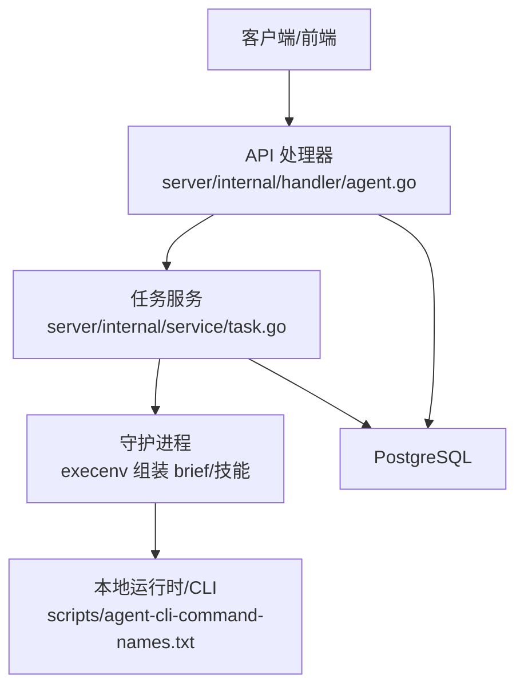
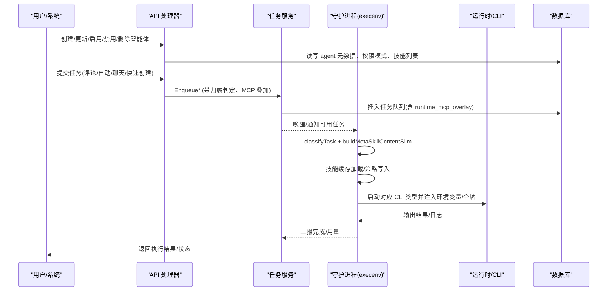
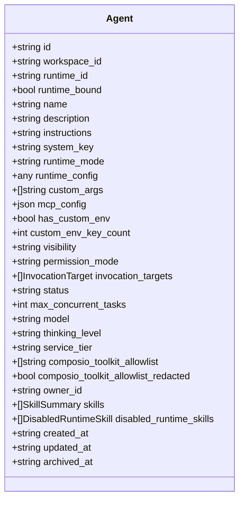
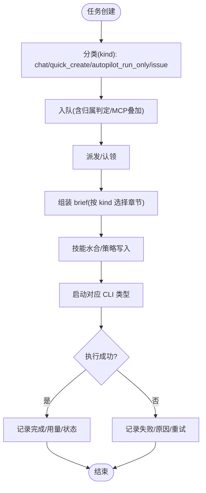
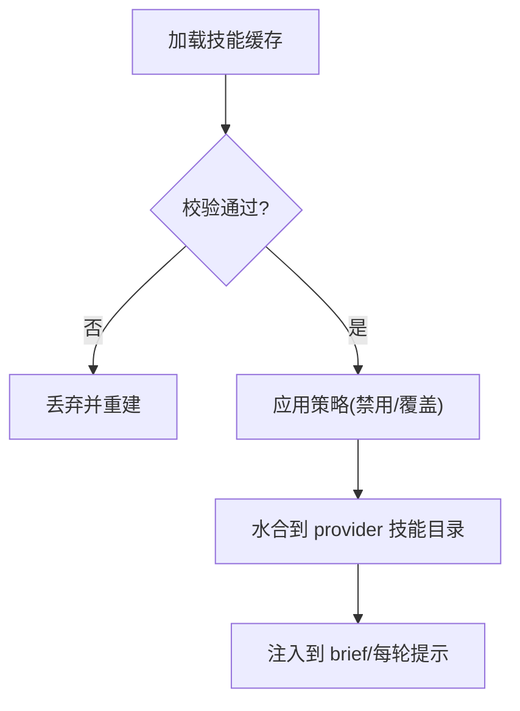
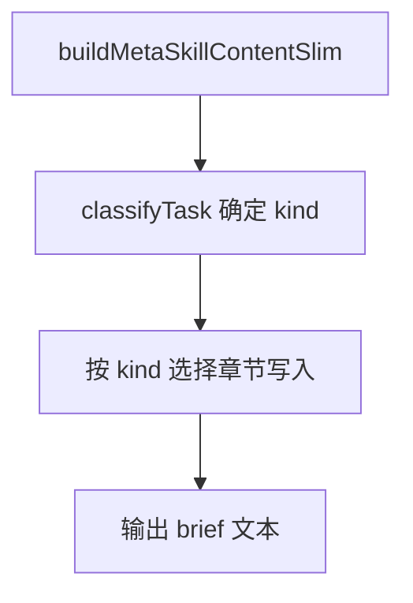
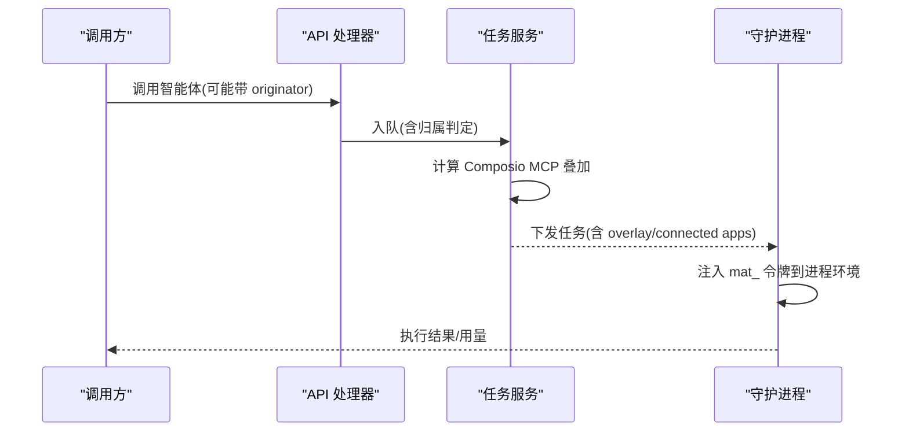
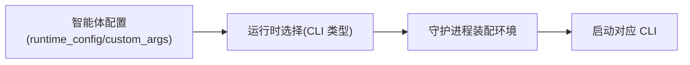
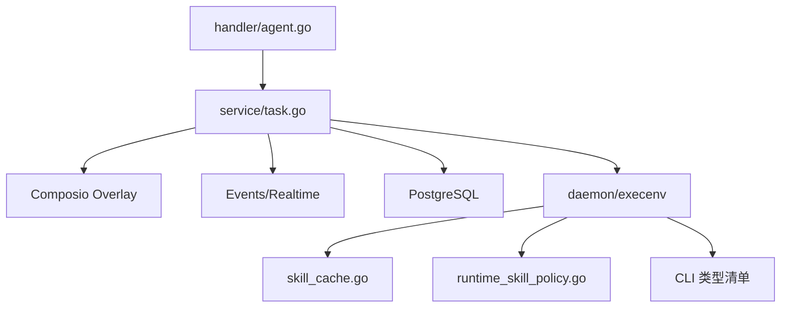

# 智能体概念和配置

<cite>
**本文引用的文件**
- [server/internal/handler/agent.go](file://server/internal/handler/agent.go)
- [server/internal/service/task.go](file://server/internal/service/task.go)
- [server/internal/daemon/execenv/runtime_config_kind.go](file://server/internal/daemon/execenv/runtime_config_kind.go)
- [server/internal/daemon/execenv/runtime_config_sections.go](file://server/internal/daemon/execenv/runtime_config_sections.go)
- [server/internal/daemon/execenv/runtime_skill_policy.go](file://server/internal/daemon/execenv/runtime_skill_policy.go)
- [server/internal/daemon/skill_cache.go](file://server/internal/daemon/skill_cache.go)
- [scripts/agent-cli-command-names.txt](file://scripts/agent-cli-command-names.txt)
- [server/migrations/050_agent_model.up.sql](file://server/migrations/050_agent_model.up.sql)
</cite>

## 目录
1. [简介](#简介)
2. [项目结构](#项目结构)
3. [核心组件](#核心组件)
4. [架构总览](#架构总览)
5. [详细组件分析](#详细组件分析)
6. [依赖关系分析](#依赖关系分析)
7. [性能考虑](#性能考虑)
8. [故障排查指南](#故障排查指南)
9. [结论](#结论)
10. [附录](#附录)

## 简介
本文件系统性阐述 Multica 中“智能体作为一等公民”的设计理念与实现：将智能体视为可被指派、调度、授权与审计的团队成员，围绕 Agent（智能体）、Runtime（运行时）、Skill（技能）、Task（任务）四大概念构建完整的生命周期与执行环境。文档覆盖：
- 智能体的创建、配置、启用/禁用、删除等生命周期管理要点
- 运行时 brief 组装、技能水合与安全策略
- 支持的 26 种智能体 CLI 类型及配置方式
- 权限模型与安全边界（调用许可、MCP/Composio 叠加、令牌注入）
- 配置文件结构与参数说明
- 常见智能体配置示例与最佳实践

## 项目结构
Multica 后端以 Go 服务为核心，智能体相关能力分布在以下层次：
- 接口层（handler）：对外暴露智能体与任务的 API，负责序列化、鉴权、响应构造
- 服务层（service）：编排任务入队、归属判定、MCP 叠加、指标与事件
- 守护进程（daemon/execenv）：装配运行环境、生成 brief、管理技能缓存与可见性
- 迁移与配置：数据库字段演进（如 per-agent model），CLI 类型清单

图表来源
- [server/internal/handler/agent.go:1-120](file://server/internal/handler/agent.go#L1-L120)
- [server/internal/service/task.go:39-91](file://server/internal/service/task.go#L39-L91)
- [scripts/agent-cli-command-names.txt:1-27](file://scripts/agent-cli-command-names.txt#L1-L27)

章节来源
- [server/internal/handler/agent.go:1-120](file://server/internal/handler/agent.go#L1-L120)
- [server/internal/service/task.go:39-91](file://server/internal/service/task.go#L39-L91)

## 核心组件
- 智能体（Agent）：具备名称、描述、指令、模型、并发度、权限模式、技能集合、MCP/Composio 配置等的实体；可绑定到某个运行时（Runtime）。
- 运行时（Runtime）：承载具体编码智能体 CLI 的执行环境，支持约 26 种 CLI 类型；通过 daemon 装配上下文并启动任务。
- 技能（Skill）：可被工作区或运行时启用的能力包；支持按任务粒度禁用/允许，并通过缓存与策略文件生效。
- 任务（Task）：一次智能体执行单元，携带触发来源、上下文、工作目录、会话连续性信息、MCP 叠加、使用量等。

关键职责边界：
- handler 负责资源建模、鉴权、响应脱敏（如 gateway token 掩码）
- service 负责任务入队、归属判定、MCP 叠加、指标与事件
- execenv 负责 brief 组装、技能水合、安全策略写入、工作目录隔离

章节来源
- [server/internal/handler/agent.go:50-140](file://server/internal/handler/agent.go#L50-L140)
- [server/internal/service/task.go:39-91](file://server/internal/service/task.go#L39-L91)
- [server/internal/daemon/execenv/runtime_config_sections.go:10-36](file://server/internal/daemon/execenv/runtime_config_sections.go#L10-L36)

## 架构总览
下图展示从请求到执行的端到端流程，包括权限检查、任务入队、brief 组装、技能水合与 CLI 执行。

图表来源
- [server/internal/handler/agent.go:141-298](file://server/internal/handler/agent.go#L141-L298)
- [server/internal/service/task.go:366-406](file://server/internal/service/task.go#L366-L406)
- [server/internal/daemon/execenv/runtime_config_kind.go:14-56](file://server/internal/daemon/execenv/runtime_config_kind.go#L14-L56)
- [server/internal/daemon/execenv/runtime_config_sections.go:41-105](file://server/internal/daemon/execenv/runtime_config_sections.go#L41-L105)
- [server/internal/daemon/skill_cache.go:34-91](file://server/internal/daemon/skill_cache.go#L34-L91)

## 详细组件分析

### 智能体（Agent）与运行时（Runtime）
- 智能体资源包含：名称、描述、指令、系统键、头像、运行时模式、运行时配置、自定义参数、MCP 配置、权限模式、调用目标、状态、最大并发、模型、思考级别、服务层级、Composio 工具白名单、所有者、技能集合、禁用的运行时技能、时间戳等。
- 运行时绑定：智能体可绑定到某台机器/进程上的运行时；未绑定时保留配置和历史，需重新绑定才能运行。
- 敏感字段保护：gateway.token 在 GET 时会被掩码，PATCH 时若传回掩码则恢复原值，避免凭据泄露。

图表来源
- [server/internal/handler/agent.go:50-140](file://server/internal/handler/agent.go#L50-L140)
- [server/internal/handler/agent.go:141-298](file://server/internal/handler/agent.go#L141-L298)

章节来源
- [server/internal/handler/agent.go:50-140](file://server/internal/handler/agent.go#L50-L140)
- [server/internal/handler/agent.go:141-298](file://server/internal/handler/agent.go#L141-L298)

### 任务（Task）与生命周期
- 任务种类：issue（关联真实问题）、autopilot run-only（仅运行）、quick-create（一次性创建问题）、chat（交互聊天）。
- 分类规则：chat → quick-create → autopilot run-only → issue；确保 brief 稳定，避免破坏 prompt 缓存前缀。
- 生命周期：创建→入队→派发→认领→开始→执行→完成/失败→清理；支持重试、合并评论、归属判定、MCP 叠加、用量统计。

图表来源
- [server/internal/daemon/execenv/runtime_config_kind.go:14-56](file://server/internal/daemon/execenv/runtime_config_kind.go#L14-L56)
- [server/internal/service/task.go:366-406](file://server/internal/service/task.go#L366-L406)
- [server/internal/daemon/execenv/runtime_config_sections.go:41-105](file://server/internal/daemon/execenv/runtime_config_sections.go#L41-L105)

章节来源
- [server/internal/daemon/execenv/runtime_config_kind.go:14-56](file://server/internal/daemon/execenv/runtime_config_kind.go#L14-L56)
- [server/internal/service/task.go:366-406](file://server/internal/service/task.go#L366-L406)

### 技能（Skill）与权限策略
- 技能缓存：按工作区与引用键组织，原子写入与校验，防止路径穿越与哈希不一致。
- 运行时技能策略：为不同 provider 生成禁用/覆盖配置（如 Claude 的 skillOverrides 与 permissions deny），确保工作区声明的技能优先，屏蔽不需要的运行时技能。
- 可见性与挂载：技能通过 execenv 水合到 provider 原生 skills 目录，并在每轮 prompt 中由 daemon.BuildPrompt 注入。

图表来源
- [server/internal/daemon/skill_cache.go:34-91](file://server/internal/daemon/skill_cache.go#L34-L91)
- [server/internal/daemon/execenv/runtime_skill_policy.go:32-94](file://server/internal/daemon/execenv/runtime_skill_policy.go#L32-L94)

章节来源
- [server/internal/daemon/skill_cache.go:34-91](file://server/internal/daemon/skill_cache.go#L34-L91)
- [server/internal/daemon/execenv/runtime_skill_policy.go:32-94](file://server/internal/daemon/execenv/runtime_skill_policy.go#L32-L94)

### 运行时 brief 与工作流
- brief 由 execenv 统一组装，按任务种类选择性包含：背景任务安全、身份、工作区上下文、可用命令、仓库、项目上下文、问题元数据、工作流、子问题创建、技能索引等。
- 关键约束：per-turn 易变字段（发起人、连接应用、续接提示）必须放在每轮消息而非 brief，保证 prompt 缓存前缀稳定。

图表来源
- [server/internal/daemon/execenv/runtime_config_sections.go:10-36](file://server/internal/daemon/execenv/runtime_config_sections.go#L10-L36)
- [server/internal/daemon/execenv/runtime_config_kind.go:14-56](file://server/internal/daemon/execenv/runtime_config_kind.go#L14-L56)

章节来源
- [server/internal/daemon/execenv/runtime_config_sections.go:41-105](file://server/internal/daemon/execenv/runtime_config_sections.go#L41-L105)
- [server/internal/daemon/execenv/runtime_config_kind.go:14-56](file://server/internal/daemon/execenv/runtime_config_kind.go#L14-L56)

### 权限模型与安全边界
- 调用许可：permission_mode 控制“private”或“public_to”，后者通过 InvocationTargets 白名单限制可调用者。
- MCP/Composio 叠加：按任务计算 overlay，注入连接应用元数据；非拥有者不可见敏感白名单。
- 令牌注入：任务级 mat_ 令牌注入到智能体进程环境变量，限定访问范围，禁止跨代理读取其他代理密钥。
- 归属判定：comment/issue/autopilot 等多源触发均通过统一归属判定，确保审计与授权一致。

图表来源
- [server/internal/handler/agent.go:141-298](file://server/internal/handler/agent.go#L141-L298)
- [server/internal/service/task.go:366-406](file://server/internal/service/task.go#L366-L406)
- [server/internal/service/task.go:408-482](file://server/internal/service/task.go#L408-L482)

章节来源
- [server/internal/handler/agent.go:141-298](file://server/internal/handler/agent.go#L141-L298)
- [server/internal/service/task.go:366-406](file://server/internal/service/task.go#L366-L406)
- [server/internal/service/task.go:408-482](file://server/internal/service/task.go#L408-L482)

### 支持的 26 种智能体 CLI 类型与配置
- 支持的 CLI 类型清单位于脚本文件中，涵盖多种主流编码智能体 CLI。
- 配置方式：通过智能体的 runtime_config 与 custom_args 指定模型、服务层级、思考级别等；部分 provider 通过 provider-native 配置（如 openclaw gateway token）进行路由。

图表来源
- [scripts/agent-cli-command-names.txt:1-27](file://scripts/agent-cli-command-names.txt#L1-L27)
- [server/internal/handler/agent.go:141-298](file://server/internal/handler/agent.go#L141-L298)

章节来源
- [scripts/agent-cli-command-names.txt:1-27](file://scripts/agent-cli-command-names.txt#L1-L27)
- [server/internal/handler/agent.go:141-298](file://server/internal/handler/agent.go#L141-L298)

### 智能体配置文件的结构与参数说明
- 关键字段（来自响应结构）：
  - 基本信息：id、workspace_id、name、description、instructions、system_key、avatar_url
  - 运行时：runtime_id、runtime_bound、runtime_mode、runtime_config、custom_args、model、thinking_level、service_tier
  - 权限与可见性：visibility、permission_mode、invocation_targets、composio_toolkit_allowlist、composio_toolkit_allowlist_redacted
  - 环境与集成：has_custom_env、custom_env_key_count、mcp_config、mcp_config_redacted
  - 技能：skills、disabled_runtime_skills
  - 状态与时间：status、created_at、updated_at、archived_at、archived_by
- 敏感字段处理：
  - gateway.token 在 GET 时被掩码，PATCH 传回掩码则恢复原值
  - custom_env 不在通用响应中暴露值，仅显示 key 计数；读取需专用端点
- 新增字段：per-agent model 列用于显式选择模型，兼容不接受 -m 的 provider

章节来源
- [server/internal/handler/agent.go:50-140](file://server/internal/handler/agent.go#L50-L140)
- [server/internal/handler/agent.go:141-298](file://server/internal/handler/agent.go#L141-L298)
- [server/migrations/050_agent_model.up.sql:1-5](file://server/migrations/050_agent_model.up.sql#L1-L5)

### 常见智能体配置示例与最佳实践
- 选择模型与服务层级：通过 model、thinking_level、service_tier 控制推理强度与执行层级，适配不同 provider 的能力与成本。
- 设置 MCP/Composio 白名单：按需挂载外部工具，遵循最小权限原则；非拥有者不可见敏感白名单。
- 禁用运行时技能：通过 disabled_runtime_skills 精确屏蔽不需要的技能，结合工作区技能声明优先级。
- 使用 per-turn 易变字段：将发起人、连接应用、续接提示等放入每轮消息，保持 brief 稳定，提升 prompt 缓存命中率。
- 并发与限流：合理设置 max_concurrent_tasks，避免过载；结合任务合并与重试策略提升稳定性。

章节来源
- [server/internal/handler/agent.go:50-140](file://server/internal/handler/agent.go#L50-L140)
- [server/internal/daemon/execenv/runtime_skill_policy.go:32-94](file://server/internal/daemon/execenv/runtime_skill_policy.go#L32-L94)
- [server/internal/daemon/execenv/runtime_config_sections.go:157-182](file://server/internal/daemon/execenv/runtime_config_sections.go#L157-L182)

## 依赖关系分析
- handler 依赖 service 进行任务入队与归属判定，依赖 db 存储 agent/task 元数据
- service 依赖 Composio 构建 MCP 叠加，依赖 realtime/events 广播与指标
- execenv 依赖 skill_cache 与 runtime_skill_policy 管理技能水合与策略
- 所有 CLI 类型由脚本清单驱动，运行时根据配置选择对应 CLI

图表来源
- [server/internal/handler/agent.go:141-298](file://server/internal/handler/agent.go#L141-L298)
- [server/internal/service/task.go:366-406](file://server/internal/service/task.go#L366-L406)
- [server/internal/daemon/skill_cache.go:34-91](file://server/internal/daemon/skill_cache.go#L34-L91)
- [server/internal/daemon/execenv/runtime_skill_policy.go:32-94](file://server/internal/daemon/execenv/runtime_skill_policy.go#L32-L94)
- [scripts/agent-cli-command-names.txt:1-27](file://scripts/agent-cli-command-names.txt#L1-L27)

章节来源
- [server/internal/handler/agent.go:141-298](file://server/internal/handler/agent.go#L141-L298)
- [server/internal/service/task.go:366-406](file://server/internal/service/task.go#L366-L406)
- [server/internal/daemon/skill_cache.go:34-91](file://server/internal/daemon/skill_cache.go#L34-L91)
- [server/internal/daemon/execenv/runtime_skill_policy.go:32-94](file://server/internal/daemon/execenv/runtime_skill_policy.go#L32-L94)
- [scripts/agent-cli-command-names.txt:1-27](file://scripts/agent-cli-command-names.txt#L1-L27)

## 性能考虑
- brief 压缩与章节门控：按任务种类选择性写入，减少上下文体积，提升缓存命中率
- 技能缓存：原子写入与校验，避免重复下载与解析开销
- 并发与限流：max_concurrent_tasks 控制并行度，避免资源争用
- 归属判定与 MCP 叠加：尽量在入队阶段计算，减少运行时开销
- 用量统计：按 provider/model 维度记录，便于成本优化

[本节提供一般性指导，无需特定文件分析]

## 故障排查指南
- 任务重复入队：检测唯一索引冲突，返回友好错误而非 500
- 归属判定失败：fail-closed 策略拒绝无明确责任人的任务，检查工作区策略与所有者
- MCP 叠加失败：网络异常降级为空叠加，不影响任务继续执行
- 技能缓存损坏：校验失败后丢弃并重建，确保一致性
- 敏感字段泄露：确认 gateway.token 掩码逻辑生效，custom_env 值不随通用响应暴露

章节来源
- [server/internal/service/task.go:690-779](file://server/internal/service/task.go#L690-L779)
- [server/internal/service/task.go:366-406](file://server/internal/service/task.go#L366-L406)
- [server/internal/daemon/skill_cache.go:34-91](file://server/internal/daemon/skill_cache.go#L34-L91)
- [server/internal/handler/agent.go:141-298](file://server/internal/handler/agent.go#L141-L298)

## 结论
Multica 将智能体作为一等公民，通过清晰的 Agent/Runtime/Skill/Task 分层与严格的权限、安全、性能设计，实现了可指派、可审计、可扩展的智能体协作体系。借助统一的 brief 组装、技能水合与 MCP 叠加机制，平台能够灵活适配多种运行时与外部集成，同时保障缓存稳定性与执行安全性。

[本节总结性内容，无需特定文件分析]

## 附录
- 术语表：
  - Agent：智能体，具备配置与能力的执行主体
  - Runtime：运行时，承载具体 CLI 的执行环境
  - Skill：技能，可被启用的能力包
  - Task：任务，一次智能体执行单元
- 参考：
  - CLI 类型清单：scripts/agent-cli-command-names.txt
  - 模型字段迁移：server/migrations/050_agent_model.up.sql

[本节为补充信息，无需特定文件分析]