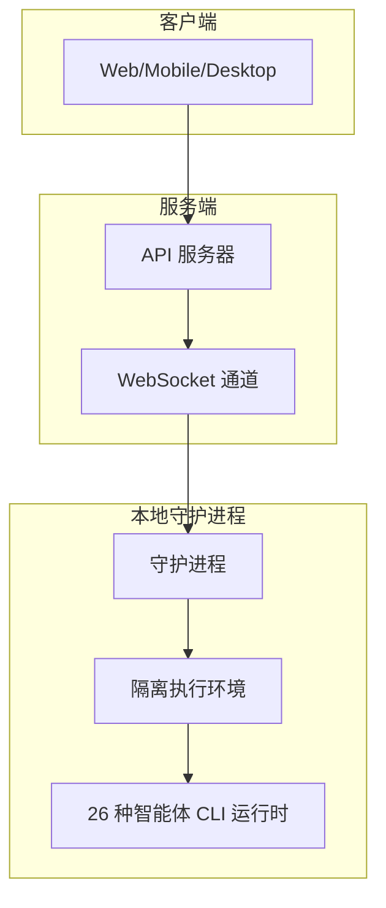
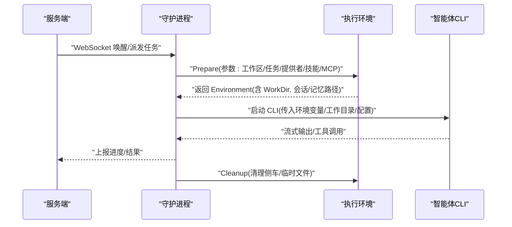
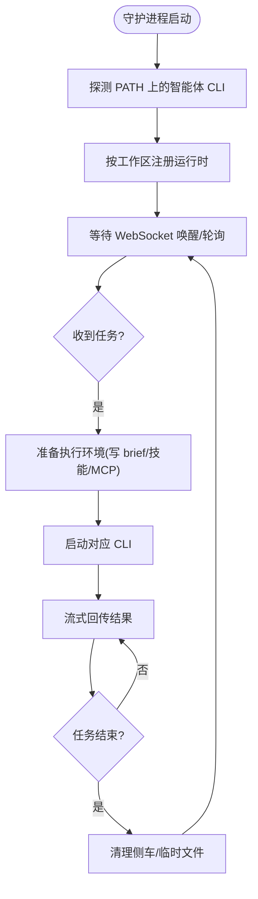
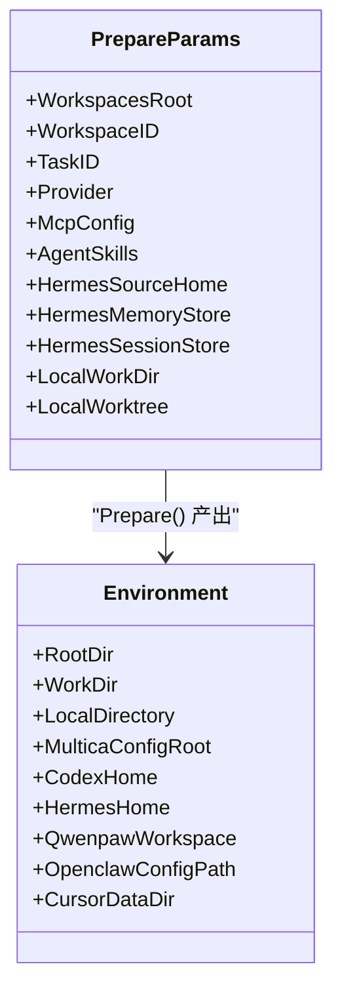
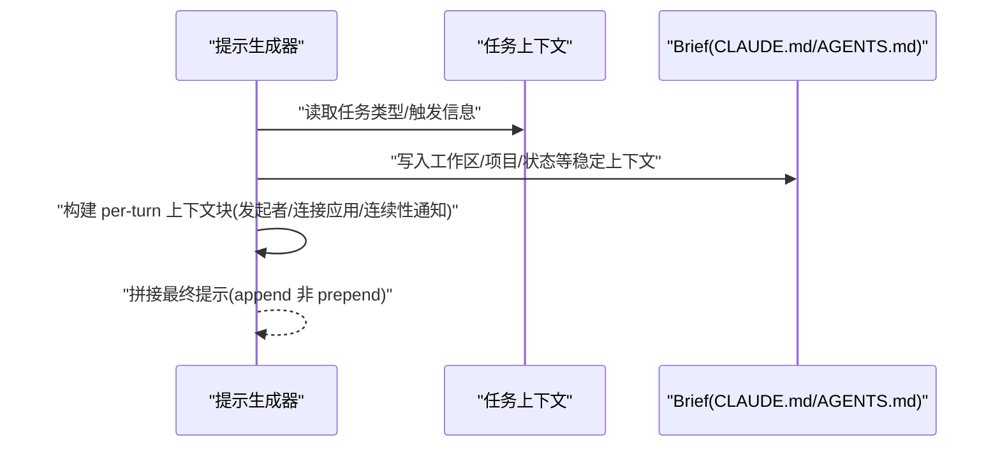
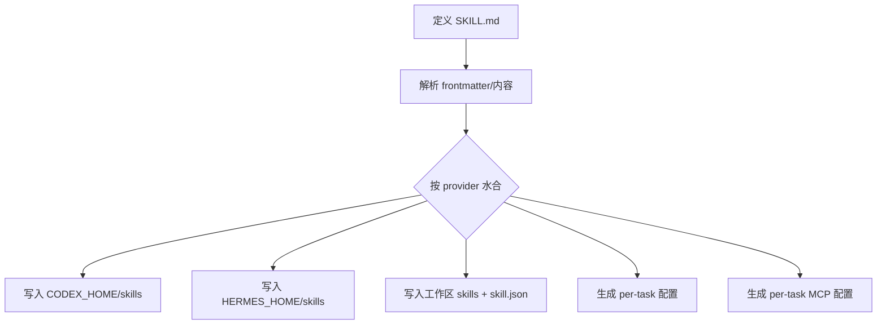
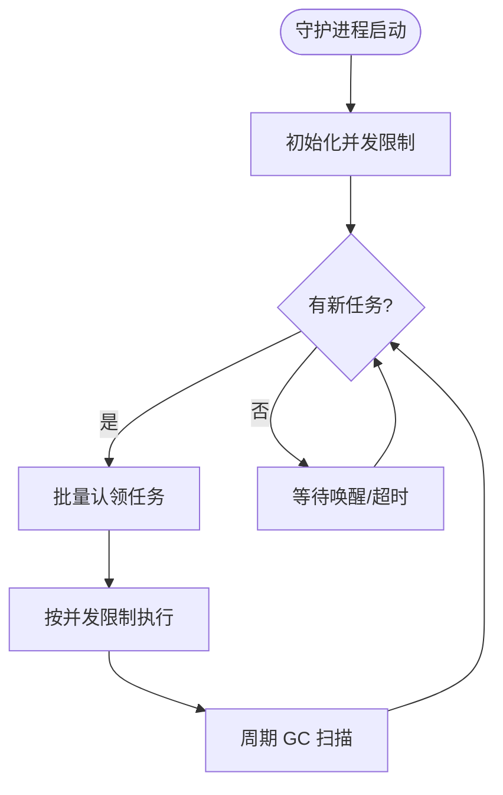
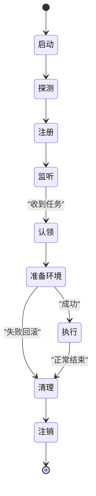
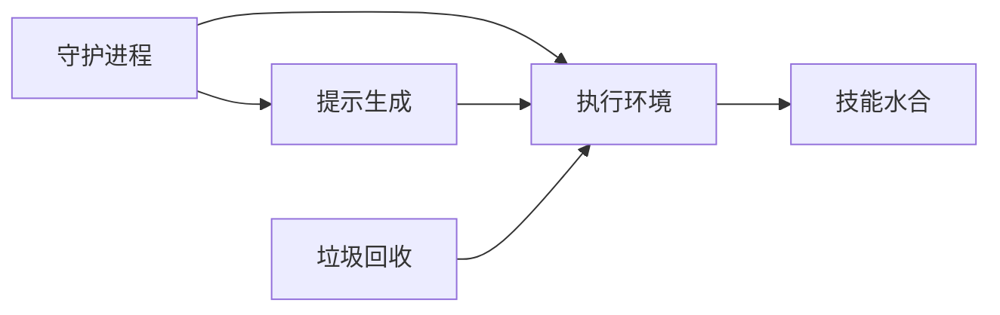

# 智能体系统

<cite>
**本文引用的文件**
- [CLI_AND_DAEMON.md](file://CLI_AND_DAEMON.md)
- [AGENTS.md](file://AGENTS.md)
- [execenv.go](file://server/internal/daemon/execenv/execenv.go)
- [prompt.go](file://server/internal/daemon/prompt.go)
- [SKILL.md](file://.agents/skills/web-design-guidelines/SKILL.md)
</cite>

## 目录
1. [简介](#简介)
2. [项目结构](#项目结构)
3. [核心组件](#核心组件)
4. [架构总览](#架构总览)
5. [详细组件分析](#详细组件分析)
6. [依赖关系分析](#依赖关系分析)
7. [性能与并发](#性能与并发)
8. [故障排查指南](#故障排查指南)
9. [结论](#结论)
10. [附录](#附录)

## 简介
本文件系统性地阐述 Multica 的“智能体即一等公民”的设计理念：将 AI 代理视为可被指派、调度、隔离执行的团队成员，围绕守护进程（daemon）完成上下文装配、技能水合、提示生成与执行编排。文档覆盖支持的 26 种智能体 CLI 的运行时配置与环境隔离、技能的创建与管理复用、任务调度与并发控制、资源管理、生命周期与错误重试，以及自定义智能体与技能的开发指南。

## 项目结构
- 后端服务：Go（Chi 路由 + sqlc + gorilla/websocket），负责任务派发、状态管理与 WebSocket 通信。
- 本地守护进程：在用户机器上运行，发现并注册可用的 26 种智能体 CLI，接收任务后在隔离环境中执行，流式回传结果。
- 前端与应用：pnpm workspaces + Turborepo 单体；apps/web/platform 为唯一可用 Next.js API 入口。
- 包边界约束：packages/core 禁用 react-dom/localStorage/process.env；packages/ui 不得 import @multica/core；packages/views 禁用 next/* 与 react-router-dom，走 NavigationAdapter。
- 数据库规则：禁止外键与级联，关系与清理在应用层事务中处理；迁移中的索引必须使用 CREATE [UNIQUE] INDEX CONCURRENTLY，且每个索引独立单语句迁移。

**图表来源**
- [CLI_AND_DAEMON.md:94-241](file://CLI_AND_DAEMON.md#L94-L241)

**章节来源**
- [AGENTS.md:15-45](file://AGENTS.md#L15-L45)
- [CLI_AND_DAEMON.md:94-241](file://CLI_AND_DAEMON.md#L94-L241)

## 核心组件
- 守护进程（Daemon）：检测本机已安装的智能体 CLI，注册到服务端，按工作区监听任务，批量认领并执行，周期性心跳保活。
- 执行环境（ExecEnv）：为每个任务构建隔离目录，注入 brief、技能、MCP 配置、会话/记忆持久化等，支持 git worktree 模式与本地目录模式。
- 提示生成（Prompt）：根据任务类型（问题评论触发、聊天、自动计划、快速创建等）组装每轮提示，将易变字段放在每轮消息而非 brief，以保留 prompt 缓存前缀。
- 技能系统（Skills）：通过 SKILL.md 元数据描述能力，按 provider 原生方式水合到对应 skills 目录或工作区，供智能体发现与调用。
- 垃圾回收（GC）：定期扫描工作区根目录，清理已完成/取消的任务、产物、仓库缓存、Hermes 会话与记忆等，保障磁盘占用可控。

**章节来源**
- [CLI_AND_DAEMON.md:94-379](file://CLI_AND_DAEMON.md#L94-L379)
- [execenv.go:1-127](file://server/internal/daemon/execenv/execenv.go#L1-L127)
- [prompt.go:176-199](file://server/internal/daemon/prompt.go#L176-L199)
- [SKILL.md:1-40](file://.agents/skills/web-design-guidelines/SKILL.md#L1-L40)

## 架构总览
守护进程作为本地执行中枢，承担以下职责：
- 启动时探测 PATH 上的 26 种智能体 CLI，按工作区注册运行时。
- 通过 WebSocket 接收任务唤醒信号，批量认领任务。
- 为每个任务准备隔离执行环境（写入 brief、技能、MCP 配置、会话/记忆挂载）。
- 启动对应智能体 CLI，流式回传输出与工具调用结果。
- 周期心跳上报存活；退出时注销所有运行时。

**图表来源**
- [CLI_AND_DAEMON.md:235-241](file://CLI_AND_DAEMON.md#L235-L241)
- [execenv.go:409-744](file://server/internal/daemon/execenv/execenv.go#L409-L744)

**章节来源**
- [CLI_AND_DAEMON.md:235-241](file://CLI_AND_DAEMON.md#L235-L241)
- [execenv.go:409-744](file://server/internal/daemon/execenv/execenv.go#L409-L744)

## 详细组件分析

### 守护进程与 26 种智能体 CLI
- 支持的 CLI：包括 Claude Code、Antigravity、CodeBuddy、CodeArts、DevEco、Codex、Copilot、OpenCode、OpenClaw、Hermes、Pi、Oh-My-Pi、Cursor Agent、Kimi、Reasonix、Dim、Kiro、Qoder/Qoder CN、Trae、Grok Build、Qwen Code、QwenPaw、MiniMax Code、DeepSeek Harness 等。
- 运行时配置：通过环境变量/标志位覆盖二进制路径、模型、默认参数；ACP 家族运行时通过会话协议注入 MCP 服务器；部分运行时（如 QwenPaw、MiniMax Code）由自身管理模型选择。
- 自更新与重载：守护进程会跟随 CLI 版本变化重新探测与注册，无需重启；对 Multica 主程序有独立的自更新策略。

**图表来源**
- [CLI_AND_DAEMON.md:201-379](file://CLI_AND_DAEMON.md#L201-L379)
- [CLI_AND_DAEMON.md:235-241](file://CLI_AND_DAEMON.md#L235-L241)

**章节来源**
- [CLI_AND_DAEMON.md:201-379](file://CLI_AND_DAEMON.md#L201-L379)

### 执行环境与上下文装配
- 隔离目录：每个任务拥有独立 env root，包含 workdir、output、logs、multica-config 等；支持 worktree 模式（git worktree）与 local_directory 模式（直接操作用户目录）。
- 上下文写入：将任务发起者、连接应用、续接提示等易变信息放入每轮提示，避免污染 brief 缓存前缀；brief 中注入工作区上下文、项目资源、自定义状态目录等。
- 技能水合：按 provider 原生方式注入技能（如 Codex 的 CODEX_HOME、Hermes 的 HERMES_HOME overlay、QwenPaw 的工作区 skills、OpenClaw 的配置包装等）。
- 会话/记忆：Codex/Hermes 等提供会话恢复与长期记忆持久化，跨轮次/跨任务共享存储，受 GC 策略保护。

**图表来源**
- [execenv.go:38-127](file://server/internal/daemon/execenv/execenv.go#L38-L127)
- [execenv.go:267-352](file://server/internal/daemon/execenv/execenv.go#L267-L352)

**章节来源**
- [execenv.go:38-127](file://server/internal/daemon/execenv/execenv.go#L38-L127)
- [execenv.go:267-352](file://server/internal/daemon/execenv/execenv.go#L267-L352)
- [execenv.go:409-744](file://server/internal/daemon/execenv/execenv.go#L409-L744)

### 提示生成与每轮上下文
- 提示构建：BuildPrompt 根据任务类型（聊天、评论触发、自动计划、快速创建）生成主体，并将易变的每轮上下文块追加到末尾，确保不影响缓存前缀。
- 会话连续性：当无法恢复上一轮会话时，注入连续性通知，明确告知智能体上下文丢失的原因与影响。
- 工作区/项目上下文：将工作区上下文、项目资源、自定义状态目录等写入 brief，使智能体具备全局视角。

**图表来源**
- [prompt.go:176-199](file://server/internal/daemon/prompt.go#L176-L199)
- [prompt.go:50-73](file://server/internal/daemon/prompt.go#L50-L73)

**章节来源**
- [prompt.go:50-73](file://server/internal/daemon/prompt.go#L50-L73)
- [prompt.go:176-199](file://server/internal/daemon/prompt.go#L176-L199)

### 技能创建、管理与复用
- 技能定义：通过 SKILL.md 的 frontmatter 声明名称、描述、作者、版本、参数提示等；正文描述工作原理与用法。
- 水合机制：守护进程按 provider 原生方式将技能注入到对应目录（如 Codex 的 CODEX_HOME/skills、Hermes 的 HERMES_HOME/skills、QwenPaw 的工作区 skills），或通过 OpenClaw/Cursor 的配置包装生效。
- 复用策略：技能可跨任务/跨问题复用；Hermes 的记忆与会话存储位于 profile 目录下，跨任务持久化；Codex 会话存储按 profile 命名空间隔离。

**图表来源**
- [SKILL.md:1-40](file://.agents/skills/web-design-guidelines/SKILL.md#L1-L40)
- [execenv.go:632-744](file://server/internal/daemon/execenv/execenv.go#L632-L744)

**章节来源**
- [SKILL.md:1-40](file://.agents/skills/web-design-guidelines/SKILL.md#L1-L40)
- [execenv.go:632-744](file://server/internal/daemon/execenv/execenv.go#L632-L744)

### 任务调度、并发控制与资源管理
- 任务领取：守护进程通过 WebSocket 唤醒或周期性轮询领取任务，支持批量认领。
- 并发上限：可通过环境变量/标志位设置最大并发任务数，避免资源争用。
- 资源隔离：每个任务独立 env root；worktree 模式下各任务分支并行；本地目录模式需考虑锁与冲突。
- 垃圾回收：定期清理已完成/取消任务、产物、仓库缓存、Hermes 会话/记忆、临时目录等，保障磁盘占用。

**图表来源**
- [CLI_AND_DAEMON.md:235-241](file://CLI_AND_DAEMON.md#L235-L241)
- [CLI_AND_DAEMON.md:247-276](file://CLI_AND_DAEMON.md#L247-L276)
- [CLI_AND_DAEMON.md:277-299](file://CLI_AND_DAEMON.md#L277-L299)

**章节来源**
- [CLI_AND_DAEMON.md:235-241](file://CLI_AND_DAEMON.md#L235-L241)
- [CLI_AND_DAEMON.md:247-276](file://CLI_AND_DAEMON.md#L247-L276)
- [CLI_AND_DAEMON.md:277-299](file://CLI_AND_DAEMON.md#L277-L299)

### 生命周期管理、错误处理与重试
- 生命周期：启动→探测→注册→监听→认领→准备环境→执行→清理→注销。
- 错误处理：Prepare 失败时回滚侧车；worktree 模式失败丢弃分支；本地目录模式失败回滚写入。
- 重试机制：守护进程支持心跳与轮询兜底；任务级别的重试由服务端/工作流驱动，提示生成确保每轮指令一致。

**图表来源**
- [execenv.go:409-744](file://server/internal/daemon/execenv/execenv.go#L409-L744)
- [CLI_AND_DAEMON.md:235-241](file://CLI_AND_DAEMON.md#L235-L241)

**章节来源**
- [execenv.go:409-744](file://server/internal/daemon/execenv/execenv.go#L409-L744)
- [CLI_AND_DAEMON.md:235-241](file://CLI_AND_DAEMON.md#L235-L241)

### 自定义智能体与技能开发指南
- 自定义智能体：遵循守护进程的 CLI 探测与协议约定（如 ACP/stdout/stdio），在 PATH 中提供可执行命令；通过环境变量/标志位配置模型与参数。
- 自定义技能：编写 SKILL.md，声明 frontmatter 与使用说明；确保技能逻辑可被 provider 原生发现（如写入 skills 目录或配置中引用）。
- 最佳实践：避免在 brief 中写入易变字段；使用每轮提示承载动态上下文；保持技能幂等与可重试。

**章节来源**
- [CLI_AND_DAEMON.md:201-379](file://CLI_AND_DAEMON.md#L201-L379)
- [SKILL.md:1-40](file://.agents/skills/web-design-guidelines/SKILL.md#L1-L40)

## 依赖关系分析
- 守护进程依赖执行环境模块进行上下文装配与技能水合。
- 提示生成模块依赖执行环境的常量与工具函数，确保 brief 与 per-turn 上下文一致性。
- 技能系统依赖 provider 特定的水合逻辑（Codex/Hermes/QwenPaw/OpenClaw/Cursor）。
- 垃圾回收依赖工作区根目录与任务元数据，安全清理可再生产物与缓存。

**图表来源**
- [execenv.go:409-744](file://server/internal/daemon/execenv/execenv.go#L409-L744)
- [prompt.go:176-199](file://server/internal/daemon/prompt.go#L176-L199)
- [CLI_AND_DAEMON.md:277-299](file://CLI_AND_DAEMON.md#L277-L299)

**章节来源**
- [execenv.go:409-744](file://server/internal/daemon/execenv/execenv.go#L409-L744)
- [prompt.go:176-199](file://server/internal/daemon/prompt.go#L176-L199)
- [CLI_AND_DAEMON.md:277-299](file://CLI_AND_DAEMON.md#L277-L299)

## 性能与并发
- 并发控制：通过最大并发任务数限制，避免 CPU/IO/网络瓶颈。
- 提示缓存：将稳定上下文放入 brief，易变上下文追加到每轮提示，提升缓存命中率。
- 资源复用：worktree 模式共享裸仓库缓存，减少重复克隆；会话/记忆持久化降低冷启动成本。
- GC 优化：按需清理产物与缓存，重维护操作仅在空闲时执行。

[本节为通用指导，不直接分析具体文件]

## 故障排查指南
- 守护进程日志：使用 daemon logs 查看最近日志与绝对路径，确认当前 profile 的日志位置。
- 常见问题：
  - CLI 未检测到：检查 PATH 与二进制权限；必要时通过环境变量指定路径。
  - 技能未生效：确认 provider 的水合路径与配置是否正确；查看 per-task 配置与 manifest。
  - 会话恢复失败：检查会话存储是否被 GC 清理；确认 profile 命名空间一致。
  - 磁盘占用过高：调整 GC 策略与 TTL；查看 .repos 缓存与工作区目录。

**章节来源**
- [CLI_AND_DAEMON.md:171-200](file://CLI_AND_DAEMON.md#L171-L200)
- [CLI_AND_DAEMON.md:277-299](file://CLI_AND_DAEMON.md#L277-L299)

## 结论
Multica 的智能体系统将 AI 代理视为一等公民，通过守护进程实现统一的上下文装配、技能水合、提示生成与执行编排。26 种智能体 CLI 的广泛支持与严格的隔离策略，使得任务可在安全、可复用的环境中高效执行。结合完善的 GC、并发控制与生命周期管理，系统在可扩展性与稳定性之间取得平衡。开发者可按指南扩展自定义智能体与技能，进一步丰富平台能力。

[本节为总结性内容，不直接分析具体文件]

## 附录
- 安装与快速开始：参考 CLI 与守护进程指南。
- 工作区与问题管理：使用 CLI 进行工作区切换、问题列表、评论与元数据操作。
- 项目与自动化：通过 Autopilot 与快速创建流程自动化任务生成与执行。

**章节来源**
- [CLI_AND_DAEMON.md:5-57](file://CLI_AND_DAEMON.md#L5-L57)
- [CLI_AND_DAEMON.md:445-741](file://CLI_AND_DAEMON.md#L445-L741)