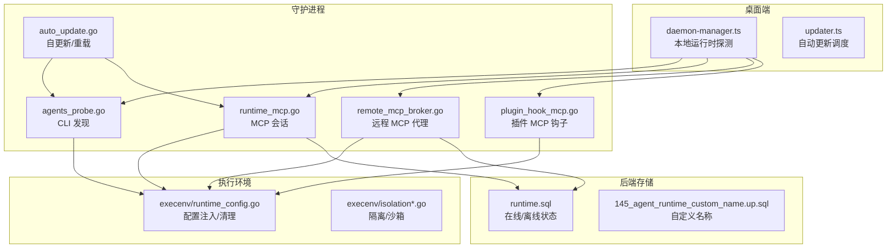
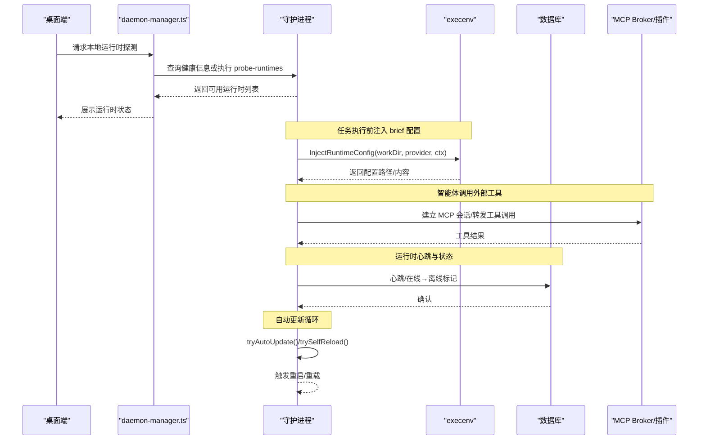
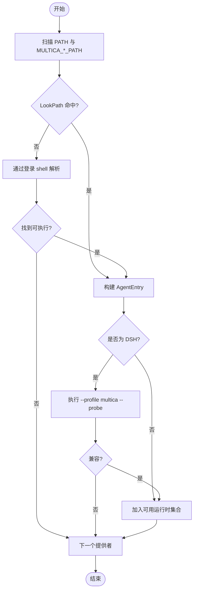
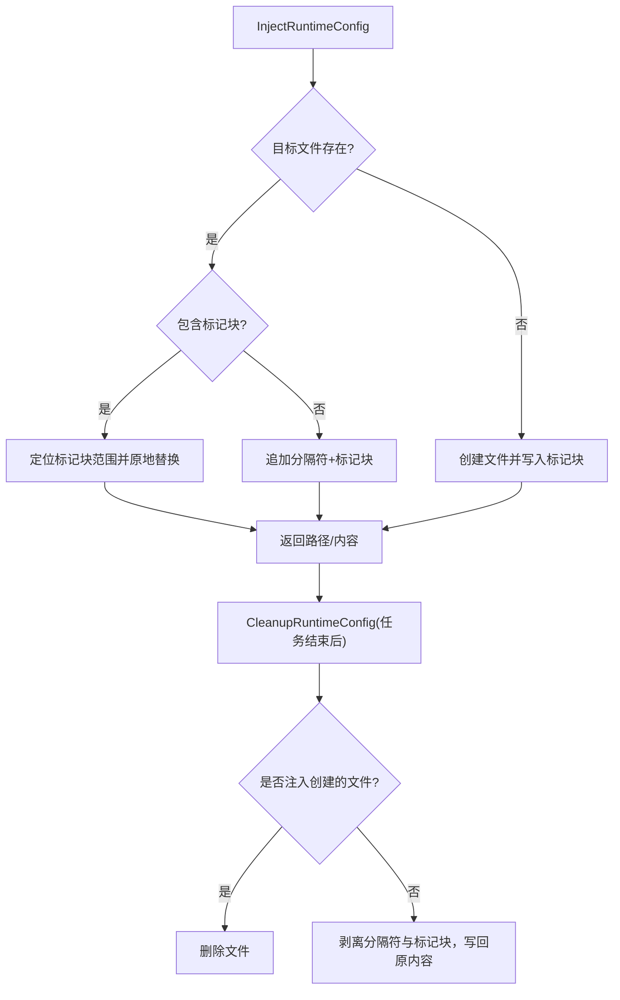
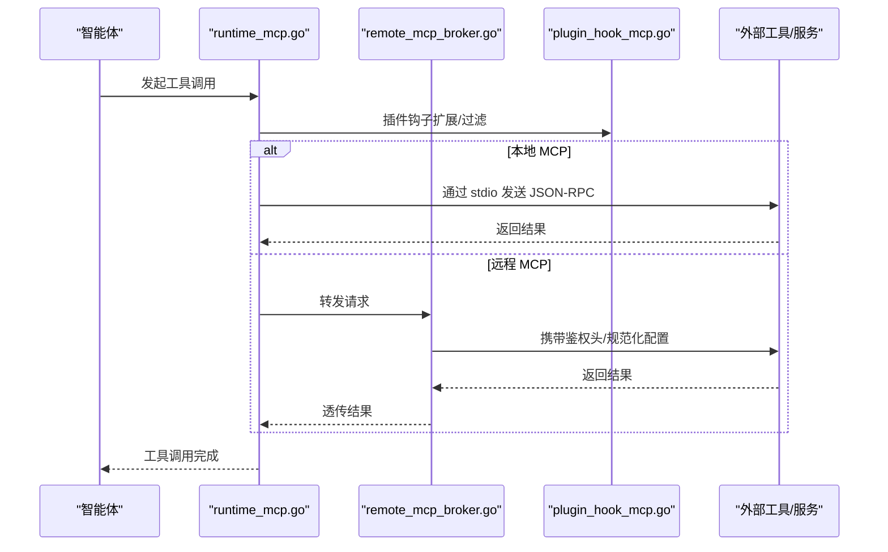
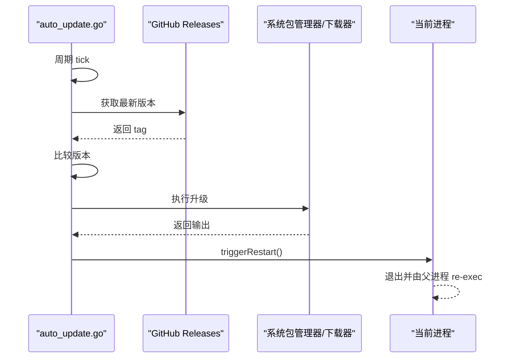
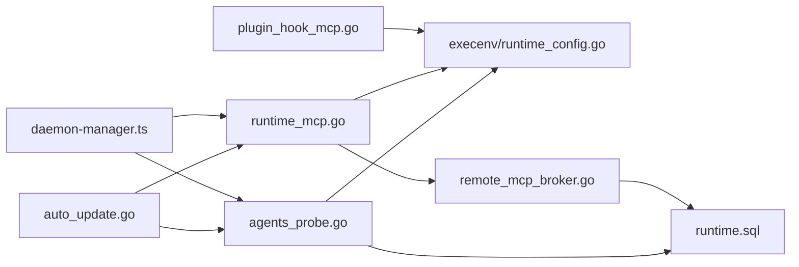

# 运行时管理

<cite>
**本文引用的文件**
- [server/internal/daemon/execenv/runtime_config.go](file://server/internal/daemon/execenv/runtime_config.go)
- [server/internal/daemon/agents_probe.go](file://server/internal/daemon/agents_probe.go)
- [server/pkg/db/queries/runtime.sql](file://server/pkg/db/queries/runtime.sql)
- [server/migrations/145_agent_runtime_custom_name.up.sql](file://server/migrations/145_agent_runtime_custom_name.up.sql)
- [apps/desktop/src/main/daemon-manager.ts](file://apps/desktop/src/main/daemon-manager.ts)
- [apps/desktop/src/main/updater.ts](file://apps/desktop/src/main/updater.ts)
- [apps/desktop/src/shared/updater-types.ts](file://apps/desktop/src/shared/updater-types.ts)
- [apps/desktop/src/main/version-decision.test.ts](file://apps/desktop/src/main/version-decision.test.ts)
- [server/internal/daemon/auto_update.go](file://server/internal/daemon/auto_update.go)
- [server/pkg/agent/codex.go](file://server/pkg/agent/codex.go)
- [server/pkg/agent/opencode_mcp_test.go](file://server/pkg/agent/opencode_mcp_test.go)
- [server/pkg/agent/kimi_integration_test.go](file://server/pkg/agent/kimi_integration_test.go)
- [server/internal/daemon/remote_mcp_broker.go](file://server/internal/daemon/remote_mcp_broker.go)
- [server/internal/daemon/runtime_mcp.go](file://server/internal/daemon/runtime_mcp.go)
- [server/internal/daemon/plugin_hook_mcp.go](file://server/internal/daemon/plugin_hook_mcp.go)
- [server/internal/daemon/execenv/isolation.go](file://server/internal/daemon/execenv/isolation.go)
- [server/internal/daemon/execenv/isolation_unix.go](file://server/internal/daemon/execenv/isolation_unix.go)
- [server/internal/daemon/execenv/isolation_windows.go](file://server/internal/daemon/execenv/isolation_windows.go)
</cite>

## 目录
1. [简介](#简介)
2. [项目结构](#项目结构)
3. [核心组件](#核心组件)
4. [架构总览](#架构总览)
5. [详细组件分析](#详细组件分析)
6. [依赖关系分析](#依赖关系分析)
7. [性能考虑](#性能考虑)
8. [故障排查指南](#故障排查指南)
9. [结论](#结论)
10. [附录](#附录)

## 简介
本文件聚焦智能体运行时的发现、注册与管理，覆盖配置生命周期（验证、热更新与回滚）、MCP（Model Context Protocol）集成、自动更新机制、运行时探测与安全沙箱/资源限制等主题。文档面向不同技术背景的读者，提供从高层到代码级的逐步深入说明，并辅以架构图、时序图与流程图帮助理解。

## 项目结构
围绕“运行时管理”的关键代码分布在以下位置：
- 守护进程与运行时探测：server/internal/daemon/*
- 执行环境与配置注入：server/internal/daemon/execenv/*
- 数据库运行时状态：server/pkg/db/queries/runtime.sql 与相关迁移
- 桌面端探测与自动更新：apps/desktop/src/main/*
- MCP 集成与适配：server/pkg/agent/* 与 server/internal/daemon/*

**图表来源**
- [apps/desktop/src/main/daemon-manager.ts:842-909](file://apps/desktop/src/main/daemon-manager.ts#L842-L909)
- [server/internal/daemon/agents_probe.go:77-307](file://server/internal/daemon/agents_probe.go#L77-L307)
- [server/internal/daemon/runtime_mcp.go](file://server/internal/daemon/runtime_mcp.go)
- [server/internal/daemon/remote_mcp_broker.go](file://server/internal/daemon/remote_mcp_broker.go)
- [server/internal/daemon/plugin_hook_mcp.go](file://server/internal/daemon/plugin_hook_mcp.go)
- [server/internal/daemon/execenv/runtime_config.go:158-407](file://server/internal/daemon/execenv/runtime_config.go#L158-L407)
- [server/pkg/db/queries/runtime.sql:219-247](file://server/pkg/db/queries/runtime.sql#L219-L247)
- [server/migrations/145_agent_runtime_custom_name.up.sql:1-10](file://server/migrations/145_agent_runtime_custom_name.up.sql#L1-L10)

**章节来源**
- [apps/desktop/src/main/daemon-manager.ts:842-909](file://apps/desktop/src/main/daemon-manager.ts#L842-L909)
- [server/internal/daemon/agents_probe.go:77-307](file://server/internal/daemon/agents_probe.go#L77-L307)
- [server/internal/daemon/execenv/runtime_config.go:158-407](file://server/internal/daemon/execenv/runtime_config.go#L158-L407)
- [server/pkg/db/queries/runtime.sql:219-247](file://server/pkg/db/queries/runtime.sql#L219-L247)
- [server/migrations/145_agent_runtime_custom_name.up.sql:1-10](file://server/migrations/145_agent_runtime_custom_name.up.sql#L1-L10)

## 核心组件
- 运行时发现与注册
  - 守护进程周期性扫描本机已安装的智能体 CLI，并通过登录 shell 解析 PATH，将可用运行时上报至健康接口；客户端据此展示本地运行时清单。
  - 运行时心跳与在线/离线状态由数据库维护，支持带原因的离线标记与恢复。
- 配置生命周期
  - 在任务工作区写入受控的 brief 块（CLAUDE.md / AGENTS.md / QWEN.md 等），支持幂等替换、用户内容保护与精确回滚清理。
- MCP 集成
  - 通过 runtime_mcp、remote_mcp_broker 与 plugin_hook_mcp 组合，将外部工具与服务以 MCP 协议暴露给智能体，支持本地 stdio 与远程 HTTP 两种模式，并进行配置归一化与鉴权头注入。
- 自动更新
  - 守护进程周期检查 GitHub 发布版本并在空闲时升级；同时检测磁盘二进制变更进行原地重载；桌面端具备启动/周期检查与单飞并发控制。
- 运行时探测
  - 支持约 26 种智能体 CLI 的自动检测与兼容性校验（如 DSH 的 multica profile 探针）。
- 安全沙箱与资源限制
  - 基于隔离模块对执行环境进行约束，确保任务执行在受限环境中运行。

**章节来源**
- [server/internal/daemon/agents_probe.go:77-307](file://server/internal/daemon/agents_probe.go#L77-L307)
- [server/pkg/db/queries/runtime.sql:219-247](file://server/pkg/db/queries/runtime.sql#L219-L247)
- [server/internal/daemon/execenv/runtime_config.go:158-407](file://server/internal/daemon/execenv/runtime_config.go#L158-L407)
- [server/internal/daemon/runtime_mcp.go](file://server/internal/daemon/runtime_mcp.go)
- [server/internal/daemon/remote_mcp_broker.go](file://server/internal/daemon/remote_mcp_broker.go)
- [server/internal/daemon/plugin_hook_mcp.go](file://server/internal/daemon/plugin_hook_mcp.go)
- [server/internal/daemon/auto_update.go:93-189](file://server/internal/daemon/auto_update.go#L93-L189)
- [apps/desktop/src/main/updater.ts:83-170](file://apps/desktop/src/main/updater.ts#L83-L170)
- [apps/desktop/src/main/daemon-manager.ts:842-909](file://apps/desktop/src/main/daemon-manager.ts#L842-L909)

## 架构总览
下图展示了桌面端、守护进程、执行环境与数据库之间的交互关系，涵盖运行时探测、配置注入、MCP 调用与自动更新路径。

**图表来源**
- [apps/desktop/src/main/daemon-manager.ts:842-909](file://apps/desktop/src/main/daemon-manager.ts#L842-L909)
- [server/internal/daemon/execenv/runtime_config.go:158-407](file://server/internal/daemon/execenv/runtime_config.go#L158-L407)
- [server/internal/daemon/runtime_mcp.go](file://server/internal/daemon/runtime_mcp.go)
- [server/internal/daemon/remote_mcp_broker.go](file://server/internal/daemon/remote_mcp_broker.go)
- [server/pkg/db/queries/runtime.sql:219-247](file://server/pkg/db/queries/runtime.sql#L219-L247)
- [server/internal/daemon/auto_update.go:93-189](file://server/internal/daemon/auto_update.go#L93-L189)

## 详细组件分析

### 运行时发现、注册与管理
- 发现
  - 守护进程通过 agents_probe.go 扫描标准命令名与环境变量（MULTICA_*_PATH），必要时通过登录 shell 解析 PATH，兼容 nvm/fnm/volta 等场景。
  - 针对特定运行时（如 DSH）会执行兼容性探针，确保仅当具备 Multica profile 时才注册。
- 注册与健康
  - 运行时心跳与在线/离线状态由 runtime.sql 维护；支持带原因的离线标记，便于需要人工修复的场景。
  - 桌面端 daemon-manager.ts 根据健康接口或本地探测汇总运行时数量与提供者摘要。
- 管理
  - 支持自定义显示名称（custom_name），不影响守护进程的 name 字段覆盖策略。

**图表来源**
- [server/internal/daemon/agents_probe.go:77-307](file://server/internal/daemon/agents_probe.go#L77-L307)
- [server/pkg/db/queries/runtime.sql:219-247](file://server/pkg/db/queries/runtime.sql#L219-L247)
- [apps/desktop/src/main/daemon-manager.ts:842-909](file://apps/desktop/src/main/daemon-manager.ts#L842-L909)

**章节来源**
- [server/internal/daemon/agents_probe.go:77-307](file://server/internal/daemon/agents_probe.go#L77-L307)
- [server/pkg/db/queries/runtime.sql:219-247](file://server/pkg/db/queries/runtime.sql#L219-L247)
- [apps/desktop/src/main/daemon-manager.ts:842-909](file://apps/desktop/src/main/daemon-manager.ts#L842-L909)

### 配置生命周期：验证、热更新与回滚
- 注入
  - execenv/runtime_config.go 将 brief 写入目标配置文件（CLAUDE.md / AGENTS.md / QWEN.md 等），使用固定标记块包裹，避免破坏用户原有内容。
  - 若文件不存在则创建；若存在且已有标记块则原地替换；否则追加固定分隔符后插入标记块。
- 热更新
  - 每次任务执行都会重新注入 brief，保证最新上下文生效；由于标记块定位精确，重复注入不会无限增长。
- 回滚
  - CleanupRuntimeConfig 能精确剥离标记块及分隔符，恢复到注入前的字节级一致状态；若文件为注入创建则直接删除，保持目录一致性。
- 验证
  - 写入前对名称/邮箱等敏感字段进行清洗，防止 Markdown 注入；未知提供者跳过文件注入，仅走 prompt-only 模式。

**图表来源**
- [server/internal/daemon/execenv/runtime_config.go:158-407](file://server/internal/daemon/execenv/runtime_config.go#L158-L407)

**章节来源**
- [server/internal/daemon/execenv/runtime_config.go:158-407](file://server/internal/daemon/execenv/runtime_config.go#L158-L407)

### MCP 集成工作原理
- 本地与远程 MCP
  - runtime_mcp 负责与本地/远程 MCP 服务器建立会话；remote_mcp_broker 提供远程 MCP 的代理能力；plugin_hook_mcp 允许插件注入 MCP 能力。
- 配置归一化与鉴权
  - codex.go 对 MCP 服务端配置进行归一化，处理 headers/http_headers、type、URL/command 等差异，并为远端服务注入 Authorization 头。
  - opencode_mcp_test.go 验证了 remote/local 类型转换与环境变量重命名（env → environment）。
- 工具调用流程
  - 智能体通过 MCP 调用外部工具，MCP 层负责参数序列化、鉴权、错误处理与结果回传；测试用例展示了 item/started 与 item/completed 的消息流。

**图表来源**
- [server/internal/daemon/runtime_mcp.go](file://server/internal/daemon/runtime_mcp.go)
- [server/internal/daemon/remote_mcp_broker.go](file://server/internal/daemon/remote_mcp_broker.go)
- [server/internal/daemon/plugin_hook_mcp.go](file://server/internal/daemon/plugin_hook_mcp.go)
- [server/pkg/agent/codex.go:713-760](file://server/pkg/agent/codex.go#L713-L760)
- [server/pkg/agent/opencode_mcp_test.go:51-93](file://server/pkg/agent/opencode_mcp_test.go#L51-L93)
- [server/pkg/agent/kimi_integration_test.go:172-204](file://server/pkg/agent/kimi_integration_test.go#L172-L204)

**章节来源**
- [server/pkg/agent/codex.go:713-760](file://server/pkg/agent/codex.go#L713-L760)
- [server/pkg/agent/opencode_mcp_test.go:51-93](file://server/pkg/agent/opencode_mcp_test.go#L51-L93)
- [server/pkg/agent/kimi_integration_test.go:172-204](file://server/pkg/agent/kimi_integration_test.go#L172-L204)
- [server/internal/daemon/runtime_mcp.go](file://server/internal/daemon/runtime_mcp.go)
- [server/internal/daemon/remote_mcp_broker.go](file://server/internal/daemon/remote_mcp_broker.go)
- [server/internal/daemon/plugin_hook_mcp.go](file://server/internal/daemon/plugin_hook_mcp.go)

### 自动更新机制：版本检查、增量更新与回滚策略
- 守护进程侧
  - auto_update.go 维护两个循环：
    - tryAutoUpdate：周期拉取 GitHub 最新版本，比较版本号，空闲时执行升级并触发重启。
    - trySelfReload：周期探测磁盘二进制版本变化，检测到差异后等待空闲并原地重载。
  - 通过 claim barrier 与 updating 标志避免与任务抢占冲突；失败重试与日志记录完善。
- 桌面端侧
  - updater.ts 实现单飞检查、启动延迟与周期检查，下载失败捕获并记录。
  - version-decision.test.ts 定义了版本决策逻辑：未运行、版本匹配、需重启或延后。
- 回滚策略
  - 若升级后无法触发重启，守护进程会在下次 tick 重试；桌面端可通过手动检查与回退版本。

**图表来源**
- [server/internal/daemon/auto_update.go:93-189](file://server/internal/daemon/auto_update.go#L93-L189)
- [server/internal/daemon/auto_update.go:191-291](file://server/internal/daemon/auto_update.go#L191-L291)
- [server/internal/daemon/auto_update.go:293-411](file://server/internal/daemon/auto_update.go#L293-L411)
- [apps/desktop/src/main/updater.ts:83-170](file://apps/desktop/src/main/updater.ts#L83-L170)
- [apps/desktop/src/shared/updater-types.ts:1-12](file://apps/desktop/src/shared/updater-types.ts#L1-L12)
- [apps/desktop/src/main/version-decision.test.ts:1-89](file://apps/desktop/src/main/version-decision.test.ts#L1-L89)

**章节来源**
- [server/internal/daemon/auto_update.go:93-189](file://server/internal/daemon/auto_update.go#L93-L189)
- [server/internal/daemon/auto_update.go:191-291](file://server/internal/daemon/auto_update.go#L191-L291)
- [server/internal/daemon/auto_update.go:293-411](file://server/internal/daemon/auto_update.go#L293-L411)
- [apps/desktop/src/main/updater.ts:83-170](file://apps/desktop/src/main/updater.ts#L83-L170)
- [apps/desktop/src/shared/updater-types.ts:1-12](file://apps/desktop/src/shared/updater-types.ts#L1-L12)
- [apps/desktop/src/main/version-decision.test.ts:1-89](file://apps/desktop/src/main/version-decision.test.ts#L1-L89)

### 运行时探测功能：多 CLI 自动检测与兼容性验证
- 多 CLI 支持
  - agents_probe.go 枚举支持的 CLI（claude、codex、opencode、codearts、deveco、openclaw、hermes、pi、cursor、copilot、kimi、reasonix、dsh、kiro、antigravity、qoder、qoderclicn、traecli、grok、qwen、qwenpaw、dim、mcode、zeroclaw 等），通过环境变量与默认命令名探测。
- 兼容性验证
  - 对 DSH 执行 --profile multica --probe 验证其 Multica profile 可用性；其他运行时也可通过类似方式扩展。
- 桌面端聚合
  - daemon-manager.ts 汇总健康接口或本地探测结果，生成运行时计数与提供者摘要，区分在线/离线状态。

**章节来源**
- [server/internal/daemon/agents_probe.go:77-307](file://server/internal/daemon/agents_probe.go#L77-L307)
- [apps/desktop/src/main/daemon-manager.ts:842-909](file://apps/desktop/src/main/daemon-manager.ts#L842-L909)

### 安全沙箱与资源限制配置
- 隔离模块
  - execenv/isolation.go 及其平台实现 isolation_unix.go、isolation_windows.go 提供跨平台的执行隔离能力，用于限制智能体任务的资源访问与权限。
- 典型能力
  - 文件系统访问限制、网络访问控制、进程树隔离、环境变量白名单等（具体策略由隔离实现决定）。
- 最佳实践
  - 在任务执行前启用隔离；结合 brief 中的指令限制危险操作；定期审计隔离策略与权限模型。

**章节来源**
- [server/internal/daemon/execenv/isolation.go](file://server/internal/daemon/execenv/isolation.go)
- [server/internal/daemon/execenv/isolation_unix.go](file://server/internal/daemon/execenv/isolation_unix.go)
- [server/internal/daemon/execenv/isolation_windows.go](file://server/internal/daemon/execenv/isolation_windows.go)

## 依赖关系分析
- 组件耦合
  - 守护进程依赖 agents_probe 进行运行时发现，依赖 execenv 进行配置注入与隔离，依赖 runtime_mcp/remote_mcp_broker/plugin_hook_mcp 进行 MCP 集成，依赖数据库进行状态持久化。
  - 桌面端依赖守护进程健康接口与本地探测命令，提供自动更新与运行时概览。
- 外部依赖
  - GitHub Releases 用于版本检查；系统包管理器或下载器用于升级；操作系统 API 用于进程与文件操作。
- 潜在风险
  - 登录 shell 解析可能引入不稳定因素（缓存 TTL 缓解）；MCP 远程调用需关注鉴权与超时；自动更新需避免与任务抢占。

**图表来源**
- [server/internal/daemon/agents_probe.go:77-307](file://server/internal/daemon/agents_probe.go#L77-L307)
- [server/internal/daemon/execenv/runtime_config.go:158-407](file://server/internal/daemon/execenv/runtime_config.go#L158-L407)
- [server/internal/daemon/runtime_mcp.go](file://server/internal/daemon/runtime_mcp.go)
- [server/internal/daemon/remote_mcp_broker.go](file://server/internal/daemon/remote_mcp_broker.go)
- [server/internal/daemon/plugin_hook_mcp.go](file://server/internal/daemon/plugin_hook_mcp.go)
- [server/pkg/db/queries/runtime.sql:219-247](file://server/pkg/db/queries/runtime.sql#L219-L247)
- [apps/desktop/src/main/daemon-manager.ts:842-909](file://apps/desktop/src/main/daemon-manager.ts#L842-L909)
- [server/internal/daemon/auto_update.go:93-189](file://server/internal/daemon/auto_update.go#L93-L189)

**章节来源**
- [server/internal/daemon/agents_probe.go:77-307](file://server/internal/daemon/agents_probe.go#L77-L307)
- [server/internal/daemon/execenv/runtime_config.go:158-407](file://server/internal/daemon/execenv/runtime_config.go#L158-L407)
- [server/internal/daemon/runtime_mcp.go](file://server/internal/daemon/runtime_mcp.go)
- [server/internal/daemon/remote_mcp_broker.go](file://server/internal/daemon/remote_mcp_broker.go)
- [server/internal/daemon/plugin_hook_mcp.go](file://server/internal/daemon/plugin_hook_mcp.go)
- [server/pkg/db/queries/runtime.sql:219-247](file://server/pkg/db/queries/runtime.sql#L219-L247)
- [apps/desktop/src/main/daemon-manager.ts:842-909](file://apps/desktop/src/main/daemon-manager.ts#L842-L909)
- [server/internal/daemon/auto_update.go:93-189](file://server/internal/daemon/auto_update.go#L93-L189)

## 性能考虑
- 发现性能
  - 登录 shell 解析结果缓存（TTL 30 分钟），减少频繁 fork 开销；LookPath 优先命中，仅在缺失时回退到 shell。
- 配置注入性能
  - 标记块定位与原地替换避免文件膨胀；分隔符固定宽度确保清理高效。
- 自动更新性能
  - 周期检查间隔合理（默认 10 分钟），空闲时执行升级；单飞检查避免重复下载。
- MCP 调用性能
  - 远程 MCP 代理需设置超时与重试；本地 stdio 调用注意缓冲区与进程生命周期。

[本节为通用指导，不直接分析具体文件]

## 故障排查指南
- 运行时不可用
  - 检查守护进程健康接口与本地探测命令输出；确认 CLI 是否在 PATH 或通过登录 shell 可解析。
- 配置污染
  - 若 brief 未正确清理，检查 CleanupRuntimeConfig 是否被调用；确认标记块是否存在与分隔符是否正确。
- MCP 调用失败
  - 检查 MCP 服务端配置归一化（headers/http_headers、type、URL/command）；确认鉴权头注入；查看远程代理日志。
- 自动更新卡住
  - 检查 updating 标志与 claim barrier；确认是否有活跃任务；查看 tryAutoUpdate/trySelfReload 日志。
- 运行时离线
  - 查看数据库 offline_reason；确认心跳是否正常；必要时手动恢复在线状态。

**章节来源**
- [server/pkg/db/queries/runtime.sql:219-247](file://server/pkg/db/queries/runtime.sql#L219-L247)
- [server/internal/daemon/execenv/runtime_config.go:158-407](file://server/internal/daemon/execenv/runtime_config.go#L158-L407)
- [server/pkg/agent/codex.go:713-760](file://server/pkg/agent/codex.go#L713-L760)
- [server/internal/daemon/auto_update.go:93-189](file://server/internal/daemon/auto_update.go#L93-L189)

## 结论
本仓库实现了完整的智能体运行时管理体系：通过守护进程与桌面端协作完成运行时发现、注册与管理；以标记块机制保障配置的生命周期安全；借助 MCP 集成打通外部工具与服务；通过自动更新与原地重载提升运维效率；并以隔离模块确保执行安全。建议在生产环境中结合监控与日志持续优化各组件的性能与稳定性。

[本节为总结性内容，不直接分析具体文件]

## 附录
- 关键术语
  - 运行时：指智能体 CLI 的执行环境及其配置。
  - 标记块：brief 的受控区域，用于注入与清理。
  - MCP：Model Context Protocol，用于智能体与外部工具/服务的标准化交互。
- 参考路径
  - 运行时探测：server/internal/daemon/agents_probe.go
  - 配置注入：server/internal/daemon/execenv/runtime_config.go
  - MCP 集成：server/internal/daemon/runtime_mcp.go、remote_mcp_broker.go、plugin_hook_mcp.go
  - 自动更新：server/internal/daemon/auto_update.go、apps/desktop/src/main/updater.ts
  - 数据库状态：server/pkg/db/queries/runtime.sql

[本节为补充信息，不直接分析具体文件]