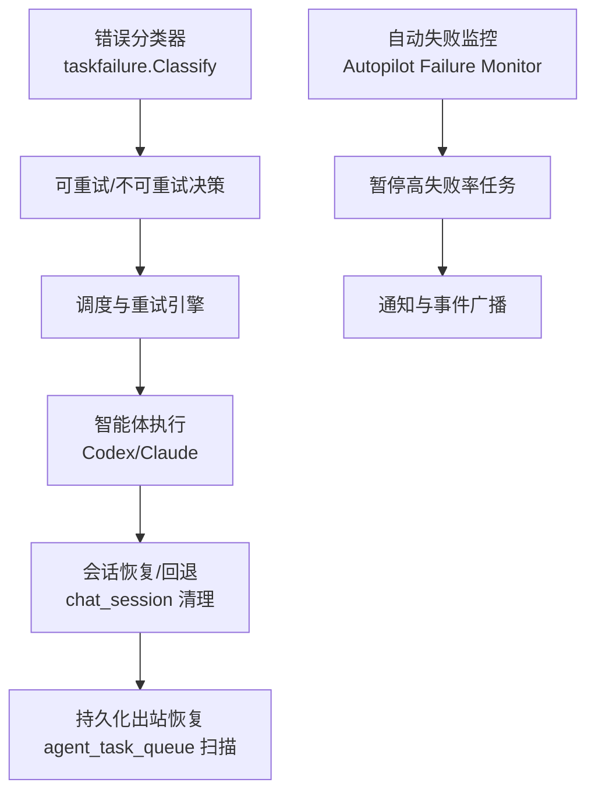
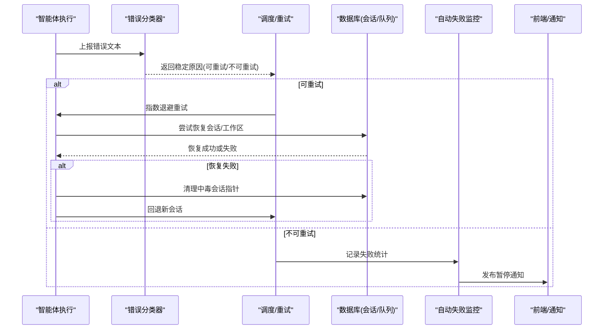
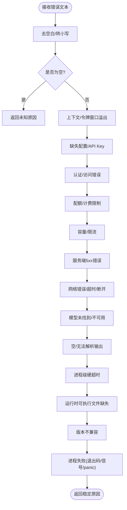
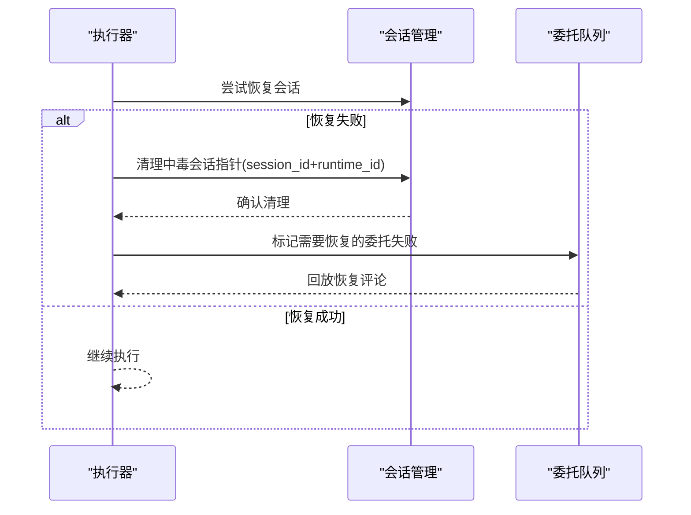
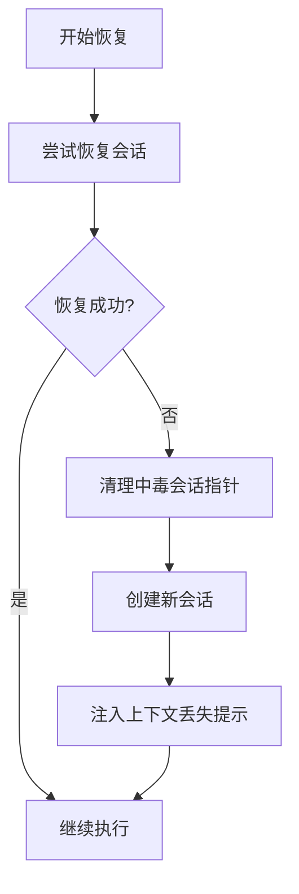
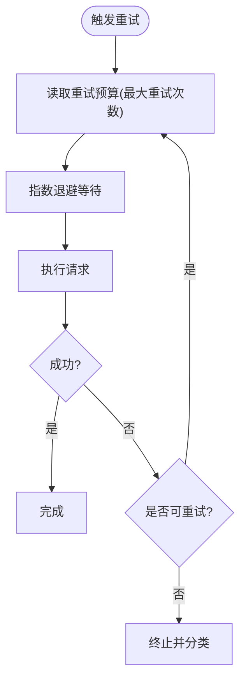
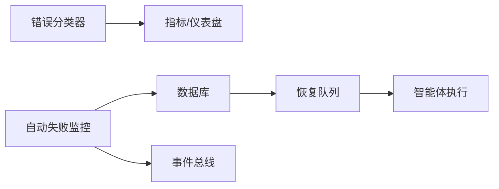

# 错误处理和恢复

<cite>
**本文引用的文件**
- [classify.go](file://server/pkg/taskfailure/classify.go)
- [autopilot_failure_monitor.go](file://server/cmd/server/autopilot_failure_monitor.go)
- [chat.sql](file://server/pkg/db/queries/chat.sql)
- [agent.sql](file://server/pkg/db/queries/agent.sql)
- [codex_test.go](file://server/pkg/agent/codex_test.go)
- [codex.go](file://server/pkg/agent/codex.go)
- [claude.go](file://server/pkg/agent/claude.go)
- [retry_test.go](file://server/pkg/llm/retry_test.go)
- [auth-error.ts](file://apps/mobile/lib/auth-error.ts)
</cite>

## 目录
1. [简介](#简介)
2. [项目结构](#项目结构)
3. [核心组件](#核心组件)
4. [架构总览](#架构总览)
5. [详细组件分析](#详细组件分析)
6. [依赖关系分析](#依赖关系分析)
7. [性能考量](#性能考量)
8. [故障排查指南](#故障排查指南)
9. [结论](#结论)
10. [附录](#附录)

## 简介
本文件系统性阐述智能体执行过程中的错误分类、中毒检测与隔离、任务恢复（断点续传、状态重建、一致性保证）、重试策略配置、错误日志与追踪、崩溃恢复流程，以及监控告警与故障自愈机制。内容基于后端 Go 服务、数据库查询与前端错误映射的实现，确保读者既能把握整体架构，也能定位到具体代码位置进行排障与优化。

## 项目结构
围绕错误处理与恢复的关键实现分布在以下层次：
- 错误分类与归因：server/pkg/taskfailure/classify.go 提供统一的错误文本分类器，将自由文本映射为稳定的 agent_error.* 原因，支撑可重试/不可重试决策与观测指标。
- 自动失败监控与自愈：server/cmd/server/autopilot_failure_monitor.go 周期性扫描高失败率的自动化任务并暂停，同时发送通知与事件。
- 会话恢复与一致性：server/pkg/db/queries/chat.sql 提供清理“中毒”会话指针的原子更新；server/pkg/db/queries/agent.sql 提供委托失败的持久化出站扫描以支持恢复。
- 智能体执行与恢复：server/pkg/agent/codex.go 与 codex_test.go 体现线程/会话恢复、回退到新会话、上下文丢失提示等策略；server/pkg/agent/claude.go 捕获 stderr 输出用于诊断。
- 重试预算与边界校验：server/pkg/llm/retry_test.go 验证最大重试次数与预算上限，确保配置非法时拒绝而非静默降级。
- 前端错误映射：apps/mobile/lib/auth-error.ts 将后端原始错误映射为用户友好的本地语言提示，避免直接暴露技术细节。

图表来源
- [classify.go:62-286](file://server/pkg/taskfailure/classify.go#L62-L286)
- [chat.sql:287-308](file://server/pkg/db/queries/chat.sql#L287-L308)
- [agent.sql:2056-2077](file://server/pkg/db/queries/agent.sql#L2056-L2077)
- [autopilot_failure_monitor.go:73-191](file://server/cmd/server/autopilot_failure_monitor.go#L73-L191)

章节来源
- [classify.go:62-286](file://server/pkg/taskfailure/classify.go#L62-L286)
- [autopilot_failure_monitor.go:73-191](file://server/cmd/server/autopilot_failure_monitor.go#L73-L191)
- [chat.sql:287-308](file://server/pkg/db/queries/chat.sql#L287-L308)
- [agent.sql:2056-2077](file://server/pkg/db/queries/agent.sql#L2056-L2077)

## 核心组件
- 错误分类器：将自由文本错误映射为稳定标签（如网络错误、超时、权限、配额、容量限制、服务端错误、进程失败等），并兼容历史旧版守护进程的标签，确保在线与离线回填一致。
- 自动失败监控：按时间窗口统计失败率，超过阈值则暂停自动化任务，写入规则版本并发布通知，防止热循环消耗资源。
- 会话恢复与一致性：在失败路径中安全清理会话指针，避免“中毒”会话被重复恢复；对委托失败使用持久化出站消息进行可靠回放。
- 智能体执行与恢复：尝试恢复上一轮会话，若失败则回退到新会话，并在输入中附带上下文丢失提示，保障连续性感知。
- 重试预算与配置校验：通过配置构造重试预算，拒绝负数等非法值，确保最大重试次数生效且不会无限重试。
- 前端错误映射：将后端错误映射为友好文案，屏蔽技术细节，提升用户体验。

章节来源
- [classify.go:62-286](file://server/pkg/taskfailure/classify.go#L62-L286)
- [autopilot_failure_monitor.go:73-191](file://server/cmd/server/autopilot_failure_monitor.go#L73-L191)
- [chat.sql:287-308](file://server/pkg/db/queries/chat.sql#L287-L308)
- [agent.sql:2056-2077](file://server/pkg/db/queries/agent.sql#L2056-L2077)
- [codex_test.go:2094-2115](file://server/pkg/agent/codex_test.go#L2094-L2115)
- [codex.go:3565-3600](file://server/pkg/agent/codex.go#L3565-L3600)
- [retry_test.go:58-101](file://server/pkg/llm/retry_test.go#L58-L101)
- [auth-error.ts:1-23](file://apps/mobile/lib/auth-error.ts#L1-L23)

## 架构总览
下图展示从错误产生到分类、恢复、重试与监控的全链路：

图表来源
- [classify.go:62-286](file://server/pkg/taskfailure/classify.go#L62-L286)
- [chat.sql:287-308](file://server/pkg/db/queries/chat.sql#L287-L308)
- [agent.sql:2056-2077](file://server/pkg/db/queries/agent.sql#L2056-L2077)
- [autopilot_failure_monitor.go:73-191](file://server/cmd/server/autopilot_failure_monitor.go#L73-L191)

## 详细组件分析

### 错误分类与归因
- 分类目标：将自由文本错误映射为 14 种 agent_error.* 子原因之一，包括上下文溢出、缺失配置、认证/访问、配额/计费、容量/限流、服务端错误、网络错误、模型不可用、空输出、超时、运行时可执行文件缺失、版本不兼容、进程失败等。
- 匹配策略：采用大小写不敏感子串匹配与正则边界保护，避免误判（例如将“1500ms”误判为 5xx）。更具体的规则优先于更通用的规则。
- 兼容性：提供 NormalizeDaemonReason 将旧版守护进程报告的标签升级到当前体系，确保在线与离线回填一致。
- 关键约束：分类器仅返回代理侧原因，平台侧原因由其他路径生成，避免破坏 Prometheus 标签语义。

图表来源
- [classify.go:62-286](file://server/pkg/taskfailure/classify.go#L62-L286)

章节来源
- [classify.go:62-286](file://server/pkg/taskfailure/classify.go#L62-L286)

### 中毒检测与异常实例隔离
- 会话指针清理：在失败路径中，若会话不可恢复，需安全清空 chat_session 的 session_id 与 runtime_id，避免后续轮次继续恢复“中毒”会话。该更新带有精确的 session_id + runtime_id 谓词，确保并发安全。
- 委托失败恢复：通过 agent_task_queue 的持久化出站扫描，识别尚未被可执行任务认领的恢复评论，并在短暂分发错误或进程重启后回放，确保最终一致性。
- 会话回退与提示：当恢复失败时，回退至新会话，并在输入中附加上下文丢失的系统提示，使智能体知晓前一轮上下文不可用。

图表来源
- [chat.sql:287-308](file://server/pkg/db/queries/chat.sql#L287-L308)
- [agent.sql:2056-2077](file://server/pkg/db/queries/agent.sql#L2056-L2077)
- [codex_test.go:2094-2115](file://server/pkg/agent/codex_test.go#L2094-L2115)

章节来源
- [chat.sql:287-308](file://server/pkg/db/queries/chat.sql#L287-L308)
- [agent.sql:2056-2077](file://server/pkg/db/queries/agent.sql#L2056-L2077)
- [codex_test.go:2094-2115](file://server/pkg/agent/codex_test.go#L2094-L2115)

### 任务恢复机制（断点续传、状态重建、一致性）
- 断点续传：优先尝试恢复上一轮会话；若失败则回退到新会话，并在输入中携带上下文丢失提示，确保连续性感知。
- 状态重建：通过清理中毒会话指针与持久化出站恢复评论，保证会话与工作区状态的一致性。
- 一致性保证：清理操作使用强谓词（session_id + runtime_id）避免覆盖健康会话；委托失败恢复使用索引与 LIMIT 控制扫描范围，避免历史膨胀。

图表来源
- [codex_test.go:2094-2115](file://server/pkg/agent/codex_test.go#L2094-L2115)
- [chat.sql:287-308](file://server/pkg/db/queries/chat.sql#L287-L308)

章节来源
- [codex_test.go:2094-2115](file://server/pkg/agent/codex_test.go#L2094-L2115)
- [chat.sql:287-308](file://server/pkg/db/queries/chat.sql#L287-L308)

### 重试策略配置（指数退避、最大重试次数、失败阈值）
- 最大重试次数：通过配置构造重试预算，测试验证正数值作为上限生效；负数配置会被拒绝，避免静默降级。
- 指数退避：结合调度器的重试逻辑与网络错误分类，对临时性失败进行退避重试，降低瞬时拥塞影响。
- 失败阈值：自动失败监控按时间窗口统计失败率，超过阈值则暂停任务，防止热循环消耗资源。

图表来源
- [retry_test.go:58-101](file://server/pkg/llm/retry_test.go#L58-L101)
- [classify.go:163-218](file://server/pkg/taskfailure/classify.go#L163-L218)

章节来源
- [retry_test.go:58-101](file://server/pkg/llm/retry_test.go#L58-L101)
- [classify.go:163-218](file://server/pkg/taskfailure/classify.go#L163-L218)

### 错误日志与追踪（堆栈跟踪、上下文信息、诊断数据）
- 标准日志：通过 slog 记录调试级别输出，捕获 stderr 以便诊断。
- 上下文信息：分类器保留原始错误文本与稳定原因，便于仪表盘与告警；自动失败监控记录失败率、时间窗口与阈值等上下文。
- 诊断数据：会话恢复失败时注入系统提示，委托失败恢复包含源任务与问题标识，便于定位。

章节来源
- [claude.go:1239-1255](file://server/pkg/agent/claude.go#L1239-L1255)
- [autopilot_failure_monitor.go:116-191](file://server/cmd/server/autopilot_failure_monitor.go#L116-L191)
- [classify.go:62-286](file://server/pkg/taskfailure/classify.go#L62-L286)

### 崩溃恢复流程（进程重启、状态同步、数据修复）
- 进程重启：自动失败监控在启动延迟后首次运行，避免全量冲击数据库；滚动重启时逐步恢复。
- 状态同步：通过持久化出站扫描与索引约束，确保恢复评论不被遗漏且不随历史增长而膨胀。
- 数据修复：清理中毒会话指针，避免后续轮次继续恢复无效会话；委托失败恢复在短暂分发错误或进程重启后回放。

章节来源
- [autopilot_failure_monitor.go:73-111](file://server/cmd/server/autopilot_failure_monitor.go#L73-L111)
- [agent.sql:2056-2077](file://server/pkg/db/queries/agent.sql#L2056-L2077)
- [chat.sql:287-308](file://server/pkg/db/queries/chat.sql#L287-L308)

### 错误监控告警与故障自愈
- 监控指标：分类器输出稳定原因，便于构建仪表盘与告警规则。
- 告警通知：自动失败监控暂停高失败率任务，写入收件箱项并发布实时事件，通知创建者或所有者。
- 故障自愈：暂停后阻止进一步资源消耗，待人工干预后重新启用；委托失败恢复在后台扫描并回放。

章节来源
- [autopilot_failure_monitor.go:116-280](file://server/cmd/server/autopilot_failure_monitor.go#L116-L280)
- [classify.go:62-286](file://server/pkg/taskfailure/classify.go#L62-L286)

### 常见错误诊断方法与解决方案
- 网络错误/超时：检查分类结果是否为 provider_network；若频繁出现，考虑调整超时与退避策略，并检查上游服务可用性。
- 权限错误：若分类为 auth_or_access，检查 API Key、订阅访问与登录状态；必要时刷新令牌或重新授权。
- 配额/限流：若分类为 quota_limit 或 capacity_or_rate_limit，检查余额、月度用量与速率限制；适当降载或升级套餐。
- 上下文溢出：若分类为 context_overflow，缩短提示或拆分任务；避免重复触发同一会话导致持续溢出。
- 进程失败：若分类为 process_failure，检查执行环境、可执行文件与版本兼容性；必要时重装或升级 CLI。

章节来源
- [classify.go:62-286](file://server/pkg/taskfailure/classify.go#L62-L286)
- [auth-error.ts:1-23](file://apps/mobile/lib/auth-error.ts#L1-L23)

## 依赖关系分析
- 分类器依赖正则与字符串匹配，性能关键路径在包初始化编译正则，避免每次调用开销。
- 自动失败监控依赖数据库查询与事件总线，需关注查询性能与事件风暴。
- 会话恢复依赖 chat_session 与 agent_task_queue 的强一致性与索引设计。
- 重试预算依赖配置校验，确保非法配置被拒绝。

图表来源
- [classify.go:62-286](file://server/pkg/taskfailure/classify.go#L62-L286)
- [autopilot_failure_monitor.go:73-191](file://server/cmd/server/autopilot_failure_monitor.go#L73-L191)
- [agent.sql:2056-2077](file://server/pkg/db/queries/agent.sql#L2056-L2077)

章节来源
- [classify.go:62-286](file://server/pkg/taskfailure/classify.go#L62-L286)
- [autopilot_failure_monitor.go:73-191](file://server/cmd/server/autopilot_failure_monitor.go#L73-L191)
- [agent.sql:2056-2077](file://server/pkg/db/queries/agent.sql#L2056-L2077)

## 性能考量
- 分类器在包初始化编译正则，减少热路径开销。
- 自动失败监控使用定时任务与启动延迟，避免启动风暴。
- 会话清理与恢复使用强谓词与索引，确保并发安全与扫描效率。
- 重试预算限制最大重试次数，防止无限重试导致的资源耗尽。

## 故障排查指南
- 步骤一：查看错误分类结果，确定原因类型（网络、权限、配额、上下文溢出、进程失败等）。
- 步骤二：检查会话状态，确认是否存在中毒会话；必要时手动清理。
- 步骤三：审查自动失败监控记录，确认是否已暂停高失败率任务。
- 步骤四：核对重试配置，确保最大重试次数与退避策略合理。
- 步骤五：收集日志与上下文信息，包括原始错误文本、会话 ID、任务 ID 与时间戳。

章节来源
- [classify.go:62-286](file://server/pkg/taskfailure/classify.go#L62-L286)
- [chat.sql:287-308](file://server/pkg/db/queries/chat.sql#L287-L308)
- [autopilot_failure_monitor.go:116-280](file://server/cmd/server/autopilot_failure_monitor.go#L116-L280)

## 结论
本系统通过稳定的错误分类、可靠的会话恢复、严格的配置校验与自动化的失败监控，构建了健壮的容错与自愈能力。结合清晰的日志与通知机制，能够快速定位与解决问题，保障智能体任务的连续性与一致性。

## 附录
- 术语表：
  - 中毒会话：无法恢复且会误导后续执行的会话。
  - 委托失败：由子任务发起的失败，需由父任务协调恢复。
  - 重试预算：限制最大重试次数与超时等资源的配置集合。
- 参考实现路径：
  - 错误分类：[classify.go:62-286](file://server/pkg/taskfailure/classify.go#L62-L286)
  - 自动失败监控：[autopilot_failure_monitor.go:73-280](file://server/cmd/server/autopilot_failure_monitor.go#L73-L280)
  - 会话恢复：[chat.sql:287-308](file://server/pkg/db/queries/chat.sql#L287-L308)
  - 委托恢复：[agent.sql:2056-2077](file://server/pkg/db/queries/agent.sql#L2056-L2077)
  - 重试预算：[retry_test.go:58-101](file://server/pkg/llm/retry_test.go#L58-L101)
  - 前端错误映射：[auth-error.ts:1-23](file://apps/mobile/lib/auth-error.ts#L1-L23)