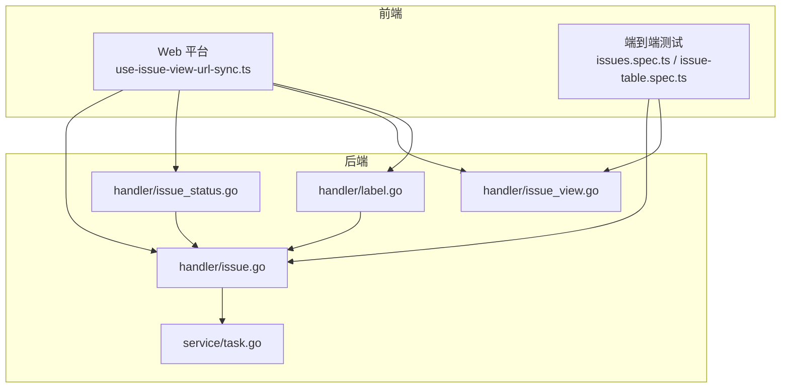
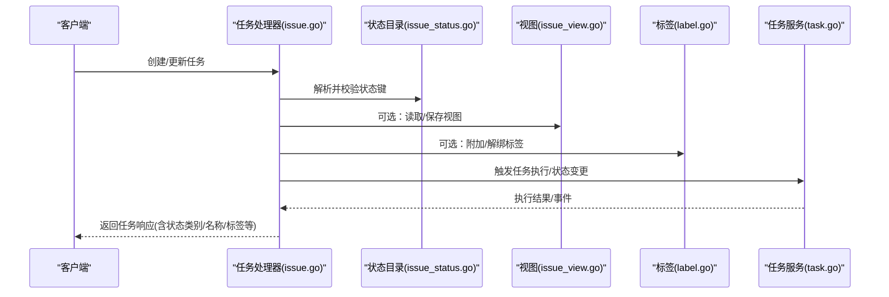
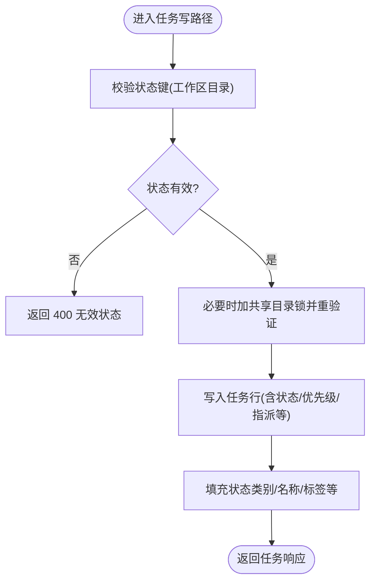
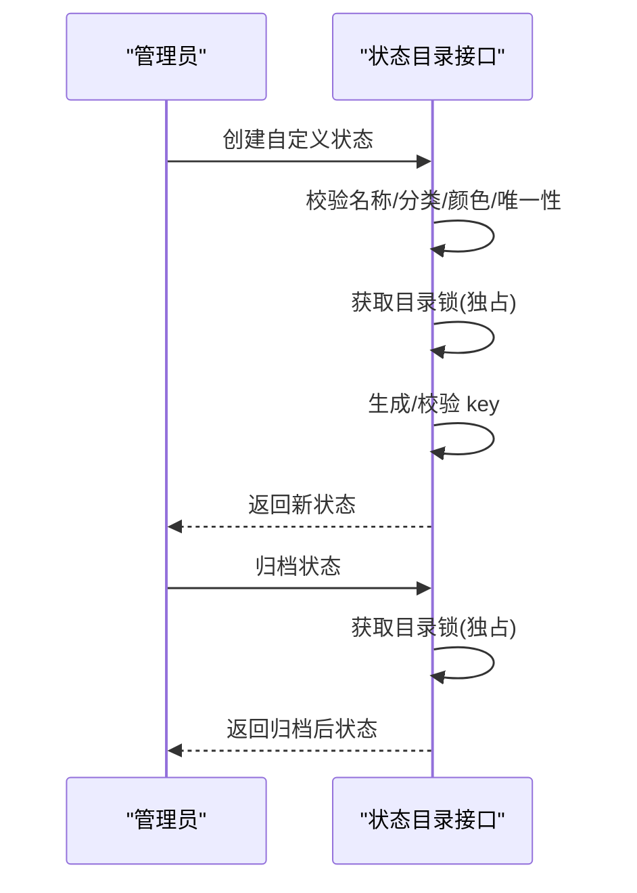
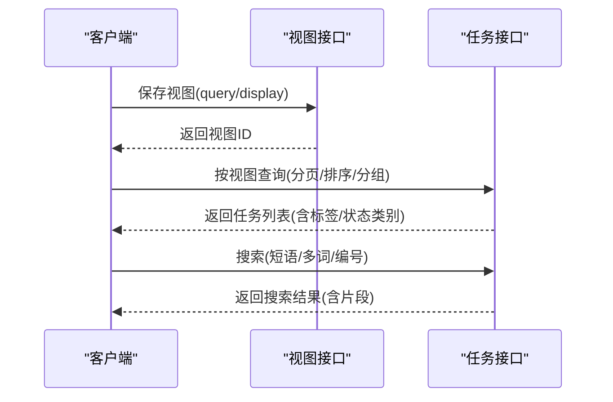
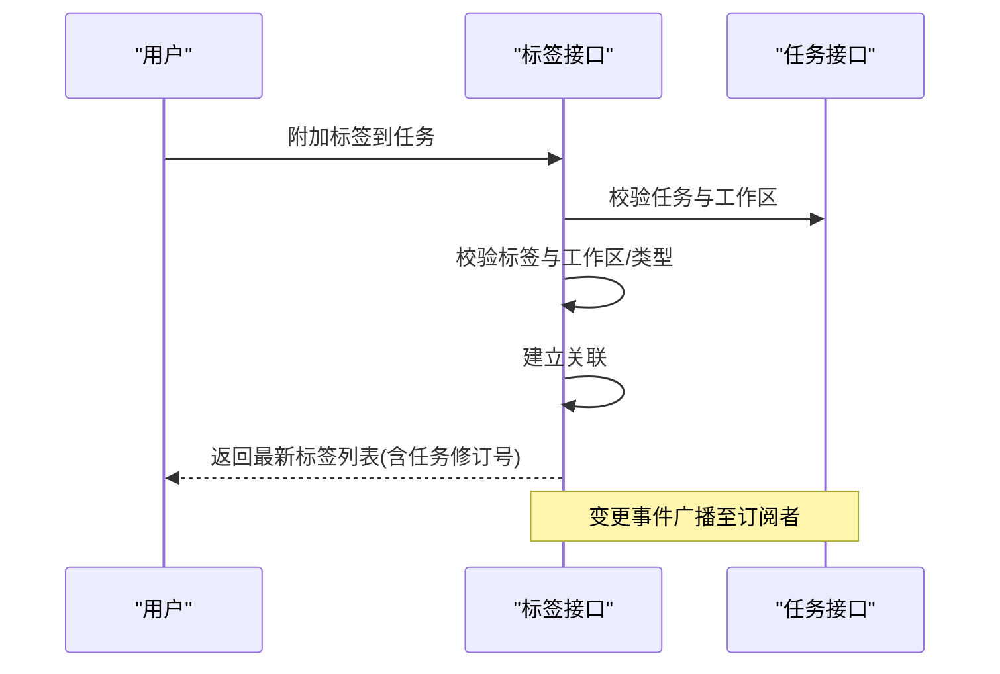
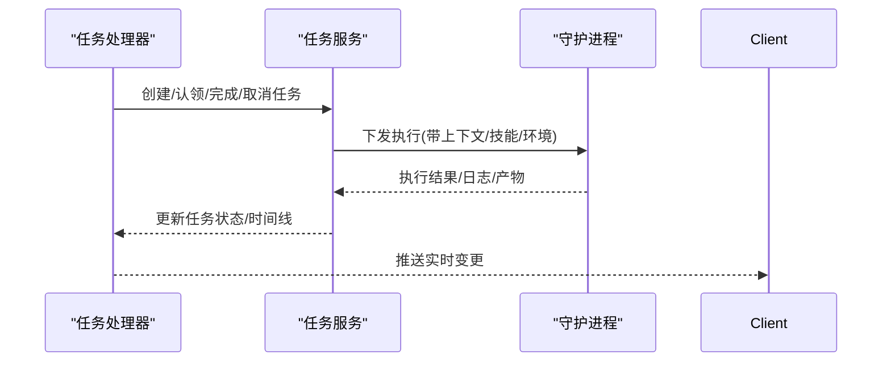
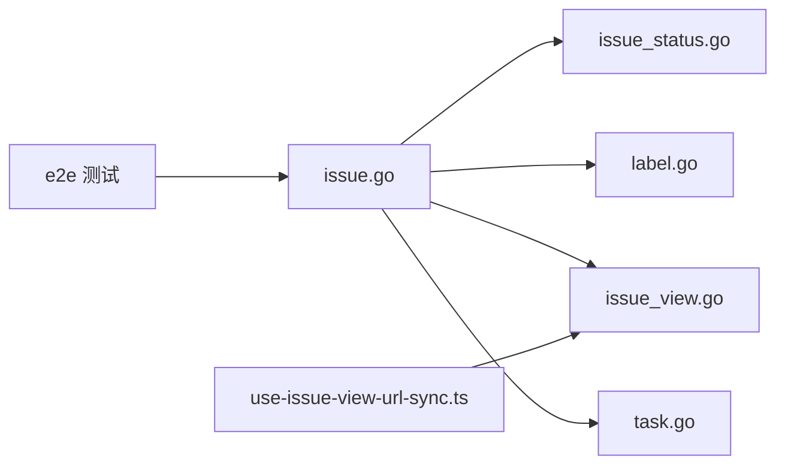

# 任务管理

<cite>
**本文引用的文件**
- [server/internal/handler/issue.go](file://server/internal/handler/issue.go)
- [server/internal/handler/issue_status.go](file://server/internal/handler/issue_status.go)
- [server/internal/handler/issue_view.go](file://server/internal/handler/issue_view.go)
- [server/internal/handler/label.go](file://server/internal/handler/label.go)
- [server/internal/service/task.go](file://server/internal/service/task.go)
- [apps/web/platform/use-issue-view-url-sync.ts](file://apps/web/platform/use-issue-view-url-sync.ts)
- [e2e/issues.spec.ts](file://e2e/issues.spec.ts)
- [e2e/issue-table.spec.ts](file://e2e/issue-table.spec.ts)
</cite>

## 目录
1. [简介](#简介)
2. [项目结构](#项目结构)
3. [核心组件](#核心组件)
4. [架构总览](#架构总览)
5. [详细组件分析](#详细组件分析)
6. [依赖关系分析](#依赖关系分析)
7. [性能考虑](#性能考虑)
8. [故障排查指南](#故障排查指南)
9. [结论](#结论)
10. [附录](#附录)

## 简介
本文件围绕 Multica 中的“任务（Issue）”展开，系统阐述其作为日常工作基本单元的概念与能力：包含描述、讨论、状态与历史记录；支持创建、分配、状态跟踪与生命周期管理；可分配给成员、智能体或小队；具备属性、标签、优先级与依赖关系管理能力。文档同时覆盖任务的视图、过滤、搜索与报告能力，并通过实际示例展示工作流程、自动化处理与协作模式，既适合日常用户管理任务，也为管理员提供高级配置与优化建议。

## 项目结构
后端以 Go + Chi 路由为核心，任务相关能力集中在 handler 层，配合 service 层与数据库访问层实现。前端通过 Next.js 平台模块与多端应用（Web/Mobile/Desktop）消费 API，并使用 URL 同步保存视图状态。

**图表来源**
- [server/internal/handler/issue.go:1-120](file://server/internal/handler/issue.go#L1-L120)
- [server/internal/handler/issue_status.go:90-130](file://server/internal/handler/issue_status.go#L90-L130)
- [server/internal/handler/issue_view.go:15-35](file://server/internal/handler/issue_view.go#L15-L35)
- [server/internal/handler/label.go:140-165](file://server/internal/handler/label.go#L140-L165)
- [apps/web/platform/use-issue-view-url-sync.ts](file://apps/web/platform/use-issue-view-url-sync.ts)
- [e2e/issues.spec.ts](file://e2e/issues.spec.ts)
- [e2e/issue-table.spec.ts](file://e2e/issue-table.spec.ts)

**章节来源**
- [server/internal/handler/issue.go:1-120](file://server/internal/handler/issue.go#L1-L120)
- [server/internal/handler/issue_status.go:90-130](file://server/internal/handler/issue_status.go#L90-L130)
- [server/internal/handler/issue_view.go:15-35](file://server/internal/handler/issue_view.go#L15-L35)
- [server/internal/handler/label.go:140-165](file://server/internal/handler/label.go#L140-L165)
- [apps/web/platform/use-issue-view-url-sync.ts](file://apps/web/platform/use-issue-view-url-sync.ts)
- [e2e/issues.spec.ts](file://e2e/issues.spec.ts)
- [e2e/issue-table.spec.ts](file://e2e/issue-table.spec.ts)

## 核心组件
- 任务模型与响应：统一的任务响应结构，包含标识、标题、描述、状态、优先级、指派方、父任务、项目、阶段、起止日期、时间戳、修订号、最近活动、元数据、自定义属性、反应、附件、标签等。
- 状态目录：工作区级任务状态目录，支持内置与自定义状态，具备分类、颜色、位置与归档能力。
- 视图：服务器端保存的筛选定义与显示默认值，支持范围（工作区/我的/项目）、可见性（私有/工作区共享）与版本化查询/显示定义。
- 标签：跨资源（任务、智能体、技能）的统一标签体系，支持创建、更新、删除与附加/解绑。
- 任务执行：服务层封装任务生命周期（领取、完成、取消、批量操作等），与守护进程协同执行智能体任务。

**章节来源**
- [server/internal/handler/issue.go:36-104](file://server/internal/handler/issue.go#L36-L104)
- [server/internal/handler/issue_status.go:21-41](file://server/internal/handler/issue_status.go#L21-L41)
- [server/internal/handler/issue_view.go:15-35](file://server/internal/handler/issue_view.go#L15-L35)
- [server/internal/handler/label.go:21-35](file://server/internal/handler/label.go#L21-L35)
- [server/internal/service/task.go](file://server/internal/service/task.go)

## 架构总览
任务管理的请求-响应流程贯穿前端、API 处理器与服务层，涉及状态目录校验、视图持久化、标签关联以及任务执行编排。

**图表来源**
- [server/internal/handler/issue.go:124-230](file://server/internal/handler/issue.go#L124-L230)
- [server/internal/handler/issue_status.go:90-130](file://server/internal/handler/issue_status.go#L90-L130)
- [server/internal/handler/issue_view.go:123-228](file://server/internal/handler/issue_view.go#L123-L228)
- [server/internal/handler/label.go:417-494](file://server/internal/handler/label.go#L417-L494)
- [server/internal/service/task.go](file://server/internal/service/task.go)

## 详细组件分析

### 任务模型与生命周期
- 任务响应字段涵盖基础信息、状态与分类、优先级、指派方、父子关系、项目、阶段、起止时间、修订号、最近活动时间、元数据、自定义属性、反应、附件与标签等。
- 状态解析采用工作区目录校验，确保写入前状态有效，并在写路径中通过共享目录锁重验证，避免竞态导致写入已归档状态。
- 列表/详情响应会填充状态类别与名称，减少 N+1 查询。

**图表来源**
- [server/internal/handler/issue.go:124-230](file://server/internal/handler/issue.go#L124-L230)
- [server/internal/handler/issue.go:253-330](file://server/internal/handler/issue.go#L253-L330)

**章节来源**
- [server/internal/handler/issue.go:36-104](file://server/internal/handler/issue.go#L36-L104)
- [server/internal/handler/issue.go:124-230](file://server/internal/handler/issue.go#L124-L230)
- [server/internal/handler/issue.go:253-330](file://server/internal/handler/issue.go#L253-L330)

### 状态目录与生命周期管理
- 列出/创建/更新/归档/重排状态目录，支持内置与自定义状态，按分类维护顺序。
- 创建/更新/归档均受权限控制（所有者/管理员），且通过事务与目录锁保证一致性。
- 归档仅阻止未来使用，不影响历史任务的状态保留与渲染。

**图表来源**
- [server/internal/handler/issue_status.go:132-205](file://server/internal/handler/issue_status.go#L132-L205)
- [server/internal/handler/issue_status.go:352-420](file://server/internal/handler/issue_status.go#L352-L420)

**章节来源**
- [server/internal/handler/issue_status.go:90-130](file://server/internal/handler/issue_status.go#L90-L130)
- [server/internal/handler/issue_status.go:132-205](file://server/internal/handler/issue_status.go#L132-L205)
- [server/internal/handler/issue_status.go:352-420](file://server/internal/handler/issue_status.go#L352-L420)

### 任务视图、过滤与搜索
- 视图：服务器端保存的筛选定义与显示默认值，支持范围（工作区/我的/项目）、可见性（私有/工作区共享）、版本化 query/display 对象。
- 列表/分组/排序：支持按状态、指派方等维度分组与排序，并提供聚合统计。
- 搜索：动态 SQL 构建，支持短语匹配、多词 AND、编号精确匹配、忽略关闭项（基于终态集合），并按相关性分级排序。

**图表来源**
- [server/internal/handler/issue_view.go:123-228](file://server/internal/handler/issue_view.go#L123-L228)
- [server/internal/handler/issue_view.go:230-269](file://server/internal/handler/issue_view.go#L230-L269)
- [server/internal/handler/issue.go:618-800](file://server/internal/handler/issue.go#L618-L800)

**章节来源**
- [server/internal/handler/issue_view.go:15-35](file://server/internal/handler/issue_view.go#L15-L35)
- [server/internal/handler/issue_view.go:123-228](file://server/internal/handler/issue_view.go#L123-L228)
- [server/internal/handler/issue_view.go:230-269](file://server/internal/handler/issue_view.go#L230-L269)
- [server/internal/handler/issue.go:618-800](file://server/internal/handler/issue.go#L618-L800)

### 标签与依赖关系管理
- 标签体系：支持任务、智能体、技能三类资源的标签，统一 CRUD 与附加/解绑。
- 附加/解绑：在任务上附加/移除标签时，校验工作区归属与资源类型，成功后广播变更事件，保持多端一致。
- 依赖关系：通过父任务字段与阶段（stage）组织子任务，结合阶段门控实现子任务完成对父任务的唤醒。

**图表来源**
- [server/internal/handler/label.go:417-494](file://server/internal/handler/label.go#L417-L494)
- [server/internal/handler/issue.go:369-400](file://server/internal/handler/issue.go#L369-L400)

**章节来源**
- [server/internal/handler/label.go:140-165](file://server/internal/handler/label.go#L140-L165)
- [server/internal/handler/label.go:417-494](file://server/internal/handler/label.go#L417-L494)
- [server/internal/handler/issue.go:369-400](file://server/internal/handler/issue.go#L369-L400)

### 任务执行与自动化
- 任务服务封装了任务的生命周期：领取、完成、取消、批量操作、重试与失败诊断等，并与守护进程协同执行智能体任务。
- 守护进程负责装配智能体上下文、运行技能与 prompt 构建，逐轮可变字段放在消息而非 brief，以保障缓存命中。

**图表来源**
- [server/internal/service/task.go](file://server/internal/service/task.go)

**章节来源**
- [server/internal/service/task.go](file://server/internal/service/task.go)

### 实际示例与协作模式
- 创建工作区任务：设置标题、描述、优先级、指派方（成员/智能体/小队）、标签与截止日期，自动纳入视图与搜索索引。
- 团队协作：评论驱动状态推进，状态变更触发下游自动化（如通知、看板更新）。
- 智能体参与：将任务指派给智能体，由守护进程执行技能与 prompt，产出结果并回填任务。

**章节来源**
- [e2e/issues.spec.ts](file://e2e/issues.spec.ts)
- [e2e/issue-table.spec.ts](file://e2e/issue-table.spec.ts)

## 依赖关系分析
- 处理器之间：任务处理器依赖状态目录解析与填充、标签批量加载、视图查询等；状态目录处理器独立但被任务写路径引用。
- 服务层：任务服务为上层处理器提供任务生命周期能力，屏蔽守护进程细节。
- 前端：Web 平台通过 URL 同步视图参数，移动端/桌面端通过各自库进行过滤与分组。

**图表来源**
- [server/internal/handler/issue.go:124-230](file://server/internal/handler/issue.go#L124-L230)
- [server/internal/handler/issue_status.go:90-130](file://server/internal/handler/issue_status.go#L90-L130)
- [server/internal/handler/label.go:417-494](file://server/internal/handler/label.go#L417-L494)
- [server/internal/handler/issue_view.go:123-228](file://server/internal/handler/issue_view.go#L123-L228)
- [apps/web/platform/use-issue-view-url-sync.ts](file://apps/web/platform/use-issue-view-url-sync.ts)
- [e2e/issues.spec.ts](file://e2e/issues.spec.ts)

**章节来源**
- [server/internal/handler/issue.go:124-230](file://server/internal/handler/issue.go#L124-L230)
- [server/internal/handler/issue_status.go:90-130](file://server/internal/handler/issue_status.go#L90-L130)
- [server/internal/handler/label.go:417-494](file://server/internal/handler/label.go#L417-L494)
- [server/internal/handler/issue_view.go:123-228](file://server/internal/handler/issue_view.go#L123-L228)
- [apps/web/platform/use-issue-view-url-sync.ts](file://apps/web/platform/use-issue-view-url-sync.ts)
- [e2e/issues.spec.ts](file://e2e/issues.spec.ts)

## 性能考虑
- 状态类别填充：使用一次性 Resolver 批量填充，避免每行一次目录查询。
- 搜索查询：预构建 LIKE 模式，利用 pg_bigm GIN 索引；在 EXISTS 子查询中重复 workspace_id 常量以缩小哈希集，避免全表扫描。
- 标签批量加载：列表接口批量加载标签，避免 N+1 查询。
- 视图大小限制：对视图 JSON 载荷设置上限，防止滥用。

**章节来源**
- [server/internal/handler/issue.go:253-330](file://server/internal/handler/issue.go#L253-L330)
- [server/internal/handler/issue.go:618-800](file://server/internal/handler/issue.go#L618-L800)
- [server/internal/handler/issue.go:369-400](file://server/internal/handler/issue.go#L369-L400)
- [server/internal/handler/issue_view.go:22-28](file://server/internal/handler/issue_view.go#L22-L28)

## 故障排查指南
- 状态竞态：当目标自定义状态在请求期间被归档，写路径会返回冲突错误，提示重新加载状态列表后重试。
- 视图并发修改：更新视图需携带期望版本号，若版本不一致则返回冲突。
- 标签不存在/非任务标签：附加/解绑时会校验标签存在性与资源类型，否则返回未找到。
- 搜索性能：若搜索缓慢，检查是否使用了合适的索引与 workspace_id 常量注入。

**章节来源**
- [server/internal/handler/issue.go:165-241](file://server/internal/handler/issue.go#L165-L241)
- [server/internal/handler/issue_view.go:334-427](file://server/internal/handler/issue_view.go#L334-L427)
- [server/internal/handler/label.go:417-494](file://server/internal/handler/label.go#L417-L494)
- [server/internal/handler/issue.go:618-800](file://server/internal/handler/issue.go#L618-L800)

## 结论
Multica 的任务管理以“任务”为核心，围绕状态目录、视图、标签与任务执行形成完整闭环。通过严格的权限与一致性控制、高性能的搜索与列表能力、以及与守护进程的深度集成，既满足日常协作需求，也支撑复杂自动化场景。建议团队结合工作区状态目录与视图能力，制定统一的命名与分类规范，充分利用标签与优先级提升可发现性与可追踪性。

## 附录
- 最佳实践
  - 使用工作区状态目录定义清晰的工作流，避免随意新增状态。
  - 为任务设置合理的优先级与截止日期，便于看板与报表呈现。
  - 善用标签对工作区内的任务进行多维度归类。
  - 将常用筛选保存为视图，并通过 URL 同步快速分享。
- 管理员建议
  - 定期审查自定义状态与标签，归档不再使用的条目。
  - 监控搜索与列表性能，必要时调整索引与查询策略。
  - 结合自动化（如触发器、机器人）推动任务流转与通知。