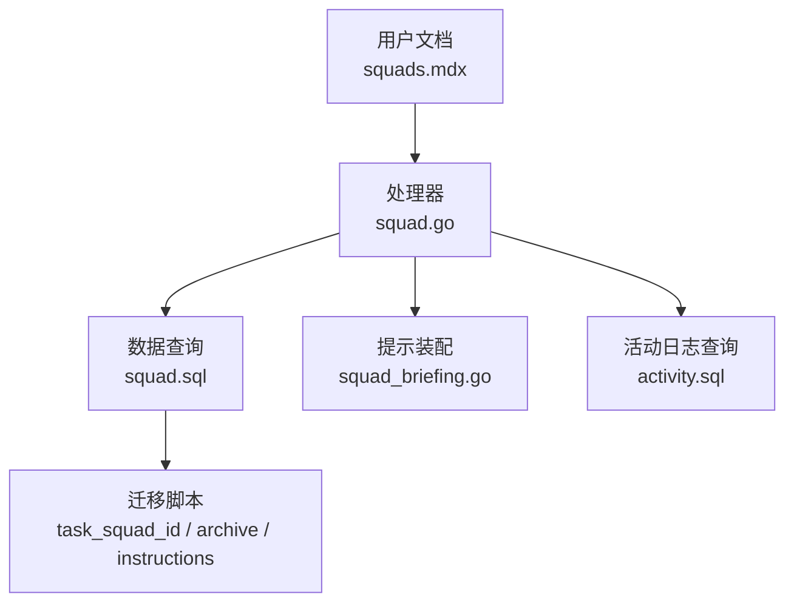
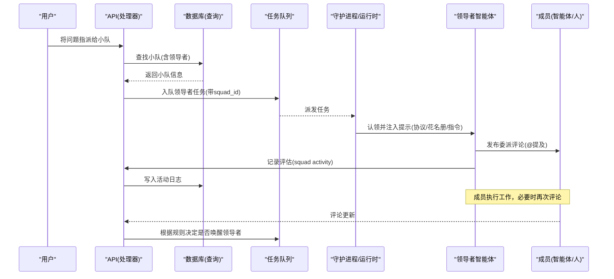
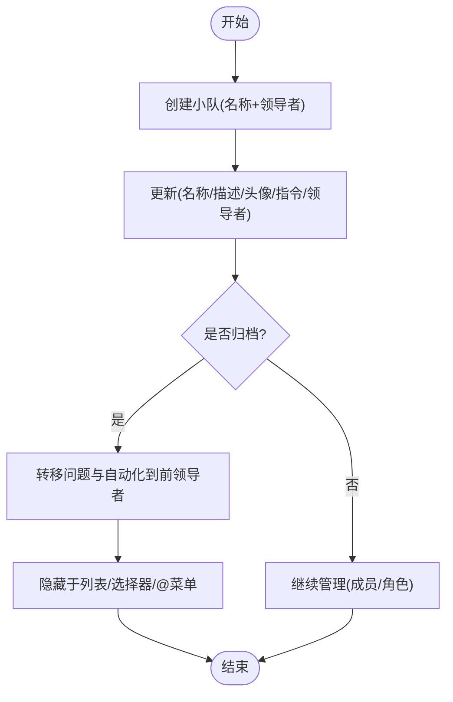
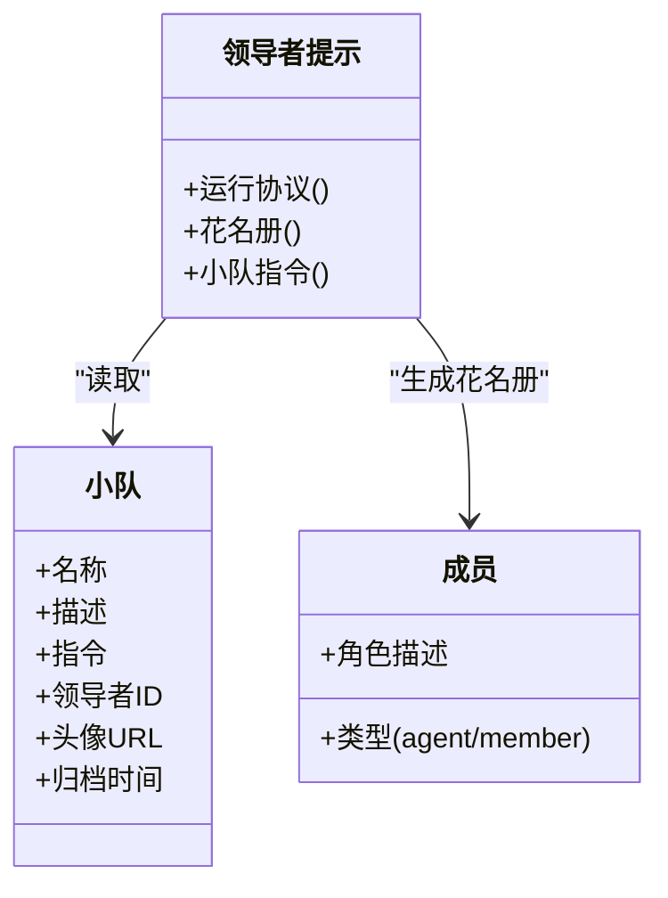
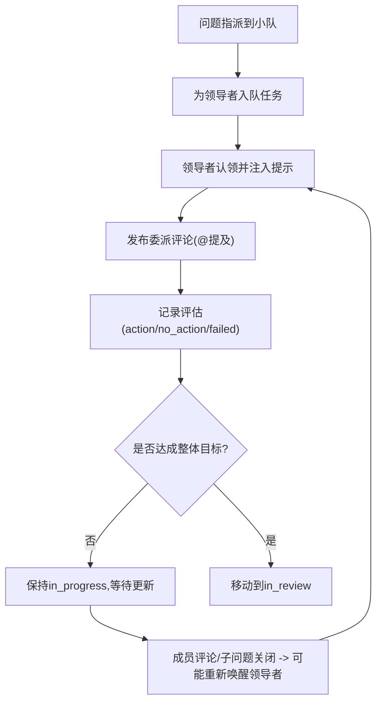
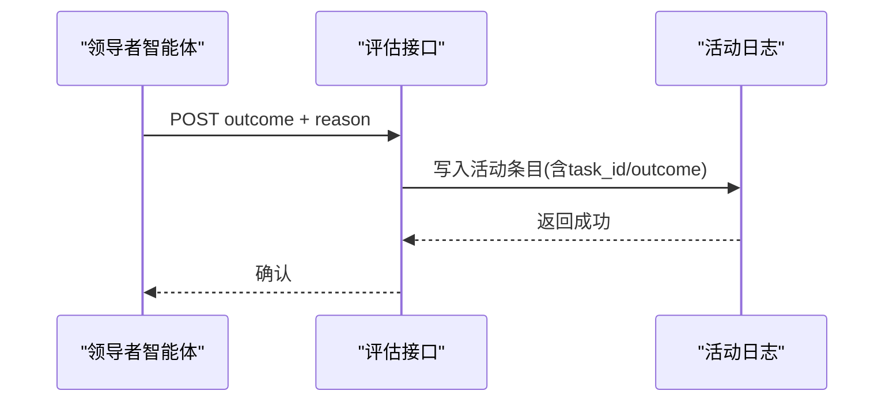
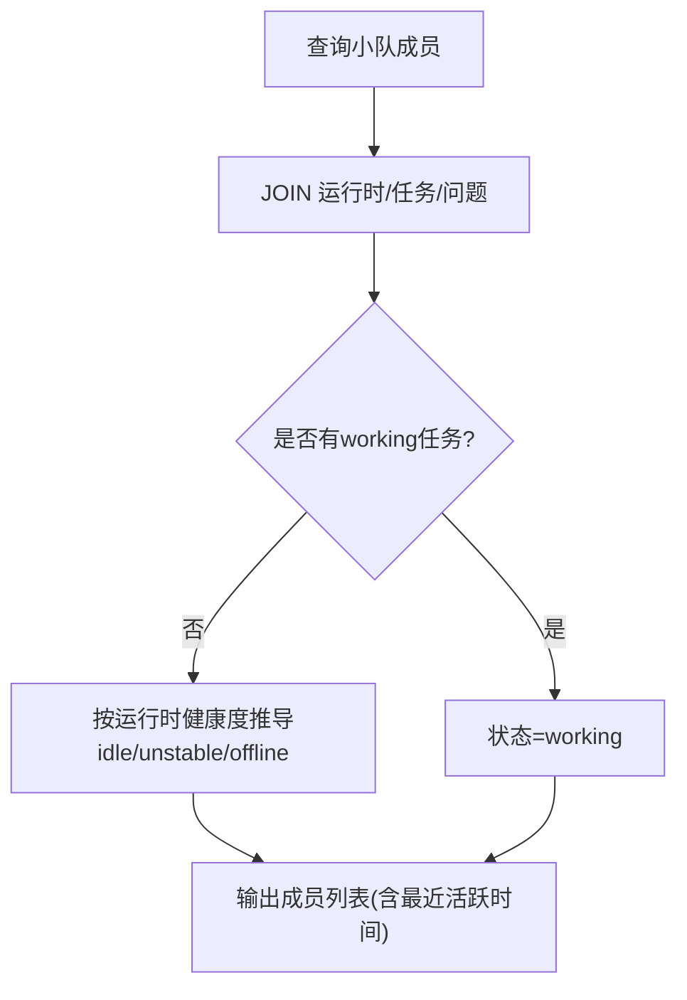
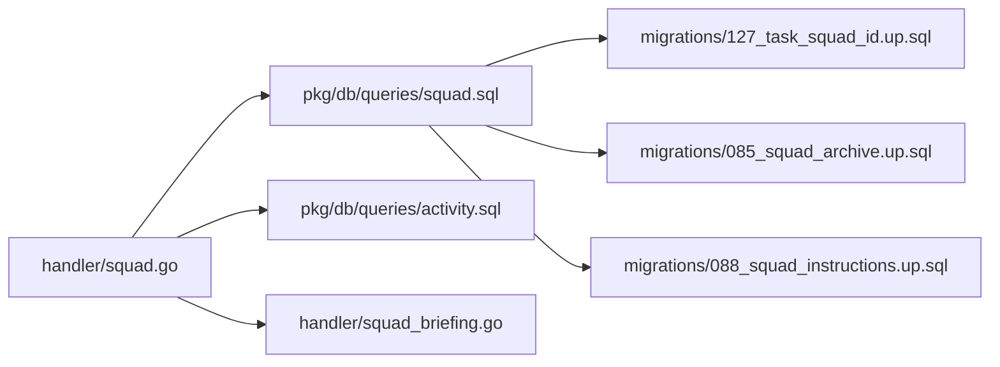

# 小队协调

<cite>
**本文引用的文件**
- [apps/docs/content/docs/squads.mdx](file://apps/docs/content/docs/squads.mdx)
- [apps/docs/content/docs/tutorial.mdx](file://apps/docs/content/docs/tutorial.mdx)
- [server/internal/handler/squad.go](file://server/internal/handler/squad.go)
- [server/internal/handler/squad_briefing.go](file://server/internal/handler/squad_briefing.go)
- [server/pkg/db/queries/squad.sql](file://server/pkg/db/queries/squad.sql)
- [server/migrations/127_task_squad_id.up.sql](file://server/migrations/127_task_squad_id.up.sql)
- [server/migrations/085_squad_archive.up.sql](file://server/migrations/085_squad_archive.up.sql)
- [server/migrations/088_squad_instructions.up.sql](file://server/migrations/088_squad_instructions.up.sql)
- [server/pkg/db/queries/activity.sql](file://server/pkg/db/queries/activity.sql)
</cite>

## 目录
1. [简介](#简介)
2. [项目结构](#项目结构)
3. [核心组件](#核心组件)
4. [架构总览](#架构总览)
5. [详细组件分析](#详细组件分析)
6. [依赖关系分析](#依赖关系分析)
7. [性能与监控](#性能与监控)
8. [故障排查指南](#故障排查指南)
9. [结论](#结论)
10. [附录：最佳实践与示例](#附录最佳实践与示例)

## 简介
本文件面向“小队”这一协作单元，解释其作为由智能体领导者与成员组成的团队如何承接任务、进行角色分工、任务分配与协作。文档覆盖小队的创建、配置与管理；领导者的职责、决策流程与冲突解决策略；以及执行流、重触发规则、权限边界、状态契约与可观测性。同时提供实际使用示例与最佳实践，帮助团队理解协作模式并为管理者提供组织与派工策略。

## 项目结构
围绕“小队协调”的关键代码与文档分布如下：
- 用户文档：定义小队的概念、组成、执行流、重触发规则、权限与归档等。
- 后端处理器：实现小队的 CRUD、成员管理、成员状态聚合、领导者评估记录、触发逻辑等。
- 数据层：通过 sqlc 生成的查询，维护小队、成员、任务队列字段（如 squad_id）及活动日志索引。
- 迁移脚本：为小队引入指令、头像、归档字段，以及在任务队列中记录 squad_id 的索引。

**图示来源**
- [apps/docs/content/docs/squads.mdx:1-118](file://apps/docs/content/docs/squads.mdx#L1-L118)
- [server/internal/handler/squad.go:1-1244](file://server/internal/handler/squad.go#L1-L1244)
- [server/internal/handler/squad_briefing.go:1-369](file://server/internal/handler/squad_briefing.go#L1-L369)
- [server/pkg/db/queries/squad.sql:1-170](file://server/pkg/db/queries/squad.sql#L1-L170)
- [server/migrations/127_task_squad_id.up.sql:1-24](file://server/migrations/127_task_squad_id.up.sql#L1-L24)
- [server/migrations/085_squad_archive.up.sql:1-2](file://server/migrations/085_squad_archive.up.sql#L1-L2)
- [server/migrations/088_squad_instructions.up.sql:1-1](file://server/migrations/088_squad_instructions.up.sql#L1-L1)
- [server/pkg/db/queries/activity.sql:35-60](file://server/pkg/db/queries/activity.sql#L35-L60)

**章节来源**
- [apps/docs/content/docs/squads.mdx:1-118](file://apps/docs/content/docs/squads.mdx#L1-L118)
- [server/internal/handler/squad.go:1-1244](file://server/internal/handler/squad.go#L1-L1244)
- [server/internal/handler/squad_briefing.go:1-369](file://server/internal/handler/squad_briefing.go#L1-L369)
- [server/pkg/db/queries/squad.sql:1-170](file://server/pkg/db/queries/squad.sql#L1-L170)
- [server/migrations/127_task_squad_id.up.sql:1-24](file://server/migrations/127_task_squad_id.up.sql#L1-L24)
- [server/migrations/085_squad_archive.up.sql:1-2](file://server/migrations/085_squad_archive.up.sql#L1-L2)
- [server/migrations/088_squad_instructions.up.sql:1-1](file://server/migrations/088_squad_instructions.up.sql#L1-L1)
- [server/pkg/db/queries/activity.sql:35-60](file://server/pkg/db/queries/activity.sql#L35-L60)

## 核心组件
- 小队实体与成员：包含名称、描述、头像、指令、领导者、创建者、归档信息等；成员可为智能体或人类，并携带角色描述。
- 领导者提示装配：在领导者认领任务时注入“小队运行协议”“小队花名册”“小队指令”，指导领导者仅做协调与委派。
- 任务队列扩展：在 agent_task_queue 增加 squad_id 字段与部分索引，用于在领取阶段定位小队并注入提示。
- 活动日志与去重：记录领导者每次触发的评估结果（action/no_action/failed），并提供 no_action 的去重能力。
- 权限与访问控制：普通成员只能添加/使用其可触发的智能体；所有者/管理员可管理全部小队；归档后不可恢复。

**章节来源**
- [server/internal/handler/squad.go:224-541](file://server/internal/handler/squad.go#L224-L541)
- [server/internal/handler/squad_briefing.go:12-176](file://server/internal/handler/squad_briefing.go#L12-L176)
- [server/migrations/127_task_squad_id.up.sql:1-24](file://server/migrations/127_task_squad_id.up.sql#L1-L24)
- [server/pkg/db/queries/activity.sql:35-60](file://server/pkg/db/queries/activity.sql#L35-L60)
- [apps/docs/content/docs/squads.mdx:18-93](file://apps/docs/content/docs/squads.mdx#L18-L93)

## 架构总览
下图展示从“将问题指派给小队”到“领导者委派成员”的端到端流程，包括提示注入、评论触发、活动记录与状态契约。

**图示来源**
- [server/internal/handler/squad.go:1184-1244](file://server/internal/handler/squad.go#L1184-L1244)
- [server/internal/handler/squad_briefing.go:178-209](file://server/internal/handler/squad_briefing.go#L178-L209)
- [server/migrations/127_task_squad_id.up.sql:1-24](file://server/migrations/127_task_squad_id.up.sql#L1-L24)
- [server/pkg/db/queries/activity.sql:35-60](file://server/pkg/db/queries/activity.sql#L35-L60)
- [apps/docs/content/docs/squads.mdx:29-68](file://apps/docs/content/docs/squads.mdx#L29-L68)

## 详细组件分析

### 小队生命周期与权限
- 创建：需名称与领导者；自动将领导者加入成员列表。
- 更新：支持改名、描述、头像、指令、更换领导者；更换领导者时若新领导者未绑定运行时，会暂停相关自动化。
- 删除（归档）：归档后从列表与选择器隐藏，不可恢复；会将原指派给小队的问题转移至前领导者；自动化目标也会迁移。
- 权限：任何成员可创建；创建者可管理自己的小队；所有者/管理员可管理全部；普通成员只能添加/使用其可触发的智能体。

**图示来源**
- [server/internal/handler/squad.go:227-324](file://server/internal/handler/squad.go#L227-L324)
- [server/internal/handler/squad.go:339-481](file://server/internal/handler/squad.go#L339-L481)
- [server/internal/handler/squad.go:483-541](file://server/internal/handler/squad.go#L483-L541)
- [apps/docs/content/docs/squads.mdx:85-99](file://apps/docs/content/docs/squads.mdx#L85-L99)

**章节来源**
- [server/internal/handler/squad.go:227-541](file://server/internal/handler/squad.go#L227-L541)
- [apps/docs/content/docs/squads.mdx:85-99](file://apps/docs/content/docs/squads.mdx#L85-L99)

### 领导者提示装配与运行协议
- 提示三要素：
  - 小队运行协议：系统级规则，强调“只做协调与委派”“必须用精确 @ 提及”“每轮记录评估”“委派后停止”。
  - 小队花名册：领导者自身行 + 非归档成员行，附带可直接粘贴的提及链接。
  - 小队指令：自定义路由规则、协作规范与背景知识，仅对领导者可见。
- 父问题状态契约：当问题确实指派给该小队时，领导者负责将父问题推进到 in_progress，并在整体目标达成时移动到 in_review；否则禁止修改状态。

**图示来源**
- [server/internal/handler/squad_briefing.go:12-176](file://server/internal/handler/squad_briefing.go#L12-L176)
- [server/internal/handler/squad_briefing.go:178-209](file://server/internal/handler/squad_briefing.go#L178-L209)
- [server/pkg/db/queries/squad.sql:1-16](file://server/pkg/db/queries/squad.sql#L1-L16)

**章节来源**
- [server/internal/handler/squad_briefing.go:12-209](file://server/internal/handler/squad_briefing.go#L12-L209)
- [apps/docs/content/docs/squads.mdx:42-50](file://apps/docs/content/docs/squads.mdx#L42-L50)

### 执行流与重触发规则
- 指派到小队后，立即为领导者入队一次运行；领导者认领后注入提示并发布一条委派评论（@提及）。
- 领导者每轮必须记录评估；委派完成后保持父问题为 in_progress；整体目标达成时移动到 in_review。
- 重触发规则：大多数后续评论会唤醒领导者，但显式 @mention 他人则不重复唤醒；领导者自触发被抑制以避免循环。

**图示来源**
- [apps/docs/content/docs/squads.mdx:29-68](file://apps/docs/content/docs/squads.mdx#L29-L68)
- [server/internal/handler/squad.go:1142-1159](file://server/internal/handler/squad.go#L1142-L1159)
- [server/internal/handler/squad.go:1184-1244](file://server/internal/handler/squad.go#L1184-L1244)

**章节来源**
- [apps/docs/content/docs/squads.mdx:29-68](file://apps/docs/content/docs/squads.mdx#L29-L68)
- [server/internal/handler/squad.go:1142-1244](file://server/internal/handler/squad.go#L1142-L1244)

### 领导者评估记录与去重
- 领导者通过 CLI 调用接口记录评估结果，写入统一的活动日志，供人类查看与系统去重。
- 去重机制：针对同一任务的 no_action 评估存在专用索引，避免重复静默。

**图示来源**
- [server/internal/handler/squad.go:960-1138](file://server/internal/handler/squad.go#L960-L1138)
- [server/pkg/db/queries/activity.sql:35-60](file://server/pkg/db/queries/activity.sql#L35-L60)

**章节来源**
- [server/internal/handler/squad.go:960-1138](file://server/internal/handler/squad.go#L960-L1138)
- [server/pkg/db/queries/activity.sql:35-60](file://server/pkg/db/queries/activity.sql#L35-L60)

### 成员状态与可用性
- 成员状态聚合接口返回每个成员的可用性与活跃任务摘要，区分 working/idle/unstable/offline/archived。
- 对于智能体成员，结合运行时状态与任务状态推导；人类成员仅显示类型。

**图示来源**
- [server/internal/handler/squad.go:562-765](file://server/internal/handler/squad.go#L562-L765)
- [server/pkg/db/queries/squad.sql:136-170](file://server/pkg/db/queries/squad.sql#L136-L170)

**章节来源**
- [server/internal/handler/squad.go:562-765](file://server/internal/handler/squad.go#L562-L765)
- [server/pkg/db/queries/squad.sql:136-170](file://server/pkg/db/queries/squad.sql#L136-L170)

## 依赖关系分析
- 处理器依赖 sqlc 查询封装，完成小队与成员的增删改查、状态聚合与活动记录。
- 任务队列通过 squad_id 字段与部分索引，使领取阶段能准确定位小队并注入提示。
- 活动日志提供审计与去重能力，支撑“无动作”场景的可观测性。
- 迁移脚本确保 schema 演进与约束一致（如归档字段、指令字段、任务队列字段与索引）。

**图示来源**
- [server/internal/handler/squad.go:1-1244](file://server/internal/handler/squad.go#L1-L1244)
- [server/pkg/db/queries/squad.sql:1-170](file://server/pkg/db/queries/squad.sql#L1-L170)
- [server/pkg/db/queries/activity.sql:35-60](file://server/pkg/db/queries/activity.sql#L35-L60)
- [server/migrations/127_task_squad_id.up.sql:1-24](file://server/migrations/127_task_squad_id.up.sql#L1-L24)
- [server/migrations/085_squad_archive.up.sql:1-2](file://server/migrations/085_squad_archive.up.sql#L1-L2)
- [server/migrations/088_squad_instructions.up.sql:1-1](file://server/migrations/088_squad_instructions.up.sql#L1-L1)

**章节来源**
- [server/internal/handler/squad.go:1-1244](file://server/internal/handler/squad.go#L1-L1244)
- [server/pkg/db/queries/squad.sql:1-170](file://server/pkg/db/queries/squad.sql#L1-L170)
- [server/pkg/db/queries/activity.sql:35-60](file://server/pkg/db/queries/activity.sql#L35-L60)
- [server/migrations/127_task_squad_id.up.sql:1-24](file://server/migrations/127_task_squad_id.up.sql#L1-L24)
- [server/migrations/085_squad_archive.up.sql:1-2](file://server/migrations/085_squad_archive.up.sql#L1-L2)
- [server/migrations/088_squad_instructions.up.sql:1-1](file://server/migrations/088_squad_instructions.up.sql#L1-L1)

## 性能与监控
- 任务队列索引：agent_task_queue.squad_id 的部分索引提升按小队维度查询与调试效率。
- 活动日志索引：针对 no_action 的评估记录建立复合索引，降低去重与审计开销。
- 成员状态聚合：通过单次 JOIN 查询构建成员视图，减少多次往返；状态推导在内存中完成，阈值与策略与前端保持一致。
- 建议监控指标：
  - 领导者任务入队成功率与失败率
  - 委派评论数量与提及命中率
  - 评估记录分布（action/no_action/failed）
  - 成员状态分布（working/idle/unstable/offline）
  - 父问题状态流转耗时（todo→in_progress→in_review）

[本节为通用性能讨论，无需特定文件引用]

## 故障排查指南
- 无法指派或 @-提及小队：检查当前用户是否有权运行该小队领导者；若领导者已归档或被限制，将无法指派或提及。
- 领导者未被唤醒：确认是否为 Backlog（不会触发）、是否存在重复触发抑制、评论是否包含显式 @mention 导致跳过。
- 委派无效：检查是否使用了花名册中的精确提及格式；纯 @name 不会触发。
- 评估记录失败：确认调用方为任务所属智能体且仍为当前小队领导者；若失败，按协议留短注释避免静默。
- 归档后遗留自动化：归档会自动将问题与自动化目标转移到前领导者；若仍有异常，检查自动化配置是否指向已归档小队。

**章节来源**
- [apps/docs/content/docs/squads.mdx:70-99](file://apps/docs/content/docs/squads.mdx#L70-L99)
- [server/internal/handler/squad.go:960-1138](file://server/internal/handler/squad.go#L960-L1138)
- [server/internal/handler/squad.go:1142-1159](file://server/internal/handler/squad.go#L1142-L1159)

## 结论
小队以“领导者协调、成员执行”的模式解耦复杂任务的分派与执行。通过严格的运行协议、精确的提及机制、强制的评估记录与清晰的状态契约，系统在保障可观测性的同时避免了冗余并发与执行环路。配合成员状态聚合与活动日志，管理者可以高效地组织团队、制定派工策略并持续优化协作效果。

[本节为总结，无需特定文件引用]

## 附录：最佳实践与示例
- 何时使用小队：当任务需要多种能力且创建时无法确定具体负责人时使用；范围明确时直接指派给智能体。
- 小队组成建议：为每个成员填写简洁的角色描述；在“小队指令”中写明路由规则、升级策略与协作规范。
- 委派与沟通：领导者只发一条委派评论并使用花名册中的精确提及；每轮记录评估；委派后停止，等待更新再决策。
- 状态管理：仅在整体目标达成时将父问题移动到 in_review；日常进度不频繁变更状态。
- 权限与安全：普通成员仅能添加/使用其可触发的智能体；避免将不可调用的智能体放入小队。
- 归档与迁移：归档前确认历史问题与自动化已转移；归档不可恢复，需谨慎操作。
- 示例流程（基于教程）：组建“网站团队”小队，设置领导者与工程师、评审员，并在指令中约定开发、评审与合并流程；随后将问题指派给小队，由领导者自动分派与推进。

**章节来源**
- [apps/docs/content/docs/squads.mdx:12-27](file://apps/docs/content/docs/squads.mdx#L12-L27)
- [apps/docs/content/docs/tutorial.mdx:240-258](file://apps/docs/content/docs/tutorial.mdx#L240-L258)