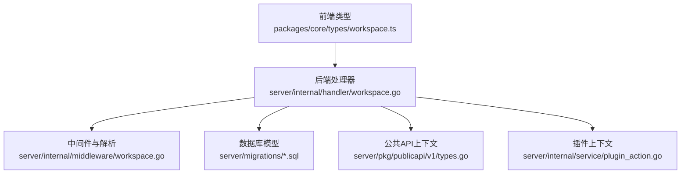
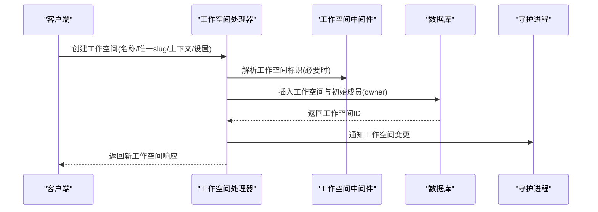
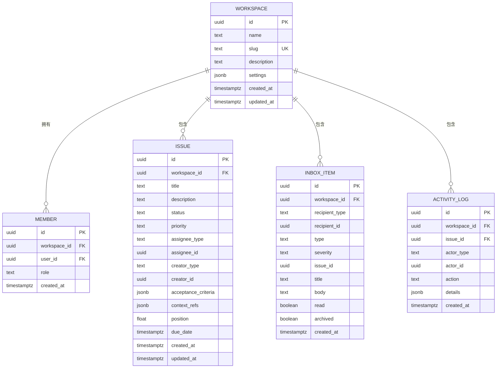
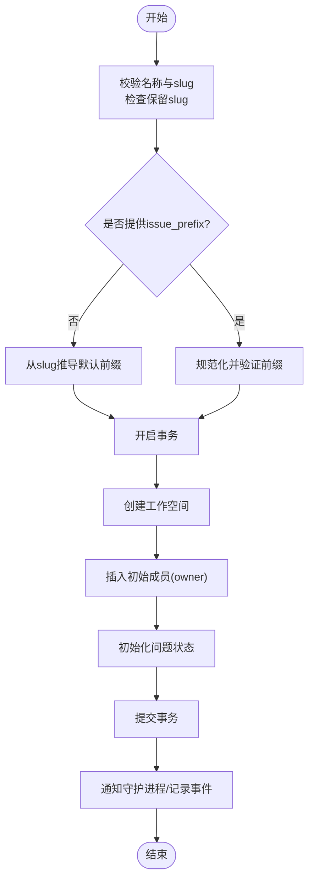
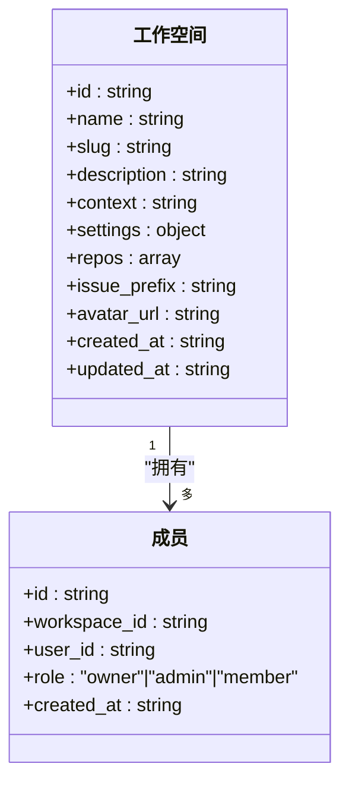
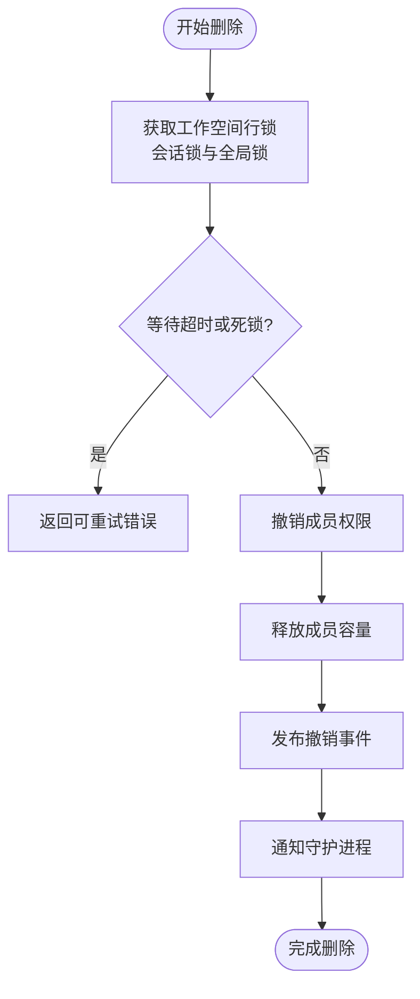
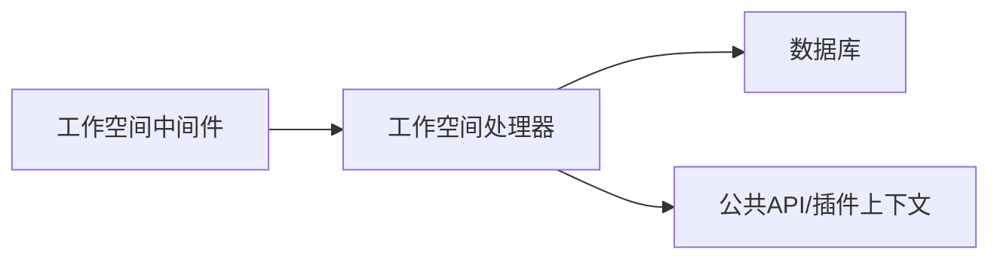

# 工作空间概念

<cite>
**本文引用的文件**
- [packages/core/types/workspace.ts](file://packages/core/types/workspace.ts)
- [server/internal/handler/workspace.go](file://server/internal/handler/workspace.go)
- [server/internal/middleware/workspace.go](file://server/internal/middleware/workspace.go)
- [server/pkg/publicapi/v1/types.go](file://server/pkg/publicapi/v1/types.go)
- [server/internal/service/plugin_action.go](file://server/internal/service/plugin_action.go)
- [server/migrations/001_init.up.sql](file://server/migrations/001_init.up.sql)
- [server/migrations/041_workspace_invitation.up.sql](file://server/migrations/041_workspace_invitation.up.sql)
</cite>

## 目录
1. [简介](#简介)
2. [项目结构](#项目结构)
3. [核心组件](#核心组件)
4. [架构总览](#架构总览)
5. [详细组件分析](#详细组件分析)
6. [依赖分析](#依赖分析)
7. [性能考虑](#性能考虑)
8. [故障排查指南](#故障排查指南)
9. [结论](#结论)
10. [附录](#附录)

## 简介
工作空间是 Multica 中团队协作的自包含范围。所有工作、配置与资源都在工作空间内进行隔离，包括成员、权限、仓库引用、智能体、任务与共享上下文等。通过工作空间，团队可以安全地组织协作、分配任务并共享资源，同时保持与其他团队的完全隔离。

本文件面向两类读者：
- 初学者：理解工作空间的基本用途、创建与管理方式，以及如何在其中组织团队与协作开发。
- 管理员：掌握工作空间的配置项、成员与权限控制、资源共享机制、删除与清理流程，以及与守护进程（daemon）和插件系统的集成点。

## 项目结构
围绕“工作空间”的核心代码分布在以下位置：
- 前端类型定义：packages/core/types/workspace.ts
- 后端处理器：server/internal/handler/workspace.go
- 中间件与请求解析：server/internal/middleware/workspace.go
- 公共 API 上下文：server/pkg/publicapi/v1/types.go
- 插件上下文：server/internal/service/plugin_action.go
- 数据库迁移：server/migrations/001_init.up.sql、server/migrations/041_workspace_invitation.up.sql

图表来源
- [packages/core/types/workspace.ts:8-20](file://packages/core/types/workspace.ts#L8-L20)
- [server/internal/handler/workspace.go:159-320](file://server/internal/handler/workspace.go#L159-L320)
- [server/internal/middleware/workspace.go:47-163](file://server/internal/middleware/workspace.go#L47-L163)
- [server/migrations/001_init.up.sql:15-33](file://server/migrations/001_init.up.sql#L15-L33)
- [server/pkg/publicapi/v1/types.go:5-18](file://server/pkg/publicapi/v1/types.go#L5-L18)
- [server/internal/service/plugin_action.go:104-122](file://server/internal/service/plugin_action.go#L104-L122)

章节来源
- [packages/core/types/workspace.ts:8-20](file://packages/core/types/workspace.ts#L8-L20)
- [server/internal/handler/workspace.go:159-320](file://server/internal/handler/workspace.go#L159-L320)
- [server/internal/middleware/workspace.go:47-163](file://server/internal/middleware/workspace.go#L47-L163)
- [server/migrations/001_init.up.sql:15-33](file://server/migrations/001_init.up.sql#L15-L33)
- [server/pkg/publicapi/v1/types.go:5-18](file://server/pkg/publicapi/v1/types.go#L5-L18)
- [server/internal/service/plugin_action.go:104-122](file://server/internal/service/plugin_action.go#L104-L122)

## 核心组件
- 工作空间实体与工作空间成员：
  - 工作空间包含标识、名称、唯一 slug、描述、上下文、设置、仓库列表、问题前缀、头像与时间戳等字段。
  - 成员记录用户与工作空间的关系及角色（owner/admin/member）。
- 邀请与分享链接：
  - 邀请表支持按邮箱或用户加入工作空间，状态包括待处理、已接受、已拒绝、已过期。
  - 分享链接支持基于角色的访问控制与使用限制。
- 插件与公共 API 上下文：
  - 公共 API 与插件在执行时均携带当前工作空间上下文，确保操作在正确的范围内进行。

章节来源
- [packages/core/types/workspace.ts:8-20](file://packages/core/types/workspace.ts#L8-L20)
- [packages/core/types/workspace.ts:43-49](file://packages/core/types/workspace.ts#L43-L49)
- [packages/core/types/workspace.ts:98-134](file://packages/core/types/workspace.ts#L98-L134)
- [server/migrations/041_workspace_invitation.up.sql:1-21](file://server/migrations/041_workspace_invitation.up.sql#L1-L21)
- [server/pkg/publicapi/v1/types.go:5-18](file://server/pkg/publicapi/v1/types.go#L5-L18)
- [server/internal/service/plugin_action.go:104-122](file://server/internal/service/plugin_action.go#L104-L122)

## 架构总览
工作空间的生命周期由前端发起、后端处理器校验与持久化、中间件保障跨请求的上下文一致性，并通过事件通知守护进程与成员客户端。

图表来源
- [server/internal/handler/workspace.go:202-320](file://server/internal/handler/workspace.go#L202-L320)
- [server/internal/middleware/workspace.go:158-169](file://server/internal/middleware/workspace.go#L158-L169)
- [server/migrations/001_init.up.sql:15-33](file://server/migrations/001_init.up.sql#L15-L33)

章节来源
- [server/internal/handler/workspace.go:202-320](file://server/internal/handler/workspace.go#L202-L320)
- [server/internal/middleware/workspace.go:158-169](file://server/internal/middleware/workspace.go#L158-L169)
- [server/migrations/001_init.up.sql:15-33](file://server/migrations/001_init.up.sql#L15-L33)

## 详细组件分析

### 工作空间数据模型与关系
- 工作空间表包含 id、name、slug、description、settings、created_at、updated_at 等字段；slug 唯一用于路由与识别。
- 成员表维护 user_id 与 workspace_id 的多对一关系，role 限定为 owner/admin/member。
- 问题、标签、评论、收件箱、活动日志等均通过 workspace_id 与工作空间关联，形成以工作空间为中心的领域边界。

图表来源
- [server/migrations/001_init.up.sql:15-178](file://server/migrations/001_init.up.sql#L15-L178)

章节来源
- [server/migrations/001_init.up.sql:15-178](file://server/migrations/001_init.up.sql#L15-L178)

### 工作空间创建流程
- 校验与默认值：
  - 名称与 slug 必填；slug 仅允许小写字母、数字与连字符，且不可为保留词。
  - 问题前缀可自定义；若未提供则根据 slug 推导默认前缀（取非字母数字部分后取前4位并大写）。
- 事务性创建：
  - 在工作空间创建的同时插入初始成员（创建者为 owner），并初始化内置的问题状态。
- 事件与通知：
  - 创建成功后记录分析事件并通知守护进程工作空间变更。

图表来源
- [server/internal/handler/workspace.go:194-320](file://server/internal/handler/workspace.go#L194-L320)

章节来源
- [server/internal/handler/workspace.go:194-320](file://server/internal/handler/workspace.go#L194-L320)

### 工作空间更新与配置
- 可更新字段：名称、描述、上下文、设置（JSONB）、仓库列表、问题前缀、头像 URL。
- 仓库列表校验：
  - 必须为数组，每项包含 url 与可选 description；url 需为有效的 http(s) 或 ssh git 地址；去重并标准化。
- 实时同步：
  - 更新名称或设置会广播事件并通知所有成员的工作空间变更，以便守护进程刷新缓存。

章节来源
- [server/internal/handler/workspace.go:322-465](file://server/internal/handler/workspace.go#L322-L465)

### 成员管理与权限控制
- 成员角色：owner、admin、member。
- 成员管理：
  - 列出成员、带用户信息的成员列表、更新角色、删除成员、离开工作空间。
- 权限规则：
  - 修改或删除 owner 需要至少保留一个 owner。
  - 涉及 owner 的操作必须由 owner 执行。
- 上下文注入：
  - 中间件将工作空间 ID 与成员信息注入请求上下文，供后续处理器使用。

图表来源
- [packages/core/types/workspace.ts:8-20](file://packages/core/types/workspace.ts#L8-L20)
- [packages/core/types/workspace.ts:43-49](file://packages/core/types/workspace.ts#L43-L49)
- [server/migrations/001_init.up.sql:15-33](file://server/migrations/001_init.up.sql#L15-L33)

章节来源
- [server/internal/handler/workspace.go:467-744](file://server/internal/handler/workspace.go#L467-L744)
- [server/internal/middleware/workspace.go:21-40](file://server/internal/middleware/workspace.go#L21-L40)

### 邀请系统与加入流程
- 邀请表：
  - 记录邀请人、受邀者邮箱/用户、角色、状态与过期时间。
  - 唯一索引保证同一工作空间+邮箱在同一时间只有一个待处理邀请。
- 加入工作空间：
  - 受邀者接受邀请后成为成员；系统会写入成员记录并触发相应事件。

章节来源
- [server/migrations/041_workspace_invitation.up.sql:1-21](file://server/migrations/041_workspace_invitation.up.sql#L1-L21)

### 资源共享机制
- 仓库引用：
  - 工作空间可配置多个仓库，作为团队共享的代码库集合；每个仓库包含 url 与描述。
- 上下文与设置：
  - 工作空间上下文（context）与设置（settings）可在团队内共享，影响智能体行为与界面展示。
- 插件与公共 API 上下文：
  - 插件与公共 API 在执行时携带工作空间上下文，确保资源访问与作用域正确。

章节来源
- [packages/core/types/workspace.ts:3-6](file://packages/core/types/workspace.ts#L3-L6)
- [packages/core/types/workspace.ts:8-20](file://packages/core/types/workspace.ts#L8-L20)
- [server/pkg/publicapi/v1/types.go:5-18](file://server/pkg/publicapi/v1/types.go#L5-L18)
- [server/internal/service/plugin_action.go:104-122](file://server/internal/service/plugin_action.go#L104-L122)

### 工作空间删除与清理
- 删除锁与超时：
  - 删除过程持有工作空间行级锁、会话行级锁与全局咨询锁；为避免长时间阻塞，设置删除锁超时。
- 重试策略：
  - 针对锁不可用或死锁错误，返回可重试状态码，使前端能友好提示并重试。
- 清理步骤：
  - 撤销成员权限、释放容量、发布撤销事件、通知守护进程。

图表来源
- [server/internal/handler/workspace.go:746-800](file://server/internal/handler/workspace.go#L746-L800)

章节来源
- [server/internal/handler/workspace.go:746-800](file://server/internal/handler/workspace.go#L746-L800)

### 实际示例：在工作空间中组织团队、分配任务与协作开发
- 创建团队工作空间：
  - 为新团队创建一个工作空间，设置名称、唯一 slug、描述与上下文，并指定问题前缀。
- 邀请成员：
  - 向团队成员发送邀请，设定角色（admin/member），成员接受后加入工作空间。
- 配置共享仓库：
  - 在工作空间设置中添加团队共享的 Git 仓库，便于智能体与开发者协作。
- 分配任务：
  - 在工作空间内创建问题（Issue），指派给成员或智能体，跟踪进度与状态。
- 协作开发：
  - 成员在各自的任务上下文中工作，智能体在守护进程中执行任务，结果反馈到工作空间。

章节来源
- [server/internal/handler/workspace.go:194-320](file://server/internal/handler/workspace.go#L194-L320)
- [server/migrations/041_workspace_invitation.up.sql:1-21](file://server/migrations/041_workspace_invitation.up.sql#L1-L21)
- [packages/core/types/workspace.ts:3-6](file://packages/core/types/workspace.ts#L3-L6)

## 依赖分析
- 中间件依赖：
  - 工作空间中间件负责解析工作空间标识（优先 slug，其次 UUID），校验成员身份与角色，并将上下文注入请求。
- 处理器依赖：
  - 工作空间处理器依赖数据库查询与事务启动器，完成工作空间的 CRUD 与成员管理。
- 上下文依赖：
  - 公共 API 与插件在执行时依赖工作空间上下文，确保作用域正确。

图表来源
- [server/internal/middleware/workspace.go:47-163](file://server/internal/middleware/workspace.go#L47-L163)
- [server/internal/handler/workspace.go:159-320](file://server/internal/handler/workspace.go#L159-L320)
- [server/pkg/publicapi/v1/types.go:5-18](file://server/pkg/publicapi/v1/types.go#L5-L18)
- [server/internal/service/plugin_action.go:104-122](file://server/internal/service/plugin_action.go#L104-L122)

章节来源
- [server/internal/middleware/workspace.go:47-163](file://server/internal/middleware/workspace.go#L47-L163)
- [server/internal/handler/workspace.go:159-320](file://server/internal/handler/workspace.go#L159-L320)
- [server/pkg/publicapi/v1/types.go:5-18](file://server/pkg/publicapi/v1/types.go#L5-L18)
- [server/internal/service/plugin_action.go:104-122](file://server/internal/service/plugin_action.go#L104-L122)

## 性能考虑
- 删除操作的锁竞争：
  - 删除工作空间可能因全局咨询锁与行级锁竞争而阻塞；通过设置删除锁超时避免无限等待。
- 事件与通知：
  - 工作空间更新会广播事件并通知守护进程，注意在高并发场景下的消息队列压力。
- 仓库列表校验：
  - 批量更新仓库时需进行去重与格式校验，避免无效数据入库。

章节来源
- [server/internal/handler/workspace.go:746-800](file://server/internal/handler/workspace.go#L746-L800)
- [server/internal/handler/workspace.go:337-371](file://server/internal/handler/workspace.go#L337-L371)

## 故障排查指南
- 无法创建工作空间：
  - 检查名称与 slug 是否为空或不符合规范；确认 slug 未被保留；查看实例是否禁用工作空间创建。
- 无法更新工作空间：
  - 检查请求体格式；确认仓库 URL 有效；确认问题前缀符合规则。
- 成员管理失败：
  - 检查角色是否合法；确认不会移除最后一个 owner；确认请求者具有足够权限。
- 删除工作空间卡住：
  - 关注锁超时与死锁错误；前端应提示重试；检查后台是否有长时间运行的批处理任务占用全局锁。

章节来源
- [server/internal/handler/workspace.go:202-320](file://server/internal/handler/workspace.go#L202-L320)
- [server/internal/handler/workspace.go:322-465](file://server/internal/handler/workspace.go#L322-L465)
- [server/internal/handler/workspace.go:565-744](file://server/internal/handler/workspace.go#L565-L744)
- [server/internal/handler/workspace.go:746-800](file://server/internal/handler/workspace.go#L746-L800)

## 结论
工作空间是 Multica 团队协作的基石，提供了自包含的范围隔离、灵活的配置与强大的成员权限控制。通过清晰的创建、更新、成员管理与删除流程，结合守护进程与插件上下文，工作空间确保了团队在安全、可控的环境中高效协作。遵循最佳实践（如合理命名 slug、谨慎管理 owner、定期清理仓库引用）可进一步提升稳定性与可维护性。

## 附录
- 工作空间层级与继承：
  - 当前实现以单一工作空间为单位进行隔离，未实现层级结构与继承；如需扩展，可在应用层通过分组与模板化配置模拟。
- 最佳实践建议：
  - 使用有意义的 slug 与问题前缀，便于追踪与检索。
  - 严格控制 owner 数量，避免权限集中。
  - 定期审查工作空间设置与仓库引用，确保配置整洁与安全。
  - 在删除工作空间前，确认无活跃任务与依赖，减少锁竞争。

章节来源
- [server/internal/handler/workspace.go:194-320](file://server/internal/handler/workspace.go#L194-L320)
- [server/internal/handler/workspace.go:565-744](file://server/internal/handler/workspace.go#L565-L744)
- [server/internal/handler/workspace.go:746-800](file://server/internal/handler/workspace.go#L746-L800)