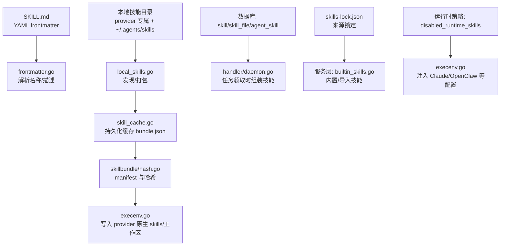
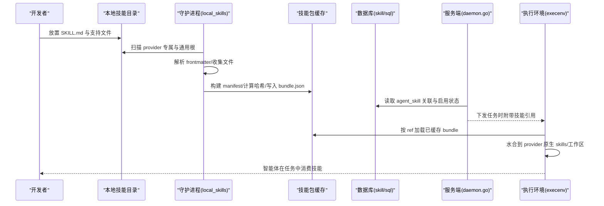
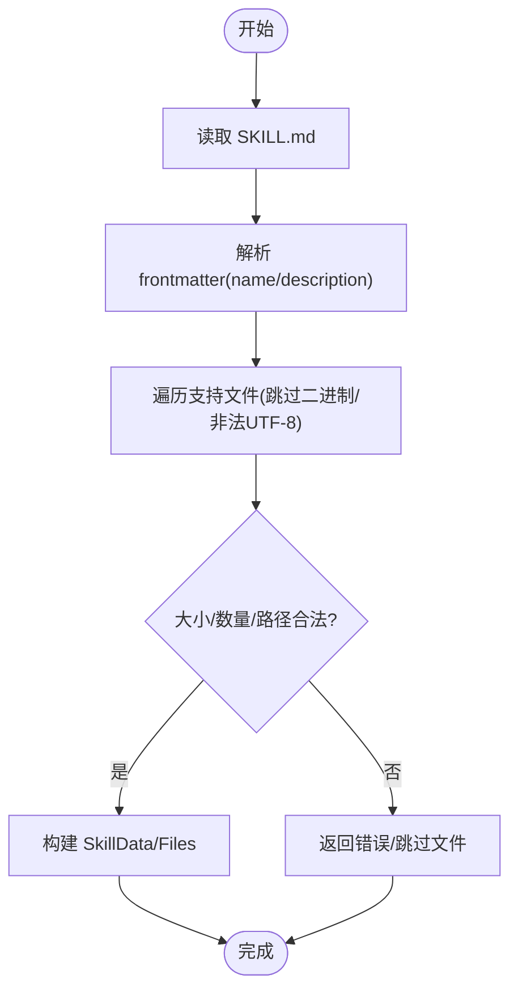
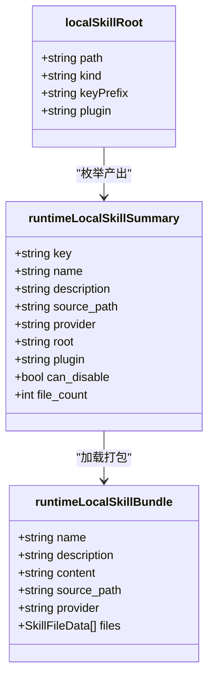
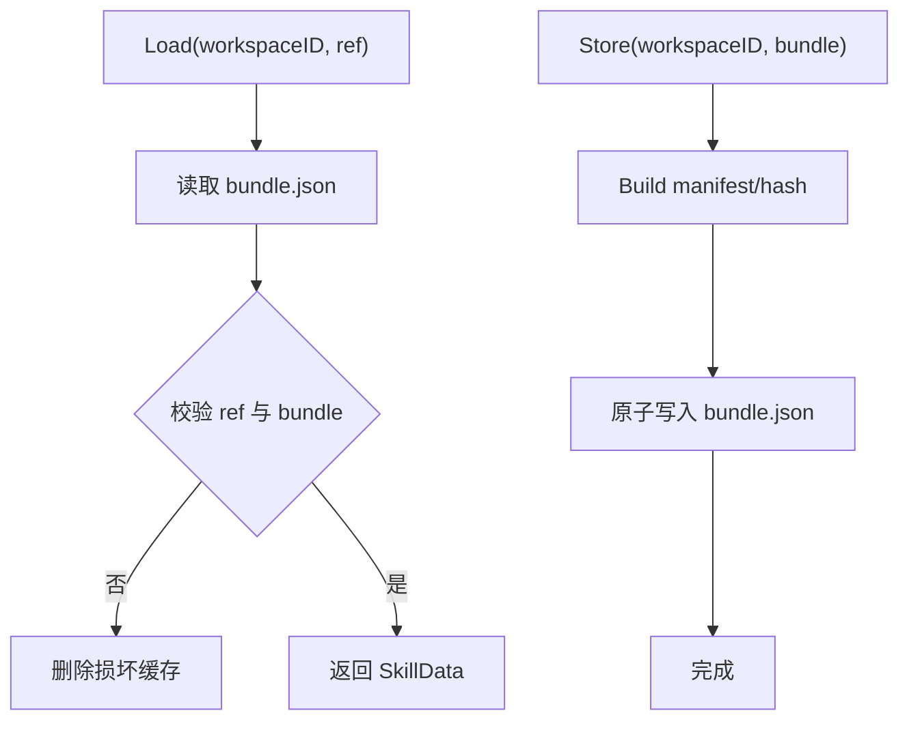
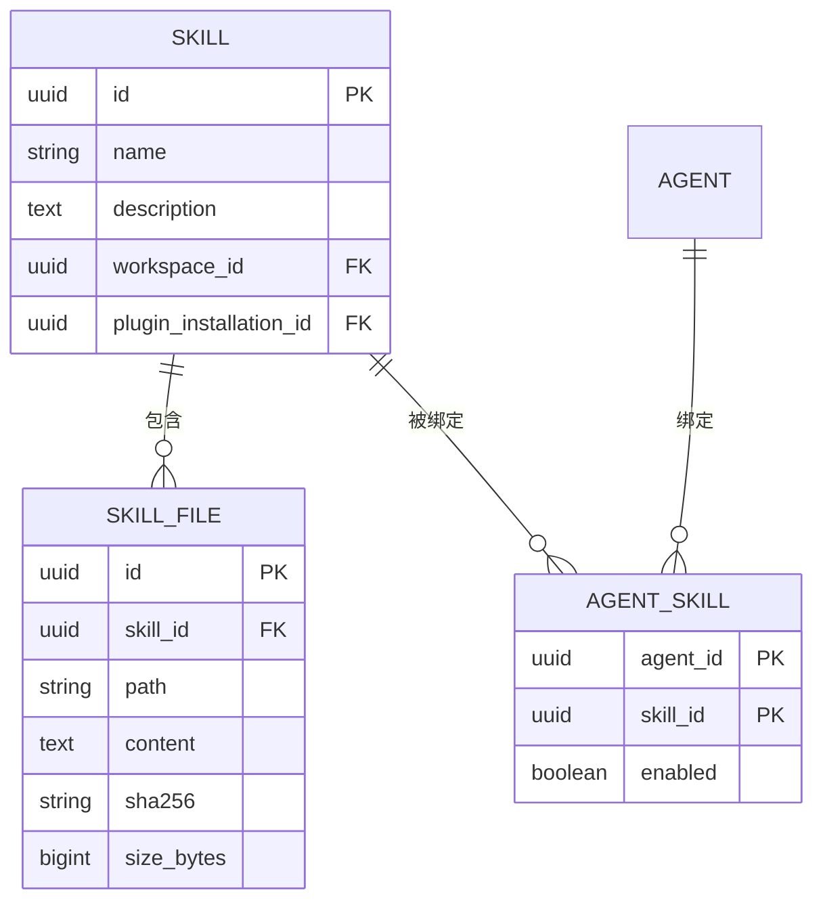
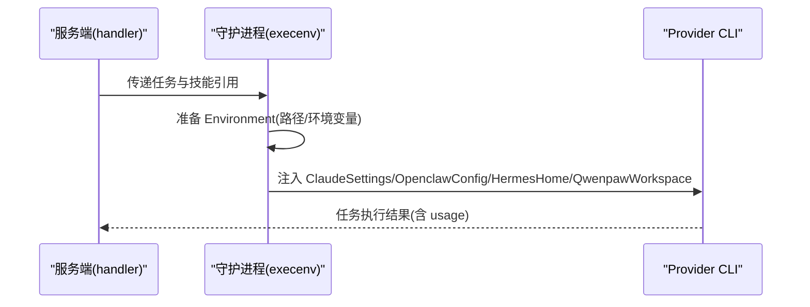
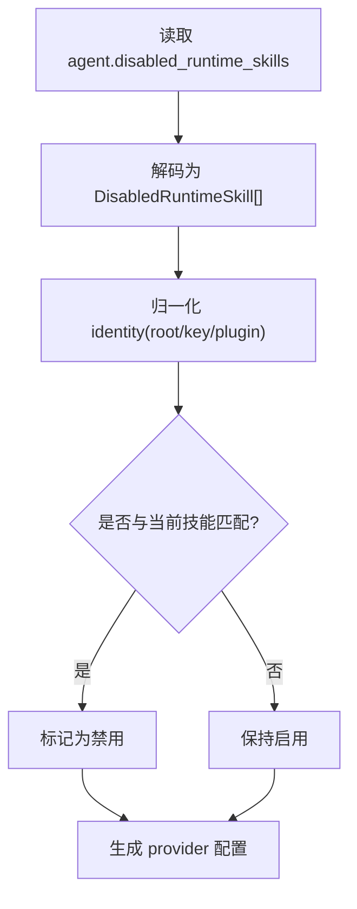
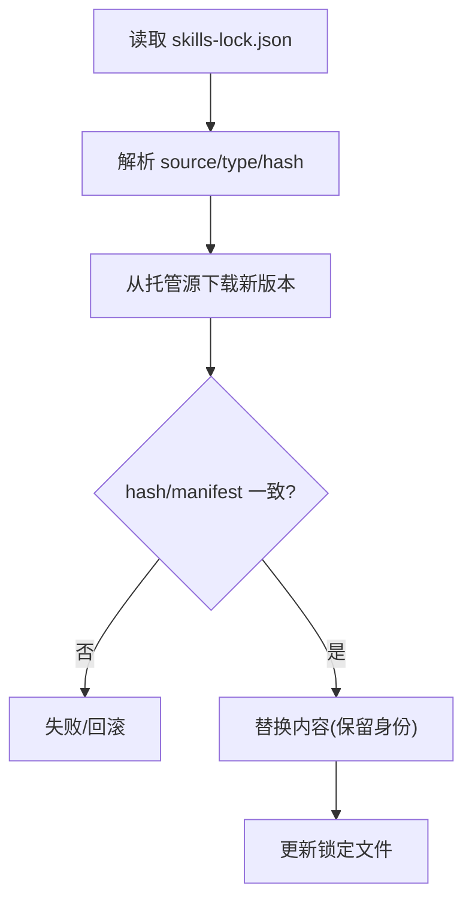
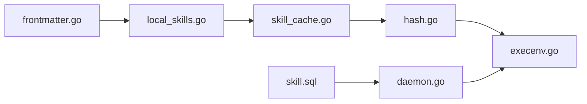

# 技能系统

<cite>
**本文引用的文件**
- [skills-lock.json](file://skills-lock.json)
- [SKILL.md（示例：web-design-guidelines）](file://.agents/skills/web-design-guidelines/SKILL.md)
- [SKILL.md（示例：incident-response）](file://examples/plugins/deploy-sentinel/skills/incident-response/SKILL.md)
- [frontmatter.go](file://server/internal/skill/frontmatter.go)
- [local_skills.go](file://server/internal/daemon/local_skills.go)
- [skill_cache.go](file://server/internal/daemon/skill_cache.go)
- [types.go](file://server/internal/daemon/types.go)
- [execenv.go](file://server/internal/daemon/execenv/execenv.go)
- [hash.go](file://server/pkg/skillbundle/hash.go)
- [bundle.go](file://server/pkg/plugincontract/bundle.go)
- [agent_runtime_skills.go](file://server/internal/handler/agent_runtime_skills.go)
- [daemon.go](file://server/internal/handler/daemon.go)
- [skill.sql](file://server/pkg/db/queries/skill.sql)
- [206_agent_disabled_runtime_skills.up.sql](file://server/migrations/206_agent_disabled_runtime_skills.up.sql)
- [161_agent_skill_enabled.up.sql](file://server/migrations/161_agent_skill_enabled.up.sql)
- [builtin_skills.go](file://server/internal/service/builtin_skills.go)
- [SKILL.md（内置：multica-onboarding）](file://server/internal/service/builtin_skills/multica-onboarding/SKILL.md)
- [skills.mdx](file://apps/docs/content/docs/skills.mdx)
- [skills.zh.mdx](file://apps/docs/content/docs/skills.zh.mdx)
</cite>

## 目录
1. [简介](#简介)
2. [项目结构](#项目结构)
3. [核心组件](#核心组件)
4. [架构总览](#架构总览)
5. [详细组件分析](#详细组件分析)
6. [依赖关系分析](#依赖关系分析)
7. [性能考量](#性能考量)
8. [故障排查指南](#故障排查指南)
9. [结论](#结论)
10. [附录](#附录)

## 简介
本文件系统性阐述 Multica 的“技能”机制：技能是可复用的能力包，描述一种工作方式，可被多个智能体复用。通过技能的创建、管理、分发与执行环境装配，智能体可在任务执行时获得稳定的上下文与工具调用能力。文档覆盖技能类型、格式规范、版本管理、依赖解析、执行环境配置、最佳实践以及开发测试部署流程，帮助开发者理解概念并为技能作者提供实操指南。

## 项目结构
技能系统贯穿服务端、守护进程与前端文档：
- 技能定义与元数据：SKILL.md 及其 YAML frontmatter；技能清单与锁定文件 skills-lock.json。
- 本地技能发现与打包：守护进程扫描运行时 provider 专属目录与通用 ~/.agents/skills，生成技能包并缓存。
- 技能包哈希与校验：基于 skillbundle 构建 manifest 并计算哈希，用于版本一致性与缓存命中。
- 数据库模型与关联：skill、skill_file、agent_skill、标签等表及查询。
- 执行环境装配：将技能水合到各 provider 原生 skills 目录或工作区，注入 brief/prompt。
- 运行时策略：支持按 agent/runtime 禁用特定运行时技能。
- 文档与更新：用户可通过 UI/CLI 刷新导入的技能，保留身份但替换内容。

图表来源
- [frontmatter.go:17-48](file://server/internal/skill/frontmatter.go#L17-L48)
- [local_skills.go:125-271](file://server/internal/daemon/local_skills.go#L125-L271)
- [skill_cache.go:34-91](file://server/internal/daemon/skill_cache.go#L34-L91)
- [hash.go:43-79](file://server/pkg/skillbundle/hash.go#L43-L79)
- [execenv.go:254-346](file://server/internal/daemon/execenv/execenv.go#L254-L346)
- [skill.sql:47-170](file://server/pkg/db/queries/skill.sql#L47-L170)
- [daemon.go:2109-2140](file://server/internal/handler/daemon.go#L2109-L2140)
- [skills-lock.json:1-27](file://skills-lock.json#L1-L27)
- [builtin_skills.go:1-200](file://server/internal/service/builtin_skills.go#L1-L200)

章节来源
- [skills-lock.json:1-27](file://skills-lock.json#L1-L27)
- [frontmatter.go:17-48](file://server/internal/skill/frontmatter.go#L17-L48)
- [local_skills.go:125-271](file://server/internal/daemon/local_skills.go#L125-L271)
- [skill_cache.go:34-91](file://server/internal/daemon/skill_cache.go#L34-L91)
- [hash.go:43-79](file://server/pkg/skillbundle/hash.go#L43-L79)
- [execenv.go:254-346](file://server/internal/daemon/execenv/execenv.go#L254-L346)
- [skill.sql:47-170](file://server/pkg/db/queries/skill.sql#L47-L170)
- [daemon.go:2109-2140](file://server/internal/handler/daemon.go#L2109-L2140)
- [builtin_skills.go:1-200](file://server/internal/service/builtin_skills.go#L1-L200)

## 核心组件
- 技能定义与元数据
  - SKILL.md 主文件，包含 YAML frontmatter（name、description、可选 metadata）。
  - 支持前端的 TS 解析器与后端 Go 解析保持一致，确保跨端一致性。
- 本地技能发现与打包
  - 按 provider 专属目录与通用 ~/.agents/skills 两级根扫描，支持嵌套布局与插件命名空间。
  - 限制文件大小、总数与深度，跳过二进制与非法 UTF-8/NUL 文件。
- 技能包缓存与校验
  - 以 workspace/source/id/hash 为键持久化 bundle.json，带原子写入与并发锁。
  - 通过 skillbundle.BuildManifest 计算 manifest 哈希，校验内容与引用一致性。
- 数据库与关联
  - skill、skill_file、agent_skill 三表；支持启用/禁用、批量加载、按工作区过滤。
  - 支持标签体系与插件归属字段。
- 执行环境装配
  - 将技能水合到 provider 原生 skills 目录或工作区，注入 brief/prompt。
  - 针对 Claude、OpenClaw、Hermes、QwenPaw 等 provider 提供专用路径与环境变量。
- 运行时策略
  - 支持在 agent 上记录禁用的运行时技能列表，避免敏感或冲突技能生效。
- 版本管理与更新
  - skills-lock.json 锁定来源与 computedHash；支持从托管源刷新，保留身份但替换内容。

章节来源
- [frontmatter.go:17-48](file://server/internal/skill/frontmatter.go#L17-L48)
- [local_skills.go:18-30](file://server/internal/daemon/local_skills.go#L18-L30)
- [local_skills.go:330-454](file://server/internal/daemon/local_skills.go#L330-L454)
- [skill_cache.go:34-91](file://server/internal/daemon/skill_cache.go#L34-L91)
- [skill_cache.go:126-155](file://server/internal/daemon/skill_cache.go#L126-L155)
- [hash.go:43-79](file://server/pkg/skillbundle/hash.go#L43-L79)
- [skill.sql:47-170](file://server/pkg/db/queries/skill.sql#L47-L170)
- [execenv.go:254-346](file://server/internal/daemon/execenv/execenv.go#L254-L346)
- [206_agent_disabled_runtime_skills.up.sql:1-2](file://server/migrations/206_agent_disabled_runtime_skills.up.sql#L1-L2)
- [skills.mdx:41-57](file://apps/docs/content/docs/skills.mdx#L41-L57)
- [skills.zh.mdx:45-57](file://apps/docs/content/docs/skills.zh.mdx#L45-L57)

## 架构总览
技能系统由“定义—发现—打包—缓存—装配—执行”构成闭环：
- 定义：SKILL.md + 支持文件；frontmatter 提供 name/description。
- 发现：守护进程按 provider 规则扫描本地目录，识别有效技能。
- 打包：收集文件、构建 manifest、计算哈希，形成 SkillData。
- 缓存：按 workspace/source/id/hash 持久化 bundle.json，支持并发访问。
- 装配：根据 provider 特性将技能写入对应目录或环境变量，注入 prompt。
- 执行：任务领取时，服务端组装技能列表，守护进程准备执行环境并运行。

图表来源
- [local_skills.go:125-271](file://server/internal/daemon/local_skills.go#L125-L271)
- [local_skills.go:330-454](file://server/internal/daemon/local_skills.go#L330-L454)
- [skill_cache.go:34-91](file://server/internal/daemon/skill_cache.go#L34-L91)
- [hash.go:43-79](file://server/pkg/skillbundle/hash.go#L43-L79)
- [skill.sql:47-170](file://server/pkg/db/queries/skill.sql#L47-L170)
- [daemon.go:2109-2140](file://server/internal/handler/daemon.go#L2109-L2140)
- [execenv.go:254-346](file://server/internal/daemon/execenv/execenv.go#L254-L346)

## 详细组件分析

### 技能定义与格式规范
- 主文件：每个技能必须包含 SKILL.md，作为入口与指令。
- Frontmatter：YAML 块声明 name、description，可选 metadata（如 author、version、argument-hint）。
- 支持文件：可附加参考文档、模板、脚本等，与主文件一起提供给智能体。
- 约束：
  - 单文件最大大小与包总量限制，防止滥用。
  - 仅允许文本且无 NUL 字节，保证 JSON 传输安全。
  - 路径规范化与安全校验，禁止目录穿越与非法字符。

图表来源
- [frontmatter.go:17-48](file://server/internal/skill/frontmatter.go#L17-L48)
- [local_skills.go:330-454](file://server/internal/daemon/local_skills.go#L330-L454)

章节来源
- [frontmatter.go:17-48](file://server/internal/skill/frontmatter.go#L17-L48)
- [local_skills.go:330-454](file://server/internal/daemon/local_skills.go#L330-L454)
- [SKILL.md（示例：web-design-guidelines）:1-40](file://.agents/skills/web-design-guidelines/SKILL.md#L1-L40)
- [SKILL.md（示例：incident-response）:1-60](file://examples/plugins/deploy-sentinel/skills/incident-response/SKILL.md#L1-L60)

### 本地技能发现与打包
- 多根扫描：优先 provider 专属目录，其次通用 ~/.agents/skills；支持插件命名空间前缀。
- 嵌套布局：支持多级目录下的 SKILL.md，递归发现但遇到有效技能即停止该分支。
- 去重与排序：按 Key 去重，稳定排序；同一 Key 高优先级根胜出。
- 安全与限制：限制文件数、包大小、目录深度；跳过忽略项与二进制。

图表来源
- [local_skills.go:62-87](file://server/internal/daemon/local_skills.go#L62-L87)
- [local_skills.go:32-60](file://server/internal/daemon/local_skills.go#L32-L60)
- [local_skills.go:456-513](file://server/internal/daemon/local_skills.go#L456-L513)
- [local_skills.go:613-704](file://server/internal/daemon/local_skills.go#L613-L704)

章节来源
- [local_skills.go:125-271](file://server/internal/daemon/local_skills.go#L125-L271)
- [local_skills.go:456-513](file://server/internal/daemon/local_skills.go#L456-L513)
- [local_skills.go:613-704](file://server/internal/daemon/local_skills.go#L613-L704)

### 技能包缓存与版本哈希
- 缓存结构：workspace/source/id/hash → bundle.json；原子写入与并发锁保护。
- Manifest 构建：对 skill 与 files 排序后计算 SHA256，得到唯一 hash；同时统计 size/fileCount。
- 校验：加载时比对 ID/Source/Hash/FileCount/SizeBytes，不一致则丢弃缓存。
- 安全路径：文件路径需安全，禁止目录穿越与非法字符。

图表来源
- [skill_cache.go:34-91](file://server/internal/daemon/skill_cache.go#L34-L91)
- [skill_cache.go:126-155](file://server/internal/daemon/skill_cache.go#L126-L155)
- [hash.go:43-79](file://server/pkg/skillbundle/hash.go#L43-L79)

章节来源
- [skill_cache.go:34-91](file://server/internal/daemon/skill_cache.go#L34-L91)
- [skill_cache.go:126-155](file://server/internal/daemon/skill_cache.go#L126-L155)
- [hash.go:43-79](file://server/pkg/skillbundle/hash.go#L43-L79)

### 数据库模型与智能体绑定
- 表结构：
  - skill：技能元数据与归属（含插件归属字段）。
  - skill_file：技能支持文件（path、content、sha256、size）。
  - agent_skill：智能体与技能的绑定关系，支持 enabled 开关。
- 查询能力：
  - 批量加载技能文件，减少热路径往返。
  - 按工作区列出智能体启用的技能。
  - 添加/启用/移除技能绑定。
- 迁移演进：
  - 引入 agent_skill.enabled 字段。
  - 新增 agent.disabled_runtime_skills JSONB 列，用于运行时禁用策略。

图表来源
- [skill.sql:47-170](file://server/pkg/db/queries/skill.sql#L47-L170)
- [161_agent_skill_enabled.up.sql:1-2](file://server/migrations/161_agent_skill_enabled.up.sql#L1-L2)
- [206_agent_disabled_runtime_skills.up.sql:1-2](file://server/migrations/206_agent_disabled_runtime_skills.up.sql#L1-L2)

章节来源
- [skill.sql:47-170](file://server/pkg/db/queries/skill.sql#L47-L170)
- [161_agent_skill_enabled.up.sql:1-2](file://server/migrations/161_agent_skill_enabled.up.sql#L1-L2)
- [206_agent_disabled_runtime_skills.up.sql:1-2](file://server/migrations/206_agent_disabled_runtime_skills.up.sql#L1-L2)

### 执行环境装配与 Provider 适配
- 环境对象：Environment 包含 RootDir、WorkDir、MulticaConfigRoot、ClaudeSettingsPath、OpenclawConfigPath、HermesHome、QwenpawWorkspace 等。
- 技能注入：
  - 将技能水合到 provider 原生 skills 目录或工作区。
  - 为不同 provider 设置环境变量与配置文件，使其能发现并使用技能。
- 运行时策略：
  - 通过 agent.disabled_runtime_skills 控制运行时禁用技能，避免冲突或敏感操作。

图表来源
- [execenv.go:254-346](file://server/internal/daemon/execenv/execenv.go#L254-L346)
- [daemon.go:2109-2140](file://server/internal/handler/daemon.go#L2109-L2140)

章节来源
- [execenv.go:254-346](file://server/internal/daemon/execenv/execenv.go#L254-L346)
- [daemon.go:2109-2140](file://server/internal/handler/daemon.go#L2109-L2140)

### 运行时技能禁用策略
- 存储：agent.disabled_runtime_skills 为 JSONB 数组，记录禁用的运行时技能标识。
- 处理：服务端解码并归一化 identity，比较是否重复；UI 可切换启用/禁用。
- 作用：在执行环境装配阶段，依据策略生成 provider 配置，阻止特定技能生效。

图表来源
- [agent_runtime_skills.go:22-84](file://server/internal/handler/agent_runtime_skills.go#L22-L84)
- [206_agent_disabled_runtime_skills.up.sql:1-2](file://server/migrations/206_agent_disabled_runtime_skills.up.sql#L1-L2)

章节来源
- [agent_runtime_skills.go:22-84](file://server/internal/handler/agent_runtime_skills.go#L22-L84)
- [206_agent_disabled_runtime_skills.up.sql:1-2](file://server/migrations/206_agent_disabled_runtime_skills.up.sql#L1-L2)

### 版本管理与依赖解析
- 锁定文件：skills-lock.json 维护 skills 映射，包含 source、sourceType、computedHash，必要时指定 skillPath。
- 刷新机制：支持从托管源重新下载并替换内容，保留身份（分配、标签、创建者、创建时间）。
- 依赖解析：通过 manifest 与 hash 保证内容一致性；支持批量刷新与选择性更新。

图表来源
- [skills-lock.json:1-27](file://skills-lock.json#L1-L27)
- [skills.mdx:41-57](file://apps/docs/content/docs/skills.mdx#L41-L57)
- [skills.zh.mdx:45-57](file://apps/docs/content/docs/skills.zh.mdx#L45-L57)
- [hash.go:43-79](file://server/pkg/skillbundle/hash.go#L43-L79)

章节来源
- [skills-lock.json:1-27](file://skills-lock.json#L1-L27)
- [skills.mdx:41-57](file://apps/docs/content/docs/skills.mdx#L41-L57)
- [skills.zh.mdx:45-57](file://apps/docs/content/docs/skills.zh.mdx#L45-L57)
- [hash.go:43-79](file://server/pkg/skillbundle/hash.go#L43-L79)

### 实际示例：开发与部署自定义技能
- 开发步骤：
  - 在工作区或 ~/.agents/skills 下创建技能目录，编写 SKILL.md 与支持文件。
  - 使用 frontmatter 明确 name/description，必要时添加 metadata。
  - 通过守护进程扫描验证发现与打包结果。
- 测试方法：
  - 在本地任务中触发技能执行，观察 prompt 注入与 provider 行为。
  - 检查缓存命中与 manifest 哈希一致性。
- 部署方式：
  - 将技能发布到托管源，并在 skills-lock.json 中锁定版本。
  - 通过 UI/CLI 刷新技能，保留身份但替换内容。
  - 为智能体绑定技能并启用，验证执行效果。

章节来源
- [SKILL.md（示例：web-design-guidelines）:1-40](file://.agents/skills/web-design-guidelines/SKILL.md#L1-L40)
- [SKILL.md（示例：incident-response）:1-60](file://examples/plugins/deploy-sentinel/skills/incident-response/SKILL.md#L1-L60)
- [skills.mdx:41-57](file://apps/docs/content/docs/skills.mdx#L41-L57)
- [skills.zh.mdx:45-57](file://apps/docs/content/docs/skills.zh.mdx#L45-L57)

## 依赖关系分析
- 组件耦合：
  - local_skills.go 依赖 frontmatter.go 解析元数据，输出 SkillData。
  - skill_cache.go 依赖 hash.go 构建 manifest 并校验。
  - execenv.go 依赖 provider 约定路径与环境变量进行装配。
  - handler/daemon.go 负责任务领取时的技能组装与下发。
  - 数据库查询 skill.sql 提供 CRUD 与批量加载。
- 外部依赖：
  - 各 provider 的 CLI 与配置目录约定（Claude、OpenClaw、Hermes、QwenPaw 等）。
  - 托管源（GitHub、Skills.sh 等）用于技能刷新。

图表来源
- [frontmatter.go:17-48](file://server/internal/skill/frontmatter.go#L17-L48)
- [local_skills.go:125-271](file://server/internal/daemon/local_skills.go#L125-L271)
- [skill_cache.go:34-91](file://server/internal/daemon/skill_cache.go#L34-L91)
- [hash.go:43-79](file://server/pkg/skillbundle/hash.go#L43-L79)
- [execenv.go:254-346](file://server/internal/daemon/execenv/execenv.go#L254-L346)
- [skill.sql:47-170](file://server/pkg/db/queries/skill.sql#L47-L170)
- [daemon.go:2109-2140](file://server/internal/handler/daemon.go#L2109-L2140)

章节来源
- [frontmatter.go:17-48](file://server/internal/skill/frontmatter.go#L17-L48)
- [local_skills.go:125-271](file://server/internal/daemon/local_skills.go#L125-L271)
- [skill_cache.go:34-91](file://server/internal/daemon/skill_cache.go#L34-L91)
- [hash.go:43-79](file://server/pkg/skillbundle/hash.go#L43-L79)
- [execenv.go:254-346](file://server/internal/daemon/execenv/execenv.go#L254-L346)
- [skill.sql:47-170](file://server/pkg/db/queries/skill.sql#L47-L170)
- [daemon.go:2109-2140](file://server/internal/handler/daemon.go#L2109-L2140)

## 性能考量
- 批量加载：使用 ListSkillFilesBySkillIDs 一次性加载多个技能文件，减少热路径往返。
- 缓存命中：通过 manifest 哈希快速判断缓存有效性，避免重复计算与 I/O。
- 限制与裁剪：限制文件大小、总数与深度，防止资源耗尽。
- 并发安全：使用互斥锁保护缓存写入与读取，避免竞态条件。
- 路径优化：可读路径段长度受限，减少 Windows 路径成本。

[本节提供一般性指导，无需具体文件分析]

## 故障排查指南
- 技能未生效
  - 检查本地目录结构与 SKILL.md 是否存在。
  - 确认 frontmatter 解析成功，name/description 正确。
  - 查看守护进程日志，确认扫描与打包过程。
- 缓存不一致
  - 清理缓存目录，重新生成 bundle.json。
  - 校验 manifest 哈希与文件内容是否匹配。
- 运行时技能冲突
  - 检查 agent.disabled_runtime_skills 配置，确保目标技能未被禁用。
  - 验证 provider 配置是否正确注入。
- 刷新失败
  - 确认托管源可达，权限正确。
  - 检查 skills-lock.json 中的 source/type/hash 是否有效。

章节来源
- [local_skills.go:330-454](file://server/internal/daemon/local_skills.go#L330-L454)
- [skill_cache.go:34-91](file://server/internal/daemon/skill_cache.go#L34-L91)
- [agent_runtime_skills.go:22-84](file://server/internal/handler/agent_runtime_skills.go#L22-L84)
- [skills.mdx:41-57](file://apps/docs/content/docs/skills.mdx#L41-L57)

## 结论
技能系统是 Multica 扩展智能体能力的核心机制，通过标准化的定义、可靠的发现与打包、严格的版本与缓存管理、以及灵活的执行环境装配，实现了跨 provider 的可复用能力共享。结合数据库模型与运行时策略，团队可以高效地创建、管理与分发技能，提升协作效率与一致性。建议遵循最佳实践，注重文档与测试，确保技能质量与稳定性。

[本节总结性内容，无需具体文件分析]

## 附录
- 内置技能示例：multica-onboarding 展示了产品级引导流程，可作为技能编写的参考。
- 插件技能示例：incident-response 展示了团队协作中的标准操作流程。
- 文档参考：skills.mdx 与 skills.zh.mdx 提供了更新与内容组织指南。

章节来源
- [SKILL.md（内置：multica-onboarding）:1-152](file://server/internal/service/builtin_skills/multica-onboarding/SKILL.md#L1-L152)
- [SKILL.md（示例：incident-response）:1-60](file://examples/plugins/deploy-sentinel/skills/incident-response/SKILL.md#L1-L60)
- [skills.mdx:41-57](file://apps/docs/content/docs/skills.mdx#L41-L57)
- [skills.zh.mdx:45-57](file://apps/docs/content/docs/skills.zh.mdx#L45-L57)