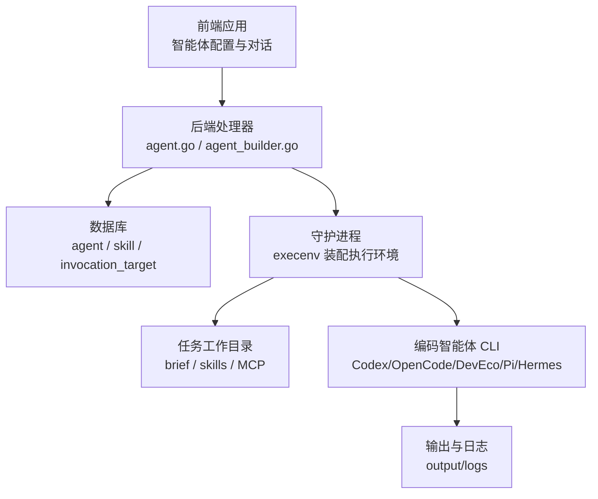
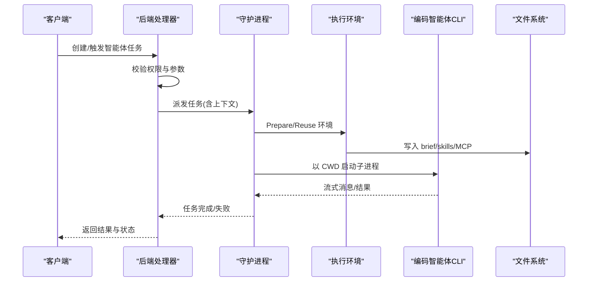
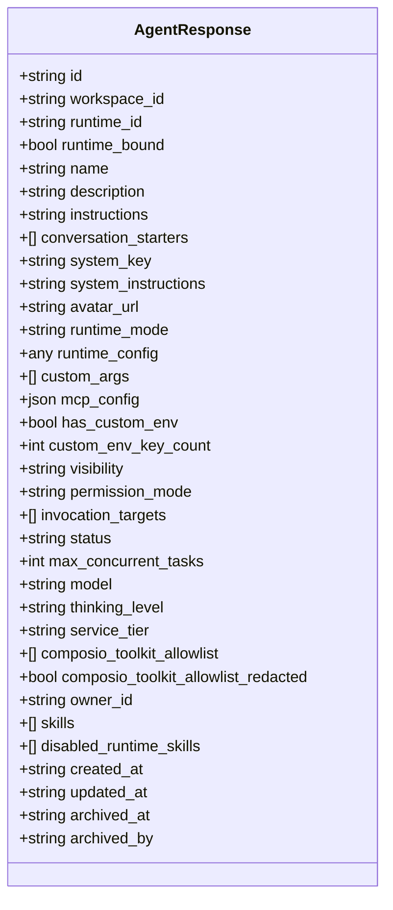
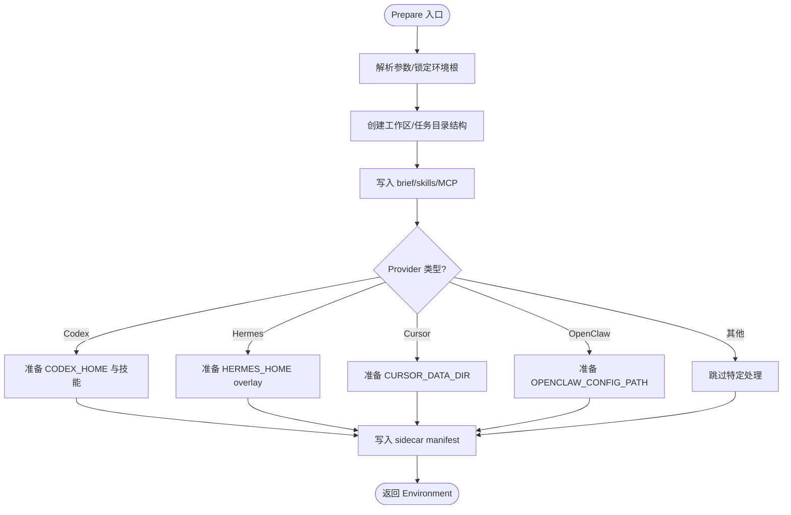
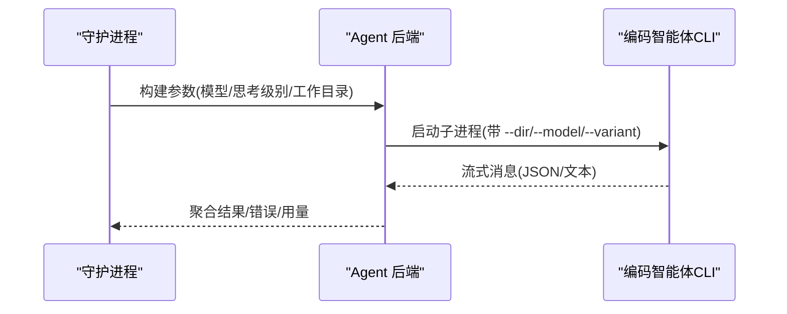
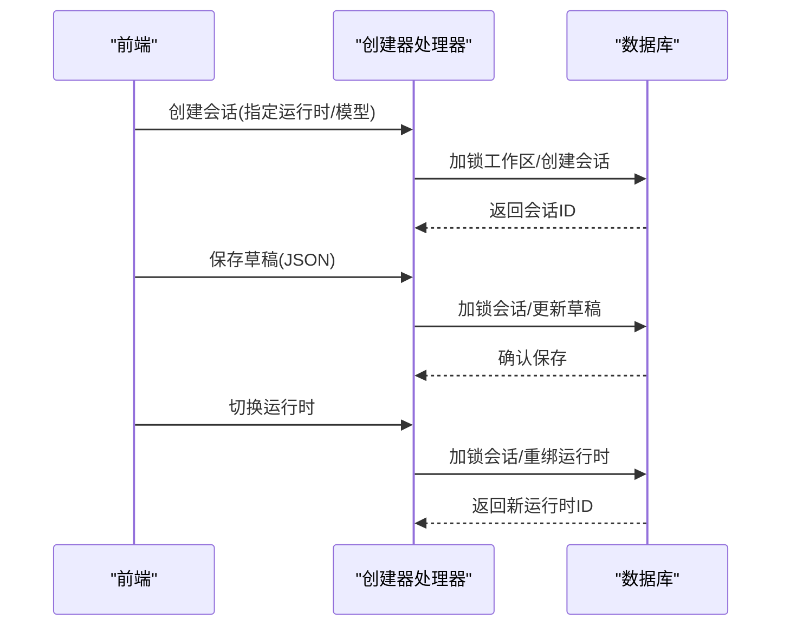
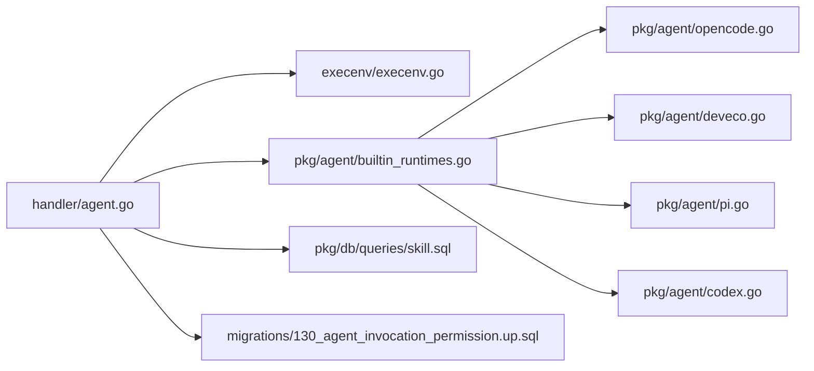

# 智能体概念

<cite>
**本文引用的文件**
- [AGENTS.md](file://AGENTS.md)
- [CLAUDE.md](file://CLAUDE.md)
- [server/internal/daemon/execenv/execenv.go](file://server/internal/daemon/execenv/execenv.go)
- [server/internal/handler/agent.go](file://server/internal/handler/agent.go)
- [server/internal/handler/agent_builder.go](file://server/internal/handler/agent_builder.go)
- [server/pkg/agent/builtin_runtimes.go](file://server/pkg/agent/builtin_runtimes.go)
- [server/pkg/agent/opencode.go](file://server/pkg/agent/opencode.go)
- [server/pkg/agent/deveco.go](file://server/pkg/agent/deveco.go)
- [server/pkg/agent/pi.go](file://server/pkg/agent/pi.go)
- [server/pkg/agent/codex.go](file://server/pkg/agent/codex.go)
- [server/migrations/130_agent_invocation_permission.up.sql](file://server/migrations/130_agent_invocation_permission.up.sql)
- [server/migrations/050_agent_model.up.sql](file://server/migrations/050_agent_model.up.sql)
- [server/migrations/206_agent_disabled_runtime_skills.up.sql](file://server/migrations/206_agent_disabled_runtime_skills.up.sql)
- [server/pkg/db/queries/skill.sql](file://server/pkg/db/queries/skill.sql)
- [apps/mobile/lib/agent-schema.test.ts](file://apps/mobile/lib/agent-schema.test.ts)
</cite>

## 目录
1. [简介](#简介)
2. [项目结构](#项目结构)
3. [核心组件](#核心组件)
4. [架构总览](#架构总览)
5. [详细组件分析](#详细组件分析)
6. [依赖关系分析](#依赖关系分析)
7. [性能考量](#性能考量)
8. [故障排除指南](#故障排除指南)
9. [结论](#结论)
10. [附录](#附录)

## 简介
本文件从“智能体作为 AI 协作者”的角度，系统阐述 Multica 中智能体的概念、配置与执行方式。智能体是工作空间中的可重用配置，包含名称、指令、模型、技能、访问权限和运行时设置；它不是长期运行的进程，而是在被触发时才执行。后端通过守护进程（daemon）为每次任务装配隔离的执行环境，将提示词、技能和上下文写入工作目录后，调用具体编码智能体 CLI（如 Codex、OpenCode、DevEco、Pi、Hermes 等）完成一次性运行。

## 项目结构
- 后端：Go + Chi 路由 + sqlc + gorilla/websocket，负责智能体资源管理、任务派发、权限控制与执行环境准备。
- 前端：pnpm workspaces + Turborepo 单体，提供智能体创建、配置与使用界面。
- 数据库：PostgreSQL 17，迁移遵循无外键、并发建索引等规则。
- 执行层：守护进程在 WorkspacesRoot 下为每个任务创建独立 env root，代码通过 git worktree 从共享裸缓存 checkout，同一 (agent, issue) 的多轮复用 PriorWorkDir，不同任务并行隔离。

**图表来源**
- [server/internal/handler/agent.go:50-140](file://server/internal/handler/agent.go#L50-L140)
- [server/internal/daemon/execenv/execenv.go:39-127](file://server/internal/daemon/execenv/execenv.go#LL39-L127)
- [server/pkg/agent/builtin_runtimes.go:8-60](file://server/pkg/agent/builtin_runtimes.go#L8-L60)

**章节来源**
- [CLAUDE.md:14-29](file://CLAUDE.md#L14-L29)
- [AGENTS.md:15-45](file://AGENTS.md#L15-L45)

## 核心组件
- 智能体资源与响应：包含名称、描述、指令、会话引导、系统提示、头像、运行时模式、运行时配置、自定义参数、MCP 配置、环境变量元信息、可见性、调用权限、并发限制、模型、思考级别、服务层级、Composio 工具白名单、技能集合、禁用运行时技能、时间戳等。
- 任务派发与上下文：服务端在 claim 时组装任务数据，包括仓库、项目、连接应用、状态目录、触发信息、聊天上下文、自动计划、快速创建、授权令牌等，并传递给守护进程用于生成 brief 和执行。
- 执行环境：守护进程为每个任务准备隔离目录，注入 CLAUDE.md/AGENTS.md 提示块、技能水合、MCP 配置、各 provider 专属 home/overlay，并以 CWD 锁定到任务工作目录。
- 运行时识别：内置运行时描述符统一声明 ID、协议族、默认命令、环境变量前缀、显示名、技能目录、用户技能目录、启动头、默认可执行文件和提供者标签。
- 权限与访问：引入调用权限模型（private/public_to），通过允许列表决定谁可以触发或调用智能体；旧可见性字段保留为派生兼容。

**章节来源**
- [server/internal/handler/agent.go:50-140](file://server/internal/handler/agent.go#L50-L140)
- [server/internal/handler/agent.go:348-536](file://server/internal/handler/agent.go#L348-L536)
- [server/internal/daemon/execenv/execenv.go:39-127](file://server/internal/daemon/execenv/execenv.go#L39-L127)
- [server/pkg/agent/builtin_runtimes.go:8-60](file://server/pkg/agent/builtin_runtimes.go#L8-L60)
- [server/migrations/130_agent_invocation_permission.up.sql:1-26](file://server/migrations/130_agent_invocation_permission.up.sql#L1-L26)

## 架构总览
智能体执行是一次性流程：前端或自动化触发 → 后端校验权限并派发任务 → 守护进程准备执行环境 → 写入 brief 与技能 → 调用编码智能体 CLI 执行 → 收集输出与日志 → 返回结果。

**图表来源**
- [server/internal/handler/agent.go:348-536](file://server/internal/handler/agent.go#L348-L536)
- [server/internal/daemon/execenv/execenv.go:409-744](file://server/internal/daemon/execenv/execenv.go#L409-L744)
- [server/pkg/agent/opencode.go:69-94](file://server/pkg/agent/opencode.go#L69-L94)
- [server/pkg/agent/deveco.go:91-120](file://server/pkg/agent/deveco.go#L91-L120)
- [server/pkg/agent/pi.go:282-330](file://server/pkg/agent/pi.go#L282-L330)
- [server/pkg/agent/codex.go:1153-1173](file://server/pkg/agent/codex.go#L1153-L1173)

## 详细组件分析

### 智能体配置与能力定义
- 基本属性：名称、描述、指令、会话引导、系统提示、头像、运行时模式、运行时配置、自定义参数、MCP 配置、环境变量元信息、可见性、调用权限、并发限制、模型、思考级别、服务层级、Composio 工具白名单、技能集合、禁用运行时技能、时间戳。
- 模型选择：新增 per-agent model 列，使 UI 可直接下拉选择，避免通过 custom_args 传递 -m 带来的兼容问题。
- 技能绑定：支持启用/禁用运行时技能，按工作空间维度列出并维护启用状态。
- 调用权限：private/public_to 两种模式；public_to 通过允许列表（workspace/member/team）决定谁可调用；旧 visibility 字段保持派生兼容。

**图表来源**
- [server/internal/handler/agent.go:50-140](file://server/internal/handler/agent.go#L50-L140)

**章节来源**
- [server/internal/handler/agent.go:50-140](file://server/internal/handler/agent.go#L50-L140)
- [server/migrations/050_agent_model.up.sql:1-5](file://server/migrations/050_agent_model.up.sql#L1-L5)
- [server/migrations/206_agent_disabled_runtime_skills.up.sql:1-3](file://server/migrations/206_agent_disabled_runtime_skills.up.sql#L1-L3)
- [server/migrations/130_agent_invocation_permission.up.sql:1-26](file://server/migrations/130_agent_invocation_permission.up.sql#L1-L26)
- [server/pkg/db/queries/skill.sql:140-170](file://server/pkg/db/queries/skill.sql#L140-L170)
- [apps/mobile/lib/agent-schema.test.ts:1-70](file://apps/mobile/lib/agent-schema.test.ts#L1-L70)

### 执行环境与 Brief 注入
- 执行环境根目录：WorkspacesRoot 下按工作区与任务标识组织，确保隔离与安全。
- 工作目录：通常为 envRoot/workdir；本地目录模式下指向用户路径；worktree 模式下在 envRoot 内创建临时分支。
- 上下文文件：写入 CLAUDE.md/AGENTS.md 的标记块作为 brief；技能水合到 provider 原生 skills 目录；每轮 prompt 由 daemon.BuildPrompt 生成。
- Provider 专属 Home/Overlay：Codex 的 CODEX_HOME、Hermes 的 HERMES_HOME overlay、Cursor 的 CURSOR_DATA_DIR、OpenClaw 的 OPENCLAW_CONFIG_PATH 等。
- 安全与回滚：对本地目录模式记录 sidecar manifest，失败时回滚；工作树模式失败直接丢弃。

**图表来源**
- [server/internal/daemon/execenv/execenv.go:409-744](file://server/internal/daemon/execenv/execenv.go#L409-L744)

**章节来源**
- [server/internal/daemon/execenv/execenv.go:39-127](file://server/internal/daemon/execenv/execenv.go#L39-L127)
- [server/internal/daemon/execenv/execenv.go:409-744](file://server/internal/daemon/execenv/execenv.go#L409-L744)

### 运行时与 CLI 集成
- 内置运行时描述符：统一声明 ID、协议族、默认命令、环境变量前缀、显示名、技能目录、用户技能目录、启动头、默认可执行文件、提供者标签。
- OpenCode/DevEco：通过 --dir 锚定项目发现根，避免 PWD 继承导致的工作目录逃逸；不转发 SystemPrompt，brief 通过 AGENTS.md 注入。
- Pi：通过 stdin/stdout 流式通信，关闭 stdin 表示 prompt 结束，取消上下文时关闭管道释放阻塞。
- Codex：生命周期日志、消息通道、最终答案提取、首次项等待、轮次通知门控等。

**图表来源**
- [server/pkg/agent/builtin_runtimes.go:8-60](file://server/pkg/agent/builtin_runtimes.go#L8-L60)
- [server/pkg/agent/opencode.go:69-94](file://server/pkg/agent/opencode.go#L69-L94)
- [server/pkg/agent/deveco.go:91-120](file://server/pkg/agent/deveco.go#L91-L120)
- [server/pkg/agent/pi.go:282-330](file://server/pkg/agent/pi.go#L282-L330)
- [server/pkg/agent/codex.go:1153-1173](file://server/pkg/agent/codex.go#L1153-L1173)

**章节来源**
- [server/pkg/agent/builtin_runtimes.go:8-60](file://server/pkg/agent/builtin_runtimes.go#L8-L60)
- [server/pkg/agent/opencode.go:69-94](file://server/pkg/agent/opencode.go#L69-L94)
- [server/pkg/agent/deveco.go:91-120](file://server/pkg/agent/deveco.go#L91-L120)
- [server/pkg/agent/pi.go:282-330](file://server/pkg/agent/pi.go#L282-L330)
- [server/pkg/agent/codex.go:1153-1173](file://server/pkg/agent/codex.go#L1153-L1173)

### 智能体创建器与配置对话
- 创建器会话：通过隐藏的系统代理承载配置对话，避免出现在正常智能体列表中；会话受工作区锁保护，防止删除期间创建。
- 草稿保存：存储用户编辑但未发送的配置，采用 last-write-wins 策略；写操作加行锁保证一致性。
- 运行时切换：将活动对话重新绑定到另一个在线运行时，避免历史不一致；需检查无挂起任务。

**图表来源**
- [server/internal/handler/agent_builder.go:57-151](file://server/internal/handler/agent_builder.go#L57-L151)
- [server/internal/handler/agent_builder.go:256-340](file://server/internal/handler/agent_builder.go#L256-L340)
- [server/internal/handler/agent_builder.go:401-502](file://server/internal/handler/agent_builder.go#L401-L502)

**章节来源**
- [server/internal/handler/agent_builder.go:57-151](file://server/internal/handler/agent_builder.go#L57-L151)
- [server/internal/handler/agent_builder.go:256-340](file://server/internal/handler/agent_builder.go#L256-L340)
- [server/internal/handler/agent_builder.go:401-502](file://server/internal/handler/agent_builder.go#L401-L502)

## 依赖关系分析
- 处理器依赖：agent.go 负责资源映射与任务派发；agent_builder.go 负责创建器会话与草稿管理。
- 执行环境依赖：execenv.go 负责目录结构、上下文文件、provider 专属 home/overlay、sidecar manifest。
- 运行时依赖：builtin_runtimes.go 声明运行时描述符；opencode.go/deveco.go/pi.go/codex.go 实现各自 CLI 集成。
- 权限与技能：migration 130 引入调用权限表；skill.sql 提供技能启用/禁用与查询；mobile schema test 验证权限解析。

**图表来源**
- [server/internal/handler/agent.go:50-140](file://server/internal/handler/agent.go#L50-L140)
- [server/internal/daemon/execenv/execenv.go:39-127](file://server/internal/daemon/execenv/execenv.go#L39-L127)
- [server/pkg/agent/builtin_runtimes.go:8-60](file://server/pkg/agent/builtin_runtimes.go#L8-L60)
- [server/pkg/db/queries/skill.sql:140-170](file://server/pkg/db/queries/skill.sql#L140-L170)
- [server/migrations/130_agent_invocation_permission.up.sql:1-26](file://server/migrations/130_agent_invocation_permission.up.sql#L1-L26)

**章节来源**
- [server/internal/handler/agent.go:50-140](file://server/internal/handler/agent.go#L50-L140)
- [server/internal/daemon/execenv/execenv.go:39-127](file://server/internal/daemon/execenv/execenv.go#L39-L127)
- [server/pkg/agent/builtin_runtimes.go:8-60](file://server/pkg/agent/builtin_runtimes.go#L8-L60)
- [server/pkg/db/queries/skill.sql:140-170](file://server/pkg/db/queries/skill.sql#L140-L170)
- [server/migrations/130_agent_invocation_permission.up.sql:1-26](file://server/migrations/130_agent_invocation_permission.up.sql#L1-L26)

## 性能考量
- 执行环境复用：同一 (agent, issue) 的多轮通过 PriorWorkDir 复用同一 workdir，减少重复准备开销。
- 提示缓存前缀：易变字段（发起人、连接应用、续接提示）放在每轮消息而非 brief，避免破坏 prompt 缓存前缀。
- 并发与隔离：每个任务独占 env root，避免竞争；本地目录模式需额外回滚机制。
- 子进程管理：合理设置超时、信号终止、管道关闭，防止死锁与资源泄漏。

[本节为通用指导，无需引用具体文件]

## 故障排除指南
- 执行环境准备失败：常见于磁盘空间不足、权限不足、配置文件无法解析；错误通常以“prepare execution environment: execenv: ...”形式出现。
- 旧版 OpenClaw CLI 超时：可能被分类为网络错误或未知错误，建议升级至新版或调整超时策略。
- 工作目录逃逸：确保 --dir 与 PWD 正确设置，避免子进程回到守护进程的父目录。
- 会话恢复不可用：当 Codex 版本缺失或会话迁移未完成时，会降级为全新会话并在 brief 中提示。

**章节来源**
- [server/pkg/taskfailure/environment_prepare_test.go:21-34](file://server/pkg/taskfailure/environment_prepare_test.go#L21-L34)
- [server/pkg/taskfailure/classify.go:393-417](file://server/pkg/taskfailure/classify.go#L393-L417)
- [server/pkg/agent/opencode.go:69-94](file://server/pkg/agent/opencode.go#L69-L94)
- [server/pkg/agent/deveco.go:91-120](file://server/pkg/agent/deveco.go#L91-L120)

## 结论
Multica 的智能体是以配置为中心、按需执行的 AI 协作者。通过统一的运行时描述符、隔离的执行环境、严格的权限模型与 provider 适配，智能体可以在工作空间中安全、高效地复用与扩展。对于新用户，可从智能体创建器开始逐步配置；对于高级用户，可通过技能绑定、MCP 配置、运行时参数与环境变量进行深度定制。

[本节为总结，无需引用具体文件]

## 附录
- 最佳实践
  - 明确智能体职责与输出格式，指令尽量简洁且可执行。
  - 合理使用技能与 MCP 配置，避免泄露敏感信息。
  - 利用 PriorWorkDir 复用上下文，提升多轮效率。
  - 关注权限模型，确保仅授权必要调用者。
- 常见问题
  - 模型未生效：检查 per-agent model 字段与运行时支持。
  - 技能未加载：确认技能已启用且位于 provider 原生目录。
  - 权限拒绝：确认 permission_mode 与 invocation_targets 配置正确。

[本节为补充说明，无需引用具体文件]