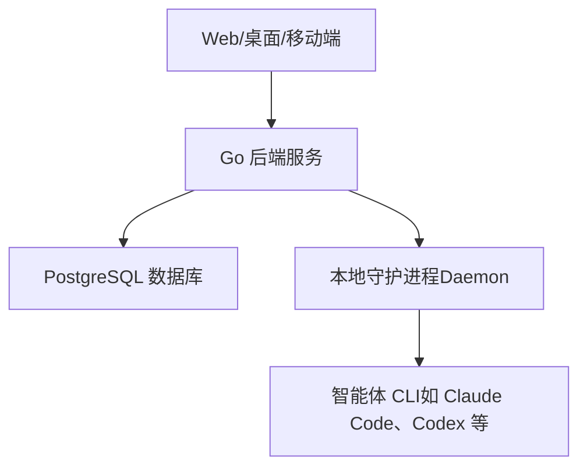
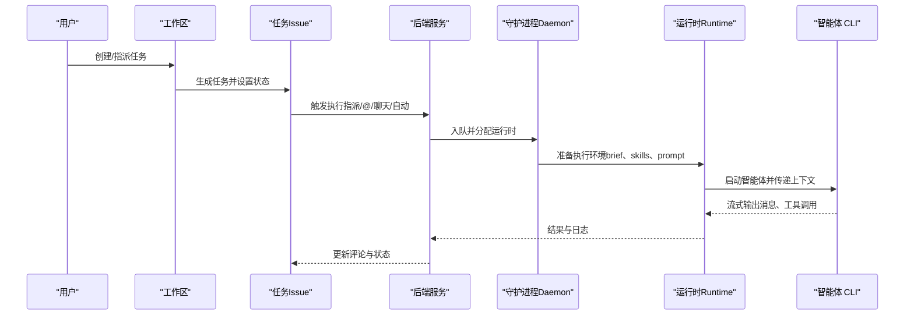
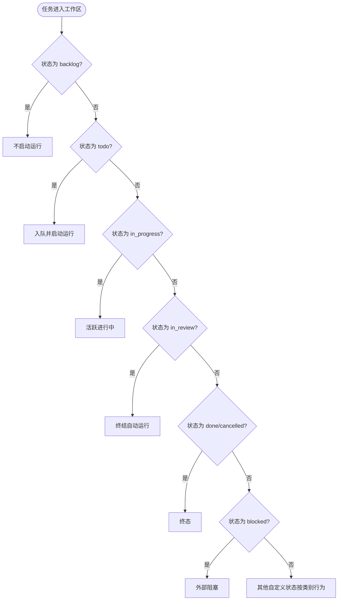
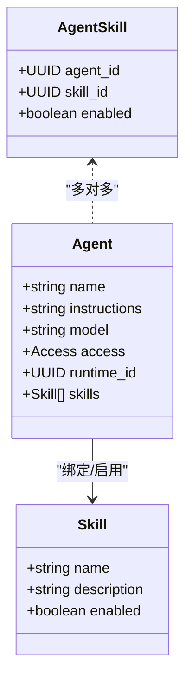
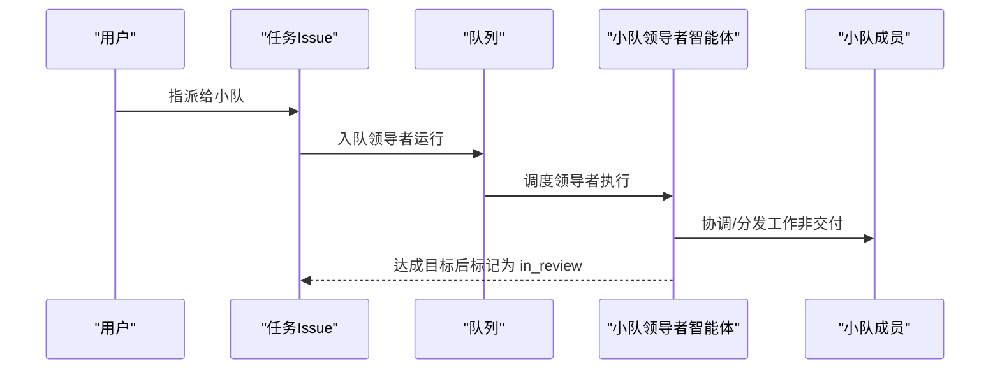
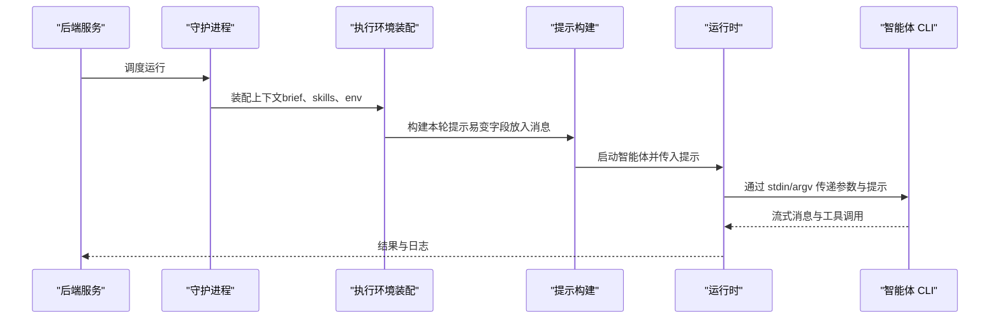
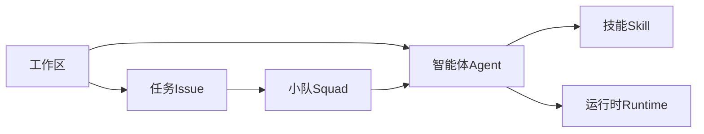

# 核心概念

<cite>
**本文引用的文件**
- [README.md](file://README.md)
- [concepts.mdx](file://apps/docs/content/docs/concepts.mdx)
- [assigning-issues.mdx](file://apps/docs/content/docs/assigning-issues.mdx)
- [squads.mdx](file://apps/docs/content/docs/squads.mdx)
- [members-roles.mdx](file://apps/docs/content/docs/members-roles.mdx)
- [agents.ko.mdx](file://apps/docs/content/docs/agents.ko.mdx)
- [084_squad.up.sql](file://server/migrations/084_squad.up.sql)
- [332_issue_status.up.sql](file://server/migrations/332_issue_status.up.sql)
- [issue_status.sql](file://server/pkg/db/queries/issue_status.sql)
- [skill.sql](file://server/pkg/db/queries/skill.sql)
- [hermes.go](file://server/pkg/agent/hermes.go)
- [opencode.go](file://server/pkg/agent/opencode.go)
- [opencode_stdin_unix_test.go](file://server/pkg/agent/opencode_stdin_unix_test.go)
</cite>

## 目录
1. [简介](#简介)
2. [项目结构](#项目结构)
3. [核心组件](#核心组件)
4. [架构总览](#架构总览)
5. [详细组件分析](#详细组件分析)
6. [依赖关系分析](#依赖关系分析)
7. [性能考量](#性能考量)
8. [故障排查指南](#故障排查指南)
9. [结论](#结论)
10. [附录](#附录)

## 简介
本文件聚焦 Multica 的核心概念与协作机制，面向初学者与高级用户。内容覆盖工作区（Workspace）、智能体（Agent）、任务（Issue）、技能（Skill）、小队（Squad）、运行环境（Runtime）等关键对象，解释它们之间的关系、任务生命周期与状态转换、权限模型与访问控制、以及运行时如何驱动智能体执行。文末提供实际示例，展示这些概念如何在系统中协同工作。

## 项目结构
Multica 采用前后端分离与多应用组织：
- 前端：Next.js Web、Electron 桌面、Expo 移动，共享 UI 与视图包。
- 后端：Go 服务（Chi + sqlc + gorilla/websocket），负责 API、调度、权限、事件与数据库交互。
- 数据库：PostgreSQL 17，使用迁移管理 schema。
- 运行时：本地守护进程（daemon）在用户机器上启动并执行多种编码智能体 CLI。

图表来源
- [README.md:190-218](file://README.md#L190-L218)

章节来源
- [README.md:190-218](file://README.md#L190-L218)

## 核心组件
- 工作区（Workspace）：团队工作的自包含范围，所有配置与工作都在其中进行。
- 任务（Issue）：日常工作的基本单元，包含描述、讨论、状态与历史；指派人可以是成员、智能体或小队。
- 智能体（Agent）：可复用的 AI 协作者配置，包括名称、指令、模型、技能、访问范围与运行时；仅在触发时执行。
- 技能（Skill）：可复用的能力包，描述“如何做某类工作”，可绑定到多个智能体。
- 小队（Squad）：由智能体领导组成的协作单元，可将任务指派给小队，由领导者协调工作。
- 运行环境（Runtime）：实际执行任务的计算机，连接 Multica 并安装智能体 CLI；智能体是身份，运行时是执行机器。
- 运行记录（Run）：一次具体的执行记录；每个触发都会产生一个 run，完成后将结果写回触发处。

章节来源
- [concepts.mdx:10-65](file://apps/docs/content/docs/concepts.mdx#L10-L65)

## 架构总览
Multica 的协作流程围绕“触发—执行—反馈”展开：
- 触发源：指派、@提及、聊天消息、自动计划（Autopilot）。
- 执行层：后端将任务入队，守护进程在运行时中调用具体智能体 CLI。
- 反馈层：智能体读取上下文、修改代码、评论与更新状态，结果写回任务或聊天。

图表来源
- [README.md:190-218](file://README.md#L190-L218)
- [concepts.mdx:58-65](file://apps/docs/content/docs/concepts.mdx#L58-L65)

章节来源
- [README.md:190-218](file://README.md#L190-L218)
- [concepts.mdx:58-65](file://apps/docs/content/docs/concepts.mdx#L58-L65)

## 详细组件分析

### 工作区（Workspace）
- 作用：隔离团队的工作与配置，成员与智能体在同一工作区内协作。
- 边界：所有资源（任务、项目、成员、智能体、技能）均属于某个工作区。
- 权限：角色（owner/admin/member）管理工作区设置与团队管理；不直接决定谁能运行智能体。

章节来源
- [concepts.mdx:10-12](file://apps/docs/content/docs/concepts.mdx#L10-L12)
- [members-roles.mdx:1-29](file://apps/docs/content/docs/members-roles.mdx#L1-L29)

### 任务（Issue）与状态模型
- 任务定义：描述、字段、评论、状态与历史；是日常工作的基本单位。
- 状态分类：系统内置七类（backlog/todo/in_progress/in_review/done/blocked/cancelled），支持自定义状态但行为继承其类别。
- 状态语义：
  - backlog：停放，指派智能体不会启动运行。
  - todo：排队待处理，指派智能体会立即启动运行。
  - in_progress：活跃进行中；失败且无其他运行时会回滚到 todo。
  - in_review：已交付等待评审；会终结自动运行（autopilot run）。
  - done/cancelled：终态；done 还会在关联 PR 合并时自动关闭。
  - blocked：外部依赖阻塞，不会自动恢复。

图表来源
- [332_issue_status.up.sql:27-51](file://server/migrations/332_issue_status.up.sql#L27-L51)
- [issue_status.sql:1-20](file://server/pkg/db/queries/issue_status.sql#L1-L20)
- [issues.mdx:59-84](file://apps/docs/content/docs/issues.mdx#L59-L84)

章节来源
- [concepts.mdx:14-20](file://apps/docs/content/docs/concepts.mdx#L14-L20)
- [332_issue_status.up.sql:27-51](file://server/migrations/332_issue_status.up.sql#L27-L51)
- [issue_status.sql:1-20](file://server/pkg/db/queries/issue_status.sql#L1-L20)
- [issues.mdx:59-84](file://apps/docs/content/docs/issues.mdx#L59-L84)

### 智能体（Agent）与技能（Skill）
- 智能体：可复用配置（名称、指令、模型、技能、访问范围、运行时）；不是长驻进程，仅在触发时执行。
- 技能：描述“如何做某类工作”，可被多个智能体复用；通过 agent_skill 表绑定到智能体并可启用/禁用。
- 权限与访问：每个智能体有 owner 与 Access 设置（仅我/全工作区/指定成员）；owner/admin 不能绕过 Access 运行未授权智能体。

图表来源
- [002_agent_config.up.sql:1-7](file://server/migrations/002_agent_config.up.sql#L1-L7)
- [skill.sql:140-170](file://server/pkg/db/queries/skill.sql#L140-L170)
- [agents.ko.mdx:45-63](file://apps/docs/content/docs/agents.ko.mdx#L45-L63)

章节来源
- [concepts.mdx:24-30](file://apps/docs/content/docs/concepts.mdx#L24-L30)
- [002_agent_config.up.sql:1-7](file://server/migrations/002_agent_config.up.sql#L1-L7)
- [skill.sql:140-170](file://server/pkg/db/queries/skill.sql#L140-L170)
- [agents.ko.mdx:45-63](file://apps/docs/content/docs/agents.ko.mdx#L45-L63)

### 小队（Squad）与协作执行
- 小队：由智能体领导与成员组成，可将任务指派给小队；指派后队列中为领导者智能体的运行，分发成员不算交付。
- 数据库模型：squad 表与 squad_member 表，支持 agent/member 两种成员类型；issue.assignee_type 扩展为 member/agent/squad。

图表来源
- [084_squad.up.sql:1-34](file://server/migrations/084_squad.up.sql#L1-L34)
- [squads.mdx:27-31](file://apps/docs/content/docs/squads.mdx#L27-L31)

章节来源
- [concepts.mdx:42-44](file://apps/docs/content/docs/concepts.mdx#L42-L44)
- [084_squad.up.sql:1-34](file://server/migrations/084_squad.up.sql#L1-L34)
- [squads.mdx:27-31](file://apps/docs/content/docs/squads.mdx#L27-L31)

### 运行环境（Runtime）与执行流程
- 运行时：连接 Multica 的计算机，安装并认证智能体 CLI；守护进程在此装配上下文并启动智能体。
- 执行细节：
  - brief 以标记块写入 CLAUDE.md/AGENTS.md，技能水合到 provider 原生 skills 目录。
  - 每轮 prompt 由 daemon.BuildPrompt 生成；易变字段放在每轮消息而非 brief，以保缓存前缀。
  - 大提示通过 stdin 传输以避免命令行长度限制（例如 OpenCode）。
  - 权限审批遵循 ACP 协议（allow_once/allow_always/reject_once），会话级允许选项安全识别。

图表来源
- [README.md:190-218](file://README.md#L190-L218)
- [opencode.go:198-209](file://server/pkg/agent/opencode.go#L198-L209)
- [opencode_stdin_unix_test.go:69-75](file://server/pkg/agent/opencode_stdin_unix_test.go#L69-L75)
- [hermes.go:1268-1353](file://server/pkg/agent/hermes.go#L1268-L1353)

章节来源
- [README.md:190-218](file://README.md#L190-L218)
- [opencode.go:198-209](file://server/pkg/agent/opencode.go#L198-L209)
- [opencode_stdin_unix_test.go:69-75](file://server/pkg/agent/opencode_stdin_unix_test.go#L69-L75)
- [hermes.go:1268-1353](file://server/pkg/agent/hermes.go#L1268-L1353)

### 权限模型、角色管理与访问控制
- 工作区角色：owner/admin/member，管理工作区设置与团队管理；不决定智能体运行权限。
- 智能体访问（Access）：仅我/全工作区/指定成员；owner/admin 不能绕过 Access。
- 权限审批（ACP）：会话级 allow_session 与一次性 allow_once 安全自动批准；reject_once 用于拒绝单次操作。

章节来源
- [members-roles.mdx:1-29](file://apps/docs/content/docs/members-roles.mdx#L1-L29)
- [agents.ko.mdx:45-63](file://apps/docs/content/docs/agents.ko.mdx#L45-L63)
- [hermes.go:1268-1353](file://server/pkg/agent/hermes.go#L1268-L1353)

### 任务生命周期与自动化流程
- 触发方式：指派、@提及、聊天消息、自动计划（Autopilot）。
- 生命周期：
  - 进入 backlog：不启动运行。
  - 进入 todo：立即入队并启动运行。
  - in_progress：活跃进行中；失败且无其他运行回滚到 todo。
  - in_review：已交付等待评审；终结自动运行。
  - done/cancelled：终态；done 在关联 PR 合并时自动关闭。
  - blocked：外部阻塞，不会自动恢复。
- 小队指派：入队领导者运行，分发成员不算交付；达成目标后由领导者标记为 in_review。

章节来源
- [concepts.mdx:58-65](file://apps/docs/content/docs/concepts.mdx#L58-L65)
- [assigning-issues.mdx:28-43](file://apps/docs/content/docs/assigning-issues.mdx#L28-L43)
- [issues.mdx:59-84](file://apps/docs/content/docs/issues.mdx#L59-L84)

## 依赖关系分析
- 工作区是所有对象的容器；任务隶属于工作区。
- 智能体绑定技能并通过运行时执行；技能通过 agent_skill 表与智能体建立多对多关系。
- 小队由智能体领导与成员组成，任务可指派给小队，队列中为领导者运行。
- 状态模型基于 issue_status 表，自定义状态继承内置类别的行为。

图表来源
- [084_squad.up.sql:1-34](file://server/migrations/084_squad.up.sql#L1-L34)
- [skill.sql:140-170](file://server/pkg/db/queries/skill.sql#L140-L170)
- [issue_status.sql:1-20](file://server/pkg/db/queries/issue_status.sql#L1-L20)

章节来源
- [084_squad.up.sql:1-34](file://server/migrations/084_squad.up.sql#L1-L34)
- [skill.sql:140-170](file://server/pkg/db/queries/skill.sql#L140-L170)
- [issue_status.sql:1-20](file://server/pkg/db/queries/issue_status.sql#L1-L20)

## 性能考量
- 提示缓存：易变字段（发起人、连接应用、续接提示）放入每轮消息而非 brief，避免破坏 prompt 缓存前缀。
- 大提示传输：通过 stdin 传递提示，避免命令行长度限制导致的失败。
- 并发与队列：同一 (agent, issue) 的多轮通过 PriorWorkDir 复用工作目录，不同任务并行执行。
- 数据库索引：迁移中使用 CONCURRENTLY 创建索引以减少锁竞争。

章节来源
- [README.md:190-218](file://README.md#L190-L218)
- [opencode.go:198-209](file://server/pkg/agent/opencode.go#L198-L209)
- [opencode_stdin_unix_test.go:69-75](file://server/pkg/agent/opencode_stdin_unix_test.go#L69-L75)

## 故障排查指南
- 提示过大导致失败：检查是否通过 stdin 传递提示，避免 argv 过长。
- 权限审批卡住：确认 ACP 选项是否包含 allow_once 或 allow_session；若无安全选项则需手动审批。
- 任务状态异常：核对状态类别与行为规则；失败回滚到 todo 的条件是否满足。
- 小队协作问题：确认指派的是领导者运行；分发成员不等于交付。

章节来源
- [opencode.go:198-209](file://server/pkg/agent/opencode.go#L198-L209)
- [hermes.go:1268-1353](file://server/pkg/agent/hermes.go#L1268-L1353)
- [issues.mdx:59-84](file://apps/docs/content/docs/issues.mdx#L59-L84)
- [squads.mdx:27-31](file://apps/docs/content/docs/squads.mdx#L27-L31)

## 结论
Multica 将工作区、任务、智能体、技能、小队与运行时有机整合，形成“触发—执行—反馈”的闭环。通过清晰的状态模型与权限控制，既保证团队协作的可控性，又充分发挥智能体的自动化能力。理解这些核心概念有助于高效使用与扩展系统。

## 附录
- 快速上手：创建工作区、连接运行时、创建智能体、指派任务。
- 文档导航：核心概念、如何工作、智能体创建、触发方式、运行时安装、集成与自托管。

章节来源
- [README.md:126-185](file://README.md#L126-L185)