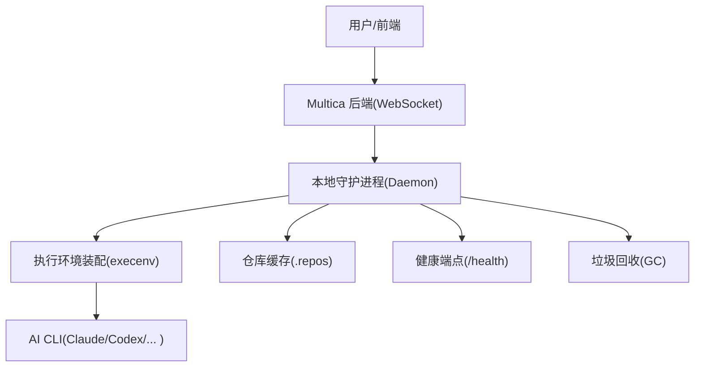
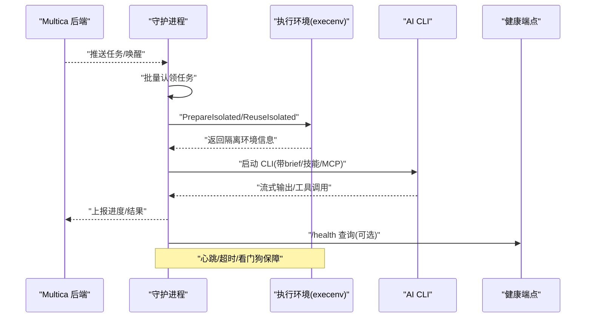
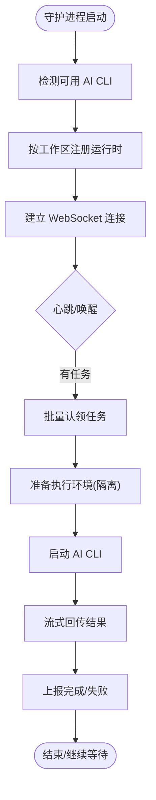
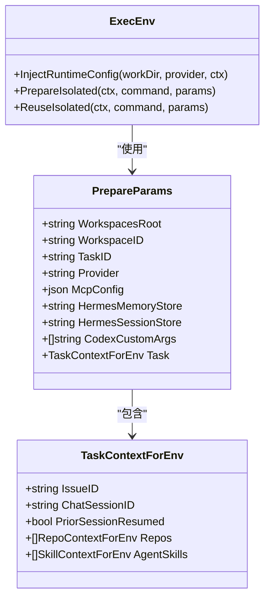
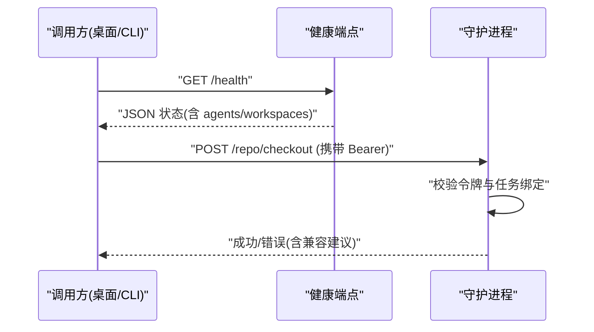
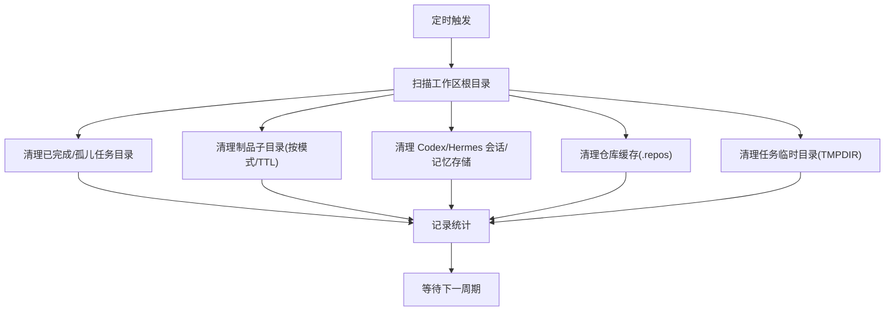
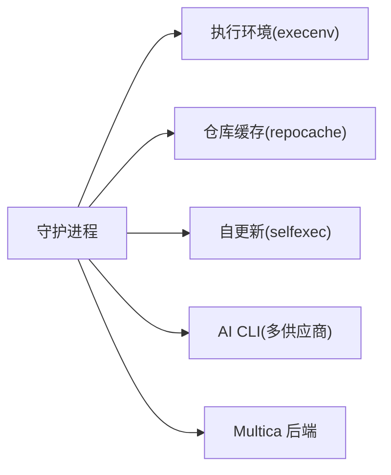

# 运行时执行

<cite>
**本文引用的文件**
- [CLI_AND_DAEMON.md](file://CLI_AND_DAEMON.md)
- [SELF_HOSTING_AI.md](file://SELF_HOSTING_AI.md)
- [README.md](file://README.md)
- [daemon.go](file://server/internal/daemon/daemon.go)
- [execenv.go](file://server/internal/daemon/execenv/execenv.go)
- [runtime_config.go](file://server/internal/daemon/execenv/runtime_config.go)
- [isolation.go](file://server/internal/daemon/execenv/isolation.go)
- [health.go](file://server/internal/daemon/health.go)
- [gc.go](file://server/internal/daemon/gc.go)
</cite>

## 目录
1. [简介](#简介)
2. [项目结构](#项目结构)
3. [核心组件](#核心组件)
4. [架构总览](#架构总览)
5. [详细组件分析](#详细组件分析)
6. [依赖关系分析](#依赖关系分析)
7. [性能与资源管理](#性能与资源管理)
8. [监控、故障诊断与维护](#监控故障诊断与维护)
9. [结论](#结论)
10. [附录：部署与管理示例](#附录部署与管理示例)

## 简介
本文件面向运维与开发者，系统性阐述 Multica 的“运行时”概念与实现。运行时的本质是一台连接到 Multica 并具备 AI 编码工具的计算机；智能体是身份标识，而运行时是实际执行的地方。守护进程（Daemon）在本地发现可用的 AI CLI，向服务端注册为可用运行时，并在任务到达时创建隔离的执行环境、启动对应 CLI、流式回传结果，同时负责心跳、自动重载、垃圾回收、仓库缓存维护等生命周期管理。

## 项目结构
- 守护进程核心位于 server/internal/daemon，负责任务调度、工作区管理、仓库缓存、健康检查、GC 等。
- 执行环境装配位于 server/internal/daemon/execenv，负责为每个任务生成隔离目录、注入 brief/skills、处理不同 provider 的配置写入、会话与记忆持久化、安全隔离等。
- 文档与安装指南位于根目录 README.md、CLI_AND_DAEMON.md、SELF_HOSTING_AI.md。

图表来源
- [daemon.go:1-200](file://server/internal/daemon/daemon.go#L1-L200)
- [execenv.go:1-200](file://server/internal/daemon/execenv/execenv.go#L1-L200)
- [health.go:1-200](file://server/internal/daemon/health.go#L1-L200)
- [gc.go:1-200](file://server/internal/daemon/gc.go#L1-L200)

章节来源
- [README.md:1-200](file://README.md#L1-L200)
- [CLI_AND_DAEMON.md:1-200](file://CLI_AND_DAEMON.md#L1-L200)

## 核心组件
- 守护进程（Daemon）
  - 发现并注册本机可用的 AI CLI 为运行时
  - 通过 WebSocket 接收任务、批量认领、心跳保活
  - 为每个任务准备隔离执行环境，启动 CLI 并流式回传结果
  - 自动重载二进制、维护仓库缓存、清理临时文件
- 执行环境（execenv）
  - 为每个任务创建独立目录，注入 brief（CLAUDE.md/AGENTS.md/QWEN.md 等）
  - 按 provider 注入技能、MCP 配置、会话/记忆持久化路径
  - 提供隔离执行与进程树控制，避免阻塞影响主进程
- 健康检查（health）
  - 暴露本地 /health 端口，输出 PID、OS、Profile、Agent 列表、工作区状态等
  - 保护 repo checkout 接口鉴权，防止跨任务冒用
- 垃圾回收（GC）
  - 定期扫描工作区根目录，清理已完成/孤儿任务、制品、仓库缓存、Hermes/Codex 会话存储、任务临时目录等
  - 支持策略化 TTL、模式匹配、重维护命令仅在空闲时执行

章节来源
- [CLI_AND_DAEMON.md:94-300](file://CLI_AND_DAEMON.md#L94-L300)
- [daemon.go:1-200](file://server/internal/daemon/daemon.go#L1-L200)
- [execenv.go:1-200](file://server/internal/daemon/execenv/execenv.go#L1-L200)
- [health.go:1-200](file://server/internal/daemon/health.go#L1-L200)
- [gc.go:1-200](file://server/internal/daemon/gc.go#L1-L200)

## 架构总览
守护进程作为本地运行时中枢，连接后端与多个 AI CLI。任务从后端推送或轮询获取后，由 execenv 构建隔离环境并启动对应 CLI，期间持续上报心跳与进度。健康端点供桌面应用或编排系统探测存活；GC 后台周期性回收磁盘空间。

图表来源
- [CLI_AND_DAEMON.md:235-241](file://CLI_AND_DAEMON.md#L235-L241)
- [isolation.go:105-200](file://server/internal/daemon/execenv/isolation.go#L105-L200)
- [daemon.go:1-200](file://server/internal/daemon/daemon.go#L1-L200)

## 详细组件分析

### 守护进程（Daemon）工作原理
- 启动流程
  - 检测已安装的 AI CLI，按工作区注册运行时
  - 建立 WebSocket 连接，周期心跳；收到 pending_work 提示可提前拉取
  - 支持自动重载：当本地 multica 二进制版本变化且无任务占用时，优雅重启
- 任务执行
  - 校验任务身份与令牌，设置任务级环境变量（token、工作区、agent/task 标识等）
  - 使用默认准备超时限制 claim 到 StartTask 的启动阶段
  - 并发上限、空闲看门狗、工具调用看门狗等保障稳定性
- 日志与状态
  - 每个 profile 独立状态目录，包含 daemon.log、daemon.pid、daemon.err.log
  - 可通过 CLI 查看状态、日志、跟随输出

图表来源
- [CLI_AND_DAEMON.md:235-241](file://CLI_AND_DAEMON.md#L235-L241)
- [daemon.go:1-200](file://server/internal/daemon/daemon.go#L1-L200)

章节来源
- [CLI_AND_DAEMON.md:94-155](file://CLI_AND_DAEMON.md#L94-L155)
- [CLI_AND_DAEMON.md:235-276](file://CLI_AND_DAEMON.md#L235-L276)
- [daemon.go:1-200](file://server/internal/daemon/daemon.go#L1-L200)

### 执行环境（execenv）装配
- 目标
  - 为每个任务创建独立目录，注入 brief 与技能水合产物
  - 按 provider 决定配置文件位置（CLAUDE.md/AGENTS.md/QWEN.md 等）
  - 管理 MCP 配置注入、Hermes/Codex 会话与记忆持久化
- 关键能力
  - InjectRuntimeConfig：将元数据与技能内容写入 provider 原生配置位置
  - PrepareIsolated/ReuseIsolated：在独立的 helper 进程中准备/复用环境，避免阻塞主进程
  - 隔离与安全：进程树控制、超时、错误分类透传
- 数据模型
  - PrepareParams：工作区、任务、provider、MCP、Hermes/Codex 会话/记忆路径等
  - TaskContextForEnv：任务上下文（触发者、评论、项目、聊天会话、autopilot 等）

图表来源
- [execenv.go:1-200](file://server/internal/daemon/execenv/execenv.go#L1-L200)
- [runtime_config.go:158-200](file://server/internal/daemon/execenv/runtime_config.go#L158-L200)
- [isolation.go:105-200](file://server/internal/daemon/execenv/isolation.go#L105-L200)

章节来源
- [execenv.go:1-200](file://server/internal/daemon/execenv/execenv.go#L1-L200)
- [runtime_config.go:158-200](file://server/internal/daemon/execenv/runtime_config.go#L158-L200)
- [isolation.go:105-200](file://server/internal/daemon/execenv/isolation.go#L105-L200)

### 健康检查与仓库检出安全
- /health 端点
  - 返回 PID、OS、Profile、DaemonID、设备名、服务器地址、CLI 版本、启动来源、活跃任务计数、Agent 列表、跳过原因、重载原因、工作区与运行时映射等
  - 用于桌面应用或编排系统探测存活与状态
- 仓库检出保护
  - /repo/checkout 需要 Authorization Bearer 令牌，绑定当前任务身份
  - 拒绝旧版 CLI 或缺失凭据的请求，区分“无凭据”和“未知凭据”两类错误以便定位

图表来源
- [health.go:19-79](file://server/internal/daemon/health.go#L19-L79)
- [health.go:119-200](file://server/internal/daemon/health.go#L119-L200)

章节来源
- [health.go:1-200](file://server/internal/daemon/health.go#L1-L200)

### 垃圾回收（GC）机制
- 触发与范围
  - 启动延迟一次，随后按间隔循环扫描 WorkspacesRoot
  - 清理项包括：完整任务目录、制品子目录、Codex/Hermes 会话与记忆存储、仓库缓存、任务临时目录、稳定根索引条目
- 策略要点
  - 基于 TTL 与模式匹配（如 node_modules/.next/.turbo）
  - 仓库缓存共享 .repos，仅在所有引用消失且超过 TTL 才驱逐
  - 重维护命令（reflog expire/git gc）仅在空闲时执行，避免抢占任务
  - 任务临时目录以 .task_lock 判断是否仍在使用，避免误删

图表来源
- [gc.go:25-193](file://server/internal/daemon/gc.go#L25-L193)

章节来源
- [CLI_AND_DAEMON.md:277-300](file://CLI_AND_DAEMON.md#L277-L300)
- [gc.go:1-200](file://server/internal/daemon/gc.go#L1-L200)

## 依赖关系分析
- 守护进程依赖
  - execenv：执行环境装配、隔离、会话/记忆管理
  - repocache：仓库裸缓存与工作树管理
  - selfexec：进程自更新与重载
  - agent/skillbundle/taskfailure：代理、技能包、失败分类
- 外部依赖
  - AI CLI：claude/codex/cursor/copilot/opencode/openclaw/hermes/pi/omp/codearts/deveco/qoder/qoderclicn/qwen/qwenpaw/mcode/dsh/grok/traecli/kimi/reasonix/dim/kiro 等
  - 后端服务：WebSocket 通信、任务下发、认证令牌

图表来源
- [daemon.go:1-200](file://server/internal/daemon/daemon.go#L1-L200)
- [CLI_AND_DAEMON.md:201-233](file://CLI_AND_DAEMON.md#L201-L233)

章节来源
- [daemon.go:1-200](file://server/internal/daemon/daemon.go#L1-L200)
- [CLI_AND_DAEMON.md:201-233](file://CLI_AND_DAEMON.md#L201-L233)

## 性能与资源管理
- 并发与超时
  - 最大并发任务数、任务准备超时、空闲/工具看门狗、特定 provider 的握手与时序超时（如 Codex）
- 内存与磁盘
  - 制品清理（node_modules/.next/.turbo 等）、托管缓存路径（如 codex-home/.sandbox-bin）
  - 仓库缓存共享与惰性克隆，减少重复下载
  - 任务临时目录按锁判定回收，避免 Windows 句柄问题导致的残留
- 网络与 I/O
  - WebSocket 唤醒信号降低轮询延迟；心跳频率可调
  - 健康端点轻量，不影响任务执行

章节来源
- [CLI_AND_DAEMON.md:245-276](file://CLI_AND_DAEMON.md#L245-L276)
- [CLI_AND_DAEMON.md:277-300](file://CLI_AND_DAEMON.md#L277-L300)
- [gc.go:1-200](file://server/internal/daemon/gc.go#L1-L200)

## 监控、故障诊断与维护
- 监控
  - 使用 multica daemon status/logs 查看守护进程状态与日志
  - 访问 /health 获取进程、OS、Profile、Agent、工作区、任务计数等
  - 关注 GC 日志中的 reclaimed 指标与 bytes_reclaimed
- 故障诊断
  - 若 /repo/checkout 报认证错误，确认 CLI 版本与 Authorization 头
  - 若 AI CLI 升级后行为变化，守护进程会重新探测并注册，无需重启
  - 若任务长时间无进展，检查空闲/工具看门狗与 provider 特定超时
- 维护策略
  - 合理设置 GC TTL 与制品模式，平衡可恢复性与磁盘占用
  - 对 Hermes/Codex 会话/记忆存储设置合适的保留期，避免“失忆”或磁盘膨胀
  - 在低峰时段允许仓库重维护，提升后续 clone/worktree 效率

章节来源
- [CLI_AND_DAEMON.md:156-200](file://CLI_AND_DAEMON.md#L156-L200)
- [CLI_AND_DAEMON.md:235-276](file://CLI_AND_DAEMON.md#L235-L276)
- [health.go:1-200](file://server/internal/daemon/health.go#L1-L200)
- [gc.go:1-200](file://server/internal/daemon/gc.go#L1-L200)

## 结论
Multica 的运行时以守护进程为核心，结合 execenv 的强隔离与 provider 适配，实现对多种 AI CLI 的统一调度与执行。通过健康检查、GC、仓库缓存与会话/记忆持久化，兼顾了可靠性、可观测性与资源效率。运维人员可据此进行容量规划、安全加固与排障；开发者可基于 execenv 扩展新的 provider 与技能注入逻辑。

## 附录：部署与管理示例
- 快速安装与连接
  - 使用脚本安装 CLI 并配置自托管实例，然后登录并启动守护进程
  - 验证守护进程状态，确保检测到至少一个 AI CLI
- 多运行时与环境隔离
  - 使用 --profile 在同一机器上运行多个守护进程，各自拥有独立配置、状态目录与工作区根
  - 通过工作区切换或环境变量指定目标工作区，便于脚本化与无状态场景
- 常见操作
  - 启动/停止/状态/日志：multica daemon start/stop/status/logs
  - 查看健康：curl http://localhost:<health_port>/health
  - 清理磁盘：等待 GC 周期或调整 TTL/模式

章节来源
- [SELF_HOSTING_AI.md:1-89](file://SELF_HOSTING_AI.md#L1-L89)
- [CLI_AND_DAEMON.md:36-58](file://CLI_AND_DAEMON.md#L36-L58)
- [CLI_AND_DAEMON.md:428-443](file://CLI_AND_DAEMON.md#L428-L443)
- [CLI_AND_DAEMON.md:156-200](file://CLI_AND_DAEMON.md#L156-L200)