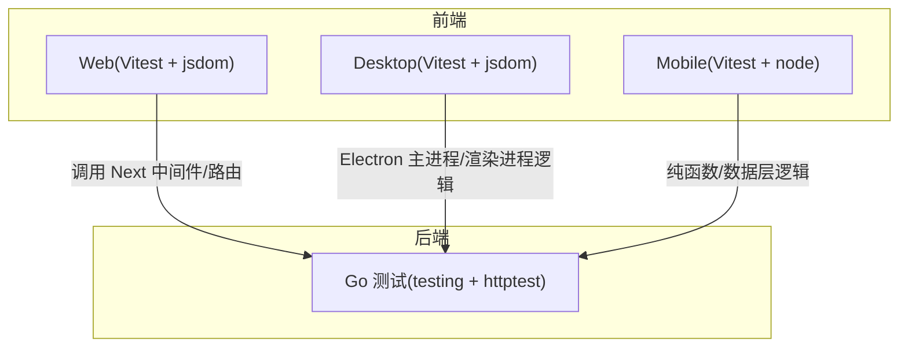
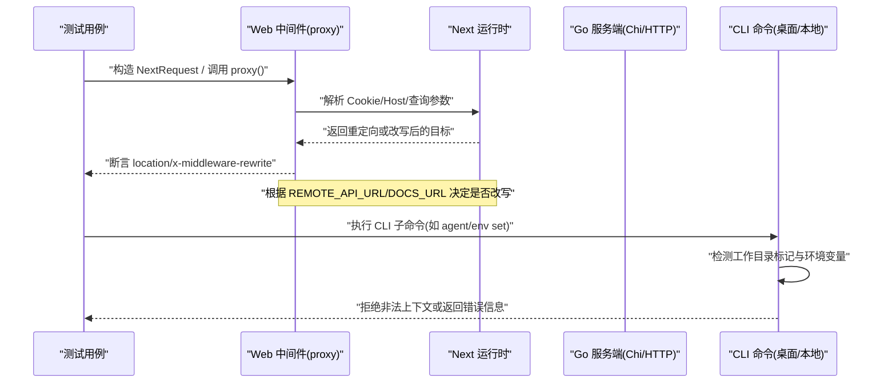
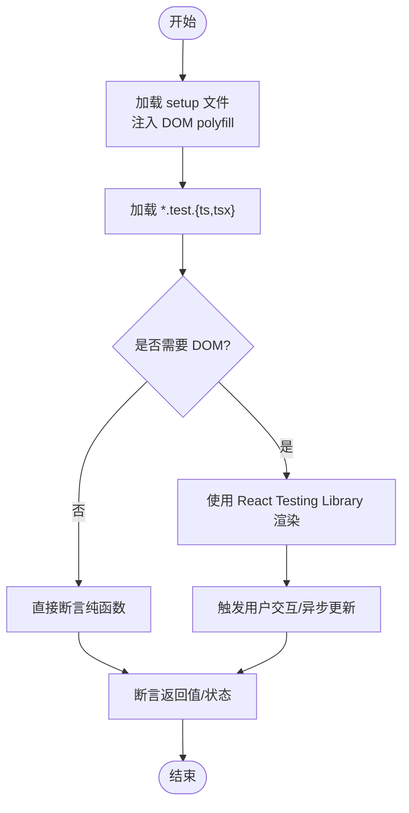
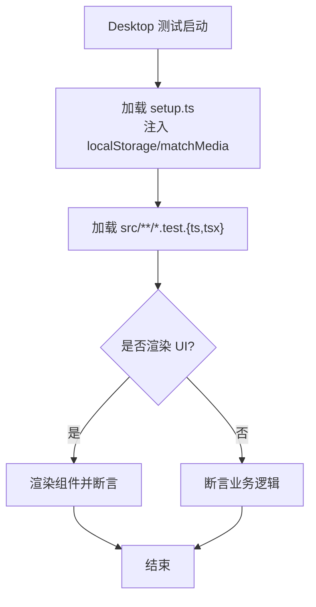
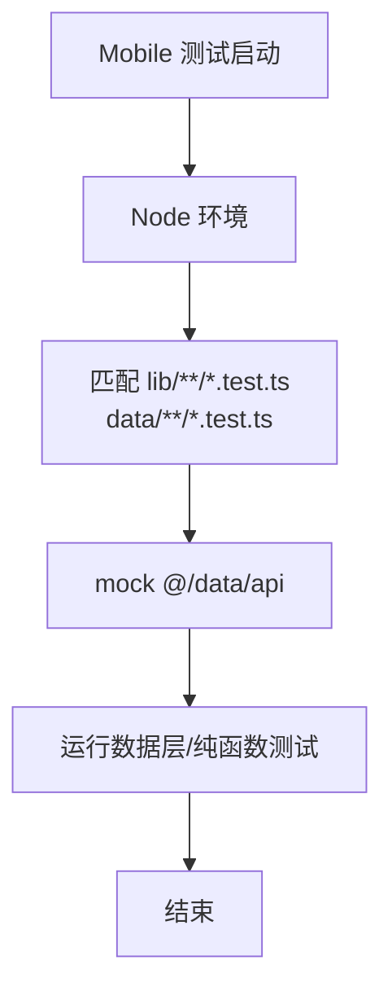
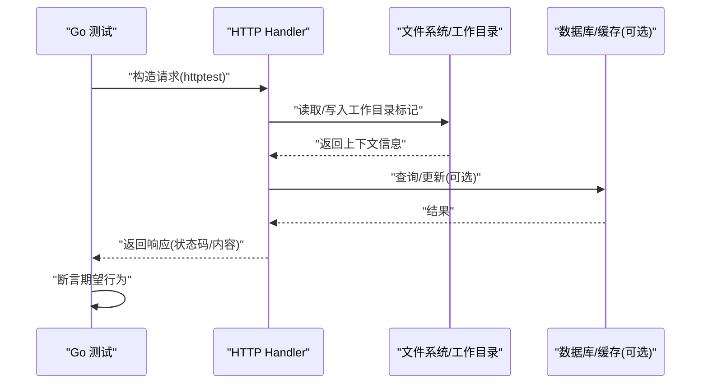
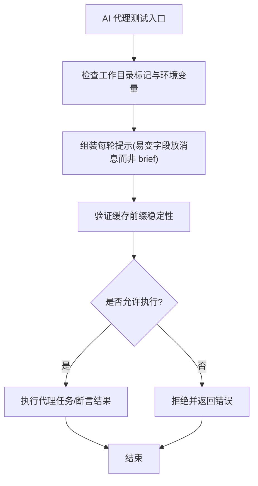
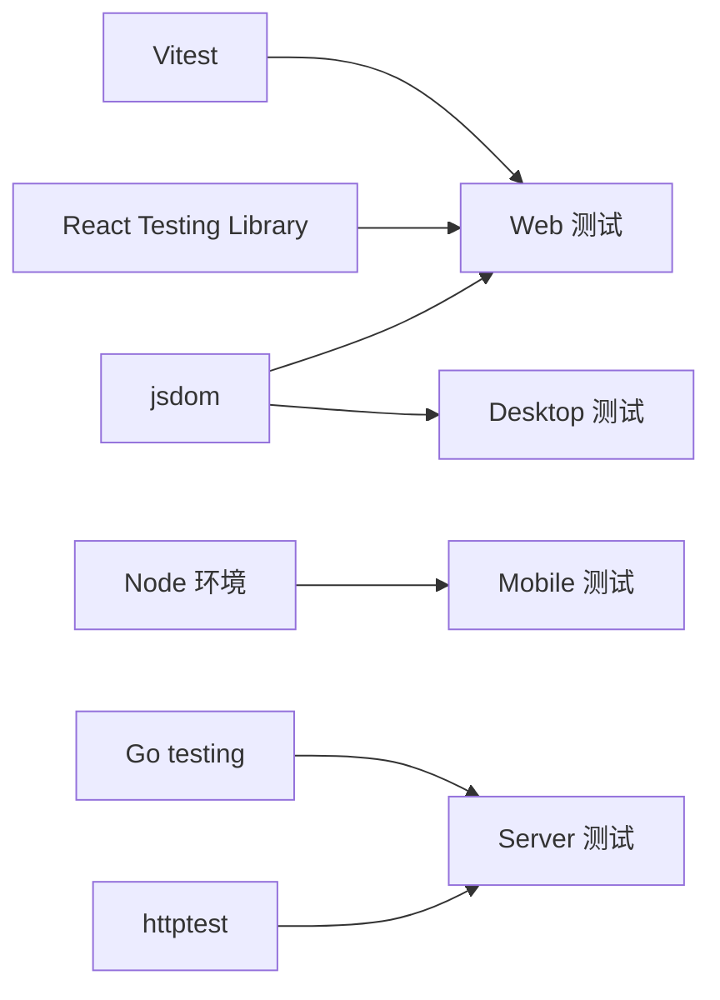

# 单元测试

<cite>
**本文引用的文件**
- [apps/web/vitest.config.ts](file://apps/web/vitest.config.ts)
- [apps/desktop/vitest.config.ts](file://apps/desktop/vitest.config.ts)
- [apps/mobile/vitest.config.ts](file://apps/mobile/vitest.config.ts)
- [apps/web/test/setup.ts](file://apps/web/test/setup.ts)
- [apps/desktop/test/setup.ts](file://apps/desktop/test/setup.ts)
- [apps/web/proxy.test.ts](file://apps/web/proxy.test.ts)
- [server/go.mod](file://server/go.mod)
- [server/cmd/multica/cmd_agent_test.go](file://server/cmd/multica/cmd_agent_test.go)
</cite>

## 目录
1. [简介](#简介)
2. [项目结构](#项目结构)
3. [核心组件](#核心组件)
4. [架构总览](#架构总览)
5. [详细组件分析](#详细组件分析)
6. [依赖分析](#依赖分析)
7. [性能考虑](#性能考虑)
8. [故障排查指南](#故障排查指南)
9. [结论](#结论)
10. [附录](#附录)

## 简介
本文件面向 Multica 项目的测试体系，覆盖 Go 后端与 TypeScript 前端的单元测试实践。重点包括：
- Go 后端的 table-driven tests、mock 策略与测试数据管理
- TypeScript 前端的组件测试、工具函数测试与状态管理测试
- 测试工具链：Vitest、React Testing Library、Go testing 包
- 测试编写最佳实践：命名规范、断言模式、异步处理
- 覆盖率配置与报告生成方法
- 为 AI 代理相关功能编写有效单元测试的实操建议

## 项目结构
本项目采用多应用 + 多包的单体仓库组织，前端使用 pnpm workspaces + Turborepo，后端为 Go（Chi + sqlc + gorilla/websocket），数据库 PostgreSQL。测试按应用/包维度独立配置：
- Web 端：基于 jsdom 的 Vitest 环境，提供 React Testing Library 与 DOM polyfill
- Desktop 端：基于 jsdom 的 Vitest 环境，补充 localStorage 与 matchMedia 等浏览器 API 模拟
- Mobile 端：Node 环境，仅对纯函数和数据层逻辑进行测试，避免引入 DOM/RN 渲染器
- Server 端：Go 原生 testing 包，广泛使用 table-driven tests 与 httptest

**图表来源**
- [apps/web/vitest.config.ts:1-20](file://apps/web/vitest.config.ts#L1-L20)
- [apps/desktop/vitest.config.ts:1-20](file://apps/desktop/vitest.config.ts#L1-L20)
- [apps/mobile/vitest.config.ts:1-29](file://apps/mobile/vitest.config.ts#L1-L29)
- [server/go.mod:1-84](file://server/go.mod#L1-L84)

**章节来源**
- [apps/web/vitest.config.ts:1-20](file://apps/web/vitest.config.ts#L1-L20)
- [apps/desktop/vitest.config.ts:1-20](file://apps/desktop/vitest.config.ts#L1-L20)
- [apps/mobile/vitest.config.ts:1-29](file://apps/mobile/vitest.config.ts#L1-L29)
- [server/go.mod:1-84](file://server/go.mod#L1-L84)

## 核心组件
本节聚焦各端测试基础设施与关键能力：
- Web 端测试环境：jsdom、全局 globals、setup 文件注入 DOM polyfill（ResizeObserver、localStorage）
- Desktop 端测试环境：内存 Storage、matchMedia 模拟，保证 UI 在测试中稳定渲染
- Mobile 端测试环境：Node 环境，专注纯函数与缓存更新逻辑，避免真实网络与 RN 模块
- Go 后端测试：table-driven tests、httptest 构造请求、环境变量隔离、工作目录标记校验

**章节来源**
- [apps/web/test/setup.ts:1-54](file://apps/web/test/setup.ts#L1-L54)
- [apps/desktop/test/setup.ts:1-61](file://apps/desktop/test/setup.ts#L1-L61)
- [apps/mobile/vitest.config.ts:1-29](file://apps/mobile/vitest.config.ts#L1-L29)
- [server/cmd/multica/cmd_agent_test.go:1-200](file://server/cmd/multica/cmd_agent_test.go#L1-L200)

## 架构总览
下图展示从前端测试到后端中间件的典型调用路径，以及 Go CLI 命令在任务上下文中的安全校验流程。

**图表来源**
- [apps/web/proxy.test.ts:1-291](file://apps/web/proxy.test.ts#L1-L291)
- [apps/web/vitest.config.ts:1-20](file://apps/web/vitest.config.ts#L1-L20)
- [server/cmd/multica/cmd_agent_test.go:1-200](file://server/cmd/multica/cmd_agent_test.go#L1-L200)

## 详细组件分析

### Web 端测试（Vitest + React Testing Library）
- 环境配置：jsdom 环境、全局 API、setup 文件注入 ResizeObserver/localStorage 等 polyfill
- 工具函数测试：通过 vitest 直接断言纯函数行为；需要 DOM 时使用 render/screen
- 组件测试：使用 React Testing Library 进行交互与断言；注意异步更新与事件冒泡
- 状态管理测试：优先测试 TanStack Query 的数据流与缓存更新；Zustand store 测试关注副作用最小化与 mock 外部依赖
- 中间件/路由测试：通过 NextRequest 构造请求并断言响应头与重定向行为

**图表来源**
- [apps/web/vitest.config.ts:1-20](file://apps/web/vitest.config.ts#L1-L20)
- [apps/web/test/setup.ts:1-54](file://apps/web/test/setup.ts#L1-L54)

**章节来源**
- [apps/web/vitest.config.ts:1-20](file://apps/web/vitest.config.ts#L1-L20)
- [apps/web/test/setup.ts:1-54](file://apps/web/test/setup.ts#L1-L54)
- [apps/web/proxy.test.ts:1-291](file://apps/web/proxy.test.ts#L1-L291)

### Desktop 端测试（Vitest + Electron）
- 环境配置：jsdom 环境、内存 Storage、matchMedia 模拟，确保侧边栏断点与折叠逻辑可测
- 主进程/渲染进程逻辑：针对 Electron 特定 API 进行隔离与 mock，避免真实系统调用
- 脚本测试：scripts/*.test.mjs 用于构建与发布流程验证

**图表来源**
- [apps/desktop/vitest.config.ts:1-20](file://apps/desktop/vitest.config.ts#L1-L20)
- [apps/desktop/test/setup.ts:1-61](file://apps/desktop/test/setup.ts#L1-L61)

**章节来源**
- [apps/desktop/vitest.config.ts:1-20](file://apps/desktop/vitest.config.ts#L1-L20)
- [apps/desktop/test/setup.ts:1-61](file://apps/desktop/test/setup.ts#L1-L61)

### Mobile 端测试（Vitest + Node）
- 环境配置：Node 环境，仅包含 lib/ 与 data/ 下的测试，避免引入 DOM/RN 渲染器
- 数据层测试：mock @/data/api 以阻止真实 fetch；专注 query key 与缓存更新逻辑
- 纯函数测试：序列化器、工具函数可直接断言输入输出

**图表来源**
- [apps/mobile/vitest.config.ts:1-29](file://apps/mobile/vitest.config.ts#L1-L29)

**章节来源**
- [apps/mobile/vitest.config.ts:1-29](file://apps/mobile/vitest.config.ts#L1-L29)

### Go 后端测试（testing + httptest）
- Table-driven tests：用 t.Run 组织多组用例，便于扩展与维护
- 请求构造：使用 httptest 构造 HTTP 请求，断言响应码与响应体
- 环境变量与工作目录：通过 t.Setenv/t.Chdir 隔离测试上下文，避免污染
- 安全边界：校验 daemon 任务标记与上下文，防止越权与误用

**图表来源**
- [server/cmd/multica/cmd_agent_test.go:1-200](file://server/cmd/multica/cmd_agent_test.go#L1-L200)

**章节来源**
- [server/cmd/multica/cmd_agent_test.go:1-200](file://server/cmd/multica/cmd_agent_test.go#L1-L200)

### AI 代理相关功能的单元测试要点
- 上下文装配：围绕 execenv 的工作目录标记与 brief 生成逻辑，验证每轮提示的易变字段位置
- 权限与安全：校验 daemon 任务标记，防止逃逸到父目录导致 PAT 泄露
- 缓存与幂等：确保 prompt 缓存前缀不被易变字段破坏，测试不同 (agent, issue) 的多轮复用
- CLI 命令：验证 agent/env set、agent create 等子命令的参数解析与错误分支

**图表来源**
- [server/cmd/multica/cmd_agent_test.go:1-200](file://server/cmd/multica/cmd_agent_test.go#L1-L200)

**章节来源**
- [server/cmd/multica/cmd_agent_test.go:1-200](file://server/cmd/multica/cmd_agent_test.go#L1-L200)

## 依赖分析
- 前端依赖：Vitest、React Testing Library、jsdom；通过 vitest.config.ts 统一配置
- 后端依赖：Go standard library testing、net/http/httptest；第三方库由 go.mod 管理
- 跨端协作：Web 端测试通过 NextRequest 调用中间件，最终影响后端路由与重写规则

**图表来源**
- [apps/web/vitest.config.ts:1-20](file://apps/web/vitest.config.ts#L1-L20)
- [apps/desktop/vitest.config.ts:1-20](file://apps/desktop/vitest.config.ts#L1-L20)
- [apps/mobile/vitest.config.ts:1-29](file://apps/mobile/vitest.config.ts#L1-L29)
- [server/go.mod:1-84](file://server/go.mod#L1-L84)

**章节来源**
- [apps/web/vitest.config.ts:1-20](file://apps/web/vitest.config.ts#L1-L20)
- [apps/desktop/vitest.config.ts:1-20](file://apps/desktop/vitest.config.ts#L1-L20)
- [apps/mobile/vitest.config.ts:1-29](file://apps/mobile/vitest.config.ts#L1-L29)
- [server/go.mod:1-84](file://server/go.mod#L1-L84)

## 性能考虑
- 前端测试：
  - 使用 jsdom 时避免不必要的 DOM 操作，减少渲染开销
  - 对异步更新使用 waitFor/findBy* 等待稳定状态
  - 合理拆分测试套件，避免单文件过大导致执行时间过长
- 后端测试：
  - 使用 httptest 构造轻量请求，避免真实网络 I/O
  - 表驱动测试将重复逻辑抽象为用例表，提升可读性与维护性
  - 通过环境变量与工作目录隔离，避免并发测试冲突

[本节为通用指导，不直接分析具体文件]

## 故障排查指南
- Web 端 DOM 缺失：确认 setup 文件已注入 ResizeObserver/localStorage；若使用 node 环境，需自行实现必要 polyfill
- Desktop 端样式断点：确保 matchMedia 已模拟；否则侧边栏断点逻辑可能不符合预期
- Mobile 端网络调用：必须 mock @/data/api，避免触发真实 fetch；否则测试会失败或产生副作用
- Go 测试上下文：检查工作目录标记与环境变量是否正确设置；必要时使用 t.TempDir 与 t.Cleanup 清理

**章节来源**
- [apps/web/test/setup.ts:1-54](file://apps/web/test/setup.ts#L1-L54)
- [apps/desktop/test/setup.ts:1-61](file://apps/desktop/test/setup.ts#L1-L61)
- [apps/mobile/vitest.config.ts:1-29](file://apps/mobile/vitest.config.ts#L1-L29)
- [server/cmd/multica/cmd_agent_test.go:1-200](file://server/cmd/multica/cmd_agent_test.go#L1-L200)

## 结论
本项目在前端与后端均建立了完善的单元测试体系：
- 前端基于 Vitest 与 React Testing Library，提供稳定的 DOM 环境与丰富的断言能力
- 后端基于 Go testing 与 httptest，广泛采用 table-driven tests 与上下文隔离
- 通过清晰的配置与 setup 文件，确保各端测试的一致性与可维护性
- 针对 AI 代理功能，强调上下文装配、权限校验与缓存稳定性，保障核心逻辑的正确性

[本节为总结性内容，不直接分析具体文件]

## 附录

### 测试编写最佳实践
- 命名规范：
  - 前端：describe/it 使用自然语言描述场景，如“当未登录时访问受保护页面应重定向到登录”
  - 后端：t.Run 使用“场景_期望结果”格式，如“缺少端口提示_包含恢复指引”
- 断言模式：
  - 前端：优先断言可见元素与用户交互结果，避免过度耦合内部实现
  - 后端：断言响应码、响应体关键字段与副作用（如文件写入、缓存更新）
- 异步处理：
  - 前端：使用 waitFor/findBy* 等待异步更新完成，避免竞态条件
  - 后端：使用 httptest 同步发起请求，确保断言时机正确

[本节为通用指导，不直接分析具体文件]

### 覆盖率配置与报告生成
- 前端（Vitest）：
  - 在 vitest.config.ts 中启用 coverage 选项，指定 reporter（如 lcov、html）
  - 运行命令示例：pnpm test --coverage
- 后端（Go）：
  - 使用 go test -coverprofile=coverage.out 生成覆盖率文件
  - 使用 go tool cover -html=coverage.out 生成 HTML 报告

[本节为通用指导，不直接分析具体文件]

### 为 AI 代理功能编写有效用例的建议
- 覆盖上下文装配：验证 brief 与每轮消息的字段分离，确保缓存前缀稳定
- 覆盖权限与安全：验证工作目录标记与环境变量，防止 PAT 泄露与越权
- 覆盖 CLI 命令：验证 agent/env set、agent create 等子命令的参数解析与错误分支
- 覆盖并发与复用：验证同一 (agent, issue) 的多轮复用 PriorWorkDir，不同任务并行执行

[本节为通用指导，不直接分析具体文件]