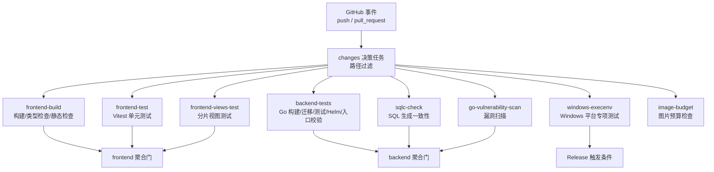
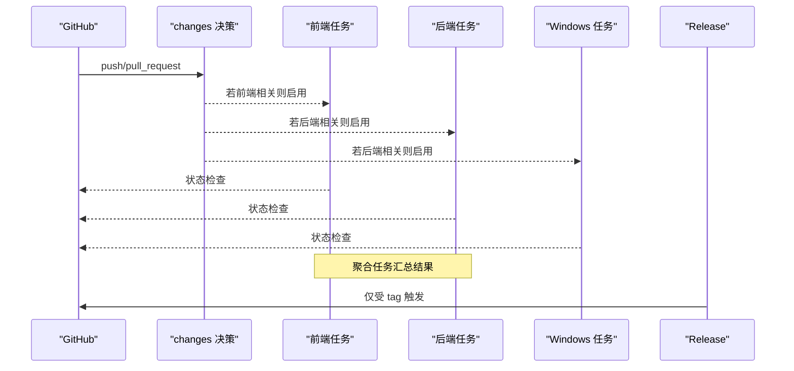
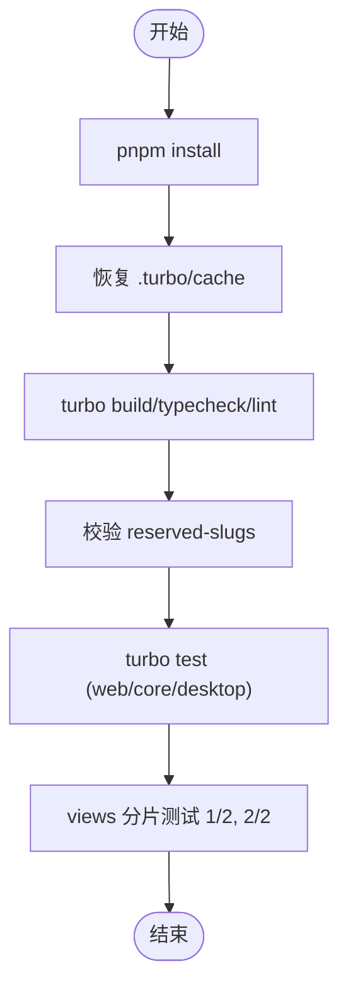
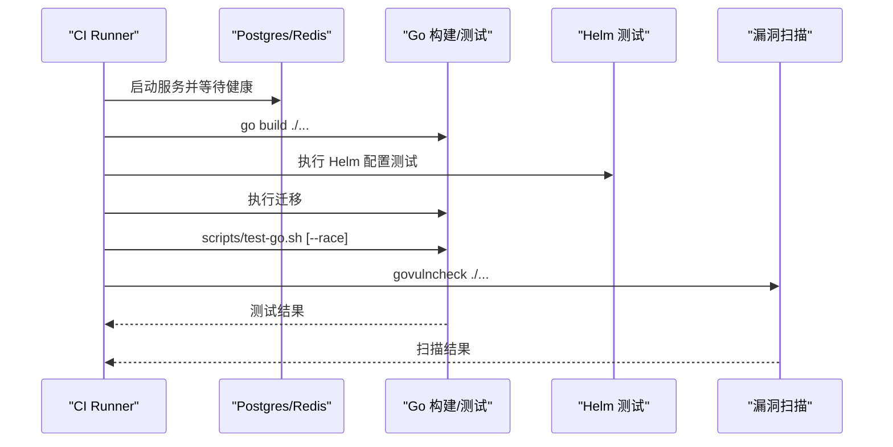
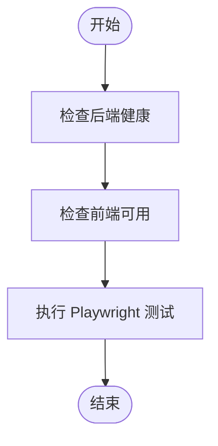
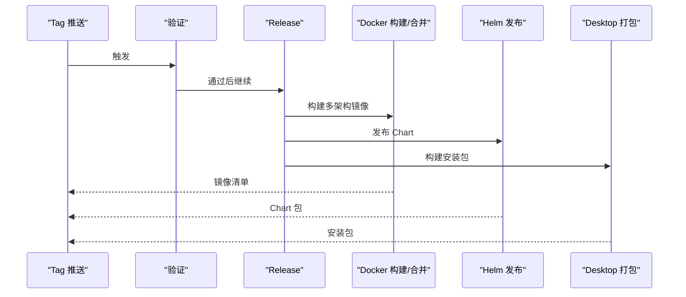
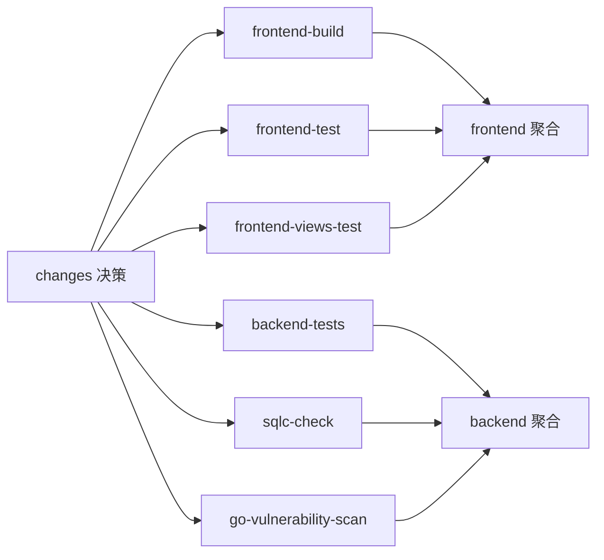
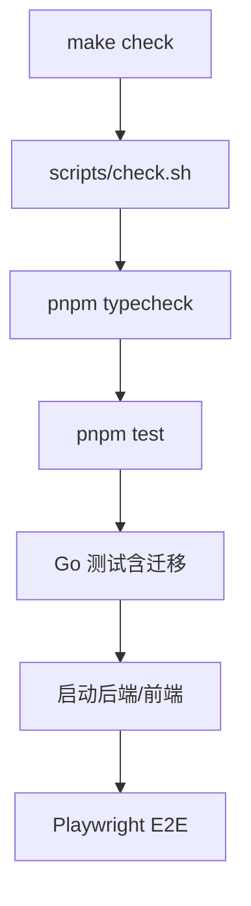

# 持续集成

<cite>
**本文引用的文件**
- [ci.yml](file://.github/workflows/ci.yml)
- [release.yml](file://.github/workflows/release.yml)
- [turbo.json](file://turbo.json)
- [package.json](file://package.json)
- [Makefile](file://Makefile)
- [check.sh](file://scripts/check.sh)
- [test-go.sh](file://scripts/test-go.sh)
- [playwright.config.ts](file://playwright.config.ts)
- [apps/web/vitest.config.ts](file://apps/web/vitest.config.ts)
- [apps/desktop/vitest.config.ts](file://apps/desktop/vitest.config.ts)
- [apps/docs/vitest.config.ts](file://apps/docs/vitest.config.ts)
- [apps/mobile/vitest.config.ts](file://apps/mobile/vitest.config.ts)
- [.goreleaser.yml](file://.goreleaser.yml)
</cite>

## 目录
1. [简介](#简介)
2. [项目结构](#项目结构)
3. [核心组件](#核心组件)
4. [架构总览](#架构总览)
5. [详细组件分析](#详细组件分析)
6. [依赖关系分析](#依赖关系分析)
7. [性能考虑](#性能考虑)
8. [故障排除指南](#故障排除指南)
9. [结论](#结论)
10. [附录](#附录)

## 简介
本文件面向 Multica 多语言项目的持续集成（CI）与发布流水线，覆盖 GitHub Actions 工作流、Go 后端与 TypeScript 前端的构建/测试策略、测试并行化与缓存、本地 CI 模拟、报告与覆盖率配置建议，以及常见问题排查与优化建议。目标是帮助开发者在提交前快速验证代码质量，并在 CI 中高效执行跨端任务。

## 项目结构
仓库采用 Monorepo 组织：前端使用 pnpm workspaces + Turborepo，后端为 Go 服务，E2E 使用 Playwright，桌面端基于 Electron，移动端通过独立工作流验证。CI 通过路径过滤决定运行哪些任务，避免无关变更触发重型任务。

**图表来源**
- [ci.yml:23-165](file://.github/workflows/ci.yml#L23-L165)
- [ci.yml:167-193](file://.github/workflows/ci.yml#L167-L193)
- [ci.yml:202-448](file://.github/workflows/ci.yml#L202-L448)
- [ci.yml:450-590](file://.github/workflows/ci.yml#L450-L590)
- [ci.yml:592-789](file://.github/workflows/ci.yml#L592-L789)
- [ci.yml:791-800](file://.github/workflows/ci.yml#L791-L800)

**章节来源**
- [ci.yml:1-165](file://.github/workflows/ci.yml#L1-L165)
- [turbo.json:1-84](file://turbo.json#L1-L84)
- [package.json:1-65](file://package.json#L1-L65)

## 核心组件
- 路径过滤与决策：根据变更路径启用 frontend/backend/sqlc/images 等任务，减少不必要执行。
- 前端流水线：构建、类型检查、Lint、Knip（告警）、reserved-slugs 一致性校验、Vitest 单元与分片 views 测试。
- 后端流水线：Go 构建、Helm 配置测试、入口信号测试、迁移执行、Go 测试包装器校验、全量测试（含 race）、漏洞扫描。
- Windows 专项：进程树隔离、参数传递、句柄/共享锁、可执行路径解析等场景验证。
- 发布流水线：标签校验、GoReleaser 打包、Docker 多架构镜像构建与合并、Helm Chart 发布、Desktop 安装包构建。

**章节来源**
- [ci.yml:23-165](file://.github/workflows/ci.yml#L23-L165)
- [ci.yml:202-448](file://.github/workflows/ci.yml#L202-L448)
- [ci.yml:450-590](file://.github/workflows/ci.yml#L450-L590)
- [ci.yml:592-789](file://.github/workflows/ci.yml#L592-L789)
- [release.yml:16-112](file://.github/workflows/release.yml#L16-L112)
- [release.yml:117-390](file://.github/workflows/release.yml#L117-L390)
- [release.yml:392-454](file://.github/workflows/release.yml#L392-L454)

## 架构总览
下图展示从事件到各任务再到聚合门的完整流程，体现“先判断再执行”的轻量化设计。

**图表来源**
- [ci.yml:3-12](file://.github/workflows/ci.yml#L3-L12)
- [ci.yml:23-165](file://.github/workflows/ci.yml#L23-L165)
- [ci.yml:422-448](file://.github/workflows/ci.yml#L422-L448)
- [ci.yml:571-590](file://.github/workflows/ci.yml#L571-L590)
- [release.yml:3-14](file://.github/workflows/release.yml#L3-L14)

## 详细组件分析

### 前端构建与测试（TypeScript/Next.js/Electron）
- 构建阶段：安装依赖、恢复 Turborepo 缓存、执行 build/typecheck/lint，并校验 reserved-slugs 与 UI 通配导出。
- 测试阶段：web/core/desktop 单元测试；views 套件按分片在两个 runner 上并行执行，提升吞吐。
- 缓存策略：Turborepo 缓存键包含 OS、架构、Node 版本与 commit SHA，确保不同环境不串用缓存；每个分片拥有独立 key 前缀避免并发写冲突。
- 工具链：Vitest 在各 app 中分别配置，jsdom/node 环境按需选择。

**图表来源**
- [ci.yml:202-283](file://.github/workflows/ci.yml#L202-L283)
- [ci.yml:313-363](file://.github/workflows/ci.yml#L313-L363)
- [ci.yml:364-421](file://.github/workflows/ci.yml#L364-L421)
- [turbo.json:23-82](file://turbo.json#L23-L82)
- [apps/web/vitest.config.ts:1-20](file://apps/web/vitest.config.ts#L1-L20)
- [apps/desktop/vitest.config.ts:1-19](file://apps/desktop/vitest.config.ts#L1-L19)
- [apps/docs/vitest.config.ts:1-16](file://apps/docs/vitest.config.ts#L1-L16)
- [apps/mobile/vitest.config.ts:1-28](file://apps/mobile/vitest.config.ts#L1-L28)

**章节来源**
- [ci.yml:202-448](file://.github/workflows/ci.yml#L202-L448)
- [turbo.json:1-84](file://turbo.json#L1-L84)
- [package.json:6-30](file://package.json#L6-L30)

### 后端构建与测试（Go）
- 环境与依赖：启动 Postgres/Redis 服务容器，设置 DATABASE_URL/REDIS_TEST_URL。
- 构建与迁移：编译 Go 包、执行数据库迁移。
- 测试：通过脚本统一入口，排除 pkg/agent 单独以低并行度运行，避免阻塞子进程测试；支持 --race 检测竞态。
- 安全与合规：Helm 配置测试、入口信号测试、makefile 产物命名测试、govulncheck 漏洞扫描。
- Windows 专项：针对进程树、参数传递、句柄/共享锁、可执行路径解析等进行真实平台验证。

**图表来源**
- [ci.yml:450-545](file://.github/workflows/ci.yml#L450-L545)
- [ci.yml:546-590](file://.github/workflows/ci.yml#L546-L590)
- [test-go.sh:1-42](file://scripts/test-go.sh#L1-L42)

**章节来源**
- [ci.yml:450-789](file://.github/workflows/ci.yml#L450-L789)
- [test-go.sh:1-42](file://scripts/test-go.sh#L1-L42)

### 端到端测试（Playwright）
- 本地/CI 均要求前后端已启动，Playwright 不自动拉起服务以避免端口冲突。
- 浏览器项目固定为 Chromium，headless 模式，超时与重试策略明确。

**图表来源**
- [playwright.config.ts:1-22](file://playwright.config.ts#L1-L22)
- [check.sh:104-136](file://scripts/check.sh#L104-L136)

**章节来源**
- [playwright.config.ts:1-22](file://playwright.config.ts#L1-L22)
- [check.sh:1-136](file://scripts/check.sh#L1-L136)

### 发布流水线（Release）
- 标签校验：仅接受 vX.Y.Z[-suffix] 且非 dirty 标签。
- 验证阶段：Go 测试（含 race）、漏洞扫描（可通过变量豁免）。
- 制品构建：GoReleaser 生成 CLI 归档并发布 Homebrew Tap；Docker 多架构镜像构建与合并；Helm Chart 发布至 OCI Registry；Desktop 安装包构建上传 Release。

**图表来源**
- [release.yml:16-112](file://.github/workflows/release.yml#L16-L112)
- [release.yml:117-390](file://.github/workflows/release.yml#L117-L390)
- [release.yml:392-454](file://.github/workflows/release.yml#L392-L454)
- [.goreleaser.yml:1-86](file://.goreleaser.yml#L1-L86)

**章节来源**
- [release.yml:1-454](file://.github/workflows/release.yml#L1-L454)
- [.goreleaser.yml:1-86](file://.goreleaser.yml#L1-L86)

## 依赖关系分析
- 任务耦合：所有任务依赖 changes 决策输出；前端聚合 job 汇总三个子任务结果；后端聚合 job 汇总测试、SQLC、漏洞扫描结果。
- 外部依赖：Postgres/Redis 作为服务容器；Helm 用于 Chart 测试与发布；Docker Buildx 用于多架构镜像；GoReleaser 用于 CLI 打包。
- 缓存依赖：Turborepo 缓存键绑定 Node 版本与 commit SHA；Go 模块缓存基于 server/go.sum。

**图表来源**
- [ci.yml:23-165](file://.github/workflows/ci.yml#L23-L165)
- [ci.yml:422-448](file://.github/workflows/ci.yml#L422-L448)
- [ci.yml:571-590](file://.github/workflows/ci.yml#L571-L590)

**章节来源**
- [ci.yml:23-165](file://.github/workflows/ci.yml#L23-L165)
- [ci.yml:422-590](file://.github/workflows/ci.yml#L422-L590)

## 性能考虑
- 路径过滤：仅在相关路径变更时运行对应任务，避免全量执行。
- 任务拆分：前端 views 测试拆分为两路并行；后端 agent 测试限制并行度，防止子进程饥饿。
- 缓存策略：Turborepo 缓存键包含 OS/架构/Node/commit；Go 模块缓存基于 go.sum；Docker 构建使用 GHA 缓存作用域。
- 资源利用：前端构建与测试分离 runner，降低 CPU 竞争；Windows 专用任务在独立 runner 执行。

[本节为通用指导，无需特定文件引用]

## 故障排除指南
- 前端构建慢或失败
  - 检查 Turborepo 缓存是否命中；确认 Node 版本一致；查看 .turbo/cache 键是否因 commit 变化失效。
  - 参考：[ci.yml:202-283](file://.github/workflows/ci.yml#L202-L283)、[turbo.json:23-82](file://turbo.json#L23-L82)
- 视图测试不稳定
  - 确认分片参数正确传递；检查分片缓存键前缀是否唯一；必要时增加重试或调整分片粒度。
  - 参考：[ci.yml:364-421](file://.github/workflows/ci.yml#L364-L421)
- 后端测试超时或资源不足
  - 检查 Postgres/Redis 健康探针；确认迁移成功；对 agent 测试保持 -p 2 -parallel 2 的限制。
  - 参考：[ci.yml:450-545](file://.github/workflows/ci.yml#L450-L545)、[test-go.sh:28-42](file://scripts/test-go.sh#L28-L42)
- Windows 测试跳过或失败
  - 确认 -run 模式匹配；检查 PowerShell/Chocolatey 环境；关注 Job Object 与共享锁行为。
  - 参考：[ci.yml:592-789](file://.github/workflows/ci.yml#L592-L789)
- 发布失败
  - 校验标签格式；确认 secrets 与权限；检查 GoReleaser 与 Docker 构建缓存作用域。
  - 参考：[release.yml:16-112](file://.github/workflows/release.yml#L16-L112)、[release.yml:117-390](file://.github/workflows/release.yml#L117-L390)

**章节来源**
- [ci.yml:202-789](file://.github/workflows/ci.yml#L202-L789)
- [test-go.sh:1-42](file://scripts/test-go.sh#L1-L42)
- [release.yml:16-390](file://.github/workflows/release.yml#L16-L390)

## 结论
该 CI 体系通过路径过滤、任务拆分、缓存优化和平台专项测试，在保证质量的同时显著缩短反馈时间。发布流水线将 CLI、镜像、Chart 与桌面安装包纳入统一流程，配合严格的标签与安全扫描，保障交付可靠性。建议在 PR 中优先关注变更路径对应的任务，结合本地 check 流程提前发现问题。

[本节为总结性内容，无需特定文件引用]

## 附录

### 本地 CI 模拟方法
- 一键验证：执行根级脚本，依次进行类型检查、单元测试、Go 测试、启动服务并运行 E2E。
- 关键步骤：确保环境变量与数据库可用；迁移数据库；启动前后端；等待就绪后执行 Playwright。

**图表来源**
- [Makefile:232-235](file://Makefile#L232-L235)
- [check.sh:1-136](file://scripts/check.sh#L1-L136)

**章节来源**
- [Makefile:232-235](file://Makefile#L232-L235)
- [check.sh:1-136](file://scripts/check.sh#L1-L136)

### 测试并行化配置要点
- Turborepo：通过 tasks 定义依赖与输出，test 任务依赖 ^cache-inputs 保证哈希完整性；views 测试通过 --shard 分片。
- Go 测试：统一入口脚本排除 agent 包单独执行，限制并行度避免子进程竞争。
- Playwright：单 worker，避免并发导致的资源争用。

**章节来源**
- [turbo.json:23-82](file://turbo.json#L23-L82)
- [ci.yml:364-421](file://.github/workflows/ci.yml#L364-L421)
- [test-go.sh:28-42](file://scripts/test-go.sh#L28-L42)
- [playwright.config.ts:4-21](file://playwright.config.ts#L4-L21)

### 测试报告与覆盖率统计（建议）
- 前端单元测试：可在 Vitest 配置中添加 coverage 选项，生成 HTML 报告并通过 CI 上传工件以便趋势分析。
- Go 测试：可使用 go test -coverprofile 生成覆盖率文件，结合 CI 上传与历史对比。
- E2E：Playwright 支持 JSON/HTML 报告，建议持久化并关联 PR 信息。

[本节为通用建议，未直接分析具体实现]