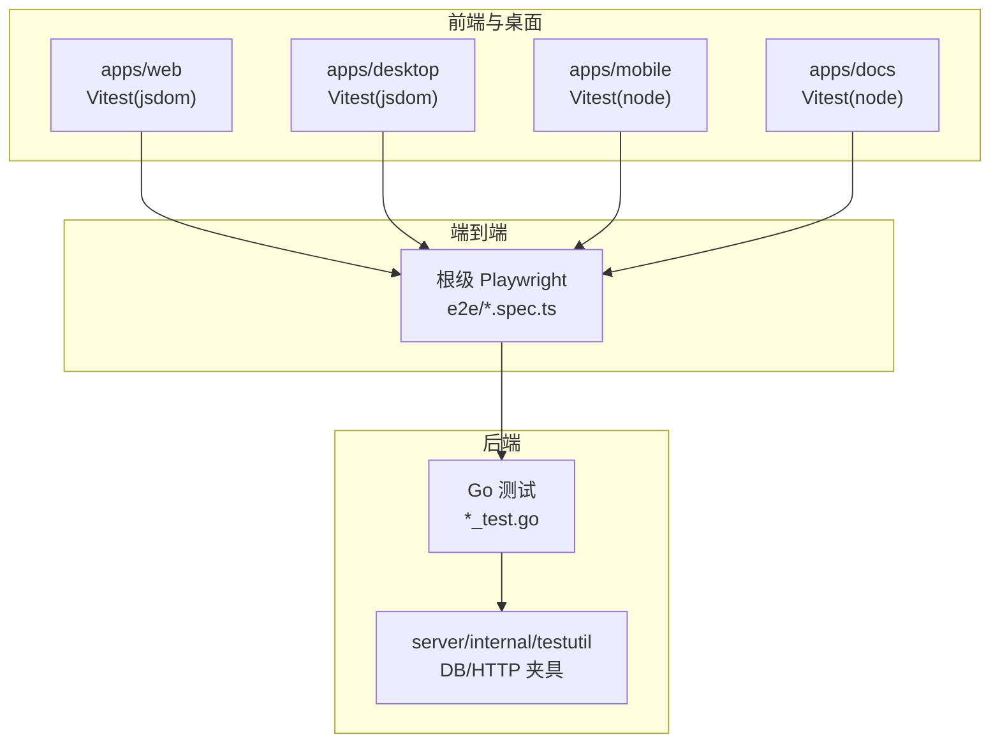
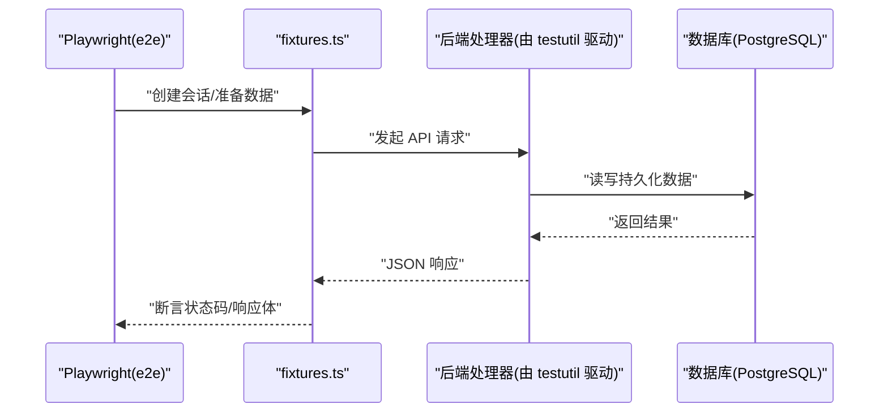
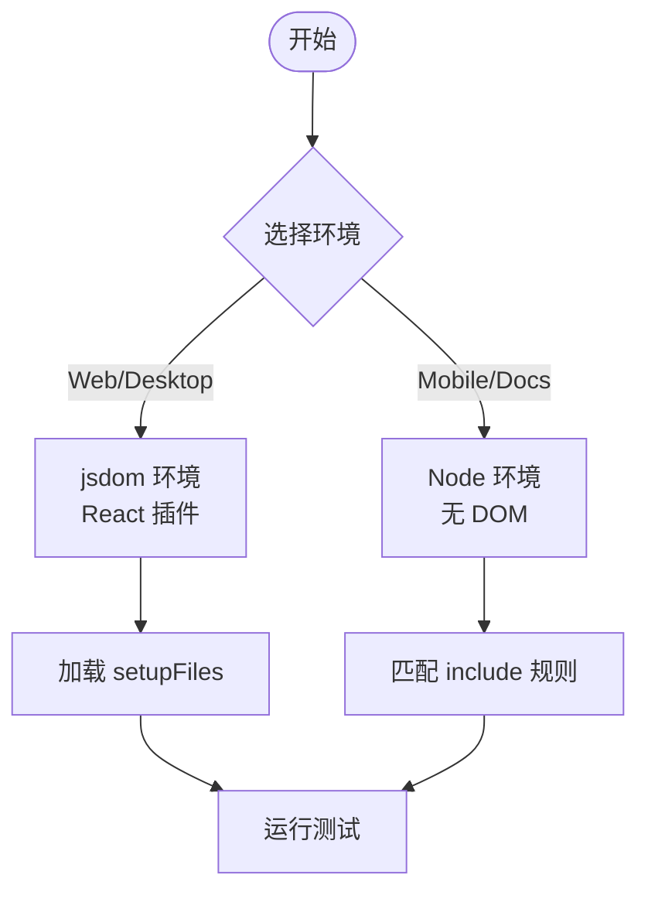
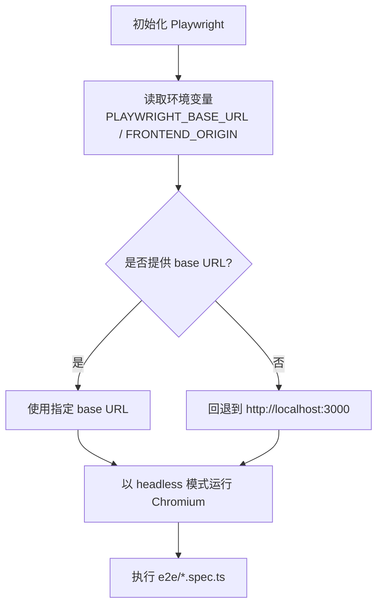
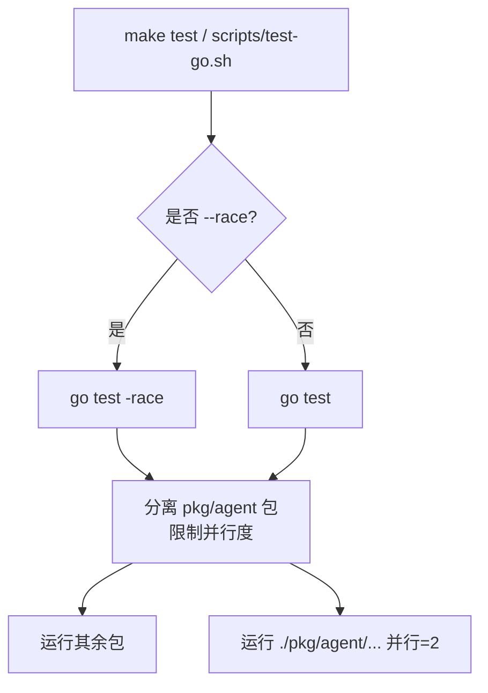
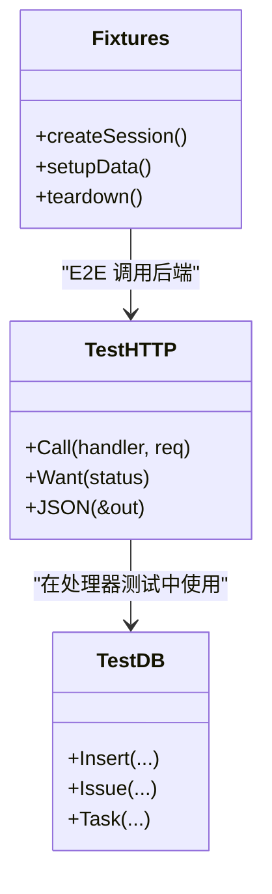
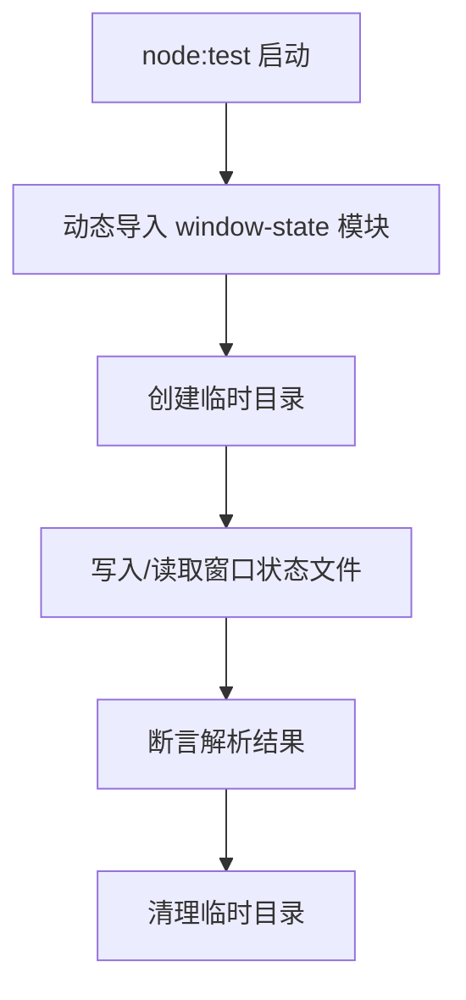
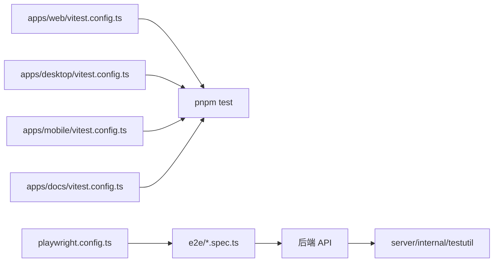

# 测试工具

<cite>
**本文引用的文件**
- [playwright.config.ts](file://playwright.config.ts)
- [apps/web/vitest.config.ts](file://apps/web/vitest.config.ts)
- [apps/desktop/vitest.config.ts](file://apps/desktop/vitest.config.ts)
- [apps/mobile/vitest.config.ts](file://apps/mobile/vitest.config.ts)
- [apps/docs/vitest.config.ts](file://apps/docs/vitest.config.ts)
- [e2e/fixtures.ts](file://e2e/fixtures.ts)
- [server/internal/testutil/db.go](file://server/internal/testutil/db.go)
- [server/internal/testutil/http.go](file://server/internal/testutil/http.go)
- [scripts/test-go.sh](file://scripts/test-go.sh)
- [Makefile](file://Makefile)
- [CLAUDE.md](file://CLAUDE.md)
- [apps/desktop/src/main/window-state.node-test.mjs](file://apps/desktop/src/main/window-state.node-test.mjs)
</cite>

## 目录
1. [简介](#简介)
2. [项目结构](#项目结构)
3. [核心组件](#核心组件)
4. [架构总览](#架构总览)
5. [详细组件分析](#详细组件分析)
6. [依赖关系分析](#依赖关系分析)
7. [性能考虑](#性能考虑)
8. [故障排查指南](#故障排查指南)
9. [结论](#结论)
10. [附录](#附录)

## 简介
本文件面向 Multica 项目的测试工具链，覆盖 Go 后端、前端与桌面端、移动端以及端到端（E2E）的测试框架与辅助能力。重点包括：
- 测试框架：Go testing、Vitest、Playwright
- 测试辅助：数据库夹具、API 客户端封装、文件系统操作
- 配置管理：环境变量、并行执行、资源隔离
- 性能测试：基准、内存泄漏检测、并发压力测试
- 自定义扩展：扩展现有测试框架能力
- 维护与升级策略：版本管理与兼容性

## 项目结构
Multica 采用多包/多应用工作区组织，测试分布在各自应用的配置中，并通过根级 Playwright 配置统一 E2E 入口；后端通过脚本统一运行 Go 测试。

图表来源
- [playwright.config.ts:1-22](file://playwright.config.ts#L1-L22)
- [apps/web/vitest.config.ts:1-20](file://apps/web/vitest.config.ts#L1-L20)
- [apps/desktop/vitest.config.ts:1-20](file://apps/desktop/vitest.config.ts#L1-L20)
- [apps/mobile/vitest.config.ts:1-29](file://apps/mobile/vitest.config.ts#L1-L29)
- [apps/docs/vitest.config.ts:1-17](file://apps/docs/vitest.config.ts#L1-L17)
- [server/internal/testutil/db.go](file://server/internal/testutil/db.go)
- [server/internal/testutil/http.go](file://server/internal/testutil/http.go)

章节来源
- [playwright.config.ts:1-22](file://playwright.config.ts#L1-L22)
- [apps/web/vitest.config.ts:1-20](file://apps/web/vitest.config.ts#L1-L20)
- [apps/desktop/vitest.config.ts:1-20](file://apps/desktop/vitest.config.ts#L1-L20)
- [apps/mobile/vitest.config.ts:1-29](file://apps/mobile/vitest.config.ts#L1-L29)
- [apps/docs/vitest.config.ts:1-17](file://apps/docs/vitest.config.ts#L1-L17)

## 核心组件
- Vitest（前端/桌面/文档/移动）
  - Web/桌面使用 jsdom 环境，提供 DOM 模拟与 React 渲染能力；移动/文档使用 node 环境，专注纯函数与数据层逻辑。
  - 各应用通过独立的 vitest.config.ts 定义 include/exclude、别名与环境。
- Playwright（端到端）
  - 根级 playwright.config.ts 指定测试目录、超时、浏览器项目、基础 URL 等；不自动启动服务，要求外部预先运行。
- Go 测试
  - 通过 scripts/test-go.sh 统一运行，支持 --race 并发检测，并对 agent 相关包限制并行度以避免子进程饥饿。
  - 使用 server/internal/testutil 提供的 DB 夹具与 HTTP 驱动简化断言。

章节来源
- [apps/web/vitest.config.ts:1-20](file://apps/web/vitest.config.ts#L1-L20)
- [apps/desktop/vitest.config.ts:1-20](file://apps/desktop/vitest.config.ts#L1-L20)
- [apps/mobile/vitest.config.ts:1-29](file://apps/mobile/vitest.config.ts#L1-L29)
- [apps/docs/vitest.config.ts:1-17](file://apps/docs/vitest.config.ts#L1-L17)
- [playwright.config.ts:1-22](file://playwright.config.ts#L1-L22)
- [scripts/test-go.sh:1-42](file://scripts/test-go.sh#L1-L42)
- [server/internal/testutil/db.go](file://server/internal/testutil/db.go)
- [server/internal/testutil/http.go](file://server/internal/testutil/http.go)

## 架构总览
下图展示从 E2E 到后端处理器的调用链，以及测试夹具如何参与请求构造与响应断言。

图表来源
- [playwright.config.ts:1-22](file://playwright.config.ts#L1-L22)
- [e2e/fixtures.ts](file://e2e/fixtures.ts)
- [server/internal/testutil/http.go](file://server/internal/testutil/http.go)
- [server/internal/testutil/db.go](file://server/internal/testutil/db.go)

## 详细组件分析

### Vitest 配置与使用
- Web 应用
  - 使用 jsdom 环境，启用全局 API，加载 setupFiles，包含所有 .test.{ts,tsx}。
  - 路径别名 @ 指向根目录，@core 指向 core 目录。
- Desktop 应用
  - 同样使用 jsdom，额外包含 scripts 下的 .test.mjs，设置 passWithNoTests。
  - 别名 @ 指向 renderer 源码目录。
- Mobile 应用
  - 仅 Node 环境，聚焦 lib 与 data 下的纯函数和数据层逻辑，避免引入 jsdom/RN 渲染器。
- Docs 应用
  - Node 环境，排除 node_modules/.next/.source，便于文档站点测试。

图表来源
- [apps/web/vitest.config.ts:1-20](file://apps/web/vitest.config.ts#L1-L20)
- [apps/desktop/vitest.config.ts:1-20](file://apps/desktop/vitest.config.ts#L1-L20)
- [apps/mobile/vitest.config.ts:1-29](file://apps/mobile/vitest.config.ts#L1-L29)
- [apps/docs/vitest.config.ts:1-17](file://apps/docs/vitest.config.ts#L1-L17)

章节来源
- [apps/web/vitest.config.ts:1-20](file://apps/web/vitest.config.ts#L1-L20)
- [apps/desktop/vitest.config.ts:1-20](file://apps/desktop/vitest.config.ts#L1-L20)
- [apps/mobile/vitest.config.ts:1-29](file://apps/mobile/vitest.config.ts#L1-L29)
- [apps/docs/vitest.config.ts:1-17](file://apps/docs/vitest.config.ts#L1-L17)

### Playwright E2E 配置
- 测试目录：./e2e
- 超时：60s
- 工作进程：1（串行），重试：0
- 浏览器项目：chromium
- 基础 URL：优先 PLAYWRIGHT_BASE_URL，其次 FRONTEND_ORIGIN，默认 localhost:3000
- 不自动启动服务器，需外部提前运行

图表来源
- [playwright.config.ts:1-22](file://playwright.config.ts#L1-L22)

章节来源
- [playwright.config.ts:1-22](file://playwright.config.ts#L1-L22)

### Go 测试运行与并发控制
- 统一入口：scripts/test-go.sh
  - 支持 --race 开启竞态检测
  - 排除 pkg/agent 包在主循环中并行，单独以低并行度运行，避免子进程阻塞
- Makefile 提供 db-reset/db-up/down 等目标，配合 docker compose 管理 PostgreSQL
- CLAUDE 规范强调：
  - 使用 internal/testutil 的 DB 夹具与 HTTP 驱动
  - 默认测试不得执行用户安装的 agent CLI
  - 真实 agent 冒烟测试需构建标签与显式环境变量授权

图表来源
- [scripts/test-go.sh:1-42](file://scripts/test-go.sh#L1-L42)
- [Makefile:239-266](file://Makefile#L239-L266)
- [CLAUDE.md:216-232](file://CLAUDE.md#L216-L232)

章节来源
- [scripts/test-go.sh:1-42](file://scripts/test-go.sh#L1-L42)
- [Makefile:239-266](file://Makefile#L239-L266)
- [CLAUDE.md:216-232](file://CLAUDE.md#L216-L232)

### 数据库测试夹具与 API 客户端
- DB 夹具（server/internal/testutil/db.go）
  - 提供结构化数据构造与插入，避免手写 INSERT/DELETE 样板代码
  - 与 sqlc 生成代码协同，保证类型安全
- HTTP 驱动（server/internal/testutil/http.go）
  - 封装请求构造、状态码与 JSON 响应断言，减少重复样板
- E2E fixtures（e2e/fixtures.ts）
  - 为 Playwright 用例提供统一的 API 客户端封装，用于登录、建库、清理等前后置步骤

图表来源
- [server/internal/testutil/db.go](file://server/internal/testutil/db.go)
- [server/internal/testutil/http.go](file://server/internal/testutil/http.go)
- [e2e/fixtures.ts](file://e2e/fixtures.ts)

章节来源
- [server/internal/testutil/db.go](file://server/internal/testutil/db.go)
- [server/internal/testutil/http.go](file://server/internal/testutil/http.go)
- [e2e/fixtures.ts](file://e2e/fixtures.ts)

### 文件系统操作与独立 Node 测试
- 桌面端提供独立 Node 测试 harness（window-state.node-test.mjs）
  - 使用 node:test 与 assert，无需 vitest/pnpm
  - 通过 mkdtempSync/rmSync 进行临时目录隔离，确保测试间互不干扰
  - 动态 import 被测模块，验证窗口状态解析与持久化

图表来源
- [apps/desktop/src/main/window-state.node-test.mjs:1-66](file://apps/desktop/src/main/window-state.node-test.mjs#L1-L66)

章节来源
- [apps/desktop/src/main/window-state.node-test.mjs:1-66](file://apps/desktop/src/main/window-state.node-test.mjs#L1-L66)

## 依赖关系分析
- 前端/桌面/文档/移动均依赖 Vitest，但环境与 include 不同，形成“同框架、多配置”的解耦结构。
- E2E 通过 Playwright 统一编排跨端流程，依赖前端运行实例与后端 API。
- Go 测试依赖 internal/testutil 提供的夹具，降低对具体实现细节的耦合。
- Makefile 作为顶层入口，协调数据库生命周期与开发环境。

图表来源
- [apps/web/vitest.config.ts:1-20](file://apps/web/vitest.config.ts#L1-L20)
- [apps/desktop/vitest.config.ts:1-20](file://apps/desktop/vitest.config.ts#L1-L20)
- [apps/mobile/vitest.config.ts:1-29](file://apps/mobile/vitest.config.ts#L1-L29)
- [apps/docs/vitest.config.ts:1-17](file://apps/docs/vitest.config.ts#L1-L17)
- [playwright.config.ts:1-22](file://playwright.config.ts#L1-L22)
- [server/internal/testutil/http.go](file://server/internal/testutil/http.go)

章节来源
- [apps/web/vitest.config.ts:1-20](file://apps/web/vitest.config.ts#L1-L20)
- [apps/desktop/vitest.config.ts:1-20](file://apps/desktop/vitest.config.ts#L1-L20)
- [apps/mobile/vitest.config.ts:1-29](file://apps/mobile/vitest.config.ts#L1-L29)
- [apps/docs/vitest.config.ts:1-17](file://apps/docs/vitest.config.ts#L1-L17)
- [playwright.config.ts:1-22](file://playwright.config.ts#L1-L22)
- [server/internal/testutil/http.go](file://server/internal/testutil/http.go)

## 性能考虑
- 并发与并行
  - Go 测试：scripts/test-go.sh 对 pkg/agent 包限制并行度，避免子进程饥饿；--race 可开启竞态检测。
  - Playwright：workers=1 串行执行，retries=0，适合稳定复现问题；如需加速可在 CI 中拆分 spec 或增加 workers。
- 环境开销
  - Vitest：jsdom 环境每文件约 0.8s 启动成本，纯函数测试应使用 node 环境并标注 @vitest-environment node。
- 资源隔离
  - 数据库：通过 Makefile 的 db-reset/db-up/down 管理本地 PostgreSQL，避免共享状态污染。
  - 文件系统：桌面端独立 Node 测试使用临时目录隔离，防止跨测试污染。
- 基准与内存
  - Go：可使用 go test -bench 进行基准测试；结合 pprof 进行 CPU/内存剖析定位热点与泄漏。
  - 前端：可通过 Vitest 集成覆盖率与性能指标插件（如 v8 快照）评估渲染与交互性能。
- 压力测试
  - 使用 Playwright 并发或多实例模拟多用户场景；结合后端压测工具（如 wrk/k6）对 API 进行负载测试。

[本节为通用指导，不直接分析具体文件]

## 故障排查指南
- 常见问题
  - 端口冲突：Playwright 未自动启动服务，需确认前端/后端已运行且端口可用。
  - 数据库连接失败：检查 DATABASE_URL 与 docker compose 中的 PostgreSQL 容器状态。
  - 测试不稳定：Playwright retries=0，建议先固定单 worker 复现，再逐步调整并发。
- 调试技巧
  - Go：--race 检测竞态；使用 testutil.Call(...).Want(...) 打印请求行、状态码与响应体，快速定位差异。
  - 前端：在 vitest.config.ts 中启用 UI 或日志输出；必要时将 jsdom 切换为 node 环境缩小范围。
  - E2E：在 Playwright 中打开 headed 模式观察页面行为；利用 fixtures 中的日志与断言信息。
- 清理与恢复
  - 使用 Makefile 的 db-reset 重置数据库并重新迁移；db-down 停止容器但不删除卷。

章节来源
- [playwright.config.ts:1-22](file://playwright.config.ts#L1-L22)
- [Makefile:239-266](file://Makefile#L239-L266)
- [server/internal/testutil/http.go](file://server/internal/testutil/http.go)
- [apps/web/vitest.config.ts:1-20](file://apps/web/vitest.config.ts#L1-L20)

## 结论
本项目通过 Vitest、Playwright 与 Go testing 构建了分层清晰的测试体系：单元/集成测试贴近代码，E2E 覆盖跨端流程，后端夹具与 HTTP 驱动提升稳定性与可读性。通过 Makefile 与脚本统一管理环境与并发，结合严格的规范（如禁止默认执行用户 agent CLI、使用 testutil 夹具），有效降低了维护成本并提升了回归效率。未来可进一步引入基准与压力测试自动化，完善性能基线与容量规划。

[本节为总结，不直接分析具体文件]

## 附录
- 环境变量与配置要点
  - Playwright：PLAYWRIGHT_BASE_URL、FRONTEND_ORIGIN
  - 后端：DATABASE_URL、POSTGRES_*、PORT 等（由 Makefile 导出）
  - 真实 agent 冒烟测试：MULTICA_RUN_REAL_AGENT_SMOKE=1 与构建标签
- 最佳实践
  - 纯函数测试使用 node 环境，避免 jsdom 开销
  - 使用 testutil 夹具与 HTTP 驱动，减少样板代码
  - E2E 使用 fixtures 统一前置/后置，保持用例简洁
- 维护与升级
  - 升级 Vitest/Playwright 时关注 peerDependencies 与 breaking changes
  - 更新 Go 测试脚本与 Makefile 目标，确保兼容新依赖
  - 定期审查 testutil 夹具与 fixtures，保持与业务模型同步

[本节为补充说明，不直接分析具体文件]