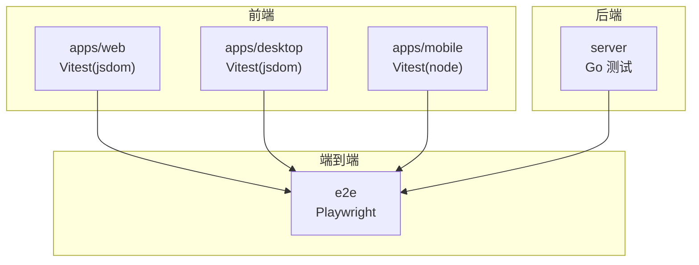
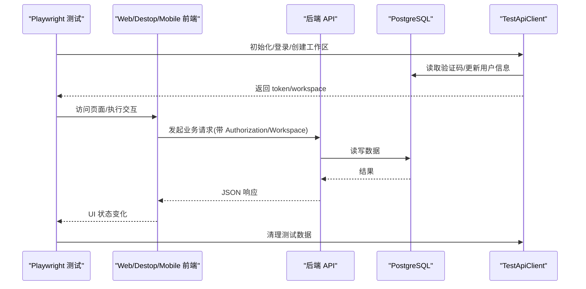
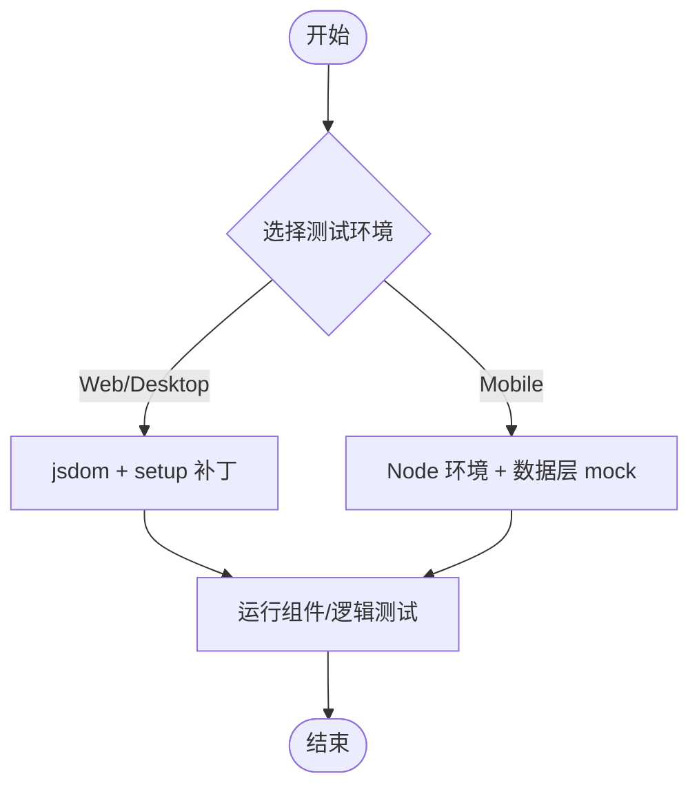
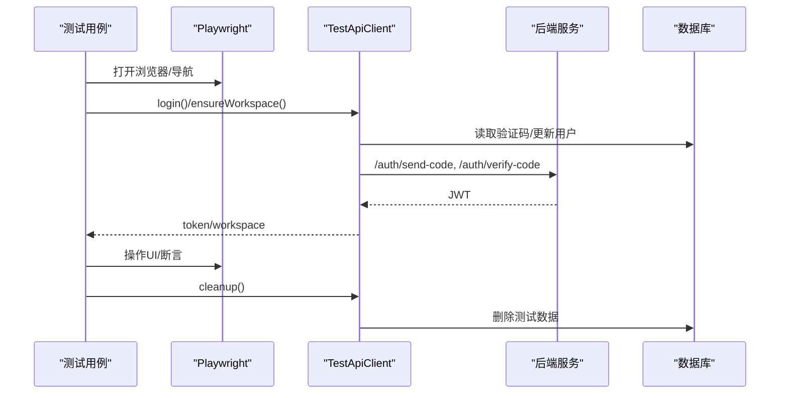
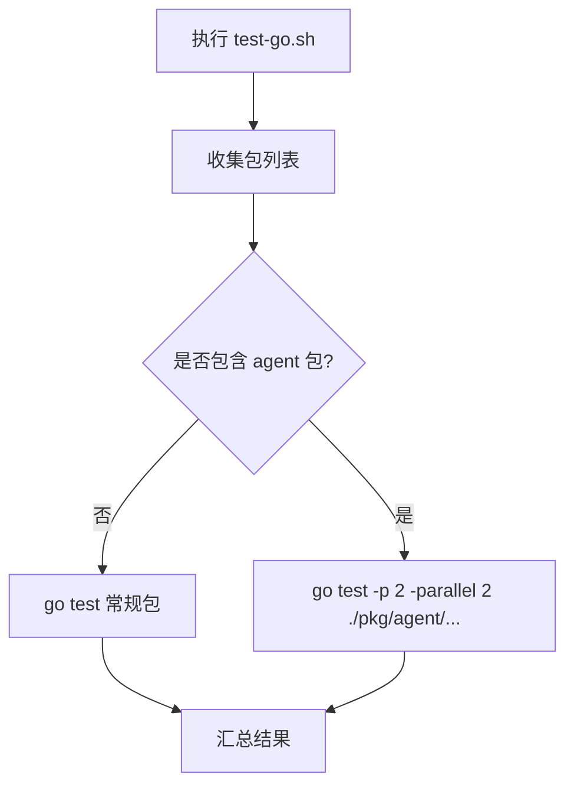
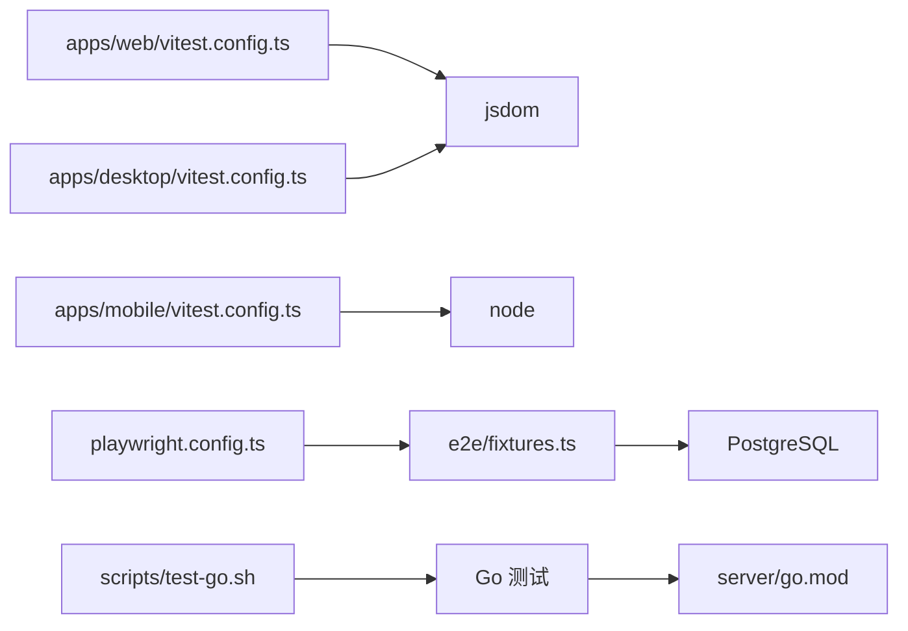

# 测试策略

<cite>
**本文引用的文件**
- [playwright.config.ts](file://playwright.config.ts)
- [apps/web/vitest.config.ts](file://apps/web/vitest.config.ts)
- [apps/desktop/vitest.config.ts](file://apps/desktop/vitest.config.ts)
- [apps/mobile/vitest.config.ts](file://apps/mobile/vitest.config.ts)
- [e2e/fixtures.ts](file://e2e/fixtures.ts)
- [e2e/env.ts](file://e2e/env.ts)
- [apps/web/test/setup.ts](file://apps/web/test/setup.ts)
- [apps/desktop/test/setup.ts](file://apps/desktop/test/setup.ts)
- [scripts/test-go.sh](file://scripts/test-go.sh)
- [server/go.mod](file://server/go.mod)
- [.github/workflows/ci.yml](file://.github/workflows/ci.yml)
- [apps/docs/content/docs/developers/contributing.mdx](file://apps/docs/content/docs/developers/contributing.mdx)
- [CLAUDE.md](file://CLAUDE.md)
</cite>

## 目录
1. [简介](#简介)
2. [项目结构](#项目结构)
3. [核心组件](#核心组件)
4. [架构总览](#架构总览)
5. [详细组件分析](#详细组件分析)
6. [依赖关系分析](#依赖关系分析)
7. [性能考量](#性能考量)
8. [故障排查指南](#故障排查指南)
9. [结论](#结论)
10. [附录](#附录)

## 简介
本测试策略面向 Multica 多语言、多应用（Web、Desktop、Mobile）与 Go 后端的一体化代码库，目标是建立分层清晰的测试体系：单元测试、集成测试与端到端测试。文档覆盖以下要点：
- Go 后端的测试框架与工具链使用方式
- TypeScript 前端的测试方案（组件测试、API 测试、状态管理测试）
- Playwright 端到端测试的配置与场景设计
- 测试数据管理、测试环境搭建与持续集成配置
- 可维护的测试用例编写最佳实践与覆盖率报告建议
- 性能测试与稳定性保障建议

## 项目结构
仓库采用 pnpm workspaces + Turborepo 组织前端，Go 后端位于 server 目录，E2E 测试集中在 e2e 目录，CI 通过 GitHub Actions 编排。

**图表来源**
- [apps/web/vitest.config.ts:1-20](file://apps/web/vitest.config.ts#L1-L20)
- [apps/desktop/vitest.config.ts:1-20](file://apps/desktop/vitest.config.ts#L1-L20)
- [apps/mobile/vitest.config.ts:1-29](file://apps/mobile/vitest.config.ts#L1-L29)
- [playwright.config.ts:1-22](file://playwright.config.ts#L1-L22)

**章节来源**
- [apps/web/vitest.config.ts:1-20](file://apps/web/vitest.config.ts#L1-L20)
- [apps/desktop/vitest.config.ts:1-20](file://apps/desktop/vitest.config.ts#L1-L20)
- [apps/mobile/vitest.config.ts:1-29](file://apps/mobile/vitest.config.ts#L1-L29)
- [playwright.config.ts:1-22](file://playwright.config.ts#L1-L22)

## 核心组件
- 前端测试基础设施
  - Web/Desktop：基于 Vitest + jsdom，提供 DOM 渲染能力与全局补丁（如 ResizeObserver、localStorage）。
  - Mobile：基于 Vitest + node，仅对纯函数和数据层逻辑进行测试，避免引入 DOM/RN 运行时。
- 端到端测试
  - Playwright 统一入口，单工作进程执行，浏览器固定为 Chromium，支持通过环境变量指定 baseURL。
  - 测试夹具 TestApiClient 封装登录、工作区创建、问题数据批量插入与清理等能力。
- 后端测试
  - 标准 Go testing，配合脚本 test-go.sh 统一运行，排除特定包并限制并发；支持 -race 构建。
  - 数据库交互通过 sqlc 生成查询，迁移与索引遵循严格规则。

**章节来源**
- [apps/web/test/setup.ts:1-54](file://apps/web/test/setup.ts#L1-L54)
- [apps/desktop/test/setup.ts:1-61](file://apps/desktop/test/setup.ts#L1-L61)
- [apps/mobile/vitest.config.ts:1-29](file://apps/mobile/vitest.config.ts#L1-L29)
- [playwright.config.ts:1-22](file://playwright.config.ts#L1-L22)
- [e2e/fixtures.ts:1-366](file://e2e/fixtures.ts#L1-L366)
- [scripts/test-go.sh:1-42](file://scripts/test-go.sh#L1-L42)
- [server/go.mod:1-84](file://server/go.mod#L1-L84)

## 架构总览
下图展示从端到端测试到前端与后端的调用链路，以及测试数据准备与清理流程。

**图表来源**
- [e2e/fixtures.ts:48-366](file://e2e/fixtures.ts#L48-L366)
- [playwright.config.ts:1-22](file://playwright.config.ts#L1-L22)

## 详细组件分析

### 前端单元测试（Web/Desktop/Mobile）
- 环境与工具
  - Web/Desktop：jsdom 环境，启用 globals，加载 setup 文件以补齐 jsdom 缺失能力（ResizeObserver、elementFromPoint、localStorage 等）。
  - Mobile：node 环境，仅测试纯函数与无 DOM 的数据层逻辑，要求 mock @/data/api 以避免触发原生 fetch。
- 模块边界与约定
  - packages/views 测试不得 mock next/* 或 react-router-dom。
  - 共享 Zustand store 需以 callable-store 形状进行 mock。
  - 需要无 DOM 的测试使用 // @vitest-environment node。

**图表来源**
- [apps/web/vitest.config.ts:1-20](file://apps/web/vitest.config.ts#L1-L20)
- [apps/desktop/vitest.config.ts:1-20](file://apps/desktop/vitest.config.ts#L1-L20)
- [apps/mobile/vitest.config.ts:1-29](file://apps/mobile/vitest.config.ts#L1-L29)
- [apps/web/test/setup.ts:1-54](file://apps/web/test/setup.ts#L1-L54)
- [apps/desktop/test/setup.ts:1-61](file://apps/desktop/test/setup.ts#L1-L61)

**章节来源**
- [apps/web/vitest.config.ts:1-20](file://apps/web/vitest.config.ts#L1-L20)
- [apps/desktop/vitest.config.ts:1-20](file://apps/desktop/vitest.config.ts#L1-L20)
- [apps/mobile/vitest.config.ts:1-29](file://apps/mobile/vitest.config.ts#L1-L29)
- [apps/web/test/setup.ts:1-54](file://apps/web/test/setup.ts#L1-L54)
- [apps/desktop/test/setup.ts:1-61](file://apps/desktop/test/setup.ts#L1-L61)
- [CLAUDE.md:216-232](file://CLAUDE.md#L216-L232)

### 前端 API 测试与状态管理测试
- API 测试
  - 在 Web 环境下可通过 Vitest 直接调用已代理的后端接口或使用 TestApiClient 进行 HTTP 级验证。
  - 注意：E2E 中 TestApiClient 使用原始 fetch 与数据库直连完成登录与数据准备，避免构建期耦合。
- 状态管理测试
  - 共享 Zustand store 必须按 callable-store 形状 mock（selectorFn + getState），确保不污染真实状态。
  - 服务端状态由 TanStack Query 管理，客户端状态由 Zustand 管理，二者职责清晰，测试时分别 mock 对应层。

**章节来源**
- [e2e/fixtures.ts:1-366](file://e2e/fixtures.ts#L1-L366)
- [CLAUDE.md:216-232](file://CLAUDE.md#L216-L232)

### 端到端测试（Playwright）
- 配置要点
  - 测试目录 e2e，超时 60s，单 worker，重试 0，浏览器 chromium，headless 模式。
  - baseURL 优先取自 PLAYWRIGHT_BASE_URL，其次 FRONTEND_ORIGIN，默认 localhost:3000。
  - 不自动启动服务器，要求外部服务已就绪，避免端口冲突。
- 数据与环境
  - 通过 e2e/env.ts 加载 .env.worktree 或 .env。
  - TestApiClient 负责登录、工作区创建、批量插入问题数据、清理。
- 典型场景
  - 认证流程：登录页渲染、登录后跳转、未授权重定向、登出重定向。
  - 工作区与问题表：大量数据表格滚动与交互。
  - 插件表面、设置、导航等关键路径。

**图表来源**
- [playwright.config.ts:1-22](file://playwright.config.ts#L1-L22)
- [e2e/env.ts:1-14](file://e2e/env.ts#L1-L14)
- [e2e/fixtures.ts:48-366](file://e2e/fixtures.ts#L48-L366)
- [e2e/auth.spec.ts:1-47](file://e2e/auth.spec.ts#L1-L47)

**章节来源**
- [playwright.config.ts:1-22](file://playwright.config.ts#L1-L22)
- [e2e/env.ts:1-14](file://e2e/env.ts#L1-L14)
- [e2e/fixtures.ts:1-366](file://e2e/fixtures.ts#L1-L366)
- [e2e/auth.spec.ts:1-47](file://e2e/auth.spec.ts#L1-L47)

### 后端测试（Go）
- 运行方式
  - scripts/test-go.sh 统一收集包列表，排除 agent 相关包单独处理，支持 --race 开启竞态检测。
  - 对 pkg/agent 子包限制并行度，避免阻塞子进程驱动的测试。
- 依赖与工具
  - 使用 Chi 路由、pgx 连接 PostgreSQL、sqlc 生成查询。
  - 测试数据通过 internal/testutil 提供的 dbfx 与 Call/Want 风格断言。
- 数据库规则
  - 禁止外键与级联，关系与清理在应用层事务中处理。
  - 每个索引使用 CREATE INDEX CONCURRENTLY，且独立迁移文件。

**图表来源**
- [scripts/test-go.sh:1-42](file://scripts/test-go.sh#L1-L42)
- [server/go.mod:1-84](file://server/go.mod#L1-L84)

**章节来源**
- [scripts/test-go.sh:1-42](file://scripts/test-go.sh#L1-L42)
- [server/go.mod:1-84](file://server/go.mod#L1-L84)
- [CLAUDE.md:216-232](file://CLAUDE.md#L216-L232)

## 依赖关系分析
- 前端各应用通过 Vitest 配置隔离测试环境，Web/Desktop 使用 jsdom，Mobile 使用 node。
- E2E 通过 Playwright 驱动浏览器，依赖 TestApiClient 与数据库直连完成数据准备与清理。
- 后端测试依赖 Go 标准库与第三方库（Chi、pgx、redismock 等），并通过脚本统一管理运行参数。

**图表来源**
- [apps/web/vitest.config.ts:1-20](file://apps/web/vitest.config.ts#L1-L20)
- [apps/desktop/vitest.config.ts:1-20](file://apps/desktop/vitest.config.ts#L1-L20)
- [apps/mobile/vitest.config.ts:1-29](file://apps/mobile/vitest.config.ts#L1-L29)
- [playwright.config.ts:1-22](file://playwright.config.ts#L1-L22)
- [e2e/fixtures.ts:1-366](file://e2e/fixtures.ts#L1-L366)
- [scripts/test-go.sh:1-42](file://scripts/test-go.sh#L1-L42)
- [server/go.mod:1-84](file://server/go.mod#L1-L84)

**章节来源**
- [apps/web/vitest.config.ts:1-20](file://apps/web/vitest.config.ts#L1-L20)
- [apps/desktop/vitest.config.ts:1-20](file://apps/desktop/vitest.config.ts#L1-L20)
- [apps/mobile/vitest.config.ts:1-29](file://apps/mobile/vitest.config.ts#L1-L29)
- [playwright.config.ts:1-22](file://playwright.config.ts#L1-L22)
- [e2e/fixtures.ts:1-366](file://e2e/fixtures.ts#L1-L366)
- [scripts/test-go.sh:1-42](file://scripts/test-go.sh#L1-L42)
- [server/go.mod:1-84](file://server/go.mod#L1-L84)

## 性能考量
- 前端测试
  - 避免不必要的 jsdom 开销：纯逻辑测试使用 node 环境。
  - 合理拆分测试套件，减少重复渲染与全局状态污染。
- 端到端测试
  - 单 worker 执行保证稳定性，必要时按场景拆分项目以提升吞吐。
  - 使用批量数据插入（seedTableIssues）减少 HTTP 往返，缩短测试 Setup 时间。
- 后端测试
  - 使用 -race 检测并发问题，但需控制并行度避免阻塞。
  - 数据库操作尽量在事务内完成，减少锁竞争。

[本节为通用指导，无需具体文件引用]

## 故障排查指南
- 前端测试失败
  - 检查 jsdom 补丁是否生效（ResizeObserver、localStorage）。
  - 确认 vitest 配置 include/exclude 与 alias 是否正确。
- 端到端测试失败
  - 确认 Playwright baseURL 与服务端口一致。
  - 检查 TestApiClient 登录流程与数据库连接字符串。
  - 若出现验证码速率限制，清理 verification_code 记录或使用开发码。
- 后端测试失败
  - 使用 scripts/test-go.sh 统一运行，定位具体包。
  - 检查数据库迁移与索引是否符合并发创建要求。

**章节来源**
- [apps/web/test/setup.ts:1-54](file://apps/web/test/setup.ts#L1-L54)
- [apps/desktop/test/setup.ts:1-61](file://apps/desktop/test/setup.ts#L1-L61)
- [e2e/fixtures.ts:56-114](file://e2e/fixtures.ts#L56-L114)
- [scripts/test-go.sh:1-42](file://scripts/test-go.sh#L1-L42)

## 结论
本策略通过分层测试与统一工具链，确保前端、后端与端到端质量可控。前端以 Vitest 为核心，移动端聚焦数据层；端到端以 Playwright 为主，结合 TestApiClient 实现稳定数据准备与清理；后端以 Go 标准测试与脚本化运行保障稳定性与并发安全。配合 CI 与规范约束，形成闭环的质量保障体系。

[本节为总结性内容，无需具体文件引用]

## 附录

### 测试数据管理
- 使用 TestApiClient 的 seedTableIssues 批量插入问题数据，提升大表格场景的测试效率。
- 所有测试数据在 cleanup 阶段按 workspace 与 ID 集合精确删除，避免污染其他用例。
- 登录流程通过数据库直读验证码，支持开发环境的多账号隔离。

**章节来源**
- [e2e/fixtures.ts:187-342](file://e2e/fixtures.ts#L187-L342)

### 测试环境搭建
- 前端：安装依赖后直接运行 Vitest，Web/Desktop 自动注入 jsdom 补丁。
- 端到端：确保后端与前端服务已启动，设置 PLAYWRIGHT_BASE_URL 或 FRONTEND_ORIGIN。
- 后端：使用 scripts/test-go.sh 运行，必要时添加 --race。

**章节来源**
- [apps/web/vitest.config.ts:1-20](file://apps/web/vitest.config.ts#L1-L20)
- [apps/desktop/vitest.config.ts:1-20](file://apps/desktop/vitest.config.ts#L1-L20)
- [playwright.config.ts:1-22](file://playwright.config.ts#L1-L22)
- [scripts/test-go.sh:1-42](file://scripts/test-go.sh#L1-L42)

### 持续集成配置
- CI 根据变更范围决定前端、后端与 sqlc 验证任务，避免无效执行。
- 前端作业校验 web/desktop 应用与共享包；后端作业编译并测试 server/。
- 建议在 PR 中先运行本地最接近变更的测试集，再提交。

**章节来源**
- [.github/workflows/ci.yml:1-35](file://.github/workflows/ci.yml#L1-L35)
- [apps/docs/content/docs/developers/contributing.mdx:139-185](file://apps/docs/content/docs/developers/contributing.mdx#L139-L185)

### 可维护的测试用例与覆盖率报告
- 可维护性原则
  - 每个产品行为对应一个“主”测试层，避免重复矩阵。
  - 使用共享夹具与断言助手，减少样板代码。
  - 明确职责：组件测试关注 UI 与交互，逻辑测试关注算法与边界。
- 覆盖率建议
  - 前端：使用 Vitest 内置覆盖率（v8 或 istanbul），关注分支与函数覆盖。
  - 后端：使用 go test -cover，结合 coverage profile 生成报告。
  - E2E：覆盖率参考意义有限，重点在于关键路径覆盖与回归防护。

**章节来源**
- [CLAUDE.md:216-232](file://CLAUDE.md#L216-L232)
- [apps/docs/content/docs/developers/contributing.mdx:139-185](file://apps/docs/content/docs/developers/contributing.mdx#L139-L185)